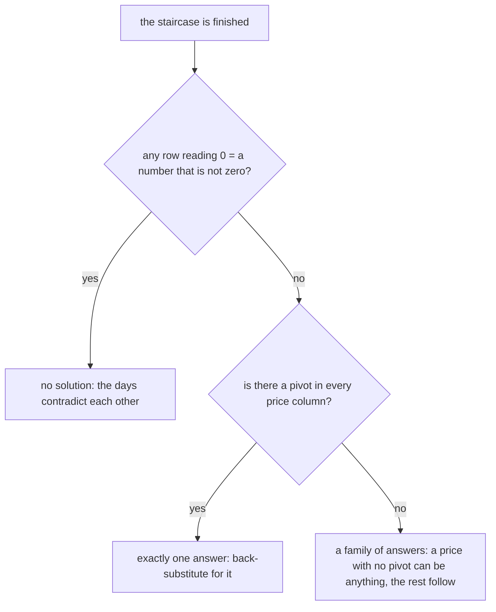

# Gaussian elimination: three legal row moves turn any system into a staircase you can read off from the bottom

[Syllabus](../../../SYLLABUS.md) → [Algebra](../README.md) → [Solving Systems](../README.md#s05) → Gaussian elimination

---

## General Overview

A cafe sells coffee, pastries and sandwiches. The price board is gone. What survives is three days of till slips: what sold, and the money taken.

- Monday: 2 coffees, 1 pastry, 1 sandwich. $17.
- Tuesday: 1 coffee, 1 pastry. $7.
- Wednesday: 1 coffee, 2 pastries, 2 sandwiches. $22.

Three prices are missing: c for a coffee, p for a pastry, s for a sandwich. The three days say:

- 2c + p + s = 17
- c + p = 7
- c + 2p + 2s = 22

No line can be solved alone; each holds more than one unknown. But half of Tuesday — half a coffee, half a pastry, half the money — is still true, and taking it from Monday cancels the coffees. Repeat, and the unknowns fall away until a line holds one price: the sandwich, $6. That is Gaussian elimination, which direct solvers run.

**Take whole equations away from one another until the bottom line holds one price, then climb back up filling in each price as it appears.**

**What kind of fact this is:** a method, resting on a theorem proved below in Why it works: the row moves change no solution.

### The picture: the three days, cleared out

Each row is a day: the counts, then the money, divided off by a bar — an **augmented matrix**. Clearing leaves a staircase of zeros.

| Row | coffees | pastries | sandwiches | total |
| --- | --- | --- | --- | --- |
| top, Monday untouched | 2 | 1 | 1 | 17 |
| middle | 0 | 0.5 | -0.5 | -1.5 |
| bottom | 0 | 0 | 3 | 18 |

The bottom row is one plain sentence: 3 sandwiches' worth is $18. Every row is still true of those three days.

---

## The formula

Three row moves are legal, and only three — the **elementary row operations**. Each is reversible, so no answer is created and none lost.

1. **Swap** two rows. Their order is nothing to the days.
2. **Scale** a row by any number except zero. Doubling both sides says the same thing.
3. **Take a multiple of one row away from a different row.** The clearing row is untouched.

The third move is the engine:

**new row i = row i − m × row k, where m = (the entry to be cleared) ÷ (the pivot)**

Row k clears, row i gets cleared. The **pivot** is row k's leading number: its first entry that is not zero.

**Read it aloud:** take away as many copies of the row above as it takes to kill the entry aimed at.

Column by column, that builds the staircase, whose real name is **row echelon form**: each pivot right of the one above, everything below a pivot zero. Reading it back is **back substitution**: each row's total, less its counts times the prices already found, divided by its pivot. With nothing below it, the bottom row is just total ÷ pivot.

| Symbol | Plain meaning | In our example | Push it up and the answer… |
| --- | --- | --- | --- |
| $c$, $p$, $s$ | the prices of one coffee, one pastry, one sandwich, in dollars | $4, $3, $6 | push one up and every total holding it climbs; Tuesday holds no sandwich, so its total stays |
| $A$, $b$, $x$ | the counts, a row per day (3 × 3); the totals; the prices as a column | `[[2, 1, 1], [1, 1, 0], [1, 2, 2]]`, (17, 7, 22), (4, 3, 6) | all three totals doubled, and the prices double |
| $m$ | the multiplier for one row move | 0.5, then 0.5, then 3 | wrong, and the entry aimed at survives |

Counts $A$ times prices $x$ give totals $b$, the matrix equation of [Solving A x = b](01-matrix-equation-ax-b.md). Elimination works on both: the money rides on the end of every row.

### When it holds

- **A pivot for every unknown.** Three prices need three pivots; with fewer, the staircase gives a family of price lists or none, never one.
- **A pivot that is not zero.** Dividing by a zero pivot stops the method; move one swaps a lower row up at no cost.
- **Counts times fixed prices, added up.** A two-for-one offer bends Monday's total, and a midweek price change makes the rows about different unknowns.
- **Exact arithmetic, or a guard.** These zero tests are exact; measured decimals leave a cleared entry near zero, not on it, so solvers pivot on the column's largest entry.

---

## Why it works

### Step 0: every move has a way back, so no answer moves

Half of Tuesday is true, so Monday minus half of Tuesday is true: taking true equations from one another leaves a true equation, and every price list fitting the old rows fits the new ones. Nothing is lost.

That is one direction. Add the half back and Tuesday returns; a swap undoes itself; a scaling by any number but zero is undone by dividing. Every move runs backwards, so nothing is gained: the staircase has exactly the solutions the till slips had.

<details>
<summary>Detailed proof: the algebra of move three</summary>

Row i becomes row i − m × row k, k not i; other rows are untouched. A list fitting the old rows makes row i and row k hit their totals, so it makes row i − m × row k hit (row i's total) − m × (row k's total): the new row's total. And (row i − m × row k) + m × row k is row i, so a list fitting the new rows hits the old total. Each solution set sits inside the other.

</details>

### Step 1: clear the coffee from the rows below

The top row's pivot is 2, Monday's coffees. Tuesday and Wednesday each have 1, so m is 1 ÷ 2 = 0.5 for both and each becomes itself minus half of Monday. Both new rows start with 0 and speak only of pastries and sandwiches.

### Step 2: do it again on what is left

Ignore the top row; it has done its job. The middle now has 0.5 pastries and the bottom 1.5, so m is 1.5 ÷ 0.5 = 3 and three copies of the middle come off the bottom: `[0, 0, 3 | 18]`, 3 sandwiches for $18.

<details>
<summary>What if the pivot is zero?</summary>

Nothing can be divided by it. Swap that row with one below that has a number in that spot — move one, at no cost. Solvers swap even for a small pivot, since dividing by a tiny number turns small rounding errors large; the column's biggest entry in the pivot seat is **partial pivoting**. Stored and reused, this is LU factorisation: LU with partial pivoting.

</details>

### Step 3: read it back from the bottom

The bottom row gives the sandwich. Put it into the middle row and the pastry falls out; both into the top row, and the coffee falls out.

### Step 4: the shape of the staircase counts the answers

Before a single division, the staircase says how many answers exist: here three pivots, one per price, the good case.



The left branch is a row like `[0, 0, 0 | 1]`: nothing times any price is $1. The right leaves a price column with no pivot, here through `[0, 0, 0 | 0]`, one day being a combination of the others. One such column gives a line of price lists, two a plane.

The count of pivots is the **rank**, which [Rank and nullity](05-rank-nullity.md) is built on. A second route builds the matrix that undoes $A$: [The inverse matrix](03-inverse-matrix.md).

---

## Worked numbers, by hand

| Step | Arithmetic | Value |
| --- | --- | --- |
| start | the till slips | `[2, 1, 1 \| 17]  [1, 1, 0 \| 7]  [1, 2, 2 \| 22]` |
| middle − 0.5 × top | m is 1 ÷ 2; 7 − 0.5 × 17 | `[0, 0.5, -0.5 \| -1.5]` |
| bottom − 0.5 × top | m is 0.5 again; 22 − 0.5 × 17 | `[0, 1.5, 1.5 \| 13.5]` |
| bottom − 3 × middle | m is 1.5 ÷ 0.5; 13.5 − 3 × (−1.5) | `[0, 0, 3 \| 18]` |
| bottom row | 18 ÷ 3 | **s = 6** |
| middle row | 0.5 pastries less 0.5 × 6 is −1.5, so 0.5 pastries is 1.5 | **p = 3** |
| top row | 2 coffees = 17 − 3 − 6, halved | **c = 4** |

A sandwich is $6, a pastry $3, a coffee $4. Against the till: 2 × 4 + 3 + 6 = 17, 4 + 3 = 7, 4 + 2 × 3 + 2 × 6 = 22. Those fit; the three pivots, reached by moves that lose nothing, prove nothing else does.

### What breaks if you drop a piece

| Mistake | Comes out at | What went wrong |
| --- | --- | --- |
| The move done to the counts, not the money | c = 4, p = 11.5, s = -2.5 | A row is one whole equation |
| Wednesday's slip is Monday's plus Tuesday's, total 24 | bottom row `[0, 0, 0 \| 0]` | Nothing new, so a line of prices fits: (4, 3, 6) and (3, 4, 7) |
| The same Wednesday, misread as 25 | bottom row `[0, 0, 0 \| 1]` | The days contradict each other |

The code prints all three.

---

## Code, from first principles, and it actually runs

Nothing is imported. Road one is the method: pick a pivot, clear the rows below, print every move, back-substitute from the bottom. Road two tries every whole-dollar price list from $0 to $12, keeping those that fit all three days. One survives, the same one — a check on this example, while the three pivots rule out any other list, whole dollars or not. It also recombines the days so the top row has no coffee, forcing a swap, and runs the broken Wednesdays.

### Python

```python
# Gaussian elimination -- the check behind the card.  Nothing is imported.
# Three days at one cafe: 2c + p + s = 17, c + p = 7, c + 2p + 2s = 22, with c, p, s
# the prices of a coffee, a pastry and a sandwich.  A row is a day: counts, then total.
DAYS = [[2, 1, 1, 17], [1, 1, 0, 7], [1, 2, 2, 22]]
def num(v): return f"{0.0 if v == 0 else v:g}"       # -0.0 and 0.0 both print as 0
def row_text(r): return "[" + ", ".join(num(v) for v in r[:3]) + " | " + num(r[3]) + "]"
def show(tag, R): print(f"{tag:<14}" + "  ".join(row_text(r) for r in R))
def eliminate(rows, talk=False):
    R = [[float(v) for v in r] for r in rows]        # work on a copy
    pivots, row = [], 0
    if talk: show("start", R)
    for col in range(3):
        piv = next((i for i in range(row, 3) if R[i][col] != 0), None)
        if piv is None: continue                     # no pivot in this column
        if piv != row:
            R[row], R[piv] = R[piv], R[row]          # move one: swap
            if talk: show(f"swap R{row + 1} R{piv + 1}", R)
        for i in range(row + 1, 3):                  # move three: take away a multiple
            if R[i][col] == 0: continue
            m = R[i][col] / R[row][col]
            R[i] = [R[i][j] - m * R[row][j] for j in range(4)]
            if talk: show(f"R{i + 1} - ({num(m)}) R{row + 1}", R)
        pivots.append(R[row][col])
        row += 1
    return R, pivots
def back(R):                                         # bottom row first, then up
    s = R[2][3] / R[2][2]
    p = (R[1][3] - R[1][2] * s) / R[1][1]
    c = (R[0][3] - R[0][1] * p - R[0][2] * s) / R[0][0]
    return c, p, s
def hunt(rows):        # second road: every whole-dollar price list from $0 to $12
    return [(a, b, d) for a in range(13) for b in range(13) for d in range(13) if all(r[0] * a + r[1] * b + r[2] * d == r[3] for r in rows)]
print("three days:  2c + p + s = 17,  c + p = 7,  c + 2p + 2s = 22")
R, piv = eliminate(DAYS, talk=True)
c, p, s = back(R)
print(f"pivots {', '.join(num(v) for v in piv)}: three pivots, three unknowns, one answer")
print(f"back from the bottom: s = {num(s)}, p = {num(p)}, c = {num(c)}")
print("prices put back into the three days: " + ", ".join(num(r[0]*c + r[1]*p + r[2]*s) for r in DAYS))
hits = hunt(DAYS)
print(f"whole dollars from $0 to $12 fitting all three days: {len(hits)}, {hits[0]}")
print()
OTHER = [[0, 1, 1, 9], [2, 1, 1, 17], [1, 1, 0, 7]]  # the days recombined: (2 x Wed - Mon) / 3 on top
c2, p2, s2 = back(eliminate(OTHER)[0])
print(f"days recombined, no coffee on top: a swap is forced, c = {num(c2)}, p = {num(p2)}, s = {num(s2)}")
LINE = [[2, 1, 1, 17], [1, 1, 0, 7], [3, 2, 1, 24]]  # day three is day one plus day two
NONE = [[2, 1, 1, 17], [1, 1, 0, 7], [3, 2, 1, 25]]  # the same day, total misread by $1
for tag, rows in (("day three is day one plus day two, 24", LINE), ("the same days, that total misread as 25", NONE)):
    Rd = eliminate(rows)[0]
    print(f"{tag:<40}bottom row {row_text(Rd[2])}, {'no solution' if Rd[2][3] else 'a line of answers'}")
many = hunt(LINE)
print(f"whole dollars fitting the 24 version: {len(many)}, among them {many[4]} and {many[3]}")
print()
BAD = [DAYS[0], [DAYS[1][j] - 0.5 * DAYS[0][j] for j in range(3)] + [DAYS[1][3]], DAYS[2]]
cb, pb, sb = back(eliminate(BAD)[0])
print(f"wrong, total left out of R2 - (0.5) R1: c = {num(cb)}, p = {num(pb)}, s = {num(sb)}")
assert hits == [(4, 3, 6)] and (c, p, s) == (4.0, 3.0, 6.0) and piv == [2.0, 0.5, 3.0]
assert [r[0]*c + r[1]*p + r[2]*s for r in DAYS] == [17, 7, 22]
assert (c2, p2, s2) == (c, p, s) and len(many) == 8
assert eliminate(LINE)[0][2] == [0, 0, 0, 0] and eliminate(NONE)[0][2] == [0, 0, 0, 1]
print("ALL CHECKS PASS")
```

**Ran 2026-09-19 on macOS, Python 3.14.6, standard library only. All checks passed. Output, pasted from the run:**

```
three days:  2c + p + s = 17,  c + p = 7,  c + 2p + 2s = 22
start         [2, 1, 1 | 17]  [1, 1, 0 | 7]  [1, 2, 2 | 22]
R2 - (0.5) R1 [2, 1, 1 | 17]  [0, 0.5, -0.5 | -1.5]  [1, 2, 2 | 22]
R3 - (0.5) R1 [2, 1, 1 | 17]  [0, 0.5, -0.5 | -1.5]  [0, 1.5, 1.5 | 13.5]
R3 - (3) R2   [2, 1, 1 | 17]  [0, 0.5, -0.5 | -1.5]  [0, 0, 3 | 18]
pivots 2, 0.5, 3: three pivots, three unknowns, one answer
back from the bottom: s = 6, p = 3, c = 4
prices put back into the three days: 17, 7, 22
whole dollars from $0 to $12 fitting all three days: 1, (4, 3, 6)

days recombined, no coffee on top: a swap is forced, c = 4, p = 3, s = 6
day three is day one plus day two, 24   bottom row [0, 0, 0 | 0], a line of answers
the same days, that total misread as 25 bottom row [0, 0, 0 | 1], no solution
whole dollars fitting the 24 version: 8, among them (4, 3, 6) and (3, 4, 7)

wrong, total left out of R2 - (0.5) R1: c = 4, p = 11.5, s = -2.5
ALL CHECKS PASS
```

### Rust

Built with `rustc --edition 2021 -O`.

```rust
// Gaussian elimination -- the same check as the Python, in Rust.  No crates.  Three days
// at one cafe: 2c + p + s = 17, c + p = 7, c + 2p + 2s = 22, with c, p, s the prices of a
// coffee, a pastry and a sandwich.  A row is a day: the three counts, then that day's total.
type Rows = Vec<Vec<f64>>;
fn rows_of(v: [[f64; 4]; 3]) -> Rows { v.iter().map(|r| r.to_vec()).collect() }
fn num(v: f64) -> String { if v == 0.0 { "0".to_string() } else { format!("{}", v) } }
fn row_text(r: &[f64]) -> String { format!("[{}, {}, {} | {}]", num(r[0]), num(r[1]), num(r[2]), num(r[3])) }
fn show(tag: &str, m: &Rows) { println!("{:<14}{}", tag, m.iter().map(|r| row_text(r)).collect::<Vec<_>>().join("  ")); }
fn eliminate(rows: &Rows, talk: bool) -> (Rows, Vec<f64>) {
    let mut m: Rows = rows.clone();                  // work on a copy
    let (mut pivots, mut row): (Vec<f64>, usize) = (Vec::new(), 0);
    if talk { show("start", &m); }
    for col in 0..3 {
        let piv = match (row..3).find(|&i| m[i][col] != 0.0) { Some(i) => i, None => continue };  // no pivot here
        if piv != row {
            m.swap(row, piv);                        // move one: swap
            if talk { show(&format!("swap R{} R{}", row + 1, piv + 1), &m); }
        }
        let top = m[row].clone();
        for i in row + 1..3 {                        // move three: take away a multiple
            if m[i][col] == 0.0 { continue; }
            let f = m[i][col] / top[col];
            for j in 0..4 { m[i][j] -= f * top[j]; }
            if talk { show(&format!("R{} - ({}) R{}", i + 1, num(f), row + 1), &m); }
        }
        pivots.push(m[row][col]);
        row += 1;
    }
    (m, pivots)
}
fn back(r: &Rows) -> (f64, f64, f64) {               // bottom row first, then up
    let s = r[2][3] / r[2][2];
    let p = (r[1][3] - r[1][2] * s) / r[1][1];
    let c = (r[0][3] - r[0][1] * p - r[0][2] * s) / r[0][0];
    (c, p, s)
}
fn hunt(rows: &Rows) -> Vec<(i32, i32, i32)> {       // second road: whole dollars, $0 to $12
    let mut out = Vec::new();
    for a in 0..13 { for b in 0..13 { for d in 0..13 {
        if rows.iter().all(|r| r[0] * a as f64 + r[1] * b as f64 + r[2] * d as f64 == r[3]) { out.push((a, b, d)); }
    }}}
    out
}
fn trip(t: (i32, i32, i32)) -> String { format!("({}, {}, {})", t.0, t.1, t.2) }
fn main() {
    let days = rows_of([[2.0, 1.0, 1.0, 17.0], [1.0, 1.0, 0.0, 7.0], [1.0, 2.0, 2.0, 22.0]]);
    println!("three days:  2c + p + s = 17,  c + p = 7,  c + 2p + 2s = 22");
    let (r, piv) = eliminate(&days, true);
    let (c, p, s) = back(&r);
    let pivs: Vec<String> = piv.iter().map(|v| num(*v)).collect();
    println!("pivots {}: three pivots, three unknowns, one answer", pivs.join(", "));
    println!("back from the bottom: s = {}, p = {}, c = {}", num(s), num(p), num(c));
    let put: Vec<String> = days.iter().map(|d| num(d[0] * c + d[1] * p + d[2] * s)).collect();
    println!("prices put back into the three days: {}", put.join(", "));
    let hits = hunt(&days);
    println!("whole dollars from $0 to $12 fitting all three days: {}, {}", hits.len(), trip(hits[0]));
    println!();
    let other = rows_of([[0.0, 1.0, 1.0, 9.0], [2.0, 1.0, 1.0, 17.0], [1.0, 1.0, 0.0, 7.0]]);
    let (c2, p2, s2) = back(&eliminate(&other, false).0);   // the days recombined: (2 x Wed - Mon) / 3 on top
    println!("days recombined, no coffee on top: a swap is forced, c = {}, p = {}, s = {}", num(c2), num(p2), num(s2));
    let line = rows_of([[2.0, 1.0, 1.0, 17.0], [1.0, 1.0, 0.0, 7.0], [3.0, 2.0, 1.0, 24.0]]);
    let none = rows_of([[2.0, 1.0, 1.0, 17.0], [1.0, 1.0, 0.0, 7.0], [3.0, 2.0, 1.0, 25.0]]);
    for (tag, rows) in [("day three is day one plus day two, 24", &line), ("the same days, that total misread as 25", &none)] {
        let rd = eliminate(rows, false).0;
        let verdict = if rd[2][3] != 0.0 { "no solution" } else { "a line of answers" };
        println!("{:<40}bottom row {}, {}", tag, row_text(&rd[2]), verdict);
    }
    let many = hunt(&line);
    println!("whole dollars fitting the 24 version: {}, among them {} and {}", many.len(), trip(many[4]), trip(many[3]));
    println!();
    let bad = rows_of([[2.0, 1.0, 1.0, 17.0], [0.0, 0.5, -0.5, 7.0], [1.0, 2.0, 2.0, 22.0]]);
    let (cb, pb, sb) = back(&eliminate(&bad, false).0);
    println!("wrong, total left out of R2 - (0.5) R1: c = {}, p = {}, s = {}", num(cb), num(pb), num(sb));
    assert!(hits == vec![(4, 3, 6)] && (c, p, s) == (4.0, 3.0, 6.0) && piv == vec![2.0, 0.5, 3.0]);
    assert!(days.iter().map(|d| d[0] * c + d[1] * p + d[2] * s).collect::<Vec<f64>>() == vec![17.0, 7.0, 22.0]);
    assert!((c2, p2, s2) == (c, p, s) && many.len() == 8);
    assert!(eliminate(&line, false).0[2] == vec![0.0, 0.0, 0.0, 0.0] && eliminate(&none, false).0[2] == vec![0.0, 0.0, 0.0, 1.0]);
    println!("ALL CHECKS PASS");
}
```

**Ran 2026-09-19 on macOS, rustc 1.98.1, no crates. All checks passed. Output, pasted from the run:**

```
three days:  2c + p + s = 17,  c + p = 7,  c + 2p + 2s = 22
start         [2, 1, 1 | 17]  [1, 1, 0 | 7]  [1, 2, 2 | 22]
R2 - (0.5) R1 [2, 1, 1 | 17]  [0, 0.5, -0.5 | -1.5]  [1, 2, 2 | 22]
R3 - (0.5) R1 [2, 1, 1 | 17]  [0, 0.5, -0.5 | -1.5]  [0, 1.5, 1.5 | 13.5]
R3 - (3) R2   [2, 1, 1 | 17]  [0, 0.5, -0.5 | -1.5]  [0, 0, 3 | 18]
pivots 2, 0.5, 3: three pivots, three unknowns, one answer
back from the bottom: s = 6, p = 3, c = 4
prices put back into the three days: 17, 7, 22
whole dollars from $0 to $12 fitting all three days: 1, (4, 3, 6)

days recombined, no coffee on top: a swap is forced, c = 4, p = 3, s = 6
day three is day one plus day two, 24   bottom row [0, 0, 0 | 0], a line of answers
the same days, that total misread as 25 bottom row [0, 0, 0 | 1], no solution
whole dollars fitting the 24 version: 8, among them (4, 3, 6) and (3, 4, 7)

wrong, total left out of R2 - (0.5) R1: c = 4, p = 11.5, s = -2.5
ALL CHECKS PASS
```

> [!TIP]
> **Try changing**
> Guess first, then run it. The asserts are pinned to these three days, so expect one to stop it.
> - **Reorder the days.** Tuesday's row `[1, 1, 0, 7]` at the top of `DAYS`: same prices, different pivots, first assert stops it.
> - **A dollar more on Wednesday.** The last 22 becomes 23: three pivots still, one answer still, but no whole dollars fit, so the run stops at its first hit.
> - **Wednesday a copy of Monday.** Third row `[2, 1, 1, 17]`: two pivots, a bottom row of `[0, 0, 0 | 0]`, and back substitution divides by zero — Python stops there, Rust returns NaN and an assert stops it.

---

## The usual mistake

> [!warning]
> **Treating a row as a list of counts instead of a whole equation.** The money on the end is part of the row. Clear the coffees out of Tuesday but leave its $7 alone and the staircase still looks perfect — three pivots, an answer at the bottom — and that answer is a coffee at $4, a pastry at $11.5, a sandwich at −$2.5. The negative sandwich is the only clue.
>
> - **Multiplying a row by zero.** The row becomes 0 = 0 and its fact is gone.
> - **Dividing by a zero pivot.** Swap a row up from below first.
> - **Reading the staircase from the top.** That row still holds three unknown prices; only the bottom holds one.
> - **Seeing `[0, 0, 0 | 0]` as "no solution".** It rules nothing out, so a line of price lists fits.

---

## Where you meet it in real life

- **Numerical libraries.** Dense solvers run these moves, packaged for reuse on many sets of totals (LU with partial pivoting).
- **Circuits.** One equation per loop of wire, one unknown current per branch (Kirchhoff's laws).
- **Balancing a chemical equation.** One equation per element, one unknown per compound, usually with one left free.
- **Deciding whether data says anything.** A row of zeros means one measurement repeated another — the verdict starting [Rank and nullity](05-rank-nullity.md).

> **Say it back**
> Three days of till slips give three equations and three unknown prices. Take multiples of one row from another until a price disappears from the rows below, one column at a time. Nothing is lost or gained, since every move can be undone. The bottom step then holds one unknown: 3 sandwiches for $18, a sandwich $6. Fed up the staircase, it gives $3 for the pastry and $4 for the coffee.

---

## What this builds on

- [Solving A x = b](01-matrix-equation-ax-b.md): the system as one equation, and the three possible outcomes.

## Where this goes next

- [The inverse matrix](03-inverse-matrix.md): these same moves build the counts' undo.
- [Rank and nullity](05-rank-nullity.md): the pivot count as rank, the rest free directions.
- [Finite differences](../../08-Differential%20equations%20and%20dynamics/07-Series%20Solutions%20and%20Boundary%20Problems/07-finite-differences-for-boundary-problems.md): a curve's values as one system.
- [Bootstrapping](../../12-Financial%20mathematics/02-Curves/04-bootstrapping-the-discount-curve.md): bond prices, one maturity at a time.
- [Pricing on a grid](../../12-Financial%20mathematics/06-Numerical%20Methods%20for%20Pricing/07-finite-differences-for-the-black-scholes-equation.md): option prices on a grid.
- [Vanna-volga pricing](../../12-Financial%20mathematics/22-The%20FX%20smile%20-%20risk%20reversals%2C%20butterflies%20and%20vanna-volga/04-vanna-volga-pricing.md): three quotes, three weights.
- Kirchhoff's laws: currents in a circuit.
- LU with partial pivoting: the multipliers kept and reused.
- Smith normal form: the moves over whole numbers.
- The persistence algorithm: elimination on shapes.
- Smith normal form: one canonical staircase.

The staircase is thrown away once these days are answered; keeping the moves, so tomorrow's takings cost one multiplication, is [The inverse matrix](03-inverse-matrix.md).

---

## Sources

Verified 19 Sep 2026; every link below resolves to the publisher's page.

- Grcar, Joseph F. "How ordinary elimination became Gaussian elimination." *Historia Mathematica* 38, no. 2 (2011): 163–218. [doi:10.1016/j.hm.2010.06.003](https://doi.org/10.1016/j.hm.2010.06.003). How schoolbook elimination became the matrix method.
- Grcar, Joseph F. "Mathematicians of Gaussian Elimination." *Notices of the American Mathematical Society* 58, no. 6 (2011): 782–792. [Publisher PDF](https://www.ams.org/journals/notices/201106/rtx110600782p.pdf). Who did what; little of it was Gauss.
- *Algebra and Trigonometry 2e*, section 11.6, "Solving Systems with Gaussian Elimination." OpenStax, Rice University. [Textbook page](https://openstax.org/books/algebra-and-trigonometry-2e/pages/11-6-solving-systems-with-gaussian-elimination). Free, current, with worked 3 by 3 systems.
- Strang, Gilbert. *Introduction to Linear Algebra*, 6th ed. Wellesley-Cambridge Press, 2023. [Book page](https://math.mit.edu/~gs/linearalgebra/ila6/indexila6.html). The standard course text; elimination opens it.
