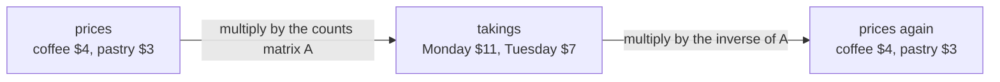

# The inverse matrix: the matrix that undoes another, the 2 by 2 formula, and when no inverse exists

[Syllabus](../../../SYLLABUS.md) → [Algebra](../README.md) → [Solving Systems](../README.md#s05) → The inverse matrix

---

## General Overview

A cafe sells coffee and pastries. Monday: 2 coffees and 1 pastry, $11 in the till. Tuesday: 1 coffee and 1 pastry, $7. The counts go into a matrix — numbers written row by row in square brackets, a row per day: `[[2, 1], [1, 1]]`.

That matrix is a machine: feed it the prices — (4, 3), a coffee at $4, a pastry at $3, in round brackets — and out come the takings, (11, 7).

The cafe has the takings and wants the prices: run the machine backwards.

One matrix does that: `[[1, -1], [-1, 2]]`. Feed it (11, 7) and out come (4, 3): one multiply, no elimination. It is the inverse of the counts matrix. Not every matrix has one — `[[2, 4], [1, 2]]` does not, and no work will produce one. A square matrix with an inverse is **invertible**; one without is **singular**.

**An inverse matrix is an undo button: run the first matrix, then run its inverse, and everything is back where it started.**

**What kind of fact this is:** a definition; the 2 by 2 formula and the existence test are theorems, proved on this card in Why it works.

### The picture: there and back again



One round trip, nothing moved.

---

## The formula

The inverse of a square matrix $A$ is written $A^{-1}$, read "A inverse". The raised minus one is a power, not each entry's reciprocal. Two matrices are inverses when multiplying them, either way round, changes nothing:

$$A A^{-1} = I \qquad \text{and} \qquad A^{-1} A = I$$

$I$ is the identity: ones down the main diagonal, zeros elsewhere — `[[1, 0], [0, 1]]` at 2 by 2, the do-nothing matrix. At most one matrix undoes $A$, so "the" inverse is safe.

For a 2 by 2 — $A$ = `[[p, q], [r, s]]`, with $p$ and $q$ on top — the inverse is one line:

$$\det A = ps - qr \qquad\qquad A^{-1} = \frac{1}{ps - qr}\;[[\,s,\; -q\,],\; [\,-r,\; p\,]]$$

**Read it aloud:** swap the main diagonal, flip the sign of the other two, divide every entry by ps − qr.

That ps − qr is the **determinant**, $\det A$: not zero and the formula works, zero and it divides by zero. [Determinants](04-determinants.md) takes it apart.

| Symbol | Plain meaning | In our example | Push it up and the answer… |
| --- | --- | --- | --- |
| $A$ | the counts: a row per day, a column per item | `[[2, 1], [1, 1]]` | every price shifts |
| $A^{-1}$ | the matrix that undoes $A$ | `[[1, -1], [-1, 2]]` | — |
| $I$ | the identity: ones on the diagonal, zeros off | `[[1, 0], [0, 1]]` | — |
| $p$, $q$, $r$, $s$ | the four entries, row by row | 2, 1, 1, 1 | the determinant moves too |
| $\det A$ | ps − qr: zero or not decides everything | 1 | toward zero, the inverse blows up |
| $b$ | the takings — what you know | (11, 7) | the prices scale with it |
| $x$ | the prices — what you want | (4, 3) | — |

The payoff: the system $A x = b$ from [Solving A x = b](01-matrix-equation-ax-b.md), counts times unknown prices equals known takings, is one multiply from solved.

$$A x = b \qquad \text{becomes} \qquad x = A^{-1} b$$

Multiply on the left by $A^{-1}$: $A^{-1} A$ is $I$, and $I$ times $x$ is $x$.

### When it holds

- **Square: as many rows as columns.** A 2 by 3 matrix turns three prices into two takings, and two numbers cannot pin down three ([Least squares](../06-Dot%20Products%20and%20Best%20Fits/04-least-squares.md) fits those).
- **A nonzero determinant.** At zero the idea fails, not just the formula: two price lists then share one set of takings.
- **Numbers that divide.** On a clock the determinant needs an inverse there too: 2 is not zero mod 4, yet nothing multiplies it to 1 ([The modular inverse](../../02-Number%20theory/03-Clock%20Arithmetic/04-modular-inverse.md)).
- **Inputs exact enough.** With measured takings, a determinant small beside the entries makes the prices swing on rounding (Matrix norms and the condition number).

---

## Why it works

### Step 0: undoing needs a target

"Undo" needs a state to return to. For matrices it is $I$: doing $A$, then $A^{-1}$, must add up to doing nothing.

### Step 1: swapping and flipping leaves a plain number

Take $A$ = `[[p, q], [r, s]]`, swap the diagonal, flip the other two's signs, and multiply row by column ([Matrix multiplication](../04-Matrices/03-matrix-multiplication.md)):

- the diagonal comes out ps − qr twice: p × s + q × (−r) top left, r × (−q) + s × p bottom right
- the other two cancel: p × (−q) + q × p = 0 and r × s + s × (−r) = 0

$$[[\,p,\; q\,],\; [\,r,\; s\,]] \times [[\,s,\; -q\,],\; [\,-r,\; p\,]] = (ps - qr)\,I$$

Swap-and-flip does not quite undo $A$: it leaves ps − qr on the diagonal.

### Step 2: divide, and the formula is proved

Divide every entry by ps − qr and exactly $I$ is left. The other order pairs the same numbers, so it gives $I$ too: a genuine two-sided undo whenever ps − qr is not zero.

<details>
<summary>Detailed proof: why the inverse is unique</summary>

Suppose two matrices each undo $A$ on both sides, and multiply three in a row: the first, $A$, the second. Grouping the first pair leaves the second; grouping the last pair leaves the first. One product, so the two are equal.

</details>

The cafe: 2 × 1 − 1 × 1 = 1, not zero, so the inverse exists. For `[[2, 4], [1, 2]]`: 2 × 2 − 4 × 1 = 0, and its swap-and-flip times it is `[[0, 0], [0, 0]]`, which no division rescues. A failed formula is not yet proof that nothing works; Step 3 supplies that.

### Step 3: three ways of saying "this one has an inverse"

For a square matrix these agree: if one fails, all fail.

- the determinant is not zero
- no column is a mix of the other columns
- the only price list $A$ sends to all-zero takings is all-zero prices

The third rules out every inverse, not just this formula: if another price list also gave zero takings, no matrix could send those takings back to both. That is the one-to-one test from [Inverse functions](../../01-Foundations/08-Relations%20and%20Functions/05-inverse-functions.md), and [Rank and nullity](05-rank-nullity.md) counts what is lost. A zero determinant always supplies such a list: the columns are then multiples of one another. `[[2, 4], [1, 2]]` fails all three.

### Step 4: bigger than 2 by 2, by Gauss-Jordan on [A | I]

The 2 by 2 trick does not extend by shuffling entries. Write $A$ and the identity side by side as one wide block, [A | I], and run the row moves from [Gaussian elimination](02-gaussian-elimination.md) across the full width until the left half is the identity — **Gauss-Jordan elimination**. The right half is then $A^{-1}$; a column with no pivot means no inverse.

Each row move is a multiply on the left by a small matrix, so the run is one matrix; it turns $A$ into $I$, so it is $A^{-1}$. Applied to the identity, the same moves build $A^{-1}$.

Reusing one elimination is less work than forming $A^{-1}$, even for many days' takings.

<details>
<summary>Cramer's rule, the 2 by 2 shortcut</summary>

Each unknown is one determinant over another: replace a column of $A$ with the takings, divide that determinant by $\det A$. With $\det A$ = 1: `[[11, 1], [7, 1]]` gives 11 × 1 − 1 × 7 = 4, the coffee; `[[2, 11], [1, 7]]` gives 2 × 7 − 11 × 1 = 3, the pastry. Past 2 by 2 the work outgrows the payoff.

</details>

---

## Worked numbers, by hand

| Step | Arithmetic | Value |
| --- | --- | --- |
| the determinant | 2 × 1 − 1 × 1 | 1 |
| swap the main diagonal | the 2 and bottom-right 1 swap | `[[1, 1], [1, 2]]` |
| flip the other two's signs | both 1s pick up a minus | `[[1, -1], [-1, 2]]` |
| divide by the determinant | each entry divided by 1 | **`[[1, -1], [-1, 2]]`** |
| check it undoes A | A times that matrix | `[[1, 0], [0, 1]]` |
| the coffee price | 1 × 11 + (−1) × 7 | **4** |
| the pastry price | (−1) × 11 + 2 × 7 | **3** |

A coffee is $4, a pastry $3, no elimination. The same inverse serves any later day on these counts.

Three items now. Sandwiches join, so three days are needed: 2 coffees, 1 pastry, 1 sandwich; one of each; 1 coffee, 2 pastries, 1 sandwich. Counts `[[2, 1, 1], [1, 1, 1], [1, 2, 1]]`, takings (17, 13, 16). Set them beside `[[1, 0, 0], [0, 1, 0], [0, 0, 1]]`, run row moves until the left half is the identity, and the right half comes out **`[[1, -1, 0], [0, -1, 1], [-1, 3, -1]]`** — times (17, 13, 16) it gives **(4, 3, 6)**: a coffee $4, a pastry $3, a sandwich $6.

### What breaks if you drop a piece

| Mistake | Comes out at | What went wrong |
| --- | --- | --- |
| Flip the signs, no swap | prices (15, -4) | a pastry at minus $4 gives it away |
| Swap the diagonal, no minus signs | prices (18, 25) | the rows reinforce, not cancel |
| Skip the divide, three items, determinant −1 | prices (-4, -3, -6) | dividing by −1 flips every sign |
| Try it on `[[2, 4], [1, 2]]` | no answer at all | swap-and-flip times it is `[[0, 0], [0, 0]]` |

The code prints all four.

---

## Code, from first principles, and it actually runs

Nothing is imported. The cafe's 2 by 2 is inverted by two roads that must agree: swap-negate-divide, and Gauss-Jordan on [A | I]. Cramer's rule reaches the prices a third way; multiplying them back by the counts returns the takings. The same Gauss-Jordan does the three-item matrix and refuses the singular one.

### Python

```python
# The inverse matrix -- the check behind the card.  Nothing is imported.  The cafe's
# counts matrix is inverted two ways: by the 2 by 2 swap-negate-divide formula, and by
# Gauss-Jordan on [A | I], the road that also handles the three-item matrix.
A2 = [[2.0, 1.0], [1.0, 1.0]]        # Mon: 2 coffees + 1 pastry.  Tue: 1 and 1.
B2 = [11.0, 7.0]                     # what the till held on those two days
A3 = [[2.0, 1.0, 1.0], [1.0, 1.0, 1.0], [1.0, 2.0, 1.0]]   # three days, three items
B3 = [17.0, 13.0, 16.0]              # the three days' takings, in dollars
S = [[2.0, 4.0], [1.0, 2.0]]         # the singular one: row two is half of row one
def num(v):  return f"{v if abs(v) > 1e-9 else 0.0:.0f}"   # tiny float dust prints as 0
def mat(m):  return "[" + ", ".join("[" + ", ".join(num(v) for v in r) + "]" for r in m) + "]"
def vec(v):  return "(" + ", ".join(num(x) for x in v) + ")"
def near(u, w): return all(abs(a - b) < 1e-9 for a, b in zip(u, w))
def mul(a, b): return [[sum(a[i][k] * b[k][j] for k in range(len(b))) for j in range(len(b[0]))] for i in range(len(a))]
def mv(a, v):  return [sum(a[i][k] * v[k] for k in range(len(v))) for i in range(len(a))]
def det2(m):   return m[0][0] * m[1][1] - m[0][1] * m[1][0]
def flip(m):   return [[m[1][1], -m[0][1]], [-m[1][0], m[0][0]]]     # swap and negate
def det3(m):   return (m[0][0] * (m[1][1] * m[2][2] - m[1][2] * m[2][1]) - m[0][1] *
    (m[1][0] * m[2][2] - m[1][2] * m[2][0]) + m[0][2] * (m[1][0] * m[2][1] - m[1][1] * m[2][0]))

def inverse(a):                                        # Gauss-Jordan on [A | I]
    n = len(a)
    m = [list(a[i]) + [1.0 if i == j else 0.0 for j in range(n)] for i in range(n)]
    for c in range(n):
        p = max(range(c, n), key=lambda r: abs(m[r][c]))
        if abs(m[p][c]) < 1e-12: return None           # a flattened column: no inverse
        m[c], m[p] = m[p], m[c]
        d = m[c][c]
        m[c] = [v / d for v in m[c]]
        for r in range(n):
            if r != c:
                f = m[r][c]
                m[r] = [v - f * w for v, w in zip(m[r], m[c])]
    return [row[n:] for row in m]

d2, gj2 = det2(A2), inverse(A2)                        # road two: Gauss-Jordan
formula = [[v / d2 for v in row] for row in flip(A2)]  # road one: swap, negate, divide
x2 = mv(formula, B2)
cram = [det2([[B2[0], A2[0][1]], [B2[1], A2[1][1]]]) / d2, det2([[A2[0][0], B2[0]], [A2[1][0], B2[1]]]) / d2]
print(f"cafe matrix A = {mat(A2)}   determinant = {num(d2)}")
print(f"A^-1 by swap, negate, divide  = {mat(formula)}")
print(f"A^-1 by Gauss-Jordan on [A|I] = {mat(gj2)}")
print(f"A times A^-1 = {mat(mul(A2, formula))}   A^-1 times A = {mat(mul(formula, A2))}")
print(f"takings {vec(B2)} -> prices x = A^-1 b = {vec(x2)}")
print(f"the same prices by Cramer's rule: {vec(cram)}")
print(f"and back the other way, A x = {vec(mv(A2, x2))}")
d3, gj3 = det3(A3), inverse(A3)
x3 = mv(gj3, B3)
print(f"three items, A = {mat(A3)}   determinant = {num(d3)}")
print(f"A^-1 by Gauss-Jordan on [A|I] = {mat(gj3)}")
print(f"A times A^-1 = {mat(mul(A3, gj3))}")
print(f"takings {vec(B3)} -> prices x = {vec(x3)}")
print(f"mistake, no swap: prices come out {vec(mv([[2.0, -1.0], [-1.0, 1.0]], B2))}")
print(f"mistake, no minus signs: prices come out {vec(mv([[1.0, 1.0], [1.0, 2.0]], B2))}")
print(f"mistake, no divide by the determinant: prices come out {vec(mv([[v * d3 for v in r] for r in gj3], B3))}")
print(f"singular {mat(S)}: determinant = {num(det2(S))}, swap-and-flip times it = {mat(mul(flip(S), S))}, no inverse")
assert near(x2, [4.0, 3.0]) and near(cram, [4.0, 3.0]) and near(mv(A2, x2), B2)
assert near(formula[0] + formula[1], gj2[0] + gj2[1]) and near(mul(A2, gj2)[0] + mul(A2, gj2)[1], [1.0, 0.0, 0.0, 1.0])
assert near(x3, [4.0, 3.0, 6.0]) and near(mv(A3, x3), B3) and d3 == -1.0
assert inverse(S) is None and det2(S) == 0.0
print("ALL CHECKS PASS")
```

**Ran 2026-09-19 on macOS, Python 3.14.6, standard library only. All checks passed. Output, pasted from the run:**

```
cafe matrix A = [[2, 1], [1, 1]]   determinant = 1
A^-1 by swap, negate, divide  = [[1, -1], [-1, 2]]
A^-1 by Gauss-Jordan on [A|I] = [[1, -1], [-1, 2]]
A times A^-1 = [[1, 0], [0, 1]]   A^-1 times A = [[1, 0], [0, 1]]
takings (11, 7) -> prices x = A^-1 b = (4, 3)
the same prices by Cramer's rule: (4, 3)
and back the other way, A x = (11, 7)
three items, A = [[2, 1, 1], [1, 1, 1], [1, 2, 1]]   determinant = -1
A^-1 by Gauss-Jordan on [A|I] = [[1, -1, 0], [0, -1, 1], [-1, 3, -1]]
A times A^-1 = [[1, 0, 0], [0, 1, 0], [0, 0, 1]]
takings (17, 13, 16) -> prices x = (4, 3, 6)
mistake, no swap: prices come out (15, -4)
mistake, no minus signs: prices come out (18, 25)
mistake, no divide by the determinant: prices come out (-4, -3, -6)
singular [[2, 4], [1, 2]]: determinant = 0, swap-and-flip times it = [[0, 0], [0, 0]], no inverse
ALL CHECKS PASS
```

### Rust

Same numbers, same labels, built with `rustc --edition 2021 -O`.

```rust
// The inverse matrix -- the same check as the Python, in Rust.  No crates.  The cafe's counts
// matrix is inverted two ways: by the 2 by 2 swap-negate-divide formula, and by Gauss-Jordan
// on [A | I], the road that also handles the three-item matrix.
type Mat = Vec<Vec<f64>>;
fn num(v: f64) -> String { format!("{:.0}", if v.abs() > 1e-9 { v } else { 0.0 }) }   // no float dust
fn mat(m: &Mat) -> String {
    let rows: Vec<String> = m.iter().map(|r|
        format!("[{}]", r.iter().map(|v| num(*v)).collect::<Vec<_>>().join(", "))).collect();
    format!("[{}]", rows.join(", "))
}
fn vec_s(v: &[f64]) -> String { format!("({})", v.iter().map(|x| num(*x)).collect::<Vec<_>>().join(", ")) }
fn near(u: &[f64], w: &[f64]) -> bool { u.iter().zip(w).all(|(a, b)| (a - b).abs() < 1e-9) }
fn mul(a: &Mat, b: &Mat) -> Mat {
    (0..a.len()).map(|i| (0..b[0].len()).map(|j| (0..b.len()).map(|k| a[i][k] * b[k][j]).sum()).collect()).collect()
}
fn mv(a: &Mat, v: &[f64]) -> Vec<f64> {
    (0..a.len()).map(|i| (0..v.len()).map(|k| a[i][k] * v[k]).sum()).collect()
}
fn det2(m: &Mat) -> f64 { m[0][0] * m[1][1] - m[0][1] * m[1][0] }
fn flip(m: &Mat) -> Mat { vec![vec![m[1][1], -m[0][1]], vec![-m[1][0], m[0][0]]] }   // swap and negate
fn det3(m: &Mat) -> f64 { m[0][0] * (m[1][1] * m[2][2] - m[1][2] * m[2][1]) - m[0][1] *
    (m[1][0] * m[2][2] - m[1][2] * m[2][0]) + m[0][2] * (m[1][0] * m[2][1] - m[1][1] * m[2][0]) }

fn inverse(a: &Mat) -> Option<Mat> {                       // Gauss-Jordan on [A | I]
    let n = a.len();
    let mut m: Mat = (0..n).map(|i| { let mut row = a[i].clone();
        for j in 0..n { row.push(if i == j { 1.0 } else { 0.0 }); } row }).collect();
    for c in 0..n {
        let mut p = c;
        for r in c + 1..n { if m[r][c].abs() > m[p][c].abs() { p = r; } }
        if m[p][c].abs() < 1e-12 { return None; }          // a flattened column: no inverse
        m.swap(c, p);
        let d = m[c][c];
        for k in 0..2 * n { m[c][k] /= d; }
        for r in 0..n {
            if r == c { continue; }
            let f = m[r][c];
            for k in 0..2 * n { m[r][k] -= f * m[c][k]; }
        }
    }
    Some((0..n).map(|i| m[i][n..].to_vec()).collect())
}

fn main() {
    let a2: Mat = vec![vec![2.0, 1.0], vec![1.0, 1.0]];    // Mon: 2 coffees + 1 pastry
    let b2 = vec![11.0, 7.0];                              // the two days' takings
    let a3: Mat = vec![vec![2.0, 1.0, 1.0], vec![1.0, 1.0, 1.0], vec![1.0, 2.0, 1.0]];
    let b3 = vec![17.0, 13.0, 16.0];                       // three days, three items
    let s: Mat = vec![vec![2.0, 4.0], vec![1.0, 2.0]];     // the singular one
    let (d2, gj2) = (det2(&a2), inverse(&a2).unwrap());    // road two: Gauss-Jordan
    let formula: Mat = flip(&a2).iter().map(|r| r.iter().map(|v| v / d2).collect()).collect();
    let x2 = mv(&formula, &b2);                            // road one: swap, negate, divide
    let cram = vec![det2(&vec![vec![b2[0], a2[0][1]], vec![b2[1], a2[1][1]]]) / d2,
                    det2(&vec![vec![a2[0][0], b2[0]], vec![a2[1][0], b2[1]]]) / d2];
    println!("cafe matrix A = {}   determinant = {}", mat(&a2), num(d2));
    println!("A^-1 by swap, negate, divide  = {}", mat(&formula));
    println!("A^-1 by Gauss-Jordan on [A|I] = {}", mat(&gj2));
    println!("A times A^-1 = {}   A^-1 times A = {}", mat(&mul(&a2, &formula)), mat(&mul(&formula, &a2)));
    println!("takings {} -> prices x = A^-1 b = {}", vec_s(&b2), vec_s(&x2));
    println!("the same prices by Cramer's rule: {}", vec_s(&cram));
    println!("and back the other way, A x = {}", vec_s(&mv(&a2, &x2)));
    let (d3, gj3) = (det3(&a3), inverse(&a3).unwrap());
    let x3 = mv(&gj3, &b3);
    println!("three items, A = {}   determinant = {}", mat(&a3), num(d3));
    println!("A^-1 by Gauss-Jordan on [A|I] = {}", mat(&gj3));
    println!("A times A^-1 = {}", mat(&mul(&a3, &gj3)));
    println!("takings {} -> prices x = {}", vec_s(&b3), vec_s(&x3));
    println!("mistake, no swap: prices come out {}", vec_s(&mv(&vec![vec![2.0, -1.0], vec![-1.0, 1.0]], &b2)));
    println!("mistake, no minus signs: prices come out {}", vec_s(&mv(&vec![vec![1.0, 1.0], vec![1.0, 2.0]], &b2)));
    let undivided: Mat = gj3.iter().map(|r| r.iter().map(|v| v * d3).collect()).collect();
    println!("mistake, no divide by the determinant: prices come out {}", vec_s(&mv(&undivided, &b3)));
    println!("singular {}: determinant = {}, swap-and-flip times it = {}, no inverse",
             mat(&s), num(det2(&s)), mat(&mul(&flip(&s), &s)));
    assert!(near(&x2, &[4.0, 3.0]) && near(&cram, &[4.0, 3.0]) && near(&mv(&a2, &x2), &b2));
    assert!(near(&formula.concat(), &gj2.concat()) && near(&mul(&a2, &gj2).concat(), &[1.0, 0.0, 0.0, 1.0]));
    assert!(near(&x3, &[4.0, 3.0, 6.0]) && near(&mv(&a3, &x3), &b3) && d3 == -1.0);
    assert!(inverse(&s).is_none() && det2(&s) == 0.0);
    println!("ALL CHECKS PASS");
}
```

**Ran 2026-09-19 on macOS, rustc 1.98.1, no crates. All checks passed. Output, pasted from the run:**

```
cafe matrix A = [[2, 1], [1, 1]]   determinant = 1
A^-1 by swap, negate, divide  = [[1, -1], [-1, 2]]
A^-1 by Gauss-Jordan on [A|I] = [[1, -1], [-1, 2]]
A times A^-1 = [[1, 0], [0, 1]]   A^-1 times A = [[1, 0], [0, 1]]
takings (11, 7) -> prices x = A^-1 b = (4, 3)
the same prices by Cramer's rule: (4, 3)
and back the other way, A x = (11, 7)
three items, A = [[2, 1, 1], [1, 1, 1], [1, 2, 1]]   determinant = -1
A^-1 by Gauss-Jordan on [A|I] = [[1, -1, 0], [0, -1, 1], [-1, 3, -1]]
A times A^-1 = [[1, 0, 0], [0, 1, 0], [0, 0, 1]]
takings (17, 13, 16) -> prices x = (4, 3, 6)
mistake, no swap: prices come out (15, -4)
mistake, no minus signs: prices come out (18, 25)
mistake, no divide by the determinant: prices come out (-4, -3, -6)
singular [[2, 4], [1, 2]]: determinant = 0, swap-and-flip times it = [[0, 0], [0, 0]], no inverse
ALL CHECKS PASS
```

The two outputs match line for line.

> [!TIP]
> **Try changing**
> Guess first, then run it. The asserts are pinned to the cafe's numbers, so expect one to fire.
> - **Charge more for the coffee.** Set `B2` to `[13.0, 8.0]`: the same days with a $5 coffee. Prices come out (5, 3); the inverse never moves, depending on the counts, not the money.
> - **Make the matrix singular.** Set the second row of `A2` to `[4.0, 2.0]`, twice the first: the determinant is 0 and the divide fails on the spot.
> - **Drop the pivot search.** Replace `p = max(...)` with `p = c`: nothing here changes, since no matrix on this card needs a row swap — but a zero in a pivot position then makes it report no inverse for a matrix that has one.

---

## The usual mistake

> [!warning]
> **There is no dividing by a matrix.** Nothing written as "the takings over A" means anything: what exists is multiplying by the inverse, and only when there is one.
>
> - **Order matters.** $A^{-1} b$, not $b$ then $A^{-1}$. Matrices do not commute ([Matrix multiplication](../04-Matrices/03-matrix-multiplication.md)).
> - **Square is not the same as invertible.** `[[2, 4], [1, 2]]` is square and singular. Square is only the entry ticket.
> - **Undoing two flips their order.** The inverse of AB is the inverse of B times the inverse of A. Socks then shoes; to undo, shoes first.

---

## Where you meet it in real life

- **Undoing a movement.** In graphics a matrix rotates or stretches a shape; its inverse puts it back. A rotation always has one; flattening onto the screen does not.
- **Fitting a line through messy data.** Least squares ends in a small square system to invert ([Least squares](../06-Dot%20Products%20and%20Best%20Fits/04-least-squares.md)).
- **Changing the directions you measure in.** Swapping to a better set, and back, needs an inverse ([Change of basis](../07-Eigenvalues%20and%20Symmetric%20Matrices/01-change-of-basis.md)).

> **Say it back**
> A matrix takes prices and hands back takings; its inverse does the reverse. Multiply the two in either order and out comes the identity, the do-nothing matrix. For a 2 by 2: swap the main diagonal, flip the sign of the other two, divide by ps − qr — the cafe's `[[2, 1], [1, 1]]` gives `[[1, -1], [-1, 2]]`, turning (11, 7) into (4, 3). Anything bigger comes out of Gauss-Jordan on [A | I]; at ps − qr = 0 there is no inverse at all.

---

## What this builds on

- [Gaussian elimination](02-gaussian-elimination.md): the row moves, run on [A | I].
- [Matrix multiplication](../04-Matrices/03-matrix-multiplication.md): what A times its inverse means, and why order matters.
- [Inverse functions](../../01-Foundations/08-Relations%20and%20Functions/05-inverse-functions.md): undo for functions, and the one-to-one test behind it.
- [The modular inverse](../../02-Number%20theory/03-Clock%20Arithmetic/04-modular-inverse.md): undo on the clock, for a number sharing no factor with it.

## Where this goes next

- [Determinants](04-determinants.md): ps − qr in full, and why zero means squashed flat.
- [Least squares](../06-Dot%20Products%20and%20Best%20Fits/04-least-squares.md): the closest answer when the matrix is not square.
- [Change of basis](../07-Eigenvalues%20and%20Symmetric%20Matrices/01-change-of-basis.md): the same map in different directions.
- [Inverse and implicit function theorems](../../06-Calculus%20and%20analysis/07-Several%20Variables/07-inverse-and-implicit-function-theorems.md): undoing a curved map near a point, via the inverse of its slopes.
- [Forced systems](../../08-Differential%20equations%20and%20dynamics/04-Systems%20and%20the%20Matrix%20Exponential/06-forced-systems-and-variation-of-constants.md): an inverse inside a driven system's answer.
- [Absorption](../../11-Stochastic%20processes%20and%20calculus/03-Markov%20Chains/06-absorption-and-first-step-analysis.md): average steps to the end of a random walk, from one inverse.
- [Vanna-volga pricing](../../12-Financial%20mathematics/22-The%20FX%20smile%20-%20risk%20reversals%2C%20butterflies%20and%20vanna-volga/04-vanna-volga-pricing.md): three option prices fixed by inverting a 3 by 3.
- [The efficient frontier](../../12-Financial%20mathematics/37-Portfolio%20Theory/02-efficient-frontier-and-minimum-variance.md): portfolio weights from the inverse of a covariance table.
- Matrix norms and the condition number: how far an almost-flat matrix magnifies an error.

The determinant has been only a number that must not be zero; what it measures, and why zero flattens, is [Determinants](04-determinants.md).

---

## Sources

Verified 19 Sep 2026: every link below resolves to the publisher's page.

- Strang, Gilbert. *Introduction to Linear Algebra*, 6th ed. Wellesley-Cambridge Press, 2023. [Edition page at MIT](https://math.mit.edu/~gs/linearalgebra/ila6/indexila6.html). Chapter 2: the 2 by 2 formula and Gauss-Jordan.
- Axler, Sheldon. *Linear Algebra Done Right*, 4th ed. Springer, 2024. [doi:10.1007/978-3-031-41026-0](https://doi.org/10.1007/978-3-031-41026-0). Why an undo must be one-to-one and unique.
- *College Algebra 2e*, section 7.7, "Solving Systems with Inverses." OpenStax, Rice University. [Textbook page](https://openstax.org/books/college-algebra-2e/pages/7-7-solving-systems-with-inverses). A free step-by-step treatment.
