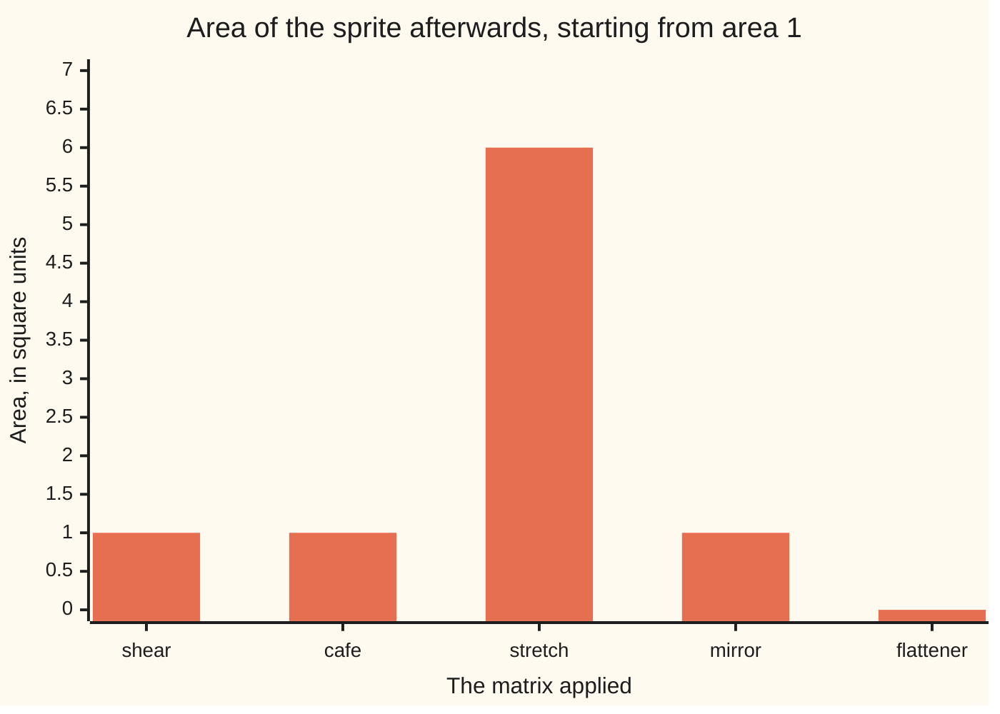
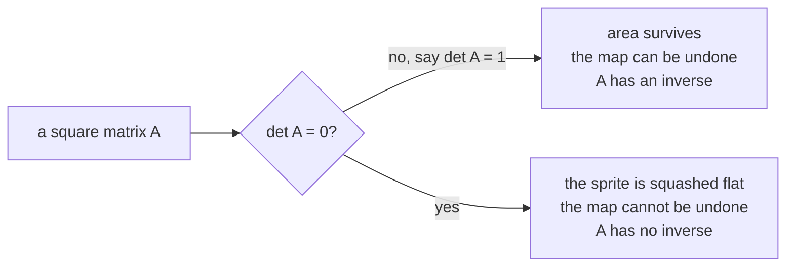

# Determinants: the one number that says how much a matrix stretches area, and zero means it squashed something flat

[Syllabus](../../../SYLLABUS.md) → [Algebra](../README.md) → [Solving Systems](../README.md#s05) → The determinant

---

## General Overview

A game sprite: a square patch of pixels, one unit wide, one unit tall. Area 1.

A matrix is applied to it: a block of numbers written row by row in square brackets, `[[2, 1], [1, 1]]`, sized rows by columns. Applying one moves every corner ([Linear maps](../04-Matrices/04-linear-maps-as-matrices.md)).

Three matrices, three fates:

- The shear `[[1, 1], [0, 1]]` slides the top edge one step right, leaning the sprite like italic text. Area still 1.
- The cafe matrix `[[2, 1], [1, 1]]` drags it into a thin slant, nothing like the first. Area still 1.
- The flattener `[[2, 4], [1, 2]]` lands all four corners on one line. No width, area 0.

One number, worked out from the four in the matrix, tells the three apart.

**The determinant of a matrix is the number every area gets multiplied by when that matrix is applied, and a determinant of zero means the picture was flattened, which can never be undone.**

**What kind of fact this is:** a definition — ad − bc names the number; that it multiplies every area, and that determinants multiply, are theorems proved below.

### The picture: what each matrix does to a sprite of area 1



Bars are areas, so none is negative. The stretch `[[3, 0], [0, 2]]` lifts it to 6; the mirror `[[0, 1], [1, 0]]` keeps 1 but turns the picture over, determinant −1.

---

## The formula

For a 2 by 2 read row by row, $A$ = `[[a, b], [c, d]]` — $a$, $b$ on top, $c$, $d$ below — the determinant is

$$\det A = ad - bc$$

**Read it aloud:** multiply the main diagonal's two numbers, then take away the product of the other two.

| Symbol | Plain meaning | In our example | Push it up and the answer… |
| --- | --- | --- | --- |
| $A$ | the matrix applied, square: rows match columns | the shear `[[1, 1], [0, 1]]` | — |
| $a$, $b$, $c$, $d$ | its four numbers, row by row (p, q, r, s on [The inverse matrix](03-inverse-matrix.md)) | 1, 1, 0, 1 | raise $a$ and it climbs by $d$, raise $b$ and it drops by $c$ |
| $e$, $f$, $g$, $h$, $i$ | a 3 by 3's five further numbers | 1, 1, 1, 0, 4 below | each through its own minor |
| $\det A$ | what $A$ multiplies every area by | 1 for the shear, 0 for the flattener | more stretch; a minus sign means flipped |
| $B$ | a second matrix, applied before $A$ in AB | the stretch `[[3, 0], [0, 2]]` | AB's is $\det A$ times $\det B$ |

In a 3 by 3 the letters restart row by row, so $c$ is top right: $A$ = `[[a, b, c], [d, e, f], [g, h, i]]`.

$$\det A = a(ei - fh) - b(di - fg) + c(dh - eg)$$

Walk along the top row. Cover a number's row and column; the four survivors form a 2 by 2 whose determinant is that number's **minor**. Multiply each number by its minor, then add, take away, add. That is **cofactor expansion**; a 4 by 4 breaks into four 3 by 3s the same way.

Two shortcuts do the work:

$$\det (AB) = \det A \times \det B$$

AB means apply $B$ first, then $A$ ([Matrix multiplication](../04-Matrices/03-matrix-multiplication.md)): area is multiplied twice, so the multipliers multiply. And when every number below the main diagonal is zero — **upper triangular**, a staircase here — the determinant is the diagonal multiplied out.

### When it holds

- **Square only.** A non-square block has no determinant; [Rank and nullity](05-rank-nullity.md) counts what survives.
- **One unit on both axes.** The sprite is measured the same way before and after, so the multiplier is a bare number.
- **Zero is exact, small is not.** Scaling a matrix up grows its determinant without changing its shape, so "nearly flat" needs the entries on a sensible scale.

---

## Why it works

### Step 0: a matrix is four numbers saying where two arrows land

The square is built from two arrows out of the corner: one step right, (1, 0), and one up, (0, 1). Applying $A$ sends (1, 0) to ($a$, $c$), its first column read downward, and (0, 1) to ($b$, $d$), the second ([Linear maps](../04-Matrices/04-linear-maps-as-matrices.md)). They span a **parallelogram** — four sides, opposite ones parallel — and area is now a question about that shape.

### Step 1: the area of that shape is ad − bc

Draw the smallest upright rectangle around it, $a$ + $b$ wide and $c$ + $d$ tall, then trim six pieces: two triangles coming to ac, two to bd, two corner rectangles to 2bc. Left over: ad − bc.

On the cafe matrix ($a$ = 2, $b$ = 1, $c$ = 1, $d$ = 1) the rectangle is 3 by 2, area 6, the trimmings come to 5, and 1 is left — ad − bc = 2 − 1, the area the code measures off the four corners. The picture needs four positive numbers, so the folded proof does every sign.

<details>
<summary>Detailed proof: ad − bc at any signs</summary>

The general version counts **signed area**: positive when the second arrow lies anticlockwise of the first, negative when clockwise. Doubling an arrow doubles it; sliding one along the other leaves it alone, so splitting an arrow splits the answer; two arrows on one line give 0.

Split: ($a$, $c$) is $a$ right and $c$ up, ($b$, $d$) is $b$ right and $d$ up. Right with right, and up with up, lie on one line: 0. Right with up gives ad on the unit square; up with right gives bc in the other order, so it counts negative. Total ad − bc, at any signs; ordinary area is its size.

</details>

### Step 2: a minus sign means the picture was turned over

The mirror `[[0, 1], [1, 0]]` sends (1, 0) to (0, 1) and (0, 1) to (1, 0): the arrows swap. The sprite keeps area 1 but comes back reversed, like writing held to a mirror, and 0 × 0 − 1 × 1 = −1. Size is the area multiplier; the sign is the flip.

### Step 3: zero means flattened, and flattened has no undo

In the flattener `[[2, 4], [1, 2]]` the second column, (4, 2), is twice the first, (2, 1). Both arrows lie on one line, so every corner lands there: no width, no area, and ad − bc = 2 × 2 − 4 × 1 = 0.

Different sprites flatten onto the same line, so nothing sends it back. "Determinant zero" and "no inverse" are one statement ([The inverse matrix](03-inverse-matrix.md)): the quickest test of whether a square system has one answer ([Solving A x = b](01-matrix-equation-ax-b.md)).



### Step 4: multipliers multiply, and staircases fall out

Run the shear (area × 1), then the stretch (area × 6): area × 6. The two as one matrix are `[[3, 3], [0, 2]]`, determinant 6. Why always? $B$ multiplies every area by $\det B$, then $A$ by $\det A$, and one number does that for every shape.

Staircases are easy for another reason. Expand along the first column: everything below the top-left number is zero, so only it contributes, and the same happens in the square left behind. Only the diagonal's product survives.

The method at any size: row-move to a staircase ([Gaussian elimination](02-gaussian-elimination.md)) — adding a multiple of one row to another leaves the determinant alone, swapping two rows flips its sign — then multiply the diagonal. That is the code's second road.

<details>
<summary>The grown-up definition</summary>

Textbooks ask for a rule turning a square matrix's columns into one number, under three demands: doubling one column doubles the answer, the others held still (**multilinear**); swapping two columns flips the sign (**alternating**); the identity matrix, ones on the diagonal, gives 1. Exactly one rule qualifies: the determinant.

</details>

---

## Worked numbers, by hand

This shelf's example, the cafe matrix: Monday's 2 coffees and 1 pastry over Tuesday's 1 and 1, `[[2, 1], [1, 1]]`.

| Step | Arithmetic | Value |
| --- | --- | --- |
| shear | 1 × 1 − 1 × 0 | 1 |
| cafe | 2 × 1 − 1 × 1 | **1** |
| stretch | 3 × 2 − 0 × 0 | 6 |
| mirror | 0 × 0 − 1 × 1 | −1 |
| flattener | 2 × 2 − 4 × 1 | **0** |
| stretch after shear, `[[3, 3], [0, 2]]` | 3 × 2 − 3 × 0, also 6 × 1 | 6 |
| the 3 by 3 `[[2, 1, 1], [0, 1, 1], [1, 0, 4]]`, top row | 2(1 × 4 − 1 × 0) − 1(0 × 4 − 1 × 1) + 1(0 × 0 − 1 × 1) | 8 + 1 − 1 = **8** |
| the same 3 by 3, eliminated to a staircase | 2 × 1 × 4 | **8** |

Not 0, so the cafe's two days pin the prices to one pair. The 3 by 3's 8 is a volume: a unit cube becomes a box of 8.

### What breaks if you drop a piece

| Mistake | Comes out at | What went wrong |
| --- | --- | --- |
| ad + bc on the cafe matrix | 3 | The second product is taken away, not added |
| Multiplying the cafe matrix's diagonal | 2 | The shortcut needs zeros below the diagonal; here there is a 1 |
| Adding all three number-times-minor terms | 6 | The middle one is subtracted: signs alternate |
| Reading det(A + B) as det A + det B | 7, when it is 12 | Areas do not add; only products split |

The code prints all four.

---

## Code, from first principles, and it actually runs

Nothing is imported. Every determinant is found twice: cofactor expansion along the top row, written as a rule that calls itself on smaller squares, and elimination to a staircase whose diagonal is multiplied. A third road measures the moved sprite's area from its four corners.

### Python

```python
# Determinants -- the check behind the card.  Nothing is imported.  The sprite is the
# unit square, area 1, and each matrix moves its four corners.  Every determinant is found
# twice: cofactor expansion along the top row, and elimination to a staircase whose diagonal
# is multiplied.  The moved square's area is then measured a third way, off its corners.
NAMED = [("shear", [[1, 1], [0, 1]]), ("cafe", [[2, 1], [1, 1]]),
         ("stretch", [[3, 0], [0, 2]]), ("mirror", [[0, 1], [1, 0]]),
         ("flattener", [[2, 4], [1, 2]])]
M3 = [[2, 1, 1], [0, 1, 1], [1, 0, 4]]
def cofactor(M):                        # road 1: entry x its knocked-out minor
    if len(M) == 1: return float(M[0][0])
    total = 0.0
    for j in range(len(M)):
        minor = [row[:j] + row[j + 1:] for row in M[1:]]
        total += (1 if j % 2 == 0 else -1) * M[0][j] * cofactor(minor)
    return total
def staircase(M):                       # road 2: eliminate, multiply the diagonal
    A = [[float(x) for x in row] for row in M]
    n, sign = len(A), 1.0
    for c in range(n):
        p = next((r for r in range(c, n) if abs(A[r][c]) > 1e-12), None)
        if p is None: return 0.0, A     # a column of zeros: the box is already flat
        if p != c: A[c], A[p], sign = A[p], A[c], -sign
        for r in range(c + 1, n):
            f = A[r][c] / A[c][c]
            A[r] = [A[r][k] - f * A[c][k] for k in range(n)]
    for i in range(n): sign *= A[i][i]
    return sign, A
def area(a, b, c, d):                   # the moved square, measured from its corners
    P = [(0.0, 0.0), (a, c), (a + b, c + d), (b, d)]
    return abs(sum(P[i][0] * P[(i + 1) % 4][1] - P[(i + 1) % 4][0] * P[i][1] for i in range(4))) / 2
def mul(A, B): return [[sum(A[i][k] * B[k][j] for k in range(2)) for j in range(2)] for i in range(2)]
def show2(M): return f"[[{M[0][0]}, {M[0][1]}], [{M[1][0]}, {M[1][1]}]]"
def row3(r): return "[" + ", ".join(f"{x:.1f}" for x in r) + "]"
print("the sprite is the unit square, area 1; each matrix moves its four corners")
for name, M in NAMED:
    (a, b), (c, d) = M
    print(f"  {name:<10}{show2(M):<20}ad - bc = {a * d - b * c:>2}   cofactor {cofactor(M):>5.1f}"
          f"   staircase {staircase(M)[0]:>5.1f}   area {area(a, b, c, d):>4.1f}")
S, D = NAMED[0][1], NAMED[2][1]
DS, SUM = mul(D, S), [[D[i][j] + S[i][j] for j in range(2)] for i in range(2)]
print(f"stretch after shear {show2(DS):<20}det = {cofactor(DS):.1f} = 6 x 1")
print(f"stretch plus shear  {show2(SUM):<20}det = {cofactor(SUM):.1f}, not 6 + 1 = 7")
t1 = M3[0][0] * (M3[1][1] * M3[2][2] - M3[1][2] * M3[2][1])
t2 = -M3[0][1] * (M3[1][0] * M3[2][2] - M3[1][2] * M3[2][0])
t3 = M3[0][2] * (M3[1][0] * M3[2][1] - M3[1][1] * M3[2][0])
d3, tri = staircase(M3)
print("3 by 3 [[2, 1, 1], [0, 1, 1], [1, 0, 4]]")
print(f"  cofactor along the top row: {t1:.1f} {t2:+.1f} {t3:+.1f} = {cofactor(M3):.1f}")
print(f"  staircase rows: {row3(tri[0])} {row3(tri[1])} {row3(tri[2])}")
print(f"  diagonal: {tri[0][0]:.1f} x {tri[1][1]:.1f} x {tri[2][2]:.1f} = {d3:.1f}")
print(f"mistakes on the cafe matrix: ad + bc gives {2 * 1 + 1 * 1}, the diagonal gives {2 * 1}")
print(f"mistake on the 3 by 3: all three cofactor terms added gives {t1 - t2 + t3:.1f}")
print(f"try changing: rows swapped {cofactor([[1, 1], [2, 1]]):.1f}, corner 2.1 {cofactor([[2, 4], [1, 2.1]]):.1f}, "
      f"3 by 3 top row doubled {cofactor([[4, 2, 2]] + M3[1:]):.1f}")
assert [cofactor(M) for _, M in NAMED] == [1.0, 1.0, 6.0, -1.0, 0.0]
assert all(abs(staircase(M)[0] - cofactor(M)) < 1e-12 and
           abs(area(M[0][0], M[0][1], M[1][0], M[1][1]) - abs(cofactor(M))) < 1e-12 for _, M in NAMED)
assert cofactor(M3) == 8.0 and abs(d3 - 8.0) < 1e-12 and tri[2][2] == 4.0
assert cofactor(DS) == 6.0 == cofactor(D) * cofactor(S) and cofactor(SUM) == 12.0
print("ALL CHECKS PASS")
```

**Ran 2026-09-19 on macOS, Python 3.14.6, standard library only. All checks passed. Output, pasted from the run:**

```
the sprite is the unit square, area 1; each matrix moves its four corners
  shear     [[1, 1], [0, 1]]    ad - bc =  1   cofactor   1.0   staircase   1.0   area  1.0
  cafe      [[2, 1], [1, 1]]    ad - bc =  1   cofactor   1.0   staircase   1.0   area  1.0
  stretch   [[3, 0], [0, 2]]    ad - bc =  6   cofactor   6.0   staircase   6.0   area  6.0
  mirror    [[0, 1], [1, 0]]    ad - bc = -1   cofactor  -1.0   staircase  -1.0   area  1.0
  flattener [[2, 4], [1, 2]]    ad - bc =  0   cofactor   0.0   staircase   0.0   area  0.0
stretch after shear [[3, 3], [0, 2]]    det = 6.0 = 6 x 1
stretch plus shear  [[4, 1], [0, 3]]    det = 12.0, not 6 + 1 = 7
3 by 3 [[2, 1, 1], [0, 1, 1], [1, 0, 4]]
  cofactor along the top row: 8.0 +1.0 -1.0 = 8.0
  staircase rows: [2.0, 1.0, 1.0] [0.0, 1.0, 1.0] [0.0, 0.0, 4.0]
  diagonal: 2.0 x 1.0 x 4.0 = 8.0
mistakes on the cafe matrix: ad + bc gives 3, the diagonal gives 2
mistake on the 3 by 3: all three cofactor terms added gives 6.0
try changing: rows swapped -1.0, corner 2.1 0.2, 3 by 3 top row doubled 16.0
ALL CHECKS PASS
```

### Rust

Built with `rustc --edition 2021 -O`; same numbers, same labels.

```rust
// Determinants -- the same check as determinants_check.py, in Rust.  No crates.  The sprite is
// the unit square, area 1, and each matrix moves its four corners.  Every determinant is found
// twice: cofactor expansion along the top row, and elimination to a staircase whose diagonal is
// multiplied.  The moved square's area is then measured a third way, off its corners.  Compile:
// rustc --edition 2021 -O determinants_check.rs -o determinants_check
type Mat = Vec<Vec<f64>>;
fn cofactor(m: &Mat) -> f64 {           // road 1: entry x its knocked-out minor
    if m.len() == 1 { return m[0][0]; }
    let mut total = 0.0;
    for j in 0..m.len() {
        let minor: Mat = m[1..].iter().map(|row| [&row[..j], &row[j + 1..]].concat()).collect();
        let sign = if j % 2 == 0 { 1.0 } else { -1.0 };
        total += sign * m[0][j] * cofactor(&minor);
    }
    total
}
fn staircase(m: &Mat) -> (f64, Mat) {   // road 2: eliminate, multiply the diagonal
    let mut a = m.clone();
    let n = a.len();
    let mut sign = 1.0f64;
    for c in 0..n {
        match (c..n).find(|&r| a[r][c].abs() > 1e-12) {
            None => return (0.0, a),    // a column of zeros: the box is already flat
            Some(p) => if p != c { a.swap(c, p); sign = -sign; },
        }
        for r in c + 1..n {
            let f = a[r][c] / a[c][c];
            for k in 0..n { a[r][k] -= f * a[c][k]; }
        }
    }
    for i in 0..n { sign *= a[i][i]; }
    (sign, a)
}
fn area(a: f64, b: f64, c: f64, d: f64) -> f64 {   // the moved square, from its corners
    let p = [(0.0, 0.0), (a, c), (a + b, c + d), (b, d)];
    let s: f64 = (0..4).map(|i| p[i].0 * p[(i + 1) % 4].1 - p[(i + 1) % 4].0 * p[i].1).sum();
    s.abs() / 2.0
}
fn mul(a: &Mat, b: &Mat) -> Mat {
    (0..2).map(|i| (0..2).map(|j| (0..2).map(|k| a[i][k] * b[k][j]).sum::<f64>()).collect()).collect()
}
fn mat(r: [[f64; 2]; 2]) -> Mat { vec![r[0].to_vec(), r[1].to_vec()] }
fn show2(m: &Mat) -> String { format!("[[{:.0}, {:.0}], [{:.0}, {:.0}]]", m[0][0], m[0][1], m[1][0], m[1][1]) }
fn row3(r: &[f64]) -> String { format!("[{}]", r.iter().map(|x| format!("{:.1}", x)).collect::<Vec<String>>().join(", ")) }
fn main() {
    let named: Vec<(&str, Mat)> = vec![
        ("shear", mat([[1.0, 1.0], [0.0, 1.0]])), ("cafe", mat([[2.0, 1.0], [1.0, 1.0]])),
        ("stretch", mat([[3.0, 0.0], [0.0, 2.0]])), ("mirror", mat([[0.0, 1.0], [1.0, 0.0]])),
        ("flattener", mat([[2.0, 4.0], [1.0, 2.0]]))];
    let m3: Mat = vec![vec![2.0, 1.0, 1.0], vec![0.0, 1.0, 1.0], vec![1.0, 0.0, 4.0]];
    println!("the sprite is the unit square, area 1; each matrix moves its four corners");
    for (name, m) in &named {
        let (a, b, c, d) = (m[0][0], m[0][1], m[1][0], m[1][1]);
        println!("  {:<10}{:<20}ad - bc = {:>2.0}   cofactor {:>5.1}   staircase {:>5.1}   area {:>4.1}",
                 name, show2(m), a * d - b * c, cofactor(m), staircase(m).0, area(a, b, c, d));
    }
    let (s, d, ds) = (&named[0].1, &named[2].1, mul(&named[2].1, &named[0].1));
    let sum: Mat = (0..2).map(|i| (0..2).map(|j| d[i][j] + s[i][j]).collect()).collect();
    println!("stretch after shear {:<20}det = {:.1} = 6 x 1", show2(&ds), cofactor(&ds));
    println!("stretch plus shear  {:<20}det = {:.1}, not 6 + 1 = 7", show2(&sum), cofactor(&sum));
    let t1 = m3[0][0] * (m3[1][1] * m3[2][2] - m3[1][2] * m3[2][1]);
    let t2 = -m3[0][1] * (m3[1][0] * m3[2][2] - m3[1][2] * m3[2][0]);
    let t3 = m3[0][2] * (m3[1][0] * m3[2][1] - m3[1][1] * m3[2][0]);
    let (d3, tri) = staircase(&m3);
    println!("3 by 3 [[2, 1, 1], [0, 1, 1], [1, 0, 4]]");
    println!("  cofactor along the top row: {:.1} {:+.1} {:+.1} = {:.1}", t1, t2, t3, cofactor(&m3));
    println!("  staircase rows: {} {} {}", row3(&tri[0]), row3(&tri[1]), row3(&tri[2]));
    println!("  diagonal: {:.1} x {:.1} x {:.1} = {:.1}", tri[0][0], tri[1][1], tri[2][2], d3);
    println!("mistakes on the cafe matrix: ad + bc gives {}, the diagonal gives {}", 2 * 1 + 1 * 1, 2 * 1);
    println!("mistake on the 3 by 3: all three cofactor terms added gives {:.1}", t1 - t2 + t3);
    println!("try changing: rows swapped {:.1}, corner 2.1 {:.1}, 3 by 3 top row doubled {:.1}",
             cofactor(&mat([[1.0, 1.0], [2.0, 1.0]])), cofactor(&mat([[2.0, 4.0], [1.0, 2.1]])),
             cofactor(&vec![vec![4.0, 2.0, 2.0], m3[1].clone(), m3[2].clone()]));
    assert!(named.iter().map(|(_, m)| cofactor(m)).collect::<Vec<f64>>() == vec![1.0, 1.0, 6.0, -1.0, 0.0]);
    assert!(named.iter().all(|(_, m)| (staircase(m).0 - cofactor(m)).abs() < 1e-12
        && (area(m[0][0], m[0][1], m[1][0], m[1][1]) - cofactor(m).abs()).abs() < 1e-12));
    assert!(cofactor(&m3) == 8.0 && (d3 - 8.0).abs() < 1e-12 && tri[2][2] == 4.0);
    assert!(cofactor(&ds) == 6.0 && cofactor(&ds) == cofactor(d) * cofactor(s) && cofactor(&sum) == 12.0);
    println!("ALL CHECKS PASS");
}
```

**Ran 2026-09-19 on macOS, rustc 1.98.1, no crates. All checks passed. Output, pasted from the run:**

```
the sprite is the unit square, area 1; each matrix moves its four corners
  shear     [[1, 1], [0, 1]]    ad - bc =  1   cofactor   1.0   staircase   1.0   area  1.0
  cafe      [[2, 1], [1, 1]]    ad - bc =  1   cofactor   1.0   staircase   1.0   area  1.0
  stretch   [[3, 0], [0, 2]]    ad - bc =  6   cofactor   6.0   staircase   6.0   area  6.0
  mirror    [[0, 1], [1, 0]]    ad - bc = -1   cofactor  -1.0   staircase  -1.0   area  1.0
  flattener [[2, 4], [1, 2]]    ad - bc =  0   cofactor   0.0   staircase   0.0   area  0.0
stretch after shear [[3, 3], [0, 2]]    det = 6.0 = 6 x 1
stretch plus shear  [[4, 1], [0, 3]]    det = 12.0, not 6 + 1 = 7
3 by 3 [[2, 1, 1], [0, 1, 1], [1, 0, 4]]
  cofactor along the top row: 8.0 +1.0 -1.0 = 8.0
  staircase rows: [2.0, 1.0, 1.0] [0.0, 1.0, 1.0] [0.0, 0.0, 4.0]
  diagonal: 2.0 x 1.0 x 4.0 = 8.0
mistakes on the cafe matrix: ad + bc gives 3, the diagonal gives 2
mistake on the 3 by 3: all three cofactor terms added gives 6.0
try changing: rows swapped -1.0, corner 2.1 0.2, 3 by 3 top row doubled 16.0
ALL CHECKS PASS
```

The two outputs match line for line.

> [!TIP]
> **Try changing**
> Guess first, then run it. An assert stops the program when a number comes out wrong, so expect a stop; the last line holds all three answers.
> - **Swap the cafe matrix's rows.** `[[1, 1], [2, 1]]`: same shape, mirrored, −1.
> - **Nudge the flattener.** Change its bottom-right 2 to 2.1. No longer flat: 0.2, a sliver, with an inverse that magnifies small errors.
> - **Double the top row of the 3 by 3.** Twice the row, twice the box: 16, not 8.

---

## The usual mistake

> [!warning]
> **Reading the determinant as the size of the matrix.** The shear and the cafe matrix have different entries and the same determinant, 1. The flattener has this card's biggest entries and determinant 0. It measures one thing: what happened to area.
>
> - **Zero does not mean a matrix full of zeros.** Two directions collapsed into one, squashing the picture: the case with no inverse.
> - **The signs alternate.** The 3 by 3's middle term is taken away; add all three and it reads 6, not 8.
> - **The diagonal shortcut only works on a staircase.** The cafe matrix's diagonal gives 2, not 1.
> - **Determinants do not add.** For the stretch and the shear, det A + det B reads 7; det(A + B) is 12.

---

## Where you meet it in real life

- **Volume in three dimensions.** For a 3 by 3 the number multiplies volume: `[[2, 1, 1], [0, 1, 1], [1, 0, 4]]` takes a unit cube to a box of 8, and a negative one mirrors it ([Triple product](../../05-Geometry%20and%20trig/05-Vectors%20in%20Space/03-triple-product-and-volume.md)).
- **Solving systems.** Not zero: one answer and an inverse ([The inverse matrix](03-inverse-matrix.md)). Zero: no answer or a line of them ([Solving A x = b](01-matrix-equation-ax-b.md)), the count in [Rank and nullity](05-rank-nullity.md).
- **Statistics packages.** A determinant near zero, on entries of sensible size, warns that a model's inputs are near-copies, so the fitted answer wobbles: the nudged flattener's 0.2 buys an untrustworthy inverse.

> **Say it back**
> A square matrix turns a sprite of area 1 into a slanted shape whose signed area is the determinant. For a 2 by 2 it is ad − bc; a minus sign means the picture turned over. Zero means flattened onto a line, which nothing unflattens, so there is no inverse. Two matrices in a row multiply their determinants; a staircase's is its diagonal.

---

## What this builds on

- [The inverse matrix](03-inverse-matrix.md): the matrix that undoes another, whose risky step is dividing by this card's number.
- [Linear maps](../04-Matrices/04-linear-maps-as-matrices.md): why a matrix's columns say where the axis arrows land.

## Where this goes next

- [Eigenvalues and eigenvectors](../07-Eigenvalues%20and%20Symmetric%20Matrices/02-eigenvalues-and-eigenvectors.md): the stretch factors whose product is this number.
- [Spanning trees](../../04-Combinatorics%20and%20graphs/10-Trees%20and%20Cheapest%20Routes/03-spanning-trees-and-cayleys-formula.md): it counts a network's trees.
- [Cross product](../../05-Geometry%20and%20trig/05-Vectors%20in%20Space/01-cross-product-and-oriented-area.md): the same signed area as an arrow.
- [Triple product](../../05-Geometry%20and%20trig/05-Vectors%20in%20Space/03-triple-product-and-volume.md): the 3 by 3 as a box's volume.
- [The Wronskian](../../08-Differential%20equations%20and%20dynamics/03-Oscillators%20-%20Second-Order%20Linear%20Equations/04-wronskian-and-reduction-of-order.md): it tests whether two solutions are copies.
- [Trace and determinant](../../08-Differential%20equations%20and%20dynamics/04-Systems%20and%20the%20Matrix%20Exponential/05-classifying-equilibria-by-trace-and-determinant.md): it decides how a system settles.
- [Symplectic steps](../../08-Differential%20equations%20and%20dynamics/05-Numerical%20Evolution/07-symplectic-steps-for-oscillators.md): steps built to keep it at 1.
- [Vanna-volga pricing](../../12-Financial%20mathematics/22-The%20FX%20smile%20-%20risk%20reversals%2C%20butterflies%20and%20vanna-volga/04-vanna-volga-pricing.md): a 3 by 3 solve behind hedge weights.
- LU with partial pivoting: elimination packaged, row swaps carrying the sign.
- The resultant: zero exactly when two polynomials share a root.
- Differential form: the alternating rule made an algebra.
- Permanent against determinant: the same sum without minus signs is hard.

One number says whether the sprite survived, not which directions stretched or by how much; those come next.

---

## Sources

Verified 19 Sep 2026: every link below resolves to the publisher's page.

- Axler, Sheldon. *Linear Algebra Done Right*, 4th ed. Springer, 2024. [Publisher page, open access](https://link.springer.com/book/10.1007/978-3-031-41026-0). Chapter 9 builds it from the folded callout's demands.
- Strang, Gilbert. *Introduction to Linear Algebra*, 6th ed. Wellesley-Cambridge Press. [Author's book page](https://math.mit.edu/~gs/linearalgebra/). The area-and-volume reading and the elimination road.
- Margalit, Dan, and Joseph Rabinoff. *Interactive Linear Algebra*. Georgia Institute of Technology. [Determinants chapter](https://textbooks.math.gatech.edu/ila/determinants-definitions-properties.html). Free; the row-move rules as the definition.
- Hefferon, Jim. *Linear Algebra*. [Book page, free PDF](https://hefferon.net/linearalgebra/). Cofactor expansion worked slowly, its signs derived.
