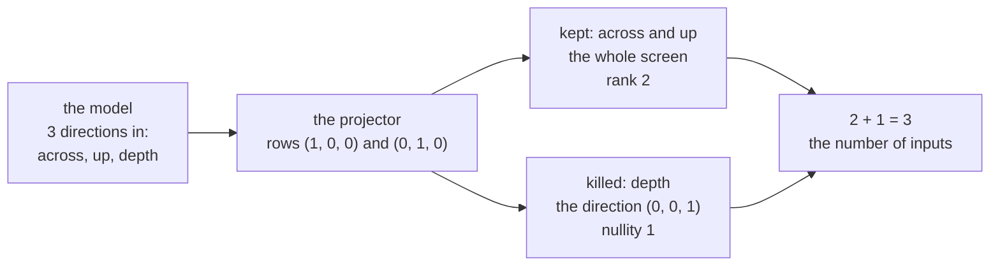

# Rank and nullity: what a matrix keeps and what it kills, and why the two counts add up to the number of inputs

Algebra → Solving Systems → Rank → Rank and nullity

---

## General Overview

A game draws a 3D model on a flat screen, straight on. The model lives in a room with three directions: across, up, and depth — how far from the camera. The screen has two, so something must go.

The thing throwing it away is a matrix, written row by row in square brackets: `[[1, 0, 0], [0, 1, 0]]`. Two rows, three columns. Feed it a model point, written in round brackets as (3, 4, 5), and out comes the screen point (3, 4): across and up came through, depth did not.

Slide the point back to (3, 4, 9) and the picture is still (3, 4): a whole direction makes no difference to the output. Two directions kept, one killed, three fed in.

**A matrix keeps some directions and kills the rest, and the two counts always add up to the number of columns: the number of numbers you fed in.**

**What kind of fact this is:** a theorem, proved on this card in Why it works; rank and nullity are definitions.

### The picture: three directions in, two out, one dead



Those two arrows are the projector's own axes. Not every direction is so tidy: (1, 0, 1) is neither kept nor killed, landing on (1, 0) minus its depth. What always falls into two piles is the columns, which the proof sorts.

---

## The formula

$$\text{rank}(A) + \text{nullity}(A) = n$$

**Read it aloud:** the directions the matrix keeps, plus the directions it kills, is the number of numbers you feed in.

| Symbol | Plain meaning | In our example | Push it up and the answer… |
| --- | --- | --- | --- |
| $A$ | the matrix, read as a machine: numbers in, numbers out | `[[1, 0, 0], [0, 1, 0]]` | — |
| $n$ | the number of columns: how many numbers go in | 3 | more to share between kept and killed |
| $m$ | the number of rows: how many numbers come out | 2 | more room to land in, the sum unchanged |
| $x$ | one input, a list of $n$ numbers | (3, 4, 5) | — |
| rank(A) | independent directions that survive: the size of the **column space**, or image — what the matrix hits | 2 | fewer get killed; the sum stays at $n$ |
| nullity(A) | independent directions sent to nothing: the size of the **null space**, or kernel — what it kills | 1 | fewer survive, same trade |

"Independent" means directions that are not copies or mixtures of each other ([basis-and-dimension](../03-Vectors/05-basis-and-dimension.md)).

### When it holds

- **Finitely many rows and columns of ordinary numbers.** Both piles then have a size, and a column count to add them to.
- **A matrix, with nothing added on.** Shift every output by a fixed amount and the inputs sent to nothing no longer include the zero input: not a pile of directions at all.
- **Exact arithmetic.** A column nearly a mixture of the others still carries its own pivot, so measured data reads a rank too high; [singular-value-decomposition](../07-Eigenvalues%20and%20Symmetric%20Matrices/06-singular-value-decomposition.md) grades near misses.

---

## Why it works

### Step 0: two inputs collide exactly when their difference dies

The points (3, 4, 5) and (3, 4, 9) both draw (3, 4). Subtract one from the other: (0, 0, 4). Feed that to the projector and nothing comes out — the zero output.

A matrix applied to a difference gives the difference of the results ([linear-maps-as-matrices](../04-Matrices/04-linear-maps-as-matrices.md)), so every collision is a killed direction showing up twice: counting killed directions counts every way information is lost.

### Step 1: elimination sorts the columns into two piles

Run the three legal row moves from [gaussian-elimination](02-gaussian-elimination.md) until the matrix is a staircase. Each column then either carries a pivot — the leading entry of a step — or it does not. No third option: pivot columns and free columns. The projector is already a staircase, column 1 leading row 1, column 2 leading row 2, column 3 leading nothing: two pivot columns, one free.

### Step 2: each free column buys exactly one killed direction

To find an input the matrix kills, set the free column's number to 1, every other free number to 0, and let the staircase fill the rest in. For the projector, depth = 1 forces across = 0 and up = 0: the killed direction is (0, 0, 1).

Do that once per free column. The results are independent, they reach every killed input, and row moves never change which inputs die. So the nullity is the number of free columns.

### Step 3: each pivot column carries one surviving direction

The pivot columns are independent, and every free column is a mixture of the pivot columns to its left. Row moves keep those mixtures, so the matching columns of the original matrix are a basis for its column space ([basis-and-dimension](../03-Vectors/05-basis-and-dimension.md)): the rank is the number of pivot columns.

The projector's columns 1 and 2 are (1, 0) and (0, 1) — the whole screen. Rank 2. The loss is on the way in, not the way out.

<details>
<summary>Detailed proof: each pile really is a basis</summary>

Take the staircase in reduced form: every pivot is 1, its column 0 elsewhere. Row moves are reversible, so the staircase kills exactly what the matrix kills.

**Killed.** Step 2's directions are killed, and each carries a 1 where the others carry 0, so none is a mixture of the rest. They miss nothing: from a killed input subtract those directions, weighted by its own free numbers; the leftover is killed with 0 in every free place, so each staircase row forces its pivot place to 0 too: nothing is left.

**Kept.** A mixture of pivot columns cancelling to nothing is a killed input with 0 in every free place, so that reading makes it zero: those columns are independent. Read backwards, they make each free column a mixture of pivot columns to its left. So the pivot columns build the whole column space.

</details>

### Step 4: add the piles back together

Every column sits in exactly one pile, so the two counts are all $n$ columns: rank plus nullity is $n$. Keep one more direction and you kill one fewer — a stock-take, not a discovery.

<details>
<summary>What about the rows?</summary>

The **row space** is everything you can build out of the rows, and its size is also the rank — which is why nobody says "column rank" out loud. Its leftover is the **left null space**: mixtures of rows cancelling to nothing, $m$ minus the rank of them. With this card's two, these are the four fundamental subspaces.

</details>

**The other route.** The rank is also the size of the biggest square block cut from the matrix — any rows with any columns — whose determinant is not zero ([determinants](04-determinants.md)): such a block squashes nothing flat. It shares no working with elimination, which is why the code takes it as the second road.

---

## Worked numbers, by hand

The projector, step by step.

| Step | Arithmetic | Value |
| --- | --- | --- |
| the matrix | `[[1, 0, 0], [0, 1, 0]]`, rows by columns | 2 by 3 |
| elimination | already a staircase | unchanged |
| pivot columns | column 1 leads row 1, column 2 leads row 2 | 1, 2 |
| **rank** | count the pivots | **2** |
| free columns | column 3 leads nothing | 3 |
| the killed direction | depth = 1 forces across = 0, up = 0 | (0, 0, 1) |
| **nullity** | count the killed directions | **1** |
| **rank + nullity** | 2 + 1 | **3 = columns** |

One direction's worth of the model is gone: the screen point (3, 4) has not one source but a line of them, (3, 4, 0) plus any amount of (0, 0, 1).

**A harder one.** The flattener B = `[[1, 2, 3], [2, 4, 6]]` is also 2 by 3, but its second row is twice its first, so one row move wipes it out: a staircase with one step. One pivot column, two free — rank 1, nullity 2, 1 + 2 still 3. B squashes the whole model onto one line.

```
five blocks = one direction, out of 3 inputs in both cases
P kept, the rank         ██████████  2
P killed, the nullity    █████       1
B kept, the rank         █████       1
B killed, the nullity    ██████████  2
```

Neither split changes the total, 3.

### What breaks if you drop a piece

| Mistake | Comes out at | What went wrong |
| --- | --- | --- |
| Adding rank and nullity to the number of rows | nullity 0 for the projector | The sum counts inputs, and there are 3 |
| Counting nonzero rows as the rank | rank 2 for the flattener | B's second row is twice its first; 1 pivot survives |
| Keeping that wrong rank and adding | 2 + 2 = 4, not 3 | A sum over the column count means no elimination |

The code prints all three wrong numbers.

---

## Code, from first principles, and it actually runs

Nothing is imported, and the rank is reached two ways that share no working. Road one runs the row moves, counts pivots, and reads a killed direction off each free column. Road two finds the biggest square block whose determinant is not zero, that determinant written out by hand. Each killed direction is fed back to check it dies.

### Python

```python
# Rank and nullity -- the check behind the card.  Nothing is imported.  P is the
# projector: a 3D model in, a flat screen picture out; B flattens harder.  Two roads
# to the rank: count the staircase's pivots, or take the biggest square block whose
# determinant is not zero.  Every number quoted on the card is printed below.
P = [[1.0, 0.0, 0.0], [0.0, 1.0, 0.0]]           # keeps across and up, kills depth
B = [[1.0, 2.0, 3.0], [2.0, 4.0, 6.0]]           # row 2 is twice row 1
def combos(xs, k):                               # every k of the items, in order
    if k == 0 or len(xs) < k: return [[]] if k == 0 else []
    return [[xs[0]] + c for c in combos(xs[1:], k - 1)] + combos(xs[1:], k)
def det(M):                                      # determinant, expanding the top row
    if len(M) == 1: return M[0][0]
    return sum((-1) ** j * M[0][j] * det([r[:j] + r[j+1:] for r in M[1:]]) for j in range(len(M)))
def staircase(A):                                # legal row moves, until a pivot stands alone
    M, piv, r = [row[:] for row in A], [], 0
    for c in range(len(A[0])):
        s = next((i for i in range(r, len(M)) if abs(M[i][c]) > 1e-9), None)
        if s is None: continue                   # no pivot in this column: it is free
        M[r], M[s] = M[s], M[r]
        M[r] = [x / M[r][c] for x in M[r]]
        for i in range(len(M)):
            if i != r: M[i] = [a - M[i][c] * b for a, b in zip(M[i], M[r])]
        piv.append(c); r += 1
    return M, piv
def killed(A):                                   # one direction per column with no pivot
    M, piv, out = *staircase(A), []
    for j in (c for c in range(len(A[0])) if c not in piv):
        v = [0.0] * len(A[0]); v[j] = 1.0
        for i, c in enumerate(piv): v[c] = 0.0 - M[i][j]
        out.append(v)
    return out
def rank_by_blocks(A):                           # road 2: no elimination in here at all
    for k in range(min(len(A), len(A[0])), 0, -1):
        for rs in combos(list(range(len(A))), k):
            for cs in combos(list(range(len(A[0]))), k):
                if abs(det([[A[i][j] for j in cs] for i in rs])) > 1e-9: return k
    return 0
def apply(A, v): return [sum(a * b for a, b in zip(row, v)) for row in A]
def show(v): return "(" + ", ".join(f"{x:g}" for x in v) + ")"
def report(name, A):
    piv, ks, n = staircase(A)[1], killed(A), len(A[0])
    print(f"{name}: {len(A)} rows x {n} columns")
    print(f"  pivot columns             {', '.join(str(c + 1) for c in piv)}")
    print(f"  rank, by pivots           {len(piv)}")
    print(f"  rank, by biggest block    {rank_by_blocks(A)}")
    print(f"  nullity                   {len(ks)}")
    print(f"  killed directions         {', '.join(show(v) for v in ks)}")
    print(f"  rank + nullity            {len(piv)} + {len(ks)} = {len(piv) + len(ks)} = columns")
    return len(piv), ks
rP, kP = report("projector P = [[1, 0, 0], [0, 1, 0]]", P)
rB, kB = report("flattener B = [[1, 2, 3], [2, 4, 6]]", B)
front, back = [3.0, 4.0, 5.0], [3.0, 4.0, 9.0]
print(f"two model points            {show(front)} and {show(back)} both land on {show(apply(P, front))}")
print(f"their difference            {show([0.0, 0.0, 4.0])} = 4 x {show(kP[0])}, a killed direction")
print(f"every model point there     x = {show([3.0, 4.0, 0.0])} + t x {show(kP[0])}")
print(f"mistakes: rows - rank gives nullity {len(P) - rP} for P; B's {len(B)} nonzero rows read as rank {len(B)} give {len(B)} + {len(kB)} = {len(B) + len(kB)}, not {len(B[0])}")
assert rP == rank_by_blocks(P) and rB == rank_by_blocks(B)       # two roads, one rank
assert rP + len(kP) == len(P[0]) and rB + len(kB) == len(B[0])   # the theorem itself
assert all(max(abs(x) for x in apply(A, v)) < 1e-9 for A, ks in ((P, kP), (B, kB)) for v in ks)
assert apply(P, front) == apply(P, back) == [3.0, 4.0]           # depth moved, picture did not
print("ALL CHECKS PASS")
```

**Ran 2026-09-19 on macOS, Python 3.14.6, standard library only. All checks passed. Output, pasted from the run:**

```
projector P = [[1, 0, 0], [0, 1, 0]]: 2 rows x 3 columns
  pivot columns             1, 2
  rank, by pivots           2
  rank, by biggest block    2
  nullity                   1
  killed directions         (0, 0, 1)
  rank + nullity            2 + 1 = 3 = columns
flattener B = [[1, 2, 3], [2, 4, 6]]: 2 rows x 3 columns
  pivot columns             1
  rank, by pivots           1
  rank, by biggest block    1
  nullity                   2
  killed directions         (-2, 1, 0), (-3, 0, 1)
  rank + nullity            1 + 2 = 3 = columns
two model points            (3, 4, 5) and (3, 4, 9) both land on (3, 4)
their difference            (0, 0, 4) = 4 x (0, 0, 1), a killed direction
every model point there     x = (3, 4, 0) + t x (0, 0, 1)
mistakes: rows - rank gives nullity 0 for P; B's 2 nonzero rows read as rank 2 give 2 + 2 = 4, not 3
ALL CHECKS PASS
```

### Rust

Same rows, same labels, built with `rustc --edition 2021 -O`.

```rust
// Rank and nullity -- the same check as rank_nullity_check.py, in Rust.  No crates.
// P is the projector: a 3D model in, a flat screen picture out; B flattens harder.
// Two roads to the rank: the staircase's pivots, or the biggest square block whose
// determinant is not zero.  Same rows, same labels, same numbers as the Python.
type Mat = Vec<Vec<f64>>;
fn combos(xs: &[usize], k: usize) -> Vec<Vec<usize>> {   // every k of the items, in order
    if k == 0 || xs.len() < k { return if k == 0 { vec![vec![]] } else { vec![] }; }
    let mut out: Vec<Vec<usize>> = combos(&xs[1..], k - 1).into_iter()
        .map(|c| [vec![xs[0]], c].concat()).collect();
    out.extend(combos(&xs[1..], k)); out
}
fn det(m: &Mat) -> f64 {                                 // determinant, expanding the top row
    if m.len() == 1 { return m[0][0]; }
    (0..m.len()).map(|j| {
        let minor: Mat = m[1..].iter().map(|r| [&r[..j], &r[j + 1..]].concat()).collect();
        (if j % 2 == 0 { 1.0 } else { -1.0 }) * m[0][j] * det(&minor)
    }).sum()
}
fn staircase(a: &Mat) -> (Mat, Vec<usize>) {             // legal row moves, until a pivot stands alone
    let (mut m, mut piv, mut r) = (a.clone(), Vec::new(), 0usize);
    for c in 0..a[0].len() {
        let s = match (r..m.len()).find(|&i| m[i][c].abs() > 1e-9) {
            None => continue, Some(i) => i };             // no pivot in this column: it is free
        m.swap(r, s);
        let pv = m[r][c]; for x in m[r].iter_mut() { *x /= pv; }
        for i in 0..m.len() {
            let f = m[i][c];
            if i != r { for j in 0..m[i].len() { m[i][j] -= f * m[r][j]; } }
        }
        piv.push(c); r += 1;
    }
    (m, piv) }
fn killed(a: &Mat) -> Mat {                              // one direction per column with no pivot
    let ((m, piv), n, mut out) = (staircase(a), a[0].len(), Vec::new());
    for j in (0..n).filter(|c| !piv.contains(c)) {
        let mut v = vec![0.0; n]; v[j] = 1.0;
        for (i, &c) in piv.iter().enumerate() { v[c] = 0.0 - m[i][j]; }
        out.push(v); }
    out
}
fn rank_by_blocks(a: &Mat) -> usize {                    // road 2: no elimination in here at all
    let (rows, cols): (Vec<usize>, Vec<usize>) = ((0..a.len()).collect(), (0..a[0].len()).collect());
    for k in (1..=rows.len().min(cols.len())).rev() {
        for rs in combos(&rows, k) { for cs in combos(&cols, k) {
            let blk: Mat = rs.iter().map(|&i| cs.iter().map(|&j| a[i][j]).collect()).collect();
            if det(&blk).abs() > 1e-9 { return k; }
        } }
    }
    0
}
fn apply(a: &Mat, v: &[f64]) -> Vec<f64> { a.iter().map(|r| r.iter().zip(v).map(|(x, y)| x * y).sum()).collect() }
fn show(v: &[f64]) -> String { format!("({})", v.iter().map(|x| x.to_string()).collect::<Vec<_>>().join(", ")) }
fn report(name: &str, a: &Mat) -> (usize, Mat) {
    let (piv, ks, n) = (staircase(a).1, killed(a), a[0].len());
    println!("{}: {} rows x {} columns", name, a.len(), n);
    println!("  pivot columns             {}", piv.iter().map(|c| (c + 1).to_string()).collect::<Vec<_>>().join(", "));
    println!("  rank, by pivots           {}", piv.len());
    println!("  rank, by biggest block    {}", rank_by_blocks(a));
    println!("  nullity                   {}", ks.len());
    println!("  killed directions         {}", ks.iter().map(|v| show(v)).collect::<Vec<_>>().join(", "));
    println!("  rank + nullity            {} + {} = {} = columns", piv.len(), ks.len(), piv.len() + ks.len());
    (piv.len(), ks)
}
fn main() {
    let p: Mat = vec![vec![1.0, 0.0, 0.0], vec![0.0, 1.0, 0.0]];   // keeps across and up, kills depth
    let b: Mat = vec![vec![1.0, 2.0, 3.0], vec![2.0, 4.0, 6.0]];   // row 2 is twice row 1
    let (r_p, k_p) = report("projector P = [[1, 0, 0], [0, 1, 0]]", &p);
    let (r_b, k_b) = report("flattener B = [[1, 2, 3], [2, 4, 6]]", &b);
    let (front, back) = ([3.0, 4.0, 5.0], [3.0, 4.0, 9.0]);
    println!("two model points            {} and {} both land on {}", show(&front), show(&back), show(&apply(&p, &front)));
    println!("their difference            {} = 4 x {}, a killed direction", show(&[0.0, 0.0, 4.0]), show(&k_p[0]));
    println!("every model point there     x = {} + t x {}", show(&[3.0, 4.0, 0.0]), show(&k_p[0]));
    println!("mistakes: rows - rank gives nullity {} for P; B's {} nonzero rows read as rank {} give {} + {} = {}, not {}",
             p.len() - r_p, b.len(), b.len(), b.len(), k_b.len(), b.len() + k_b.len(), b[0].len());
    assert!(r_p == rank_by_blocks(&p) && r_b == rank_by_blocks(&b));           // two roads, one rank
    assert!(r_p + k_p.len() == p[0].len() && r_b + k_b.len() == b[0].len());   // the theorem itself
    for (a, ks) in [(&p, &k_p), (&b, &k_b)] { for v in ks { assert!(apply(a, v).iter().all(|x| x.abs() < 1e-9)); } }
    assert!(apply(&p, &front) == apply(&p, &back) && apply(&p, &front) == vec![3.0, 4.0]);
    println!("ALL CHECKS PASS");
}
```

**Ran 2026-09-19 on macOS, rustc 1.98.1, no crates. All checks passed. Output, pasted from the run:**

```
projector P = [[1, 0, 0], [0, 1, 0]]: 2 rows x 3 columns
  pivot columns             1, 2
  rank, by pivots           2
  rank, by biggest block    2
  nullity                   1
  killed directions         (0, 0, 1)
  rank + nullity            2 + 1 = 3 = columns
flattener B = [[1, 2, 3], [2, 4, 6]]: 2 rows x 3 columns
  pivot columns             1
  rank, by pivots           1
  rank, by biggest block    1
  nullity                   2
  killed directions         (-2, 1, 0), (-3, 0, 1)
  rank + nullity            1 + 2 = 3 = columns
two model points            (3, 4, 5) and (3, 4, 9) both land on (3, 4)
their difference            (0, 0, 4) = 4 x (0, 0, 1), a killed direction
every model point there     x = (3, 4, 0) + t x (0, 0, 1)
mistakes: rows - rank gives nullity 0 for P; B's 2 nonzero rows read as rank 2 give 2 + 2 = 4, not 3
ALL CHECKS PASS
```

The two outputs match line for line.

> [!TIP]
> **Try changing**
> Guess first, then run it. An assert stops the program if a number comes out wrong.
> - **Let the camera keep depth.** Give `P` a third row, `[0.0, 0.0, 1.0]`: rank 3, nullity 0, and (3, 4, 5) lands on itself. The killed-directions line is empty, and the program stops for want of one.
> - **Break the flattener's copied row.** Change B's second row to `[2.0, 4.0, 7.0]`: B gains a pivot, so rank 2, nullity 1, killed direction (-2, 1, 0), sum still 3.
> - **Bolt a dead column onto the projector.** Give both of P's rows a fourth entry, `0.0`: rank stays 2, nullity 2, the sum 4. It never counted rows.

---

## The usual mistake

> [!warning]
> **Adding up to the wrong number.** Rank plus nullity is the number of columns, not the number of rows. The projector has 2 rows and 3 columns; rank 2 plus nullity 1 is 3, the column count. Do it with rows and nullity comes out 0, saying the projector throws nothing away — while it is flattening a whole room onto a screen.
>
> - **Counting nonzero rows as the rank.** The flattener's rows both look full, but the second is twice the first, so elimination leaves rank 1 and the sum 4.
> - **Putting the null space in the wrong room.** The killed direction (0, 0, 1) has three numbers, because it is an input; screen points have two. Only the two counts are ever added.
> - **Reading rank as how full the matrix looks.** The projector is mostly zeros and has rank 2; the flattener has no zero anywhere and has rank 1. Rank counts independence, not ink.

---

## Where you meet it in real life

- **Every frame of a 3D game.** Depth dies on the way to the screen, which is why a renderer keeps a depth buffer: the flat picture cannot say what is in front.
- **Reading A x = b before solving it.** Nullity 0 means at most one answer; nullity 1 a line of them, one answer plus any amount of the killed direction ([matrix-equation-ax-b](01-matrix-equation-ax-b.md)).
- **Undoing a matrix, and one-to-one.** Nullity 0 says different inputs always give different outputs ([injective-surjective-bijective](../../01-Foundations/08-Relations%20and%20Functions/04-injective-surjective-bijective.md)), since collisions are killed directions. For a square matrix that is exactly when an inverse exists, the same fact as a nonzero determinant ([inverse-matrix](03-inverse-matrix.md), [determinants](04-determinants.md)).
- **Spreadsheets and sensors.** A table with one column the sum of two others has nullity above zero, so fitting anything to it gives a line of equally good answers, not one. Rank warns first.

> **Say it back**
> Some input directions come through a matrix, some are sent to nothing. The count coming through is the rank, the count that dies is the nullity, and they add to the number of columns — going in, not coming out. Elimination gives both: pivot columns the rank, free columns the nullity. The projector `[[1, 0, 0], [0, 1, 0]]` keeps 2 and kills 1: 2 + 1 = 3.

---

## What this builds on

- [gaussian-elimination](02-gaussian-elimination.md): the row moves that build the staircase, and the pivots counted here.
- [linear-maps-as-matrices](../04-Matrices/04-linear-maps-as-matrices.md): a matrix read as a machine — what makes Step 0's rule true.
- [basis-and-dimension](../03-Vectors/05-basis-and-dimension.md): what counting independent directions means, so both counts are numbers.
- [injective-surjective-bijective](../../01-Foundations/08-Relations%20and%20Functions/04-injective-surjective-bijective.md): one-to-one and onto in words. Nullity 0 is one-to-one; rank equal to $m$ is onto.

## Where this goes next

- [singular-value-decomposition](../07-Eigenvalues%20and%20Symmetric%20Matrices/06-singular-value-decomposition.md): rank read off a list of sizes.
- [dimensional-analysis-and-buckingham-pi](../../13-Engineering%20mathematics/01-Units%20and%20Modelling/02-dimensional-analysis-and-buckingham-pi.md): the same count on a table of units.
- controllability-and-observability: rank deciding whether a machine can be steered.
- homology-groups: these two counts along one map after another.
- mayer-vietoris-and-long-exact-sequences: the same bookkeeping along a chain of maps.
- compact-operators: rank where the inputs are functions.
- fredholm-alternative-and-integral-equations: which equations have answers.
- dimension-and-tangent-spaces: rank of a slope matrix as a dimension.
- diffeomorphisms-immersions-and-embeddings: full rank as the test for a map that folds nothing.

Rank counts directions, but not how close a matrix is to losing one more, which is what measured data needs: that grading waits for [singular-value-decomposition](../07-Eigenvalues%20and%20Symmetric%20Matrices/06-singular-value-decomposition.md).

---

## Sources

Verified 19 Sep 2026: every link below resolves to the publisher's page.

- Axler, Sheldon. *Linear Algebra Done Right*, 4th ed. Springer, 2024. [Publisher page](https://link.springer.com/book/10.1007/978-3-031-41026-0). The same result, called the fundamental theorem of linear maps.
- Strang, Gilbert. *Introduction to Linear Algebra*, 6th ed. Wellesley-Cambridge Press. [Book page](https://math.mit.edu/~gs/linearalgebra/). The pivot-and-free-column route, and the four subspaces.
- *18.06SC Linear Algebra*. MIT OpenCourseWare, Fall 2011. [Course page](https://ocw.mit.edu/courses/18-06sc-linear-algebra-fall-2011/). Free lectures on column space and null space.
- Beezer, Robert A. *A First Course in Linear Algebra*. AIM Open Textbook Initiative. [Textbook page](https://textbooks.aimath.org/textbooks/approved-textbooks/beezer/). Reads the null-space basis off the staircase.
