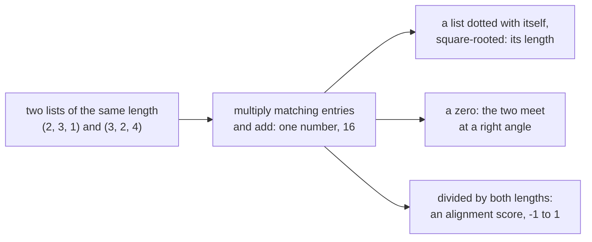
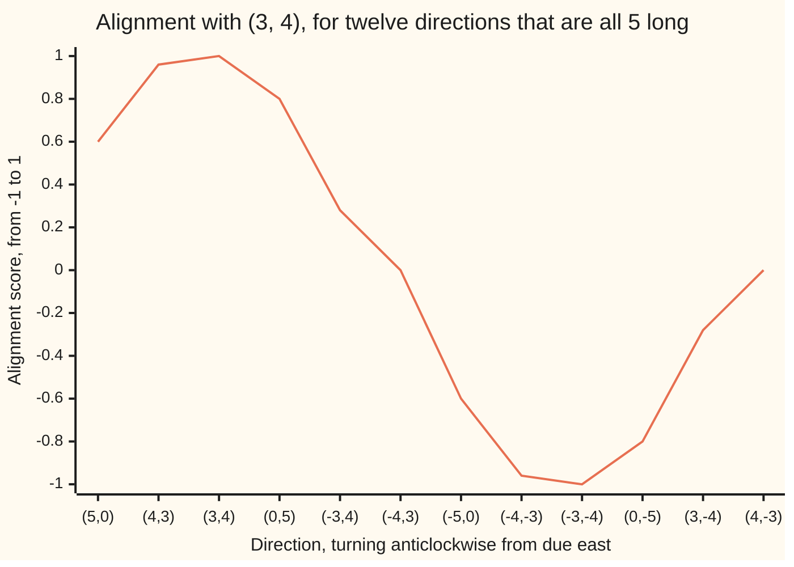

# The dot product: multiply matching entries and add, and one number gives length, perpendicularity and alignment

[Syllabus](../../../SYLLABUS.md) → [Algebra](../../../SYLLABUS.md#w03) → [Dot Products and Best Fits](../../../SYLLABUS.md#w03-s06) → The dot product

---

## General Overview

A weekly shop: 2 loaves, 3 milks, 1 dozen eggs. The prices, listed in the same order: $3 a loaf, $2 a milk, $4 a dozen.

Totalling that is not new. Bread is 2 × 3 = $6. Milk, 3 × 2 = $6. Eggs, 1 × 4 = $4. Add the three lines and the bill is **$16**.

Multiply matching entries, add the results. That operation is the **dot product**, written with a dot between the lists: (2, 3, 1) · (3, 2, 4) = 16. A list in round brackets is a vector, from [Vectors](../03-Vectors/01-vectors.md).

Run the same arithmetic on two arrows drawn on a map and it becomes geometry: lengths, right angles, and how nearly two arrows agree.

**Multiply matching entries and add: the one number that falls out carries both lengths and how much the two agree.**

**What kind of fact this is:** a definition, carrying three theorems proved below in Why it works: the length rule, the right-angle test and the −1 to 1 bound.

### The picture: one operation, three readings



---

## The formula

For two vectors with three entries each:

$$u \cdot v = u_1 v_1 + u_2 v_2 + u_3 v_3$$

**Read it aloud:** first with first, second with second, third with third; multiply each pair and add.

The small numbers are position labels, not powers: $u_1$ is the first entry of $u$. Two entries or two hundred, the rule is the same. Which list goes first makes no difference, since $u \cdot v = v \cdot u$; which entry meets which makes all of it.

| Symbol | Plain meaning | In our example | Push it up and the answer… |
| --- | --- | --- | --- |
| $u$ | the first list, a vector | the basket, (2, 3, 1) | more of anything, a bigger bill |
| $v$ | the second list, the same length | the prices, (3, 2, 4) | a price rise lifts the bill |
| $u_1$, $u_2$, $u_3$, $v_1$, $v_2$, $v_3$ | the entries, paired by position | 2, 3, 1 and 3, 2, 4 | shuffle one list and the total usually moves |
| $u \cdot v$ | the dot product: paired products, added | 16 dollars | — |
| $\lvert u\rvert$, $\lvert v\rvert$ | the lengths: $\sqrt{u \cdot u}$ and $\sqrt{v \cdot v}$ | 5, for the leg (3, 4) | the score is unmoved: lengths divide out |
| $u \cdot v / (\lvert u\rvert\,\lvert v\rvert)$ | the alignment score, never outside −1 to 1 | 1, for (3, 4) and (6, 8) | — |

Three readings come out of that one number.

- **Length.** A vector dotted with itself, square-rooted ([Roots](../../01-Foundations/03-Powers%2C%20Roots%20and%20Logarithms/03-roots-and-fractional-exponents.md)): $|u| = \sqrt{u \cdot u}$.
- **Right angle.** For two vectors that are not all zeros, $u \cdot v = 0$ exactly when they point at right angles — **orthogonal**, meaning perpendicular. A list of zeros counts as orthogonal to everything, by convention.
- **Alignment.** Divide by both lengths and the sizes cancel, leaving direction alone:

$$\text{alignment score} = \frac{u \cdot v}{|u| \, |v|}$$

The score reads 1 the same way, 0 at a right angle, −1 dead opposite. (It is the cosine of the angle, which wing 05 handles properly.)

### When it holds

- **Two lists of the same length.** A fourth entry would have nothing to pair with.
- **Any real numbers, in any units.** The bill pairs loaves with dollars.
- **Square axes and one unit of length, for the geometry.** Lengths and right angles need perpendicular directions measured alike: kilometres east, kilometres north. The shop's own square root measures nothing.
- **Two arrows that go somewhere, for an angle.** The score divides by both lengths, and zeros have length 0.

---

## Why it works

### Step 0: the dot product is a bill

Quantity times price, line by line, added. Every reading below is that bill, on lists whose entries mean map positions.

### Step 1: a vector dotted with itself is its length squared

A cyclist rides 3 km east, then 4 km north. As a vector: (3, 4). Dot it with itself: 3 × 3 = 9, and 4 × 4 = 16, added, **25**.

Those are the two legs squared and added, which is Pythagoras ([Pythagorean triples](../../02-Number%20theory/07-For%20the%20Curious/01-pythagorean-triples.md)): 25 is the squared straight-line distance from start to finish, and the distance is its square root, **5 km**.

### Step 2: a zero means a right angle

Two directions: (3, 4) and (4, −3). Dot them: 3 × 4 = 12, and 4 × (−3) = −12, added, **0**.

Both are 5 long. Why that zero means a right angle, with no angles used:

Start both arrows from the same point. The gap between their tips is $u - v$, subtracted entry by entry. Pythagoras runs backwards: the corner at the start is a right angle exactly when the squared gap equals the two squared lengths added. Expand it:

$$|u - v|^2 = |u|^2 - 2\,(u \cdot v) + |v|^2$$

<details>
<summary>The algebra behind that line</summary>

$u - v$ has entries $u_1 - v_1$, then $u_2 - v_2$, and so on. Dot it with itself and multiply out one position: $(u_1 - v_1)(u_1 - v_1) = u_1 u_1 - 2 u_1 v_1 + v_1 v_1$; every position does the same. Collect three kinds of term: $u$-with-$u$ makes $|u|^2$, $v$-with-$v$ makes $|v|^2$, and the cross terms make $-2\,(u \cdot v)$.

</details>

The two squared lengths are already there, so the squared gap equals them added **exactly when the middle term vanishes** — when $u \cdot v = 0$.

The numbers agree: the tips of (3, 4) and (4, −3) are (−1, 7) apart, squared length **50**, and 25 + 25 is also **50**.

### Step 3: dividing by the lengths leaves direction alone

(3, 4) and (6, 8) point the same way; the second is twice as long. Dot them: 3 × 6 = 18, and 4 × 8 = 32, added, **50**. On its own that 50 is useless: stretching either arrow stretches it too.

Divide by both lengths — 5 for (3, 4), 10 for (6, 8): 50 / (5 × 10) = **1**.



The line is the alignment score of (3, 4) against twelve directions, all 5 long. It peaks at 1 at (3, 4), crosses 0 at (−4, 3), the right angle, and bottoms at −1 at (−3, −4).

No pair escapes that range, for one reason: a squared length cannot go negative.

<details>
<summary>Detailed proof: why the score never escapes −1 to 1</summary>

Take $v$ with some entry not zero, pick any number x, and take x copies of $v$ away from $u$. That result's squared length cannot be negative, and expanding as Step 2 did gives $|u|^2 - 2x\,(u \cdot v) + x^2|v|^2 \ge 0$. The smallest it gets is at $x = (u \cdot v)/|v|^2$; put that in and the line collapses to $(u \cdot v)^2 \le |u|^2|v|^2$. A dot product never exceeds the product of the lengths, so dividing by it pins the score inside −1 to 1. Zero needs $u$ to be exactly x copies of $v$, so ±1 belongs to arrows on one line: the **Cauchy–Schwarz inequality**, tested by the check on all twelve directions.

</details>

<details>
<summary>The same arithmetic on functions</summary>

Replace a list of entries by a function's values across an interval. There are infinitely many, so the sum of paired products becomes an integral of the product, $\int f(x)\,g(x)\,dx$. Length, right angles and the −1 to 1 bound survive the swap. Two functions whose integral comes out zero are called orthogonal — not the same as carrying unrelated information, which is independence, a wing 09 idea. The door into Inner products.

</details>

A second road never multiplies a quantity by a price: add the two vectors, square-length the sum, subtract the two squared lengths, halve what is left. The plus-sign version of the same expansion leaves twice the dot product — it was hiding inside lengths all along. [Projection](02-orthogonal-projection.md) takes it into shadows.

---

## Worked numbers, by hand

| Step | Arithmetic | Value |
| --- | --- | --- |
| the three lines of the bill | 2 × 3, then 3 × 2, then 1 × 4 | 6, 6 and 4 |
| the bill, (2, 3, 1) · (3, 2, 4) | 6 + 6 + 4 | **16** |
| the leg dotted with itself, (3, 4) · (3, 4) | 9 + 16 | 25 |
| the leg's length | the square root of 25 | **5** |
| (3, 4) · (4, −3) | 12 − 12 | **0** |
| (3, 4) · (6, 8) | 18 + 32 | 50 |
| their alignment score | 50 / (5 × 10) | **1** |

The shop costs $16, the cyclist finishes 5 km out, (3, 4) and (4, −3) cross square, (3, 4) and (6, 8) score a flat 1.

### What breaks if you drop a piece

| Mistake | Comes out at | What went wrong |
| --- | --- | --- |
| Adding the matched entries instead of multiplying them | 15 | Each line is quantity times price, not plus |
| Multiplying the total quantity by the total price | 54 | That charges every item at every price |
| Pairing the lists back to front, (2, 3, 1) · (4, 2, 3) | 17 | Position is the matching: eggs must meet the egg price |
| Calling 25 the leg's length | 25 | 25 is the length squared; the length is its square root, 5 |

The check prints all four.

---

## Code, from first principles, and it actually runs

Nothing is imported. The dot product is built as the loop it is: walk both lists, multiply each pair, add it on. A second road reaches the same $16 bill from three squared lengths, with no quantity ever multiplied by a price. Pythagoras on the tips confirms the right angle, the bound is tested on twelve directions, and the last two printed lines are the chart.

### Python

```python
# The dot product -- the check behind the card.  Nothing is imported.  A weekly
# shop: quantities (2, 3, 1) at prices (3, 2, 4); a cyclist's leg (3, 4); the
# direction (4, -3) at right angles to it; (6, 8), the same way twice as long.
# Two roads to the bill, Pythagoras on the tips, Cauchy-Schwarz on twelve arrows.
SHOP_Q, SHOP_P = (2, 3, 1), (3, 2, 4)
LEG, PERP, TWICE = (3, 4), (4, -3), (6, 8)
ROUND = [(5, 0), (4, 3), (3, 4), (0, 5), (-3, 4), (-4, 3),
         (-5, 0), (-4, -3), (-3, -4), (0, -5), (3, -4), (4, -3)]

def dot(a, b):                # road one: multiply matching entries, add them up
    total = 0
    for x, y in zip(a, b):
        total += x * y
    return total

def squares(w):               # one list's own squares added up, nothing paired
    total = 0
    for t in w:
        total += t * t
    return total

def dot_from_lengths(a, b):   # road two: three squared lengths, no paired products
    both = [x + y for x, y in zip(a, b)]
    return (squares(both) - squares(a) - squares(b)) / 2

def length(w): return squares(w) ** 0.5

def show(w): return "(" + ", ".join(str(t) for t in w) + ")"

def one(name, value): print(f"{name:<46}{value:>6}")

for a, b in ((SHOP_Q, SHOP_P), (LEG, LEG), (LEG, PERP), (LEG, TWICE)):
    print(f"line by line, {show(a)} . {show(b)}: "
          + ", ".join(f"{x} x {y} = {x * y}" for x, y in zip(a, b)))
one("(2, 3, 1) . (3, 2, 4), the bill in dollars", dot(SHOP_Q, SHOP_P))
one("the same bill, from squared lengths only", f"{dot_from_lengths(SHOP_Q, SHOP_P):.0f}")
one("(3, 4) . (3, 4)", dot(LEG, LEG))
one("the leg's length, the square root of 25", f"{length(LEG):.1f}")
one("(3, 4) . (4, -3)", dot(LEG, PERP))
one("(3, 4) . (6, 8)", dot(LEG, TWICE))
one("the alignment score, 50 / (5 x 10)",
    f"{dot(LEG, TWICE) / (length(LEG) * length(TWICE)):.2f}")
gap = tuple(x - y for x, y in zip(LEG, PERP))
print(f"the tips of (3, 4) and (4, -3) are {show(gap)} apart, squared length "
      f"{squares(gap)} = {squares(LEG)} + {squares(PERP)}")
add_them = sum(x + y for x, y in zip(SHOP_Q, SHOP_P))
all_pairs = sum(SHOP_Q) * sum(SHOP_P)
back_to_front = dot(SHOP_Q, tuple(reversed(SHOP_P)))
print(f"the four mistakes come out at {add_them}, {all_pairs}, "
      f"{back_to_front} and {squares(LEG)}")
scores = [dot(LEG, d) / (length(LEG) * length(d)) for d in ROUND]
print("alignment scores with (3, 4), for twelve directions each of length 5:")
print("  " + "".join(f"{show(d).replace(', ', ','):>8}" for d in ROUND))
print("  " + "".join(f"{s:>8.2f}" for s in scores))
assert dot(SHOP_Q, SHOP_P) == 16 and dot_from_lengths(SHOP_Q, SHOP_P) == 16.0
assert (add_them, all_pairs, back_to_front) == (15, 54, 17)
assert squares(LEG) == 25 and dot(LEG, PERP) == 0 and squares(gap) == squares(LEG) + squares(PERP)
assert scores[2] == 1.0 and scores[8] == -1.0 and all(-1.0 <= s <= 1.0 for s in scores)
assert all(dot(LEG, d) ** 2 <= squares(LEG) * squares(d) for d in ROUND)   # Cauchy-Schwarz
print("ALL CHECKS PASS")
```

**Ran 2026-09-19 on macOS, Python 3.14.6, standard library only. All checks passed. Output, pasted from the run:**

```
line by line, (2, 3, 1) . (3, 2, 4): 2 x 3 = 6, 3 x 2 = 6, 1 x 4 = 4
line by line, (3, 4) . (3, 4): 3 x 3 = 9, 4 x 4 = 16
line by line, (3, 4) . (4, -3): 3 x 4 = 12, 4 x -3 = -12
line by line, (3, 4) . (6, 8): 3 x 6 = 18, 4 x 8 = 32
(2, 3, 1) . (3, 2, 4), the bill in dollars        16
the same bill, from squared lengths only          16
(3, 4) . (3, 4)                                   25
the leg's length, the square root of 25          5.0
(3, 4) . (4, -3)                                   0
(3, 4) . (6, 8)                                   50
the alignment score, 50 / (5 x 10)              1.00
the tips of (3, 4) and (4, -3) are (-1, 7) apart, squared length 50 = 25 + 25
the four mistakes come out at 15, 54, 17 and 25
alignment scores with (3, 4), for twelve directions each of length 5:
     (5,0)   (4,3)   (3,4)   (0,5)  (-3,4)  (-4,3)  (-5,0) (-4,-3) (-3,-4)  (0,-5)  (3,-4)  (4,-3)
      0.60    0.96    1.00    0.80    0.28    0.00   -0.60   -0.96   -1.00   -0.80   -0.28    0.00
ALL CHECKS PASS
```

### Rust

Same numbers, same labels, built with `rustc --edition 2021 -O`.

```rust
// The dot product -- the same check as the Python, in Rust.  No crates.  A weekly
// shop: quantities (2, 3, 1) at prices (3, 2, 4); a cyclist's leg (3, 4); the
// direction (4, -3) at right angles to it; (6, 8), the same way twice as long.
// Two roads to the bill, Pythagoras on the tips, Cauchy-Schwarz on twelve arrows.
const SHOP_Q: [i64; 3] = [2, 3, 1];
const SHOP_P: [i64; 3] = [3, 2, 4];
const LEG: [i64; 2] = [3, 4];
const PERP: [i64; 2] = [4, -3];
const TWICE: [i64; 2] = [6, 8];
const ROUND: [[i64; 2]; 12] = [[5, 0], [4, 3], [3, 4], [0, 5], [-3, 4], [-4, 3],
                               [-5, 0], [-4, -3], [-3, -4], [0, -5], [3, -4], [4, -3]];

fn dot(a: &[i64], b: &[i64]) -> i64 {   // road one: multiply matching entries, add
    let mut total = 0;
    for k in 0..a.len() { total += a[k] * b[k]; }
    total
}

fn squares(w: &[i64]) -> i64 {          // one list's own squares, nothing paired
    let mut total = 0;
    for &t in w { total += t * t; }
    total
}

fn dot_from_lengths(a: &[i64], b: &[i64]) -> f64 {   // road two: squared lengths only
    let both: Vec<i64> = (0..a.len()).map(|k| a[k] + b[k]).collect();
    (squares(&both) - squares(a) - squares(b)) as f64 / 2.0
}

fn length(w: &[i64]) -> f64 { (squares(w) as f64).sqrt() }

fn show(w: &[i64]) -> String {
    let parts: Vec<String> = w.iter().map(|t| t.to_string()).collect();
    format!("({})", parts.join(", "))
}

fn one(name: &str, value: String) { println!("{:<46}{:>6}", name, value); }

fn main() {
    for (a, b) in [(&SHOP_Q[..], &SHOP_P[..]), (&LEG[..], &LEG[..]),
                   (&LEG[..], &PERP[..]), (&LEG[..], &TWICE[..])] {
        let parts: Vec<String> = (0..a.len())
            .map(|k| format!("{} x {} = {}", a[k], b[k], a[k] * b[k])).collect();
        println!("line by line, {} . {}: {}", show(a), show(b), parts.join(", "));
    }
    one("(2, 3, 1) . (3, 2, 4), the bill in dollars", format!("{}", dot(&SHOP_Q, &SHOP_P)));
    one("the same bill, from squared lengths only",
        format!("{:.0}", dot_from_lengths(&SHOP_Q, &SHOP_P)));
    one("(3, 4) . (3, 4)", format!("{}", dot(&LEG, &LEG)));
    one("the leg's length, the square root of 25", format!("{:.1}", length(&LEG)));
    one("(3, 4) . (4, -3)", format!("{}", dot(&LEG, &PERP)));
    one("(3, 4) . (6, 8)", format!("{}", dot(&LEG, &TWICE)));
    one("the alignment score, 50 / (5 x 10)",
        format!("{:.2}", dot(&LEG, &TWICE) as f64 / (length(&LEG) * length(&TWICE))));
    let gap: Vec<i64> = (0..LEG.len()).map(|k| LEG[k] - PERP[k]).collect();
    println!("the tips of (3, 4) and (4, -3) are {} apart, squared length {} = {} + {}",
             show(&gap), squares(&gap), squares(&LEG), squares(&PERP));
    let add_them: i64 = (0..SHOP_Q.len()).map(|k| SHOP_Q[k] + SHOP_P[k]).sum();
    let all_pairs: i64 = SHOP_Q.iter().sum::<i64>() * SHOP_P.iter().sum::<i64>();
    let back: Vec<i64> = SHOP_P.iter().rev().cloned().collect();
    let back_to_front = dot(&SHOP_Q, &back);
    println!("the four mistakes come out at {}, {}, {} and {}",
             add_them, all_pairs, back_to_front, squares(&LEG));
    let scores: Vec<f64> = ROUND.iter()
        .map(|d| dot(&LEG, d) as f64 / (length(&LEG) * length(d))).collect();
    println!("alignment scores with (3, 4), for twelve directions each of length 5:");
    let mut names = String::from("  ");
    for d in ROUND.iter() { names.push_str(&format!("{:>8}", show(d).replace(", ", ","))); }
    println!("{}", names);
    let mut row = String::from("  ");
    for s in scores.iter() { row.push_str(&format!("{:>8.2}", s)); }
    println!("{}", row);
    assert!(dot(&SHOP_Q, &SHOP_P) == 16 && dot_from_lengths(&SHOP_Q, &SHOP_P) == 16.0);
    assert!(add_them == 15 && all_pairs == 54 && back_to_front == 17);
    assert!(squares(&LEG) == 25 && dot(&LEG, &PERP) == 0 && squares(&gap) == squares(&LEG) + squares(&PERP));
    assert!(scores[2] == 1.0 && scores[8] == -1.0
            && scores.iter().all(|&s| (-1.0..=1.0).contains(&s)));
    assert!(ROUND.iter().all(|d| dot(&LEG, d).pow(2) <= squares(&LEG) * squares(d)));   // Cauchy-Schwarz
    println!("ALL CHECKS PASS");
}
```

**Ran 2026-09-19 on macOS, rustc 1.98.1, no crates. All checks passed. Output, pasted from the run:**

```
line by line, (2, 3, 1) . (3, 2, 4): 2 x 3 = 6, 3 x 2 = 6, 1 x 4 = 4
line by line, (3, 4) . (3, 4): 3 x 3 = 9, 4 x 4 = 16
line by line, (3, 4) . (4, -3): 3 x 4 = 12, 4 x -3 = -12
line by line, (3, 4) . (6, 8): 3 x 6 = 18, 4 x 8 = 32
(2, 3, 1) . (3, 2, 4), the bill in dollars        16
the same bill, from squared lengths only          16
(3, 4) . (3, 4)                                   25
the leg's length, the square root of 25          5.0
(3, 4) . (4, -3)                                   0
(3, 4) . (6, 8)                                   50
the alignment score, 50 / (5 x 10)              1.00
the tips of (3, 4) and (4, -3) are (-1, 7) apart, squared length 50 = 25 + 25
the four mistakes come out at 15, 54, 17 and 25
alignment scores with (3, 4), for twelve directions each of length 5:
     (5,0)   (4,3)   (3,4)   (0,5)  (-3,4)  (-4,3)  (-5,0) (-4,-3) (-3,-4)  (0,-5)  (3,-4)  (4,-3)
      0.60    0.96    1.00    0.80    0.28    0.00   -0.60   -0.96   -1.00   -0.80   -0.28    0.00
ALL CHECKS PASS
```

The two outputs match line for line.

> [!TIP]
> **Try changing**
> Guess first, then run it. The asserts are pinned to the shop and the map, so expect one to halt it.
> - **Put the prices back to front.** Set `SHOP_P` to `(4, 2, 3)`: the bill lands on 17, the third mistake, and the first assert halts it.
> - **Stretch the leg.** Set `LEG` to `(6, 8)`: the length doubles and the dot products that were not zero grow, the one with (4, −3) stays 0, and no score moves, because lengths divide out. The assert pinned to 25 halts it.
> - **Break the right angle.** Set `PERP` to `(4, -2)`: the dot product stops being 0, the tips stop sitting 50 apart, and the third assert halts it.

---

## The usual mistake

> [!warning]
> **Expecting a vector back.** Two lists go in and one plain number comes out. (2, 3, 1) · (3, 2, 4) is 16 dollars, not a basket. That collapse into one measurement is why it can answer questions about length and angle.
>
> - Adding matching entries instead of multiplying gives 15, close enough to 16 to slip through unnoticed.
> - A dot product of 0 does not mean "nothing here". It means "at right angles", one of the most useful answers available.
> - Divide the lengths out before reading a number as alignment: 50 sounds like agreement, but it is the 1 that says so.

---

## Where you meet it in real life

- **Any itemised bill.** A till receipt, a payroll run, an invoice: quantities in one list, rates in the other, one dot product.
- **Recommendations and search.** Documents, songs and users become long lists of numbers, and the alignment score ranks them.
- **Maps and games.** Whether a surface faces a light: a sign check on one dot product.
- **Fitting a line to data.** The shadow of one vector on another, then the best-fit line, are this again ([Projection](02-orthogonal-projection.md), [Least squares](04-least-squares.md)).

> **Say it back**
> Multiply matching entries, add the results: the dot product, and for the weekly shop the $16 bill. A vector dotted with itself gives its length squared, so the square root is the length: (3, 4) is 5 long. Between two arrows that go somewhere, a zero means a right angle, as for (3, 4) and (4, −3). Divided by both lengths it becomes an alignment score between −1 and 1: (3, 4) and (6, 8) score 1.

---

## What this builds on

- [Vectors](../03-Vectors/01-vectors.md): what a list in round brackets is, and how to scale one.
- [Matrix times vector](../04-Matrices/02-matrix-times-vector.md): a matrix times a vector is a stack of these, one per row.
- [Roots](../../01-Foundations/03-Powers%2C%20Roots%20and%20Logarithms/03-roots-and-fractional-exponents.md): the square root that turns 25 into 5.
- [Pythagorean triples](../../02-Number%20theory/07-For%20the%20Curious/01-pythagorean-triples.md): 3, 4, 5 and the squared-legs rule the length formula rests on.

## Where this goes next

- [Projection](02-orthogonal-projection.md): shadow and leftover.
- [Lines and planes](../../05-Geometry%20and%20trig/05-Vectors%20in%20Space/02-lines-and-planes-in-space.md): planes from perpendiculars.
- [Tangent planes](../../06-Calculus%20and%20analysis/07-Several%20Variables/02-differentiability-and-tangent-planes.md): flat up close.
- [Gradient](../../06-Calculus%20and%20analysis/07-Several%20Variables/03-gradient-and-directional-derivatives.md): steepest uphill.
- [Complex vectors and matrices](../../07-Complex%20analysis/01-Complex%20Numbers%20and%20the%20Plane/07-complex-vectors-and-matrices.md): one slot flipped.
- [Parseval's identity](../../08-Differential%20equations%20and%20dynamics/09-Fourier%20Series/03-parsevals-identity.md): energy across waves.
- [Holder's inequality](../../10-Measure%20and%20integration/07-Sizes%20of%20Functions/02-holders-inequality.md): the bound widened.
- States as vectors: alignment as probability.
- k-means: grouping by distance.
- Support vector machines: dot products left implicit.
- Separating hyperplanes: one sign decides.
- QR: perpendicular directions, safely.
- The distance menu: distance without dot products.
- Inner products: the same rules, endlessly.
- Riesz representation: every linear reading is a dot product.
- First fundamental form: lengths on curved surfaces.
- Covectors and tensor fields: the second list as a machine.

Nothing here splits a vector into a part along another and a part square to it; that split, and the shadow it names, comes next.

---

## Sources

Verified 19 Sep 2026; every link below resolves to the publisher's page.

- Axler, Sheldon. *Linear Algebra Done Right*, 4th ed. Springer, 2024. [Publisher page](https://link.springer.com/book/10.1007/978-3-031-41026-0). Chapter 6, Inner Product Spaces, defines the operation and derives the bound.
- Strang, Gilbert. *Introduction to Linear Algebra*, 6th ed. Wellesley-Cambridge Press, 2023. [Publisher page](https://www.wellesleycambridge.com/). Chapter 1 takes the dot product, lengths and the right-angle test in this order.
- *Calculus Volume 3*, section 2.3, "The Dot Product." OpenStax, Rice University. [Textbook page](https://openstax.org/books/calculus-volume-3/pages/2-3-the-dot-product). A free treatment in the standard notation.
