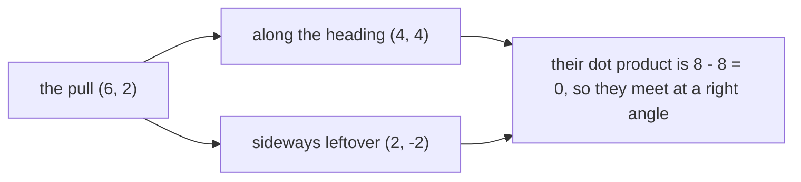
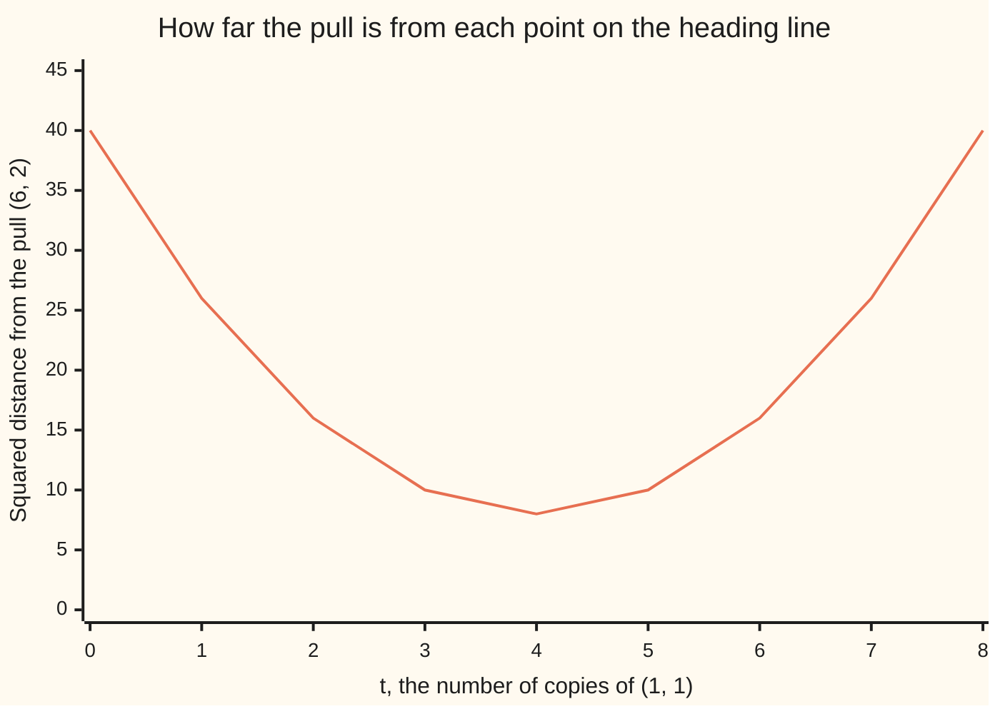

# Projection: the shadow of one vector on another, and the leftover that is always perpendicular

[Syllabus](../../../SYLLABUS.md) → [Algebra](../README.md) → [Dot Products and Best Fits](../README.md#s06) → Orthogonal projection

---

## General Overview

A rower pulls on the oar: 6 newtons east and 2 north, the pair (6, 2), measured against two fixed map directions.

The boat moves along the line it points down and nowhere else: northeast, say, along (1, 1) — a pair naming a direction, not a distance.

So the pull splits: (4, 4) runs along the heading and drives the boat, (2, -2) shoves the bow sideways and drives nothing; the two add back to (6, 2).

Those parts sit at right angles. Multiply matching entries and add: 4 times 2 is 8, 4 times -2 is -8, total 0. A zero dot product means perpendicular ([The dot product](01-dot-product.md)).

**A vector splits, one way only, into a piece along a chosen direction and a leftover at right angles to it — and that piece is the closest the direction can get.**

**What kind of fact this is:** a theorem, proved on this card in Why it works; projection and residual are definitions.



The piece along the heading is the **projection**; the leftover is the **residual**. Those two names carry the rest of the card.

---

## The formula

Call the vector being split $u$, the rower's pull, and the direction projected onto $v$, the boat's heading. Shadow and leftover:

$$p \;=\; \frac{u \cdot v}{v \cdot v}\, v, \qquad\qquad e \;=\; u - p.$$

**Read it aloud:** the dot product says how much of the pull runs along the heading; dividing by the heading's dot product with itself cancels the arrow's length, leaving the copies to lay down.

That count gets its own letter:

$$t \;=\; \frac{u \cdot v}{v \cdot v}, \qquad\qquad p \;=\; t\,v.$$

| Symbol | Plain meaning | In our example | Push it up and the answer… |
| --- | --- | --- | --- |
| $u$ | the vector being split: the pull | (6, 2) | a shadow grown in proportion |
| $v$ | the direction projected onto: the heading | (1, 1) | no change: only v's direction counts |
| $u \cdot v$ | the dot product: matching entries multiplied, added | 8 | more pull along the heading, a longer shadow |
| $v \cdot v$ | the heading dotted with itself: its squared length | 2 | t shrinks as v grows; the shadow holds still |
| $t$ | copies of the heading in the shadow | 4 | a longer shadow, same line |
| $p$ | the projection: the useful part | (4, 4) | — |
| $e$ | the residual: the leftover, at right angles to v | (2, -2) | more pull wasted sideways |
| $w_1$, $w_2$ | perpendicular directions naming a plane | (1, 1, 0), (1, -1, 0) | a tilted plane, a tilted shadow |

For a plane, named by perpendicular directions $w_1$ and $w_2$, project onto each and add the shadows:

$$p \;=\; \frac{u \cdot w_1}{w_1 \cdot w_1}\, w_1 \;+\; \frac{u \cdot w_2}{w_2 \cdot w_2}\, w_2.$$

The same formula twice, summed.

### When it holds

- **The heading is not the zero vector.** Its dot product with itself sits underneath: a zero there leaves nothing to divide by.
- **A whole line or plane through the origin.** On a segment the nearest point can be an end; for a line missing the origin, subtract a point of it, project, add the point back.
- **The two plane directions are perpendicular.** Skewed ones share a part, each shadow counts it, and the sum overshoots; straighten them first, [Gram-Schmidt](03-gram-schmidt-and-orthonormal-bases.md).
- **The miss is plain squared distance.** Stretch one axis and a different point comes out closest.

---

## Why it works

### Step 0: a direction can only offer multiples of itself

The heading (1, 1) reaches its own multiples and nothing else, negative ones included. So the useful part of the pull is some number of copies of (1, 1); the only question is which number.

### Step 1: demand a perpendicular leftover, and that number falls out

Write the leftover as the pull minus the shadow: $e = u - t\,v$. Now demand what the picture insists on: the leftover meets the heading at a right angle, so their dot product is zero.

The dot product splits over subtraction, so that reads

$$(u - t\,v)\cdot v \;=\; u\cdot v \;-\; t\,(v\cdot v) \;=\; 0,$$

and rearranging for $t$ gives

$$t \;=\; \frac{u\cdot v}{v\cdot v}.$$

With our numbers, 8 minus t times 2 is 0: t is 4, and the shadow is 4 copies of (1, 1), namely (4, 4). Nothing was assumed but the right angle.

### Step 2: perpendicular turns out to be closest

A different question, answered without a dot product: which point on the heading line is nearest the pull?

Every point on it is t copies of (1, 1), so the gap from the pull is (6 - t, 2 - t), with squared length

$$(6-t)^2 + (2-t)^2 \;=\; 2t^2 - 16t + 40.$$

Complete the square, as on [The quadratic formula](../02-Polynomials/03-quadratic-formula.md):

$$2t^2 - 16t + 40 \;=\; 2(t-4)^2 + 8.$$

A square is never negative, so the smallest value sits where the squared piece vanishes: t = 4, giving 8 — the same t as step 1, reached without mentioning a right angle.



The curve bottoms out at t = 4, floor 8: perpendicular and closest are the same point — the reason every best-fit method reaches for projection.

<details>
<summary>Detailed proof: closest, and only one, in any dimension</summary>

The parabola settled one example; this settles all, with nothing but the dot product. Write W for the line or plane, p for the shadow, e = u - p for the leftover, which dots to zero against every direction in W.

Any other point w of W gives u - w = e + (p - w). Since p - w lies in W, it is perpendicular to e, so the cross terms cancel:

$$(u-w)\cdot(u-w) \;=\; e\cdot e \;+\; (p-w)\cdot(p-w).$$

The last piece is never negative, so nothing in W beats p, and only w = p ties. Uniqueness follows: two splits u = p + e = p' + e' give p - p' = e' - e, lying in W and perpendicular to W, so it dots to zero with itself — only the zero vector does.

</details>

### Step 3: the two pieces balance by Pythagoras

Squared length of the pull, 40; of the shadow, 32; of the leftover, 8. And 32 plus 8 is 40 — Pythagoras, on the right-angled triangle the split just made.

That 8 appears twice: the leftover's squared length, and the floor of the curve above.

### Step 4: a plane is two lines at once, when the two are perpendicular

The rower is also lifting the oar. Measure a third direction, upward: the pull becomes (6, 2, 3), the 3 being lift.

The water surface is a plane. Two directions lie in it: the heading w1 = (1, 1, 0) and straight across the boat w2 = (1, -1, 0). Their dot product is 1 - 1 + 0 = 0, so they are perpendicular, as the formula needs.

Project onto each and add: (4, 4, 0) plus (2, -2, 0) is (6, 2, 0), leftover (0, 0, 3), which dots to 0 against both — the answer the eye gives: the surface is everything with no lift.

Perpendicular matters: each shadow is invisible to the other direction, so neither disturbs the other's sum.

<details>
<summary>The one-step version: a matrix that does the projecting</summary>

Stack the directions as the columns of a matrix A, none a mix of the others. Any vector b then has shadow P b on the space they span, with
$$P = A\,(A^{T} A)^{-1} A^{T}.$$
Raised T means rows and columns swapped; raised -1 means the inverse, the matrix that undoes it, which exists exactly because no column is a mix of the others. For our line A is the single column (1, 1), the bracket holds only v dotted with itself, 2, and (6, 2) through P returns (4, 4). Projecting twice adds nothing: P P = P. It is the object [Least squares](04-least-squares.md) solves for.

</details>

---

## Worked numbers, by hand

| Step | Arithmetic | Value |
| --- | --- | --- |
| the pull u | east, then north | (6, 2) |
| the heading v | where the boat points | (1, 1) |
| u dotted with v | 6 times 1, plus 2 times 1 | 8 |
| v dotted with itself | 1 times 1, plus 1 times 1 | 2 |
| t, the copies | 8 divided by 2 | 4 |
| the shadow, t copies of v | 4 times (1, 1) | **(4, 4)** |
| the leftover, pull minus shadow | (6 - 4, 2 - 4) | **(2, -2)** |
| the right angle, checked | 4 times 2, plus 4 times -2 | **0** |
| squared lengths, shadow plus leftover | 32 plus 8 | **40**, the pull's own |

Of the rower's (6, 2) the boat receives (4, 4); the other (2, -2) slews the bow for nothing. As lengths, not squares: 6.3246 newtons of pull, 5.6569 useful, 2.8284 wasted.

### What breaks if you drop a piece

| Mistake | Comes out at | What went wrong |
| --- | --- | --- |
| Never dividing: shadow = (u dot v) times v | (8, 8) | Its leftover dots to -8 against the heading, not 0 |
| Dividing by the heading's length, not by v dotted with itself | (5.6569, 5.6569) | Squared miss 13.4903, not the smallest 8 |
| Projecting the heading onto the pull | (1.2, 0.4) | A different question: the heading's shadow on the pull |
| One of the plane's two directions only | leftover (2, -2, 3) | It dots to 4 against the second direction: that share is still in |

The code prints all four.

---

## Code, from first principles, and it actually runs

Nothing is imported. Road one is the formula: dot, divide, scale. Road two never touches it: it writes the squared distance from the pull to t copies of the heading, fits a parabola through three of those values, and takes its lowest point. The plane is done twice too.

### Python

```python
# Projection -- the check behind the card.  Nothing is imported.  A rower pulls
# with force (6, 2) while the boat points along (1, 1).  Road one is the formula.
# Road two never touches it: it fits the parabola through three squared distances
# from the pull to the line and takes that parabola's lowest point.  The plane
# case is done twice too, from two perpendicular pairs inside the same plane.
def dot(a, b): return sum(x * y for x, y in zip(a, b))
def scale(t, a): return tuple(t * x for x in a)
def sub(a, b): return tuple(x - y for x, y in zip(a, b))
def add(a, b): return tuple(x + y for x, y in zip(a, b))
def n(x): return f"{x:.4f}".rstrip("0").rstrip(".")
def show(a): return "(" + ", ".join(n(x) for x in a) + ")"
def one(name, value): print(f"{name:<44}{value}")
def project(u, v): return scale(dot(u, v) / dot(v, v), v)          # road one

u, v = (6, 2), (1, 1)                        # the pull, and the boat's heading
p = project(u, v)                            # the shadow
e = sub(u, p)                                # the leftover
one("the pull u and the boat's heading v", show(u) + " and " + show(v))
one("u . v and v . v", f"{n(dot(u, v))} and {n(dot(v, v))}")
one("t = (u . v) / (v . v)", n(dot(u, v) / dot(v, v)))
one("the shadow p = t v", show(p))
one("the leftover e = u - p", show(e))
one("e . v and e . p", f"{n(dot(e, v))} and {n(dot(e, p))}")
one("lengths of u, p, e: squared, then actual",
    f"{n(dot(u, u))}, {n(dot(p, p))}, {n(dot(e, e))} then "
    f"{n(dot(u, u) ** 0.5)}, {n(dot(p, p) ** 0.5)}, {n(dot(e, e) ** 0.5)}")

def dist2(t): return sum((x - t * y) ** 2 for x, y in zip(u, v))   # no dot product used
one("squared distance from u to t v, t = 0 to 8", ", ".join(n(dist2(t)) for t in range(9)))
c = dist2(0)                                             # road two: fit the parabola
a, b = (dist2(1) + dist2(-1)) / 2 - c, (dist2(1) - dist2(-1)) / 2
t_low = -b / (2 * a)
one("road two: the parabola a, b, c", f"{n(a)}, {n(b)}, {n(c)}")
one("road two: lowest at t, and the point there", f"{n(t_low)}, {show(scale(t_low, v))}")

f, w1, w2 = (6, 2, 3), (1, 1, 0), (1, -1, 0)     # the same pull, now lifting a little
pp = add(project(f, w1), project(f, w2))
ee = sub(f, pp)
one("the plane: pull " + show(f) + ", parts w1, w2",
    show(project(f, w1)) + " + " + show(project(f, w2)))
one("the shadow on the plane", show(pp))
one("the leftover, then its dots with w1 and w2",
    f"{show(ee)}, {n(dot(ee, w1))} and {n(dot(ee, w2))}")
alt = add(project(f, (1, 0, 0)), project(f, (0, 1, 0)))   # road two: another pair
one("road two: same plane, from (1,0,0), (0,1,0)", show(alt))

m1 = scale(dot(u, v), v)                                  # forgot to divide at all
m2 = scale(dot(u, v) / dot(v, v) ** 0.5, v)               # divided by the length
m3 = project(v, u)                                        # projected the wrong way round
m4 = sub(f, project(f, w1))                               # used one direction of two
one("mistake 1: never divided", f"{show(m1)}, leftover . v = {n(dot(sub(u, m1), v))}")
one("mistake 2: divided by the length",
    f"{show(m2)}, squared miss {n(sum((x - y) ** 2 for x, y in zip(u, m2)))}")
one("mistake 3: projected the wrong way round", show(m3))
one("mistake 4: one direction of the two", f"{show(m4)}, and m4 . w2 = {n(dot(m4, w2))}")
assert p == (4.0, 4.0) and e == (2.0, -2.0) and dot(e, v) == 0 and dot(e, p) == 0
assert t_low == 4.0 and scale(t_low, v) == p and abs(dist2(t_low) - dot(e, e)) < 1e-12
assert dot(u, u) == dot(p, p) + dot(e, e) == 40
assert pp == alt == (6.0, 2.0, 0.0) and ee == (0.0, 0.0, 3.0) and dot(ee, w1) == dot(ee, w2) == 0
print("ALL CHECKS PASS")
```

**Ran 2026-09-19 on macOS, Python 3.14.6, standard library only. All checks passed. Output, pasted from the run:**

```
the pull u and the boat's heading v         (6, 2) and (1, 1)
u . v and v . v                             8 and 2
t = (u . v) / (v . v)                       4
the shadow p = t v                          (4, 4)
the leftover e = u - p                      (2, -2)
e . v and e . p                             0 and 0
lengths of u, p, e: squared, then actual    40, 32, 8 then 6.3246, 5.6569, 2.8284
squared distance from u to t v, t = 0 to 8  40, 26, 16, 10, 8, 10, 16, 26, 40
road two: the parabola a, b, c              2, -16, 40
road two: lowest at t, and the point there  4, (4, 4)
the plane: pull (6, 2, 3), parts w1, w2     (4, 4, 0) + (2, -2, 0)
the shadow on the plane                     (6, 2, 0)
the leftover, then its dots with w1 and w2  (0, 0, 3), 0 and 0
road two: same plane, from (1,0,0), (0,1,0) (6, 2, 0)
mistake 1: never divided                    (8, 8), leftover . v = -8
mistake 2: divided by the length            (5.6569, 5.6569), squared miss 13.4903
mistake 3: projected the wrong way round    (1.2, 0.4)
mistake 4: one direction of the two         (2, -2, 3), and m4 . w2 = 4
ALL CHECKS PASS
```

### Rust

Same numbers, same labels, built with `rustc --edition 2021 -O`.

```rust
// Projection -- the same check as the Python, in Rust.  No crates.  A rower pulls
// with force (6, 2) while the boat points along (1, 1).  Road one is the formula.
// Road two never touches it: it fits the parabola through three squared distances
// from the pull to the line and takes that parabola's lowest point.  The plane
// case is done twice too, from two perpendicular pairs inside the same plane.
fn dot(a: &[f64], b: &[f64]) -> f64 { a.iter().zip(b).map(|(x, y)| x * y).sum() }
fn scale(t: f64, a: &[f64]) -> Vec<f64> { a.iter().map(|x| t * x).collect() }
fn sub(a: &[f64], b: &[f64]) -> Vec<f64> { a.iter().zip(b).map(|(x, y)| x - y).collect() }
fn add(a: &[f64], b: &[f64]) -> Vec<f64> { a.iter().zip(b).map(|(x, y)| x + y).collect() }
fn n(x: f64) -> String {
    let s = format!("{:.4}", x);
    s.trim_end_matches('0').trim_end_matches('.').to_string()
}
fn show(a: &[f64]) -> String {
    let parts: Vec<String> = a.iter().map(|x| n(*x)).collect();
    format!("({})", parts.join(", "))
}
fn one(name: &str, value: String) { println!("{:<44}{}", name, value); }
fn project(u: &[f64], v: &[f64]) -> Vec<f64> { scale(dot(u, v) / dot(v, v), v) }   // road one
fn main() {
    let (u, v) = (vec![6.0, 2.0], vec![1.0, 1.0]);   // the pull, and the boat's heading
    let p = project(&u, &v);                         // the shadow
    let e = sub(&u, &p);                             // the leftover
    one("the pull u and the boat's heading v", format!("{} and {}", show(&u), show(&v)));
    one("u . v and v . v", format!("{} and {}", n(dot(&u, &v)), n(dot(&v, &v))));
    one("t = (u . v) / (v . v)", n(dot(&u, &v) / dot(&v, &v)));
    one("the shadow p = t v", show(&p));
    one("the leftover e = u - p", show(&e));
    one("e . v and e . p", format!("{} and {}", n(dot(&e, &v)), n(dot(&e, &p))));
    one("lengths of u, p, e: squared, then actual",
        format!("{}, {}, {} then {}, {}, {}", n(dot(&u, &u)), n(dot(&p, &p)), n(dot(&e, &e)),
                n(dot(&u, &u).sqrt()), n(dot(&p, &p).sqrt()), n(dot(&e, &e).sqrt())));
    // no dot product here: the squared distance from u to the point t v, spelled out
    let dist2 = |t: f64| -> f64 { u.iter().zip(&v).map(|(x, y)| (x - t * y).powi(2)).sum() };
    let grid: Vec<String> = (0..9).map(|t| n(dist2(t as f64))).collect();
    one("squared distance from u to t v, t = 0 to 8", grid.join(", "));
    let c = dist2(0.0);                                     // road two: fit the parabola
    let (a, b) = ((dist2(1.0) + dist2(-1.0)) / 2.0 - c, (dist2(1.0) - dist2(-1.0)) / 2.0);
    let t_low = -b / (2.0 * a);
    one("road two: the parabola a, b, c", format!("{}, {}, {}", n(a), n(b), n(c)));
    one("road two: lowest at t, and the point there",
        format!("{}, {}", n(t_low), show(&scale(t_low, &v))));

    let f = vec![6.0, 2.0, 3.0];                     // the same pull, now lifting a little
    let (w1, w2) = (vec![1.0, 1.0, 0.0], vec![1.0, -1.0, 0.0]);
    let pp = add(&project(&f, &w1), &project(&f, &w2));
    let ee = sub(&f, &pp);
    one(&format!("the plane: pull {}, parts w1, w2", show(&f)),
        format!("{} + {}", show(&project(&f, &w1)), show(&project(&f, &w2))));
    one("the shadow on the plane", show(&pp));
    one("the leftover, then its dots with w1 and w2",
        format!("{}, {} and {}", show(&ee), n(dot(&ee, &w1)), n(dot(&ee, &w2))));
    let alt = add(&project(&f, &[1.0, 0.0, 0.0]), &project(&f, &[0.0, 1.0, 0.0]));  // another pair
    one("road two: same plane, from (1,0,0), (0,1,0)", show(&alt));

    let m1 = scale(dot(&u, &v), &v);                          // forgot to divide at all
    let m2 = scale(dot(&u, &v) / dot(&v, &v).sqrt(), &v);     // divided by the length
    let m3 = project(&v, &u);                                 // projected the wrong way round
    let m4 = sub(&f, &project(&f, &w1));                      // used one direction of two
    one("mistake 1: never divided",
        format!("{}, leftover . v = {}", show(&m1), n(dot(&sub(&u, &m1), &v))));
    let miss: f64 = u.iter().zip(&m2).map(|(x, y)| (x - y).powi(2)).sum();
    one("mistake 2: divided by the length", format!("{}, squared miss {}", show(&m2), n(miss)));
    one("mistake 3: projected the wrong way round", show(&m3));
    one("mistake 4: one direction of the two",
        format!("{}, and m4 . w2 = {}", show(&m4), n(dot(&m4, &w2))));
    assert!(p == vec![4.0, 4.0] && e == vec![2.0, -2.0] && dot(&e, &v) == 0.0 && dot(&e, &p) == 0.0);
    assert!(t_low == 4.0 && scale(t_low, &v) == p && (dist2(t_low) - dot(&e, &e)).abs() < 1e-12);
    assert!(dot(&u, &u) == dot(&p, &p) + dot(&e, &e) && dot(&u, &u) == 40.0);
    assert!(pp == vec![6.0, 2.0, 0.0] && pp == alt && ee == vec![0.0, 0.0, 3.0]
            && dot(&ee, &w1) == 0.0 && dot(&ee, &w2) == 0.0);
    println!("ALL CHECKS PASS");
}
```

**Ran 2026-09-19 on macOS, rustc 1.98.1, no crates. All checks passed. Output, pasted from the run:**

```
the pull u and the boat's heading v         (6, 2) and (1, 1)
u . v and v . v                             8 and 2
t = (u . v) / (v . v)                       4
the shadow p = t v                          (4, 4)
the leftover e = u - p                      (2, -2)
e . v and e . p                             0 and 0
lengths of u, p, e: squared, then actual    40, 32, 8 then 6.3246, 5.6569, 2.8284
squared distance from u to t v, t = 0 to 8  40, 26, 16, 10, 8, 10, 16, 26, 40
road two: the parabola a, b, c              2, -16, 40
road two: lowest at t, and the point there  4, (4, 4)
the plane: pull (6, 2, 3), parts w1, w2     (4, 4, 0) + (2, -2, 0)
the shadow on the plane                     (6, 2, 0)
the leftover, then its dots with w1 and w2  (0, 0, 3), 0 and 0
road two: same plane, from (1,0,0), (0,1,0) (6, 2, 0)
mistake 1: never divided                    (8, 8), leftover . v = -8
mistake 2: divided by the length            (5.6569, 5.6569), squared miss 13.4903
mistake 3: projected the wrong way round    (1.2, 0.4)
mistake 4: one direction of the two         (2, -2, 3), and m4 . w2 = 4
ALL CHECKS PASS
```

The two outputs match line for line.

> [!TIP]
> **Try changing**
> Guess first, then run it. The asserts, the lines that halt the program on a wrong number, are pinned to the rower's numbers.
> - **Point the boat down the pull.** `v` as `(3, 1)`, half the pull: the shadow is the whole pull, (6, 2), the leftover (0, 0). The first assert stops it.
> - **Turn the boat across the pull.** `v` as `(1, -3)`: the dot product is 0, t is 0, the whole pull wasted. The first assert stops it.
> - **Stop the rower lifting.** `f` as `(6, 2, 0)`: the pull lies in the water surface, so the leftover is (0, 0, 0). The last assert stops it.

---

## The usual mistake

> [!warning]
> **Thinking the shadow depends on how long the direction arrow is.** It does not. Doubling the heading changes nothing about where the boat points, and the formula agrees: the top doubles, the bottom quadruples, t halves, then multiplies an arrow twice as long — back where it started.
>
> - Skipping the division: (8, 8), with a leftover dotting to -8 against the heading, not 0. A leftover off the right angle means the shadow is wrong.
> - Dividing by the heading's length: (5.6569, 5.6569), squared miss 13.4903 rather than 8.
> - Projecting the heading onto the pull: (1.2, 0.4). Both are legal; only one answers the question.

---

## Where you meet it in real life

- **Best-fit lines through data.** Points on no straight line still have a closest line; finding it is one projection, the residuals perpendicular to everything the fit could reach — [Least squares](04-least-squares.md).
- **Stripping a known effect out of measurements.** Project onto a pattern known to be in the data, drop the shadow, keep the leftover: what remains dots to zero against it.
- **Coordinates in new axes.** Against perpendicular directions one unit long, a vector's coordinates are its dot products with them, each one a projection: [Gram-Schmidt](03-gram-schmidt-and-orthonormal-bases.md).

> **Say it back**
> A vector splits into a piece along a chosen direction and a perpendicular leftover: projection and residual. Dot the vector with the direction, divide by that direction's dot product with itself, lay down that many copies. The rower's (6, 2) on a heading of (1, 1) gives (4, 4) useful and (2, -2) wasted, dotting to 0. Perpendicular and closest are one point, which is why projection is what "best fit" means.

---

## What this builds on

- [The dot product](01-dot-product.md): multiplying matching entries and adding — the one number that gives length, tests perpendicularity at zero, and measures how much of one vector runs along another.

## Where this goes next

- [Gram-Schmidt](03-gram-schmidt-and-orthonormal-bases.md): skewed directions made perpendicular, so any plane works.
- [Least squares](04-least-squares.md): the closest point of step 2, fitted to data no line fits.
- [Legendre's equation](../../08-Differential%20equations%20and%20dynamics/07-Series%20Solutions%20and%20Boundary%20Problems/04-legendre-polynomials.md): projection where the vectors are polynomials.
- [Fourier series](../../08-Differential%20equations%20and%20dynamics/09-Fourier%20Series/01-fourier-series-and-orthogonality.md): a signal projected onto waves, one coefficient each.
- [L2 as a Hilbert space](../../10-Measure%20and%20integration/07-Sizes%20of%20Functions/06-l2-as-a-hilbert-space.md): functions as vectors, their dot product an integral.
- [Conditional expectation as a projection](../../10-Measure%20and%20integration/09-Conditional%20Expectation/03-conditional-expectation-as-projection.md): a forecast as the projection of a random quantity.
- Projection: this proof where the directions never run out.
- Partial sums are the best fit: how much a few waves capture, and the miss left.
- Random projection: random directions that shrink data, keeping distances.

Each adds shadows onto several directions at once, which step 4 allows only while they stay perpendicular; [Gram-Schmidt](03-gram-schmidt-and-orthonormal-bases.md) makes them so.

---

## Sources

Verified 19 Sep 2026: every link below resolves to the publisher's page.

- Strang, Gilbert. *Introduction to Linear Algebra*, 6th ed. Wellesley-Cambridge Press, 2023. [Book page](https://math.mit.edu/~gs/linearalgebra/). Chapter 4 builds projection onto a line, then a subspace, then least squares.
- Strang, Gilbert. "Projections onto Subspaces." *18.06 Linear Algebra*, MIT OpenCourseWare, Spring 2010. [Lecture 15](https://ocw.mit.edu/courses/18-06-linear-algebra-spring-2010/resources/lecture-15-projections-onto-subspaces/). The same derivation on video, projection matrix included.
- Axler, Sheldon. *Linear Algebra Done Right*, 4th ed. Springer, 2024. [Open-access book](https://linear.axler.net/), [doi:10.1007/978-3-031-41026-0](https://doi.org/10.1007/978-3-031-41026-0). Chapter 6 proves the split unique, and the projection the unique closest point.
