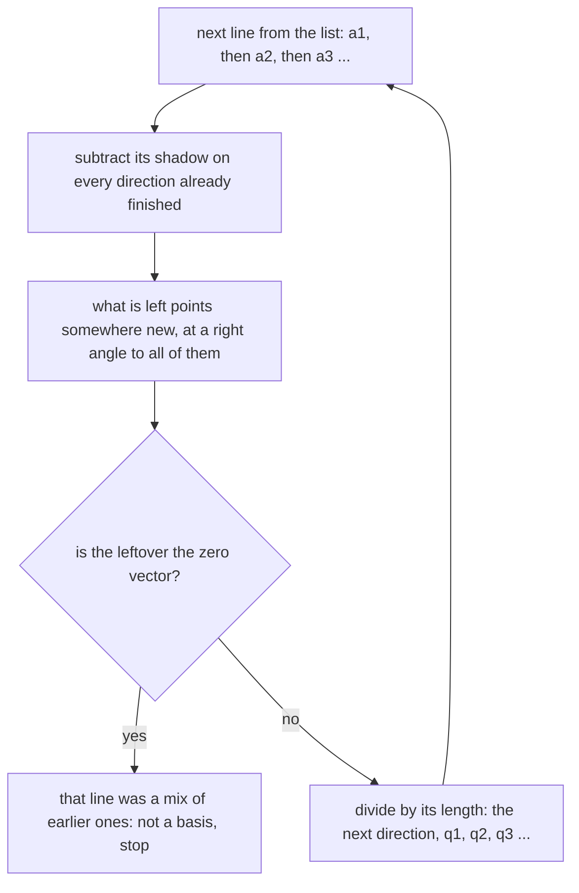

# Gram-Schmidt: straighten a skewed basis into perpendicular unit directions, and coordinates become dot products

[Syllabus](../../../SYLLABUS.md) → [Algebra](../../../SYLLABUS.md#w03) → [Dot Products and Best Fits](../../../SYLLABUS.md#w03-s06) → Gram-Schmidt

---

## General Overview

A surveyor pegs two lines from the corner of a building site: 3 metres east and 1 north, the vector (3, 1); and 2 east and 2 north, (2, 2). Every point on the site is so much along each, which makes the pair a **basis** ([Basis and dimension](../03-Vectors/05-basis-and-dimension.md)).

A bad basis, though: not square to each other, neither a tidy length, so "how much along each" means two equations solved at once, once per peg.

Gram-Schmidt fixes the directions rather than the points. Keep the first line, shrunk to length 1. From the second, subtract the part already running along the first — its **projection** on that direction, the shadow of [Projection](02-orthogonal-projection.md). What is left sticks out at a right angle. Shrink it too.

Out come (3, 1) and (-1, 3), each over the square root of 10, about 3.162278: exactly perpendicular, exactly one unit long. Every decimal here is rounded. Such a set is **orthonormal** — *ortho* for right angles, *normal* for unit lengths.

**Peel off the shadow, keep the leftover, scale it to length one; down the list, locating a point becomes one dot product per direction instead of a solved system.**

**What kind of fact this is:** a method; its two facts, perpendicular leftovers and dot-product coordinates, are proved in Why it works.

### The picture: the loop, one line at a time



The loop re-aims the lines; an independent list reaches the same points.

---

## The formula

Write the survey lines $a_1$ and $a_2$, the straightened pair $q_1$ and $q_2$. The bars $\lVert \cdot \rVert$ mean length: the square root of a vector dotted with itself ([The dot product](01-dot-product.md)).

$$q_1 = \frac{a_1}{\lVert a_1 \rVert}$$

$$\text{leftover} = a_2 - (a_2 \cdot q_1)\, q_1, \qquad q_2 = \frac{\text{leftover}}{\lVert \text{leftover} \rVert}$$

**Read it aloud:** keep the first line, shrunk to one unit; from the second subtract the piece already running along the first, and shrink what is left.

A third line subtracts two shadows, $a_3 - (a_3 \cdot q_1)\, q_1 - (a_3 \cdot q_2)\, q_2$, then divides by its length; a fourth, three.

What the work buys, for any point $b$:

$$b = (b \cdot q_1)\, q_1 + (b \cdot q_2)\, q_2$$

**Read it aloud:** every point is its own shadow on each straightened direction, added back together — no equations, just dot products.

| Symbol | Plain meaning | In our example | Push it up and the answer… |
| --- | --- | --- | --- |
| $a_1$, $a_2$ | the survey lines to start from | (3, 1) and (2, 2) | — |
| $q_1$, $q_2$ | the straightened directions: perpendicular, one unit long | (0.948683, 0.316228) and (-0.316228, 0.948683) | — |
| $\lVert \cdot \rVert$ | the square root of a vector dotted with itself | length of (3, 1) is 3.162278 | — |
| $u \cdot v$ | the dot product: multiply matching entries, add | (2, 2) dotted with $q_1$ is 2.529822 | a longer shadow |
| $b$ | a point to locate | the stake at (4, 2) | — |
| $c_1$, $c_2$ | the coordinates of $b$: how far along each | 4.427189 and 0.632456 | the point slides along it |
| $Q$ | the 2 × 2 matrix with $q_1$, $q_2$ as columns | rows [0.948683, -0.316228] and [0.316228, 0.948683] | — |
| $Q^{\mathsf T}$, $I$ | $Q$ with rows and columns swapped; the identity, 1s on the diagonal, 0s elsewhere | $Q^{\mathsf T}Q = I$ | — |

### When it holds

- **An independent list.** A line already a mix of the earlier ones leaves a zero leftover, with nothing to scale: (6, 2) after (3, 1) gives (0.000000, 0.000000).
- **One size, real entries, the ordinary dot product.** Every step is a dot product, and different-sized vectors have none.
- **A fixed order.** The first line survives untouched, so starting from (2, 2) gives a different pair.
- **Points the list reaches.** Two perpendicular directions reach the whole plane; where a list reaches less, the dot products give the nearest point inside it.

---

## Why it works

### Step 0: subtracting a shadow leaves a right angle

Subtract a vector's shadow on a direction and the leftover is perpendicular to that direction — [Projection](02-orthogonal-projection.md) proves it. Gram-Schmidt runs that move down a list.

### Step 1: the first direction only needs shrinking

Nothing to be perpendicular to yet. Divide $a_1$ by its own length: same direction, length 1. That division is **normalising**.

### Step 2: the leftover is perpendicular

Dot $q_1$ with the leftover. The dot product splits over subtraction:

$$q_1 \cdot (a_2 - (a_2 \cdot q_1)\, q_1) = q_1 \cdot a_2 - (a_2 \cdot q_1)\,(q_1 \cdot q_1)$$

And $q_1 \cdot q_1 = 1$: a vector dotted with itself is its length squared, and $q_1$ has length 1. So the two terms are equal, the difference is zero — a right angle out of arithmetic. Any other length for $q_1$ and the cancellation fails.

Scaling the leftover afterwards multiplies both entries by the same positive number, so a zero dot product stays zero: perpendicular still, and one unit long.

Further down the list the same cancellation runs against every finished direction at once: each shadow taken off is a multiple of a direction the others are perpendicular to.

### Step 3: coordinates become dot products

Suppose $b$ sits at $c_1 q_1 + c_2 q_2$. Dot both sides with $q_1$:

$$b \cdot q_1 = c_1 (q_1 \cdot q_1) + c_2 (q_2 \cdot q_1) = c_1 \times 1 + c_2 \times 0 = c_1$$

The second direction contributes nothing, being perpendicular, so $c_1$ is $b \cdot q_1$; the same argument gives $c_2$ — two dot products, no system. The cross terms vanish the same way in $b \cdot b = c_1^2 + c_2^2$, Pythagoras in new coordinates.

### Step 4: same site, and a zero leftover

Each straightened direction is built from the original lines, and each original line rebuilds from them: both reach the same points. A zero leftover means that line was already a mix of the earlier ones: not a basis ([Basis and dimension](../03-Vectors/05-basis-and-dimension.md)).

### Step 5: the orthogonal matrix

Put the two directions side by side as the columns of a square matrix $Q$. The transpose $Q^{\mathsf T}$ swaps rows and columns, so its rows are those directions and every entry of $Q^{\mathsf T}Q$ is one of the dot products above: row two, column one is $q_2 \cdot q_1$, or 0.000000.

$$Q^{\mathsf T}Q = I$$

A square matrix with that property is **orthogonal** — a poor name, since the columns must be unit length too. Its inverse is its transpose. And multiplying two points by $Q$ before dotting them sends their entries through $Q^{\mathsf T}Q$, which is $I$: the dot product is unchanged, so lengths and angles survive.

So it cannot stretch or squash; it turns the plane or flips it. Ours has determinant ([Determinants](../05-Solving%20Systems/04-determinants.md)) 1.000000, a turn, like the quarter turn with columns (0, 1) and (-1, 0). The flip with columns (1, 0) and (0, -1) has determinant -1.000000, the mirror. Determinant 1 alone is not enough: doubling one axis and halving the other gives it.

Two doors, named and left alone: $Q$ beside the mixing numbers that rebuild the original lines is the **QR factorisation** (QR); the complex twin of an orthogonal matrix is **unitary**. And the code takes each shadow's size from the running leftover, **modified** Gram-Schmidt, not from the original line, **classical**: equal exactly, but modified holds the right angles better in floating point.

---

## Worked numbers, by hand

Printed to six decimals; the exact values are perpendicular and unit length.

| Step | Arithmetic | Value |
| --- | --- | --- |
| length of $a_1$ | square root of 3 × 3 + 1 × 1 | 3.162278 |
| $q_1$ | (3, 1) divided by 3.162278 | (0.948683, 0.316228) |
| $a_2 \cdot q_1$ | (2 × 0.948683) + (2 × 0.316228) | 2.529822 |
| the shadow | 2.529822 × $q_1$ | (2.400000, 0.800000) |
| the leftover | (2, 2) − (2.400000, 0.800000) | (-0.400000, 1.200000) |
| its length | square root of 0.400000 × 0.400000 + 1.200000 × 1.200000 | 1.264911 |
| $q_2$ | (-0.400000, 1.200000) divided by 1.264911 | **(-0.316228, 0.948683)** |
| right-angle check | $q_1 \cdot q_2$ | **0.000000** |

Both have length 1.000000: orthonormal.

Now locate the stake at $b$ = (4, 2).

| Step | Arithmetic | Value |
| --- | --- | --- |
| $c_1$, which is $b \cdot q_1$ | (4 × 0.948683) + (2 × 0.316228) | 4.427189 |
| $c_2$, which is $b \cdot q_2$ | (4 × −0.316228) + (2 × 0.948683) | 0.632456 |
| rebuild | 4.427189 × $q_1$ + 0.632456 × $q_2$ | **(4.000000, 2.000000)** |
| Pythagoras | $b \cdot b$ against $c_1^2 + c_2^2$ | 20.000000 and 20.000000 |
| the raw lines, solved | 3x + 2y = 4 and x + 2y = 2 | 1.000000 and 0.500000 |

On the skewed lines that pair cost a solved system.

### What breaks if you drop a piece

| Mistake | Comes out at | What went wrong |
| --- | --- | --- |
| Shadow on raw (3, 1), not unit $q_1$ | leftover (-22.000000, -6.000000) | Its size needs dividing by $a_1 \cdot a_1$, 10 here |
| Never scaled to one | the stake rebuilds at (41.680000, 14.960000) | The shortcut needs a direction dotted with itself to be 1 |
| (6, 2) second, twice the first | leftover (0.000000, 0.000000) | Nothing is left pointing anywhere new |

The code prints all three.

---

## Code, from first principles, and it actually runs

Nothing is imported. The survey lines go through the loop from the picture and the stake's coordinates come off as dot products; a second, independent road solves the equations for the same numbers. A mast at (1, 1, 1) adds a third dimension.

### Python

```python
# Gram-Schmidt -- the check behind the card.  Nothing is imported.  Two survey
# lines on a building site, (3, 1) and (2, 2), are straightened into
# perpendicular unit directions, and a stake at (4, 2) is then read off by dot
# products.  A second case adds a mast, (1, 1, 1), to make a third direction.
def dot(u, v): return sum(a * b for a, b in zip(u, v))
def length(u): return dot(u, u) ** 0.5
def scale(k, u): return tuple(k * a for a in u)
def minus(u, v): return tuple(a - b for a, b in zip(u, v))
def plus(u, v): return tuple(a + b for a, b in zip(u, v))
def gram_schmidt(vs):                        # peel off shadows, then scale to 1
    qs = []
    for v in vs:
        for q in qs:
            v = minus(v, scale(dot(v, q), q))
        qs.append(scale(1.0 / length(v), v))
    return qs

def num(x): return f"{0.0 if abs(x) < 5e-7 else x:.6f}"   # no -0.000000
def vec(u): return "(" + ", ".join(num(x) for x in u) + ")"
def row(name, *cells): print(f"{name:<44}" + "  ".join(cells))

a1, a2, b = (3.0, 1.0), (2.0, 2.0), (4.0, 2.0)
q1, q2 = gram_schmidt([a1, a2])
shadow = scale(dot(a2, q1), q1)
left = minus(a2, shadow)
c1, c2 = dot(b, q1), dot(b, q2)              # one road: coordinates are dots
rebuilt = plus(scale(c1, q1), scale(c2, q2))
det = q1[0] * q2[1] - q2[0] * q1[1]          # second road: solve for the two
e1 = (b[0] * q2[1] - q2[0] * b[1]) / det     # coordinates by elimination, with
e2 = (q1[0] * b[1] - b[0] * q1[1]) / det     # no dot product anywhere in it
skew = a1[0] * a2[1] - a2[0] * a1[1]         # the same solve on the raw lines
s1, s2 = (b[0] * a2[1] - a2[0] * b[1]) / skew, (a1[0] * b[1] - b[0] * a1[1]) / skew
row("survey lines (3, 1), (2, 2), lengths", num(length(a1)), num(length(a2)))
row("q1 = first line / its length", vec(q1))
row("a2 . q1, and the shadow it casts", num(dot(a2, q1)), vec(shadow))
row("leftover a2 - shadow, and its length", vec(left), num(length(left)))
row("q2 = leftover / length, (-1, 3)/3.162278", vec(q2))
row("q1 . q1, q2 . q2, q1 . q2", num(dot(q1, q1)), num(dot(q2, q2)), num(dot(q1, q2)))
row("stake b = (4, 2), coordinates by dots", num(c1), num(c2))
row("the same two by elimination", num(e1), num(e2))
row("b rebuilt from its coordinates", vec(rebuilt))
row("b . b, and c1^2 + c2^2", num(dot(b, b)), num(c1 * c1 + c2 * c2))
row("b on the raw skewed lines, solved", num(s1), num(s2))
row("Q^T Q rows, and det Q", vec((dot(q1, q1), dot(q1, q2))),
    vec((dot(q2, q1), dot(q2, q2))), num(det))
row("quarter turn (0, 1) and (-1, 0), det", num(0.0 * 0.0 - (-1.0) * 1.0))
row("flip (1, 0) and (0, -1), det", num(1.0 * -1.0 - 0.0 * 0.0))
row("mistake: no divide by a1 . a1", vec(minus(a2, scale(dot(a2, a1), a1))))
row("mistake: leftover never scaled",
    vec(plus(scale(dot(b, a1), a1), scale(dot(b, left), left))))
row("mistake: a2 = (6, 2), leftover", vec(minus((6.0, 2.0), scale(dot((6.0, 2.0), q1), q1))))
m = gram_schmidt([(3.0, 1.0, 0.0), (2.0, 2.0, 0.0), (1.0, 1.0, 1.0)])
row("mast (1, 1, 1) added, q3", vec(m[2]))
row("mast Q^T Q, largest off-diagonal",
    num(max(abs(dot(m[i], m[j])) for i in range(3) for j in range(3) if i != j)))
assert abs(dot(q1, q1) - 1) < 1e-12 and abs(dot(q2, q2) - 1) < 1e-12 and abs(dot(q1, q2)) < 1e-12
assert abs(c1 - 14 / 10 ** 0.5) < 1e-12 and abs(c2 - 2 / 10 ** 0.5) < 1e-12
assert abs(e1 - c1) < 1e-12 and abs(e2 - c2) < 1e-12 and abs(rebuilt[0] - 4) < 1e-12 and abs(rebuilt[1] - 2) < 1e-12
assert abs(dot(b, b) - 20) < 1e-12 and abs(c1 * c1 + c2 * c2 - 20) < 1e-12 and abs(m[2][2] - 1) < 1e-12
print("ALL CHECKS PASS")
```

**Ran 2026-09-19 on macOS, Python 3.14.6, standard library only. All checks passed. Output, pasted from the run:**

```
survey lines (3, 1), (2, 2), lengths        3.162278  2.828427
q1 = first line / its length                (0.948683, 0.316228)
a2 . q1, and the shadow it casts            2.529822  (2.400000, 0.800000)
leftover a2 - shadow, and its length        (-0.400000, 1.200000)  1.264911
q2 = leftover / length, (-1, 3)/3.162278    (-0.316228, 0.948683)
q1 . q1, q2 . q2, q1 . q2                   1.000000  1.000000  0.000000
stake b = (4, 2), coordinates by dots       4.427189  0.632456
the same two by elimination                 4.427189  0.632456
b rebuilt from its coordinates              (4.000000, 2.000000)
b . b, and c1^2 + c2^2                      20.000000  20.000000
b on the raw skewed lines, solved           1.000000  0.500000
Q^T Q rows, and det Q                       (1.000000, 0.000000)  (0.000000, 1.000000)  1.000000
quarter turn (0, 1) and (-1, 0), det        1.000000
flip (1, 0) and (0, -1), det                -1.000000
mistake: no divide by a1 . a1               (-22.000000, -6.000000)
mistake: leftover never scaled              (41.680000, 14.960000)
mistake: a2 = (6, 2), leftover              (0.000000, 0.000000)
mast (1, 1, 1) added, q3                    (0.000000, 0.000000, 1.000000)
mast Q^T Q, largest off-diagonal            0.000000
ALL CHECKS PASS
```

### Rust

Same numbers, same labels, built with `rustc --edition 2021 -O`.

```rust
// Gram-Schmidt -- the same check as the Python, in Rust.  No crates.  Two survey
// lines on a building site, (3, 1) and (2, 2), are straightened into
// perpendicular unit directions, and a stake at (4, 2) is then read off by dot
// products.  A second case adds a mast, (1, 1, 1), to make a third direction.
fn dot(u: &[f64], v: &[f64]) -> f64 { u.iter().zip(v).map(|(a, b)| a * b).sum() }
fn length(u: &[f64]) -> f64 { dot(u, u).powf(0.5) }
fn scale(k: f64, u: &[f64]) -> Vec<f64> { u.iter().map(|a| k * a).collect() }
fn minus(u: &[f64], v: &[f64]) -> Vec<f64> { u.iter().zip(v).map(|(a, b)| a - b).collect() }
fn plus(u: &[f64], v: &[f64]) -> Vec<f64> { u.iter().zip(v).map(|(a, b)| a + b).collect() }
fn gram_schmidt(vs: &[Vec<f64>]) -> Vec<Vec<f64>> {   // peel shadows, scale to 1
    let mut qs: Vec<Vec<f64>> = Vec::new();
    for v0 in vs {
        let mut v = v0.clone();
        for q in &qs { v = minus(&v, &scale(dot(&v, q), q)); }
        let l = length(&v);
        qs.push(scale(1.0 / l, &v));
    }
    qs
}
fn num(x: f64) -> String { format!("{:.6}", if x.abs() < 5e-7 { 0.0 } else { x }) }
fn vec_s(u: &[f64]) -> String {
    format!("({})", u.iter().map(|x| num(*x)).collect::<Vec<String>>().join(", "))
}
fn row(name: &str, cells: &[String]) { println!("{:<44}{}", name, cells.join("  ")); }
fn main() {
    let (a1, a2, b) = (vec![3.0, 1.0], vec![2.0, 2.0], vec![4.0, 2.0]);
    let qs = gram_schmidt(&[a1.clone(), a2.clone()]);
    let (q1, q2) = (qs[0].clone(), qs[1].clone());
    let shadow = scale(dot(&a2, &q1), &q1);
    let left = minus(&a2, &shadow);
    let (c1, c2) = (dot(&b, &q1), dot(&b, &q2));       // one road: coordinates are dots
    let rebuilt = plus(&scale(c1, &q1), &scale(c2, &q2));
    let det = q1[0] * q2[1] - q2[0] * q1[1];           // second road: solve for the two
    let e1 = (b[0] * q2[1] - q2[0] * b[1]) / det;      // coordinates by elimination, with
    let e2 = (q1[0] * b[1] - b[0] * q1[1]) / det;      // no dot product anywhere in it
    let skew = a1[0] * a2[1] - a2[0] * a1[1];          // the same solve on the raw lines
    let s1 = (b[0] * a2[1] - a2[0] * b[1]) / skew;
    let s2 = (a1[0] * b[1] - b[0] * a1[1]) / skew;
    row("survey lines (3, 1), (2, 2), lengths", &[num(length(&a1)), num(length(&a2))]);
    row("q1 = first line / its length", &[vec_s(&q1)]);
    row("a2 . q1, and the shadow it casts", &[num(dot(&a2, &q1)), vec_s(&shadow)]);
    row("leftover a2 - shadow, and its length", &[vec_s(&left), num(length(&left))]);
    row("q2 = leftover / length, (-1, 3)/3.162278", &[vec_s(&q2)]);
    row("q1 . q1, q2 . q2, q1 . q2",
        &[num(dot(&q1, &q1)), num(dot(&q2, &q2)), num(dot(&q1, &q2))]);
    row("stake b = (4, 2), coordinates by dots", &[num(c1), num(c2)]);
    row("the same two by elimination", &[num(e1), num(e2)]);
    row("b rebuilt from its coordinates", &[vec_s(&rebuilt)]);
    row("b . b, and c1^2 + c2^2", &[num(dot(&b, &b)), num(c1 * c1 + c2 * c2)]);
    row("b on the raw skewed lines, solved", &[num(s1), num(s2)]);
    row("Q^T Q rows, and det Q", &[vec_s(&[dot(&q1, &q1), dot(&q1, &q2)]),
        vec_s(&[dot(&q2, &q1), dot(&q2, &q2)]), num(det)]);
    row("quarter turn (0, 1) and (-1, 0), det", &[num(0.0 * 0.0 - (-1.0) * 1.0)]);
    row("flip (1, 0) and (0, -1), det", &[num(1.0 * -1.0 - 0.0 * 0.0)]);
    row("mistake: no divide by a1 . a1", &[vec_s(&minus(&a2, &scale(dot(&a2, &a1), &a1)))]);
    row("mistake: leftover never scaled",
        &[vec_s(&plus(&scale(dot(&b, &a1), &a1), &scale(dot(&b, &left), &left)))]);
    let dep = vec![6.0, 2.0];
    row("mistake: a2 = (6, 2), leftover", &[vec_s(&minus(&dep, &scale(dot(&dep, &q1), &q1)))]);
    let m = gram_schmidt(&[vec![3.0, 1.0, 0.0], vec![2.0, 2.0, 0.0], vec![1.0, 1.0, 1.0]]);
    row("mast (1, 1, 1) added, q3", &[vec_s(&m[2])]);
    let mut off: f64 = 0.0;
    for i in 0..3 { for j in 0..3 { if i != j && dot(&m[i], &m[j]).abs() > off { off = dot(&m[i], &m[j]).abs(); } } }
    row("mast Q^T Q, largest off-diagonal", &[num(off)]);
    assert!((dot(&q1, &q1) - 1.0).abs() < 1e-12 && (dot(&q2, &q2) - 1.0).abs() < 1e-12 && dot(&q1, &q2).abs() < 1e-12);
    assert!((c1 - 14.0 / 10.0f64.powf(0.5)).abs() < 1e-12 && (c2 - 2.0 / 10.0f64.powf(0.5)).abs() < 1e-12);
    assert!((e1 - c1).abs() < 1e-12 && (e2 - c2).abs() < 1e-12 && (rebuilt[0] - 4.0).abs() < 1e-12 && (rebuilt[1] - 2.0).abs() < 1e-12);
    assert!((dot(&b, &b) - 20.0).abs() < 1e-12 && (c1 * c1 + c2 * c2 - 20.0).abs() < 1e-12 && (m[2][2] - 1.0).abs() < 1e-12);
    println!("ALL CHECKS PASS");
}
```

**Ran 2026-09-19 on macOS, rustc 1.98.1, no crates. All checks passed. Output, pasted from the run:**

```
survey lines (3, 1), (2, 2), lengths        3.162278  2.828427
q1 = first line / its length                (0.948683, 0.316228)
a2 . q1, and the shadow it casts            2.529822  (2.400000, 0.800000)
leftover a2 - shadow, and its length        (-0.400000, 1.200000)  1.264911
q2 = leftover / length, (-1, 3)/3.162278    (-0.316228, 0.948683)
q1 . q1, q2 . q2, q1 . q2                   1.000000  1.000000  0.000000
stake b = (4, 2), coordinates by dots       4.427189  0.632456
the same two by elimination                 4.427189  0.632456
b rebuilt from its coordinates              (4.000000, 2.000000)
b . b, and c1^2 + c2^2                      20.000000  20.000000
b on the raw skewed lines, solved           1.000000  0.500000
Q^T Q rows, and det Q                       (1.000000, 0.000000)  (0.000000, 1.000000)  1.000000
quarter turn (0, 1) and (-1, 0), det        1.000000
flip (1, 0) and (0, -1), det                -1.000000
mistake: no divide by a1 . a1               (-22.000000, -6.000000)
mistake: leftover never scaled              (41.680000, 14.960000)
mistake: a2 = (6, 2), leftover              (0.000000, 0.000000)
mast (1, 1, 1) added, q3                    (0.000000, 0.000000, 1.000000)
mast Q^T Q, largest off-diagonal            0.000000
ALL CHECKS PASS
```

The two outputs match line for line.

> [!TIP]
> **Try changing**
> Guess first, then run it. The asserts are pinned to this site's numbers, so expect one to stop the run.
> - **Swap the survey lines.** Pass `[a2, a1]`. Out come (0.707107, 0.707107) and (0.707107, -0.707107): same site, different axes; the coordinate assert stops it.
> - **Move the stake onto the first line.** Set `b` to `(6.0, 2.0)`. The second coordinate reads 0.000000: nothing is left after the first direction.
> - **Make the second line a multiple of the first.** Set `a2` to `(6.0, 2.0)`. In exact arithmetic the leftover is zero, nothing to scale; in floating point it lands near 9e-16 and scaling that noise returns (1.000000, 0.000000). The run stops sooner still, on the raw-lines solve: 3 × 2 − 6 × 1 is zero.

---

## The usual mistake

> [!warning]
> **Subtracting the shadows cast on the original lines rather than on the finished directions.** The originals are not perpendicular to each other, so their shadows overlap and too much comes off: the leftover is at a right angle to nothing.
>
> - **Perpendicular is half of it.** Skip the scaling and the directions still meet at right angles, but the stake rebuilds at (41.680000, 14.960000), not (4.000000, 2.000000).
> - **Dividing by the wrong thing.** On a raw line the shadow's size needs dividing by that line dotted with itself, 10 here; forget it and the leftover is (-22.000000, -6.000000).
> - **Reading "orthogonal matrix" as "columns at right angles".** Without unit length, $Q^{\mathsf T}Q$ is a diagonal of squared lengths, not $I$.

---

## Where you meet it in real life

- **Surveying and construction.** Rough site lines turned into a square, unit grid, each peg located one direction at a time.
- **Best-fit lines.** Least squares projects data onto the space spanned by a matrix's columns, and orthonormal columns keep that arithmetic honest ([Least squares](04-least-squares.md)).
- **Computer graphics.** A camera or a robot arm carries three axes that must stay square and unit length; rounding drifts them, and Gram-Schmidt straightens the frame.
- **Symmetric matrices.** The spectral theorem hands a symmetric matrix its own perpendicular directions, and needs an orthonormal basis to say so ([The spectral theorem](../07-Eigenvalues%20and%20Symmetric%20Matrices/04-spectral-theorem.md)).

> **Say it back**
> Two survey lines, (3, 1) and (2, 2), are a skewed basis, so locating a peg means solving equations. Gram-Schmidt keeps the first, shrunk to length 1, then subtracts from the second the shadow it casts on the first; shrinking that leftover, (-0.400000, 1.200000), gives the second direction. The stake at (4, 2) sits 4.427189 along one and 0.632456 along the other: two dot products, no equations. Stacked as columns they give $Q^{\mathsf T}Q = I$.

---

## What this builds on

- [Projection](02-orthogonal-projection.md): the shadow of one vector on another, and the perpendicular leftover.
- [Basis and dimension](../03-Vectors/05-basis-and-dimension.md): directions that reach everything without redundancy, and why a zero leftover means the list was not one.

## Where this goes next

- [The spectral theorem](../07-Eigenvalues%20and%20Symmetric%20Matrices/04-spectral-theorem.md): symmetric matrices carry their own perpendicular directions.
- [Sturm-Liouville](../../08-Differential%20equations%20and%20dynamics/07-Series%20Solutions%20and%20Boundary%20Problems/09-sturm-liouville-and-orthogonality.md): solutions of a differential equation, perpendicular under an integral.
- Wavelets: perpendicular unit directions, one per band of frequencies.
- Lattices: a skewed basis as the secret, straightening it as the attack.
- QR: the same factorisation from reflections, steady at machine size.
- Orthonormal bases: endlessly many such directions, squared length still a sum of squares.
- Orthogonal polynomials: this loop on 1, x, x^2, with an integral as the dot product.
- The Haar wavelet: the plainest one, built by halving an interval.

Gram-Schmidt builds its directions from whatever lines it is handed; which matrices arrive with such a basis already fitted is the spectral theorem's answer.

---

## Sources

Verified 19 Sep 2026: every link below resolves to the publisher's page.

- Gram, Jørgen Pedersen. "Ueber die Entwickelung reeller Functionen in Reihen mittelst der Methode der kleinsten Quadrate." *Journal für die reine und angewandte Mathematik* 94 (1883), 41–73. [EuDML record](https://eudml.org/doc/148523). Where the process first appears.
- Schmidt, Erhard. "Zur Theorie der linearen und nichtlinearen Integralgleichungen. I. Teil." *Mathematische Annalen* 63 (1907), 433–476. [doi:10.1007/BF01449770](https://doi.org/10.1007/BF01449770); free record at [EuDML](https://eudml.org/doc/158296). The step-by-step version, credited by Schmidt to Gram.
- Axler, Sheldon. *Linear Algebra Done Right*, 4th ed. Springer, 2024. [Open-access site](https://linear.axler.net/); [doi:10.1007/978-3-031-41026-0](https://doi.org/10.1007/978-3-031-41026-0). Chapter 6: the process, the same span, the coordinates.
- Strang, Gilbert. *Linear Algebra*, MIT 18.06SC, Fall 2011. [MIT OpenCourseWare](https://ocw.mit.edu/courses/18-06sc-linear-algebra-fall-2011/). Lectures on orthogonal matrices and Gram-Schmidt.
