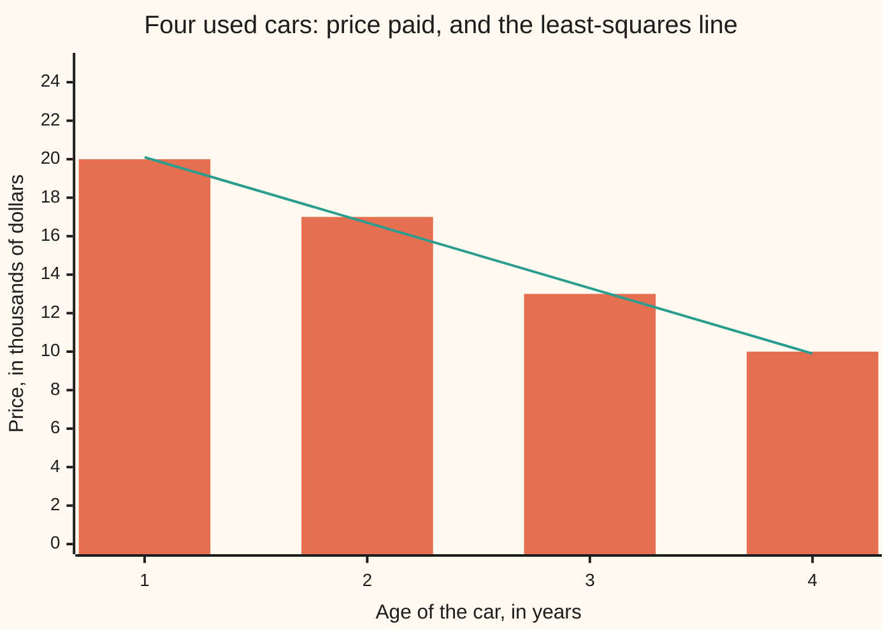
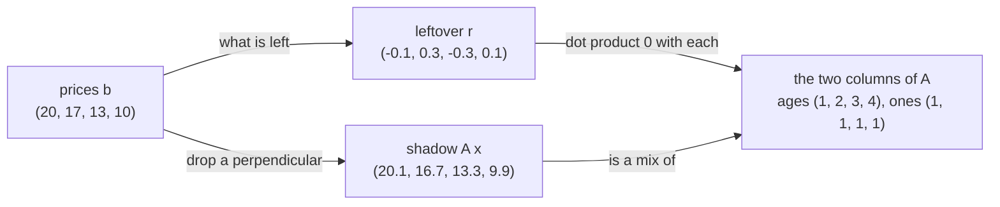

# Least squares: the best-fit line is a projection, and the normal equations hand it to you in one step

Algebra → Dot Products and Best Fits → Best fit → Least squares

---

## General Overview

Four used cars on a forecourt, same model. One year old: $20,000. Two years: $17,000. Three years: $13,000. Four years: $10,000. Prices are counted in thousands from here: 20, 17, 13 and 10.

One rule for all four would be a straight line: a price when new, the same amount off every year. But the drops are 3, then 4, then 3, and a line drops by the same amount each year — four demands, two numbers, so something has to miss.

So ask which line misses least. Least squares scores every candidate the same way — each car's miss, squared, the four squares added — and takes the smallest total. The winner is price = 23.5 − 3.4 × age: the cars land at 20.1, 16.7, 13.3 and 9.9, squared miss 0.2, the worst single miss $300 on a car that sold for 13 thousand. One equation hands that line over; no hunting.

**The four cars stack into one matrix equation with no exact answer, and the best fit is the shadow of the prices on everything a line can reach: the misses left over stick straight out of it.**

**What kind of fact this is:** a method, resting on a theorem proved on this card in Why it works: the nearest point of a flat sheet is the one whose leftover is perpendicular.

### The picture: four cars, and the line that misses least



The bars are the prices paid, the line is the fit; those four gaps are the subject of this card.

---

## The formula

Car by car, the wish is slope × age + intercept = price — four equations in two unknowns.

Stack the left-hand sides into a matrix, one row per car: the age, then a 1. Call it $A$, 4 rows × 2 columns:

`[[1, 1], [2, 1], [3, 1], [4, 1]]`

The first column holds the ages; the second is all ones and carries the intercept, the price at age zero. The unknowns go in $x$ = (slope, intercept), the prices in $b$ = (20, 17, 13, 10). Multiplying $A$ by $x$ ([matrix-multiplication](../04-Matrices/03-matrix-multiplication.md)) rebuilds all four left-hand sides:

$$A x = b$$

and it has no solution. Least squares swaps it for one that does:

$$A^T A x = A^T b$$

$A^T$, said "A transpose", is $A$ with rows and columns swapped: the 4 × 2 becomes 2 × 4.

**Read it aloud:** multiply both sides by the flipped table, and an unsolvable wish becomes two ordinary equations whose answer is the closest line.

| Symbol | Plain meaning | In our example | Push it up and the answer… |
| --- | --- | --- | --- |
| $A$ | one row per car: its age, then a 1 | `[[1, 1], [2, 1], [3, 1], [4, 1]]`, 4 × 2 | more cars pull on the same two numbers |
| $x$ | the unknowns: slope, then intercept | (−3.4, 23.5) | — |
| $b$ | the prices paid, one per car | (20, 17, 13, 10) | raise one, the line tilts that way |
| $A^T$ | "A transpose": rows and columns swapped | 2 × 4: ages in row one, 1s in row two | — |
| $A^T A$ | the columns of $A$ dotted with each other | `[[30, 10], [10, 4]]` | — |
| $A^T b$ | those columns dotted with the prices | (133, 60) | — |
| $r$ | the leftover: price minus fitted price, the residual | (−0.1, 0.3, −0.3, 0.1) | worse fit; the squares are the score |

Every entry is a dot product ([dot-product](01-dot-product.md)): multiply matching entries, add them up. Out come 30 × slope + 10 × intercept = 133 and 10 × slope + 4 × intercept = 60.

### When it holds

- **The ages differ.** Equal ages make the columns copies and the determinant zero: no single slope and intercept.
- **A line is the right shape.** A curved pattern gets a best line that is still the wrong shape; a column for age squared fits the curve.
- **Only the prices miss.** Ages count as known; sloppy ages tilt the slope, unreported.
- **Every car counts the same, squared.** One cheap sale to a friend outweighs three ordinary cars nudging back.

---

## Why it works

### Step 0: four prices are one point

Stop counting cars and count coordinates: the four prices are one arrow, $b$ = (20, 17, 13, 10), in a space with one axis per car.

A line's four predictions are slope × (1, 2, 3, 4) + intercept × (1, 1, 1, 1): every mix of the two columns of $A$. Those mixes sweep out a flat sheet, one point per drawable line — and $b$ is not on it. Fitting is finding the sheet's nearest point.

### Step 1: nearest means perpendicular

That is the projection card ([orthogonal-projection](02-orthogonal-projection.md)): the nearest point is the shadow, and the leftover is perpendicular. A leaning leftover would run partly along the sheet, and sliding that way would shorten it. So the fit is the shadow of $b$, and $r$ = $b$ − $A x$ points straight out. Squared lengths add that way, by Pythagoras — which is why the score squares each miss.

### Step 2: perpendicular to the sheet means perpendicular to both columns

Everything in the sheet is a mix of the two columns, so an arrow at right angles to both is at right angles to every mix. Two dot products carry the condition: ages column · $r$ = 0, ones column · $r$ = 0. That pair is $A^T r$ = (0, 0) — multiplying by $A^T$ dots each column of $A$ with what follows.



The prices split into a shadow a line can hit and a leftover no line can touch.

### Step 3: write the two zeros out, and the equation appears

Put $r$ = $b$ − $A x$ back into $A^T r$ = 0:

$$A^T (b - A x) = 0$$

Push $A^T$ through the bracket, move the second piece across:

$$A^T A x = A^T b$$

These are the **normal equations**; "normal" is the old word for perpendicular, so the name is the geometry. No calculus, nothing minimised by hand: "the leftover is perpendicular" *is* the equation.

### Step 4: two equations, two unknowns

$A^T A$ is 2 × 2 however many cars there are: four here, four thousand at a dealership. Its determinant — the number whose vanishing means no unique answer ([inverse-matrix](../05-Solving%20Systems/03-inverse-matrix.md)) — is 30 × 4 − 10 × 10 = 20. Working code solves the pair rather than inverting.

**The other road.** Statistics teaches this line with no matrix: slope = sum of (age − average age) × (price − average price), divided by the sum of (age − average age) squared; intercept = average price − slope × average age. With average age 2.5 and average price 15: −17 ÷ 5 = −3.4, then 15 + 8.5 = 23.5 — the same equations rearranged. The code runs both.

---

## Worked numbers, by hand

Ages 1, 2, 3, 4. Prices 20, 17, 13, 10, in thousands.

| Step | Arithmetic | Value |
| --- | --- | --- |
| ages · ages | 1 + 4 + 9 + 16 | 30 |
| ages · ones | 1 + 2 + 3 + 4 | 10 |
| ones · ones | four cars | 4 |
| ages · prices | 20 + 34 + 39 + 40 | 133 |
| ones · prices | 20 + 17 + 13 + 10 | 60 |
| determinant | 30 × 4 − 10 × 10 | 20 |
| slope | (133 × 4 − 10 × 60) ÷ 20 | **−3.4** |
| intercept | (30 × 60 − 10 × 133) ÷ 20 | **23.5** |
| fitted prices | 23.5 − 3.4 × each age | 20.1, 16.7, 13.3, 9.9 |
| leftovers | 20 − 20.1, 17 − 16.7, 13 − 13.3, 10 − 9.9 | −0.1, 0.3, −0.3, 0.1 |
| total squared miss | 0.01 + 0.09 + 0.09 + 0.01 | **0.2** |

The model is worth about 23.5 thousand new and drops about 3.4 thousand a year, never more than 0.3 out.

The leftovers carry their own certificate. Ones column: −0.1 + 0.3 − 0.3 + 0.1 = 0. Ages column: −0.1 + 0.6 − 0.9 + 0.4 = 0. Both zero: no other line scores lower.

### What breaks if you drop a piece

| Mistake | Comes out at | What went wrong |
| --- | --- | --- |
| Dropping the column of ones | slope 4.4333, squared miss 368.3667 | Without an intercept the line starts at zero and tilts up: older cars, dearer |
| Fitting the first and last car only | slope −3.3333, squared miss 0.2222 | An exact hit on two cars, no say for the other two |
| Adding the leftovers, not squaring | 0.0000, and 0.0000 again for price = 27.5 − 5 × age | Ups cancel downs, so a line scoring 13.0000 squared ties the best |

The code prints all three.

---

## Code, from first principles, and it actually runs

Nothing is imported. Road one builds the dot products behind $A^T A$ and $A^T b$ from the raw ages and prices, then cross-multiplies the 2 × 2 system; road two reaches the same line from the two averages. The scripts also dot the leftovers against both columns, reproduce the three wrong answers, and fit a second lot of prices.

### Python

```python
# Least squares -- the check behind the card.  Nothing is imported.  Four used cars:
# ages 1, 2, 3, 4 years and prices $20k, $17k, $13k, $10k.  Two roads to the same
# line: the normal equations A^T A x = A^T b, built and solved here by hand, and the
# slope-from-the-means formula that statistics teaches instead.
AGES, PRICES = [1.0, 2.0, 3.0, 4.0], [20.0, 17.0, 13.0, 10.0]
LATER, MISSES = [21.0, 18.0, 12.0, 9.0], [-0.1, 0.3, -0.3, 0.1]   # second lot; misses by hand

def normal_equations(xs, ys):                     # road 1: A^T A x = A^T b, 2x2
    n, sx, sy = float(len(xs)), sum(xs), sum(ys)
    sxx = sum(x * x for x in xs)                  # ages column dotted with itself
    sxy = sum(x * y for x, y in zip(xs, ys))      # ages column dotted with prices
    det = sxx * n - sx * sx                       # Cramer's rule, written out
    return (sxy * n - sx * sy) / det, (sxx * sy - sx * sxy) / det, [sxx, sx, n, sxy, sy]

def from_means(xs, ys):                           # road 2: the statistics formula
    mx, my = sum(xs) / len(xs), sum(ys) / len(ys)
    top = sum((x - mx) * (y - my) for x, y in zip(xs, ys))
    slope = top / sum((x - mx) * (x - mx) for x in xs)
    return slope, my - slope * mx

def squared_miss(xs, ys, m, k):                   # the score any line is judged by
    return sum((y - (m * x + k)) ** 2 for x, y in zip(xs, ys))
def row(name, values): print(f"{name:<36}" + "".join(f"{v:>8.2f}" for v in values))
def one(name, value): print(f"{name:<36}{value:>16}")

m1, k1, s = normal_equations(AGES, PRICES)
m2, k2 = from_means(AGES, PRICES)
fits = [m1 * x + k1 for x in AGES]
left = [y - f for y, f in zip(PRICES, fits)]
dot_age, dot_one = sum(x * r for x, r in zip(AGES, left)), sum(left)
sse = squared_miss(AGES, PRICES, m1, k1)
row("ages, in years", AGES)
row("prices, in $ thousands", PRICES)
row("A^T A, first row", [s[0], s[1]])
row("A^T A, second row", [s[1], s[2]])
row("A^T b", [s[3], s[4]])
print(f"road 1, the normal equations        slope {m1:>8.4f}   intercept {k1:>8.4f}")
print(f"road 2, from the two means          slope {m2:>8.4f}   intercept {k2:>8.4f}")
row("fitted prices, in $ thousands", fits)
row("misses, price minus fitted price", left)
one("total squared miss", f"{sse:.4f}")
one("leftover dot ages column", f"{abs(dot_age):.12f}")
one("leftover dot ones column", f"{abs(dot_one):.12f}")
m0, mf = s[3] / s[0], (PRICES[3] - PRICES[0]) / (AGES[3] - AGES[0])
sse0 = squared_miss(AGES, PRICES, m0, 0.0)        # wrong: no ones column
ssef = squared_miss(AGES, PRICES, mf, PRICES[0] - mf * AGES[0])   # wrong: two cars only
plain_5, sse5 = sum(y - (-5.0 * x + 27.5) for x, y in zip(AGES, PRICES)), \
    squared_miss(AGES, PRICES, -5.0, 27.5)
print(f"wrong, no ones column: slope {m0:.4f}, squared miss {sse0:.4f}")
print(f"wrong, first and last car only: slope {mf:.4f}, squared miss {ssef:.4f}")
print(f"wrong, misses added not squared: fitted line {abs(dot_one):.4f}, "
      f"the -5.0 line {abs(plain_5):.4f}, whose squared miss is {sse5:.4f}")
m3, k3, _ = normal_equations(AGES, LATER)
print(f"second case, prices 21, 18, 12, 9: slope {m3:.4f}, intercept {k3:.4f}, "
      f"squared miss {squared_miss(AGES, LATER, m3, k3):.4f}")
assert s == [30.0, 10.0, 4.0, 133.0, 60.0]
assert abs(m1 + 3.4) < 1e-12 and abs(k1 - 23.5) < 1e-12 and abs(sse - 0.2) < 1e-12 and max(abs(r - t) for r, t in zip(left, MISSES)) < 1e-12
assert abs(m1 - m2) < 1e-12 and abs(k1 - k2) < 1e-12 and abs(dot_age) < 1e-12 and abs(dot_one) < 1e-12
assert sse < ssef < sse5 < sse0 and abs(m3 + 4.2) < 1e-12 and abs(k3 - 25.5) < 1e-12
print("ALL CHECKS PASS")
```

**Ran 2026-09-19 on macOS, Python 3.14.6, standard library only. All checks passed. Output, pasted from the run:**

```
ages, in years                          1.00    2.00    3.00    4.00
prices, in $ thousands                 20.00   17.00   13.00   10.00
A^T A, first row                       30.00   10.00
A^T A, second row                      10.00    4.00
A^T b                                 133.00   60.00
road 1, the normal equations        slope  -3.4000   intercept  23.5000
road 2, from the two means          slope  -3.4000   intercept  23.5000
fitted prices, in $ thousands          20.10   16.70   13.30    9.90
misses, price minus fitted price       -0.10    0.30   -0.30    0.10
total squared miss                            0.2000
leftover dot ages column              0.000000000000
leftover dot ones column              0.000000000000
wrong, no ones column: slope 4.4333, squared miss 368.3667
wrong, first and last car only: slope -3.3333, squared miss 0.2222
wrong, misses added not squared: fitted line 0.0000, the -5.0 line 0.0000, whose squared miss is 13.0000
second case, prices 21, 18, 12, 9: slope -4.2000, intercept 25.5000, squared miss 1.8000
ALL CHECKS PASS
```

### Rust

Same numbers, same labels, built with `rustc --edition 2021 -O`.

```rust
// Least squares -- the same check as the Python, in Rust.  No crates.  Four used
// cars: ages 1, 2, 3, 4 years and prices $20k, $17k, $13k, $10k.  Two roads to the
// same line: the normal equations A^T A x = A^T b, built and solved here by hand,
// and the slope-from-the-means formula that statistics teaches instead.
const AGES: [f64; 4] = [1.0, 2.0, 3.0, 4.0];
const PRICES: [f64; 4] = [20.0, 17.0, 13.0, 10.0];
const LATER: [f64; 4] = [21.0, 18.0, 12.0, 9.0];        // a second lot, same ages
const MISSES: [f64; 4] = [-0.1, 0.3, -0.3, 0.1];        // the four misses, by hand

fn normal_equations(xs: &[f64], ys: &[f64]) -> (f64, f64, Vec<f64>) {
    let n = xs.len() as f64;                            // road 1: A^T A x = A^T b
    let sx: f64 = xs.iter().sum();
    let sy: f64 = ys.iter().sum();
    let sxx: f64 = xs.iter().map(|x| x * x).sum();      // ages column dotted with itself
    let sxy: f64 = xs.iter().zip(ys).map(|(x, y)| x * y).sum();   // ages with prices
    let det = sxx * n - sx * sx;                        // Cramer's rule, written out
    ((sxy * n - sx * sy) / det, (sxx * sy - sx * sxy) / det, vec![sxx, sx, n, sxy, sy])
}
fn from_means(xs: &[f64], ys: &[f64]) -> (f64, f64) {   // road 2: the statistics formula
    let mx: f64 = xs.iter().sum::<f64>() / xs.len() as f64;
    let my: f64 = ys.iter().sum::<f64>() / ys.len() as f64;
    let top: f64 = xs.iter().zip(ys).map(|(x, y)| (x - mx) * (y - my)).sum();
    let slope = top / xs.iter().map(|x| (x - mx) * (x - mx)).sum::<f64>();
    (slope, my - slope * mx)
}
fn squared_miss(xs: &[f64], ys: &[f64], m: f64, k: f64) -> f64 {   // the score
    xs.iter().zip(ys).map(|(x, y)| (y - (m * x + k)) * (y - (m * x + k))).sum()
}
fn row(name: &str, values: &[f64]) {
    let mut line = format!("{:<36}", name);
    for v in values { line.push_str(&format!("{:>8.2}", v)); }
    println!("{}", line);
}
fn one(name: &str, value: String) { println!("{:<36}{:>16}", name, value); }
fn main() {
    let (m1, k1, s) = normal_equations(&AGES, &PRICES);
    let (m2, k2) = from_means(&AGES, &PRICES);
    let fits: Vec<f64> = AGES.iter().map(|x| m1 * x + k1).collect();
    let left: Vec<f64> = PRICES.iter().zip(&fits).map(|(y, f)| y - f).collect();
    let dot_age: f64 = AGES.iter().zip(&left).map(|(x, r)| x * r).sum();
    let dot_one: f64 = left.iter().sum();
    let sse = squared_miss(&AGES, &PRICES, m1, k1);
    row("ages, in years", &AGES);
    row("prices, in $ thousands", &PRICES);
    row("A^T A, first row", &[s[0], s[1]]);
    row("A^T A, second row", &[s[1], s[2]]);
    row("A^T b", &[s[3], s[4]]);
    println!("road 1, the normal equations        slope {:>8.4}   intercept {:>8.4}", m1, k1);
    println!("road 2, from the two means          slope {:>8.4}   intercept {:>8.4}", m2, k2);
    row("fitted prices, in $ thousands", &fits);
    row("misses, price minus fitted price", &left);
    one("total squared miss", format!("{:.4}", sse));
    one("leftover dot ages column", format!("{:.12}", dot_age.abs()));
    one("leftover dot ones column", format!("{:.12}", dot_one.abs()));
    let (m0, mf) = (s[3] / s[0], (PRICES[3] - PRICES[0]) / (AGES[3] - AGES[0]));
    let sse0 = squared_miss(&AGES, &PRICES, m0, 0.0);            // wrong: no ones column
    let ssef = squared_miss(&AGES, &PRICES, mf, PRICES[0] - mf * AGES[0]);  // two cars only
    let plain_5: f64 = AGES.iter().zip(&PRICES).map(|(x, y)| y - (-5.0 * x + 27.5)).sum();
    let sse5 = squared_miss(&AGES, &PRICES, -5.0, 27.5);
    println!("wrong, no ones column: slope {:.4}, squared miss {:.4}", m0, sse0);
    println!("wrong, first and last car only: slope {:.4}, squared miss {:.4}", mf, ssef);
    println!("wrong, misses added not squared: fitted line {:.4}, the -5.0 line {:.4}, \
whose squared miss is {:.4}", dot_one.abs(), plain_5.abs(), sse5);
    let (m3, k3, _) = normal_equations(&AGES, &LATER);
    println!("second case, prices 21, 18, 12, 9: slope {:.4}, intercept {:.4}, \
squared miss {:.4}", m3, k3, squared_miss(&AGES, &LATER, m3, k3));
    assert!(s == vec![30.0, 10.0, 4.0, 133.0, 60.0]);
    assert!((m1 + 3.4).abs() < 1e-12 && (k1 - 23.5).abs() < 1e-12 && (sse - 0.2).abs() < 1e-12
        && left.iter().zip(&MISSES).all(|(r, t)| (r - t).abs() < 1e-12));
    assert!((m1 - m2).abs() < 1e-12 && (k1 - k2).abs() < 1e-12
        && dot_age.abs() < 1e-12 && dot_one.abs() < 1e-12);
    assert!(sse < ssef && ssef < sse5 && sse5 < sse0
        && (m3 + 4.2).abs() < 1e-12 && (k3 - 25.5).abs() < 1e-12);
    println!("ALL CHECKS PASS");
}
```

**Ran 2026-09-19 on macOS, rustc 1.98.1, no crates. All checks passed. Output, pasted from the run:**

```
ages, in years                          1.00    2.00    3.00    4.00
prices, in $ thousands                 20.00   17.00   13.00   10.00
A^T A, first row                       30.00   10.00
A^T A, second row                      10.00    4.00
A^T b                                 133.00   60.00
road 1, the normal equations        slope  -3.4000   intercept  23.5000
road 2, from the two means          slope  -3.4000   intercept  23.5000
fitted prices, in $ thousands          20.10   16.70   13.30    9.90
misses, price minus fitted price       -0.10    0.30   -0.30    0.10
total squared miss                            0.2000
leftover dot ages column              0.000000000000
leftover dot ones column              0.000000000000
wrong, no ones column: slope 4.4333, squared miss 368.3667
wrong, first and last car only: slope -3.3333, squared miss 0.2222
wrong, misses added not squared: fitted line 0.0000, the -5.0 line 0.0000, whose squared miss is 13.0000
second case, prices 21, 18, 12, 9: slope -4.2000, intercept 25.5000, squared miss 1.8000
ALL CHECKS PASS
```

The two outputs match line for line.

> [!TIP]
> **Try changing**
> Guess first, then run it; the asserts are pinned to the four cars.
> - **Nudge the prices.** Set `PRICES` to `[21.0, 18.0, 12.0, 9.0]`: slope −4.2000, intercept 25.5000, squared miss 1.8000. Those prices bend more than a line can follow.
> - **Give every car the same age.** Set `AGES` to `[2.0, 2.0, 2.0, 2.0]`: the determinant is zero, so Python stops on a division by zero and Rust returns NaN.
> - **Stop squaring.** In `squared_miss`, drop the square: the fitted line scores 0.0000, and so does the line whose squared miss is 13.0000.

---

## The usual mistake

> [!warning]
> **Thinking the projection happens on the page.** It is tempting to picture each dot dropped at right angles onto the drawn line. That is not this. The projection happens in the space with one axis per car, where the prices are one point and every drawable line a point of a flat sheet; on the page, the misses run straight up and down.
>
> - **Trusting a score that cancels.** The leftovers add to 0.0000, and so do those of price = 27.5 − 5 × age, whose squared miss is 13.0000. Square first, then add.
> - **Forgetting the column of ones.** Leave it out and the fit is told a new car is free: slope 4.4333, squared miss 368.3667.
> - **Reading the line outside its range.** These cars are one to four years old; age 8 returns a negative price, unflagged.

---

## Where you meet it in real life

- **Every straight trendline in a spreadsheet.** `SLOPE`, `INTERCEPT` and `LINEST` answer these normal equations, by a steadier route than building the small matrix; any table of ages and prices is a depreciation schedule fitted this way.
- **Calibrating an instrument.** Weigh known masses on a new scale, fit a line to what it reports, then read it backwards to correct later readings.
- **More columns, same equation.** Add mileage: $A$ becomes 4 × 3, $A^T A$ becomes 3 × 3, every word above holds. That is "regression" in most reports.
- **Columns already perpendicular.** Perpendicular unit columns make the small matrix the identity, and the answer is two dot products ([gram-schmidt-and-orthonormal-bases](03-gram-schmidt-and-orthonormal-bases.md)).

> **Say it back**
> No line hits all four prices, so the question becomes which line misses least. Stack the ages and a column of ones into $A$, the slope and intercept into $x$, the prices into $b$: the wish $A x = b$ has no answer. Read the prices as one point in a space with an axis per car, the drawable lines as a flat sheet: the fit is the shadow, so the leftover is perpendicular to both columns. Written down, that is $A^T A x = A^T b$ — price = 23.5 − 3.4 × age, squared miss 0.2.

---

## What this builds on

- [orthogonal-projection](02-orthogonal-projection.md): the shadow and its perpendicular leftover, here with two columns.
- [matrix-multiplication](../04-Matrices/03-matrix-multiplication.md): how $A x$ turns two unknowns into four predictions.
- [inverse-matrix](../05-Solving%20Systems/03-inverse-matrix.md): solving the small square system, and the determinant behind it.
- [percentages](../../01-Foundations/01-Everyday%20Arithmetic/10-percentages.md): judging a miss. 0.3 on a car worth 13 is small; on a car worth 1 it is not.

## Where this goes next

- [least-squares-regression](../../09-Probability%20and%20statistics/09-Regression/01-least-squares-regression.md): the same line with noise assumed, so the slope gets an error bar.
- [multiple-regression-and-gauss-markov](../../09-Probability%20and%20statistics/09-Regression/03-multiple-regression-and-gauss-markov.md): many columns, and why no unbiased rival beats this fit.
- [l2-as-a-hilbert-space](../../10-Measure%20and%20integration/07-Sizes%20of%20Functions/06-l2-as-a-hilbert-space.md): the same geometry with functions as the arrows.
- [conditional-expectation-as-projection](../../10-Measure%20and%20integration/09-Conditional%20Expectation/03-conditional-expectation-as-projection.md): a forecast as the shadow of a random quantity.
- [svi-smile-fit](../../12-Financial%20mathematics/12-The%20smile%20and%20the%20surface/04-svi-smile-fit.md): squared misses minimised against traded option prices.
- [mean-reverting-spot-and-the-futures-curve](../../12-Financial%20mathematics/25-Commodity%20forwards%20-%20carry%2C%20storage%2C%20convenience%20yield%20and%20the%20curve/06-mean-reverting-spot-and-the-futures-curve.md): a pull-back speed fitted from price history.
- adaptive-and-optimal-filters: these equations re-solved as each reading arrives.
- least-squares-normal-equations-versus-qr: why software never forms $A^T A$.
- least-squares-and-orthogonal-polynomials: perpendicular columns, so curves fit without the small matrix.

Nothing here says how far to trust −3.4, and that question opens [least-squares-regression](../../09-Probability%20and%20statistics/09-Regression/01-least-squares-regression.md).

---

## Sources

Verified 19 Sep 2026: every link below resolves to the publisher's page.

- Stigler, Stephen M. "Gauss and the Invention of Least Squares." *The Annals of Statistics* 9, no. 3 (1981): 465–474. [doi:10.1214/aos/1176345451](https://doi.org/10.1214/aos/1176345451). Legendre published in 1805; Gauss said he had used it since 1795.
- Strang, Gilbert. "Lecture 16: Projection matrices and least squares." *18.06 Linear Algebra*, Spring 2010. MIT OpenCourseWare. [Lecture page](https://ocw.mit.edu/courses/18-06-linear-algebra-spring-2010/resources/lecture-16-projection-matrices-and-least-squares/). Projection first, then least squares, with this picture.
- *Introductory Statistics 2e*, section 12.3, "The Regression Equation." OpenStax, Rice University. [Textbook page](https://openstax.org/books/introductory-statistics-2e/pages/12-3-the-regression-equation). The second road, as statistics teaches it.
- Björck, Åke. *Numerical Methods in Matrix Computations*. Springer, 2015. [Publisher page](https://link.springer.com/book/10.1007/978-3-319-05089-8). Why working software uses QR instead of building the small matrix.
