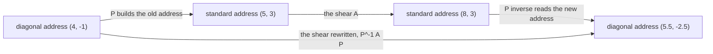

# Change of basis: the same point with a new address book, and the same map as a new matrix P^-1 A P

Algebra → Eigenvalues and Symmetric Matrices → Coordinates → Change of basis

---

## General Overview

A game map hides treasure five steps east and three steps north of the corner, so the map's address for it is (5, 3). The designer draws a second grid on the map, set diagonally: one axis runs northeast, a step east and a step north at a time, the other northwest. In the old numbers those directions are (1, 1) and (−1, 1).

On the new grid its address is (4, −1): four steps northeast, then one back along northwest. Four copies of (1, 1) make (4, 4), and taking away one copy of (−1, 1) lands on (5, 3). The treasure never moved; only the list describing it did.

A set of directions that gives every point exactly one such list is a **basis**, and the list is that point's **coordinates** in it ([basis-and-dimension](../03-Vectors/05-basis-and-dimension.md)); the old grid's basis is the axis arrows (1, 0) and (0, 1). This card translates between two such address books, then rewrites a movement rule for the new one.

The rule here is a **shear**: every point slides east by its own height, so the treasure goes from (5, 3) to (8, 3). Its matrix is `[[1, 1], [0, 1]]`, row by row, 2 × 2 ([linear-maps-as-matrices](../04-Matrices/04-linear-maps-as-matrices.md)). On the diagonal grid the same slide reads `[[1.5, 0.5], [−0.5, 0.5]]` — different entries, one move, and every area still multiplied by 1.

**Put the new directions down the columns of a matrix P: P turns a new address into the old one, its inverse turns an old address into the new one, and a map that was A becomes P^-1 A P.**

**What kind of fact this is:** a method, with both of its rules derived on this card in Why it works.

### The picture: one treasure, one shear, two ways round



The three-step route translates, shears, then translates back; the single arrow does it in one move. Both finish at (5.5, −2.5).

---

## The formula

Write $v$ for a point's old address, as a column, and $c$ for its new one. Put the two new directions down the columns of a 2 × 2 matrix called $P$: here $P$ = `[[1, −1], [1, 1]]`, its columns reading downwards as (1, 1) and (−1, 1).

$$v = P c \qquad \text{and} \qquad c = P^{-1} v$$

**Read it aloud:** an old address mixes the new directions in the amounts the new address names; undoing that mixing reads the amounts back.

Let $A$ be a movement rule's matrix in the old book, and $A_B$ its matrix in the new one:

$$A_B = P^{-1} A P$$

**Read it aloud:** translate the address to the old book, move it there, translate the answer back — and the rightmost matrix acts first.

| Symbol | Plain meaning | In our example | Change it and… |
| --- | --- | --- | --- |
| $b_1$, $b_2$ | the new directions, in old coordinates | (1, 1) and (−1, 1) | every address changes |
| $P$ | those directions as columns | `[[1, −1], [1, 1]]` | — |
| $P^{-1}$ | what undoes $P$ ([inverse-matrix](../05-Solving%20Systems/03-inverse-matrix.md)) | `[[0.5, 0.5], [−0.5, 0.5]]` | — |
| $v$ | a point's old address | (5, 3) | a different point |
| $c$ | that point's new address | (4, −1) | a different point |
| $A$ | the map's matrix, old book | the shear `[[1, 1], [0, 1]]` | the move changes |
| $A_B$ | the same map, new book | `[[1.5, 0.5], [−0.5, 0.5]]` | only the description changes |
| $\det P$ | the area factor: how much the address change stretches area | 2 | — |

### When it holds

- **The new directions must be independent.** Two on one line make $\det P$ zero: no inverse, and addresses going missing or doubling up.
- **Both books share one origin.** A grid cornered elsewhere needs a shift as well; $P$ alone gives wrong addresses.
- **The rule must be linear**: lines straight and evenly spaced, origin fixed; otherwise there is no matrix $A$ to rewrite.

---

## Why it works

### Step 0: coordinates are the amounts that rebuild the point

The list (4, −1) is not the treasure. It is instructions: four of the first new direction, then one of the second taken away. A matrix times a column does exactly that, mixing its columns in the amounts the column names. So with the new directions as columns of $P$, $P c$ carries the instructions out: $v = P c$ is the definition of coordinates read out loud.

### Step 1: the return trip exists, and there is only one of it

Independence makes $P$ invertible, and that makes the return trip one answer rather than none or many. Here $\det P$ = 1 × 1 − (−1) × 1 = 2, not zero, and the 2 × 2 inverse formula gives $P^{-1}$ = `[[0.5, 0.5], [−0.5, 0.5]]`. On the treasure: 0.5 × 5 + 0.5 × 3 = 4, then −0.5 × 5 + 0.5 × 3 = −1, the address (4, −1) without guessing.

One check settles which way $P$ points. Feed it (1, 0) — the first new direction's own address in the new book — and its first column comes out, (1, 1), that direction itself in old coordinates. So $P$ runs new-to-old, never the other way.

### Step 2: translate in, move, translate out

$A$ understands old addresses only: hand it (4, −1) and it shears some other point. So translate first. $P c$ is the point in old coordinates, $A P c$ is where the shear sends it, $P^{-1} A P c$ is that answer read back in the new book. This holds for every address $c$, so $P^{-1} A P$ is the map's matrix in the new basis.

The columns say it concretely: the shear sends (1, 1) to (2, 1) and (−1, 1) to (0, 1), so $A P$ = `[[2, 0], [1, 1]]`. Read those answers back in the new book: (2, 1) is 1.5 of the first direction minus 0.5 of the second, (0, 1) is 0.5 of each. Stacked as columns, $A_B$ = `[[1.5, 0.5], [−0.5, 0.5]]`. Each column still says where one basis direction goes — now the diagonal pair, not the axis arrows.

Two matrices related this way — $A$ and $P^{-1} A P$ for an invertible $P$ — are **similar**: one map, two address books.

### Step 3: what an address book cannot change

Similar matrices agree on everything belonging to the map, not the coordinates. The **trace**, the sum of the entries down the main diagonal, is 1 + 1 = 2 for the shear and 1.5 + 0.5 = 2 for its diagonal-grid twin. The area factor is 1 for both.

Why the area factor survives has the shape of the whole card: going in multiplies area by $\det P$, the move by $\det A$, coming out divides by $\det P$ again. The translation factors cancel.

<details>
<summary>Detailed proof: area factor and trace survive similarity</summary>

The determinant of a product is the product of the determinants ([determinants](../05-Solving%20Systems/04-determinants.md)), and the determinant of an inverse is one over the determinant. So the determinant of $P^{-1} A P$ is (1 / det P) × det A × det P: the outer two cancel. Here, (1 / 2) × 1 × 2 = 1.

The trace needs one fact: for two 2 × 2 matrices the trace of the product ignores the order. Call them M, entries m1, m2, m3, m4, and N, entries n1, n2, n3, n4, each read row by row. The trace of M N — top-left plus bottom-right — is m1 n1 + m2 n3 + m3 n2 + m4 n4, and the trace of N M is n1 m1 + n2 m3 + n3 m2 + n4 m4: the same four products, reordered. So with M = $P^{-1}$ and N = $A P$, the trace of $P^{-1} A P$ equals the trace of $A P P^{-1}$, which is the trace of $A$.

</details>

For a single point there is a shortcut: instead of building $P^{-1}$, solve $P c = v$ for $c$ by elimination ([gaussian-elimination](../05-Solving%20Systems/02-gaussian-elimination.md)) — the second method the code takes.

---

## Worked numbers, by hand

The treasure at (5, 3), the directions (1, 1) and (−1, 1), the shear `[[1, 1], [0, 1]]`.

| Step | Arithmetic | Value |
| --- | --- | --- |
| the new address, $P^{-1} v$ | 0.5 × 5 + 0.5 × 3; −0.5 × 5 + 0.5 × 3 | **(4, −1)** |
| shear the new directions | (1, 1) → (2, 1); (−1, 1) → (0, 1) | $A P$ = `[[2, 0], [1, 1]]` |
| read those columns back | $P^{-1}$ applied to each | $A_B$ = **`[[1.5, 0.5], [−0.5, 0.5]]`** |
| road one: shear, then convert | (5, 3) → (8, 3), then $P^{-1}$ | **(5.5, −2.5)** |
| road two: convert, then shear | 1.5 × 4 + 0.5 × (−1); −0.5 × 4 + 0.5 × (−1) | **(5.5, −2.5)** |
| a second treasure at (2, 6) | new address (4, 2), then shear | **(7, −1)** |

Both roads name the same sheared treasure.

### What breaks if you drop a piece

| Mistake | Comes out at | What went wrong |
| --- | --- | --- |
| Using $P v$ for the new address | (2, 8) | $P$ runs new-to-old, so this names another point |
| Writing the new directions as rows | (1, 4) | Rows describe a different pair of directions |
| Sandwiching backwards, $P A P^{-1}$ | (1.5, −3.5) | The address goes out before it ever came in |

The code prints all three.

---

## Code, from first principles, and it actually runs

Nothing is imported, and two independent methods run the whole way. One method uses the 2 × 2 inverse formula: build $P^{-1}$, convert with it, form $P^{-1} A P$ by multiplication. The other builds no inverse: it solves $P c = v$ by elimination and assembles the new matrix a column at a time from the sheared directions. Both methods move both treasures, and the wrong answers are computed.

### Python

```python
# Change of basis -- the check behind the card.  Nothing is imported.  A game map
# is drawn on a diagonal grid whose axes are b1 = (1, 1) and b2 = (-1, 1), and P
# carries those two axes as its columns.  The treasure at (5, 3) is given its
# diagonal address, and the shear [[1, 1], [0, 1]] is rewritten on that grid.  Two
# methods all the way: the 2 by 2 inverse formula, and elimination, which builds no
# inverse at all.
def det(A): return A[0][0] * A[1][1] - A[0][1] * A[1][0]
def tr(A): return A[0][0] + A[1][1]
def mul(A, B):                                   # 2 by 2 times 2 by 2
    return [[A[i][0] * B[0][j] + A[i][1] * B[1][j] for j in (0, 1)] for i in (0, 1)]
def act(A, v):                                   # 2 by 2 times a column
    return [A[0][0] * v[0] + A[0][1] * v[1], A[1][0] * v[0] + A[1][1] * v[1]]
def inv(A):                                      # method one: the 2 by 2 inverse
    d = det(A)
    return [[A[1][1] / d, -A[0][1] / d], [-A[1][0] / d, A[0][0] / d]]
def solve(A, v):                                 # method two: elimination, no inverse
    f = A[1][0] / A[0][0]                        # clear the lower-left entry
    y = (v[1] - f * v[0]) / (A[1][1] - f * A[0][1])
    return [(v[0] - A[0][1] * y) / A[0][0], y]
def mat(A): return f"[[{A[0][0]:g}, {A[0][1]:g}], [{A[1][0]:g}, {A[1][1]:g}]]"
def col(v): return f"({v[0]:g}, {v[1]:g})"
def row(label, value): print(f"{label:<44}{value}")

b1, b2 = [1.0, 1.0], [-1.0, 1.0]                 # the diagonal grid's two axes
P = [[b1[0], b2[0]], [b1[1], b2[1]]]             # the new axes down the columns
Pi = inv(P)
A = [[1.0, 1.0], [0.0, 1.0]]                     # the shear, on the standard grid
Ad = mul(Pi, mul(A, P))                          # the shear, on the diagonal grid
shr = [solve(P, act(A, [P[0][j], P[1][j]])) for j in (0, 1)]   # sheared axes, new coords
Ad2 = [[shr[0][0], shr[1][0]], [shr[0][1], shr[1][1]]]
v, w = [5.0, 3.0], [2.0, 6.0]                    # the treasure, and a second one
c, cw = act(Pi, v), act(Pi, w)                   # their diagonal addresses
rebuilt = [c[0] * b1[i] + c[1] * b2[i] for i in (0, 1)]
Prow = [[b1[0], b1[1]], [b2[0], b2[1]]]          # the new axes written as rows
PAPi = mul(P, mul(A, Pi))                        # the sandwich, built backwards
wrongs = [act(P, v), act(inv(Prow), v), act(PAPi, c)]

row("P, the new axes down its columns", f"{mat(P)}   det {det(P):g}")
row("P inverse, by the 2 by 2 formula", mat(Pi))
row("P times (1, 0), must be the first new axis", col(act(P, [1.0, 0.0])))
row("treasure: standard, then diagonal address", f"{col(v)}  ->  {col(c)}")
row("the same diagonal address, by elimination", col(solve(P, v)))
row("rebuilt as 4 b1 - 1 b2", col(rebuilt))
row("A, the shear on the standard grid", f"{mat(A)}   trace {tr(A):g}   area {det(A):g}")
row("A P, the shear sent through the new axes", mat(mul(A, P)))
row("P^-1 A P, the shear on the diagonal grid", f"{mat(Ad)}   trace {tr(Ad):g}   area {det(Ad):g}")
row("the same matrix, by elimination", mat(Ad2))
row("road 1: shear, then convert", f"A v = {col(act(A, v))}  ->  {col(act(Pi, act(A, v)))}")
row("road 2: convert, then shear", col(act(Ad, c)))
row("second treasure: standard, then diagonal", f"{col(w)}  ->  {col(cw)}")
row("second treasure, road 1", f"A w = {col(act(A, w))}  ->  {col(act(Pi, act(A, w)))}")
row("second treasure, road 2", col(act(Ad, cw)))
row("wrong: P v instead of P^-1 v", col(wrongs[0]))
row("wrong: the new axes written as rows", col(wrongs[1]))
row("wrong: P A P^-1 sends (4, -1) to", col(wrongs[2]))
assert c == [4.0, -1.0] and solve(P, v) == c and rebuilt == v
assert Ad == [[1.5, 0.5], [-0.5, 0.5]] and Ad2 == Ad and det(Ad) == det(A) and tr(Ad) == tr(A)
assert act(Pi, act(A, v)) == [5.5, -2.5] == act(Ad, c) and act(Pi, act(A, w)) == [7.0, -1.0] == act(Ad, cw)
assert wrongs == [[2.0, 8.0], [1.0, 4.0], [1.5, -3.5]]
print("ALL CHECKS PASS")
```

**Ran 2026-09-14 on macOS, Python 3.14.6, standard library only. All checks passed. Output, pasted from the run:**

```
P, the new axes down its columns            [[1, -1], [1, 1]]   det 2
P inverse, by the 2 by 2 formula            [[0.5, 0.5], [-0.5, 0.5]]
P times (1, 0), must be the first new axis  (1, 1)
treasure: standard, then diagonal address   (5, 3)  ->  (4, -1)
the same diagonal address, by elimination   (4, -1)
rebuilt as 4 b1 - 1 b2                      (5, 3)
A, the shear on the standard grid           [[1, 1], [0, 1]]   trace 2   area 1
A P, the shear sent through the new axes    [[2, 0], [1, 1]]
P^-1 A P, the shear on the diagonal grid    [[1.5, 0.5], [-0.5, 0.5]]   trace 2   area 1
the same matrix, by elimination             [[1.5, 0.5], [-0.5, 0.5]]
road 1: shear, then convert                 A v = (8, 3)  ->  (5.5, -2.5)
road 2: convert, then shear                 (5.5, -2.5)
second treasure: standard, then diagonal    (2, 6)  ->  (4, 2)
second treasure, road 1                     A w = (8, 6)  ->  (7, -1)
second treasure, road 2                     (7, -1)
wrong: P v instead of P^-1 v                (2, 8)
wrong: the new axes written as rows         (1, 4)
wrong: P A P^-1 sends (4, -1) to            (1.5, -3.5)
ALL CHECKS PASS
```

### Rust

Same numbers, same labels, built with `rustc --edition 2021 -O`.

```rust
// Change of basis -- the same check as the Python, in Rust.  No crates.  A game
// map is drawn on a diagonal grid whose axes are b1 = (1, 1) and b2 = (-1, 1), and
// P carries those two axes as its columns.  The treasure at (5, 3) is given its
// diagonal address, and the shear [[1, 1], [0, 1]] is rewritten on that grid.  Two
// methods all the way: the 2 by 2 inverse formula, and elimination, which builds no
// inverse at all.
type M = [[f64; 2]; 2];
type V = [f64; 2];
fn det(a: M) -> f64 { a[0][0] * a[1][1] - a[0][1] * a[1][0] }
fn tr(a: M) -> f64 { a[0][0] + a[1][1] }
fn mul(a: M, b: M) -> M {                        // 2 by 2 times 2 by 2
    let mut o: M = [[0.0; 2]; 2];
    for i in 0..2 { for j in 0..2 { o[i][j] = a[i][0] * b[0][j] + a[i][1] * b[1][j]; } }
    o
}
fn act(a: M, v: V) -> V {                        // 2 by 2 times a column
    [a[0][0] * v[0] + a[0][1] * v[1], a[1][0] * v[0] + a[1][1] * v[1]]
}
fn inv(a: M) -> M {                              // method one: the 2 by 2 inverse
    let d = det(a);
    [[a[1][1] / d, -a[0][1] / d], [-a[1][0] / d, a[0][0] / d]]
}
fn solve(a: M, v: V) -> V {                      // method two: elimination, no inverse
    let f = a[1][0] / a[0][0];                   // clear the lower-left entry
    let y = (v[1] - f * v[0]) / (a[1][1] - f * a[0][1]);
    [(v[0] - a[0][1] * y) / a[0][0], y]
}
fn mat(a: M) -> String { format!("[[{}, {}], [{}, {}]]", a[0][0], a[0][1], a[1][0], a[1][1]) }
fn col(v: V) -> String { format!("({}, {})", v[0], v[1]) }
fn row(label: &str, value: String) { println!("{:<44}{}", label, value); }
fn main() {
    let (b1, b2): (V, V) = ([1.0, 1.0], [-1.0, 1.0]);   // the diagonal grid's axes
    let p: M = [[b1[0], b2[0]], [b1[1], b2[1]]];        // new axes down the columns
    let pi = inv(p);
    let a: M = [[1.0, 1.0], [0.0, 1.0]];                // the shear, standard grid
    let ad = mul(pi, mul(a, p));                        // the shear, diagonal grid
    let s0 = solve(p, act(a, [p[0][0], p[1][0]]));      // sheared axes, new coords
    let s1 = solve(p, act(a, [p[0][1], p[1][1]]));
    let ad2: M = [[s0[0], s1[0]], [s0[1], s1[1]]];
    let (v, w): (V, V) = ([5.0, 3.0], [2.0, 6.0]);      // the treasure, and a second
    let (c, cw) = (act(pi, v), act(pi, w));             // their diagonal addresses
    let rebuilt: V = [c[0] * b1[0] + c[1] * b2[0], c[0] * b1[1] + c[1] * b2[1]];
    let prow: M = [[b1[0], b1[1]], [b2[0], b2[1]]];     // the new axes as rows
    let papi = mul(p, mul(a, pi));                      // the sandwich, backwards
    let wrongs = [act(p, v), act(inv(prow), v), act(papi, c)];

    row("P, the new axes down its columns", format!("{}   det {}", mat(p), det(p)));
    row("P inverse, by the 2 by 2 formula", mat(pi));
    row("P times (1, 0), must be the first new axis", col(act(p, [1.0, 0.0])));
    row("treasure: standard, then diagonal address", format!("{}  ->  {}", col(v), col(c)));
    row("the same diagonal address, by elimination", col(solve(p, v)));
    row("rebuilt as 4 b1 - 1 b2", col(rebuilt));
    row("A, the shear on the standard grid", format!("{}   trace {}   area {}", mat(a), tr(a), det(a)));
    row("A P, the shear sent through the new axes", mat(mul(a, p)));
    row("P^-1 A P, the shear on the diagonal grid", format!("{}   trace {}   area {}", mat(ad), tr(ad), det(ad)));
    row("the same matrix, by elimination", mat(ad2));
    row("road 1: shear, then convert", format!("A v = {}  ->  {}", col(act(a, v)), col(act(pi, act(a, v)))));
    row("road 2: convert, then shear", col(act(ad, c)));
    row("second treasure: standard, then diagonal", format!("{}  ->  {}", col(w), col(cw)));
    row("second treasure, road 1", format!("A w = {}  ->  {}", col(act(a, w)), col(act(pi, act(a, w)))));
    row("second treasure, road 2", col(act(ad, cw)));
    row("wrong: P v instead of P^-1 v", col(wrongs[0]));
    row("wrong: the new axes written as rows", col(wrongs[1]));
    row("wrong: P A P^-1 sends (4, -1) to", col(wrongs[2]));
    assert!(c == [4.0, -1.0] && solve(p, v) == c && rebuilt == v);
    assert!(ad == [[1.5, 0.5], [-0.5, 0.5]] && ad2 == ad && det(ad) == det(a) && tr(ad) == tr(a));
    assert!(act(pi, act(a, v)) == [5.5, -2.5] && act(ad, c) == [5.5, -2.5]
        && act(pi, act(a, w)) == [7.0, -1.0] && act(ad, cw) == [7.0, -1.0]);
    assert!(wrongs == [[2.0, 8.0], [1.0, 4.0], [1.5, -3.5]]);
    println!("ALL CHECKS PASS");
}
```

**Ran 2026-09-14 on macOS, rustc 1.98.1, no crates. All checks passed. Output, pasted from the run:**

```
P, the new axes down its columns            [[1, -1], [1, 1]]   det 2
P inverse, by the 2 by 2 formula            [[0.5, 0.5], [-0.5, 0.5]]
P times (1, 0), must be the first new axis  (1, 1)
treasure: standard, then diagonal address   (5, 3)  ->  (4, -1)
the same diagonal address, by elimination   (4, -1)
rebuilt as 4 b1 - 1 b2                      (5, 3)
A, the shear on the standard grid           [[1, 1], [0, 1]]   trace 2   area 1
A P, the shear sent through the new axes    [[2, 0], [1, 1]]
P^-1 A P, the shear on the diagonal grid    [[1.5, 0.5], [-0.5, 0.5]]   trace 2   area 1
the same matrix, by elimination             [[1.5, 0.5], [-0.5, 0.5]]
road 1: shear, then convert                 A v = (8, 3)  ->  (5.5, -2.5)
road 2: convert, then shear                 (5.5, -2.5)
second treasure: standard, then diagonal    (2, 6)  ->  (4, 2)
second treasure, road 1                     A w = (8, 6)  ->  (7, -1)
second treasure, road 2                     (7, -1)
wrong: P v instead of P^-1 v                (2, 8)
wrong: the new axes written as rows         (1, 4)
wrong: P A P^-1 sends (4, -1) to            (1.5, -3.5)
ALL CHECKS PASS
```

The two outputs match line for line.

> [!TIP]
> **Try changing**
> Guess first, then run it. The asserts are pinned to the treasure's numbers, so expect one to stop the program.
> - **Use the old axes as the new basis.** Set `b1` to `[1.0, 0.0]` and `b2` to `[0.0, 1.0]`. Both translations become the do-nothing matrix, the address stays (5, 3), and the first assert fires.
> - **Make the treasure the first new direction.** Set `v` to `[1.0, 1.0]`. Its new address has to be (1, 0): one copy of itself, none of the other.
> - **Put both directions on one line.** Set `b2` to `[2.0, 2.0]`. There is no inverse to build: Python stops on a division by zero and Rust prints infinities and NaNs. Independence has failed.

---

## The usual mistake

> [!warning]
> **Getting the direction of $P$ backwards.** Its columns are the new directions in old coordinates, so it turns a new address into an old one. Used where $P^{-1}$ belongs it sends (5, 3) to (2, 8): another point, not a relabelling. One line settles it — $P$ applied to (1, 0) must return (1, 1).
>
> - **Reading the sandwich left to right.** The rightmost matrix acts first. Reversed as $P A P^{-1}$, the address (4, −1) goes to (1.5, −3.5), not (5.5, −2.5).
> - **Writing the new directions as rows.** Rows describe a different pair, so the address comes out (1, 4).
> - **Taking any two arrows as a basis.** Two on one line have area factor zero: no inverse, no unique address.

---

## Where you meet it in real life

- **Graphics and games.** A model carries its own axes and the world carries others; every frame converts between them.
- **Repeated moves.** Pick a basis of directions the map only stretches and $A_B$ comes out diagonal: [eigenvalues-and-eigenvectors](02-eigenvalues-and-eigenvectors.md) finds them.
- **Right-angled address books.** Perpendicular new directions of unit length make $P^{-1}$ simply $P$ with rows and columns exchanged: [spectral-theorem](04-spectral-theorem.md).

> **Say it back**
> A basis gives every point exactly one address. Put the new directions down the columns of $P$: $P$ turns a new address into an old one and $P^{-1}$ goes back, so the treasure at (5, 3) is (4, −1) on the diagonal grid. To rewrite a movement rule: translate in, move, translate out, $P^{-1} A P$. The shear `[[1, 1], [0, 1]]` becomes `[[1.5, 0.5], [−0.5, 0.5]]`, and both send the treasure to the same place, because the move never changed.

---

## What this builds on

- [basis-and-dimension](../03-Vectors/05-basis-and-dimension.md): why independent directions give each point one address.
- [inverse-matrix](../05-Solving%20Systems/03-inverse-matrix.md): the undo, and the 2 × 2 formula behind `[[0.5, 0.5], [−0.5, 0.5]]`.
- [linear-maps-as-matrices](../04-Matrices/04-linear-maps-as-matrices.md): why a movement rule is four numbers, one column per basis direction.

## Where this goes next

- [diagonalisation-and-matrix-powers](03-diagonalisation-and-matrix-powers.md): the payoff — the book that makes $A_B$ diagonal turns many moves into small multiplies.
- discrete-fourier-transform-and-the-fft: the same translation on a whole signal, samples in time becoming pure tones.
- representations-in-outline: conjugation again, for matrices forming a group.

Any invertible $P$ gives a new address book, and nothing here says which book is worth having; that is what a later card asks.

---

## Sources

Verified 14 Sep 2026: every link below resolves to the publisher's page.

- Hefferon, Jim. *Linear Algebra*, 4th ed. [hefferon.net](https://hefferon.net/linearalgebra/). Works coordinates as a solve and derives the similarity formula.
- Axler, Sheldon. *Linear Algebra Done Right*, 4th ed. Springer, 2024. [doi:10.1007/978-3-031-41026-0](https://doi.org/10.1007/978-3-031-41026-0). Builds a map's matrix from a chosen basis and proves the trace ignores the choice.
- O'Connor, J. J., and E. F. Robertson. "Arthur Cayley." MacTutor History of Mathematics Archive, University of St Andrews. [Biography](https://mathshistory.st-andrews.ac.uk/Biographies/Cayley/). Cayley's 1858 memoir, where matrices first got an algebra of their own.
