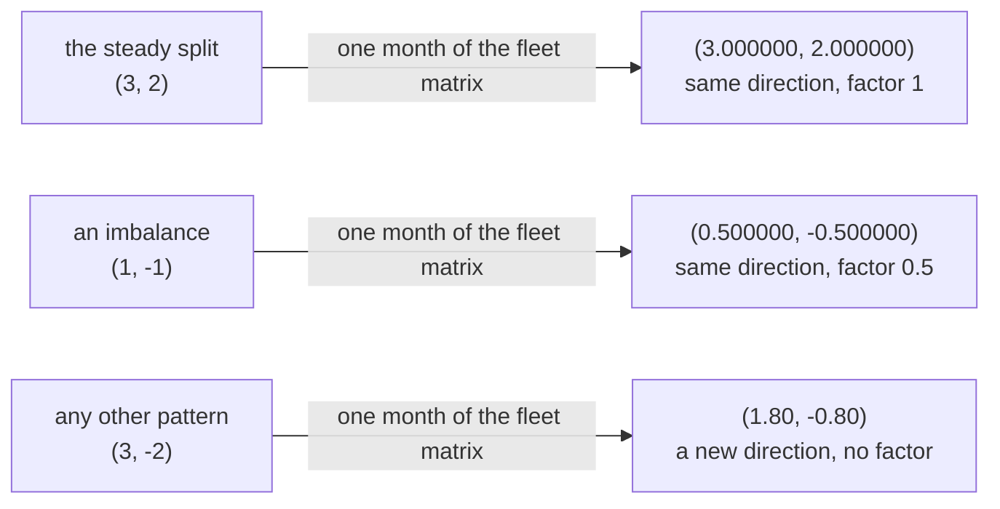

# Eigenvalues and eigenvectors: the directions a matrix only stretches, and the stretch factors, found from a quadratic

Algebra → Eigenvalues and Symmetric Matrices → Stretch directions → Eigenvalues and eigenvectors

---

## General Overview

A rental company runs 1000 cars out of two cities. Each month 80% of city A's cars come back in A and 20% are dropped in B; of B's cars, 70% stay and 30% arrive in A.

That month is a matrix, row by row: `[[0.8, 0.3], [0.2, 0.7]]`. Its top row builds next month's count for A, its bottom row B's ([matrix-equation-ax-b](../05-Solving%20Systems/01-matrix-equation-ax-b.md)).

Park 600 in A and 400 in B. A then holds 0.8 × 600 + 0.3 × 400 — 600 again — and B holds 400. Cars moved; the split did not.

Park all 1000 in A instead. A's count runs 1000, 800, 700, 650, 625, 612.50, 606.25, the distance left halving monthly: 400, 200, 100, 50, 25, 12.50, 6.25.

Two patterns are easy here: it leaves the 600-to-400 split alone and halves an imbalance. The rest it scrambles, since a matrix normally hands a pattern back pointing somewhere new. One that returns rescaled is an **eigenvector** — German *eigen*, "its own" — and the number it is rescaled by is its **eigenvalue**.

**A square matrix usually has a few patterns it only rescales, and finding them replaces its mixing with one multiplication per pattern.**

**What kind of fact this is:** a definition, carrying one theorem proved below — a 2 by 2 matrix's eigenvalues are exactly the roots of the quadratic $\det(A - \lambda I) = 0$.

### The picture: two patterns kept



The top two leave on the line they arrived on. The third does not.

---

## The formula

A matrix hands a column of numbers back as another column. The definition picks those returning along the same line:

$$A v = \lambda v, \qquad v \ne 0$$

**Read it aloud:** the matrix does to this pattern what multiplying by one plain number does.

$A$ is the matrix, $v$ the pattern as a column of two numbers, and the plain number is the Greek letter lambda, $\lambda$; $v \ne 0$ means the pattern is never all zeros.

The eigenvalues are then the numbers solving

$$\det(A - \lambda I) = 0$$

$I$ is the identity matrix `[[1, 0], [0, 1]]`, which changes no column. $\det$ is the determinant: what a matrix does to area, zero meaning the picture was flattened ([determinants](../05-Solving%20Systems/04-determinants.md)). Take lambda off both diagonal entries; ask which values flatten the plane.

Write the matrix as `[[a, b], [c, d]]`. That determinant is a quadratic in the eigenvalue:

$$\lambda^2 - (a + d)\lambda + (ad - bc) = 0$$

Lambda squared, minus the **trace** (the diagonal entries added, a + d) times lambda, plus the determinant: the **characteristic polynomial**. The fleet's trace is 1.5, determinant 0.5.

| Symbol | Plain meaning | In our example | Push it up and the answer… |
| --- | --- | --- | --- |
| $A$ | the matrix, square | `[[0.8, 0.3], [0.2, 0.7]]` | new rules, new patterns |
| $a$, $b$, $c$, $d$ | its entries, row by row | 0.8, 0.3, 0.2, 0.7 | a bigger trace, bigger factors |
| $v$ | a pattern it only rescales | (3, 2) or (1, −1) | a multiple is the same pattern |
| $\lambda$ | that pattern's stretch factor | 1 or 0.5 | size above 1 grows, below 1 fades; negative flips |
| $I$ | the identity matrix | `[[1, 0], [0, 1]]` | — |
| $\det$ | the determinant, ad − bc | 0.5 | — |

Its **discriminant**, the part under the root in the quadratic formula ([quadratic-formula](../02-Polynomials/03-quadratic-formula.md)), is (a + d)^2 − 4(ad − bc): here 1.5 × 1.5 − 4 × 0.5 = 0.25, positive, so two real factors.

### When it holds

- **Square, and the pattern never all zeros.** A 2 by 3 matrix returns fewer numbers than it takes, so output and input cannot be compared; and if zeros counted, every number would qualify.
- **A discriminant of zero or more.** Negative, and the matrix turns every direction, as a rotation does: complex factors ([complex-vectors-and-matrices](../../07-Complex%20analysis/01-Complex%20Numbers%20and%20the%20Plane/07-complex-vectors-and-matrices.md)).
- **Two roots, maybe one direction.** A repeated root can leave a single line: [diagonalisation-and-matrix-powers](03-diagonalisation-and-matrix-powers.md).

---

## Why it works

### Step 0: subtract the stretch

Move everything to one side. Since $\lambda v$ is $\lambda I v$, both terms multiply $v$ by a matrix and join:

$$(A - \lambda I)\,v = 0$$

### Step 1: only a flattening matrix kills a pattern

Sending a nonzero column to the origin collapses two directions into one and takes area to zero ([determinants](../05-Solving%20Systems/04-determinants.md)), so lambda is an eigenvalue exactly when the shift's determinant is zero.

<details>
<summary>Detailed proof: the determinant test, for a 2 by 2</summary>

Which columns (x, y) does `[[p, q], [r, s]]` kill? The rows say px + qy = 0 and rx + sy = 0. Multiply the first by s, the second by q, and subtract: (ps − qr)x = 0. Multiply by r and p instead: (ps − qr)y = 0. Where ps − qr is not zero, only the zero column dies. Where it is zero, (q, −p) or (s, −r) is a nonzero column both rows kill: for (q, −p), pq − qp = 0 and rq − sp = −(ps − qr) = 0.

With p = a − lambda, q = b, r = c, s = d − lambda, that is the shifted determinant, and (q, −p) is (b, lambda − a) — the code's recipe.

</details>

### Step 2: that determinant is a quadratic

The shift is `[[a - lambda, b], [c, d - lambda]]`, with determinant (a − lambda)(d − lambda) − bc:

$$\lambda^2 - (a + d)\lambda + (ad - bc) = 0$$

For the fleet: trace 1.5, determinant 0.5, discriminant 0.25, root 0.5. The quadratic formula gives (1.5 ± 0.5) / 2: **1 and 0.5**.

### Step 3: each pattern off one row

Put the factor 1 in and the shift is `[[-0.20, 0.30], [0.20, -0.30]]`. Its top row says −0.2x + 0.3y = 0, so 2x = 3y and (3, 2) is the smallest whole-number fit. The bottom row only repeats it: a zero determinant makes the rows multiples.

Put 0.5 in and the shift is `[[0.30, 0.30], [0.20, 0.20]]`: 0.3x + 0.3y = 0, so y = −x and (1, −1) fits, one car too many in A against one too few in B.

Direction is pinned, length never: (3, 2) and (600, 400) are one eigenvector, and the fleet settles at 600 and 400.

### Step 4: trace and determinant, a free check

Multiply out a quadratic with two given roots: its middle term carries minus their sum, its last their product. Beside the characteristic quadratic that reads **eigenvalues add to the trace and multiply to the determinant**: 1 + 0.5 = 1.5, 1 × 0.5 = 0.5.

### Step 5: the same factors with no algebra

Let x be the cars in A, so 1000 − x are in B. Next month A holds 0.8x + 0.3(1000 − x), or 0.5x + 300. Take 600 off both sides: the new gap is 0.5(x − 600), half the old, from any split — and a gap of zero stays zero. Both factors, off the car counts.

<details>
<summary>A 2 by 2 matrix obeys its own quadratic</summary>

Put the matrix into its own characteristic quadratic — itself times itself, the identity carrying the constant — and out comes the zero matrix: A A − 1.5 A + 0.5 I, largest entry 0.000000 in both checks. That is Cayley–Hamilton at size 2: A times A is 1.5 A − 0.5 I, so higher powers are mixes of those two.

</details>

A big matrix is handled instead by multiplying a column by it repeatedly and watching where that settles: power-iteration-and-the-damping-factor.

---

## Worked numbers, by hand

| Step | Arithmetic | Value |
| --- | --- | --- |
| the trace | 0.8 + 0.7 | 1.5 |
| the determinant | 0.8 × 0.7 − 0.3 × 0.2 | 0.5 |
| the two factors | (1.5 ± 0.5) / 2 | **1 and 0.5** |
| pattern for 1 | −0.2x + 0.3y = 0 | **(3, 2)** |
| pattern for 0.5 | 0.3x + 0.3y = 0 | **(1, −1)** |
| the steady fleet | 1000 split 3 to 2 | **600 and 400** |

The fleet ends at 600 cars in A, 400 in B; from all 1000 in A, the 400 out of place fall to 6.25 by month six.

### What breaks if you drop a piece

| Mistake | Comes out at | What went wrong |
| --- | --- | --- |
| Lambda off the top-left entry only | 0.714286, one root | The identity sits on **both** diagonal entries |
| ad + bc as the determinant | discriminant −0.230000 | One sign hides two real directions |
| Diagonal entries read as factors | product 0.560000 | True only for a staircase matrix |
| (3, −2) guessed as the split | (1.80, −0.80) | Not a multiple of it: no eigenvector |

Both checks print all four.

---

## Code, from first principles, and it actually runs

Nothing is imported. Road one is this card's algebra: the characteristic quadratic, solved by the quadratic formula, each pattern off the shifted top row. Road two mentions no determinant: park 1000 cars in A, run the month sixty-one times, read one factor off the settled split and the other off the halving gap.

### Python

```python
# Eigenvalues and eigenvectors -- the check behind the card.  Nothing is imported.  A fleet of
# 1,000 rental cars moves between two cities: each month 80% of city A's cars stay and 20% drive
# to B, 70% of B's stay and 30% drive to A, so the matrix is [[0.8, 0.3], [0.2, 0.7]].  Road 1:
# the characteristic quadratic, solved by the quadratic formula, each pattern read off a shifted
# row.  Road 2: run the fleet and read both stretch factors off the car counts, with no algebra.
A = [[0.8, 0.3], [0.2, 0.7]]
(a, b), (c, d) = A
trace, det = a + d, a * d - b * c
def times(m, v):                                    # a matrix times a column vector
    return (m[0][0] * v[0] + m[0][1] * v[1], m[1][0] * v[0] + m[1][1] * v[1])
def show(m):                                        # a 2 by 2 matrix, row by row
    return f"[[{m[0][0]:.2f}, {m[0][1]:.2f}], [{m[1][0]:.2f}, {m[1][1]:.2f}]]"
def whole(r, n=1):                                  # smallest whole pair with y / x = r
    while abs(r * n - round(r * n)) > 1e-9: n += 1
    return (n, int(round(r * n)))
disc = trace * trace - 4.0 * det
if disc < 0.0: raise SystemExit("no real eigenvalue: this matrix turns every direction")
half = disc ** 0.5 / 2.0
lam1, lam2 = trace / 2.0 + half, trace / 2.0 - half
vs = [whole((lam - a) / b) for lam in (lam1, lam2)]  # the shifted top row kills these
steady = 1000.0 * vs[0][0] / (vs[0][0] + vs[0][1])
print("fleet rules: each month 80% of city A's cars stay and 20% drive to B, "
      "70% of B's stay and 30% drive to A")
print(f"matrix A = {show(A)}   trace a + d = {trace:.6f}   determinant ad - bc = {det:.6f}")
print(f"characteristic quadratic  lambda^2 - {trace:.6f} lambda + {det:.6f} = 0   "
      f"discriminant {disc:.6f}")
print(f"road 1, the quadratic formula: eigenvalues {lam1:.6f} and {lam2:.6f}   "
      f"sum {lam1 + lam2:.6f} = trace   product {lam1 * lam2:.6f} = determinant")
for lam, v in zip((lam1, lam2), vs):
    shift = [[a - lam, b], [c, d - lam]]
    killed, Av = times(shift, v), times(A, v)
    print(f"lambda = {lam:.6f}:  A - lambda I = {show(shift)}   eigenvector "
          f"({v[0]}, {v[1]})   A times it = ({Av[0]:.6f}, {Av[1]:.6f})")
    assert max(abs(killed[0]), abs(killed[1])) < 1e-12 and \
        abs(Av[0] - lam * v[0]) < 1e-12 and abs(Av[1] - lam * v[1]) < 1e-12
print("road 2, no algebra: 1000 cars start in city A, one month at a time")
split, gaps = (1000.0, 0.0), []
for month in range(61):
    if month <= 12: gaps.append(split[0] - steady)
    if month <= 6:
        print(f"   month {month}   city A {split[0]:>7.2f}   city B {split[1]:>7.2f}"
              f"   above the steady {steady:.2f}: {gaps[month]:>7.2f}")
    split = times(A, split)
settled = times(A, split)[0] / split[0]
print(f"the split settles at ({split[0]:.2f}, {split[1]:.2f}), whose factor is "
      f"{settled:.6f}; each gap halves, factor {gaps[1] / gaps[0]:.6f}; gap after 12 "
      f"months {gaps[12]:.2f} cars")
assert abs(settled - lam1) < 1e-9 and \
    all(abs(gaps[n + 1] - lam2 * gaps[n]) < 1e-9 for n in range(12))
assert abs((a - 2.0) * (d - 2.0) - b * c - (2.0 - lam1) * (2.0 - lam2)) < 1e-12 and \
    abs(lam1 * lam2 - det) < 1e-12 and abs(lam1 - 1.0) < 1e-12 and abs(lam2 - 0.5) < 1e-12
sq = [[a * a + b * c, a * b + b * d], [c * a + d * c, c * b + d * d]]
ch = max(abs(sq[i][j] - trace * A[i][j] + (det if i == j else 0.0)) for i in (0, 1) for j in (0, 1))
bad = times(A, (3.0, -2.0))
print(f"Cayley-Hamilton: A A - {trace:.6f} A + {det:.6f} I is the zero matrix, largest entry {ch:.6f}")
print(f"the four mistakes: root {det / d:.6f}, discriminant "
      f"{trace * trace - 4.0 * (a * d + b * c):.6f}, product {a * d:.6f} not {det:.6f}, "
      f"A (3, -2) = ({bad[0]:.2f}, {bad[1]:.2f})")
assert ch < 1e-12 and abs(bad[0] / 3.0 - bad[1] / -2.0) > 0.1
print("ALL CHECKS PASS")
```

**Ran 2026-09-14 on macOS, Python 3.14.6, standard library only. All checks passed. Output, pasted from the run:**

```
fleet rules: each month 80% of city A's cars stay and 20% drive to B, 70% of B's stay and 30% drive to A
matrix A = [[0.80, 0.30], [0.20, 0.70]]   trace a + d = 1.500000   determinant ad - bc = 0.500000
characteristic quadratic  lambda^2 - 1.500000 lambda + 0.500000 = 0   discriminant 0.250000
road 1, the quadratic formula: eigenvalues 1.000000 and 0.500000   sum 1.500000 = trace   product 0.500000 = determinant
lambda = 1.000000:  A - lambda I = [[-0.20, 0.30], [0.20, -0.30]]   eigenvector (3, 2)   A times it = (3.000000, 2.000000)
lambda = 0.500000:  A - lambda I = [[0.30, 0.30], [0.20, 0.20]]   eigenvector (1, -1)   A times it = (0.500000, -0.500000)
road 2, no algebra: 1000 cars start in city A, one month at a time
   month 0   city A 1000.00   city B    0.00   above the steady 600.00:  400.00
   month 1   city A  800.00   city B  200.00   above the steady 600.00:  200.00
   month 2   city A  700.00   city B  300.00   above the steady 600.00:  100.00
   month 3   city A  650.00   city B  350.00   above the steady 600.00:   50.00
   month 4   city A  625.00   city B  375.00   above the steady 600.00:   25.00
   month 5   city A  612.50   city B  387.50   above the steady 600.00:   12.50
   month 6   city A  606.25   city B  393.75   above the steady 600.00:    6.25
the split settles at (600.00, 400.00), whose factor is 1.000000; each gap halves, factor 0.500000; gap after 12 months 0.10 cars
Cayley-Hamilton: A A - 1.500000 A + 0.500000 I is the zero matrix, largest entry 0.000000
the four mistakes: root 0.714286, discriminant -0.230000, product 0.560000 not 0.500000, A (3, -2) = (1.80, -0.80)
ALL CHECKS PASS
```

### Rust

Same rows, same labels, built with `rustc --edition 2021 -O`.

```rust
// Eigenvalues and eigenvectors -- the same check as the Python, in Rust.  No crates.  A fleet of
// 1,000 rental cars moves between two cities: each month 80% of city A's cars stay and 20% drive
// to B, 70% of B's stay and 30% drive to A, so the matrix is [[0.8, 0.3], [0.2, 0.7]].  Road 1:
// the characteristic quadratic, solved by the quadratic formula, each pattern read off a shifted
// row.  Road 2: run the fleet and read both stretch factors off the car counts, with no algebra.
type M = [[f64; 2]; 2];
fn times(m: M, v: (f64, f64)) -> (f64, f64) {            // a matrix times a column vector
    (m[0][0] * v.0 + m[0][1] * v.1, m[1][0] * v.0 + m[1][1] * v.1)
}
fn show(m: M) -> String {                                // a 2 by 2 matrix, row by row
    format!("[[{:.2}, {:.2}], [{:.2}, {:.2}]]", m[0][0], m[0][1], m[1][0], m[1][1])
}
fn whole(r: f64) -> (i64, i64) {                         // smallest whole pair with y / x = r
    let mut n = 1.0f64;
    while (r * n - (r * n).round()).abs() > 1e-9 { n += 1.0; }
    (n as i64, (r * n).round() as i64)
}
fn main() {
    let mat: M = [[0.8, 0.3], [0.2, 0.7]];
    let (a, b, c, d) = (mat[0][0], mat[0][1], mat[1][0], mat[1][1]);
    let (trace, det) = (a + d, a * d - b * c);
    let disc = trace * trace - 4.0 * det;
    if disc < 0.0 { println!("no real eigenvalue: this matrix turns every direction"); return; }
    let half = disc.sqrt() / 2.0;
    let (lam1, lam2) = (trace / 2.0 + half, trace / 2.0 - half);
    let vs = [whole((lam1 - a) / b), whole((lam2 - a) / b)];   // the shifted top row kills these
    let steady = 1000.0 * vs[0].0 as f64 / (vs[0].0 + vs[0].1) as f64;
    println!("fleet rules: each month 80% of city A's cars stay and 20% drive to B, \
              70% of B's stay and 30% drive to A");
    println!("matrix A = {}   trace a + d = {:.6}   determinant ad - bc = {:.6}",
             show(mat), trace, det);
    println!("characteristic quadratic  lambda^2 - {:.6} lambda + {:.6} = 0   \
              discriminant {:.6}", trace, det, disc);
    println!("road 1, the quadratic formula: eigenvalues {:.6} and {:.6}   \
              sum {:.6} = trace   product {:.6} = determinant",
             lam1, lam2, lam1 + lam2, lam1 * lam2);
    for (lam, v) in [(lam1, vs[0]), (lam2, vs[1])] {
        let shift: M = [[a - lam, b], [c, d - lam]];
        let w = (v.0 as f64, v.1 as f64);
        let (killed, av) = (times(shift, w), times(mat, w));
        println!("lambda = {:.6}:  A - lambda I = {}   eigenvector \
                  ({}, {})   A times it = ({:.6}, {:.6})",
                 lam, show(shift), v.0, v.1, av.0, av.1);
        assert!(killed.0.abs().max(killed.1.abs()) < 1e-12
            && (av.0 - lam * w.0).abs() < 1e-12 && (av.1 - lam * w.1).abs() < 1e-12);
    }
    println!("road 2, no algebra: 1000 cars start in city A, one month at a time");
    let (mut split, mut gaps) = ((1000.0f64, 0.0f64), Vec::new());
    for month in 0..61usize {
        if month <= 12 { gaps.push(split.0 - steady); }
        if month <= 6 {
            println!("   month {}   city A {:>7.2}   city B {:>7.2}   \
                      above the steady {:.2}: {:>7.2}",
                     month, split.0, split.1, steady, gaps[month]);
        }
        split = times(mat, split);
    }
    let settled = times(mat, split).0 / split.0;
    println!("the split settles at ({:.2}, {:.2}), whose factor is {:.6}; each gap halves, \
              factor {:.6}; gap after 12 months {:.2} cars",
             split.0, split.1, settled, gaps[1] / gaps[0], gaps[12]);
    assert!((settled - lam1).abs() < 1e-9
        && (0..12).all(|n| (gaps[n + 1] - lam2 * gaps[n]).abs() < 1e-9));
    assert!(((a - 2.0) * (d - 2.0) - b * c - (2.0 - lam1) * (2.0 - lam2)).abs() < 1e-12
        && (lam1 * lam2 - det).abs() < 1e-12 && (lam1 - 1.0).abs() < 1e-12 && (lam2 - 0.5).abs() < 1e-12);
    let sq: M = [[a * a + b * c, a * b + b * d], [c * a + d * c, c * b + d * d]];
    let mut ch = 0.0f64;
    for i in 0..2 {
        for j in 0..2 { ch = ch.max((sq[i][j] - trace * mat[i][j] + if i == j { det } else { 0.0 }).abs()); }
    }
    let bad = times(mat, (3.0, -2.0));
    println!("Cayley-Hamilton: A A - {:.6} A + {:.6} I is the zero matrix, largest entry {:.6}",
             trace, det, ch);
    println!("the four mistakes: root {:.6}, discriminant {:.6}, product {:.6} not {:.6}, \
              A (3, -2) = ({:.2}, {:.2})",
             det / d, trace * trace - 4.0 * (a * d + b * c), a * d, det, bad.0, bad.1);
    assert!(ch < 1e-12 && (bad.0 / 3.0 - bad.1 / -2.0).abs() > 0.1);
    println!("ALL CHECKS PASS");
}
```

**Ran 2026-09-14 on macOS, rustc 1.98.1, no crates. All checks passed. Output, pasted from the run:**

```
fleet rules: each month 80% of city A's cars stay and 20% drive to B, 70% of B's stay and 30% drive to A
matrix A = [[0.80, 0.30], [0.20, 0.70]]   trace a + d = 1.500000   determinant ad - bc = 0.500000
characteristic quadratic  lambda^2 - 1.500000 lambda + 0.500000 = 0   discriminant 0.250000
road 1, the quadratic formula: eigenvalues 1.000000 and 0.500000   sum 1.500000 = trace   product 0.500000 = determinant
lambda = 1.000000:  A - lambda I = [[-0.20, 0.30], [0.20, -0.30]]   eigenvector (3, 2)   A times it = (3.000000, 2.000000)
lambda = 0.500000:  A - lambda I = [[0.30, 0.30], [0.20, 0.20]]   eigenvector (1, -1)   A times it = (0.500000, -0.500000)
road 2, no algebra: 1000 cars start in city A, one month at a time
   month 0   city A 1000.00   city B    0.00   above the steady 600.00:  400.00
   month 1   city A  800.00   city B  200.00   above the steady 600.00:  200.00
   month 2   city A  700.00   city B  300.00   above the steady 600.00:  100.00
   month 3   city A  650.00   city B  350.00   above the steady 600.00:   50.00
   month 4   city A  625.00   city B  375.00   above the steady 600.00:   25.00
   month 5   city A  612.50   city B  387.50   above the steady 600.00:   12.50
   month 6   city A  606.25   city B  393.75   above the steady 600.00:    6.25
the split settles at (600.00, 400.00), whose factor is 1.000000; each gap halves, factor 0.500000; gap after 12 months 0.10 cars
Cayley-Hamilton: A A - 1.500000 A + 0.500000 I is the zero matrix, largest entry 0.000000
the four mistakes: root 0.714286, discriminant -0.230000, product 0.560000 not 0.500000, A (3, -2) = (1.80, -0.80)
ALL CHECKS PASS
```

> [!TIP]
> **Try changing**
> Guess first, then run it. The asserts are pinned to the fleet's numbers, so expect one to stop the program.
> - **Make both cities equally sticky.** Set `A` to `[[0.5, 0.5], [0.5, 0.5]]`. The factors become 1 and 0: 500 cars each, imbalance gone in a month. The assert pinned to 0.5 stops it.
> - **Use a quarter turn.** Set `A` to `[[0.0, -1.0], [1.0, 0.0]]`: trace 0, determinant 1, discriminant −4. One line prints and the script stops, since a quarter turn leaves no direction alone.
> - **Shift one diagonal entry.** In `shift`, change `d - lam` to `d`. Does (3, 2) survive? No: the first assert stops it.

---

## The usual mistake

> [!warning]
> **Trusting a pattern because it looks like a real one.** (3, −2) is one sign from the steady split (3, 2), and the matrix sends it to (1.80, −0.80) — a different direction. The only test is whether output equals input times one number.
>
> - **Lambda taken off one diagonal entry.** The identity has a 1 in both places. Off the top-left only, the quadratic collapses to a straight line: one root, 0.714286, no pattern.
> - **Diagonal entries read as the eigenvalues.** That gives 0.8 and 0.7, product 0.560000, where the determinant insists on 0.500000.
> - **One column reported as the eigenvector.** (3, 2) and (600, 400) are one eigenvector: direction is the answer.

---

## Where you meet it in real life

- **Fixed reshuffles.** Cars, customers, money: a steady pattern with factor 1, and fading ones saying how fast the start is forgotten. As probability: [stationary-distributions](../../11-Stochastic%20processes%20and%20calculus/03-Markov%20Chains/04-stationary-distributions.md).
- **Structures.** A bridge has a few patterns in which all of it moves together, their factors fixing the frequencies it rings at: vibration-modes-and-resonance.
- **Better coordinates.** Along its stretch directions a problem stops mixing: [change-of-basis](01-change-of-basis.md). Always-real, square-on directions: [spectral-theorem](04-spectral-theorem.md). Their shapes: [quadratic-forms-and-positive-definite](05-quadratic-forms-and-positive-definite.md). Not-square matrices: [singular-value-decomposition](06-singular-value-decomposition.md).

> **Say it back**
> A few patterns come out of a matrix rescaled along the line they went in on; the rest point somewhere new. Those few are the eigenvectors, their rescaling numbers the eigenvalues. To find them, take the eigenvalue off both diagonal entries and ask which values flatten the plane. For a 2 by 2 that test is a quadratic; the fleet's gives 1 and 0.5, patterns (3, 2) and (1, −1).

---

## What this builds on

- [determinants](../05-Solving%20Systems/04-determinants.md): area, and that zero means something was flattened — Step 1's hinge.
- [matrix-equation-ax-b](../05-Solving%20Systems/01-matrix-equation-ax-b.md): how a matrix multiplies a column.
- [quadratic-formula](../02-Polynomials/03-quadratic-formula.md): the two roots and the discriminant.

## Where this goes next

- [diagonalisation-and-matrix-powers](03-diagonalisation-and-matrix-powers.md): both patterns at once.
- [recurrences-as-matrix-powers](../../04-Combinatorics%20and%20graphs/05-Recurrences/06-recurrences-as-matrix-powers.md): counting rules.
- [complex-vectors-and-matrices](../../07-Complex%20analysis/01-Complex%20Numbers%20and%20the%20Plane/07-complex-vectors-and-matrices.md): complex factors.
- [the-eigenvalue-method](../../08-Differential%20equations%20and%20dynamics/04-Systems%20and%20the%20Matrix%20Exponential/02-the-eigenvalue-method.md): continuous change.
- [eigenvalues-and-eigenfunctions](../../08-Differential%20equations%20and%20dynamics/07-Series%20Solutions%20and%20Boundary%20Problems/08-eigenvalues-and-eigenfunctions.md): whole curves.
- [stationary-distributions](../../11-Stochastic%20processes%20and%20calculus/03-Markov%20Chains/04-stationary-distributions.md): probability, properly.
- [optimal-execution-almgren-chriss](../../12-Financial%20mathematics/49-Microstructure%20and%20Execution/04-optimal-execution-almgren-chriss.md): trade schedules.
- pole-placement-and-observers: factors by design.
- vibration-modes-and-resonance: vibration modes.
- quantum-harmonic-oscillator: allowed energies.
- spin-and-two-state-systems: measured values.
- power-iteration-and-the-damping-factor: road two at scale.
- graph-laplacian-and-spectral-clustering: network cuts.
- polynomial-roots-and-companion-matrices: the trick reversed.
- eigenvalues-power-iteration-and-the-qr-algorithm: no quadratic.
- spectrum-and-resolvent: infinite dimensions.
- solving-zero-dimensional-systems: polynomial systems.
- smith-normal-form-and-canonical-forms: all the shapes.
- lie-algebras-and-the-exponential-map: matrix generators.

This card says nothing about a mixture of the two patterns, which is every other pattern there is. Splitting any column into its two is next.

---

## Sources

Verified 14 Sep 2026: every link below resolves to the publisher's page.

- Margalit, Dan, and Joseph Rabinoff. *Interactive Linear Algebra*. Georgia Tech. [Eigenvalues and eigenvectors](https://textbooks.math.gatech.edu/ila/eigenvectors.html). The definition and its nonzero condition.
- Margalit and Rabinoff, same book. [The characteristic polynomial](https://textbooks.math.gatech.edu/ila/characteristic-polynomial.html). The determinant test and the trace-and-determinant quadratic.
- Strang, Gilbert. *Introduction to Linear Algebra*, 6th ed. Wellesley-Cambridge Press, 2023. [Edition page](https://math.mit.edu/~gs/linearalgebra/ila6/indexila6.html); lectures at [MIT OpenCourseWare 18.06](https://ocw.mit.edu/courses/18-06-linear-algebra-spring-2010/). Chapter 6: the free check and Cayley–Hamilton.
