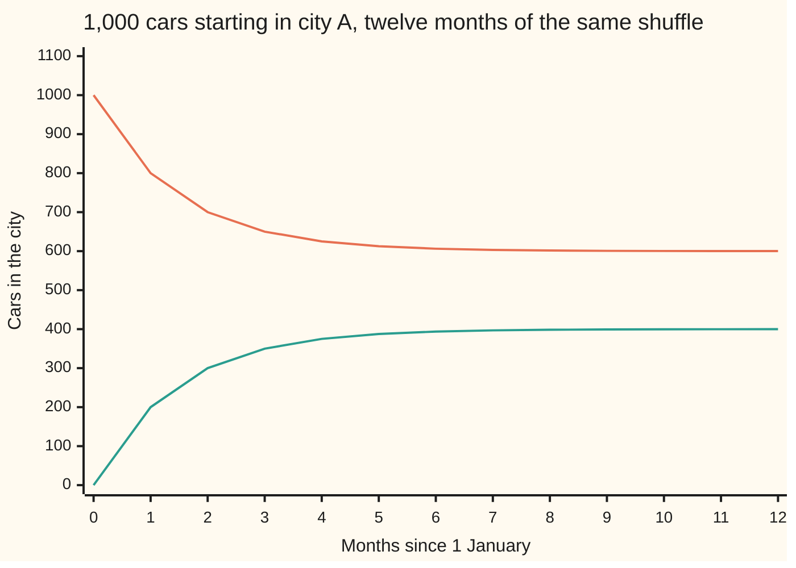
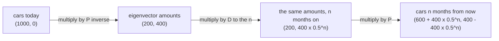

# Diagonalisation: in the eigenvector basis a matrix only stretches, so A^n is three easy multiplications

Algebra → Eigenvalues and Symmetric Matrices → Matrix powers → Diagonalisation

---

## General Overview

A rental company runs 1,000 cars between two cities. Each month 80% of city A's cars stay and 20% are driven to B; of B's, 70% stay and 30% come back. On 1 January all 1,000 sit in A. A month later A holds 800. A year later, 600.1.

One month of that shuffle is a matrix, `[[0.8, 0.3], [0.2, 0.7]]`, two rows by two columns, each column saying where one city's cars go. A year is that matrix applied twelve times over.

Two patterns behave simply here. The split (600, 400) does not move: departures are exactly replaced by arrivals. The imbalance (400, −400) — four hundred too many in A, four hundred too few in B — keeps its shape and halves every month. Every fleet is the first plus some amount of the second.

**Rewrite the fleet along the two directions the matrix merely stretches, and n months of it becomes an ordinary n-th power of each stretch, with a fixed translation at each end.**

**What kind of fact this is:** a theorem, proved on this card in Why it works, and only for matrices with a full set of independent eigenvectors.

### The picture: a year of the fleet



The falling line is city A, the rising line city B. Each month closes half the remaining gap, so A flattens onto 600 and B onto 400.

---

## The formula

An eigenvector is a direction a matrix does not turn, only stretches; its eigenvalue is the stretch ([eigenvalues-and-eigenvectors](02-eigenvalues-and-eigenvectors.md)). For the fleet matrix they are (3, 2), stretched by 1, and (1, −1), stretched by 0.5. Write them as the columns of a matrix P, and their stretches on the diagonal of a second matrix — the top-left to bottom-right line, zeros elsewhere — called D. A matrix like that is **diagonal**, which is where diagonalisation gets its name.

$$A = PDP^{-1}, \qquad A^n = PD^nP^{-1}$$

**Read it aloud:** translate the fleet into eigenvector amounts, stretch each amount alone, translate back; n times over only raises the stretches to the n-th power. Matrices act right to left: $P^{-1}$, then $D$, then $P$.

| Symbol | Plain meaning | In our example | Push it up and the answer… |
| --- | --- | --- | --- |
| $A$ | one month of the shuffle, 2 × 2 | `[[0.8, 0.3], [0.2, 0.7]]` | another fleet story |
| $P$ | the eigenvectors as columns | `[[3, 1], [2, -1]]` | swap its columns and D must swap |
| $D$ | the stretches on the diagonal | `[[1, 0], [0, 0.5]]` | nearer 1, the imbalance fades slower |
| $D^n$ | each diagonal entry to the n-th power | `[[1, 0], [0, 0.5^12]]` at a year | — |
| $P^{-1}$ | the inverse of P: counts in, amounts out | `[[0.2, 0.2], [0.4, -0.6]]` | — |
| $n$ | months applied, a whole number from 0 | 12 | halves the imbalance again |
| $I$ | the identity, the do-nothing matrix | `[[1, 0], [0, 1]]` | — |

After n months city A holds

$$600 + 400 \times 0.5^n$$

cars and city B holds 400 − 400 × 0.5^n. The 600 and 400 are the split that never moves, 0.5^n is the imbalance halving, and the two add to 1,000.

### When it holds

- **Enough independent eigenvectors.** Two for a 2 × 2, neither a multiple of the other, or P has no inverse.
- **Different eigenvalues guarantee it.** A repeated one is checked, not rejected: the identity has eigenvalue 1 twice and every direction is an eigenvector.
- **Real eigenvectors, and whole powers.** A quarter-turn has no real eigenvector and needs complex numbers, absent from this wing. Negative powers need $A$ invertible; here neither eigenvalue is 0.
- **The fleet model.** The percentages hold every month and no car is scrapped, so 600.1 is a fleet average.

---

## Why it works

### Step 0: find the directions the matrix does not turn

Feed the matrix (3, 2): out comes (0.8 × 3 + 0.3 × 2, 0.2 × 3 + 0.7 × 2), which is (3, 2) untouched, so its stretch is 1. Feed it (1, −1): out comes (0.5, −0.5), half of (1, −1), so its stretch is 0.5. A matrix that turns nothing only multiplies, and powers handle multiplying.

### Step 1: eigenvectors as columns give one matrix equation

With P and D as above, multiplying by P on the right works one column at a time, so the product A P holds A applied to each eigenvector: 1 times the first, 0.5 times the second. Multiplying P by D scales those same columns by the same numbers:

$$AP = PD$$

The columns point different ways, so P has an inverse ([change-of-basis](01-change-of-basis.md)); multiply on the right by it and $A = PDP^{-1}$. Backwards, AP = PD says each column of P is an eigenvector, so this factorisation exists exactly when enough independent eigenvectors do.

### Step 2: the middle cancels, so the power lands on D alone

Two months is the matrix twice:

$$A^2 = PDP^{-1}PDP^{-1}$$

The inner $P^{-1}$ and $P$ are neighbours, and a matrix beside its inverse is the identity $I$, which changes nothing. They vanish, leaving $PD^2P^{-1}$, and each month adds another pair to cancel:

$$A^n = PD^nP^{-1}$$

$D^n$ costs nothing: a diagonal matrix never mixes the coordinates, so multiplying it by itself multiplies each diagonal entry by itself, leaving `[[1, 0], [0, 0.5^n]]` ([exponents-and-powers](../../01-Foundations/03-Powers%2C%20Roots%20and%20Logarithms/01-exponents-and-powers.md)). One trap: $A^n$ is the matrix applied n times, not each entry to the power. For $D$ they agree from the first power up.

<details>
<summary>Detailed proof</summary>

Step 1 settles the factorisation; this is the power, by induction on n. At n = 0 both sides are $I$. Suppose $A^k = PD^kP^{-1}$; then $A^{k+1}$ is $(PDP^{-1})(PD^kP^{-1})$, which regroups to $PD(P^{-1}P)D^kP^{-1}$, and that is $PD^{k+1}P^{-1}$. True at 0 and inherited at every step, so true for every whole n.

</details>

### Step 3: read the fleet in the new coordinates

The fleet starts at (1000, 0). Multiply by $P^{-1}$: `[[0.2, 0.2], [0.4, -0.6]]` applied to (1000, 0) gives (200, 400), the amount of each eigenvector. Rebuilding checks it: 200 lots of (3, 2) is (600, 400), 400 lots of (1, −1) is (400, −400), adding back to (1000, 0). The first amount is multiplied by 1 each month and stays 200; the second by 0.5, so after n months it is 400 × 0.5^n. Translate back with $P$: the fleet is (600 + 400 × 0.5^n, 400 − 400 × 0.5^n).



Three multiplications, whatever n is. One month gives (800, 200); twelve give (600.097656, 399.902344), so city A holds 600.1 cars. Powers of 0.5 die while powers of 1 do not, so the fleet approaches (600, 400), read off the stretches, not a table.

### Step 4: the matrix this cannot be done to

The shear `[[1, 1], [0, 1]]` slides points sideways in proportion to their height. Its eigenvalue equation is (1 − stretch)^2 = 0: eigenvalue 1, twice over. Subtract $I$ and `[[0, 1], [0, 0]]` is left, sending (x, y) to (y, 0), zero only when y is 0. Every eigenvector lies along (1, 0): one direction where two are needed, so P's columns would be multiples of each other, P would have no inverse, and there is no factorisation. Such a matrix is **defective**, and its replacement, the Jordan form, belongs to the applied and computational wing. Its powers stay easy by hand — `[[1, n], [0, 1]]` after n months, `[[1, 12], [0, 1]]` after twelve — just not this way.

**The other route.** Multiplying the matrix out twelve times reaches the same powers with no eigenvectors, and works on the shear, but explains nothing.

---

## Worked numbers, by hand

From (1000, 0) to the year's end; only the power of 0.5 changes down the table.

| Step | Arithmetic | Value |
| --- | --- | --- |
| the eigenvector amounts | `[[0.2, 0.2], [0.4, -0.6]]` applied to (1000, 0) | (200, 400) |
| the piece that stays | 200 × (3, 2) | (600, 400) |
| the piece that halves | 400 × (1, −1) | (400, −400) |
| one month | (600, 400) + 0.5 × (400, −400) | **(800, 200)** |
| twelve months | (600, 400) + 0.5^12 × (400, −400) | **(600.097656, 399.902344)** |
| city A, to one decimal | round 600.097656 | **600.1 cars** |

City A holds 600.1 cars after a year and city B 399.9; a second year moves them by under a tenth of a car.

### What breaks if you drop a piece

Each wrong answer is the same twelve months; the fleet really reaches (600.097656, 399.902344).

| Mistake | Comes out at | What went wrong |
| --- | --- | --- |
| Eigenvectors as P's rows | (600.097656, 199.951172) | The wrong translation, even with the right inverse |
| P where P inverse belongs | (9000.488281, 5999.511719) | Builds a fleet instead of measuring amounts |
| D left at the first power | (800, 200) | One month, not twelve: $D^n$ holds the calendar |
| P's columns swapped, D not | (400.146484, −399.902344) | Each eigenvector has the other's eigenvalue |

---

## Code, from first principles, and it actually runs

Nothing is imported. The fleet goes a year forward by three roads that share no arithmetic: the matrix multiplied by itself month after month, $PD^nP^{-1}$ built afresh each month, and the hand formula 600 + 400 × 0.5^n. The asserts play the roads against each other.

### Python

```python
# Diagonalisation -- the check behind the card.  Nothing is imported.  A rental
# fleet shuffles between two cities each month under A = [[0.8, 0.3], [0.2, 0.7]]
# and 1,000 cars start in city A.  Road one multiplies A by itself, month after
# month.  Road two builds A^n as P D^n P inverse: three multiplications.  The
# hand formulas 600 + 400 x 0.5^n and 400 - 400 x 0.5^n are a third road.
A = [[0.8, 0.3], [0.2, 0.7]]
P = [[3.0, 1.0], [2.0, -1.0]]
PINV = [[0.2, 0.2], [0.4, -0.6]]
START = [1000.0, 0.0]
MONTHS = list(range(13))

def mul(m, k):                              # 2 by 2 matrix times 2 by 2 matrix
    return [[m[i][0] * k[0][j] + m[i][1] * k[1][j] for j in range(2)] for i in range(2)]

def act(m, v):                              # matrix times a column of two numbers
    return [m[i][0] * v[0] + m[i][1] * v[1] for i in range(2)]

def dpow(n): return [[1.0, 0.0], [0.0, 0.5 ** n]]      # D^n: 1 stays, 0.5 halves
def three(p, d, q): return mul(mul(p, d), q)           # p times d times q
def gap(m, k): return max(abs(m[i][j] - k[i][j]) for i in range(2) for j in range(2))
def pair(v): return f"({v[0]:.6f}, {v[1]:.6f})"
def grid(name, vals): print(f"{name:<27}" + "".join(f"{v:>8}" for v in vals))
power = [[[1.0, 0.0], [0.0, 1.0]]]          # month 0: the do-nothing matrix
for _ in range(12): power.append(mul(A, power[-1]))    # road one: one more A a month
slow = [act(power[n], START) for n in MONTHS]
fast = [act(three(P, dpow(n), PINV), START) for n in MONTHS]
hand = [[600.0 + 400.0 * 0.5 ** n, 400.0 - 400.0 * 0.5 ** n] for n in MONTHS]
w = act(PINV, START)                    # the start, read in eigenvector amounts
steady, fade = [P[0][0] * w[0], P[1][0] * w[0]], [P[0][1] * w[1], P[1][1] * w[1]]
shear, spow = [[1.0, 1.0], [0.0, 1.0]], [[1.0, 0.0], [0.0, 1.0]]
for _ in range(12): spow = mul(shear, spow)            # the shear, twelve months of it
rows, rinv = [[3.0, 2.0], [1.0, -1.0]], [[0.2, 0.4], [0.2, -0.6]]
swap, sinv = [[1.0, 3.0], [-1.0, 2.0]], [[0.4, -0.6], [0.2, 0.2]]
wrong = [act(three(rows, dpow(12), rinv), START), act(three(P, dpow(12), P), START),
         act(three(P, dpow(1), PINV), START), act(three(swap, dpow(12), sinv), START)]
labels = ["eigenvectors as rows of P", "P where P inverse belongs",
          "D left at the first power", "P columns swapped, D not"]
print("fleet matrix A = [[0.8, 0.3], [0.2, 0.7]], start (1000, 0) cars")
print("eigenvectors (3, 2) and (1, -1); eigenvalues 1 and 0.5")
print("P = [[3, 1], [2, -1]], D = [[1, 0], [0, 0.5]], P inverse = [[0.2, 0.2], [0.4, -0.6]]")
print(f"P D P inverse rebuilds A: largest entry gap {gap(three(P, dpow(1), PINV), A):.12f}")
print(f"eigenvector amounts, P inverse times (1000, 0): {pair(w)} = {w[0]:.0f} x (3, 2) + "
      f"{w[1]:.0f} x (1, -1) = {pair(steady)} + {pair(fade)}")
grid("month", MONTHS)
grid("city A, twelve multiplies", [f"{slow[n][0]:.2f}" for n in MONTHS])
grid("city B, twelve multiplies", [f"{slow[n][1]:.2f}" for n in MONTHS])
grid("city A, three multiplies", [f"{fast[n][0]:.2f}" for n in MONTHS])
grid("city B, three multiplies", [f"{fast[n][1]:.2f}" for n in MONTHS])
print(f"hand formula, city A at months 1, 6 and 12: {hand[1][0]:.6f}, {hand[6][0]:.6f}, "
      f"{hand[12][0]:.6f}; city B at month 12: {hand[12][1]:.6f}")
print(f"month 12 in full: {pair(fast[12])}; city A to one decimal = {fast[12][0]:.1f} cars")
for name, v in zip(labels, wrong):
    print(f"mistake, {name:<26}" + pair(v))
print(f"shear [[1, 1], [0, 1]] to the 12th = [[1, {spow[0][1]:.0f}], [0, 1]], "
      f"eigenvectors only along (1, 0)")
assert gap(three(P, dpow(1), PINV), A) < 1e-12
assert all(gap(three(P, dpow(n), PINV), power[n]) < 1e-12 for n in MONTHS)
assert all(abs(fast[n][j] - hand[n][j]) < 1e-9 for n in MONTHS for j in range(2))
assert spow == [[1.0, 12.0], [0.0, 1.0]] and act(shear, [1.0, 0.0]) == [1.0, 0.0] and act(shear, [1.0, 1.0]) == [2.0, 1.0]
print("ALL CHECKS PASS")
```

**Ran 2026-09-14 on macOS, Python 3.14.6, standard library only. All checks passed. Output, pasted from the run:**

```
fleet matrix A = [[0.8, 0.3], [0.2, 0.7]], start (1000, 0) cars
eigenvectors (3, 2) and (1, -1); eigenvalues 1 and 0.5
P = [[3, 1], [2, -1]], D = [[1, 0], [0, 0.5]], P inverse = [[0.2, 0.2], [0.4, -0.6]]
P D P inverse rebuilds A: largest entry gap 0.000000000000
eigenvector amounts, P inverse times (1000, 0): (200.000000, 400.000000) = 200 x (3, 2) + 400 x (1, -1) = (600.000000, 400.000000) + (400.000000, -400.000000)
month                             0       1       2       3       4       5       6       7       8       9      10      11      12
city A, twelve multiplies   1000.00  800.00  700.00  650.00  625.00  612.50  606.25  603.13  601.56  600.78  600.39  600.20  600.10
city B, twelve multiplies      0.00  200.00  300.00  350.00  375.00  387.50  393.75  396.88  398.44  399.22  399.61  399.80  399.90
city A, three multiplies    1000.00  800.00  700.00  650.00  625.00  612.50  606.25  603.13  601.56  600.78  600.39  600.20  600.10
city B, three multiplies       0.00  200.00  300.00  350.00  375.00  387.50  393.75  396.88  398.44  399.22  399.61  399.80  399.90
hand formula, city A at months 1, 6 and 12: 800.000000, 606.250000, 600.097656; city B at month 12: 399.902344
month 12 in full: (600.097656, 399.902344); city A to one decimal = 600.1 cars
mistake, eigenvectors as rows of P (600.097656, 199.951172)
mistake, P where P inverse belongs (9000.488281, 5999.511719)
mistake, D left at the first power (800.000000, 200.000000)
mistake, P columns swapped, D not  (400.146484, -399.902344)
shear [[1, 1], [0, 1]] to the 12th = [[1, 12], [0, 1]], eigenvectors only along (1, 0)
ALL CHECKS PASS
```

### Rust

Same numbers, same labels, built with `rustc --edition 2021 -O`.

```rust
// Diagonalisation -- the same check as the Python, in Rust.  No crates.  A rental
// fleet shuffles between two cities each month under A = [[0.8, 0.3], [0.2, 0.7]]
// and 1,000 cars start in city A.  Road one multiplies A by itself, month after
// month.  Road two builds A^n as P D^n P inverse: three multiplications.  The
// hand formulas 600 + 400 x 0.5^n and 400 - 400 x 0.5^n are a third road.
type M = [[f64; 2]; 2];
type V = [f64; 2];
const A: M = [[0.8, 0.3], [0.2, 0.7]];
const P: M = [[3.0, 1.0], [2.0, -1.0]];
const PINV: M = [[0.2, 0.2], [0.4, -0.6]];
const ID: M = [[1.0, 0.0], [0.0, 1.0]];
const START: V = [1000.0, 0.0];
fn mul(m: M, k: M) -> M {                   // 2 by 2 matrix times 2 by 2 matrix
    let mut o = [[0.0; 2]; 2];
    for i in 0..2 { for j in 0..2 { o[i][j] = m[i][0] * k[0][j] + m[i][1] * k[1][j]; } }
    o
}
fn act(m: M, v: V) -> V {                   // matrix times a column of two numbers
    [m[0][0] * v[0] + m[0][1] * v[1], m[1][0] * v[0] + m[1][1] * v[1]]
}
fn dpow(n: i32) -> M { [[1.0, 0.0], [0.0, 0.5f64.powi(n)]] }  // D^n: 1 stays, 0.5 halves
fn three(p: M, d: M, q: M) -> M { mul(mul(p, d), q) }         // p times d times q
fn gap(m: M, k: M) -> f64 {                 // largest entry-by-entry difference
    let mut e = 0.0f64;
    for i in 0..2 { for j in 0..2 { e = e.max((m[i][j] - k[i][j]).abs()); } }
    e
}
fn pair(v: V) -> String { format!("({:.6}, {:.6})", v[0], v[1]) }
fn grid(name: &str, vals: &[String]) {
    let mut line = format!("{:<27}", name);
    for v in vals { line.push_str(&format!("{:>8}", v)); }
    println!("{}", line);
}
fn city(counts: &[V], j: usize) -> Vec<String> {
    (0..13).map(|n| format!("{:.2}", counts[n][j])).collect()
}
fn main() {
    let mut power = vec![ID];               // month 0: the do-nothing matrix
    for _ in 0..12 { let next = mul(A, power[power.len() - 1]); power.push(next); }
    let slow: Vec<V> = (0..13).map(|n| act(power[n], START)).collect();
    let fast: Vec<V> = (0..13).map(|n| act(three(P, dpow(n as i32), PINV), START)).collect();
    let hand: Vec<V> = (0..13)
        .map(|n| [600.0 + 400.0 * 0.5f64.powi(n), 400.0 - 400.0 * 0.5f64.powi(n)]).collect();
    let w = act(PINV, START);           // the start, read in eigenvector amounts
    let steady: V = [P[0][0] * w[0], P[1][0] * w[0]];
    let fade: V = [P[0][1] * w[1], P[1][1] * w[1]];
    let shear: M = [[1.0, 1.0], [0.0, 1.0]];
    let mut spow = ID;
    for _ in 0..12 { spow = mul(shear, spow); }   // the shear, twelve months of it
    let rows: M = [[3.0, 2.0], [1.0, -1.0]]; let rinv: M = [[0.2, 0.4], [0.2, -0.6]];
    let swap: M = [[1.0, 3.0], [-1.0, 2.0]]; let sinv: M = [[0.4, -0.6], [0.2, 0.2]];
    let wrong = [act(three(rows, dpow(12), rinv), START), act(three(P, dpow(12), P), START),
                 act(three(P, dpow(1), PINV), START), act(three(swap, dpow(12), sinv), START)];
    let labels = ["eigenvectors as rows of P", "P where P inverse belongs",
                  "D left at the first power", "P columns swapped, D not"];
    println!("fleet matrix A = [[0.8, 0.3], [0.2, 0.7]], start (1000, 0) cars");
    println!("eigenvectors (3, 2) and (1, -1); eigenvalues 1 and 0.5");
    println!("P = [[3, 1], [2, -1]], D = [[1, 0], [0, 0.5]], P inverse = [[0.2, 0.2], [0.4, -0.6]]");
    println!("P D P inverse rebuilds A: largest entry gap {:.12}", gap(three(P, dpow(1), PINV), A));
    println!("eigenvector amounts, P inverse times (1000, 0): {} = {:.0} x (3, 2) + {:.0} x (1, -1) \
              = {} + {}", pair(w), w[0], w[1], pair(steady), pair(fade));
    grid("month", &(0..13).map(|n| n.to_string()).collect::<Vec<String>>());
    grid("city A, twelve multiplies", &city(&slow, 0));
    grid("city B, twelve multiplies", &city(&slow, 1));
    grid("city A, three multiplies", &city(&fast, 0));
    grid("city B, three multiplies", &city(&fast, 1));
    println!("hand formula, city A at months 1, 6 and 12: {:.6}, {:.6}, {:.6}; \
              city B at month 12: {:.6}", hand[1][0], hand[6][0], hand[12][0], hand[12][1]);
    println!("month 12 in full: {}; city A to one decimal = {:.1} cars", pair(fast[12]), fast[12][0]);
    for (name, v) in labels.iter().zip(wrong.iter()) {
        println!("mistake, {:<26}{}", name, pair(*v));
    }
    println!("shear [[1, 1], [0, 1]] to the 12th = [[1, {:.0}], [0, 1]], \
              eigenvectors only along (1, 0)", spow[0][1]);
    assert!(gap(three(P, dpow(1), PINV), A) < 1e-12);
    assert!((0..13).all(|n| gap(three(P, dpow(n), PINV), power[n as usize]) < 1e-12));
    assert!((0..13).all(|n| (0..2).all(|j| (fast[n][j] - hand[n][j]).abs() < 1e-9)));
    assert!(spow == [[1.0, 12.0], [0.0, 1.0]] && act(shear, [1.0, 0.0]) == [1.0, 0.0] && act(shear, [1.0, 1.0]) == [2.0, 1.0]);
    println!("ALL CHECKS PASS");
}
```

**Ran 2026-09-14 on macOS, rustc 1.98.1, no crates. All checks passed. Output, pasted from the run:**

```
fleet matrix A = [[0.8, 0.3], [0.2, 0.7]], start (1000, 0) cars
eigenvectors (3, 2) and (1, -1); eigenvalues 1 and 0.5
P = [[3, 1], [2, -1]], D = [[1, 0], [0, 0.5]], P inverse = [[0.2, 0.2], [0.4, -0.6]]
P D P inverse rebuilds A: largest entry gap 0.000000000000
eigenvector amounts, P inverse times (1000, 0): (200.000000, 400.000000) = 200 x (3, 2) + 400 x (1, -1) = (600.000000, 400.000000) + (400.000000, -400.000000)
month                             0       1       2       3       4       5       6       7       8       9      10      11      12
city A, twelve multiplies   1000.00  800.00  700.00  650.00  625.00  612.50  606.25  603.13  601.56  600.78  600.39  600.20  600.10
city B, twelve multiplies      0.00  200.00  300.00  350.00  375.00  387.50  393.75  396.88  398.44  399.22  399.61  399.80  399.90
city A, three multiplies    1000.00  800.00  700.00  650.00  625.00  612.50  606.25  603.13  601.56  600.78  600.39  600.20  600.10
city B, three multiplies       0.00  200.00  300.00  350.00  375.00  387.50  393.75  396.88  398.44  399.22  399.61  399.80  399.90
hand formula, city A at months 1, 6 and 12: 800.000000, 606.250000, 600.097656; city B at month 12: 399.902344
month 12 in full: (600.097656, 399.902344); city A to one decimal = 600.1 cars
mistake, eigenvectors as rows of P (600.097656, 199.951172)
mistake, P where P inverse belongs (9000.488281, 5999.511719)
mistake, D left at the first power (800.000000, 200.000000)
mistake, P columns swapped, D not  (400.146484, -399.902344)
shear [[1, 1], [0, 1]] to the 12th = [[1, 12], [0, 1]], eigenvectors only along (1, 0)
ALL CHECKS PASS
```

The two outputs match line for line.

> [!TIP]
> **Try changing**
> Guess first, then run it. The asserts are pinned to the fleet's numbers, so expect one to stop the program.
> - **Slow the imbalance.** In `dpow`, change `0.5 ** n` to `0.9 ** n`. The stretch stops matching the matrix, the two matrix roads part at month 1, and the first assert stops it.
> - **Lengthen an eigenvector.** Use (6, 4) for P's first column and `[[0.1, 0.1], [0.4, -0.6]]` for P inverse. The counts hold, the first amount halves: an eigenvector may be any length.
> - **Swap D's diagonal.** Have `dpow` return `[[0.5 ** n, 0.0], [0.0, 1.0]]`. City A slides towards 400, and the first assert stops the run.

---

## The usual mistake

> [!warning]
> **Assuming every square matrix can be written this way.** The factorisation needs as many independent eigenvectors as the matrix has rows, and a defective matrix has fewer: the shear `[[1, 1], [0, 1]]` offers one direction where two are needed.
>
> - **Eigenvectors in the rows.** Columns, always. Rows leave city B with 199.951172 cars after a year instead of 399.902344.
> - **P and P inverse the wrong way round.** The inverse goes on the right, where it meets the fleet first. Swapping them turns 1,000 cars into 9,000.
> - **Reordering P's columns and forgetting D.** Each eigenvector must keep its own eigenvalue, or the year ends on minus four hundred cars in city B.

---

## Where you meet it in real life

- **Transition models.** Customers between tariffs, machines between working and broken, cars between depots: one matrix per period, powers for the long run, as in [multi-step-transitions](../../11-Stochastic%20processes%20and%20calculus/03-Markov%20Chains/02-multi-step-transitions.md).
- **Sequences built from their own past.** "Each term is the sum of the two before it" is a matrix applied over and over, and its eigenvalues give a formula: [recurrences-as-matrix-powers](../../04-Combinatorics%20and%20graphs/05-Recurrences/06-recurrences-as-matrix-powers.md).
- **Page ranking, and masses on springs.** A link matrix applied over and over lands on the largest stretch's direction; coupled springs come apart into independent motions.

> **Say it back**
> A matrix usually turns and stretches at once, but a few directions it only stretches. Put those eigenvectors in the columns of P and their stretches on the diagonal of D, and the matrix comes apart as P D P inverse: translate into eigenvector amounts, stretch each amount, translate back. Apply it n times and the inner translations cancel in pairs, so only D is raised to the power. The fleet is 200 lots of (3, 2) plus 400 lots of (1, −1), and the second halves monthly, so a year on city A holds 600.1 cars.

---

## What this builds on

- [eigenvalues-and-eigenvectors](02-eigenvalues-and-eigenvectors.md): the directions a matrix only stretches, and the equation that finds them.
- [change-of-basis](01-change-of-basis.md): why independent columns give an inverse, and how P translates between two descriptions of a fleet.
- [exponents-and-powers](../../01-Foundations/03-Powers%2C%20Roots%20and%20Logarithms/01-exponents-and-powers.md): what 0.5^12 means, and why halving forever shrinks to nothing.

## Where this goes next

- [spectral-theorem](04-spectral-theorem.md): eigenvectors always, and at right angles, so P's inverse is free.
- [recurrences-as-matrix-powers](../../04-Combinatorics%20and%20graphs/05-Recurrences/06-recurrences-as-matrix-powers.md): a sequence rule as a matrix.
- [the-eigenvalue-method](../../08-Differential%20equations%20and%20dynamics/04-Systems%20and%20the%20Matrix%20Exponential/02-the-eigenvalue-method.md): the same split in continuous time.
- [multi-step-transitions](../../11-Stochastic%20processes%20and%20calculus/03-Markov%20Chains/02-multi-step-transitions.md): eigenvalue 1 among probabilities.
- [rating-transition-matrix-and-cumulative-default-rates](../../12-Financial%20mathematics/41-Default%2C%20Survival%20and%20the%20Hazard%20Rate/04-rating-transition-matrix-and-cumulative-default-rates.md): these powers on credit ratings.
- power-iteration-and-the-damping-factor: why repetition finds one direction.
- eigenvalues-power-iteration-and-the-qr-algorithm: eigenvalues for a thousand rows.
- spectral-theorem-for-bounded-self-adjoint-operators: infinitely many directions.
- strongly-continuous-semigroups: with time as the power.

This card was handed its eigenvectors and got lucky; the next names a family where that luck is guaranteed and the eigenvectors arrive at right angles.

---

## Sources

Verified 14 Sep 2026: every link below resolves to the publisher's page.

- Axler, Sheldon. *Linear Algebra Done Right*, 4th ed. Springer, 2024. Section 5D: the eigenbasis condition, and a high power from an eigenbasis. [linear.axler.net](https://linear.axler.net/), publisher [doi:10.1007/978-3-031-41026-0](https://doi.org/10.1007/978-3-031-41026-0).
- Strang, Gilbert. "Diagonalization and Powers of A." MIT 18.06, lecture 22, 2010. [MIT OpenCourseWare](https://ocw.mit.edu/courses/18-06-linear-algebra-spring-2010/resources/lecture-22-diagonalization-and-powers-of-a/). The cancellation argument, on a two-state matrix.
- Margalit, Dan, and Joseph Rabinoff. *Interactive Linear Algebra*. Georgia Tech. [Diagonalization](https://textbooks.math.gatech.edu/ila/diagonalization.html). Matched column order in P and D.
- Horn, Roger A., and Charles R. Johnson. *Matrix Analysis*, 2nd ed. Cambridge, 2013. Sections 1.3 and 1.4: when a repeated eigenvalue falls short. [doi:10.1017/CBO9781139020411](https://doi.org/10.1017/CBO9781139020411).
