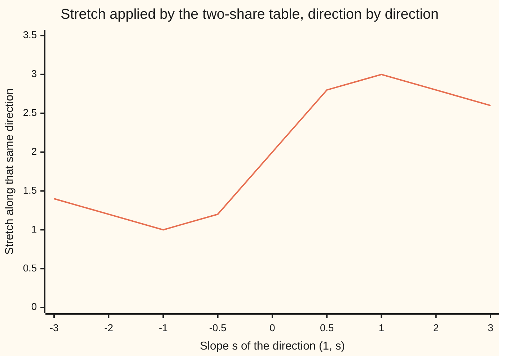
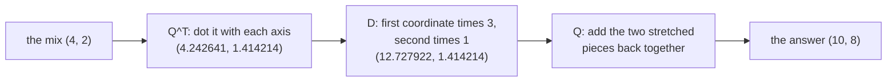

# The spectral theorem: a symmetric matrix has real stretch factors along perpendicular axes, A = Q D Q^T

[Syllabus](../../../SYLLABUS.md) → [Algebra](../../../SYLLABUS.md#w03) → [Eigenvalues and Symmetric Matrices](../../../SYLLABUS.md#w03-s07) → The spectral theorem

---

## General Overview

A bank share and an insurer share tend to move on the same days. Their moves make a table of two rows by two columns, `[[2, 1], [1, 2]]`: each share's own swing is 2, their shared movement 1.

The table is **symmetric**: row 1, column 2 equals row 2, column 1. Not luck — "how the bank moves with the insurer" is the same sentence as "how the insurer moves with the bank". Two-way relationships make symmetric tables.

Push mixes through it. A mix is a pair: (4, 2) is four parts bank to two parts insurer, and the table sends it to (10, 8), aimed elsewhere. But (1, 1), both up together, comes out as (3, 3) — same direction, three times as long — and (1, -1), one up and one down, comes out untouched. Those two meet at a right angle, since (1, 1) · (1, -1) is 0.

**So the table is two numbers on two perpendicular lines: multiply by 3 along "both up together", by 1 along "one up, one down", and turn neither axis. Writing that down costs only a transpose where an inverse is usually needed.**

**What kind of fact this is:** a theorem, proved for 2 by 2 in Why it works, the general proof folded there.

### The picture: how hard the table stretches each direction

A direction's **stretch** is a ratio of two dot products: the direction dotted with its own output, over the direction dotted with itself. Tilt it through the lines (1, s).



The line is the stretch. It bottoms out at 1.000000 at slope -1, the direction (1, -1), and tops out at 3.000000 at slope 1, the direction (1, 1); a sweep of 4002 directions finds nothing beyond them. Those extremes are the stretch factors, and the axes sit there.

---

## The formula

A square matrix of real numbers equal to its own transpose is **symmetric**. For every one of them:

$$A = Q D Q^{\mathsf T}, \qquad Q^{\mathsf T} Q = I$$

**Read it aloud:** read the input in the perpendicular axes, stretch each coordinate by its axis's factor, read the answer back in the ordinary axes. Products act right to left.

| Symbol | Plain meaning | In our example | Push it up and the answer… |
| --- | --- | --- | --- |
| $A$ | the symmetric matrix | rows (2, 1) and (1, 2) | a bigger shared entry spreads the factors |
| $Q$ | the axes, one unit long, as columns | columns $q_1$ and $q_2$ | it re-aims axes, never scales |
| $D$ | the stretch factors down the diagonal, in column order | rows (3, 0) and (0, 1) | that axis pulls harder |
| $I$ | the identity, which leaves every vector alone | rows (1, 0), (0, 1) | — |
| $q_1$, $q_2$ | the axes as vectors | (0.707107, 0.707107), (0.707107, -0.707107) | — |
| $\lambda$, $\mu$ | two stretch factors in the argument below | 3 and 1 | — |
| $v$, $w$ | two directions kept on their own lines | (1, 1), (1, -1) | — |

A direction kept on its own line is an **eigenvector**, its multiplier the **eigenvalue** ([Eigenvalues and eigenvectors](02-eigenvalues-and-eigenvectors.md)); a matrix with perpendicular unit columns is **orthogonal** ([Gram-Schmidt](../06-Dot%20Products%20and%20Best%20Fits/03-gram-schmidt-and-orthonormal-bases.md)).

### When it holds

- **It must equal its own transpose.** A rental fleet's month-to-month table, rows (0.800000, 0.300000) and (0.200000, 0.700000), has real factors 1.000000 and 0.500000, but its directions (3, 2) and (1, -1) dot to 1.000000, not 0.
- **The entries must be real**, or the flip must change the sign of the imaginary part too ([Complex vectors and matrices](../../07-Complex%20analysis/01-Complex%20Numbers%20and%20the%20Plane/07-complex-vectors-and-matrices.md)).
- **The matrix must be finite** (Compact and symmetric has the infinite conditions).

---

## Why it works

### Step 0: symmetry lets the matrix hop across a dot product

Take the matrix with rows (a, b) and (b, d) — symmetry repeats the b — and vectors v = (p, q), w = (r, t). Apply it to v and dot with w; apply it to w and dot with v. Both expand to a p r + b (q r + p t) + d q t. So

$$(A v) \cdot w = v \cdot (A w)$$

A symmetric matrix steps from one side of a dot product to the other. Everything below spends that.

### Step 1: two different factors force a right angle

Say the matrix keeps v with factor $\lambda$ and w with factor $\mu$. Then $(A v) \cdot w = \lambda (v \cdot w)$ and $v \cdot (A w) = \mu (v \cdot w)$. Step 0 makes those equal, so $(\lambda - \mu)(v \cdot w) = 0$. A product is zero only if a factor is, so different factors force v · w = 0. For our table 3 and 1 differ, so (1, 1) · (1, -1) = 0 was no coincidence. A repeated factor is the loose case: a plane is kept, and Gram-Schmidt picks a perpendicular pair from it.

### Step 2: at 2 by 2 the factors are always real

The quadratic giving the factors is $\lambda^2 - (a + d)\lambda + (a d - b^2) = 0$, and under its square root sits

$$(a + d)^2 - 4(a d - b^2) = (a - d)^2 + 4 b^2$$

A square plus four times a square: never negative, so both roots are real. For our table it is 4, giving the 3.000000 and 1.000000 the code prints. Drop symmetry — rows (a, b) and (c, d) — and it reads (a - d)^2 + 4 b c, which can go negative: a quarter turn gives -4 and keeps no direction.

### Step 3: stack the axes, and the transpose does the inverse's work

Shrink the two directions to length one and stand them up as the columns of $Q$. The matrix scales each column by that column's factor, which is $Q$ times $D$:

$$A Q = Q D$$

Every entry of $Q^{\mathsf T} Q$ is one of those dot products: 1s down the diagonal, 0s off it. So $Q^{\mathsf T} Q = I$ and $Q^{\mathsf T}$ is the inverse of $Q$. Multiply on the right by it:

$$A = Q D Q^{\mathsf T}$$



Coordinates in the new axes, stretch each, pieces back. Ordinary diagonalisation does the same but must compute $Q^{-1}$ ([Diagonalisation](03-diagonalisation-and-matrix-powers.md)); here it is a transpose.

<details>
<summary>Detailed proof: every size, not just 2 by 2</summary>

**One axis exists.** The directions of length one form a closed, bounded set and stretch varies smoothly over it, so stretch has a largest value somewhere. Tilting that best direction u cannot raise it, and setting the rate of change to zero rearranges to A u being a multiple of u. So u is an eigenvector, its factor real because a stretch is.

**Drop into what is left.** If v is perpendicular to u then (A v) · u = v · (A u) by Step 0, a multiple of v · u, so 0. The matrix carries that perpendicular space into itself, still symmetric there. Repeat once per dimension and the axes fill the space. Both analysis steps belong to [Extrema in several variables](../../06-Calculus%20and%20analysis/07-Several%20Variables/06-multivariable-extrema.md).

</details>

The same line reads as 3 times a projection onto $q_1$ plus 1 times one onto $q_2$ ([Projection](../06-Dot%20Products%20and%20Best%20Fits/02-orthogonal-projection.md)).

---

## Worked numbers, by hand

Rows (2, 1) and (1, 2), taken apart and put back.

| Step | Arithmetic | Value |
| --- | --- | --- |
| road one, the quadratic | trace (diagonal sum) 4, determinant 3 | 3.000000 and 1.000000 |
| road two, 40 multiply-then-shrink rounds from (1, 0.25) | slides onto the strongest axis | q1 = (0.707107, 0.707107) |
| a quarter turn on, then dot | q2 = (0.707107, -0.707107); q1 · q2 | 0.000000 |
| the stretch on each axis | A q1 = (2.121320, 2.121320); A q2 = q2 | 3.000000 and 1.000000 |
| Q is orthogonal | rows of $Q^{\mathsf T} Q$ | (1.000000, 0.000000), (0.000000, 1.000000) |
| rebuild | rows of $Q D Q^{\mathsf T}$ | **(2.000000, 1.000000), (1.000000, 2.000000)** |
| the mix (4, 2) through the axes | dotted to (4.242641, 1.414214), stretched to (12.727922, 1.414214), then Q | **(10.000000, 8.000000)** |
| the same mix straight through | (2 × 4 + 1 × 2, 1 × 4 + 2 × 2) | **(10.000000, 8.000000)** |

Two roads, one answer: a rewriting, not an approximation.

### What breaks if you drop a piece

| Mistake | Comes out at | What went wrong |
| --- | --- | --- |
| Q's columns left at raw length | rows (4.000000, 2.000000), (2.000000, 4.000000) | perpendicular is half the condition; over-long columns double it |
| 3 and 1 swapped in D alone | rows (2.000000, -1.000000), (-1.000000, 2.000000) | a factor belongs to one axis: swap both or neither |
| symmetry dropped, the fleet table | its directions dot to 1.000000 | real factors, but axes not square, so no transpose inverts |

The code prints all three.

---

## Code, from first principles, and it actually runs

Nothing is imported. Two roads share no arithmetic: the quadratic from the trace and determinant, and forty rounds of multiply-then-shrink, which uses neither. The rest checks the card in order — $Q^{\mathsf T} Q$ the identity, $Q D Q^{\mathsf T}$ rebuilding the table, the mix (4, 2) both ways, 4002 directions bracketing the factors. A second case runs the fleet table through the quadratic.

### Python

```python
# The spectral theorem -- the check behind the card.  Nothing is imported.  The symmetric
# table [[2, 1], [1, 2]], two stocks that move together, is split into perpendicular axes by
# two roads: the characteristic quadratic, and repeated multiply-and-shrink.
def dot(u, v): return u[0] * v[0] + u[1] * v[1]
def mv(a, v): return [dot(a[0], v), dot(a[1], v)]
def tp(a): return [[a[0][0], a[1][0]], [a[0][1], a[1][1]]]
def mul(a, b): return [[dot(r, c) for c in tp(b)] for r in a]
def unit(v): return [x / dot(v, v) ** 0.5 for x in v]
def stretch(a, v): return dot(v, mv(a, v)) / dot(v, v)
def f(v): return "(" + ", ".join("%.6f" % (0.0 if abs(x) < 1e-12 else x) for x in v) + ")"
def near(u, v): return all(abs(x - y) < 1e-9 for x, y in zip(u, v))
def roots(a):                                          # road one: the quadratic
    t = a[0][0] + a[1][1]
    g = ((a[0][0] - a[1][1]) ** 2 + 4 * a[0][1] * a[1][0]) ** 0.5
    return [(t + g) / 2, (t - g) / 2]
A = [[2.0, 1.0], [1.0, 2.0]]
trace, det = A[0][0] + A[1][1], A[0][0] * A[1][1] - A[0][1] * A[1][0]
road_one = roots(A)
q1 = [1.0, 0.25]                                       # road two: multiply, shrink
for _ in range(40): q1 = unit(mv(A, q1))
q2 = [q1[1], -q1[0]]                                   # a quarter turn from q1
big, small = stretch(A, q1), stretch(A, q2)
Q, D = tp([q1, q2]), [[big, 0.0], [0.0, small]]
gram, rebuilt = mul(tp(Q), Q), mul(mul(Q, D), tp(Q))
x, rawq = [4.0, 2.0], [[1.0, 1.0], [1.0, -1.0]]
coords = mv(tp(Q), x)
scaled = mv(D, coords)
bad_unit = mul(mul(tp(rawq), D), rawq)
bad_swap = mul(mul(Q, [[small, 0.0], [0.0, big]]), tp(Q))
curve = [stretch(A, [1.0, s]) for s in (-3.0, -2.0, -1.0, -0.5, 0.0, 0.5, 1.0, 2.0, 3.0)]
sweep = [stretch(A, v) for k in range(-1000, 1001)
         for v in ([1.0, k / 1000], [k / 1000, 1.0])]
F = [[0.8, 0.3], [0.2, 0.7]]                           # second case: not symmetric
fleet = roots(F)
print("A rows %s and %s: symmetric, trace %.6f, determinant %.6f" % (f(A[0]), f(A[1]), trace, det))
print("road one, roots of L*L - 4L + 3 = 0: %.6f and %.6f" % (road_one[0], road_one[1]))
print("road two, 40 rounds of multiply-and-shrink from (1, 0.25): q1 = %s" % f(q1))
print("a quarter turn from it: q2 = %s, and q1 . q2 = %.6f" % (f(q2), dot(q1, q2)))
print("A q1 = %s = %.6f q1; A q2 = %s = %.6f q2" % (f(mv(A, q1)), big, f(mv(A, q2)), small))
print("Q^T Q rows: %s and %s" % (f(gram[0]), f(gram[1])))
print("Q D Q^T rows: %s and %s" % (f(rebuilt[0]), f(rebuilt[1])))
print("mix (4, 2): coordinates %s, then stretched %s" % (f(coords), f(scaled)))
print("A x straight, and through the axes: %s and %s" % (f(mv(A, x)), f(mv(Q, scaled))))
print("stretch along (1, s) for s = -3, -2, -1, -0.5, 0, 0.5, 1, 2, 3:\n  "
      + " ".join("%.6f" % c for c in curve))
print("largest and smallest stretch over %d directions: %.6f and %.6f"
      % (len(sweep), max(sweep), min(sweep)))
print("mistake, raw axes as Q: rows %s and %s" % (f(bad_unit[0]), f(bad_unit[1])))
print("mistake, 3 and 1 swapped in D alone: rows %s and %s" % (f(bad_swap[0]), f(bad_swap[1])))
print("not symmetric, F rows %s and %s: stretch factors %.6f and %.6f"
      % (f(F[0]), f(F[1]), fleet[0], fleet[1]))
print("F(3, 2) = %s, F(1, -1) = %s, and (3, 2) . (1, -1) = %.6f"
      % (f(mv(F, [3.0, 2.0])), f(mv(F, [1.0, -1.0])), dot([3.0, 2.0], [1.0, -1.0])))
assert abs(big - 3.0) < 1e-12 and abs(small - 1.0) < 1e-12 and near(road_one, [big, small])
assert near(gram[0] + gram[1], [1.0, 0.0, 0.0, 1.0]) and near(rebuilt[0] + rebuilt[1], A[0] + A[1])
assert near(mv(A, x), [10.0, 8.0]) and near(mv(Q, scaled), mv(A, x)) \
    and near([max(sweep), min(sweep)], [3.0, 1.0])
assert near(bad_unit[0] + bad_unit[1], [4.0, 2.0, 2.0, 4.0]) and near(fleet, [1.0, 0.5]) \
    and near(bad_swap[0] + bad_swap[1], [2.0, -1.0, -1.0, 2.0])
print("ALL CHECKS PASS")
```

**Ran 2026-09-14 on macOS, Python 3.14.6, standard library only. All checks passed. Output, pasted from the run:**

```
A rows (2.000000, 1.000000) and (1.000000, 2.000000): symmetric, trace 4.000000, determinant 3.000000
road one, roots of L*L - 4L + 3 = 0: 3.000000 and 1.000000
road two, 40 rounds of multiply-and-shrink from (1, 0.25): q1 = (0.707107, 0.707107)
a quarter turn from it: q2 = (0.707107, -0.707107), and q1 . q2 = 0.000000
A q1 = (2.121320, 2.121320) = 3.000000 q1; A q2 = (0.707107, -0.707107) = 1.000000 q2
Q^T Q rows: (1.000000, 0.000000) and (0.000000, 1.000000)
Q D Q^T rows: (2.000000, 1.000000) and (1.000000, 2.000000)
mix (4, 2): coordinates (4.242641, 1.414214), then stretched (12.727922, 1.414214)
A x straight, and through the axes: (10.000000, 8.000000) and (10.000000, 8.000000)
stretch along (1, s) for s = -3, -2, -1, -0.5, 0, 0.5, 1, 2, 3:
  1.400000 1.200000 1.000000 1.200000 2.000000 2.800000 3.000000 2.800000 2.600000
largest and smallest stretch over 4002 directions: 3.000000 and 1.000000
mistake, raw axes as Q: rows (4.000000, 2.000000) and (2.000000, 4.000000)
mistake, 3 and 1 swapped in D alone: rows (2.000000, -1.000000) and (-1.000000, 2.000000)
not symmetric, F rows (0.800000, 0.300000) and (0.200000, 0.700000): stretch factors 1.000000 and 0.500000
F(3, 2) = (3.000000, 2.000000), F(1, -1) = (0.500000, -0.500000), and (3, 2) . (1, -1) = 1.000000
ALL CHECKS PASS
```

### Rust

Same numbers, same labels, built with `rustc --edition 2021 -O`.

```rust
// The spectral theorem -- the same check as the Python, in Rust.  No crates.  The symmetric
// table [[2, 1], [1, 2]], two stocks that move together, is split into perpendicular axes by
// two roads: the characteristic quadratic, and repeated multiply-and-shrink.
type V = [f64; 2];
type M = [[f64; 2]; 2];
fn dot(u: V, v: V) -> f64 { u[0] * v[0] + u[1] * v[1] }
fn mv(a: M, v: V) -> V { [dot(a[0], v), dot(a[1], v)] }
fn tp(a: M) -> M { [[a[0][0], a[1][0]], [a[0][1], a[1][1]]] }
fn mul(a: M, b: M) -> M { let t = tp(b); a.map(|r| [dot(r, t[0]), dot(r, t[1])]) }
fn unit(v: V) -> V { let n = dot(v, v).sqrt(); [v[0] / n, v[1] / n] }
fn stretch(a: M, v: V) -> f64 { dot(v, mv(a, v)) / dot(v, v) }
fn f(v: V) -> String {
    let c = |x: f64| if x.abs() < 1e-12 { 0.0 } else { x };
    format!("({:.6}, {:.6})", c(v[0]), c(v[1]))
}
fn near(u: &[f64], v: &[f64]) -> bool { u.iter().zip(v).all(|(x, y)| (x - y).abs() < 1e-9) }
fn flat(m: M) -> [f64; 4] { [m[0][0], m[0][1], m[1][0], m[1][1]] }
fn roots(a: M) -> V {                                  // road one: the quadratic
    let t = a[0][0] + a[1][1];
    let g = ((a[0][0] - a[1][1]) * (a[0][0] - a[1][1]) + 4.0 * a[0][1] * a[1][0]).sqrt();
    [(t + g) / 2.0, (t - g) / 2.0]
}
fn main() {
    let a: M = [[2.0, 1.0], [1.0, 2.0]];
    let (trace, det) = (a[0][0] + a[1][1], a[0][0] * a[1][1] - a[0][1] * a[1][0]);
    let road_one = roots(a);
    let mut q1: V = [1.0, 0.25];                       // road two: multiply, shrink
    for _ in 0..40 { q1 = unit(mv(a, q1)); }
    let q2: V = [q1[1], -q1[0]];                       // a quarter turn from q1
    let (big, small) = (stretch(a, q1), stretch(a, q2));
    let (q, d) = (tp([q1, q2]), [[big, 0.0], [0.0, small]]);
    let (gram, rebuilt) = (mul(tp(q), q), mul(mul(q, d), tp(q)));
    let (x, rawq): (V, M) = ([4.0, 2.0], [[1.0, 1.0], [1.0, -1.0]]);
    let coords = mv(tp(q), x);
    let scaled = mv(d, coords);
    let bad_unit = mul(mul(tp(rawq), d), rawq);
    let bad_swap = mul(mul(q, [[small, 0.0], [0.0, big]]), tp(q));
    let slopes = [-3.0, -2.0, -1.0, -0.5, 0.0, 0.5, 1.0, 2.0, 3.0];
    let curve: Vec<f64> = slopes.iter().map(|&s| stretch(a, [1.0, s])).collect();
    let mut sweep: Vec<f64> = Vec::new();
    for k in -1000..=1000 {
        let s = k as f64 / 1000.0;
        sweep.push(stretch(a, [1.0, s]));
        sweep.push(stretch(a, [s, 1.0]));
    }
    let fm: M = [[0.8, 0.3], [0.2, 0.7]];              // second case: not symmetric
    let fleet = roots(fm);
    let (hi, lo) = (sweep.iter().cloned().fold(f64::MIN, f64::max),
                    sweep.iter().cloned().fold(f64::MAX, f64::min));
    println!("A rows {} and {}: symmetric, trace {:.6}, determinant {:.6}",
             f(a[0]), f(a[1]), trace, det);
    println!("road one, roots of L*L - 4L + 3 = 0: {:.6} and {:.6}", road_one[0], road_one[1]);
    println!("road two, 40 rounds of multiply-and-shrink from (1, 0.25): q1 = {}", f(q1));
    println!("a quarter turn from it: q2 = {}, and q1 . q2 = {:.6}", f(q2), dot(q1, q2));
    println!("A q1 = {} = {:.6} q1; A q2 = {} = {:.6} q2",
             f(mv(a, q1)), big, f(mv(a, q2)), small);
    println!("Q^T Q rows: {} and {}", f(gram[0]), f(gram[1]));
    println!("Q D Q^T rows: {} and {}", f(rebuilt[0]), f(rebuilt[1]));
    println!("mix (4, 2): coordinates {}, then stretched {}", f(coords), f(scaled));
    println!("A x straight, and through the axes: {} and {}", f(mv(a, x)), f(mv(q, scaled)));
    println!("stretch along (1, s) for s = -3, -2, -1, -0.5, 0, 0.5, 1, 2, 3:\n  {}",
             curve.iter().map(|c| format!("{:.6}", c)).collect::<Vec<String>>().join(" "));
    println!("largest and smallest stretch over {} directions: {:.6} and {:.6}",
             sweep.len(), hi, lo);
    println!("mistake, raw axes as Q: rows {} and {}", f(bad_unit[0]), f(bad_unit[1]));
    println!("mistake, 3 and 1 swapped in D alone: rows {} and {}", f(bad_swap[0]), f(bad_swap[1]));
    println!("not symmetric, F rows {} and {}: stretch factors {:.6} and {:.6}",
             f(fm[0]), f(fm[1]), fleet[0], fleet[1]);
    println!("F(3, 2) = {}, F(1, -1) = {}, and (3, 2) . (1, -1) = {:.6}",
             f(mv(fm, [3.0, 2.0])), f(mv(fm, [1.0, -1.0])), dot([3.0, 2.0], [1.0, -1.0]));
    assert!((big - 3.0).abs() < 1e-12 && (small - 1.0).abs() < 1e-12
            && near(&road_one, &[big, small]));
    assert!(near(&flat(gram), &[1.0, 0.0, 0.0, 1.0]) && near(&flat(rebuilt), &flat(a)));
    assert!(near(&mv(a, x), &[10.0, 8.0]) && near(&mv(q, scaled), &mv(a, x))
            && near(&[hi, lo], &[3.0, 1.0]));
    assert!(near(&flat(bad_unit), &[4.0, 2.0, 2.0, 4.0]) && near(&fleet, &[1.0, 0.5])
            && near(&flat(bad_swap), &[2.0, -1.0, -1.0, 2.0]));
    println!("ALL CHECKS PASS");
}
```

**Ran 2026-09-14 on macOS, rustc 1.98.1, no crates. All checks passed. Output, pasted from the run:**

```
A rows (2.000000, 1.000000) and (1.000000, 2.000000): symmetric, trace 4.000000, determinant 3.000000
road one, roots of L*L - 4L + 3 = 0: 3.000000 and 1.000000
road two, 40 rounds of multiply-and-shrink from (1, 0.25): q1 = (0.707107, 0.707107)
a quarter turn from it: q2 = (0.707107, -0.707107), and q1 . q2 = 0.000000
A q1 = (2.121320, 2.121320) = 3.000000 q1; A q2 = (0.707107, -0.707107) = 1.000000 q2
Q^T Q rows: (1.000000, 0.000000) and (0.000000, 1.000000)
Q D Q^T rows: (2.000000, 1.000000) and (1.000000, 2.000000)
mix (4, 2): coordinates (4.242641, 1.414214), then stretched (12.727922, 1.414214)
A x straight, and through the axes: (10.000000, 8.000000) and (10.000000, 8.000000)
stretch along (1, s) for s = -3, -2, -1, -0.5, 0, 0.5, 1, 2, 3:
  1.400000 1.200000 1.000000 1.200000 2.000000 2.800000 3.000000 2.800000 2.600000
largest and smallest stretch over 4002 directions: 3.000000 and 1.000000
mistake, raw axes as Q: rows (4.000000, 2.000000) and (2.000000, 4.000000)
mistake, 3 and 1 swapped in D alone: rows (2.000000, -1.000000) and (-1.000000, 2.000000)
not symmetric, F rows (0.800000, 0.300000) and (0.200000, 0.700000): stretch factors 1.000000 and 0.500000
F(3, 2) = (3.000000, 2.000000), F(1, -1) = (0.500000, -0.500000), and (3, 2) . (1, -1) = 1.000000
ALL CHECKS PASS
```

The two outputs match line for line.

> [!TIP]
> **Try changing**
> Guess first, then run it. An assert stops the program on a wrong number, and these are pinned to this table.
> - **Start on the weak axis.** Set the start to `[1.0, -1.0]`. Multiply-then-shrink cannot climb: the table leaves that direction alone, so `big` reports 1.000000 and the first assert stops it.
> - **Skip the shrink.** Make `unit` return its vector untouched. Q's columns grow, $Q^{\mathsf T} Q$ is no longer the identity, and the second assert stops it.
> - **Break the symmetry.** Set A's second row to `[0.0, 2.0]`. The factors collapse into one, the rebuild fails, the first assert stops it.

---

## The usual mistake

> [!warning]
> **Hearing "a symmetric matrix has perpendicular eigenvectors" as a claim about every eigenvector it has.** A perpendicular set can always be *chosen*. Where the factors differ, Step 1 forces the right angle; where one repeats, a plane is kept and most pairs from it are not perpendicular.
>
> - **The transpose replaces the inverse only for unit-length columns.** The raw axes (1, 1) and (1, -1) are perpendicular already, yet using them rebuilds rows (4.000000, 2.000000) and (2.000000, 4.000000), twice the table.
> - **Factors can be zero or negative.** A zero flattens its axis, a negative reverses it. Symmetry promises real, not positive.
> - **Q re-aims axes, it does not stretch them.** It may be a mirror as well as a turn, which is why the word is "orthogonal", not "rotation".

---

## Where you meet it in real life

- **Portfolio risk.** The axes are the holdings' combinations whose risks do not overlap ([Principal components](../../09-Probability%20and%20statistics/09-Regression/07-principal-components.md)).
- **Bowls, domes and saddles.** A surface's second-rate-of-change table is symmetric, and its factors' signs tell a low point from a high one from a saddle ([Extrema in several variables](../../06-Calculus%20and%20analysis/07-Several%20Variables/06-multivariable-extrema.md)).
- **Things that vibrate.** A stiffness table's axes are the shapes a structure moves in, none feeding another ([Normal modes](../../08-Differential%20equations%20and%20dynamics/04-Systems%20and%20the%20Matrix%20Exponential/07-coupled-oscillators-and-normal-modes.md)).

> **Say it back**
> A symmetric matrix equals its own transpose, which lets it step across a dot product. Two directions with different stretch factors then have to meet at a right angle. Stand them up at length one as Q's columns, put the factors down D's diagonal, and the matrix is Q D Q transpose — the transpose doing the inverse's job for free. This table's axes are "both up together" and "one up, one down", stretched by 3.000000 and 1.000000.

---

## What this builds on

- [Diagonalisation](03-diagonalisation-and-matrix-powers.md): change axes, stretch, change back.
- [Gram-Schmidt](../06-Dot%20Products%20and%20Best%20Fits/03-gram-schmidt-and-orthonormal-bases.md): perpendicular unit columns, and why their transpose inverts.

## Where this goes next

- [Quadratic forms](05-quadratic-forms-and-positive-definite.md): stretch, studied directly.
- [The singular value decomposition](06-singular-value-decomposition.md): any matrix, two axis sets.
- [Extrema in several variables](../../06-Calculus%20and%20analysis/07-Several%20Variables/06-multivariable-extrema.md): the folded proof's analysis.
- [Complex vectors and matrices](../../07-Complex%20analysis/01-Complex%20Numbers%20and%20the%20Plane/07-complex-vectors-and-matrices.md): the complex condition.
- [Normal modes](../../08-Differential%20equations%20and%20dynamics/04-Systems%20and%20the%20Matrix%20Exponential/07-coupled-oscillators-and-normal-modes.md): axes as motions.
- [Multivariate normal](../../09-Probability%20and%20statistics/05-Transformations%20and%20Joint%20Laws/06-multivariate-normal.md): a bell curve's axes.
- [Principal components](../../09-Probability%20and%20statistics/09-Regression/07-principal-components.md): biggest factors summarise data.
- States as vectors: real measured factors.
- Principal components: that summary, applied.
- The graph Laplacian: where to cut a network.
- Semidefinite programs: non-negative factors, optimised.
- Iterating instead of factoring: factors set solver speed.
- Adjoints: Step 0 as a definition.
- Compact and symmetric: the infinite version.
- Principal, mean and Gaussian curvature: how a surface bends.

The quadratic runs out past 2 by 2, so finding the axes at any size is a numerical problem. What the factors' signs say about a table's shape is the next card's question.

---

## Sources

Verified 14 Sep 2026: every link below resolves to the publisher's page.

- Axler, Sheldon. *Linear Algebra Done Right*, 4th ed. Springer, 2024. [Open-access book page](https://linear.axler.net/). Chapter 7: the real spectral theorem.
- Strang, Gilbert. *Introduction to Linear Algebra*, 6th ed. Wellesley-Cambridge, 2023. [Edition page at MIT](https://math.mit.edu/~gs/linearalgebra/ila6/indexila6.html). Chapter 6: symmetric matrices as axes.
- Strang, Gilbert. "Symmetric Matrices and Positive Definiteness." MIT 18.06SC. [OpenCourseWare session page](https://ocw.mit.edu/courses/18-06sc-linear-algebra-fall-2011/pages/positive-definite-matrices-and-applications/symmetric-matrices-and-positive-definiteness/). The same material, free.
- Hawkins, Thomas. "Cauchy and the spectral theory of matrices." *Historia Mathematica* 2 (1975). [doi:10.1016/0315-0860(75)90032-4](https://doi.org/10.1016/0315-0860(75)90032-4). Where it came from.
