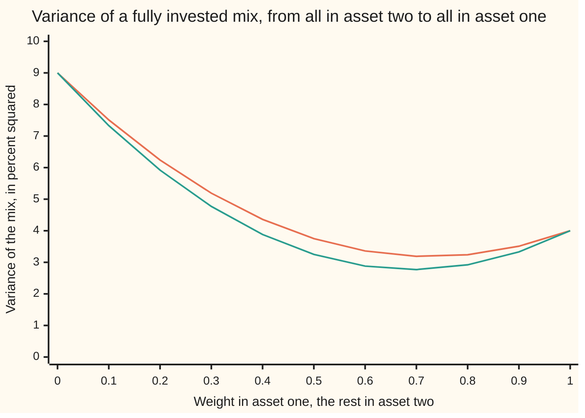
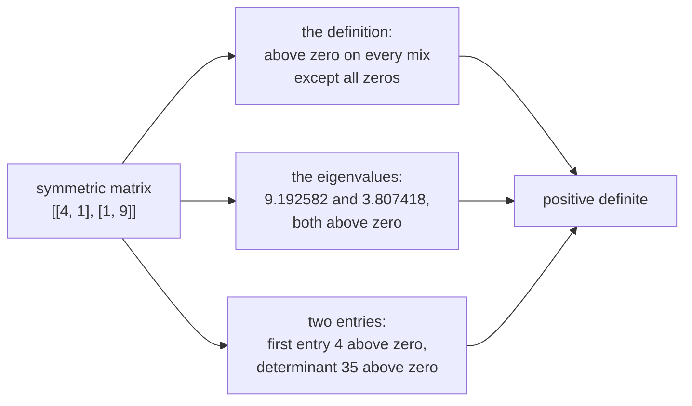

# Quadratic forms: x^T A x as the risk of a mix, and positive definite means every mix has positive risk

[Syllabus](../../../SYLLABUS.md) → [Algebra](../README.md) → [Eigenvalues and Symmetric Matrices](../README.md#s07) → Quadratic forms

---

## General Overview

Two assets, eight months of returns. Risk lives in the departures: how far a month's return fell from that asset's own average, in percentage points. Asset one departed by 2, 2, 2, 2, -2, -2, -2, -2; asset two by 5, 1, -1, -3, -5, -1, 1, 3.

Square the departures and average: that is the variance, 4 for asset one, 9 for asset two, in percent squared. Multiply each month's two departures and average: that is the covariance, 1 here, positive because the same-side months outweigh the opposite ones. Three numbers, one matrix: `[[4, 1], [1, 9]]`, row by row in square brackets.

Split the money half and half. The blended departures are 3.50, 1.50, 0.50, -0.50, -3.50, -1.50, -0.50 and 0.50, whose squares average to 3.750000 — under 4, under 9. At 8 parts to 3 it falls to 3.181818, the least any fully invested mix reaches. One arithmetic gave both: each weight squared times its variance, plus twice the weights multiplied times the covariance. That is a quadratic form.

Is any mix but holding nothing free of risk? Here, none: the pair is positive definite.

**A quadratic form turns a list of weights into one number, adding every square and every cross product; it is positive definite when that number stays above zero for every list but all zeros.**

**What kind of fact this is:** a definition — the form, and the words positive definite — plus one theorem, that three tests always agree, proved below in Why it works.

### The picture: what a mix costs



Two bowls, neither dipping to zero along this one line of mixes. Positive definite demands that of every mix, negative weights included. The upper line is this pair, covariance 1; the lower is the same variances with covariance zero. They meet at the ends, where all the money sits in one asset; in between, shared movement lifts the real curve. Its floor is 3.181818, between the plotted 3.19 and 3.24.

---

## The formula

A mix is a pair of weights, a vector in round brackets: (0.5, 0.5) is half and half. Written across the page rather than down it, they are transposed, marked with a raised T. The form multiplies the weights as a row, the matrix, then the weights as a column.

$$f(x) = x^T A x = a x_1^2 + 2 b x_1 x_2 + c x_2^2$$

**Read it aloud:** each weight squared times that asset's variance, plus twice the weights multiplied together times the covariance.

| Symbol | Plain meaning | In our example | Push it up and the answer… |
| --- | --- | --- | --- |
| $A$, $a$, $b$, $c$ | the symmetric matrix: first variance, covariance in both corners, second variance | `[[4, 1], [1, 9]]` | a bigger covariance lifts mixes whose weights share a sign |
| $x$, $x_1$, $x_2$, $x^T$, $f(x)$ | the mix, its weights, the weights as a row, and the number handed back | (0.5, 0.5) scores 3.750000 | doubling both weights quadruples the score |
| $\lambda_1$, $\lambda_2$, $y_1$, $y_2$ | the eigenvalues, and the mix along the matrix's own directions | 9.192582, 3.807418 | both above zero is positive definite |
| $w$ | the weight in asset one, the rest in asset two | 8/11, or 0.727273 | the variance falls to 3.181818, then climbs |

The determinant is the diagonal product minus the corner product, $a c - b^2$, here 35, and equals the eigenvalues multiplied. The trace is the diagonal sum, $a + c$, here 13, and equals them added. So the eigenvalues solve

$$\lambda^2 - 13 \lambda + 35 = 0,$$

giving 9.192582 and 3.807418. Forcing all the money in, the second weight being 1 minus the first, leaves one letter:

$$f(w) = 11 w^2 - 16 w + 9,$$

with 11 for $a - 2b + c$, -16 for $2b - 2c$, 9 for $c$.

### When it holds

- **The matrix is symmetric**, its corner entries equal, its entries and weights real. A lopsided matrix is invisible rather than wrong: the corners arrive added, so only their average is seen.
- **The variance reading** needs both assets over one period in one unit; last year's covariance describes last year.
- **The two-entry test is the 2 by 2 case.** The eigenvalue test decides at any size.

---

## Why it works

### Step 0: one list of weights, used twice

The form feeds the same weights in twice, as a row and as a column. Every matrix entry takes one weight from the left and one from the right, so every pair of assets meets once.

### Step 1: multiply it out, and watch the 2 appear

Matrix times column first: row one gives $a x_1 + b x_2$, row two $b x_1 + c x_2$. Dot it with the weights as a row:

$$x_1(a x_1 + b x_2) + x_2(b x_1 + c x_2) = a x_1^2 + b x_1 x_2 + b x_1 x_2 + c x_2^2.$$

The cross product arrives twice, once from each corner, and the copies add to $2 b x_1 x_2$. That 2 is the most-dropped piece of the formula. In numbers: 4 × 0.25 + 2 × 1 × 0.25 + 9 × 0.25 = 3.750000.

### Step 2: why this is the variance of a mix

Each month's blended departure is $x_1$ times the first plus $x_2$ times the second. Square and average over the eight months: the squares give $x_1^2$ times the first variance and $x_2^2$ times the second, the cross terms twice $x_1 x_2$ times the covariance. The form is not a model of a mix's variance; it is that variance written out.

### Step 3: the eigenvalue test, by measuring along the matrix's own directions

The [The spectral theorem](04-spectral-theorem.md) gives a symmetric matrix two perpendicular directions of its own, each one unit long, along which it only stretches, by an eigenvalue ([Eigenvalues and eigenvectors](02-eigenvalues-and-eigenvectors.md)). Measure the mix along them rather than asset by asset ([Change of basis](01-change-of-basis.md)), as readings $y_1$ and $y_2$. The cross term disappears:

$$f = \lambda_1 y_1^2 + \lambda_2 y_2^2.$$

Squares are never negative, so both eigenvalues above zero puts every mix but all zeros above zero. Backwards, an eigenvalue at or below zero leaves the score at zero or below along its own direction.

### Step 4: the two-entry test, by completing the square

Eigenvalues are work. For a 2 by 2, rewrite the form as a square plus a leftover, $a$ not zero:

$$a x_1^2 + 2 b x_1 x_2 + c x_2^2 = a \left( x_1 + \frac{b}{a} x_2 \right)^2 + \frac{a c - b^2}{a} x_2^2.$$

Each piece is a number times a square. If $a$ and the determinant are above zero, so are both multipliers, and the total vanishes only when both squares do: $x_2 = 0$, then $x_1 = 0$. Our 4 and 35 pass.



Three roads, one verdict: definition, eigenvalues, entries.

<details>
<summary>Detailed proof: why the three tests are one test</summary>

D: above zero on every mix but all zeros. E: both eigenvalues above zero. S: first entry and determinant above zero.

**E and D:** Step 3, forwards and backwards. **S gives D:** the completed square vanishes only at all zeros.

**D gives S:** the mix (1, 0) scores $a$ and $(-b/a, 1)$ scores $(a c - b^2)/a$; both above zero, so the determinant is too.

E and S agree through D. D and E argue alike at any size; S is the 2 by 2 case of a chain of top-left determinants, Sylvester's criterion.

</details>

<details>
<summary>The other rooms</summary>

- **Positive semidefinite:** an eigenvalue at zero, none below — never below zero, but exactly zero along one direction. Covariance matrices from data are at least this; flip every sign for negative semidefinite.
- **Negative definite:** both below zero: `[[-4, -1], [-1, -9]]` scores -3.750000 at half and half.
- **Indefinite:** one of each sign, a saddle: `[[1, 2], [2, 1]]` scores -2.000000 at (1, -1).

</details>

### Step 5: the calmest fully invested mix

No mix escapes risk, so which comes closest? Force the weights to add to 1 and complete the square:

$$11 w^2 - 16 w + 9 = 11 \left( w - \frac{8}{11} \right)^2 + \frac{35}{11}.$$

A square is never negative, so the score never falls below 35/11, which is 3.181818, and only $w = 8/11$, or 0.727273, reaches it: 8 parts to 3. A proof, not a search, though the code scans 10001 mixes and finds nothing lower. Calculus finds the same weight ([Hessian](../../06-Calculus%20and%20analysis/07-Several%20Variables/05-hessian-and-second-order-approximation.md)).

---

## Worked numbers, by hand

| Step | Arithmetic | Value |
| --- | --- | --- |
| half and half, two ways | 4 × 0.25 + 2 × 1 × 0.25 + 9 × 0.25, and the blended departures squared and averaged | **3.750000** |
| determinant, trace | 4 × 9 - 1 × 1, and 4 + 9 | 35, 13 |
| eigenvalues | roots of $\lambda^2 - 13 \lambda + 35 = 0$ | 9.192582, 3.807418 |
| the calmest mix, 8 parts to 3 | floor of 11 (w - 8/11) squared + 35/11 | **3.181818** at 0.727273 |

Each asset is riskier alone than the blend: 3.181818 against 4 and 9, and none reaches zero.

### What breaks if you drop a piece

Every wrong number is for the half-and-half mix, really 3.750000.

| Mistake | Comes out at | What went wrong |
| --- | --- | --- |
| Dropping the covariance | 3.250000 | Shared movement is part of the risk |
| Counting the cross term once | 3.500000 | The corner entry arrives from both sides |
| Minimising with no budget rule | 0.000000 | Holding nothing has no variance |

---

## Code, from first principles, and it actually runs

Nothing is imported. Two roads sharing no arithmetic reach a mix's variance: the matrix product, and the departures blended, squared and averaged. Two reach the top eigenvalue: the quadratic formula, and multiplying a pair by the matrix until the direction settles. The two definiteness tests are compared on four matrices.

### Python

```python
# Quadratic forms -- the check behind the card.  Nothing is imported.  Two assets,
# monthly returns in percentage points, variances 4 and 9 and covariance 1, so the
# matrix is [[4, 1], [1, 9]].  The variance of a mix is reached by two roads that
# share no arithmetic: the matrix product x^T A x, and the average of the squared
# departures of the blended eight-month table.  The top eigenvalue is reached twice
# too: by the quadratic formula on trace and determinant, and by repeated multiplying.
A = [[4.0, 1.0], [1.0, 9.0]]
INDEP = [[4.0, 0.0], [0.0, 9.0]]                  # the same variances, covariance dropped
B, NEG = [[1.0, 2.0], [2.0, 1.0]], [[-4.0, -1.0], [-1.0, -9.0]]   # two counter-examples
P = [2, 2, 2, 2, -2, -2, -2, -2]                  # asset one, departures from its average
R = [5, 1, -1, -3, -5, -1, 1, 3]                  # asset two, departures from its average
def dot(u, v): return u[0] * v[0] + u[1] * v[1]
def form(a, x): return dot(x, [dot(a[0], x), dot(a[1], x)])       # road one: x^T A x
def det(a): return a[0][0] * a[1][1] - a[0][1] * a[1][0]
def from_table(x):                                # road two: average squared departure
    return sum((x[0] * p + x[1] * r) ** 2 for p, r in zip(P, R)) / len(P)
def eigs(a):                                      # roots of lam^2 - trace lam + det
    tr, gap = a[0][0] + a[1][1], ((a[0][0] + a[1][1]) ** 2 - 4 * det(a)) ** 0.5
    return [(tr + gap) / 2, (tr - gap) / 2]
def top_by_multiplying(a, steps=60):              # second road to the top eigenvalue
    v = [1.0, 1.0]
    for _ in range(steps):
        v = [dot(a[0], v), dot(a[1], v)]
        v = [v[0] / max(abs(v[0]), abs(v[1])), v[1] / max(abs(v[0]), abs(v[1]))]
    return form(a, v) / dot(v, v)                 # the score per unit of squared length
def row(name, vals): print(f"{name:<23}" + "".join(f"{v:>7.2f}" for v in vals))
grid, lam, best = [i / 10 for i in range(11)], eigs(A), 8 / 11
scan = [form(A, [i / 10000, 1 - i / 10000]) for i in range(10001)]
low, argw = min(scan), scan.index(min(scan)) / 10000
q2, q1, q0 = A[0][0] - 2 * A[0][1] + A[1][1], 2 * A[0][1] - 2 * A[1][1], A[1][1]
print("matrix rows: (4, 1) and (1, 9), in percent squared")
print("asset one departures:" + "".join(f"{p:>4}" for p in P))
print("asset two departures:" + "".join(f"{r:>4}" for r in R))
print(f"from the table: variances {from_table([1, 0]):.6f} and {from_table([0, 1]):.6f}, covariance "
      f"{(from_table([1, 1]) - from_table([1, 0]) - from_table([0, 1])) / 2:.6f}")
print(f"half and half: matrix road {form(A, [0.5, 0.5]):.6f}, table road {from_table([0.5, 0.5]):.6f}")
row("blended half and half", [0.5 * p + 0.5 * r for p, r in zip(P, R)])
print(f"eigenvalues {lam[0]:.6f} and {lam[1]:.6f}, sum {lam[0] + lam[1]:.6f}, product {lam[0] * lam[1]:.6f}")
print(f"top eigenvalue by repeated multiplying {top_by_multiplying(A):.6f}, and for [[4, 0], [0, 9]] "
      f"{top_by_multiplying(INDEP):.6f}")
print(f"three tests: entry {A[0][0]:.6f} > 0, determinant {det(A):.6f} > 0, smaller eigenvalue {lam[1]:.6f} > 0")
print(f"fully invested coefficients: w^2 {q2:.6f}, w {q1:.6f}, constant {q0:.6f}")
print(f"best fully invested mix {best:.6f} and {1 - best:.6f}, in whole parts 8 to 3")
print(f"smallest variance: 35/11 is {35 / 11:.6f}, matrix road {form(A, [best, 1 - best]):.6f}, scan of "
      f"10001 mixes {low:.6f} at weight {argw:.6f}")
row("weight in asset one", grid)
row("variance, covariance 1", [form(A, [w, 1 - w]) for w in grid])
row("variance, covariance 0", [form(INDEP, [w, 1 - w]) for w in grid])
print(f"wrong: covariance dropped {form(INDEP, [0.5, 0.5]):.6f}, cross term counted once "
      f"{4 * 0.25 + 0.25 + 9 * 0.25:.6f}, hold nothing at all {form(A, [0.0, 0.0]):.6f}")
print(f"positive diagonal is not enough: [[1, 2], [2, 1]] eigenvalues {eigs(B)[0]:.6f} and {eigs(B)[1]:.6f}, "
      f"score at (1, -1) {form(B, [1.0, -1.0]):.6f}")
print(f"never zero is not enough: [[-4, -1], [-1, -9]] scores {form(NEG, [0.5, 0.5]):.6f} at half and half")
assert all(abs(from_table([w, 1 - w]) - form(A, [w, 1 - w])) < 1e-12 for w in grid)
assert abs(top_by_multiplying(A) - lam[0]) < 1e-9 and abs(top_by_multiplying(INDEP) - 9.0) < 1e-9
assert abs(low - 35 / 11) < 1e-7 and abs(argw - best) < 1e-3 and all(v >= 35 / 11 - 1e-12 for v in scan)
assert all((min(eigs(m)) > 0) == (m[0][0] > 0 and det(m) > 0) for m in (A, INDEP, B, NEG)) \
    and form(B, [1.0, -1.0]) == -2.0 and min(eigs(B)) < 0 < max(eigs(B)) and form(NEG, [0.5, 0.5]) < 0
print("ALL CHECKS PASS")
```

**Ran 2026-09-14 on macOS, Python 3.14.6, standard library only. All checks passed. Output, pasted from the run:**

```
matrix rows: (4, 1) and (1, 9), in percent squared
asset one departures:   2   2   2   2  -2  -2  -2  -2
asset two departures:   5   1  -1  -3  -5  -1   1   3
from the table: variances 4.000000 and 9.000000, covariance 1.000000
half and half: matrix road 3.750000, table road 3.750000
blended half and half     3.50   1.50   0.50  -0.50  -3.50  -1.50  -0.50   0.50
eigenvalues 9.192582 and 3.807418, sum 13.000000, product 35.000000
top eigenvalue by repeated multiplying 9.192582, and for [[4, 0], [0, 9]] 9.000000
three tests: entry 4.000000 > 0, determinant 35.000000 > 0, smaller eigenvalue 3.807418 > 0
fully invested coefficients: w^2 11.000000, w -16.000000, constant 9.000000
best fully invested mix 0.727273 and 0.272727, in whole parts 8 to 3
smallest variance: 35/11 is 3.181818, matrix road 3.181818, scan of 10001 mixes 3.181818 at weight 0.727300
weight in asset one       0.00   0.10   0.20   0.30   0.40   0.50   0.60   0.70   0.80   0.90   1.00
variance, covariance 1    9.00   7.51   6.24   5.19   4.36   3.75   3.36   3.19   3.24   3.51   4.00
variance, covariance 0    9.00   7.33   5.92   4.77   3.88   3.25   2.88   2.77   2.92   3.33   4.00
wrong: covariance dropped 3.250000, cross term counted once 3.500000, hold nothing at all 0.000000
positive diagonal is not enough: [[1, 2], [2, 1]] eigenvalues 3.000000 and -1.000000, score at (1, -1) -2.000000
never zero is not enough: [[-4, -1], [-1, -9]] scores -3.750000 at half and half
ALL CHECKS PASS
```

### Rust

Same numbers, same labels, built with `rustc --edition 2021 -O`.

```rust
// Quadratic forms -- the same check as the Python, in Rust.  No crates.  Two assets,
// monthly returns in percentage points, variances 4 and 9 and covariance 1, so the
// matrix is [[4, 1], [1, 9]].  The variance of a mix is reached by two roads that share
// no arithmetic: the matrix product x^T A x, and the average of the squared departures
// of the blended table.  The top eigenvalue is reached twice too: the quadratic formula
// on trace and determinant, then repeated multiplying.
type Mat = [[f64; 2]; 2];
const A: Mat = [[4.0, 1.0], [1.0, 9.0]];
const INDEP: Mat = [[4.0, 0.0], [0.0, 9.0]];      // the same variances, covariance dropped
const B: Mat = [[1.0, 2.0], [2.0, 1.0]];          // positive diagonal, not positive definite
const NEG: Mat = [[-4.0, -1.0], [-1.0, -9.0]];    // never zero off the origin, always negative
const P: [i64; 8] = [2, 2, 2, 2, -2, -2, -2, -2]; // asset one, departures from its average
const R: [i64; 8] = [5, 1, -1, -3, -5, -1, 1, 3]; // asset two, departures from its average
fn dot(u: [f64; 2], v: [f64; 2]) -> f64 { u[0] * v[0] + u[1] * v[1] }
fn form(a: Mat, x: [f64; 2]) -> f64 { dot(x, [dot(a[0], x), dot(a[1], x)]) }   // road one
fn det(a: Mat) -> f64 { a[0][0] * a[1][1] - a[0][1] * a[1][0] }
fn from_table(x: [f64; 2]) -> f64 {               // road two: average squared departure
    let mut total = 0.0;
    for i in 0..P.len() { let d = x[0] * P[i] as f64 + x[1] * R[i] as f64; total += d * d; }
    total / P.len() as f64
}
fn eigs(a: Mat) -> [f64; 2] {                     // roots of lam^2 - trace lam + det
    let tr = a[0][0] + a[1][1];
    let gap = (tr * tr - 4.0 * det(a)).sqrt();
    [(tr + gap) / 2.0, (tr - gap) / 2.0]
}
fn top_by_multiplying(a: Mat, steps: usize) -> f64 {   // second road to the top eigenvalue
    let mut v = [1.0, 1.0];
    for _ in 0..steps {
        v = [dot(a[0], v), dot(a[1], v)];
        v = [v[0] / v[0].abs().max(v[1].abs()), v[1] / v[0].abs().max(v[1].abs())];
    }
    form(a, v) / dot(v, v)                        // the score per unit of squared length
}
fn row(name: &str, vals: &[f64]) {
    let mut line = format!("{:<23}", name);
    for v in vals { line.push_str(&format!("{:>7.2}", v)); }
    println!("{}", line);
}
fn ints(name: &str, vals: [i64; 8]) {
    let mut line = String::from(name);
    for v in vals { line.push_str(&format!("{:>4}", v)); }
    println!("{}", line);
}
fn main() {
    let (grid, lam, best) = ((0..=10).map(|i| i as f64 / 10.0).collect::<Vec<f64>>(), eigs(A), 8.0 / 11.0);
    let scan: Vec<f64> = (0..=10000).map(|i| form(A, [i as f64 / 10000.0, 1.0 - i as f64 / 10000.0])).collect();
    let (mut low, mut argw) = (scan[0], 0.0);
    for i in 0..scan.len() { if scan[i] < low { low = scan[i]; argw = i as f64 / 10000.0; } }
    let (q2, q1, q0) = (A[0][0] - 2.0 * A[0][1] + A[1][1], 2.0 * A[0][1] - 2.0 * A[1][1], A[1][1]);
    println!("matrix rows: (4, 1) and (1, 9), in percent squared");
    ints("asset one departures:", P);   ints("asset two departures:", R);
    println!("from the table: variances {:.6} and {:.6}, covariance {:.6}", from_table([1.0, 0.0]),
             from_table([0.0, 1.0]), (from_table([1.0, 1.0]) - from_table([1.0, 0.0]) - from_table([0.0, 1.0])) / 2.0);
    println!("half and half: matrix road {:.6}, table road {:.6}", form(A, [0.5, 0.5]), from_table([0.5, 0.5]));
    row("blended half and half", &(0..8).map(|i| 0.5 * P[i] as f64 + 0.5 * R[i] as f64).collect::<Vec<f64>>());
    println!("eigenvalues {:.6} and {:.6}, sum {:.6}, product {:.6}", lam[0], lam[1], lam[0] + lam[1], lam[0] * lam[1]);
    println!("top eigenvalue by repeated multiplying {:.6}, and for [[4, 0], [0, 9]] {:.6}",
             top_by_multiplying(A, 60), top_by_multiplying(INDEP, 60));
    println!("three tests: entry {:.6} > 0, determinant {:.6} > 0, smaller eigenvalue {:.6} > 0", A[0][0], det(A), lam[1]);
    println!("fully invested coefficients: w^2 {:.6}, w {:.6}, constant {:.6}", q2, q1, q0);
    println!("best fully invested mix {:.6} and {:.6}, in whole parts 8 to 3", best, 1.0 - best);
    println!("smallest variance: 35/11 is {:.6}, matrix road {:.6}, scan of 10001 mixes {:.6} at weight {:.6}",
             35.0 / 11.0, form(A, [best, 1.0 - best]), low, argw);
    row("weight in asset one", &grid);
    row("variance, covariance 1", &grid.iter().map(|&w| form(A, [w, 1.0 - w])).collect::<Vec<f64>>());
    row("variance, covariance 0", &grid.iter().map(|&w| form(INDEP, [w, 1.0 - w])).collect::<Vec<f64>>());
    println!("wrong: covariance dropped {:.6}, cross term counted once {:.6}, hold nothing at all {:.6}",
             form(INDEP, [0.5, 0.5]), 4.0 * 0.25 + 0.25 + 9.0 * 0.25, form(A, [0.0, 0.0]));
    println!("positive diagonal is not enough: [[1, 2], [2, 1]] eigenvalues {:.6} and {:.6}, score at (1, -1) {:.6}",
             eigs(B)[0], eigs(B)[1], form(B, [1.0, -1.0]));
    println!("never zero is not enough: [[-4, -1], [-1, -9]] scores {:.6} at half and half", form(NEG, [0.5, 0.5]));
    assert!(grid.iter().all(|&w| (from_table([w, 1.0 - w]) - form(A, [w, 1.0 - w])).abs() < 1e-12));
    assert!((top_by_multiplying(A, 60) - lam[0]).abs() < 1e-9 && (top_by_multiplying(INDEP, 60) - 9.0).abs() < 1e-9);
    assert!((low - 35.0 / 11.0).abs() < 1e-7 && (argw - best).abs() < 1e-3
            && scan.iter().all(|&v| v >= 35.0 / 11.0 - 1e-12));
    assert!([A, INDEP, B, NEG].iter().all(|&m| (eigs(m)[1] > 0.0) == (m[0][0] > 0.0 && det(m) > 0.0))
            && form(B, [1.0, -1.0]) == -2.0 && eigs(B)[1] < 0.0 && eigs(B)[0] > 0.0 && form(NEG, [0.5, 0.5]) < 0.0);
    println!("ALL CHECKS PASS");
}
```

**Ran 2026-09-14 on macOS, rustc 1.98.1, no crates. All checks passed. Output, pasted from the run:**

```
matrix rows: (4, 1) and (1, 9), in percent squared
asset one departures:   2   2   2   2  -2  -2  -2  -2
asset two departures:   5   1  -1  -3  -5  -1   1   3
from the table: variances 4.000000 and 9.000000, covariance 1.000000
half and half: matrix road 3.750000, table road 3.750000
blended half and half     3.50   1.50   0.50  -0.50  -3.50  -1.50  -0.50   0.50
eigenvalues 9.192582 and 3.807418, sum 13.000000, product 35.000000
top eigenvalue by repeated multiplying 9.192582, and for [[4, 0], [0, 9]] 9.000000
three tests: entry 4.000000 > 0, determinant 35.000000 > 0, smaller eigenvalue 3.807418 > 0
fully invested coefficients: w^2 11.000000, w -16.000000, constant 9.000000
best fully invested mix 0.727273 and 0.272727, in whole parts 8 to 3
smallest variance: 35/11 is 3.181818, matrix road 3.181818, scan of 10001 mixes 3.181818 at weight 0.727300
weight in asset one       0.00   0.10   0.20   0.30   0.40   0.50   0.60   0.70   0.80   0.90   1.00
variance, covariance 1    9.00   7.51   6.24   5.19   4.36   3.75   3.36   3.19   3.24   3.51   4.00
variance, covariance 0    9.00   7.33   5.92   4.77   3.88   3.25   2.88   2.77   2.92   3.33   4.00
wrong: covariance dropped 3.250000, cross term counted once 3.500000, hold nothing at all 0.000000
positive diagonal is not enough: [[1, 2], [2, 1]] eigenvalues 3.000000 and -1.000000, score at (1, -1) -2.000000
never zero is not enough: [[-4, -1], [-1, -9]] scores -3.750000 at half and half
ALL CHECKS PASS
```

The two outputs match line for line.

> [!TIP]
> **Try changing**
> Guess first. An assert stops the program when a number comes out wrong; these are pinned to this pair.
> - **Raise the covariance to 3.** Set `A` to `[[4.0, 3.0], [3.0, 9.0]]`. Does mixing still help? Half and half rises to 4.750000, the calmest mix to 3.857143 — under asset one's 4, barely. The table now disagrees with the matrix, so the first assert fires.
> - **Raise it to 6.** The determinant becomes zero, the smaller eigenvalue prints as 0.000000, and the mix (3, -2) scores zero: semidefinite, not definite.
> - **Flip every sign.** Set `A` to `[[-4.0, -1.0], [-1.0, -9.0]]`. Half and half prints -3.750000, though the score never hits zero.

---

## The usual mistake

> [!warning]
> **Reading the entries and calling the matrix positive definite.** Every entry of `[[1, 2], [2, 1]]` is above zero, its eigenvalues are 3.000000 and -1.000000, and the mix (1, -1) scores -2.000000. The test asks about every mix, negative weights included.
>
> - **Trusting the determinant alone.** `[[-4, -1], [-1, -9]]` has determinant 35, and is negative on every mix.
> - **Reading "never zero" as positive definite.** A negative definite matrix never hits zero either.
> - **Mixing up the units.** These are variances, in percent squared, not percentages.

---

## Where you meet it in real life

- **Portfolio risk.** A fund's variance is a quadratic form in its weights; its covariance matrix must be semidefinite at least, or the arithmetic returns a negative variance.
- **The bottom of a hill.** The second derivatives of a smooth function make a quadratic form; positive definite at a flat point means a minimum, not a saddle: [Hessian](../../06-Calculus%20and%20analysis/07-Several%20Variables/05-hessian-and-second-order-approximation.md).

> **Say it back**
> A quadratic form feeds one list of weights into a symmetric matrix from both sides and hands back one number: each weight squared times its own entry, plus twice each pair of weights times the entry they share. For variances 4 and 9 and covariance 1 it is the mix's variance, 3.750000 for half and half. Positive definite means it stays above zero for every mix but all zeros, and three tests agree: the score, the two eigenvalues, the first entry with the determinant. Completing the square finds the calmest mix, 8 parts to 3, at 3.181818.

---

## What this builds on

- [The spectral theorem](04-spectral-theorem.md): perpendicular directions with a stretch along each, turning the form into two squares.
- [Percentages](../../01-Foundations/01-Everyday%20Arithmetic/10-percentages.md): weights as fractions, scores in percent squared.

## Where this goes next

- [Hessian](../../06-Calculus%20and%20analysis/07-Several%20Variables/05-hessian-and-second-order-approximation.md): second derivatives.
- [Normal modes](../../08-Differential%20equations%20and%20dynamics/04-Systems%20and%20the%20Matrix%20Exponential/07-coupled-oscillators-and-normal-modes.md): vibration modes.
- [Bivariate normal](../../09-Probability%20and%20statistics/05-Transformations%20and%20Joint%20Laws/05-bivariate-normal-and-conditioning.md): bell shapes.
- [Correlated paths](../../12-Financial%20mathematics/06-Numerical%20Methods%20for%20Pricing/04-correlated-paths-and-cholesky.md): linked returns.
- Stability of a state-space model: falling energy.
- Convex functions: convexity.
- Convergence rates: eigenvalue spread.
- Semidefinite programs: optimising over them.
- Cholesky: the fastest test.
- Iterating instead of factoring: solving downhill.
- Elliptic, parabolic, hyperbolic: naming equations.
- Point types: bowl, dome, saddle.
- Riemannian metric: measuring length.
- Covariance matrices: their own space.

This card leaves open where the matrix comes from when a surface is measured rather than a mix: second derivatives, a later card's business.

---

## Sources

Verified 14 Sep 2026: every link below resolves to the publisher's or author's page.

- Boyd, Stephen, and Lieven Vandenberghe. *Convex Optimization*. Cambridge University Press, 2004. [Book page](https://web.stanford.edu/~boyd/cvxbook/). Quadratic objectives, minimum-variance mixes.
- Axler, Sheldon. *Linear Algebra Done Right*, 4th edition. Springer. [Open-access page](https://linear.axler.net/). Positive operators and the spectral theorem.
- Strang, Gilbert. *Introduction to Linear Algebra*. Wellesley-Cambridge Press. [Book page](https://math.mit.edu/~gs/linearalgebra/). The two-entry test, the completed square.
