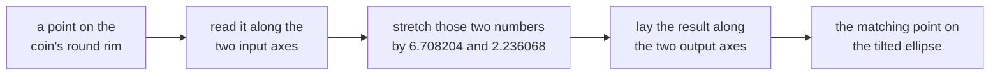

# The singular value decomposition: every matrix is rotate, stretch the axes, rotate, and the stretch factors are the singular values

[Syllabus](../../../SYLLABUS.md) → [Algebra](../../../SYLLABUS.md#w03) → [Eigenvalues and Symmetric Matrices](../../../SYLLABUS.md#w03-s07) → The singular value decomposition

---

## General Overview

A game draws a round sprite, a coin one unit in radius, and hands every point to the matrix `[[3, 0], [4, 5]]`: (east, north) comes back as (3 east, 4 east + 5 north). The rim was a circle; it returns a tilted ellipse.

By how much did the coin stretch? No single entry says, since the 4 spills east into north. The rim's longest radius comes to 6.708204 and its shortest to 2.236068, at right angles.

Every matrix with real entries does its job in three moves: swing the input onto two perpendicular directions that suit it, stretch along each by a fixed non-negative factor, swing the result onto two perpendicular output directions. A move that keeps lengths and angles is called an **orthogonal matrix**: a turn, perhaps with a mirror flip.

**Every matrix is an orthogonal move, a stretch along perpendicular axes, and a second orthogonal move; the stretch factors are the singular values.**

**What kind of fact this is:** a theorem, proved on this card in Why it works.

### The picture: three moves



Sizes change in the middle box only.

---

## The formula

For every matrix $A$ with real entries:

$$A = U S V^T$$

**Read it aloud:** read the input along one set of perpendicular axes, stretch each number by its factor, lay the result along another set.

| Symbol | Plain meaning | In our example | Push it up and the answer… |
| --- | --- | --- | --- |
| $A$ | the matrix, read as a map | `[[3, 0], [4, 5]]` | every factor moves with it |
| $V$, $v_1$, $v_2$, or $v_i$ for either | input axes: perpendicular columns of $V$, length 1 each; $V^T$ swaps rows and columns, reporting coordinates along them | (0.707107, 0.707107) and (0.707107, −0.707107) | — |
| $S$, $\sigma_1$, $\sigma_2$, or $\sigma_i$ for either | the stretch matrix: the **singular values**, said "sigma", down its diagonal, largest first, never negative | diagonal 6.708204 and 2.236068 | that half-axis lengthens |
| $U$, $u_1$, $u_2$ | output axes: perpendicular columns of $U$, length 1 each | (0.316228, 0.948683) and (0.948683, −0.316228) | — |
| $G$, $\lambda_1$, $\lambda_2$, or $\lambda_i$ for either | shorthand for $A^T A$, symmetric, with its eigenvalues, said "lambda": the squared factors | `[[25, 20], [20, 25]]`, 45 and 5 | — |
| $r$ | the rank: factors above zero | 2 | more directions survive |

The factors are square roots of $G$'s eigenvalues:

$$\sigma_i = \sqrt{\lambda_i}$$

Each output axis, one for each factor above zero, is its input axis's image scaled to length 1:

$$u_i = \frac{A v_i}{\sigma_i}$$

### When it holds

- **Real entries, any number of rows and columns.** Nothing else is required: rectangular and flattening matrices included. Complex entries have their own version.
- **Lengths by the dot product, one unit system throughout.** Rescale a coordinate and the factors change, so "large" and "small" wait on the units.
- **Two sets of axes, not one.** Demand a single set for both sides and most matrices refuse; that stricter demand is [Diagonalisation](03-diagonalisation-and-matrix-powers.md).
- **The factors are unique, the axes are not.** Reverse a matched pair $v_1$ and $u_1$ and the same matrix returns. Building $G$ by hand suits small cases only: forming $A^T A$ doubles the digits rounding eats.

---

## Why it works

### Step 0: ask about length, not direction

Eigenvectors answer "which inputs come back pointing the same way" ([Eigenvalues and eigenvectors](02-eigenvalues-and-eigenvectors.md)). For a matrix that is not symmetric there may be too few, and nothing makes them perpendicular: the sprite's eigenvalues are 5.000000 and 3.000000, neither the 6.708204 the rim reached.

Ask about length instead. Of all inputs of length 1, which comes out longest? Squared length makes that a dot product:

$$|A x|^2 = (A x) \cdot (A x) = x^T A^T A x = x^T G x$$

x is any input, $x^T$ that input as a row, $|A x|$ its output's length, $G$ shorthand for $A^T A$. $G$ is symmetric, and $x^T G x$ is a squared length, never negative ([Quadratic forms](05-quadratic-forms-and-positive-definite.md)).

### Step 1: the spectral theorem hands over the input axes

A symmetric matrix has a full set of perpendicular unit eigenvectors with real eigenvalues ([The spectral theorem](04-spectral-theorem.md)). Call $G$'s pair $v_1$ and $v_2$, eigenvalues $\lambda_1$ and $\lambda_2$, largest first: the input axes, and $A$ was never asked to be symmetric or square.

Feed one in: $G v_i$ is $\lambda_i$ times $v_i$, and $v_i$ has length 1, so

$$|A v_i|^2 = v_i^T G v_i = \lambda_i$$

The output length is the square root of $\lambda_i$, and that is where the formula's square root comes from. For the sprite $G$ is `[[25, 20], [20, 25]]`, its eigenvalues 45 and 5, the stretches 6.708204 and 2.236068.

```
Stretch factors against the matrix's own eigenvalues, one bar step = 0.25 of a multiplier

longest stretch            ███████████████████████████  6.708204
shortest stretch           █████████                    2.236068
larger eigenvalue of A     ████████████████████         5.000000
smaller eigenvalue of A    ████████████                 3.000000
```

The top two bars are the half-axes; the bottom two answer another question.

### Step 2: the output axes come out perpendicular

Compare the two outputs with a dot product. $G v_2$ is $\lambda_2$ times $v_2$, and the axes are perpendicular:

$$(A v_1) \cdot (A v_2) = v_1^T G v_2 = \lambda_2 (v_1 \cdot v_2) = 0$$

Perpendicular in, perpendicular out. Each output is $\sigma_i$ long, so dividing by that length leaves perpendicular unit vectors with $A v_i = \sigma_i u_i$. For the sprite $A v_1$ is (2.121320, 6.363961), which over 6.708204 is $u_1$, (0.316228, 0.948683).

### Step 3: rebuild any input

Any input x is the sum of its pieces along the input axes:

$$x = (x \cdot v_1) v_1 + (x \cdot v_2) v_2$$

Apply the matrix piece by piece, using $A v_i = \sigma_i u_i$:

$$A x = \sigma_1 (x \cdot v_1) u_1 + \sigma_2 (x \cdot v_2) u_2$$

Three jobs in turn: collecting $x \cdot v_1$ and $x \cdot v_2$ is $V^T x$, multiplying each by its factor is $S$, laying the results along $u_1$ and $u_2$ is $U$. True for every input, so the matrices are equal: $A = U S V^T$. The code rebuilds `[[3, 0], [4, 5]]` exactly.

<details>
<summary>Detailed proof, for any number of rows and columns</summary>

Let $A$ have real entries, any shape, with n columns. $G = A^T A$ is square and symmetric, so the spectral theorem gives perpendicular unit eigenvectors $v_1, \ldots, v_n$ with eigenvalues $\lambda_1 \ge \ldots \ge \lambda_n$, none negative since Step 1 makes $\lambda_k = |A v_k|^2$. Let $r$ count those above zero. For k up to $r$, set $\sigma_k = \sqrt{\lambda_k}$ and $u_k = A v_k / \sigma_k$, perpendicular unit vectors by Step 2; above $r$ the length is zero, so that axis is flattened. Extend $u_1, \ldots, u_r$ to a full perpendicular unit set, the extras meeting zeros in $S$. Then $x = (x \cdot v_1) v_1 + \ldots + (x \cdot v_n) v_n$ gives $A x = \sigma_1 (x \cdot v_1) u_1 + \ldots + \sigma_r (x \cdot v_r) u_r$, which is $U S V^T x$, and matrices agreeing on every input are equal. Repeated eigenvalues leave the axes unfixed, the factors fixed.

</details>

### Step 4: two readings the factors hand over

An orthogonal move cannot change area except to mirror it, so its determinant is 1 or −1. For a square matrix:

$$|\det A| = \sigma_1 \sigma_2$$

Here 6.708204 times 2.236068 is 15.000000, and so is 3 × 5 − 0 × 4 from the entries: the ellipse covers 15.000000 times the coin's area.

Second, the reading that matters for solving systems: the count of factors above zero is the rank, an axis with a zero factor being a direction the matrix flattens ([Rank and nullity](../05-Solving%20Systems/05-rank-nullity.md)). The sprite has rank 2; a rectangular matrix, with no determinant to compare, reads the same way. The same non-zero factors come from $A A^T$, smaller when $A$ is wide.

---

## Worked numbers, by hand

| Step | Arithmetic | Value |
| --- | --- | --- |
| build $G = A^T A$ | dot A's columns together | `[[25, 20], [20, 25]]` |
| its characteristic equation | (25 − λ)(25 − λ) − 20 × 20 = 0 | λ = 45 and 5 |
| the singular values | square roots of 45 and 5 | **6.708204 and 2.236068** |
| the input axes | (20, 45 − 25) and (20, 5 − 25), scaled to length 1 | (0.707107, 0.707107) and (0.707107, −0.707107) |
| their images | A times each axis | (2.121320, 6.363961) and (2.121320, −0.707107) |
| the output axes | each image over its factor | (0.316228, 0.948683) and (0.948683, −0.316228) |
| rebuild the matrix | U S V transpose, multiplied | **`[[3, 0], [4, 5]]`** |
| the area factor | 6.708204 × 2.236068 | **15.000000**, as is det A |
| the rank | factors above zero | **2** |

The rim is an ellipse: longest radius 6.708204 along (0.316228, 0.948683), shortest 2.236068.

### What breaks if you drop a piece

| Mistake | Comes out at | What went wrong |
| --- | --- | --- |
| The matrix's own eigenvalues read as half-axes | 5.000000 and 3.000000 | A is not symmetric, so those directions are not perpendicular, not the ellipse's axes |
| G's eigenvalues used without square roots | product 225.000000, not 15.000000 | 45 and 5 are squared stretches |

---

## Code, from first principles, and it actually runs

The factors are reached twice, once by algebra and once by measurement. Road one is the hand method: build $G = A^T A$, solve its characteristic quadratic, take square roots, read off the axes. Road two measures instead, walking 100002 directions and keeping the longest and shortest outputs. Four assertions pin the product against the determinant, the factors against the entries, and the rebuild against the matrix. A second matrix, `[[1, 2], [2, 4]]`, has factors 5.000000 and 0.000000: rank 1, flattening (0.894427, −0.447214) to the zero vector.

### Python

```python
# Singular value decomposition -- the check behind the card.  Nothing is imported.  The
# sprite transform A = [[3, 0], [4, 5]] turns the unit circle into an ellipse.  Road one:
# the stretch factors from the eigenvalues of G = A^T A; road two: measure every direction.
def dot(u, v): return u[0] * v[0] + u[1] * v[1]
def mv(a, v): return [dot(a[0], v), dot(a[1], v)]
def tp(a): return [[a[0][0], a[1][0]], [a[0][1], a[1][1]]]
def mm(a, b): return [[dot(r, c) for c in tp(b)] for r in a]
def det(a): return a[0][0] * a[1][1] - a[0][1] * a[1][0]
def unit(w): n = dot(w, w) ** 0.5; return [w[0] / n, w[1] / n]
def drift(a, b): return max(abs(a[i][j] - b[i][j]) for i in (0, 1) for j in (0, 1))
def f6(v): return "(" + ", ".join(f"{0.0 if abs(x) < 5e-7 else x:.6f}" for x in v) + ")"
def eig2(a):                                      # both roots of the characteristic quadratic
    mid = (a[0][0] + a[1][1]) / 2; gap = (mid * mid - det(a)) ** 0.5
    return [mid + gap, mid - gap]
def svd(a):                                       # road one: the eigen-pairs of G = A^T A
    g = mm(tp(a), a); lam = eig2(g); sig = [x ** 0.5 for x in lam]
    vs = [unit([g[0][1], L - g[0][0]]) for L in lam]          # solves (G - L I)v = 0 by hand
    us = [[x / s for x in mv(a, v)] if s > 1e-12 else [] for s, v in zip(sig, vs)]
    us = [u if u else [-us[0][1], us[0][0]] for u in us]      # a flattened axis: complete the pair
    return g, lam, sig, vs, us
def sweep(a, n):                                  # road two: the stretch in every direction
    hi, lo, hdir, seen = -1.0, 1e18, [0.0, 0.0], 0
    for k in range(n + 1):
        t = k / n; den = 1 + t * t                # (1 - t*t, 2t)/den has length 1 for every t
        for s in (1.0, -1.0):                     # a half turn is enough: -v stretches like v
            v = [(1 - t * t) / den, s * 2 * t / den]; w = mv(a, v); L = dot(w, w); seen += 1
            if L > hi: hi, hdir = L, v
            if L < lo: lo = L
    return hi ** 0.5, lo ** 0.5, hdir, seen
A, B, EYE = [[3.0, 0.0], [4.0, 5.0]], [[1.0, 2.0], [2.0, 4.0]], [[1.0, 0.0], [0.0, 1.0]]
G, lam, sig, vs, us = svd(A)
U, V, S = tp(us), tp(vs), [[sig[0], 0.0], [0.0, sig[1]]]
rebuilt = mm(mm(U, S), tp(V)); hi, lo, hdir, seen = sweep(A, 50000)
squares = sum(x * x for row in A for x in row); cols = [dot(c, c) ** 0.5 for c in tp(A)]
rank = sum(1 for s in sig if s > 1e-12)
GB, lamB, sigB, vsB, usB = svd(B); rankB = sum(1 for s in sigB if s > 1e-12)
print(f"sprite A rows: {f6(A[0])}; {f6(A[1])}; det A {det(A):.6f}")
print(f"G = A^T A rows: {f6(G[0])}; {f6(G[1])}")
print(f"eigenvalues of G: {f6(lam)}; singular values, their square roots: {f6(sig)}")
print(f"input axes v1, v2: {f6(vs[0])}; {f6(vs[1])}")
print(f"images A v1, A v2: {f6(mv(A, vs[0]))}; {f6(mv(A, vs[1]))}")
print(f"output axes u1, u2: {f6(us[0])}; {f6(us[1])}")
print(f"road two, longest and shortest stretch over {seen} directions: {f6([hi, lo])}, "
      f"longest along ({hdir[0]:.4f}, {hdir[1]:.4f})")
print(f"U S V^T rows: {f6(rebuilt[0])}; {f6(rebuilt[1])}; largest drift from perpendicular "
      f"unit axes, U then V: {drift(mm(tp(U), U), EYE):.6f}, {drift(mm(tp(V), V), EYE):.6f}")
print(f"product of singular values {sig[0] * sig[1]:.6f}; absolute determinant {abs(det(A)):.6f}")
print(f"eigenvalues added {lam[0] + lam[1]:.6f}; squares of A's entries added {squares:.6f}")
print(f"nonzero singular values, the rank: {rank}")
print(f"A's own eigenvalues, not the stretches: {f6(eig2(A))}; A's column lengths: {f6(cols)}")
print(f"eigenvalues left unrooted, product {lam[0] * lam[1]:.6f}, "
      f"not the area factor {sig[0] * sig[1]:.6f}")
print(f"flat matrix B rows: {f6(B[0])}; {f6(B[1])}; det B {det(B):.6f}; "
      f"singular values {f6(sigB)}; rank {rankB}")
print(f"B kills its second input axis {f6(vsB[1])}: image {f6(mv(B, vsB[1]))}")
assert abs(hi - sig[0]) < 1e-6 and abs(lo - sig[1]) < 1e-6      # two roads, same stretches
assert abs(sig[0] * sig[1] - abs(det(A))) < 1e-12 and abs(lam[0] + lam[1] - squares) < 1e-12
assert drift(rebuilt, A) < 1e-12 and drift(mm(tp(U), U), EYE) < 1e-12 and drift(mm(tp(V), V), EYE) < 1e-12
assert abs(sigB[0] - 5.0) < 1e-12 and dot(mv(B, vsB[1]), mv(B, vsB[1])) < 1e-24 and (rank, rankB) == (2, 1)
print("ALL CHECKS PASS")
```

**Ran 2026-09-14 on macOS, Python 3.14.6, standard library only. All checks passed. Output, pasted from the run:**

```
sprite A rows: (3.000000, 0.000000); (4.000000, 5.000000); det A 15.000000
G = A^T A rows: (25.000000, 20.000000); (20.000000, 25.000000)
eigenvalues of G: (45.000000, 5.000000); singular values, their square roots: (6.708204, 2.236068)
input axes v1, v2: (0.707107, 0.707107); (0.707107, -0.707107)
images A v1, A v2: (2.121320, 6.363961); (2.121320, -0.707107)
output axes u1, u2: (0.316228, 0.948683); (0.948683, -0.316228)
road two, longest and shortest stretch over 100002 directions: (6.708204, 2.236068), longest along (0.7071, 0.7071)
U S V^T rows: (3.000000, 0.000000); (4.000000, 5.000000); largest drift from perpendicular unit axes, U then V: 0.000000, 0.000000
product of singular values 15.000000; absolute determinant 15.000000
eigenvalues added 50.000000; squares of A's entries added 50.000000
nonzero singular values, the rank: 2
A's own eigenvalues, not the stretches: (5.000000, 3.000000); A's column lengths: (5.000000, 5.000000)
eigenvalues left unrooted, product 225.000000, not the area factor 15.000000
flat matrix B rows: (1.000000, 2.000000); (2.000000, 4.000000); det B 0.000000; singular values (5.000000, 0.000000); rank 1
B kills its second input axis (0.894427, -0.447214): image (0.000000, 0.000000)
ALL CHECKS PASS
```

### Rust

Same numbers, same labels, built with `rustc --edition 2021 -O`.

```rust
// Singular value decomposition -- the same check as the Python, in Rust.  No crates.  The
// sprite transform A = [[3, 0], [4, 5]] turns the unit circle into an ellipse.  Road one:
// the stretch factors from the eigenvalues of G = A^T A; road two: measure every direction.
type Mat = [[f64; 2]; 2];
fn dot(u: [f64; 2], v: [f64; 2]) -> f64 { u[0] * v[0] + u[1] * v[1] }
fn mv(a: Mat, v: [f64; 2]) -> [f64; 2] { [dot(a[0], v), dot(a[1], v)] }
fn tp(a: Mat) -> Mat { [[a[0][0], a[1][0]], [a[0][1], a[1][1]]] }
fn mm(a: Mat, b: Mat) -> Mat { let t = tp(b); a.map(|r| [dot(r, t[0]), dot(r, t[1])]) }
fn det(a: Mat) -> f64 { a[0][0] * a[1][1] - a[0][1] * a[1][0] }
fn unit(w: [f64; 2]) -> [f64; 2] { let n = dot(w, w).sqrt(); [w[0] / n, w[1] / n] }
fn drift(a: Mat, b: Mat) -> f64 {                    // largest entry-by-entry gap
    let d = |i: usize, j: usize| (a[i][j] - b[i][j]).abs();
    d(0, 0).max(d(0, 1)).max(d(1, 0)).max(d(1, 1))
}
fn f6(v: [f64; 2]) -> String {                       // two numbers, six decimals, no minus zero
    let v = v.map(|x| if x.abs() < 5e-7 { 0.0 } else { x }); format!("({:.6}, {:.6})", v[0], v[1])
}
fn eig2(a: Mat) -> [f64; 2] {                        // both roots of the characteristic quadratic
    let mid = (a[0][0] + a[1][1]) / 2.0; let gap = (mid * mid - det(a)).sqrt();
    [mid + gap, mid - gap]
}
fn svd(a: Mat) -> (Mat, [f64; 2], [f64; 2], Mat, Mat) {   // road one: eigen-pairs of G = A^T A
    let g = mm(tp(a), a); let lam = eig2(g); let sig = lam.map(f64::sqrt);
    let vs = lam.map(|l| unit([g[0][1], l - g[0][0]]));   // solves (G - L I)v = 0 by hand
    let u1 = mv(a, vs[0]).map(|x| x / sig[0]);
    let u2 = if sig[1] > 1e-12 { mv(a, vs[1]).map(|x| x / sig[1]) }
             else { [-u1[1], u1[0]] };                    // a flattened axis: complete the pair
    (g, lam, sig, vs, [u1, u2])
}
fn sweep(a: Mat, n: i64) -> (f64, f64, [f64; 2], i64) {   // road two: stretch in every direction
    let (mut hi, mut lo, mut hdir, mut seen) = (-1.0f64, 1e18f64, [0.0, 0.0], 0i64);
    for k in 0..=n {
        let t = k as f64 / n as f64; let den = 1.0 + t * t;   // (1 - t*t, 2t)/den has length 1
        for s in [1.0f64, -1.0f64] {         // a half turn is enough: -v stretches like v
            let v = [(1.0 - t * t) / den, s * 2.0 * t / den];
            let w = mv(a, v); let l = dot(w, w); seen += 1;
            if l > hi { hi = l; hdir = v; }
            if l < lo { lo = l; }
        }
    }
    (hi.sqrt(), lo.sqrt(), hdir, seen)
}
fn main() {
    let a: Mat = [[3.0, 0.0], [4.0, 5.0]]; let b: Mat = [[1.0, 2.0], [2.0, 4.0]];
    let eye: Mat = [[1.0, 0.0], [0.0, 1.0]];
    let (g, lam, sig, vs, us) = svd(a);
    let (u, v, s) = (tp(us), tp(vs), [[sig[0], 0.0], [0.0, sig[1]]]);
    let rebuilt = mm(mm(u, s), tp(v)); let (hi, lo, hdir, seen) = sweep(a, 50000);
    let squares: f64 = a.iter().flatten().map(|x| x * x).sum();
    let cols = tp(a).map(|c| dot(c, c).sqrt()); let rank = sig.iter().filter(|&&x| x > 1e-12).count();
    let (_gb, _lamb, sigb, vsb, _usb) = svd(b); let rankb = sigb.iter().filter(|&&x| x > 1e-12).count();
    println!("sprite A rows: {}; {}; det A {:.6}", f6(a[0]), f6(a[1]), det(a));
    println!("G = A^T A rows: {}; {}", f6(g[0]), f6(g[1]));
    println!("eigenvalues of G: {}; singular values, their square roots: {}", f6(lam), f6(sig));
    println!("input axes v1, v2: {}; {}", f6(vs[0]), f6(vs[1]));
    println!("images A v1, A v2: {}; {}", f6(mv(a, vs[0])), f6(mv(a, vs[1])));
    println!("output axes u1, u2: {}; {}", f6(us[0]), f6(us[1]));
    println!("road two, longest and shortest stretch over {} directions: {}, longest along \
              ({:.4}, {:.4})", seen, f6([hi, lo]), hdir[0], hdir[1]);
    println!("U S V^T rows: {}; {}; largest drift from perpendicular unit axes, U then V: \
              {:.6}, {:.6}", f6(rebuilt[0]), f6(rebuilt[1]),
             drift(mm(tp(u), u), eye), drift(mm(tp(v), v), eye));
    println!("product of singular values {:.6}; absolute determinant {:.6}",
             sig[0] * sig[1], det(a).abs());
    println!("eigenvalues added {:.6}; squares of A's entries added {:.6}",
             lam[0] + lam[1], squares);
    println!("nonzero singular values, the rank: {}", rank);
    println!("A's own eigenvalues, not the stretches: {}; A's column lengths: {}",
             f6(eig2(a)), f6(cols));
    println!("eigenvalues left unrooted, product {:.6}, not the area factor {:.6}",
             lam[0] * lam[1], sig[0] * sig[1]);
    println!("flat matrix B rows: {}; {}; det B {:.6}; singular values {}; rank {}",
             f6(b[0]), f6(b[1]), det(b), f6(sigb), rankb);
    println!("B kills its second input axis {}: image {}", f6(vsb[1]), f6(mv(b, vsb[1])));
    assert!((hi - sig[0]).abs() < 1e-6 && (lo - sig[1]).abs() < 1e-6);   // two roads, same stretches
    assert!((sig[0] * sig[1] - det(a).abs()).abs() < 1e-12 && (lam[0] + lam[1] - squares).abs() < 1e-12);
    assert!(drift(rebuilt, a) < 1e-12 && drift(mm(tp(u), u), eye) < 1e-12 && drift(mm(tp(v), v), eye) < 1e-12);
    assert!((sigb[0] - 5.0).abs() < 1e-12 && dot(mv(b, vsb[1]), mv(b, vsb[1])) < 1e-24 && (rank, rankb) == (2, 1));
    println!("ALL CHECKS PASS");
}
```

**Ran 2026-09-14 on macOS, rustc 1.98.1, no crates. All checks passed. Output, pasted from the run:**

```
sprite A rows: (3.000000, 0.000000); (4.000000, 5.000000); det A 15.000000
G = A^T A rows: (25.000000, 20.000000); (20.000000, 25.000000)
eigenvalues of G: (45.000000, 5.000000); singular values, their square roots: (6.708204, 2.236068)
input axes v1, v2: (0.707107, 0.707107); (0.707107, -0.707107)
images A v1, A v2: (2.121320, 6.363961); (2.121320, -0.707107)
output axes u1, u2: (0.316228, 0.948683); (0.948683, -0.316228)
road two, longest and shortest stretch over 100002 directions: (6.708204, 2.236068), longest along (0.7071, 0.7071)
U S V^T rows: (3.000000, 0.000000); (4.000000, 5.000000); largest drift from perpendicular unit axes, U then V: 0.000000, 0.000000
product of singular values 15.000000; absolute determinant 15.000000
eigenvalues added 50.000000; squares of A's entries added 50.000000
nonzero singular values, the rank: 2
A's own eigenvalues, not the stretches: (5.000000, 3.000000); A's column lengths: (5.000000, 5.000000)
eigenvalues left unrooted, product 225.000000, not the area factor 15.000000
flat matrix B rows: (1.000000, 2.000000); (2.000000, 4.000000); det B 0.000000; singular values (5.000000, 0.000000); rank 1
B kills its second input axis (0.894427, -0.447214): image (0.000000, 0.000000)
ALL CHECKS PASS
```

The two outputs match line for line.

> [!TIP]
> **Try changing**
> Guess first, then run it. The asserts stop the program on a wrong number; they are pinned to the sprite.
> - **Forget the square root.** Change `sig = [x ** 0.5 for x in lam]` to `sig = [x for x in lam]`. The factors print as 45.000000 and 5.000000 while the measuring road still reports 6.708204, so the first assert stops it.
> - **Flatten the sprite.** Set `A` to `[[1.0, 2.0], [2.0, 4.0]]`. Guess the rank: 1, factors 5.000000 and 0.000000. The first assert stops it: no sampled direction hits the flattened axis.
> - **Reverse a matched pair.** In `svd`, change `vs = [unit([g[0][1], L - g[0][0]]) for L in lam]` to `vs = [unit([-g[0][1], g[0][0] - L]) for L in lam]`: both input axes reverse and both output axes follow. Nothing breaks.

---

## The usual mistake

> [!warning]
> **Reading a matrix's eigenvalues as how much it stretches.** The sprite has eigenvalues 5.000000 and 3.000000 and stretches the rim to 6.708204. Eigenvalues answer which directions survive pointing the same way, and for a matrix that is not symmetric they are not even perpendicular.
>
> - **Expecting a negative factor.** It is a length; every flip lives in $U$ or $V$, never in $S$.
> - **Treating a zero factor as failure.** That direction is flattened; the non-zero count is the rank.
> - **Expecting input and output axes to match.** Here (0.707107, 0.707107) goes in and (0.316228, 0.948683) comes out.
> - **Calling the smallest factor noise.** It may be the signal.

---

## Where you meet it in real life

- **Image compression.** A photograph is a grid of brightness numbers with a few large factors and a long tail of small ones: keep the large, store a fraction.
- **Fits on data that nearly repeats itself.** When two measured columns say nearly the same thing, one factor drops near zero and the coefficients swing wildly; largest factor over smallest, the condition number, is the warning sign.

<details>
<summary>Keeping only the biggest stretches</summary>

Step 3 writes the matrix as one piece per factor: $\sigma_1$ times the grid made by multiplying $u_1$ against $v_1$, then the same on the second pair. Drop the smallest and what is left is the closest matrix of that lower rank, by the squares of the entry gaps — Eckart and Young, 1936.

</details>

> **Say it back**
> Every real matrix works in three moves: onto perpendicular input axes, a stretch by fixed non-negative factors, onto perpendicular output axes. The factors are the singular values, square roots of the eigenvalues of A transpose times A, symmetric, so the spectral theorem supplies the axes. For `[[3, 0], [4, 5]]` they are 6.708204 and 2.236068: the ellipse's half-axes, product 15.000000, the area factor and the determinant alike.

---

## What this builds on

- [The spectral theorem](04-spectral-theorem.md): perpendicular unit eigenvectors for a symmetric matrix, which hands over the input axes.
- [Rank and nullity](../05-Solving%20Systems/05-rank-nullity.md): rank as the directions that survive, nullity as those flattened.

## Where this goes next

- [Principal components](../../09-Probability%20and%20statistics/09-Regression/07-principal-components.md): these axes on centred data.
- Principal components: how many axes a wide table needs.
- Singular value decomposition: the factors without building $A^T A$; best answers to unsolvable systems.
- Can you steer every state, and can you see every state: rank off the factors, deciding whether a system steers.
- Writing down model error: the largest factor as worst-case gain.
- Compressed sensing: recovery when a matrix flattens most of its input.

One question stays open, and every application above turns on it: the tip above prices what a dropped factor costs the matrix, never what it costs the answer.

---

## Sources

Verified 14 Sep 2026: every link below resolves to the publisher's page.

- Axler, Sheldon. *Linear Algebra Done Right*, 4th ed. Springer, 2024. [Author's open-access book page](https://linear.axler.net/). The decomposition built from the spectral theorem, in this order.
- Strang, Gilbert. *Introduction to Linear Algebra*, 6th ed. Wellesley-Cambridge Press, 2023. [Author's edition page at MIT](https://math.mit.edu/~gs/linearalgebra/ila6/indexila6.html). Two sets of axes as a map's geometry.
- Eckart, Carl, and Gale Young. "The Approximation of One Matrix by Another of Lower Rank." *Psychometrika* 1, no. 3 (1936): 211–218. [doi:10.1007/BF02288367](https://doi.org/10.1007/BF02288367). The proof behind the tip above.
