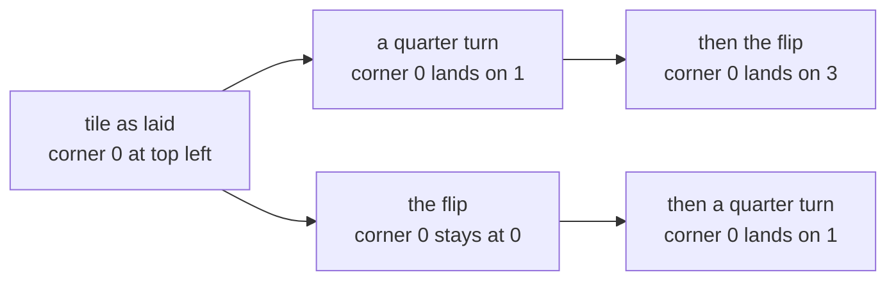

# Groups: one operation, four rules, and the same rules behind clocks, shuffles and symmetries

Algebra → Groups → The four rules → Groups

---

## General Overview

A square ceramic tile drops into a square recess in a kitchen floor. Its pattern is not symmetric, so the way round it went in is visible. Number the corners 0, 1, 2, 3 clockwise from the top left.

The tile fits eight ways: four turns — none, a quarter, a half, three quarters — and those four again after a flip over the recess's diagonal through corners 0 and 2, a line in the floor that turning never moves. Anything else leaves a corner outside the recess.

Call each of the eight a move. Any two in a row come to one of the eight, every move has an undo among them, and doing nothing is one of them. Whole numbers under addition behave the same way, and so do the hours on a clock face.

What the tile, the numbers and the clock share is not a subject matter. It is four rules for combining two things into a third, and a collection obeying them is called a **group**.

**A group is a collection with one way to combine two of its members, where combining never leaves the collection, brackets can be moved, one member changes nothing, and every member can be undone.**

**What kind of fact this is:** a definition. The four rules are a test a collection and its operation pass or fail together; Why it works runs the tile, the numbers and three clock faces through it.

### The picture: two moves, two orders



Turn then flip leaves corner 0 at 3; flip then turn leaves it at 1. Both are among the eight.

---

## The formula

Notation first, in words. The collection takes a capital letter, $G$, its members small letters, $a$, $b$, $c$, so a rule is written once and means every member. The operation is a dot: $a \cdot b$ means combine the two, and for moves it means do $b$ first, then $a$ ([composition](../../01-Foundations/08-Relations%20and%20Functions/03-composition.md)). The do-nothing member is $e$, and the undo of $a$ is $a^{-1}$, where the raised −1 is a label meaning undo, not divide.

Four rules make such a collection a group, each holding for all its members:

$$a \cdot b \in G, \qquad (a \cdot b) \cdot c = a \cdot (b \cdot c)$$

$$e \cdot a = a \cdot e = a, \qquad a^{-1} \cdot a = a \cdot a^{-1} = e$$

Those four are called **closed**, **associative**, **identity** and **inverses**, in that order.

**Read it aloud:** combining stays inside the collection, brackets move freely, one member changes nothing, everything undoes.

| Symbol | Plain meaning | In our example | Change it and… |
| --- | --- | --- | --- |
| $G$ | the collection, and its letter | the tile's eight moves | another collection may fail a rule |
| $a$, $b$, $c$ | any members, so one rule covers all | any of the eight moves | — |
| $\cdot$ | the operation: two members into a third | one move, then the other | a different question |
| $e$ | the identity, which changes nothing | the tile set down unmoved | 0 for adding, 1 for multiplying |
| $a^{-1}$ | the inverse, which undoes $a$ | turning back as it came | a reciprocal only under multiplication |

If $a \cdot b = b \cdot a$ for every pair — order does not matter — the group is **abelian**: a bonus, not a fifth rule. Addition qualifies, the tile does not.

### When it holds

- **Collection and operation are named together.** "The whole numbers" is not a group; "under addition" makes it one. Under multiplication rule four fails: nothing there multiplies 2 up to 1.
- **The operation returns one member for every ordered pair.** Division on the whole numbers does not, so that test stops at rule one.
- **Neither finiteness, numbers, nor swappable order is required.** Eight moves pass; so do infinitely many numbers.

---

## Why it works

### Step 0: forget what the things are, keep how they combine

A move is not a position but an instruction: this corner goes there. Each is a reversible function on the four corner positions ([inverse-functions](../../01-Foundations/08-Relations%20and%20Functions/05-inverse-functions.md)), and the operation is doing one after another.

### Step 1: eight moves, each one a small piece of arithmetic

Every move has one shape: keep the corner number or negate it, then add a fixed amount, wrapping at 4. Write a move as the pair (sign, shift), sign 1 for a turn and −1 for a flip; r2 means two quarter turns, r2f the flip and then two. The code lists all eight, with where each sends corners 0, 1, 2, 3.

Closure falls out: a sign times a sign is a sign, and two shifts add to one, so the answer is another pair — one of the eight. The code checks all 64 pairs by two independent roads.

### Step 2: the other three rules, almost for free

Three moves in a row bracket two ways, and both mean: rightmost, then middle, then leftmost. Composition is associative for all functions ([composition](../../01-Foundations/08-Relations%20and%20Functions/03-composition.md)), so rule two comes free; the code's 512 triples only demonstrate it.

Setting the tile down unmoved is r0, which leaves every move alone: rule three. One quarter turn is undone by three more, r1 then r3 giving r0, and each flipped move undoes itself. Every undo is among the eight, so rule four holds and the tile's moves are a group. Not an abelian one: turn then flip is r3f, flip then turn is r1f.

<details>
<summary>Detailed proof: the eight moves pass all four rules</summary>

Corner 0 lands four ways and corner 1 must stay beside it, two ways, so eight moves exist; corner 0's destination reads off a move's shift and corner 1's its sign, so no two pairs agree.

**Closed.** After (sign2, shift2), do (sign1, shift1): corner i goes to sign1 × (sign2 × i + shift2) + shift1, which regroups to (sign1 × sign2) × i + (sign1 × shift2 + shift1) — one of the eight pairs again, once wrapped at 4.

**The rest.** The pair (1, 0) sends corner i to i: the identity. The same formula names each undo: (1, shift) is undone by (1, minus shift wrapped at 4), and (−1, shift) undoes itself.

</details>

### Step 3: the same rules on numbers, and where they fail

Whole numbers under addition, negatives and 0 included: two added give a whole number, addition is associative, 0 is the identity, the undo is the negative, so 3 + (−3) = 0. Infinite, and abelian.

A clock face wraps. The hours of a 12-hour clock are the residue classes modulo 12, the twelve piles the numbers fall into by remainder, on which adding is well defined ([residue-classes](../../02-Number%20theory/03-Clock%20Arithmetic/03-residue-classes.md)). The undo of 7 is 5, and 9 + 5 reads as 2.

Now seven hours, 0 to 6, multiplied rather than added. Products wrap back inside, multiplication is associative, 1 leaves everything alone — but 0 times any residue is 0, never 1, so 0 has no undo. Not a group.

Remove 0 and the six that remain pass: 7 is prime, so no product of two of them is a multiple of 7, and the undos of 1, 2, 3, 4, 5, 6 are 1, 4, 5, 2, 3, 6.

That cut is no general repair: a six-hour clock without 0 loses closure, since 2 times 3 is 0. For any size the hours sharing no factor above 1 with it are the ones that work (diffie-hellman-and-elgamal). Clock arithmetic reaches this definition from the other end, starting with wrapping sums rather than reversible moves.

---

## Worked numbers, by hand

Each list is where corners 0, 1, 2, 3 end up.

| Step | Arithmetic | Value |
| --- | --- | --- |
| one quarter turn, r1 | add 1, wrap at 4 | 1 2 3 0 |
| the flip, r0f | negate, wrap at 4 | 0 3 2 1 |
| turn, then flip | negate, then add 3 | 3 2 1 0, corner 0 at 3 |
| flip, then turn | negate, then add 1 | 1 0 3 2, corner 0 at 1 |
| numbers, and the clock | 3 + (−3); 9 + 5 wrapped at 12 | 0; 2 |
| the verdict on the tile | all four rules hold | **a group, and not abelian** |

Eight ways to lay the tile, one closed system of moves, each with an undo.

### What breaks if you drop a piece

| Mistake | Comes out at | What went wrong |
| --- | --- | --- |
| Swapping the turn and the flip | corner 0 at 1, not 3 | brackets move, a pair's order does not |
| Cutting 0 from the six-hour clock | 2 times 3 = 0, outside the set | rule one fails: a wrong cut |

The code prints both.

---

## Code, from first principles, and it actually runs

Nothing is imported. Two roads reach every combination: one combines the (sign, shift) pairs by the closure formula, the other pushes each corner through one destination list, then the other. Road two never uses that formula, and all 64 pairs are compared. The script also regroups 512 triples, hunts an undo for each move, and runs the clock cases.

### Python

```python
# Groups -- the check behind the card.  Nothing is imported.  A square tile sits
# eight ways.  A move is a pair (sign, shift): it sends corner i to sign*i +
# shift, wrapped at 4, with sign 1 for a turn and sign -1 for a flip.  Road one
# combines two moves by that arithmetic; road two pushes each corner through the
# two moves one after the other.  Road two never uses road one's formula.
TURNS = 4

def compose(a, b):                       # road one: arithmetic on the pairs, b first
    return (a[0] * b[0], (a[0] * b[1] + a[1]) % TURNS)

def homes(a):                            # where move a sends corners 0, 1, 2, 3
    return tuple((a[0] * i + a[1]) % TURNS for i in range(TURNS))

def through(a, b):                       # road two: corner by corner, b first
    return tuple(homes(a)[j] for j in homes(b))

def name(a):                             # r2f means flip first, then two turns
    return f"r{a[1]}" + ("f" if a[0] == -1 else "")

def row(values):
    return " ".join(str(v) for v in values)

moves = [(s, k) for s in (1, -1) for k in range(TURNS)]
e, r, f = (1, 0), (1, 1), (-1, 0)
for a in moves:
    print(f"move {name(a):<3} is (sign {a[0]:>2}, shift {a[1]}) and sends "
          f"corners 0 1 2 3 to: {row(homes(a))}")
inside = sum(1 for a in moves for b in moves if compose(a, b) in moves)
agree = sum(1 for a in moves for b in moves if homes(compose(a, b)) == through(a, b))
print(f"closure: of {len(moves) ** 2} pairs of the {len(moves)} moves, {inside} land "
      f"inside and {agree} agree with the corner-by-corner road")
triples = [(a, b, c) for a in moves for b in moves for c in moves]
same = sum(1 for a, b, c in triples
           if compose(compose(a, b), c) == compose(a, compose(b, c)))
print(f"associativity: of {len(triples)} triples, {same} regroup to the same move")
tf, ft = compose(f, r), compose(r, f)
print(f"turn then flip: {name(tf)}, sending corner 0 to {homes(tf)[0]}")
print(f"flip then turn: {name(ft)}, sending corner 0 to {homes(ft)[0]}")
undo_r = next(b for b in moves if compose(r, b) == e and compose(b, r) == e)
print(f"undo of one quarter turn: {name(undo_r)}; flip twice: {name(compose(f, f))}")
undo_7 = next(b for b in range(12) if (7 + b) % 12 == 0)
print(f"integers: 3 + (-3) = {3 + (-3)}; clock: 9 + 5 on a 12-hour clock = "
      f"{(9 + 5) % 12}, and the undo of 7 is {undo_7}")
inv7 = [next(b for b in range(1, 7) if a * b % 7 == 1) for a in range(1, 7)]
print(f"mod 7 undo list for 1 2 3 4 5 6: {row(inv7)}")
print(f"mod 7 with 0 kept: 0 times 0 1 2 3 4 5 6 gives "
      f"{row(0 * b % 7 for b in range(7))}, never 1")
leak = [(a, b) for a in range(1, 6) for b in range(1, 6) if a * b % 6 == 0]
print(f"mod 6 without 0: {leak[0][0]} times {leak[0][1]} = "
      f"{leak[0][0] * leak[0][1] % 6}, outside the set")
assert homes(r) == (1, 2, 3, 0) and homes(f) == (0, 3, 2, 1)
assert len(set(homes(a) for a in moves)) == 8 and inside == 64 and agree == 64 and same == 512
assert all(compose(e, a) == a and compose(a, e) == a for a in moves) and all(
    any(compose(a, b) == e and compose(b, a) == e for b in moves) for a in moves)
assert tf == (-1, 3) and ft == (-1, 1) and inv7 == [1, 4, 5, 2, 3, 6] and leak[0] == (2, 3)
print("ALL CHECKS PASS")
```

**Ran 2026-09-14 on macOS, Python 3.14.6, standard library only. All checks passed. Output, pasted from the run:**

```
move r0  is (sign  1, shift 0) and sends corners 0 1 2 3 to: 0 1 2 3
move r1  is (sign  1, shift 1) and sends corners 0 1 2 3 to: 1 2 3 0
move r2  is (sign  1, shift 2) and sends corners 0 1 2 3 to: 2 3 0 1
move r3  is (sign  1, shift 3) and sends corners 0 1 2 3 to: 3 0 1 2
move r0f is (sign -1, shift 0) and sends corners 0 1 2 3 to: 0 3 2 1
move r1f is (sign -1, shift 1) and sends corners 0 1 2 3 to: 1 0 3 2
move r2f is (sign -1, shift 2) and sends corners 0 1 2 3 to: 2 1 0 3
move r3f is (sign -1, shift 3) and sends corners 0 1 2 3 to: 3 2 1 0
closure: of 64 pairs of the 8 moves, 64 land inside and 64 agree with the corner-by-corner road
associativity: of 512 triples, 512 regroup to the same move
turn then flip: r3f, sending corner 0 to 3
flip then turn: r1f, sending corner 0 to 1
undo of one quarter turn: r3; flip twice: r0
integers: 3 + (-3) = 0; clock: 9 + 5 on a 12-hour clock = 2, and the undo of 7 is 5
mod 7 undo list for 1 2 3 4 5 6: 1 4 5 2 3 6
mod 7 with 0 kept: 0 times 0 1 2 3 4 5 6 gives 0 0 0 0 0 0 0, never 1
mod 6 without 0: 2 times 3 = 0, outside the set
ALL CHECKS PASS
```

### Rust

Same numbers, same labels, built with `rustc --edition 2021 -O`.

```rust
// Groups -- the same check as the Python, in Rust.  No crates.  A square tile
// sits eight ways.  A move is a pair (sign, shift): it sends corner i to
// sign*i + shift, wrapped at 4, with sign 1 for a turn and sign -1 for a flip.
// Road one combines two moves by that arithmetic; road two pushes each corner
// through the two moves one after the other.  Road two never uses road one's formula.
const TURNS: i32 = 4;
type Move = (i32, i32);

fn compose(a: Move, b: Move) -> Move {      // road one: arithmetic on the pairs, b first
    (a.0 * b.0, (a.0 * b.1 + a.1).rem_euclid(TURNS))
}

fn homes(a: Move) -> Vec<i32> {             // where move a sends corners 0, 1, 2, 3
    (0..TURNS).map(|i| (a.0 * i + a.1).rem_euclid(TURNS)).collect()
}

fn through(a: Move, b: Move) -> Vec<i32> {   // road two: corner by corner, b first
    let landing = homes(a);
    homes(b).iter().map(|&j| landing[j as usize]).collect()
}

fn name(a: Move) -> String {                // r2f means flip first, then two turns
    format!("r{}{}", a.1, if a.0 == -1 { "f" } else { "" })
}

fn row(values: &[i32]) -> String {
    values.iter().map(|v| v.to_string()).collect::<Vec<String>>().join(" ")
}

fn main() {
    let moves: Vec<Move> = [1, -1].iter().flat_map(|&s| (0..TURNS).map(move |k| (s, k))).collect();
    let (e, r, f) = ((1, 0), (1, 1), (-1, 0));
    for &a in &moves {
        println!("move {:<3} is (sign {:>2}, shift {}) and sends corners 0 1 2 3 to: {}",
                 name(a), a.0, a.1, row(&homes(a)));
    }
    let (mut inside, mut agree) = (0, 0);
    for &a in &moves {
        for &b in &moves {
            if moves.contains(&compose(a, b)) { inside += 1; }
            if homes(compose(a, b)) == through(a, b) { agree += 1; }
        }
    }
    println!("closure: of {} pairs of the {} moves, {} land inside and {} agree with the \
              corner-by-corner road", moves.len() * moves.len(), moves.len(), inside, agree);
    let mut triples = 0;
    let mut same = 0;
    for &a in &moves {
        for &b in &moves {
            for &c in &moves {
                triples += 1;
                if compose(compose(a, b), c) == compose(a, compose(b, c)) { same += 1; }
            }
        }
    }
    println!("associativity: of {} triples, {} regroup to the same move", triples, same);
    let (tf, ft) = (compose(f, r), compose(r, f));
    println!("turn then flip: {}, sending corner 0 to {}", name(tf), homes(tf)[0]);
    println!("flip then turn: {}, sending corner 0 to {}", name(ft), homes(ft)[0]);
    let undo_r = *moves.iter().find(|&&b| compose(r, b) == e && compose(b, r) == e).unwrap();
    println!("undo of one quarter turn: {}; flip twice: {}", name(undo_r), name(compose(f, f)));
    let undo_7 = (0..12).find(|b| (7 + b) % 12 == 0).unwrap();
    println!("integers: 3 + (-3) = {}; clock: 9 + 5 on a 12-hour clock = {}, and the undo \
              of 7 is {}", 3 + (-3), (9 + 5) % 12, undo_7);
    let inv7: Vec<i32> = (1..7).map(|a| (1..7).find(|b| a * b % 7 == 1).unwrap()).collect();
    println!("mod 7 undo list for 1 2 3 4 5 6: {}", row(&inv7));
    let zeros: Vec<i32> = (0..7).map(|b| (0 * b) % 7).collect();
    println!("mod 7 with 0 kept: 0 times 0 1 2 3 4 5 6 gives {}, never 1", row(&zeros));
    let leak: Vec<Move> = (1..6).flat_map(|a| (1..6).map(move |b| (a, b)))
        .filter(|(a, b)| a * b % 6 == 0).collect();
    println!("mod 6 without 0: {} times {} = {}, outside the set",
             leak[0].0, leak[0].1, leak[0].0 * leak[0].1 % 6);
    let shapes: std::collections::HashSet<Vec<i32>> = moves.iter().map(|&a| homes(a)).collect();
    assert!(homes(r) == vec![1, 2, 3, 0] && homes(f) == vec![0, 3, 2, 1]);
    assert!(shapes.len() == 8 && inside == 64 && agree == 64 && same == 512);
    assert!(moves.iter().all(|&a| compose(e, a) == a && compose(a, e) == a)
        && moves.iter().all(|&a| moves.iter().any(|&b| compose(a, b) == e && compose(b, a) == e)));
    assert!(tf == (-1, 3) && ft == (-1, 1) && inv7 == vec![1, 4, 5, 2, 3, 6] && leak[0] == (2, 3));
    println!("ALL CHECKS PASS");
}
```

**Ran 2026-09-14 on macOS, rustc 1.98.1, no crates. All checks passed. Output, pasted from the run:**

```
move r0  is (sign  1, shift 0) and sends corners 0 1 2 3 to: 0 1 2 3
move r1  is (sign  1, shift 1) and sends corners 0 1 2 3 to: 1 2 3 0
move r2  is (sign  1, shift 2) and sends corners 0 1 2 3 to: 2 3 0 1
move r3  is (sign  1, shift 3) and sends corners 0 1 2 3 to: 3 0 1 2
move r0f is (sign -1, shift 0) and sends corners 0 1 2 3 to: 0 3 2 1
move r1f is (sign -1, shift 1) and sends corners 0 1 2 3 to: 1 0 3 2
move r2f is (sign -1, shift 2) and sends corners 0 1 2 3 to: 2 1 0 3
move r3f is (sign -1, shift 3) and sends corners 0 1 2 3 to: 3 2 1 0
closure: of 64 pairs of the 8 moves, 64 land inside and 64 agree with the corner-by-corner road
associativity: of 512 triples, 512 regroup to the same move
turn then flip: r3f, sending corner 0 to 3
flip then turn: r1f, sending corner 0 to 1
undo of one quarter turn: r3; flip twice: r0
integers: 3 + (-3) = 0; clock: 9 + 5 on a 12-hour clock = 2, and the undo of 7 is 5
mod 7 undo list for 1 2 3 4 5 6: 1 4 5 2 3 6
mod 7 with 0 kept: 0 times 0 1 2 3 4 5 6 gives 0 0 0 0 0 0 0, never 1
mod 6 without 0: 2 times 3 = 0, outside the set
ALL CHECKS PASS
```

The two outputs match line for line.

> [!TIP]
> **Try changing**
> Guess first, then run it. An assert stops the program when a number comes out wrong.
> - **Flip twice rather than turning then flipping.** In the line setting `tf`, change `compose(f, r)` to `compose(f, f)`. The answer is r0, and the last assert stops the program, since it holds out for (−1, 3).
> - **List one move twice.** In `moves`, change `range(TURNS)` to `range(TURNS + 1)`. The closure line reads 100 pairs of 10 moves, and the second assert stops the program: a shift of 4 is a shift of 0 relabelled.
> - **Hunt an undo of 0 on the seven-hour clock.** In the `inv7` line, change the last `range(1, 7)` to `range(0, 7)`. The search finds nothing and the program stops: rule four failing in the open.

---

## The usual mistake

> [!warning]
> **Calling a collection a group without naming the operation.** Whole numbers under addition pass all four rules; the same numbers under multiplication fail the fourth, since nothing among them multiplies 2 up to 1. The collection did not change; the verdict did.
>
> - **Reading "associative" as "the order can be swapped".** It says brackets move, and only that. Turn then flip leaves corner 0 at 3, flip then turn leaves it at 1.
> - **Expecting the identity to be 0, or 1, always.** It belongs to the operation: 0 for adding, 1 for multiplying, doing nothing for the tile.
> - **Counting five rules.** Swappable order is a bonus, and some books count three, because "an operation on the collection" already carries closure.

---

## Where you meet it in real life

- **A Rubik's cube.** Every sequence of face turns is a move, two in a row make a third, and running one backwards undoes it. Solving is undoing the scramble.
- **Crystals and tiled floors.** Which moves leave a pattern untouched is a group, and that group tells crystals apart ([symmetry-and-tilings](../../05-Geometry%20and%20trig/06-Beyond%20Euclid/04-symmetry-and-tilings.md)).
- **Invertible matrices.** The 2 × 2 matrices with an inverse form a group under matrix multiplication, identity `[[1, 0], [0, 1]]` written row by row. Order matters here too.
- **Public-key cryptography.** A key exchange runs in the nonzero hours of a prime clock, built in Step 3 (diffie-hellman-and-elgamal).

> **Say it back**
> A group is a collection plus one way of combining two of its members. Four rules: combining stays inside, brackets move, one member changes nothing, every member has an undo inside. The tile's eight positions pass, and turn then flip still differs from flip then turn. Addition on the numbers and on a clock passes; a seven-hour clock under multiplication fails until 0 is thrown out.

---

## What this builds on

- [residue-classes](../../02-Number%20theory/03-Clock%20Arithmetic/03-residue-classes.md): the piles behind a clock face, and why adding them is well defined.
- [composition](../../01-Foundations/08-Relations%20and%20Functions/03-composition.md): one function then another, rightmost first — the tile's operation, and rule two.
- [inverse-functions](../../01-Foundations/08-Relations%20and%20Functions/05-inverse-functions.md): an undo for a function, which is what rule four demands.

## Where this goes next

- [subgroups-and-cyclic-groups](02-subgroups-and-cyclic-groups.md): the parts that are groups.
- [permutations-and-the-symmetric-group](03-permutations-and-the-symmetric-group.md): rearranging a list.
- [rings](../09-Rings%20and%20Fields/01-rings.md): two operations at once.
- [symmetry-and-tilings](../../05-Geometry%20and%20trig/06-Beyond%20Euclid/04-symmetry-and-tilings.md): repeating patterns.
- [elliptic-curves-and-point-addition](../../05-Geometry%20and%20trig/06-Beyond%20Euclid/05-elliptic-curves-and-point-addition.md): an operation built to fit.
- symmetry-and-conserved-quantities: symmetry paying out.
- diffie-hellman-and-elgamal: key exchange.
- the-fundamental-group: loops end to end.
- elliptic-curves-over-q-and-mordell-weil: generating a curve's points.
- elliptic-curves-and-the-group-law: its hard rule proved.
- lie-groups-and-matrix-groups: every angle, not four.
- categories-and-functors: undos dropped.
- adjunctions: loose undos.
- monoids-and-monads-for-programmers: three rules only.
- sofic-groups-and-kothe: infinite from finite.

The four turns alone pass all four rules, which is the next card's question: which parts of a group are groups, and what one member generates alone.

---

## Sources

Verified 14 Sep 2026: every link below resolves to the publisher's page.

- Judson, Thomas W. *Abstract Algebra: Theory and Applications*, chapters 3 to 5. Stephen F. Austin State University. [Publication page](https://scholarworks.sfasu.edu/ebooks/23/). The rules, the square's symmetries, the clock groups.
- Milne, J. S. *Group Theory*, course notes, chapter 1. [Author's page](https://www.jmilne.org/math/CourseNotes/gt.html). Why the word operation already carries closure.
- O'Connor, J. J., and E. F. Robertson. "The abstract group concept." MacTutor History of Mathematics Archive, University of St Andrews. [History topic](https://mathshistory.st-andrews.ac.uk/HistTopics/Abstract_groups/). Where the rules came from.
