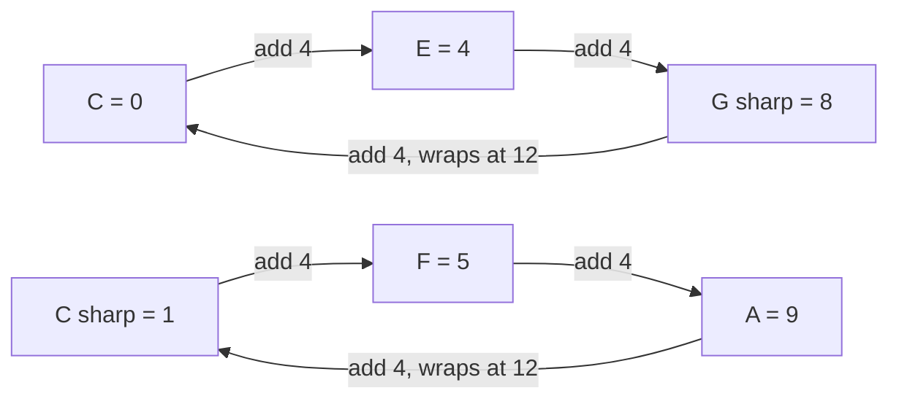
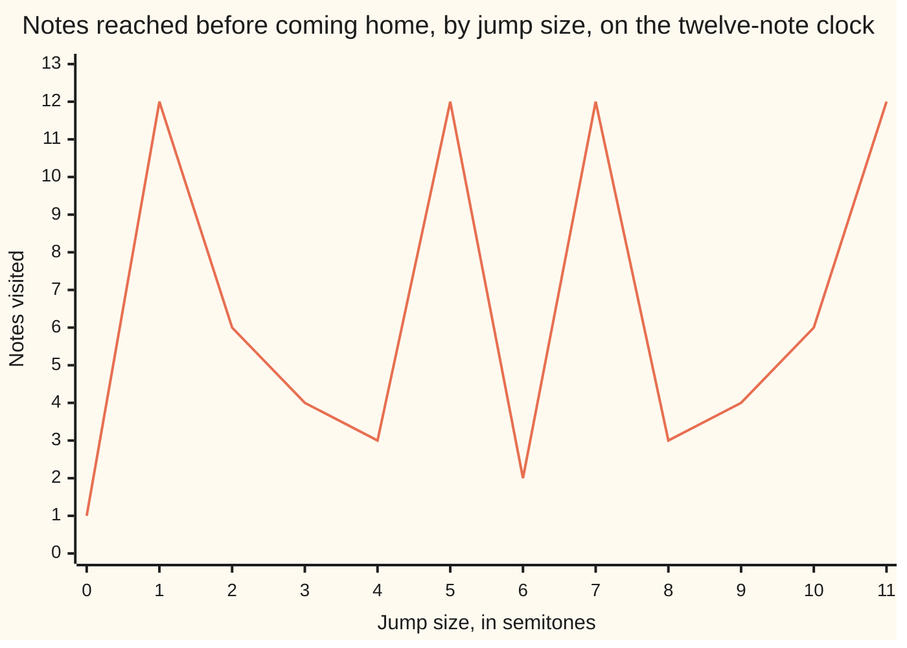

# Subgroups and cyclic groups: a group inside a group, and the groups one element generates by repeating itself

Algebra → Groups → Generators and order → Subgroups and cyclic groups

---

## General Overview

A keyboard repeats every twelve keys. Number the notes of one octave 0 to 11 from C: 0 is C, 1 is C sharp. Up a semitone adds 1; up from 11 lands on 12, which is C again and counts as the same note, so 12 wraps to 0.

Start at C and keep jumping four semitones: C, E, G sharp, and the next jump is home. Three notes, the augmented triad. Jump five semitones instead and the walk takes all twelve before coming home.

Same clock, same move, two results. The twelve notes under wrapping addition are a group: moves combine, a do-nothing move exists, every move can be undone. The triad is a group too, inside that one and under its addition — a **subgroup**. One move fills the whole clock: **cyclic**.

**A subgroup is a smaller set inside a group that is still a group under the same operation; a cyclic group is one that a single member fills out by repeating itself.**

**What kind of fact this is:** two theorems, the subgroup test and the order formula, proved below in Why it works; subgroup and cyclic are definitions.

### The picture: two loops, one of them a subgroup



Both loops close after three notes. The top holds 0, the jump that changes nothing. The bottom, started a semitone higher, holds no 0 — which disqualifies it.

---

## The formula

Write the operation as $*$ and the undo of a member b as $b^{-1}$. Let $G$ be the group, $H$ some of its members.

$H$ is a subgroup of $G$ exactly when $H$ is not empty and, for every $a$ and $b$ in $H$:

$$a * b^{-1} \in H$$

**Read it aloud:** take any member of the smaller set, undo any other member of it, and the result lands back inside.

On the clock the operation is addition and the undo of b is 12 − b, wrapped, so the test reads: a − b, wrapped, stays inside.

Repeating uses exponents: $g$ twice is $g^2$, none at all is the identity $g^0$, and $g^{-2}$ is the undo twice. All of it together goes in angle brackets, read "the subgroup generated by g":

$$\langle g \rangle = \{\, g^k : k \text{ is any whole number} \,\}$$

Braces mean "the set of", the colon "such that". On the clock $g^k$ is k jumps of size g.

The **order** of a member is the repeat count that first reaches the identity, and the size of the subgroup it generates. On a clock of $n$ notes, jumping $a$:

$$\operatorname{ord}(a) = \frac{n}{\gcd(a, n)}$$

The clock size divided by the largest whole number dividing both it and the jump.

| Symbol | Plain meaning | In our example | Push it up and the answer… |
| --- | --- | --- | --- |
| $G$, $H$ | the group; the set tested inside | the twelve notes; the triad 0, 4, 8 | more subgroups |
| $e$ | the identity: changes nothing | 0 | it is in every subgroup |
| $a$, $b$ | members of H; a also names a jump | jump 4, jump 8 | a bigger jump, not a longer loop |
| $g$, $k$, $\langle g \rangle$ | the member repeated; the repeats; all it reaches | jump 5; k jumps; twelve notes | — |
| $n$ | how many notes | 12 | moves the wrap, so every order |
| $\gcd(a, n)$, $\operatorname{ord}(a)$ | largest number dividing both a and n; repeats to the first return | 4; 3 | shorter loop |

### When it holds

- **H must not be empty.** The empty set passes the test with nothing to check and holds no identity. The check refuses it.
- **The formula is for addition on a clock of n notes.** Multiplying on a clock has other orders, counted on [order-and-primitive-roots](../../02-Number%20theory/04-Powers%20on%20the%20Clock/05-order-and-primitive-roots.md).
- **The group is finite.** The whole numbers are generated by 1 and never return to 0: that order is infinite, with nothing to divide.

---

## Why it works

### Step 0: a subset inherits most of a group

Combining members of $G$ is already associative, brackets may be moved, and no subset can lose that. Three rules are at risk: the set must be closed, so two members combined stay inside, and it must hold the identity and an undo for each member.

### Step 1: one test does all three jobs

Suppose $H$ is not empty and every $a * b^{-1}$ lands in $H$.

- Test a member $a$ against itself. $a * a^{-1}$ is $e$: the identity is in.
- Test $e$ against any $b$. $e * b^{-1}$ is $b^{-1}$: every undo is in.
- Test $a$ against $b^{-1}$, now known to be in. Undoing an undo gives b, so $a * b$ is in: closed.

Associativity came free, so $H$ is a group. The converse needs no work: a subgroup holds every undo and is closed, so it passes. The test is not a near-enough shortcut: it is equivalent to being a subgroup.

### Step 2: repeating one member always builds a subgroup

The members of $\langle g \rangle$ are $g^j$ and $g^k$ for whole numbers j and k. Repeating j times then undoing k repeats is repeating j − k times: $g^{j-k}$, another whole number, so the test passes. It is the smallest subgroup holding $g$, which must hold every repeat and undo.

Jump 4 gives 0, 4, 8, then 12 wraps to 0. Its order is 3 and the subgroup it generates has 3 members: one number for both jobs, which is why "order" names both.

### Step 3: where the order formula comes from

After k jumps of size $a$ the walk stands on ka, wrapped; it is home exactly when $n$ divides ka. Let d be $\gcd(a, n)$.

Divide both by d. What is left, a ÷ d and n ÷ d, shares no factor ([coprime-numbers](../../02-Number%20theory/02-Greatest%20Common%20Divisor%20and%20Euclid%27s%20Algorithm/05-coprime-numbers.md)). So n divides ka exactly when n ÷ d divides k, since a ÷ d supplies none of it. The smallest such k is n ÷ d: the formula.

A jump therefore fills the clock exactly when it shares only the divisor 1 with 12: jumps 1, 5, 7 and 11. Jump 4 shares 4, giving order 3; jump 6 shares 6, giving order 2.



The line is each jump's order, peaking at jumps 1, 5, 7 and 11. Jump 0 never leaves C: order 1, not 0.

### Step 4: every cyclic group is a clock or the whole numbers

Label each member by how many repeats of the generator produced it. Combining members adds labels, since j repeats then k repeats is j + k repeats.

If no positive number of repeats returns to the identity, no two labels name one member and the group is a copy of the whole numbers under addition — infinite and cyclic at once. Otherwise the first return sets a period and labels wrap at it: a copy of a clock that size. Nothing else is possible, so up to relabelling ([homomorphisms-and-isomorphisms](05-homomorphisms-and-isomorphisms.md)) there is one cyclic group of each size.

<details>
<summary>Detailed proof</summary>

Every member is $g^k$, and $g^j$ combined with $g^k$ is $g^{j+k}$.

**No count of repeats returns to the identity.** If $g^j = g^k$ with j above k, undoing $g^k$ gives $g^{j-k} = e$ with j − k positive, which is barred. So distinct labels name distinct members: the whole numbers under addition.

**Some count returns.** Let m be the smallest, so $g^m = e$. Divide any label by m with remainder: k = qm + r, r from 0 to m − 1. Then $g^k = (g^m)^q * g^r = g^r$, so every member is one of $g^0$ through $g^{m-1}$. No two are equal: $g^i = g^j$ with i below j below m would give $g^{j-i} = e$ below m. So there are m members and labels wrap at m: the clock of m notes.

</details>

---

## Worked numbers, by hand

Two jumps on the clock, then the square tile that can be set down eight ways: four turns, four flips.

| Step | Arithmetic | Value |
| --- | --- | --- |
| walk jump 4 from C | 0, 4, 8, then 12 wraps | **0, 4, 8** |
| order of jump 4 | 12 ÷ gcd(4, 12), so 12 ÷ 4 | **3** |
| walk jump 5 from C | 0, 5, 10, 3, 8, 1, 6, 11, 4, 9, 2, 7 | all 12 notes |
| order of jump 5 | 12 ÷ gcd(5, 12), so 12 ÷ 1 | **12** |
| the tile's quarter turns | 0, 1, 2, 3 turns, then home | order **4** |

Jump 5 is the circle of fourths: practising in fourths covers every key. The tile's four turns are a cyclic subgroup of its eight settings, holding the half turn's subgroup of two.

### What breaks if you drop a piece

| Mistake | Comes out at | What went wrong |
| --- | --- | --- |
| Keeping only 0 and 4 | 4 + 4 gives 8, outside | closure fails: no subgroup |
| Calling 1, 5 and 9 a subgroup | it holds no 0 | started off the identity: a shifted copy |
| Multiplying the note, not adding the jump | 4 | three jumps of 4 give 0: that is the operation |
| Reading the order off the jump size | 4 | order counts repeats: jump 4 has order 3 |

The code prints all four.

---

## Code, from first principles, and it actually runs

Nothing is imported. Each order is found twice, by roads sharing no arithmetic: walking — add the jump, wrap at 12, stop when a note repeats, count — and 12 divided by the greatest common divisor of the jump and 12, Euclid's algorithm written out. A third road brute-forces the subgroup test. Four asserts pin the results to the formula and to lists written by hand.

### Python

```python
# Subgroups and cyclic groups -- the check behind the card.  Nothing is imported.
# The group is the twelve musical pitch classes 0 to 11, added and wrapped at 12.
# Orders come out twice: by walking a jump home, and from 12 / gcd(jump, 12).
N = 12

def walk(step, n):                      # road one: repeat the jump, collect notes
    out, x = [], 0
    while x not in out:
        out.append(x)
        x = (x + step) % n
    return out

def gcd(a, b):                          # Euclid, used only by road two
    while b: a, b = b, a % b
    return a

def is_subgroup(h, n):                  # brute force: a - b must stay inside
    return bool(h) and all((a - b) % n in h for a in h for b in h)

def show(xs): return " ".join(str(x) for x in xs)

def row(name, values): print(f"{name:<16}" + "".join(f"{v:>4}" for v in values))

jumps = list(range(N))
walked = [len(walk(a, N)) for a in jumps]
formula = [N // gcd(a, N) for a in jumps]                 # road two
row("jump a", jumps)
row("order, walked", walked)
row("order, 12/gcd", formula)
for a in (4, 5, 3):
    notes = walk(a, N)
    print(f"jump {a} reaches: {show(notes)}; order {len(notes)}; "
          f"subgroup: {str(is_subgroup(set(notes), N)).lower()}")
gens = [a for a in jumps if len(walk(a, N)) == N]
coprime = [a for a in jumps if gcd(a, N) == 1]
print(f"jumps reaching all 12 notes: {show(gens)}; count {len(gens)}; "
      f"jumps coprime to 12: {show(coprime)}")
subs = sorted({frozenset(walk(a, N)) for a in jumps}, key=len)
divisors = [d for d in range(1, N + 1) if N % d == 0]
print(f"cyclic subgroups, by size: {show(len(s) for s in subs)}; "
      f"count {len(subs)}; divisors of 12: {show(divisors)}")
quarter, half = walk(1, 4), walk(2, 4)
print(f"tile: quarter turns {show(quarter)}, order {len(quarter)}; "
      f"half turns {show(half)}, order {len(half)}")
print(f"undo of jump 4 is {(-4) % N}, inside the triad: "
      f"{str((-4) % N in walk(4, N)).lower()}")
shifted = [(1 + x) % N for x in walk(4, N)]
print(f"the pair 0 and 4: subgroup {str(is_subgroup({0, 4}, N)).lower()}, "
      f"because 4 + 4 gives {(4 + 4) % N}")
print(f"the shifted loop {show(shifted)}: subgroup "
      f"{str(is_subgroup(set(shifted), N)).lower()}, holds a 0: "
      f"{str(0 in shifted).lower()}")
print(f"multiplying instead of adding: 4^3 wraps to {4 ** 3 % N}, "
      f"while three jumps of 4 give {3 * 4 % N}")
assert walked == formula and walked[4] == 3 and walked[5] == N
assert walk(5, N) == [0, 5, 10, 3, 8, 1, 6, 11, 4, 9, 2, 7] and walk(4, N) == [0, 4, 8]
assert gens == coprime == [1, 5, 7, 11] and [len(s) for s in subs] == divisors
assert (is_subgroup({0, 4, 8}, N) and not is_subgroup({0, 4}, N)
        and not is_subgroup(set(shifted), N) and not is_subgroup(set(), N))
print("ALL CHECKS PASS")
```

**Ran 2026-09-14 on macOS, Python 3.14.6, standard library only. All checks passed. Output, pasted from the run:**

```
jump a             0   1   2   3   4   5   6   7   8   9  10  11
order, walked      1  12   6   4   3  12   2  12   3   4   6  12
order, 12/gcd      1  12   6   4   3  12   2  12   3   4   6  12
jump 4 reaches: 0 4 8; order 3; subgroup: true
jump 5 reaches: 0 5 10 3 8 1 6 11 4 9 2 7; order 12; subgroup: true
jump 3 reaches: 0 3 6 9; order 4; subgroup: true
jumps reaching all 12 notes: 1 5 7 11; count 4; jumps coprime to 12: 1 5 7 11
cyclic subgroups, by size: 1 2 3 4 6 12; count 6; divisors of 12: 1 2 3 4 6 12
tile: quarter turns 0 1 2 3, order 4; half turns 0 2, order 2
undo of jump 4 is 8, inside the triad: true
the pair 0 and 4: subgroup false, because 4 + 4 gives 8
the shifted loop 1 5 9: subgroup false, holds a 0: false
multiplying instead of adding: 4^3 wraps to 4, while three jumps of 4 give 0
ALL CHECKS PASS
```

### Rust

Same rows and labels, built with `rustc --edition 2021 -O`.

```rust
// Subgroups and cyclic groups -- the same check as the Python, in Rust.  No
// crates.  The group is the twelve musical pitch classes 0 to 11, added and
// wrapped at 12.  Orders come out twice: by walking, and from 12 / gcd.
const N: i32 = 12;

fn walk(step: i32, n: i32) -> Vec<i32> {        // road one: repeat the jump
    let (mut out, mut x) = (Vec::new(), 0);
    while !out.contains(&x) {
        out.push(x);
        x = (x + step).rem_euclid(n);
    }
    out
}

fn gcd(mut a: i32, mut b: i32) -> i32 {         // Euclid, used only by road two
    while b != 0 { let t = a % b; a = b; b = t; }
    a
}

fn is_subgroup(h: &[i32], n: i32) -> bool {     // brute force: a - b stays inside
    !h.is_empty() && h.iter().all(|a| h.iter().all(|b| h.contains(&(a - b).rem_euclid(n))))
}

fn show(xs: &[i32]) -> String {
    xs.iter().map(|x| x.to_string()).collect::<Vec<_>>().join(" ")
}

fn row(name: &str, values: &[i32]) {
    let mut line = format!("{:<16}", name);
    for v in values { line.push_str(&format!("{:>4}", v)); }
    println!("{}", line);
}

fn main() {
    let jumps: Vec<i32> = (0..N).collect();
    let walked: Vec<i32> = jumps.iter().map(|&a| walk(a, N).len() as i32).collect();
    let formula: Vec<i32> = jumps.iter().map(|&a| N / gcd(a, N)).collect();   // road two
    row("jump a", &jumps);
    row("order, walked", &walked);
    row("order, 12/gcd", &formula);
    for a in [4, 5, 3] {
        let notes = walk(a, N);
        println!("jump {} reaches: {}; order {}; subgroup: {}",
                 a, show(&notes), notes.len(), is_subgroup(&notes, N));
    }
    let gens: Vec<i32> = (0..N).filter(|&a| walk(a, N).len() as i32 == N).collect();
    let coprime: Vec<i32> = (0..N).filter(|&a| gcd(a, N) == 1).collect();
    println!("jumps reaching all 12 notes: {}; count {}; jumps coprime to 12: {}",
             show(&gens), gens.len(), show(&coprime));
    let mut subs: Vec<Vec<i32>> = Vec::new();
    for &a in &jumps {
        let mut s = walk(a, N);
        s.sort();
        if !subs.contains(&s) { subs.push(s); }
    }
    subs.sort_by_key(|s| s.len());
    let sizes: Vec<i32> = subs.iter().map(|s| s.len() as i32).collect();
    let divisors: Vec<i32> = (1..=N).filter(|d| N % d == 0).collect();
    println!("cyclic subgroups, by size: {}; count {}; divisors of 12: {}",
             show(&sizes), subs.len(), show(&divisors));
    let (quarter, half) = (walk(1, 4), walk(2, 4));
    println!("tile: quarter turns {}, order {}; half turns {}, order {}",
             show(&quarter), quarter.len(), show(&half), half.len());
    let undo = (-4_i32).rem_euclid(N);
    println!("undo of jump 4 is {}, inside the triad: {}", undo, walk(4, N).contains(&undo));
    let shifted: Vec<i32> = walk(4, N).iter().map(|x| (1 + x) % N).collect();
    println!("the pair 0 and 4: subgroup {}, because 4 + 4 gives {}",
             is_subgroup(&[0, 4], N), (4 + 4) % N);
    println!("the shifted loop {}: subgroup {}, holds a 0: {}",
             show(&shifted), is_subgroup(&shifted, N), shifted.contains(&0));
    println!("multiplying instead of adding: 4^3 wraps to {}, while three jumps of 4 give {}",
             4_i32.pow(3) % N, 3 * 4 % N);
    assert!(walked == formula && walked[4] == 3 && walked[5] == N);
    assert!(walk(5, N) == vec![0, 5, 10, 3, 8, 1, 6, 11, 4, 9, 2, 7] && walk(4, N) == vec![0, 4, 8]);
    assert!(gens == coprime && gens == vec![1, 5, 7, 11] && sizes == divisors);
    assert!(is_subgroup(&[0, 4, 8], N) && !is_subgroup(&[0, 4], N)
            && !is_subgroup(&shifted, N) && !is_subgroup(&[], N));
    println!("ALL CHECKS PASS");
}
```

**Ran 2026-09-14 on macOS, rustc 1.98.1, no crates. All checks passed. Output, pasted from the run:**

```
jump a             0   1   2   3   4   5   6   7   8   9  10  11
order, walked      1  12   6   4   3  12   2  12   3   4   6  12
order, 12/gcd      1  12   6   4   3  12   2  12   3   4   6  12
jump 4 reaches: 0 4 8; order 3; subgroup: true
jump 5 reaches: 0 5 10 3 8 1 6 11 4 9 2 7; order 12; subgroup: true
jump 3 reaches: 0 3 6 9; order 4; subgroup: true
jumps reaching all 12 notes: 1 5 7 11; count 4; jumps coprime to 12: 1 5 7 11
cyclic subgroups, by size: 1 2 3 4 6 12; count 6; divisors of 12: 1 2 3 4 6 12
tile: quarter turns 0 1 2 3, order 4; half turns 0 2, order 2
undo of jump 4 is 8, inside the triad: true
the pair 0 and 4: subgroup false, because 4 + 4 gives 8
the shifted loop 1 5 9: subgroup false, holds a 0: false
multiplying instead of adding: 4^3 wraps to 4, while three jumps of 4 give 0
ALL CHECKS PASS
```

The two outputs match line for line.

> [!TIP]
> **Try changing**
> Guess first, then run it. The asserts are pinned to the twelve-note clock, so expect one to stop it.
> - **A thirteen-note clock.** Set `N` to `13`. Which jumps fill it? All of 1 to 12, since 13 is prime.
> - **Trust the jump size.** Replace `N // gcd(a, N)` with `a`. The third row stops matching the second.
> - **Start off the identity.** In `walk`, start `x` at `1`. Jump 4 prints 1 5 9, verdict false.

---

## The usual mistake

> [!warning]
> **Assuming a bigger jump covers more ground.** Jump 4 is four times jump 1 and reaches three notes instead of twelve; jump 6 reaches two, jumps 5 and 7 every note. What decides the count is the largest divisor the jump shares with 12.
>
> - **A loop that misses the identity is not a subgroup.** The notes 1, 5 and 9 close up under the same jumps with no do-nothing member: a shifted copy, named in [cosets-and-lagranges-theorem](04-cosets-and-lagranges-theorem.md).
> - **Repeating means repeating the group's own operation.** Three repeats of 4 is three jumps, home at 0, not 4 × 4 × 4, which wraps to 4 and never comes home.
> - **One generator is a strong demand.** Every cyclic group is commutative, but some commutative groups have no member that reaches everything ([direct-products](07-direct-products.md)).

---

## Where you meet it in real life

- **Transposing music.** Moving a figure up a fixed interval: jumping 5 semitones passes through every key, 4 locks into a triad of three.
- **Rotas and strides.** A roster of 12 slots advanced 4 each time covers three slots for ever and leaves nine untouched; advanced 5, it covers all twelve. A fixed stride through n slots in software obeys the same rule.
- **Symmetry.** Which subgroups an object has describes its symmetry, taken up by [group-actions-and-counting](08-group-actions-and-counting.md).

> **Say it back**
> A subgroup is a smaller set inside a group, still a group under the same operation, and one test settles it: not empty, and any member combined with the undo of any other lands inside. Repeating one member always passes, so it always builds a subgroup. On a clock of 12 notes a jump comes home after 12 divided by the largest divisor it shares with 12: jump 4 reaches three notes, jump 5 all twelve. Every cyclic group is a clock or the whole numbers.

---

## What this builds on

- [groups](01-groups.md): the operation, identity and undo a subgroup must keep.
- [coprime-numbers](../../02-Number%20theory/02-Greatest%20Common%20Divisor%20and%20Euclid%27s%20Algorithm/05-coprime-numbers.md): with the shared divisor out, what is left shares no factor — the cancellation behind the order formula.
- [order-and-primitive-roots](../../02-Number%20theory/04-Powers%20on%20the%20Clock/05-order-and-primitive-roots.md): the same count for multiplication on a clock.

## Where this goes next

- [cosets-and-lagranges-theorem](04-cosets-and-lagranges-theorem.md): shifted copies like 1, 5 and 9 get a name, and prove a subgroup's size divides the group's.
- [direct-products](07-direct-products.md): two groups bolted together, and the smallest commutative group no member generates.
- fundamental-group-of-the-circle: loops on a circle are Step 4's infinite cyclic group.
- cyclotomic-extensions-and-roots-of-unity: n points round a circle, multiplied not added: the same clock.
- torsion-and-nagell-lutz: curve points that come home after finitely many additions.

The cyclic subgroups came out at sizes 1, 2, 3, 4, 6 and 12: every divisor of 12, one each. Quirk of clocks or law about all finite groups? [cosets-and-lagranges-theorem](04-cosets-and-lagranges-theorem.md) settles it.

---

## Sources

Verified 14 Sep 2026: every link below resolves to the publisher's page.

- Judson, Thomas W. *Abstract Algebra: Theory and Applications*, chapters 3 and 4. Stephen F. Austin State University. [Publisher page](https://scholarworks.sfasu.edu/ebooks/23/). The subgroup test, generated subgroups, element order, cyclic classification.
- O'Connor, J. J., and E. F. Robertson. "The development of group theory." MacTutor Archive, University of St Andrews. [History page](https://mathshistory.st-andrews.ac.uk/HistTopics/Development_group_theory/). Cayley's 1854 papers, and von Dyck defining a group by generators in 1882.
