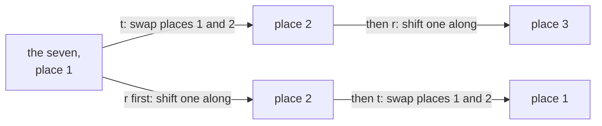
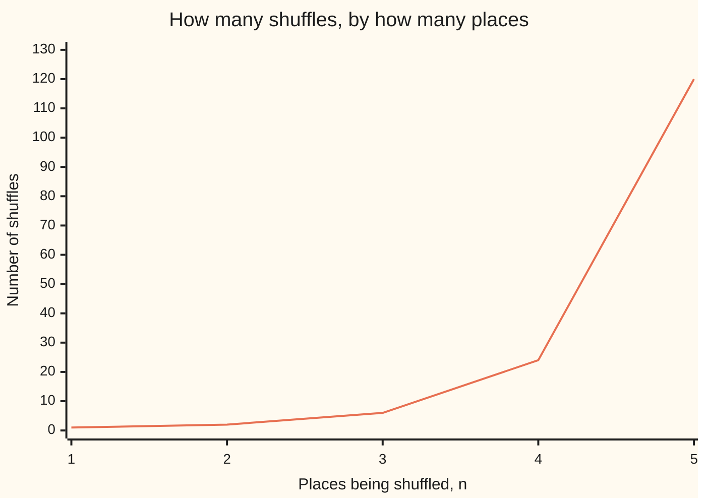

# Permutations: shuffles compose, every shuffle can be undone, and the n! shuffles of n cards form the symmetric group

Algebra → Groups → Shuffles and swaps → Permutations

---

## General Overview

Three cards lie face up in places 1, 2 and 3: a seven, an eight, a nine. Two moves are allowed. One swaps the cards in places 1 and 2; call it t. The other shifts each card one place along, place 3's coming round to place 1; call it r.

Do t, then r, and the seven ends in place 3. Do r, then t, and it ends in place 1.

Such a move is a **permutation**: every place sends its card to one place and receives one card. Nothing is lost or doubled, so it can be run backwards. Three places allow six, and those six, under "do one, then the next", obey every rule of a group ([groups](01-groups.md)): the symmetric group on three places, written $S_3$.

**Reversible rearrangements of labelled places compose into further rearrangements, each has an undo, and together they form a group: the symmetric group.**

**What kind of fact this is:** a definition, carrying two theorems proved below: n places have n × (n − 1) × … × 1 rearrangements, and none is both even and odd.

### The picture: two moves, two orders



Upper road: t then r. Lower road: r then t. Order is part of the answer.

---

## The formula

Two rows of numbers fix a shuffle: the places along the top, under each the place its card goes to. That is **two-line notation**; beside it, **cycle notation**:

$$r = \begin{pmatrix} 1 & 2 & 3 \\ 2 & 3 & 1 \end{pmatrix} = (1\ 2\ 3), \qquad t = \begin{pmatrix} 1 & 2 & 3 \\ 2 & 1 & 3 \end{pmatrix} = (1\ 2)$$

Read (1 2 3) as: 1's card to place 2, 2's to place 3, 3's back to place 1. A place left out keeps its own card, so t is (1 2), not (1 2)(3). A two-place cycle is a **swap**. Shuffles side by side mean do both, right-hand one first:

$$(rt)(1) = r(t(1)) = r(2) = 3$$

**Read it aloud:** the right-hand shuffle goes first, so follow each place through t, then through r.

Then the count, and the fewest swaps a shuffle takes:

$$n! = n \times (n - 1) \times \cdots \times 2 \times 1, \qquad \text{fewest swaps} = n - (\text{cycles, fixed places counted})$$

| Symbol | Plain meaning | In our example | Push it up and the answer… |
| --- | --- | --- | --- |
| $n$ | labelled places being shuffled | 3 | each place multiplies the count |
| $S_n$ (so $S_3$, $S_4$) | all shuffles of n places, under "do one then the next" | $S_3$: six | 24 for four places, 120 for five |
| $n!$ | that count, read "n factorial" | 3 × 2 × 1 = 6 | beats every fixed power of n |
| $e$, $r$, $t$ | do-nothing; shift along; swap places 1 and 2 | e, (1 2 3), (1 2) | — |
| $rt$, $tr$ | t then r; r then t | (1 3); (2 3) | — |

### When it holds

- **Finitely many places, each with its own label.** Cards nobody can tell apart make shuffles look alike, and n! over-counts.
- **One destination per place, one card per destination.** In 2, 2, 1, place 2 takes two cards and place 3 none.
- **Right-hand factor first, bottom row destinations.** Compose the other way and rt is (2 3); read 2, 3, 1 as occupants and out comes the undo.

---

## Why it works

### Step 0: a shuffle is a matching that runs backwards

A shuffle sends each place's card to one place and fills every place: one-to-one and onto, a **bijection** ([injective-surjective-bijective](../../01-Foundations/08-Relations%20and%20Functions/04-injective-surjective-bijective.md)). Without onto a place gets nothing; without one-to-one two cards want one place. With both, the arrows read backwards are a shuffle — the undo.

### Step 1: the shuffles of n places form a group

Shuffling has the four things a group needs ([groups](01-groups.md)). One shuffle after another is a shuffle, since a bijection after a bijection is a bijection ([composition](../../01-Foundations/08-Relations%20and%20Functions/03-composition.md)). Bracketing either way sends each place along the same arrows. The do-nothing shuffle e is the identity, Step 0 the undo. So $S_n$ is a group under composition.

### Step 2: counting the shuffles

Place 1's card may go to any of the n places, place 2's to any of the n − 1 still free, down to one for the last. Each chain of choices gives one shuffle and no shuffle twice, so the counts multiply: 3 × 2 × 1 = 6, then 24 and 120.



The line counts shuffles: 1 of one place, then 2, 6, 24, 120.

### Step 3: order matters, and three cards already show it

Through rt, t going first: 1 to 2, then 2 to 3; 2 to 1, then 1 to 2; 3 stays, then 3 to 1 — destinations 3, 2, 1, the swap (1 3). The same tracing through tr gives 1, 3, 2, the swap (2 3). A group whose operation never minds the order is **commutative**; $S_3$ is the smallest that is not.

### Step 4: cycles come from following one place round

Follow the arrows from any place: 1 to 2, 2 to 3, 3 to 1. The places are finite, so the trail must revisit one, and since each place receives one card only, the first revisit is the start: the trail closes into a loop, a **cycle**. Start again at an unused place, and the new cycle shares nothing with the old — so every shuffle splits into cycles with no place in common, which is what cycle notation writes. Reversing its arrows undoes a cycle: the undo of (1 2 3) is (1 3 2).

### Step 5: swaps, and why even or odd never changes

A cycle of k places is k − 1 swaps: hold its first place and swap it with the second, then the third. For (1 2 3) that is (1 3)(1 2), right-hand swap first. Summed over the cycles, fixed places costing nothing, that is the formula above: r is 3 − 1 = 2 swaps, t is 3 − 2 = 1.

No shuffle has only one swap count: repeat a swap and nothing moves, so a chain can always be padded by two. What survives is even or odd — the shuffle's **parity**.

<details>
<summary>Detailed proof: no shuffle is both even and odd</summary>

Count the **out-of-order pairs** in a destination list: a larger destination standing left of a smaller one. The list 2, 3, 1 has two; the list 1, 2, 3 has none.

Swapping two neighbouring entries changes only their own comparison, so the count moves by exactly 1. Swapping two entries j places apart takes 2j − 1 neighbour swaps, j out and j − 1 back: odd either way, so every swap flips the count between even and odd.

The do-nothing list starts at zero, even, so the count is even exactly when the chain of swaps was even in length. And the count belongs to the finished list, not the chain: two chains ending at one shuffle agree.

</details>

Out-of-order pairs are a second road to the label: r has two, so it is even; the code checks both roads across all 24 shuffles of four places. Lengths add when chains join, so even with even is even, and the even shuffles close under the operation and hold each other's undos — a group inside $S_n$, the **alternating group**, exactly half of it from two places up: in $S_3$, e with (1 2 3) and (1 3 2). Written as +1 for even and −1 for odd, the label multiplies when shuffles compose; the map it becomes belongs to [homomorphisms-and-isomorphisms](05-homomorphisms-and-isomorphisms.md).

<details>
<summary>Every finite group is a group of shuffles</summary>

Cayley's theorem: each member of a finite group shuffles the group's own member list, so a group with n members sits inside $S_n$.

</details>

---

## Worked numbers, by hand

The three cards, then a square tile set down eight ways — four turns, four flips — corners labelled 1 to 4.

| Step | Arithmetic | Value |
| --- | --- | --- |
| shuffles of three cards | 3 × 2 × 1 | **6** |
| swap then shift, rt | 1→2→3; 2→1→2; 3→3→1 | **(1 3)** |
| shift then swap, tr | 1→2→1; 2→3→3; 3→1→2 | **(2 3)** |
| r as swaps, then by out-of-order pairs | 3 places − 1 cycle; 2 before 1, 3 before 1 | 2, **even** |
| the tile's corner shuffles, then its rigid ones | 4 × 3 × 2 × 1, then those keeping neighbours | 24, of which **8** |

Two orders, two different shuffles. Only 8 of the 24 corner rearrangements survive lifting the tile: a rigid move leaves neighbours neighbouring.

### What breaks if you drop a piece

| Mistake | Comes out at | What went wrong |
| --- | --- | --- |
| Reading rt from the left | (2 3) | that is tr; the right-hand shuffle goes first |
| Calling (1 2 3) odd because three is odd | odd | it is 2 swaps; (1 2 3 4) is the odd one, at 3 |
| Every corner shuffle taken for a symmetry | 24 for 8 | 16 of them would bend the square |

The code prints all three.

---

## Code, from first principles, and it actually runs

A shuffle is a list of destinations: entry number i says where the card in place i goes. Every answer comes by two roads sharing no arithmetic. The count: list every shuffle, against multiplying n down to 1. The label: out-of-order pairs, against places minus cycles. The tile: turns and flips, against filtering the 24 corner shuffles for neighbour-keeping ones.

### Python

```python
# Permutations -- the check behind the card.  Nothing is imported.  A shuffle of n
# places is a list of destinations: entry i says where the card lying in place i
# goes.  Composition does the right-hand shuffle first, so rt means t and then r.
# Every number quoted on the card is printed here, and each answer is reached by
# two roads: the count by listing every shuffle and by multiplying n down to 1,
# the even-or-odd label by out-of-order pairs and by places minus cycles, the
# square's symmetries by the turn-and-flip rule and by keeping corner neighbours.
def all_shuffles(n):                   # road one to the count: pick unused places
    def grow(used):
        if len(used) == n: return [tuple(used)]
        return [s for d in range(1, n + 1) if d not in used for s in grow(used + [d])]
    return grow([])
def multiply_down(n):                  # road two to the count: n x (n - 1) x ... x 1
    total = 1
    for k in range(2, n + 1): total = total * k
    return total
def compose(a, b): return tuple(a[j - 1] for j in b)          # do b first, then a
def undo(a): return tuple(a.index(i) + 1 for i in range(1, len(a) + 1))
def cycles(a):                         # follow each place until it comes back
    seen, out = set(), []
    for start in range(1, len(a) + 1):
        if start in seen: continue
        cyc, j = [], start
        while j not in seen:
            cyc.append(j); seen.add(j); j = a[j - 1]
        out.append(cyc)
    return out
def name(a):                           # cycle notation, single places left out
    return "".join("(" + " ".join(str(x) for x in c) + ")" for c in cycles(a) if len(c) > 1) or "e"
def out_of_order(a):                   # pairs of places standing in the wrong order
    return sum(1 for i in range(len(a)) for j in range(i + 1, len(a)) if a[i] > a[j])
def swaps(a): return len(a) - len(cycles(a))                  # places minus cycles
def parity(a): return "odd" if swaps(a) % 2 else "even"
def row(a): return " ".join(str(x) for x in a)

s3, s4 = all_shuffles(3), all_shuffles(4)
e, r, t, four = (1, 2, 3), (2, 3, 1), (2, 1, 3), (2, 3, 4, 1)
print("the six shuffles of three cards: destinations, cycle name, even or odd")
for p in s3:
    print(f"  {row(p)}  {name(p):<9}{parity(p)}")
print(f"swap then shift, rt: destinations {row(compose(r, t))} = {name(compose(r, t))}")
print(f"shift then swap, tr: destinations {row(compose(t, r))} = {name(compose(t, r))}")
print(f"the undo of r: destinations {row(undo(r))} = {name(undo(r))}")
print(f"r as swaps: 3 places minus {len(cycles(r))} cycle = {swaps(r)} swaps, {parity(r)}")
print(f"out-of-order pairs in {row(r)}: {out_of_order(r)}, so {parity(r)}")
counts = [len(all_shuffles(k)) for k in range(1, 6)]
print("shuffles of 1, 2, 3, 4, 5 places: " + ", ".join(str(c) for c in counts))
print(f"S_3 splits: even {sum(1 for p in s3 if swaps(p) % 2 == 0)}, "
      f"odd {sum(1 for p in s3 if swaps(p) % 2)}")
print(f"the four-cycle {name(four)}: {swaps(four)} swaps, {parity(four)}")
tile = {tuple((s * i + k) % 4 + 1 for i in range(4)) for s in (1, -1) for k in range(4)}
rigid = {p for p in s4 if all((p[(i + 1) % 4] - p[i]) % 4 in (1, 3) for i in range(4))}
print(f"corner shuffles of the square: {len(s4)}; rigid symmetries among them: {len(tile)}")
print(f"the list 2 2 1 is a shuffle: {'yes' if len(set((2, 2, 1))) == 3 else 'no'}")
assert counts == [multiply_down(k) for k in range(1, 6)]
assert all(out_of_order(p) % 2 == swaps(p) % 2 for p in s4)
assert compose(r, t) == (3, 2, 1) and compose(t, r) == (1, 3, 2) and undo(r) == (3, 1, 2)
assert all(compose(p, undo(p)) == e and all(compose(p, q) in s3 for q in s3) for p in s3) and tile == rigid
print("ALL CHECKS PASS")
```

**Ran 2026-09-14 on macOS, Python 3.14.6, standard library only. All checks passed. Output, pasted from the run:**

```
the six shuffles of three cards: destinations, cycle name, even or odd
  1 2 3  e        even
  1 3 2  (2 3)    odd
  2 1 3  (1 2)    odd
  2 3 1  (1 2 3)  even
  3 1 2  (1 3 2)  even
  3 2 1  (1 3)    odd
swap then shift, rt: destinations 3 2 1 = (1 3)
shift then swap, tr: destinations 1 3 2 = (2 3)
the undo of r: destinations 3 1 2 = (1 3 2)
r as swaps: 3 places minus 1 cycle = 2 swaps, even
out-of-order pairs in 2 3 1: 2, so even
shuffles of 1, 2, 3, 4, 5 places: 1, 2, 6, 24, 120
S_3 splits: even 3, odd 3
the four-cycle (1 2 3 4): 3 swaps, odd
corner shuffles of the square: 24; rigid symmetries among them: 8
the list 2 2 1 is a shuffle: no
ALL CHECKS PASS
```

### Rust

Same rows, built with `rustc --edition 2021 -O`.

```rust
// Permutations -- the same check as the Python, in Rust.  No crates.  A shuffle of n
// places is a list of destinations: entry i says where the card lying in place i goes.
// Composition does the right-hand shuffle first, so rt means t and then r.  Each answer
// is reached by two roads: the count by listing every shuffle and by multiplying n down
// to 1, the even-or-odd label by out-of-order pairs and by places minus cycles, the
// square's symmetries by the turn-and-flip rule and by keeping corner neighbours.
use std::collections::HashSet;
fn all_shuffles(n: usize) -> Vec<Vec<usize>> {     // road one: pick unused places
    fn grow(n: usize, used: Vec<usize>, out: &mut Vec<Vec<usize>>) {
        if used.len() == n { out.push(used); return; }
        for d in 1..=n {
            if !used.contains(&d) { let mut next = used.clone(); next.push(d); grow(n, next, out); }
        }
    }
    let (mut out, start) = (vec![], vec![]);
    grow(n, start, &mut out);
    out
}
fn multiply_down(n: usize) -> usize {              // road two: n x (n - 1) x ... x 1
    let mut total = 1;
    for k in 2..=n { total = total * k; }
    total
}
fn compose(a: &[usize], b: &[usize]) -> Vec<usize> { b.iter().map(|&j| a[j - 1]).collect() }
fn undo(a: &[usize]) -> Vec<usize> {               // the shuffle that puts cards back
    (1..=a.len()).map(|i| a.iter().position(|&j| j == i).unwrap() + 1).collect() }
fn cycles(a: &[usize]) -> Vec<Vec<usize>> {        // follow each place until it returns
    let (mut seen, mut out) = (vec![false; a.len() + 1], vec![]);
    for start in 1..=a.len() {
        if seen[start] { continue; }
        let (mut cyc, mut j) = (vec![], start);
        while !seen[j] { cyc.push(j); seen[j] = true; j = a[j - 1]; }
        out.push(cyc);
    }
    out
}
fn row(a: &[usize]) -> String {
    a.iter().map(|x| x.to_string()).collect::<Vec<_>>().join(" ")
}
fn name(a: &[usize]) -> String {                   // cycle notation, single places out
    let text: String = cycles(a).iter().filter(|c| c.len() > 1)
        .map(|c| format!("({})", row(c))).collect::<Vec<_>>().join("");
    if text.is_empty() { "e".to_string() } else { text }
}
fn out_of_order(a: &[usize]) -> usize {            // pairs standing in the wrong order
    (0..a.len()).map(|i| (i + 1..a.len()).filter(|&j| a[i] > a[j]).count()).sum()
}
fn swaps(a: &[usize]) -> usize { a.len() - cycles(a).len() }    // places minus cycles
fn parity(a: &[usize]) -> &'static str { if swaps(a) % 2 == 1 { "odd" } else { "even" } }
fn main() {
    let (s3, s4) = (all_shuffles(3), all_shuffles(4));
    let (e, r, t, four) = (vec![1, 2, 3], vec![2, 3, 1], vec![2, 1, 3], vec![2, 3, 4, 1]);
    println!("the six shuffles of three cards: destinations, cycle name, even or odd");
    for p in &s3 { println!("  {}  {:<9}{}", row(p), name(p), parity(p)); }
    println!("swap then shift, rt: destinations {} = {}", row(&compose(&r, &t)), name(&compose(&r, &t)));
    println!("shift then swap, tr: destinations {} = {}", row(&compose(&t, &r)), name(&compose(&t, &r)));
    println!("the undo of r: destinations {} = {}", row(&undo(&r)), name(&undo(&r)));
    println!("r as swaps: 3 places minus {} cycle = {} swaps, {}", cycles(&r).len(), swaps(&r), parity(&r));
    println!("out-of-order pairs in {}: {}, so {}", row(&r), out_of_order(&r), parity(&r));
    let counts: Vec<usize> = (1..=5).map(|k| all_shuffles(k).len()).collect();
    println!("shuffles of 1, 2, 3, 4, 5 places: {}",
             counts.iter().map(|c| c.to_string()).collect::<Vec<_>>().join(", "));
    println!("S_3 splits: even {}, odd {}", s3.iter().filter(|p| swaps(p) % 2 == 0).count(),
             s3.iter().filter(|p| swaps(p) % 2 == 1).count());
    println!("the four-cycle {}: {} swaps, {}", name(&four), swaps(&four), parity(&four));
    let mut tile: HashSet<Vec<usize>> = HashSet::new();
    for s in [1_i32, -1] { for k in 0..4 {
        tile.insert((0..4).map(|i| ((s * i + k).rem_euclid(4) + 1) as usize).collect());
    } }
    let rigid: HashSet<Vec<usize>> = s4.iter()
        .filter(|p| (0..4).all(|i| [1, 3].contains(&((p[(i + 1) % 4] + 4 - p[i]) % 4)))).cloned().collect();
    println!("corner shuffles of the square: {}; rigid symmetries among them: {}", s4.len(), tile.len());
    let distinct: HashSet<usize> = [2, 2, 1].into_iter().collect();
    println!("the list 2 2 1 is a shuffle: {}", if distinct.len() == 3 { "yes" } else { "no" });
    assert!(counts == (1..=5).map(multiply_down).collect::<Vec<usize>>());
    assert!(s4.iter().all(|p| out_of_order(p) % 2 == swaps(p) % 2));
    assert!(compose(&r, &t) == vec![3, 2, 1] && compose(&t, &r) == vec![1, 3, 2] && undo(&r) == vec![3, 1, 2]);
    assert!(s3.iter().all(|p| compose(p, &undo(p)) == e && s3.iter().all(|q| s3.contains(&compose(p, q)))) && tile == rigid);
    println!("ALL CHECKS PASS");
}
```

**Ran 2026-09-14 on macOS, rustc 1.98.1, no crates. All checks passed. Output, pasted from the run:**

```
the six shuffles of three cards: destinations, cycle name, even or odd
  1 2 3  e        even
  1 3 2  (2 3)    odd
  2 1 3  (1 2)    odd
  2 3 1  (1 2 3)  even
  3 1 2  (1 3 2)  even
  3 2 1  (1 3)    odd
swap then shift, rt: destinations 3 2 1 = (1 3)
shift then swap, tr: destinations 1 3 2 = (2 3)
the undo of r: destinations 3 1 2 = (1 3 2)
r as swaps: 3 places minus 1 cycle = 2 swaps, even
out-of-order pairs in 2 3 1: 2, so even
shuffles of 1, 2, 3, 4, 5 places: 1, 2, 6, 24, 120
S_3 splits: even 3, odd 3
the four-cycle (1 2 3 4): 3 swaps, odd
corner shuffles of the square: 24; rigid symmetries among them: 8
the list 2 2 1 is a shuffle: no
ALL CHECKS PASS
```

The two outputs match line for line.

> [!TIP]
> **Try changing**
> Guess first, then run it. An assert stops the program when a number comes out wrong; all four are pinned to the cards and the tile.
> - **Break the swap count.** Add 1 to the result of `swaps`. Every label flips and the second assert stops it: out-of-order pairs still call (1 2 3) even.
> - **Break the counting.** In `multiply_down`, add k instead of multiplying by it. The counts drift to 1, 3, 6, 10, 15 and the first assert stops it.
> - **Loosen the tile's rule.** Allow a corner gap of 2 in `rigid`. Shuffles that fold the square get in, the two roads part, and the last assert stops it.

---

## The usual mistake

> [!warning]
> **Reading the bottom row as "which card sits here" rather than "where this card goes".** The list 2, 3, 1 says place 1's card goes to place 2, not that card 2 sits in place 1. Read as occupants it names the undo, (1 3 2), reversing every product with it.
>
> - **Multiplying left to right.** The right-hand shuffle goes first, so rt is (1 3). From the left out comes (2 3), the other product.
> - **Hearing "odd" in a cycle's length.** A cycle of three places is two swaps, even. The cycle (1 2 3 4) is three swaps, odd.
> - **Hunting for a single swap count.** There is none: any chain can be padded by the same swap twice.

---

## Where you meet it in real life

- **Sorting.** A routine that swaps neighbours pays one swap per out-of-order pair: the proof's count is the sort's workload.
- **Puzzles.** Each slide of a sliding-tile puzzle swaps a tile with the blank, and returning the blank home takes an even number of slides, so the numbered tiles are shuffled evenly. Prise two tiles out and swap them: that target is odd, so no slides reach it.
- **Symmetry and determinants.** Label a shape's corners and each rigid motion becomes a shuffle — the tile's 8 turns and flips among 24 corner shuffles; counting with symmetry is [group-actions-and-counting](08-group-actions-and-counting.md). A determinant's signs are this same label.

> **Say it back**
> A permutation rearranges labelled places, each sending its card to one place and receiving one, so it can be undone. One after another gives another permutation, so the collection is a group: the symmetric group, with n × (n − 1) × … × 1 members, six for three cards. Order matters: swap then shift is (1 3), the other order (2 3). Following one place round cuts a shuffle into cycles, a cycle of k places being k − 1 swaps — the fewest, though only even-or-odd is fixed.

---

## What this builds on

- [groups](01-groups.md): the four rules checked here, closure to undo.
- [injective-surjective-bijective](../../01-Foundations/08-Relations%20and%20Functions/04-injective-surjective-bijective.md): one-to-one and onto, the undo's conditions.
- [composition](../../01-Foundations/08-Relations%20and%20Functions/03-composition.md): one function after another, right to left.

## Where this goes next

- [homomorphisms-and-isomorphisms](05-homomorphisms-and-isomorphisms.md): maps that respect the operation.
- [group-actions-and-counting](08-group-actions-and-counting.md): counting what symmetry repeats.
- [why-no-quintic-formula](../10-For%20the%20Curious/02-why-no-quintic-formula.md): why five roots refuse to break up.
- [derangements](../../04-Combinatorics%20and%20graphs/04-Inclusion-Exclusion%20and%20Pigeonhole/02-derangements.md): shuffles leaving nothing in its own place.
- [permutations-by-cycles](../../04-Combinatorics%20and%20graphs/08-Partitions/05-permutations-by-cycles.md): counting shuffles by their cycle shape.
- computing-a-galois-group: the shuffles of a polynomial's roots.
- solvability-by-radicals-and-the-quintic: which equations have a formula in radicals.

Even and odd is a label this card computes but cannot use: a later card makes it a map from $S_n$ onto a two-member group, and such maps are how groups are compared.

---

## Sources

Verified 14 Sep 2026: every link below resolves to the publisher's page.

- Judson, Thomas W. *Abstract Algebra: Theory and Applications*, chapter 5, "Permutation Groups." [Publisher page](https://scholarworks.sfasu.edu/ebooks/23/). Cycles, swaps and parity.
- O'Connor, J. J., and E. F. Robertson. "The Development of Group Theory." MacTutor, University of St Andrews. [History topic](https://mathshistory.st-andrews.ac.uk/HistTopics/Development_group_theory/). Cauchy's 1844 memoir, where cycle notation begins.
- Milne, J. S. *Group Theory*, course notes. [Author's page](https://www.jmilne.org/math/CourseNotes/GT.pdf). The symmetric group, swaps, the sign.
