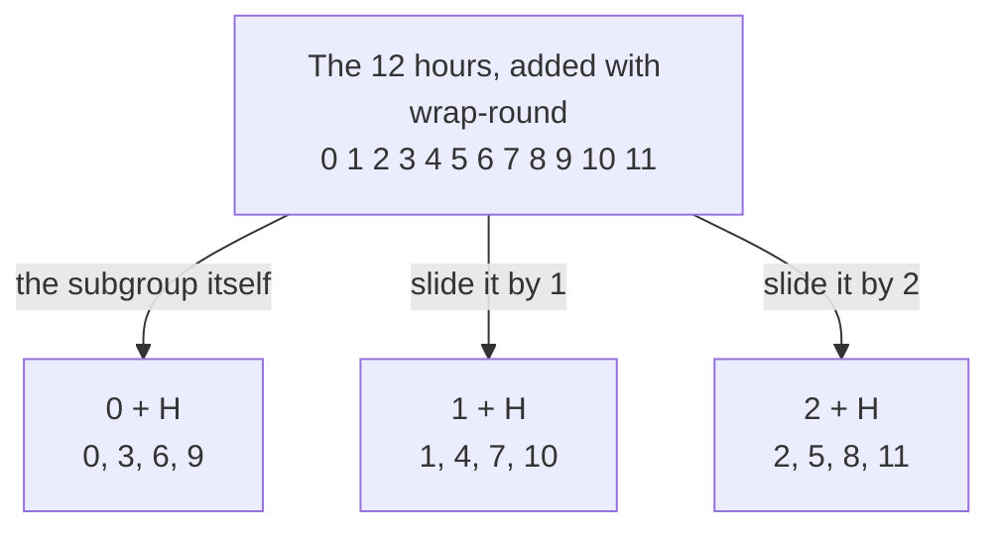

# Cosets and Lagrange's theorem: a subgroup slices the group into equal blocks, so its size divides the group's size

[Syllabus](../../../SYLLABUS.md) → [Algebra](../../../SYLLABUS.md#w03) → [Groups](../../../SYLLABUS.md#w03-s08) → Cosets and Lagrange's theorem

---

## General Overview

A 12-hour clock carries twelve hour marks, 0 to 11, and adding hours wraps round: 11 o'clock plus one hour reads 0. The twelve hours under that addition are a group: a set with one operation, a member that changes nothing, and an undo for every member ([Groups](01-groups.md)).

Inside them sit the quarter marks. From 0, keep adding 3: 0, 3, 6, 9, then 0 again. Those four are closed under the same addition and hold each other's undos, so they are a group in their own right — a **subgroup**, here called H.

Now slide H. Add 1 to every member: 1, 4, 7, 10. Add 2: 2, 5, 8, 11. Add 3 and the original four are back. Three sets, four hours each, every hour in exactly one. A slid copy of a subgroup is a **coset**, the word used from here on.

Nothing about clocks made that happen: the card proves it for any finite group. Counting the blocks then turns structure into arithmetic: a subgroup's size divides the group's size. Joseph-Louis Lagrange counted permutations this way in a 1770 memoir, before groups had a name.

**A subgroup and its slid copies cut a finite group into equal blocks that do not overlap, so the group's size is the number of blocks times the subgroup's size.**

**What kind of fact this is:** a theorem, proved on this card in Why it works; the coset it counts is a definition.

### The picture: twelve hours, three blocks



Sliding by 3 draws no fourth arrow: it returns to the first block.

---

## The formula

Notation first, in words. Bars count members: $\lvert G\rvert$ is how many members G has, read "the order of G". Square brackets with a colon, $[G:H]$, count the distinct cosets — the **index** of H in G. An unnamed group's operation is written $*$; here it is wrap-round addition.

$$g * H = \{\,g * h \text{ for every } h \text{ in } H\,\}$$

**Read it aloud:** combine one member of the group with each member of the subgroup in turn; the results are one coset.

On the clock, $1 + H$ is 1, 4, 7, 10. Lagrange's theorem is one line of counting:

$$\lvert G\rvert = [G:H] \times \lvert H\rvert$$

**Read it aloud:** the group's member count is the number of blocks times the members in one block.

The right side is a whole number of copies of $\lvert H\rvert$: that is what "divides" means, 12 = 3 × 4.

| Symbol | Plain meaning | In our example | Push it up and the answer… |
| --- | --- | --- | --- |
| $G$ | the whole group | hours 0 to 11 | more room for blocks |
| $H$ | a subgroup: a subset that is itself a group | 0, 3, 6, 9 | fewer, fatter blocks |
| $g$, $a$, $b$ | members of $G$ used as slides | 1, 2, 4 | two slides can name one block |
| $h$, $k$ | members of $H$, running over all of it | 3, 6 | — |
| $g * H$ | one coset: $H$ slid by $g$ | 1, 4, 7, 10 | — |
| $\lvert G\rvert$, $\lvert H\rvert$ | member counts | 12 and 4 | — |
| $[G:H]$ | the index: distinct cosets | 3 | smaller blocks |
| $g^{-1}$ | the undo of $g$ | 11, since 11 + 1 wraps to 0 | — |

### When it holds

- **A finite group.** Cosets slice infinite groups too, but with no count there is nothing to divide.
- **A real subgroup, not a subset of the right size.** It must hold the member that changes nothing, any two members' combination, and every undo. Drop one and the copies overlap: those of 0, 3, 6, 7 make 12 sets, 48 slots for 12 hours.
- **One side at a time.** Right-hand slides give as many blocks of the same size, but where order matters the two collections can differ, so a proof must keep to one side.

---

## Why it works

### Step 0: sliding can be undone, so blocks are equal

Slide 0, 3, 6, 9 by 1, then slide the result by 11: the original four come back, since 11 + 1 wraps to 0.

In any group, sliding by $g$ is undone by sliding by $g^{-1}$, so it fuses no members and misses none. It matches $H$ to $g * H$ one for one: every coset holds as many members as $H$, four here.

### Step 1: blocks that share a member are equal

Slide by 4 and the hours 4, 7, 10, 1 appear — the same block as $1 + H$, from a different start, because 4 − 1 = 3 sits in H.

In general, if two cosets share a member, combining one slide's undo with the other lands in H, and each coset's members are then the other's: two cosets are identical or share nothing.

<details>
<summary>Detailed proof: two cosets that meet are equal</summary>

Suppose $a * H$ and $b * H$ share a member: $a * h = b * k$ for some $h$ and $k$ in H. Combine on the left with $b^{-1}$, then on the right with $h^{-1}$: $b^{-1} * a = k * h^{-1}$, which is in H, since subgroups hold undos and combinations.

Since $b^{-1} * a$ is in H, so is $(b^{-1} * a) * h$ for every $h$ in H. And $a * h = b * ((b^{-1} * a) * h)$, so every member of $a * H$ lies in $b * H$. Swapping $a$ and $b$ puts $b * H$ inside $a * H$, so the sets are equal. No step needed the operation to ignore order.

</details>

### Step 2: nothing is left out

A subgroup holds the member that changes nothing, 0 here, so $g * H$ contains $g$: every member is in a coset, its own. Hour 5 is in $5 + H$, the block 2, 5, 8, 11.

### Step 3: count the blocks

The blocks are all the size of H, no two overlap unless equal, and together they hold everyone. Counting a block at a time gives blocks times block size: 12 = 3 × 4. As arithmetic, 4 divides 12.

Combining a member with itself repeatedly gives a cycle that is a subgroup, of size that member's **order** ([Subgroups and cyclic groups](02-subgroups-and-cyclic-groups.md)). So every member's order divides the group's size.

### Step 4: Euler's theorem is the same count

Keep the twelve hours and multiply instead of adding, still wrapping at 12. Most hours lose their undo: no hour times 2 reads 1, since 2 times anything is even. The hours keeping one share no factor with 12 ([Euler's totient](../../02-Number%20theory/04-Powers%20on%20the%20Clock/03-eulers-totient.md)): 1, 5, 7 and 11, which is what phi(12) counts. They combine to give each other and each has an undo inside — a group of size 4, the **units** of the 12-clock.

Step 3 says every member's order divides 4, so four multiplies is a whole number of return trips to 1: each of 1, 5, 7 and 11 to the fourth power reads 1. That is Euler's theorem at this modulus ([Euler's theorem](../../02-Number%20theory/04-Powers%20on%20the%20Clock/04-eulers-theorem.md)), counted in blocks.

<details>
<summary>What Lagrange does not promise</summary>

The theorem runs one way. The units group has size 4 and its members' orders are 1, 2, 2 and 2: each divides 4, none is 4. In bigger groups a divisor of the size need not be any subgroup's size either. A prime dividing a group's size does give a member of that order — here 2 divides 4, and orders of 2 appear — which is Cauchy's theorem, a separate result this card does not prove.

</details>

A second road reaches the same partition: two members are related when combining one's undo with the other lands in H. That relation is reflexive, symmetric and transitive, and such a relation cuts a set into non-overlapping classes ([Equivalence relations and partitions](../../01-Foundations/08-Relations%20and%20Functions/06-equivalence-relations-and-partitions.md)) — the cosets.

---

## Worked numbers, by hand

| Step | Arithmetic | Value |
| --- | --- | --- |
| the subgroup | from 0, keep adding 3 | 0, 3, 6, 9 |
| slide by 1, then by 2 | add 1, then 2, to each | 1, 4, 7, 10 and 2, 5, 8, 11 |
| distinct blocks | sliding by 3 returns the first | **3** |
| every hour once | 3 blocks × 4 hours | **12** |
| the units | sharing no factor with 12 | 1, 5, 7, 11 |
| their orders | 5 × 5 wraps to 1, and so do 7 × 7, 11 × 11 | 1, 2, 2, 2 |
| each unit to the fourth | every order divides 4 | **1** |

Three blocks of four account for all twelve, so 4 divides 12; the same count inside the units makes each one to the fourth power read 1.

### What breaks if you drop a piece

| Mistake | Comes out at | What went wrong |
| --- | --- | --- |
| Block size read as block count | 4 × 4 = 16 slots for 12 hours | Index and block size are different counts |
| Using 0, 3, 6, 7, no subgroup | 12 copies × 4 = 48 slots | 3 + 7 is 10, outside, so copies overlap |
| Twelve hours as a multiplication group | 2 multiplied in 12 times reads 4 | Only hours with undos form a group |

The code prints all three.

---

## Code, from first principles, and it actually runs

Nothing is imported. The blocks are built twice by roads sharing no arithmetic: sliding H to every position and dropping repeats, and sorting the hours on their remainder after division by 3, which never mentions H. The units are found twice too, by Euclid's algorithm and by hunting a multiplying partner.

### Python

```python
# Cosets and Lagrange's theorem -- the check behind the card.  Nothing is
# imported.  The group is the 12-hour clock: the hours 0 to 11, added and
# wrapped at 12.  The subgroup is H = 0, 3, 6, 9.  Its blocks are built twice,
# by roads that share no arithmetic, and the clock's units then give Euler.
N, H, K = 12, [0, 3, 6, 9], [0, 3, 6, 7]

def slide(members, g):                   # road one: shift a whole set by g
    return tuple(sorted((g + m) % N for m in members))

def gcd(a, b):                           # Euclid's algorithm, written out here
    while b:
        a, b = b, a % b
    return a

def power(a, k):                         # a multiplied in k times, wrapped at 12
    out = 1
    for _ in range(k):
        out = out * a % N
    return out

def order(a):                            # the first count of multiplies reading 1
    k = 1
    while power(a, k) != 1:
        k += 1
    return k

def yn(claim):
    return "yes" if claim else "no"

blocks = sorted({slide(H, g) for g in range(N)})
by_remainder = sorted(tuple(x for x in range(N) if x % 3 == r) for r in range(3))
index = len(blocks)
hours = sorted(x for b in blocks for x in b)
coprime = [a for a in range(N) if gcd(a, N) == 1]      # road one to the units
units = [a for a in range(N)                           # road two to the units
         if any(a * b % N == 1 for b in range(N))]
phi = len(coprime)
orders = [order(a) for a in units]
copies_of_k = {slide(K, g) for g in range(N)}

print(f"clock size {N}; subgroup H = {H}, size {len(H)}; distinct blocks {index}")
for b in blocks:
    print(f"{b[0]} + H  ->  {list(b)}")
print(f"the same three blocks, by remainder after dividing by 3: {yn(blocks == by_remainder)}")
print(f"every hour exactly once: {index} blocks x {len(H)} hours = {index * len(H)}")
print(f"shift 4 names the block shift 1 names: {yn(slide(H, 4) == slide(H, 1))}, and 4 - 1 = 3 sits in H")
print(f"hours sharing no factor with 12, by gcd: {coprime}; phi(12) = {phi}")
print(f"the same hours, by hunting a multiplying partner: {units}")
print(f"orders of {units} under multiplication: {orders}")
print(f"every order divides phi(12): {yn(all(phi % d == 0 for d in orders))}")
print(f"each unit multiplied in {phi} times: {[power(a, phi) for a in units]}")
print(f"mistake 1, block size read as the block count: 4 x 4 = {len(H) * len(H)}, not {N}")
print(f"mistake 2, K = {K} is no subgroup: {len(copies_of_k)} shifted copies x "
      f"{len(K)} hours = {len(copies_of_k) * len(K)} slots for {N} hours")
print(f"mistake 3, every hour taken as a multiplier: 2 multiplied in {N} times = {power(2, N)}, not 1")
assert blocks == by_remainder                                  # two roads, one partition
assert hours == list(range(N)) and index * len(H) == N          # covers, and counts
assert coprime == units and phi == 4                            # two roads to the units
assert orders == [1, 2, 2, 2] and all(power(a, phi) == 1 for a in units)
print("ALL CHECKS PASS")
```

**Ran 2026-09-14 on macOS, Python 3.14.6, standard library only. All checks passed. Output, pasted from the run:**

```
clock size 12; subgroup H = [0, 3, 6, 9], size 4; distinct blocks 3
0 + H  ->  [0, 3, 6, 9]
1 + H  ->  [1, 4, 7, 10]
2 + H  ->  [2, 5, 8, 11]
the same three blocks, by remainder after dividing by 3: yes
every hour exactly once: 3 blocks x 4 hours = 12
shift 4 names the block shift 1 names: yes, and 4 - 1 = 3 sits in H
hours sharing no factor with 12, by gcd: [1, 5, 7, 11]; phi(12) = 4
the same hours, by hunting a multiplying partner: [1, 5, 7, 11]
orders of [1, 5, 7, 11] under multiplication: [1, 2, 2, 2]
every order divides phi(12): yes
each unit multiplied in 4 times: [1, 1, 1, 1]
mistake 1, block size read as the block count: 4 x 4 = 16, not 12
mistake 2, K = [0, 3, 6, 7] is no subgroup: 12 shifted copies x 4 hours = 48 slots for 12 hours
mistake 3, every hour taken as a multiplier: 2 multiplied in 12 times = 4, not 1
ALL CHECKS PASS
```

### Rust

Same numbers, same labels, built with `rustc --edition 2021 -O`.

```rust
// Cosets and Lagrange's theorem -- the same check as the Python, in Rust.  No
// crates.  The group is the 12-hour clock: the hours 0 to 11, added and
// wrapped at 12.  The subgroup is H = 0, 3, 6, 9.  Its blocks are built twice,
// by roads that share no arithmetic, and the clock's units then give Euler.
const N: i64 = 12;

fn slide(members: &[i64], g: i64) -> Vec<i64> {    // road one: shift a whole set by g
    let mut out: Vec<i64> = members.iter().map(|&m| (g + m).rem_euclid(N)).collect();
    out.sort();
    out
}

fn translates(members: &[i64]) -> Vec<Vec<i64>> {  // the distinct shifted copies
    let mut out: Vec<Vec<i64>> = Vec::new();
    for g in 0..N {
        let c = slide(members, g);
        if !out.contains(&c) { out.push(c) }
    }
    out.sort();
    out
}

fn gcd(mut a: i64, mut b: i64) -> i64 {            // Euclid's algorithm, written out here
    while b != 0 { (a, b) = (b, a % b) }
    a
}

fn power(a: i64, k: i64) -> i64 {                  // a multiplied in k times, wrapped at 12
    let mut out = 1;
    for _ in 0..k { out = out * a % N }
    out
}

fn order(a: i64) -> i64 {                          // the first count of multiplies reading 1
    let mut k = 1;
    while power(a, k) != 1 { k += 1 }
    k
}

fn yn(claim: bool) -> &'static str { if claim { "yes" } else { "no" } }

fn main() {
    let (h, k_set): (Vec<i64>, Vec<i64>) = (vec![0, 3, 6, 9], vec![0, 3, 6, 7]);
    let blocks = translates(&h);
    let mut by_remainder: Vec<Vec<i64>> =
        (0..3).map(|r| (0..N).filter(|x| x % 3 == r).collect()).collect();
    by_remainder.sort();
    let index = blocks.len() as i64;
    let mut hours: Vec<i64> = blocks.iter().flatten().copied().collect();
    hours.sort();
    let coprime: Vec<i64> = (0..N).filter(|&a| gcd(a, N) == 1).collect();       // road one
    let units: Vec<i64> = (0..N).filter(|&a| (0..N).any(|b| a * b % N == 1)).collect();
    let phi = coprime.len() as i64;
    let orders: Vec<i64> = units.iter().map(|&a| order(a)).collect();
    let powers: Vec<i64> = units.iter().map(|&a| power(a, phi)).collect();
    let copies = translates(&k_set);
    println!("clock size {}; subgroup H = {:?}, size {}; distinct blocks {}", N, h, h.len(), index);
    for b in &blocks { println!("{} + H  ->  {:?}", b[0], b) }
    println!("the same three blocks, by remainder after dividing by 3: {}", yn(blocks == by_remainder));
    println!("every hour exactly once: {} blocks x {} hours = {}", index, h.len(), index * h.len() as i64);
    println!("shift 4 names the block shift 1 names: {}, and 4 - 1 = 3 sits in H", yn(slide(&h, 4) == slide(&h, 1)));
    println!("hours sharing no factor with 12, by gcd: {:?}; phi(12) = {}", coprime, phi);
    println!("the same hours, by hunting a multiplying partner: {:?}", units);
    println!("orders of {:?} under multiplication: {:?}", units, orders);
    println!("every order divides phi(12): {}", yn(orders.iter().all(|d| phi % d == 0)));
    println!("each unit multiplied in {} times: {:?}", phi, powers);
    println!("mistake 1, block size read as the block count: 4 x 4 = {}, not {}", h.len() * h.len(), N);
    println!("mistake 2, K = {:?} is no subgroup: {} shifted copies x {} hours = {} slots for {} hours",
             k_set, copies.len(), k_set.len(), copies.len() * k_set.len(), N);
    println!("mistake 3, every hour taken as a multiplier: 2 multiplied in {} times = {}, not 1", N, power(2, N));
    assert!(blocks == by_remainder);                                  // two roads, one partition
    assert!(hours == (0..N).collect::<Vec<i64>>() && index * h.len() as i64 == N);
    assert!(coprime == units && phi == 4);                            // two roads to the units
    assert!(orders == vec![1, 2, 2, 2] && units.iter().all(|&a| power(a, phi) == 1));
    println!("ALL CHECKS PASS");
}
```

**Ran 2026-09-14 on macOS, rustc 1.98.1, no crates. All checks passed. Output, pasted from the run:**

```
clock size 12; subgroup H = [0, 3, 6, 9], size 4; distinct blocks 3
0 + H  ->  [0, 3, 6, 9]
1 + H  ->  [1, 4, 7, 10]
2 + H  ->  [2, 5, 8, 11]
the same three blocks, by remainder after dividing by 3: yes
every hour exactly once: 3 blocks x 4 hours = 12
shift 4 names the block shift 1 names: yes, and 4 - 1 = 3 sits in H
hours sharing no factor with 12, by gcd: [1, 5, 7, 11]; phi(12) = 4
the same hours, by hunting a multiplying partner: [1, 5, 7, 11]
orders of [1, 5, 7, 11] under multiplication: [1, 2, 2, 2]
every order divides phi(12): yes
each unit multiplied in 4 times: [1, 1, 1, 1]
mistake 1, block size read as the block count: 4 x 4 = 16, not 12
mistake 2, K = [0, 3, 6, 7] is no subgroup: 12 shifted copies x 4 hours = 48 slots for 12 hours
mistake 3, every hour taken as a multiplier: 2 multiplied in 12 times = 4, not 1
ALL CHECKS PASS
```

The two outputs match line for line.

> [!TIP]
> **Try changing**
> Guess first, then run it. The asserts are pinned to the quarter-hour subgroup, so expect one to stop the program.
> - **Half-hours.** Set `H` to `[0, 6]`: six blocks of two, twelve in all. The first assert stops it, since the second road still slices by remainder after 3.
> - **Break the subgroup.** Set `H` to `[0, 3, 6]`: 3 + 6 is 9, now outside, so the copies overlap and the run reports 12 copies, not blocks.
> - **Loosen the factor test.** Change `gcd(a, N) == 1` to `gcd(a, N) <= 2`: the first road to the units drags in even hours, the second does not, and the third assert stops it.

---

## The usual mistake

> [!warning]
> **Counting the slides instead of the blocks.** All twelve hours name a coset, but only three sets appear: sliding by 4 gives the same four hours as sliding by 1, because 4 − 1 = 3 is inside H. The index counts sets, not attempts.
>
> - **Block size read as block count.** Four blocks of four would need 16 slots on a 12-hour clock; the truth is 3 × 4 = 12.
> - **Any subset of the right size.** The hours 0, 3, 6, 7 are no subgroup, since 3 + 7 is 10; their copies make 12 sets, 48 slots for 12 hours.
> - **Multiplying where undos are missing.** All twelve hours under multiplication are no group: 2 multiplied in 12 times reads 4, not 1.

---

## Where you meet it in real life

- **Clock and calendar arithmetic.** The three blocks here are the remainder classes of division by 3: a congruence class is a coset, seen from the group side.
- **Public-key cryptography.** RSA rests on Euler's theorem ([Euler's theorem](../../02-Number%20theory/04-Powers%20on%20the%20Clock/04-eulers-theorem.md)), which Step 4 reaches as a block count.
- **Symmetry.** The turns of a square tile are a subgroup of the ways it can be set down, so those ways fall into equal blocks — counted in [Group actions](08-group-actions-and-counting.md).

> **Say it back**
> A coset is a subgroup slid to a new place by one member of the group. Sliding can be undone, so every coset is the subgroup's size, and two cosets sharing a member are the same coset. Every member sits in one, so the group's size is the block count times the block size. On the clock the quarter marks give three blocks of four; the same count on the hours coprime to 12 is Euler's theorem.

---

## What this builds on

- [Subgroups and cyclic groups](02-subgroups-and-cyclic-groups.md): the subgroup test, and a member's order.
- [Equivalence relations and partitions](../../01-Foundations/08-Relations%20and%20Functions/06-equivalence-relations-and-partitions.md): why non-overlapping classes can be counted block by block.
- [Euler's totient](../../02-Number%20theory/04-Powers%20on%20the%20Clock/03-eulers-totient.md): the count phi(12) = 4.
- [Euler's theorem](../../02-Number%20theory/04-Powers%20on%20the%20Clock/04-eulers-theorem.md): the same conclusion by shuffling remainders.

## Where this goes next

- [Homomorphisms and isomorphisms](05-homomorphisms-and-isomorphisms.md): maps whose equal-value blocks are one subgroup's cosets.
- [Group actions](08-group-actions-and-counting.md): equal blocks counting arrangements.
- Covering spaces: the index counting sheets above a space.
- The Galois correspondence: subgroups sized by the index.
- Group action and homogeneous space: cosets forming a smooth space.

The blocks are so far a list of sets with no way to combine two of them; when they form a group of their own is [Normal subgroups and quotient groups](06-normal-subgroups-and-quotient-groups.md).

---

## Sources

Verified 14 Sep 2026: every link below resolves to the publisher's page.

- Judson, Thomas W. *Abstract Algebra: Theory and Applications*, 2020. [Publisher page and full text](https://scholarworks.sfasu.edu/ebooks/23/). Free and complete; proves the partition, the sizes and Lagrange.
- Dummit, David S., and Richard M. Foote. *Abstract Algebra*, 3rd ed. Wiley, 2003. [Publisher page](https://www.wiley.com/en-us/Abstract+Algebra%2C+3rd+Edition-p-9780471433347). Cosets, the index, and where left and right differ.
- Artin, Michael. *Algebra*, Classic Version, 2nd ed. Pearson. [Publisher page](https://www.pearson.com/en-us/subject-catalog/p/Artin-Algebra-Classic-Version-2nd-Edition/P200000006078/9780137980994). Chapter 2 reads Lagrange off the coset count.
- O'Connor, J. J., and E. F. Robertson. "Joseph-Louis Lagrange." MacTutor Archive, University of St Andrews. [Biography](https://mathshistory.st-andrews.ac.uk/Biographies/Lagrange/). Dates the 1770 memoir on permutations of the roots.
