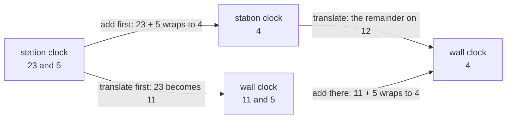

# Homomorphisms and isomorphisms: maps that respect the operation, and when two groups are the same group in different clothes

Algebra → Groups → Maps between groups → Homomorphisms and isomorphisms

---

## General Overview

A station clock shows 23:00. The café's wall clock shows 11. Both are right: one counts the whole day, the other half of it.

Wait five hours. The station clock reads 04:00; the wall clock goes 11, 12, 1, 2, 3, 4 (its 12 counts as 0). Two routes, one answer: add on the station clock and translate afterwards, or translate first and add on the wall clock. Both give 4.

A translation between groups that survives the operation is a **homomorphism**. This one is honest about adding and still forgetful: 11:00 and 23:00 both read 11.

A translation that forgets nothing is an **isomorphism**. A square tile has four turns: none, a quarter, a half, three quarters. Rename a quarter turn as 1 and the four behave exactly like the readings 0, 1, 2, 3 on a four-hour clock.

**A homomorphism carries the operation across unharmed; an isomorphism loses nothing either, so the two groups are one group wearing two sets of labels.**

**What kind of fact this is:** a definition — two of them — with the small theorems that follow from it proved on this card in Why it works.

### The picture: two routes, one answer



The top route adds, then translates; the bottom translates, then adds. A homomorphism promises the square closes.

---

## The formula

A group is a set with one operation. Where the operation could be either group's, this wing writes it as a star: $a * b$ means "combine these two as this group does". Call the group translated from $G$, the one translated into $H$, the translation $f$. Then $f$ is a homomorphism when

$$f(a * b) = f(a) * f(b)$$

holds for every pair $a$, $b$ in $G$ — the left star $G$'s operation, the right star $H$'s.

**Read it aloud:** combine, then translate, and the answer is the same as translate, then combine.

Both clocks add, one wrapping at 24 and one at 12, and the map takes the remainder on division by 12, so here the rule reads $f(a + b) = f(a) + f(b)$ with each addition done on its own clock.

| Symbol | Plain meaning | In our example | Change it and… |
| --- | --- | --- | --- |
| $f$ | the translation, a function between groups | remainder on division by 12 | another map may wreck the operation |
| $G$, $H$ | the groups translated from and into | the 24 station readings, the 12 wall readings | other members, other answers |
| $a$, $b$ | any two members of $G$ | 23 and 5 | every pair must hold, or none |
| $*$ | the operation of the group it sits in | addition round a clock face | on the tile, one turn then another |
| $e$ | the identity: changes nothing | 0 on either clock | fixed by the group |
| $a^{-1}$ | the member that undoes $a$ | 13 undoes 11 | no inverse, no group |
| $\ker f$, $f(G)$ | the kernel and the image, below | {0, 12}, all 12 readings | a bigger kernel, a smaller image |

The **kernel**, $\ker f$, holds the members of $G$ sent to the identity of $H$: the readings with remainder zero, 0 and 12. The **image**, $f(G)$, holds what $f$ reaches: all twelve readings. An **isomorphism** is a homomorphism that is one-to-one and onto — a bijection, from [injective-surjective-bijective](../../01-Foundations/08-Relations%20and%20Functions/04-injective-surjective-bijective.md).

### When it holds

- **Both groups and both operations must be named.** A formula alone is not a homomorphism.
- **The map must be well defined.** Wrapping at 24 cannot disturb a wall-clock answer, since 24 is a multiple of 12. Aimed at a ten-hour clock it can: only 300 pairs survive.
- **The rule must hold for every pair,** all 576 here, 24 readings by 24, and an isomorphism needs one-to-one and onto too. The clock map is onto, not one-to-one.

---

## Why it works

### Step 0: nothing has to survive except the operation

The members of a group are furniture. What makes it a group is how the operation behaves, so the operation is all a translation can be asked to respect.

### Step 1: the identity and the inverses come along free

The identity combined with itself is the identity, so $f(e) = f(e) * f(e)$ in $H$. Combine both sides with the inverse of $f(e)$: one copy cancels, and $f(e)$ is the identity of $H$. A member combined with its inverse gives the identity, so their translations combine to the identity too: an inverse translates to an inverse. Neither fact was assumed; both are forced.

That is already a test: shifting every reading up by one sends 0 to 1, so it is no homomorphism.

### Step 2: the kernel counts what the map cannot see

Combine one member with the inverse of another. Their translations cancel exactly when the two landed in the same place, so the combination lies in the kernel exactly when the two collide. Hence a homomorphism is one-to-one exactly when its kernel holds nothing but the identity.

Here the kernel is {0, 12}, so each reading has two sources: 11 comes from 11 and from 23. Twelve pairs, and 24 divided by 2 is 12, the size of the image. The pairs are cosets of the kernel from [cosets-and-lagranges-theorem](04-cosets-and-lagranges-theorem.md), which is why they match in size. The kernel is itself a subgroup.

### Step 3: an isomorphism is a translation with nothing lost

Take the tile and only its turns. One turn after another is a turn, so the four are a group. Label each by its number of quarter turns.

Two tables can then be built without shared arithmetic: one by turning the tile and reading which single turn matches, one by adding labels on a four-hour clock. All 16 cells agree, and the labelling pairs each turn with one reading while using every reading — an isomorphism. Its inverse respects the operation too: pull two readings back to turns, combine, translate forward, and the rule returns their combination. So the naming runs both ways: neither group is the original.

Member counts prove nothing. The numbers 1, 3, 5, 7 multiplied with wrapping at 8 also form a group of four, and there every member combined with itself returns to 1: steps home 1, 2, 2, 2, against 1, 4, 2, 4 for the turns.

<details>
<summary>Detailed proof</summary>

Here $f$ is a homomorphism from $G$ to $H$, and $e$ is the identity of either group.

**Identity and inverses.** $e * e = e$, so $f(e) = f(e) * f(e)$; combining both sides with the inverse of $f(e)$ leaves $f(e) = e$. And $a * a^{-1} = e$, where $a^{-1}$ combines with $a$ to give the identity, so $f(a) * f(a^{-1}) = e$: inverses are unique, so $f(a^{-1})$ is the inverse of $f(a)$.

**The kernel is a subgroup.** If $f(a) = e$ and $f(b) = e$ then $f(a * b) = e * e = e$, and $f(a^{-1})$ is the inverse of $e$, which is $e$.

**Collisions.** $f(a) = f(b)$ exactly when $f(a) * f(b)^{-1} = e$, and that left side is $f(a * b^{-1})$: two members collide exactly when $a * b^{-1}$ lies in the kernel, so a kernel holding only $e$ forces $a = b$.

</details>

A second route runs the other way: glue the two readings that must count as one and see what group is left. That is [normal-subgroups-and-quotient-groups](06-normal-subgroups-and-quotient-groups.md).

---

## Worked numbers, by hand

The clock map on the pair 23 and 5.

| Step | Arithmetic | Value |
| --- | --- | --- |
| evening reading, translated | 23 mod 12 | 11 |
| add first, station clock | 23 + 5 wraps to 4 | 4 |
| translate first, wall clock | 11 + 5 wraps to 4 | **4** |
| every pair, both routes | 576 tried | **576 agree** |
| kernel: readings sent to 0 | remainder zero | {0, 12} |
| readings reached | 24 divided by 2 | **12** |

Two readings share each answer: 11 comes from 11 and from 23. Turns are recorded by where corners 0, 1, 2, 3 land, so a quarter turn is [1, 2, 3, 0]. The table composes corner maps; adding labels on a four-hour clock gives the same rows.

| Turn, then turn | 0 | 1 | 2 | 3 |
| --- | --- | --- | --- | --- |
| 0 | 0 | 1 | 2 | 3 |
| 1 | 1 | 2 | 3 | 0 |
| 2 | 2 | 3 | 0 | 1 |
| 3 | 3 | 0 | 1 | 2 |

**All 16 cells agree: one group, two sets of labels.** Against that, 1, 3, 5, 7 multiplied with wrapping at 8 give steps home of 1, 2, 2, 2, not 1, 4, 2, 4.

### What breaks if you drop a piece

| Mistake | Comes out at | What went wrong |
| --- | --- | --- |
| Shift every reading up by one | 0 of 576 agree | 0 goes to 1, not to the identity |
| Aim at a ten-hour clock | 300 of 576 agree | 24 wraps to 4 there, not to 0 |
| Call the clock map an isomorphism | 11 and 23 both read 11 | Two members in the kernel |
| Match the turns to 1, 3, 5, 7 mod 8 | 4 steps home against 2 | Equal size, different tables |

Both checks print these.

---

## Code, from first principles, and it actually runs

Nothing is imported, and each answer is reached twice by roads sharing no arithmetic: add then translate against translate then add; the image size counted from the readings reached, then got by dividing 24 by the kernel's size; the tile's table built by composing corner maps, then by adding labels.

### Python

```python
# Homomorphisms and isomorphisms -- the check behind the card.  Nothing is
# imported.  The 24-hour clock is sent onto the 12-hour clock by f(x) = x mod 12,
# and the tile's four quarter turns are matched against the 4-clock.  Every
# number quoted on the card is printed here, and each answer is reached twice.
DAY, HALF, QUARTERS = 24, 12, 4
QUARTER = (1, 2, 3, 0)   # a quarter turn sends corners 0 1 2 3 here; compose it for the rest

def add_then_send(a, b): return ((a + b) % DAY) % HALF        # road one
def send_then_add(a, b): return (a % HALF + b % HALF) % HALF  # road two
def after(p, q): return tuple(p[q[i]] for i in range(QUARTERS))
def row(v): return "[" + ", ".join(str(x) for x in v) + "]"

def agreeing_pairs(g, ring):           # pairs a map gets right, out of all 576
    return sum(1 for a in range(DAY) for b in range(DAY)
               if g((a + b) % DAY) == (g(a) + g(b)) % ring)

def order(x, combine, home):           # how many copies of x it takes to get home
    y, n = x, 1
    while y != home:
        y, n = combine(y, x), n + 1
    return n

pairs = [(a, b) for a in range(DAY) for b in range(DAY)]
road_one = [add_then_send(a, b) for a, b in pairs]
road_two = [send_then_add(a, b) for a, b in pairs]
same = sum(1 for x, y in zip(road_one, road_two) if x == y)
kernel = [x for x in range(DAY) if x % HALF == 0]
shows_11 = [x for x in range(DAY) if x % HALF == 11]
reached = sorted({x % HALF for x in range(DAY)})
shifted = agreeing_pairs(lambda x: (x + 1) % HALF, HALF)
tenner = agreeing_pairs(lambda x: x % 10, 10)
turns = [tuple(range(QUARTERS)), QUARTER, after(QUARTER, QUARTER), after(after(QUARTER, QUARTER), QUARTER)]
by_turning = [[turns.index(after(turns[a], turns[b])) for b in range(QUARTERS)]
              for a in range(QUARTERS)]
by_clock = [[(a + b) % QUARTERS for b in range(QUARTERS)] for a in range(QUARTERS)]
cells = sum(1 for a in range(QUARTERS) for b in range(QUARTERS)
            if by_turning[a][b] == by_clock[a][b])
turn_orders = [order(t, after, turns[0]) for t in turns]
unit_orders = [order(u, lambda a, b: a * b % 8, 1) for u in (1, 3, 5, 7)]

print(f"the 24-hour clock onto the 12-hour clock, f(x) = x mod {HALF}")
print(f"add then send against send then add: {same} of {len(pairs)} pairs agree")
print(f"23 and 5: add first gives {add_then_send(23, 5)}, send first gives {send_then_add(23, 5)}")
print(f"kernel, the readings sent to 0: {row(kernel)}, size {len(kernel)}")
print(f"the two 24-hour readings that both show 11: {row(shows_11)}")
print(f"readings reached: {len(reached)}, and {DAY} / {len(kernel)} = {DAY // len(kernel)}")
print(f"wrong map, shift by one, x -> (x + 1) mod 12: {shifted} of {len(pairs)} pairs agree")
print(f"wrong map, onto a 10-clock, x -> x mod 10: {tenner} of {len(pairs)} pairs agree")
print("the tile's four turns, where corners 0 1 2 3 land: " + " ".join(row(p) for p in turns))
print("turn a then turn b, counted in quarter turns:      " + " ".join(row(r) for r in by_turning))
print("a + b on the 4-clock:                              " + " ".join(row(r) for r in by_clock))
print(f"the two tables agree in {cells} of 16 cells")
print(f"quarter turns to get home, the four turns: {row(turn_orders)}")
print(f"steps to get home, 1 3 5 7 multiplied mod 8: {row(unit_orders)}")
assert road_one == road_two and same == len(pairs)
assert kernel == [0, 12] and shows_11 == [11, 23] and len(reached) == DAY // len(kernel)
assert by_turning == by_clock and cells == 16
assert shifted == 0 and tenner == 300 and turn_orders == [1, 4, 2, 4] and unit_orders == [1, 2, 2, 2]
print("ALL CHECKS PASS")
```

**Ran 2026-09-14 on macOS, Python 3.14.6, standard library only. All checks passed. Output, pasted from the run:**

```
the 24-hour clock onto the 12-hour clock, f(x) = x mod 12
add then send against send then add: 576 of 576 pairs agree
23 and 5: add first gives 4, send first gives 4
kernel, the readings sent to 0: [0, 12], size 2
the two 24-hour readings that both show 11: [11, 23]
readings reached: 12, and 24 / 2 = 12
wrong map, shift by one, x -> (x + 1) mod 12: 0 of 576 pairs agree
wrong map, onto a 10-clock, x -> x mod 10: 300 of 576 pairs agree
the tile's four turns, where corners 0 1 2 3 land: [0, 1, 2, 3] [1, 2, 3, 0] [2, 3, 0, 1] [3, 0, 1, 2]
turn a then turn b, counted in quarter turns:      [0, 1, 2, 3] [1, 2, 3, 0] [2, 3, 0, 1] [3, 0, 1, 2]
a + b on the 4-clock:                              [0, 1, 2, 3] [1, 2, 3, 0] [2, 3, 0, 1] [3, 0, 1, 2]
the two tables agree in 16 of 16 cells
quarter turns to get home, the four turns: [1, 4, 2, 4]
steps to get home, 1 3 5 7 multiplied mod 8: [1, 2, 2, 2]
ALL CHECKS PASS
```

### Rust

Same numbers and labels, built with `rustc --edition 2021 -O`.

```rust
// Homomorphisms and isomorphisms -- the same check as the Python, in Rust.  No
// crates.  The 24-hour clock is sent onto the 12-hour clock by f(x) = x mod 12,
// and the tile's four quarter turns are matched against the 4-clock.  Every
// number quoted on the card is printed here, and each answer is reached twice.
const DAY: i64 = 24;
const HALF: i64 = 12;
const QUARTERS: usize = 4;
const QUARTER: [usize; 4] = [1, 2, 3, 0];  // a quarter turn sends corners 0 1 2 3 here
fn add_then_send(a: i64, b: i64) -> i64 { ((a + b) % DAY) % HALF }        // road one
fn send_then_add(a: i64, b: i64) -> i64 { (a % HALF + b % HALF) % HALF }  // road two
fn after(p: &[usize], q: &[usize]) -> Vec<usize> { (0..QUARTERS).map(|i| p[q[i]]).collect() }
fn row<T: std::fmt::Display>(v: &[T]) -> String {
    let parts: Vec<String> = v.iter().map(|x| x.to_string()).collect();
    format!("[{}]", parts.join(", "))
}
fn agreeing_pairs(g: &dyn Fn(i64) -> i64, ring: i64) -> usize {  // pairs a map gets right
    let mut n = 0;
    for a in 0..DAY { for b in 0..DAY {
        if g((a + b) % DAY) == (g(a) + g(b)) % ring { n += 1; }
    } }
    n
}
fn turn_order(t: &[usize], home: &[usize]) -> usize {   // turns until the tile is home
    let (mut p, mut n) = (t.to_vec(), 1);
    while p != home { p = after(&p, t); n += 1; }
    n
}
fn unit_order(u: i64) -> usize {        // multiplications by u, mod 8, until back to 1
    let (mut v, mut n) = (u, 1);
    while v != 1 { v = v * u % 8; n += 1; }
    n
}
fn main() {
    let (mut road_one, mut road_two) = (Vec::new(), Vec::new());
    for a in 0..DAY { for b in 0..DAY {
        road_one.push(add_then_send(a, b));
        road_two.push(send_then_add(a, b));
    } }
    let pairs = road_one.len();
    let same = (0..pairs).filter(|&i| road_one[i] == road_two[i]).count();
    let kernel: Vec<i64> = (0..DAY).filter(|x| x % HALF == 0).collect();
    let shows_11: Vec<i64> = (0..DAY).filter(|x| x % HALF == 11).collect();
    let mut reached: Vec<i64> = (0..DAY).map(|x| x % HALF).collect();
    reached.sort(); reached.dedup();
    let shifted = agreeing_pairs(&|x| (x + 1) % HALF, HALF);
    let tenner = agreeing_pairs(&|x| x % 10, 10);
    let (half, id) = (after(&QUARTER, &QUARTER), (0..QUARTERS).collect::<Vec<usize>>());
    let turns: Vec<Vec<usize>> = vec![id, QUARTER.to_vec(), half.clone(), after(&half, &QUARTER)];
    let by_turning: Vec<Vec<usize>> = (0..QUARTERS).map(|a| (0..QUARTERS).map(|b| {
        let c = after(&turns[a], &turns[b]);
        turns.iter().position(|t| *t == c).unwrap()
    }).collect()).collect();
    let by_clock: Vec<Vec<usize>> = (0..QUARTERS)
        .map(|a| (0..QUARTERS).map(|b| (a + b) % QUARTERS).collect()).collect();
    let cells: usize = (0..QUARTERS)
        .map(|a| (0..QUARTERS).filter(|&b| by_turning[a][b] == by_clock[a][b]).count()).sum();
    let turn_orders: Vec<usize> = turns.iter().map(|t| turn_order(t, &turns[0])).collect();
    let unit_orders: Vec<usize> = [1, 3, 5, 7].iter().map(|&u| unit_order(u)).collect();
    let lists = |v: &Vec<Vec<usize>>| v.iter().map(|r| row(r)).collect::<Vec<String>>().join(" ");
    println!("the 24-hour clock onto the 12-hour clock, f(x) = x mod {}", HALF);
    println!("add then send against send then add: {} of {} pairs agree", same, pairs);
    println!("23 and 5: add first gives {}, send first gives {}", add_then_send(23, 5), send_then_add(23, 5));
    println!("kernel, the readings sent to 0: {}, size {}", row(&kernel), kernel.len());
    println!("the two 24-hour readings that both show 11: {}", row(&shows_11));
    println!("readings reached: {}, and {} / {} = {}", reached.len(), DAY, kernel.len(), DAY / kernel.len() as i64);
    println!("wrong map, shift by one, x -> (x + 1) mod 12: {} of {} pairs agree", shifted, pairs);
    println!("wrong map, onto a 10-clock, x -> x mod 10: {} of {} pairs agree", tenner, pairs);
    println!("the tile's four turns, where corners 0 1 2 3 land: {}", lists(&turns));
    println!("turn a then turn b, counted in quarter turns:      {}", lists(&by_turning));
    println!("a + b on the 4-clock:                              {}", lists(&by_clock));
    println!("the two tables agree in {} of 16 cells", cells);
    println!("quarter turns to get home, the four turns: {}", row(&turn_orders));
    println!("steps to get home, 1 3 5 7 multiplied mod 8: {}", row(&unit_orders));
    assert!(road_one == road_two && same == pairs);
    assert!(kernel == vec![0, 12] && shows_11 == vec![11, 23] && reached.len() as i64 == DAY / kernel.len() as i64);
    assert!(by_turning == by_clock && cells == 16);
    assert!(shifted == 0 && tenner == 300 && turn_orders == vec![1, 4, 2, 4] && unit_orders == vec![1, 2, 2, 2]);
    println!("ALL CHECKS PASS");
}
```

**Ran 2026-09-14 on macOS, rustc 1.98.1, no crates. All checks passed. Output, pasted from the run:**

```
the 24-hour clock onto the 12-hour clock, f(x) = x mod 12
add then send against send then add: 576 of 576 pairs agree
23 and 5: add first gives 4, send first gives 4
kernel, the readings sent to 0: [0, 12], size 2
the two 24-hour readings that both show 11: [11, 23]
readings reached: 12, and 24 / 2 = 12
wrong map, shift by one, x -> (x + 1) mod 12: 0 of 576 pairs agree
wrong map, onto a 10-clock, x -> x mod 10: 300 of 576 pairs agree
the tile's four turns, where corners 0 1 2 3 land: [0, 1, 2, 3] [1, 2, 3, 0] [2, 3, 0, 1] [3, 0, 1, 2]
turn a then turn b, counted in quarter turns:      [0, 1, 2, 3] [1, 2, 3, 0] [2, 3, 0, 1] [3, 0, 1, 2]
a + b on the 4-clock:                              [0, 1, 2, 3] [1, 2, 3, 0] [2, 3, 0, 1] [3, 0, 1, 2]
the two tables agree in 16 of 16 cells
quarter turns to get home, the four turns: [1, 4, 2, 4]
steps to get home, 1 3 5 7 multiplied mod 8: [1, 2, 2, 2]
ALL CHECKS PASS
```

> [!TIP]
> **Try changing**
> Guess first, then run it.
> - **Break the second road.** In `send_then_add`, make the final wrap 11 rather than 12. Of 576 pairs, 264 still agree, and the first assert stops the program.
> - **Move the kernel.** Pick readings with remainder 1: it prints [1, 13], right size and wrong set, and the second assert stops it.
> - **Nudge the tile.** In `by_clock`, add 1 before wrapping. The tables stop matching and the third assert fires.

---

## The usual mistake

> [!warning]
> **Treating a homomorphism as a translation that can be undone.** Respecting the operation says nothing about keeping information: the clock map respects addition on all 576 pairs and still throws away half a day, since 11:00 and 23:00 both read 11. The undoable version is the isomorphism, which needs one-to-one and onto as well.
>
> - **Confusing the image with the target group.** The image is only what the map reaches. Here the two coincide, all 12 readings reached — a fact about this map, not a rule.
> - **Hunting for zero instead of the identity.** The kernel is what lands on the identity: 0 on these clocks, but usually 1 where the operation is multiplication.
> - **Counting members to match two groups.** Four and four proves nothing: a quarter turn needs four repeats to come home, each of 1, 3, 5, 7 mod 8 needs two.

---

## Where you meet it in real life

- **Coarser readings of the same quantity.** A 12-hour display, a date cut to its weekday, a price rounded to the dollar: arithmetic kept, detail dropped, the kernel naming the loss.
- **Remainders and check digits.** Sending whole numbers to their remainder is the homomorphism behind barcode and account-number checks.
- **Symmetry written as arithmetic.** The tile's turns become addition on a four-hour clock, the trade that lets [permutations-and-the-symmetric-group](03-permutations-and-the-symmetric-group.md) compute shuffles rather than draw them.

> **Say it back**
> A homomorphism is a map between two groups that survives the operation: combine then translate, or translate then combine, for the same answer. The 24-hour clock onto the 12-hour clock is one, on all 576 pairs. Its kernel is {0, 12}, so each wall reading has two sources and the map cannot be undone. One-to-one comes exactly when the kernel holds only the identity; add onto as well and it is an isomorphism, two sets of labels on one group — as the tile's turns and the four-hour clock are.

---

## What this builds on

- [cosets-and-lagranges-theorem](04-cosets-and-lagranges-theorem.md): the equal-sized pieces a subgroup cuts a group into.
- [permutations-and-the-symmetric-group](03-permutations-and-the-symmetric-group.md): turns recorded as where corners land, and composed.
- [functions](../../01-Foundations/08-Relations%20and%20Functions/02-functions.md): what a map is, and when it has an inverse.
- [injective-surjective-bijective](../../01-Foundations/08-Relations%20and%20Functions/04-injective-surjective-bijective.md): one-to-one and onto.

## Where this goes next

- [normal-subgroups-and-quotient-groups](06-normal-subgroups-and-quotient-groups.md): glue each kernel pair into one member and the wall clock appears with no map.
- [direct-products](07-direct-products.md): a bigger group built from two smaller ones, and how to spot one.
- the-fundamental-group: loops followed one after another, where a map of shapes becomes a homomorphism.
- dirichlet-characters: homomorphisms from clock arithmetic to numbers on a circle.
- representations-in-outline: homomorphisms into groups of matrices.

Collapsing this kernel would turn a lossy map into an exact match — but not every subgroup can be collapsed, and the next card says which.

---

## Sources

Verified 14 Sep 2026: every link below resolves to the publisher's page.

- Judson, Thomas W. *Abstract Algebra: Theory and Applications*, section 11.1, "Group Homomorphisms." Free open edition, hosted by LibreTexts. [Textbook section](https://math.libretexts.org/Bookshelves/Abstract_and_Geometric_Algebra/Abstract_Algebra%3A_Theory_and_Applications_(Judson)/11%3A_Homomorphisms/11.01%3A_Group_Homomorphisms). The definition in standard notation, kernel and image proved subgroups.
- Dummit, David S., and Richard M. Foote. *Abstract Algebra*, 3rd ed., section 1.6, "Homomorphisms and Isomorphisms." Wiley, 2003. [Publisher page](https://www.wiley.com/en-us/Abstract+Algebra%2C+3rd+Edition-p-9780471433347) (paid). The reference treatment.
- O'Connor, J. J., and E. F. Robertson. "Abstract groups." MacTutor History of Mathematics Archive, University of St Andrews. [History article](https://mathshistory.st-andrews.ac.uk/HistTopics/Abstract_groups/). The slow arrival of the group as a structure in its own right.
