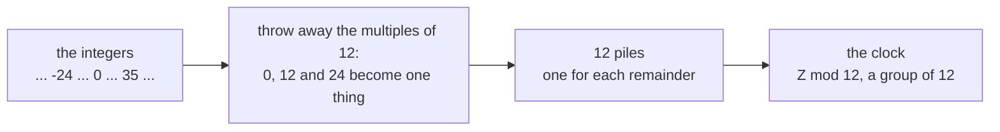

# Normal subgroups and quotient groups: collapsing a group by a subgroup, and Z mod n is the model

[Syllabus](../../../SYLLABUS.md) → [Algebra](../../../SYLLABUS.md#w03) → [Groups](../../../SYLLABUS.md#w03-s08) → Normal subgroups and quotient groups

---

## General Overview

A wall clock has twelve marks. Count fifteen hours on from midnight and the hand stops at 3. Count nine hours back and it stops at 3 again. Fifteen and -9 differ by 24, two whole turns the face cannot see.

So the clock is the whole numbers with the multiples of 12 thrown away. Sort the integers from -24 to 35 by "these two differ by a multiple of 12" and 12 piles come out, with an addition of their own: pile 7 plus pile 8 is pile 3.

Two things went right. The multiples of 12 are a subgroup of the integers under addition, and the piles add cleanly: no answer depends on which member named a pile. The second is fragile, as a square tile shows. The tile sits down 8 ways, 4 turns and 4 flips; throw away the 4 turns and the report "turn or flip" still combines, 8 moves becoming 2 piles. Throw away do nothing and one chosen flip instead, and those 4 piles will not combine at all.

**A subgroup can be collapsed to a point exactly when it looks the same from every position in the group; its piles are then a group in their own right, and the clock is that construction on the integers.**

**What kind of fact this is:** a definition — normality is a test a subgroup passes or fails — carrying one theorem, proved below: collapse a group by what a map forgets and a copy of its image is left.

### The picture: the integers, collapsed



Every integer lands in one pile, and the piles add.

---

## The formula

A **coset** is a pile: apply a member $g$ of the group $G$ in front of every member of the subgroup $N$, giving $gN$ — $g + N$ under addition. Cosets cut a group into equal piles: [Cosets and Lagrange's theorem](04-cosets-and-lagranges-theorem.md).

The **conjugate** of a move by $g$ is three steps: undo $g$, do the move, do $g$ again — $g^{-1}$ is the undo of $g$, rightmost factor first. Conjugate every move of $N$ and the set $gNg^{-1}$ comes out: $N$ seen from another position. $N$ is **normal** in $G$ when that set is $N$ again:

$$gNg^{-1} = N \quad\text{for every } g \text{ in } G$$

**Read it aloud:** from every position in the group, the subgroup is the same subgroup.

Equivalently, applying $g$ after each member of $N$ gives that same pile. Either way, piles combine by combining names:

$$(gN)(kN) = (gk)N$$

These piles are the **quotient group** $G/N$, said "G over N", with $N$ as identity; a finite $G$ gives as many piles as its size divided by that of $N$.

A homomorphism $\varphi$ maps one group to another, respecting the operation ([Homomorphisms and isomorphisms](05-homomorphisms-and-isomorphisms.md)). Its **kernel** is all it sends to the identity, its **image** all it reaches. Then:

$$G/\ker\varphi \;\cong\; \operatorname{im}\varphi$$

That is the **first isomorphism theorem**; the sign means isomorphic, one group under two sets of names.

| Symbol | Plain meaning | In our example | Change it and… |
| --- | --- | --- | --- |
| $G$ | the group collapsed | the integers; the tile's 8 moves | another group |
| $N$ | the subgroup thrown away | multiples of 12; the 4 turns | piles resize |
| $g$, $k$, $h$ | pile names, $h$ from $N$ | 15, -9, a quarter turn | nothing, the point |
| $gN$, $kN$ | the coset, $g$ before all $N$ | pile 3: ... -9, 3, 15 ... | another of the 12 |
| $G/N$ | the quotient: piles plus operation | Z mod 12; the 2-clock | another quotient |
| $\varphi$, $\ker\varphi$, $\operatorname{im}\varphi$ | the map; what it kills; what it reaches | 24-clock to 12-clock; 0, 12; 12 hours | still paired |

### When it holds

- $N$ must be a subgroup first, or its piles differ in size.
- The test covers every member of $G$: the tile's flip subgroup survives the half turn, dies at the quarter turn.
- Normality concerns $N$ inside $G$, never $N$ alone, and needs no finiteness: the integers do not run out.
- Where moves commute every subgroup passes, a conjugate being the original move, so the clock could not fail.

---

## Why it works

### Step 0: normality removes the choice of name

Pile 3 is the set ... -9, 3, 15, 27 ... and every member names the whole pile, so "pile 15 plus pile 8" and "pile 3 plus pile 8" must agree. That is **well-defined**: the answer belongs to the piles, not the names. So rename $gN$ as $g$ then a subgroup member $h$, and $kN$ as $k$ then $h'$, and combine, slipping the undo of $k$ beside $k$:

$$(gh)(kh') = (gk)\,(k^{-1}hk)\,h'$$

The middle bracket is $h$ conjugated by the undo of $k$. Normality returns it to $N$, and with $h'$ it stays there, so the product sits in $(gk)N$: the pile the first names gave. Let one conjugate escape and two names for one pile push to different piles, leaving no operation. Associativity, identity and inverses come free from $G$.

### Step 1: the clock passes for free, the tile does not

Adding integers ignores order, so a conjugate is the original addition and every subgroup of the integers is normal. Its 12 piles are the remainder buckets of [Residue classes](../../02-Number%20theory/03-Clock%20Arithmetic/03-residue-classes.md), built twice in the check: from differences, and from remainders.

The tile does not commute, so the test bites. A turn conjugated by a turn is a turn, and by a flip the reversed turn, still a turn: all 32 conjugates of the 4 turns stay turns. So 8 moves collapse to 2 piles, and two flips make a turn — the 2-clock, Z mod 2. A second road never names a pile: take each move as where it sends the 4 corners. Those maps rebuild all 64 products, and a flip is the corners running backwards, a count adding mod 2. Quicker still, any subgroup leaving exactly 2 piles is normal, the other pile being the leftovers.

The failure: keep do nothing and one chosen flip, a subgroup since that flip twice is do nothing. A quarter turn carries the mirror line with the tile, so the conjugate is a different flip, `(2, 1)` — two quarter turns, then 1 for flipped — outside the subgroup, while the half turn returns it unchanged. One position is no test. And do nothing and the flip name one pile, yet each with a quarter turn lands in `[(1, 0), (1, 1)]` and `[(3, 0), (3, 1)]`: one product, 2 answers.

<details>
<summary>Normal also means whole families of look-alikes</summary>

Conjugate moves are one move seen from different positions; a family of them is a **conjugacy class**. The tile group has 5, of sizes 1, 1, 2, 2, 2, and a subgroup is normal exactly when built from whole families: the turns are 1 + 1 + 2 = 4, the flip subgroup only half of a family of 2.

</details>

### Step 2: every homomorphism hands over a quotient

The 24-hour clock maps to the 12-hour clock by the remainder after 12: 13:00 is 1 o'clock, and addition survives. Its kernel is 0 and 12, a subgroup of 2; its image is all 12 hours. Kernels are always normal, since the map sends a conjugate to the image of $g$, the identity, then the undo of that image. Collapse by the kernel: 24 over 2 is 12 piles, each labelled by the value its members share — one-to-one, onto the image, addition-respecting on 576 pairs. The 12-clock, renamed.

<details>
<summary>Detailed proof of the first isomorphism theorem</summary>

Let $\varphi$ run from $G$ to a second group, with kernel $N$.
1. **$N$ is normal.** $\varphi$ sends $ghg^{-1}$ to the image of $g$, the identity, then the undo of that image, so $gNg^{-1}$ lies in $N$; the same line with $g^{-1}$ gives the reverse.
2. **Labelling $gN$ by the image of $g$ is well-defined and one-to-one.** If $gN$ and $kN$ are one pile, the undo of $k$ with $g$ lies in $N$, so the two share an image; equal images force the reverse.
3. **Onto and operation-keeping.** Every value reached is some $g$'s image, the label of $gN$, and $(gk)N$ carries the images of $g$ and $k$ combined. An isomorphism.

</details>

Every normal subgroup is a kernel too: the map sending $g$ to $gN$ forgets exactly $N$.

---

## Worked numbers, by hand

The clock, then the tile.

| Step | Arithmetic or check | Value |
| --- | --- | --- |
| integers -24 to 35, by differences of 12 | 12 piles two ways | **12 piles** |
| conjugates of the tile's 4 turns | all 32 stay turns; 8 / 4 | **normal, 2 piles** |
| one pile, two names, each with a quarter turn | `[(1, 0), (1, 1)]` and `[(3, 0), (3, 1)]` | **2 answers** |
| the 24-clock by the kernel 0 and 12 | 24 / 2 | **12 piles, the 12-clock** |

Two genuine subgroups: one collapses to a working group, one to no group at all.

### What breaks if you drop a piece

| Mistake | Comes out at | What went wrong |
| --- | --- | --- |
| "Subgroup" read as licence | 2 answers for one product | the product moved with the names |
| Counting members, not piles | 8 instead of 2 | a quotient's members are piles |
| Testing one position | the flip subgroup passes | the quarter turn breaks it |
| Collapsing by the whole group | 1 pile against an image of 12 | one pile cannot match 12 |

The code prints all four.

---

## Code, from first principles, and it actually runs

Nothing is imported. Two answers come by roads sharing no arithmetic. The clock's piles are built from differences, with no remainder operator, and again from remainders. The tile's quotient comes once from cosets, once from the corners themselves. The failing subgroup is then pushed until it splits, and the 24-clock collapsed by its kernel.

### Python

```python
# Normal subgroups and quotient groups -- the check behind the card.  No imports.
# Two collapses: the integers by the multiples of 12, giving the clock, and the 8 ways a
# square tile sits down, by its 4 turns.  A move is (r, f): r quarter turns, f = 1 if flipped.
def mul(a, b):                         # do b first, then a, as with functions
    return ((a[0] + (-1) ** a[1] * b[0]) % 4, a[1] ^ b[1])
def inv(a):                            # the move that undoes a
    return ((-(-1) ** a[1] * a[0]) % 4, a[1])
def pile_of(g, H):                     # the coset g * H, as a sorted tuple
    return tuple(sorted(mul(g, h) for h in H))
def act(a):                            # the tile again, as a map of the 4 corners
    return tuple((a[0] + (-1) ** a[1] * i) % 4 for i in range(4))
def multiple_of_12(d):                 # road one: no remainder operator at all
    d = -d if d < 0 else d
    while d >= 12: d -= 12
    return d == 0
back = lambda p: (p[1] - p[0]) % 4 == 3    # corners running backwards: the move flipped

W, G, Z24 = range(-24, 36), [(r, f) for r in range(4) for f in range(2)], range(24)
by_subtraction = sorted({tuple(b for b in W if multiple_of_12(a - b)) for a in W})
by_remainder = sorted({tuple(b for b in W if b % 12 == a % 12) for a in W})
print(f"integers -24 to 35 collapsed by the multiples of 12: {len(by_subtraction)} "
      f"piles by subtraction, {len(by_remainder)} by remainder")
print(f"15 and -9 read {15 % 12} and {-9 % 12} on the face; 7 plus 8 is pile {(7 + 8) % 12}")
TURNS, FLIPS = [(r, 0) for r in range(4)], [(0, 0), (0, 1)]
turns_normal = all(mul(mul(g, h), inv(g)) in TURNS for g in G for h in TURNS)
geometry = all(act(mul(a, b)) == tuple(act(a)[i] for i in act(b)) for a in G for b in G)
parity = all(back(act(mul(a, b))) == (back(act(a)) + back(act(b))) % 2 for a in G for b in G)
turn_piles = sorted({pile_of(g, TURNS) for g in G})
seats = {frozenset(mul(mul(g, a), inv(g)) for g in G) for a in G}
classes, inside = sorted(len(c) for c in seats), sorted(len(c) for c in seats if c <= set(TURNS))
print(f"tile moves {len(G)}, turns {len(TURNS)}: all {len(G) * len(TURNS)} conjugates of "
      f"a turn are turns {turns_normal}, piles {len(turn_piles)}")
print(f"the same 8 moves as corner maps: all {len(G) ** 2} products agree {geometry}; a "
      f"flip is the corners running backwards, and flips add mod 2 {parity}: the 2-clock")
print(f"classes of look-alike moves: {len(classes)}, by size {classes}; the turns are "
      f"whole classes {inside} adding to {sum(inside)}")
quarter, flip, half = (1, 0), (0, 1), (2, 0)
conj, same = mul(mul(quarter, flip), inv(quarter)), mul(mul(half, flip), inv(half))
one, two = pile_of(quarter, FLIPS), pile_of(mul(flip, quarter), FLIPS)
print(f"flip subgroup {FLIPS}, piles {len({pile_of(g, FLIPS) for g in G})}: a quarter turn "
      f"carries {flip} to {conj}, outside it; the half turn carries it to {same}, inside")
print(f"one pile, two names, each times a quarter turn: {list(one)} and {list(two)}")
ker, image = [x for x in Z24 if x % 12 == 0], sorted({x % 12 for x in Z24})
kernel_pile = lambda x: tuple(sorted((x + k) % 24 for k in ker))
labels = {p: p[0] % 12 for p in sorted({kernel_pile(x) for x in Z24})}
onto = sorted(labels.values()) == image
keeps = all(labels[kernel_pile(x + y)] == (x % 12 + y % 12) % 12 for x in Z24 for y in Z24)
print(f"24-clock under x -> x mod 12: 13 reads {13 % 12}; kernel {ker} of {len(ker)}; "
      f"piles {len(labels)}; {len(Z24)} / {len(ker)} = {len(Z24) // len(ker)}; image {len(image)}")
print(f"pile to value is one-to-one and onto the image {onto}, and keeps addition on "
      f"all {len(Z24) ** 2} pairs {keeps}")
whole = {tuple(sorted((x + k) % 24 for k in Z24)) for x in Z24}
print(f"the four mistakes: {len({one, two})} answers for one product, {len(G)} members "
      f"counted instead of {len(turn_piles)} piles, a flip subgroup passing a half-turn-only "
      f"test ({same in FLIPS}), and {len(whole)} pile against an image of {len(image)}")
assert by_subtraction == by_remainder and len(by_subtraction) == 12
assert turns_normal and geometry and parity and len(turn_piles) == 2 and inside == [1, 1, 2]
assert conj == (2, 1) and conj not in FLIPS and same == flip and one != two
assert len(labels) == len(Z24) // len(ker) == len(image) == 12 and onto and keeps
print("ALL CHECKS PASS")
```

**Ran 2026-09-14 on macOS, Python 3.14.6, standard library only. All checks passed. Output, pasted from the run:**

```
integers -24 to 35 collapsed by the multiples of 12: 12 piles by subtraction, 12 by remainder
15 and -9 read 3 and 3 on the face; 7 plus 8 is pile 3
tile moves 8, turns 4: all 32 conjugates of a turn are turns True, piles 2
the same 8 moves as corner maps: all 64 products agree True; a flip is the corners running backwards, and flips add mod 2 True: the 2-clock
classes of look-alike moves: 5, by size [1, 1, 2, 2, 2]; the turns are whole classes [1, 1, 2] adding to 4
flip subgroup [(0, 0), (0, 1)], piles 4: a quarter turn carries (0, 1) to (2, 1), outside it; the half turn carries it to (0, 1), inside
one pile, two names, each times a quarter turn: [(1, 0), (1, 1)] and [(3, 0), (3, 1)]
24-clock under x -> x mod 12: 13 reads 1; kernel [0, 12] of 2; piles 12; 24 / 2 = 12; image 12
pile to value is one-to-one and onto the image True, and keeps addition on all 576 pairs True
the four mistakes: 2 answers for one product, 8 members counted instead of 2 piles, a flip subgroup passing a half-turn-only test (True), and 1 pile against an image of 12
ALL CHECKS PASS
```

### Rust

Same numbers, same labels, built with `rustc --edition 2021 -O`.

```rust
// Normal subgroups and quotient groups -- the same check as the Python, in Rust.  No crates.
// Two collapses: the integers by the multiples of 12, giving the clock, and the 8 ways a
// square tile sits down, by its 4 turns.  A move is (r, f): r quarter turns, f = 1 if flipped.
type M = (i32, i32);
// mul does b first, then a, as with functions; inv is the move that undoes a.
fn mul(a: M, b: M) -> M { ((a.0 + if a.1 == 0 { b.0 } else { -b.0 }).rem_euclid(4), a.1 ^ b.1) }
fn inv(a: M) -> M { ((if a.1 == 0 { -a.0 } else { a.0 }).rem_euclid(4), a.1) }
fn uniq<T: Ord>(mut v: Vec<T>) -> Vec<T> { v.sort(); v.dedup(); v }
fn pile_of(g: M, h: &[M]) -> Vec<M> { uniq(h.iter().map(|&x| mul(g, x)).collect()) }
// the tile again, as a map of the 4 corners; back reads a flip off such a map
fn act(a: M) -> Vec<usize> { (0..4).map(|i| (a.0 + if a.1 == 0 { i } else { -i })
    .rem_euclid(4) as usize).collect() }
fn back(p: &[usize]) -> i32 { if (p[1] as i32 - p[0] as i32).rem_euclid(4) == 3 { 1 } else { 0 } }
// road one to the clock's piles: no remainder operator anywhere in it
fn multiple_of_12(d: i32) -> bool { let mut d = d.abs(); while d >= 12 { d -= 12; } d == 0 }
fn tf(b: bool) -> &'static str { if b { "True" } else { "False" } }
fn sorted_sizes(s: &[Vec<M>], keep: &[M], all: bool) -> Vec<usize> {
    let mut c: Vec<usize> = s.iter().filter(|p| all || p.iter().all(|m| keep.contains(m)))
        .map(|p| p.len()).collect();
    c.sort(); c
}
fn main() {
    let w: Vec<i32> = (-24..36).collect();
    let g: Vec<M> = (0..4).flat_map(|r| (0..2).map(move |f| (r, f))).collect();
    let by_subtraction = uniq(w.iter().map(|&a| w.iter().cloned()
        .filter(|&b| multiple_of_12(a - b)).collect::<Vec<i32>>()).collect::<Vec<_>>());
    let by_remainder = uniq(w.iter().map(|&a| w.iter().cloned()
        .filter(|&b| b.rem_euclid(12) == a.rem_euclid(12)).collect::<Vec<i32>>()).collect::<Vec<_>>());
    println!("integers -24 to 35 collapsed by the multiples of 12: {} piles by \
subtraction, {} by remainder", by_subtraction.len(), by_remainder.len());
    println!("15 and -9 read {} and {} on the face; 7 plus 8 is pile {}",
             15 % 12, (-9i32).rem_euclid(12), (7 + 8) % 12);
    let (turns, flips): (Vec<M>, Vec<M>) = ((0..4).map(|r| (r, 0)).collect(), vec![(0, 0), (0, 1)]);
    let turns_normal = g.iter().all(|&a| turns.iter().all(|&h| turns.contains(&mul(mul(a, h), inv(a)))));
    let geometry = g.iter().all(|&a| g.iter().all(|&b| act(mul(a, b))
        == act(b).iter().map(|&i| act(a)[i]).collect::<Vec<usize>>()));
    let parity = g.iter().all(|&a| g.iter().all(|&b|
        back(&act(mul(a, b))) == (back(&act(a)) + back(&act(b))) % 2));
    let turn_piles = uniq(g.iter().map(|&a| pile_of(a, &turns)).collect::<Vec<_>>());
    let seats = uniq(g.iter().map(|&a| uniq(g.iter().map(|&x| mul(mul(x, a), inv(x)))
        .collect::<Vec<M>>())).collect::<Vec<_>>());
    let (classes, inside) = (sorted_sizes(&seats, &turns, true), sorted_sizes(&seats, &turns, false));
    println!("tile moves {}, turns {}: all {} conjugates of a turn are turns {}, piles {}",
             g.len(), turns.len(), g.len() * turns.len(), tf(turns_normal), turn_piles.len());
    println!("the same 8 moves as corner maps: all {} products agree {}; a flip is the \
corners running backwards, and flips add mod 2 {}: the 2-clock", g.len() * g.len(), tf(geometry), tf(parity));
    println!("classes of look-alike moves: {}, by size {:?}; the turns are whole classes \
{:?} adding to {}", classes.len(), classes, inside, inside.iter().sum::<usize>());
    let (quarter, flip, half) = ((1, 0), (0, 1), (2, 0));
    let (conj, same) = (mul(mul(quarter, flip), inv(quarter)), mul(mul(half, flip), inv(half)));
    let flip_piles = uniq(g.iter().map(|&a| pile_of(a, &flips)).collect::<Vec<_>>());
    let (one, two) = (pile_of(quarter, &flips), pile_of(mul(flip, quarter), &flips));
    println!("flip subgroup {:?}, piles {}: a quarter turn carries {:?} to {:?}, outside \
it; the half turn carries it to {:?}, inside", flips, flip_piles.len(), flip, conj, same);
    println!("one pile, two names, each times a quarter turn: {:?} and {:?}", one, two);
    let z24: Vec<i32> = (0..24).collect();
    let ker: Vec<i32> = z24.iter().cloned().filter(|x| x % 12 == 0).collect();
    let image = uniq(z24.iter().map(|x| x % 12).collect::<Vec<i32>>());
    let kp = |x: i32| -> Vec<i32> { uniq(ker.iter().map(|k| (x + k).rem_euclid(24)).collect()) };
    let piles = uniq(z24.iter().map(|&x| kp(x)).collect::<Vec<_>>());
    let mut vals: Vec<i32> = piles.iter().map(|p| p[0] % 12).collect(); vals.sort();
    let onto = vals == image;
    let keeps = z24.iter().all(|&x| z24.iter().all(|&y| kp(x + y)[0] % 12 == (x % 12 + y % 12) % 12));
    println!("24-clock under x -> x mod 12: 13 reads {}; kernel {:?} of {}; piles {}; {} / {} = {}; image {}",
             13 % 12, ker, ker.len(), piles.len(), z24.len(), ker.len(), z24.len() / ker.len(), image.len());
    println!("pile to value is one-to-one and onto the image {}, and keeps addition on all \
{} pairs {}", tf(onto), z24.len() * z24.len(), tf(keeps));
    let whole = uniq(z24.iter().map(|&x| uniq(z24.iter().map(|k| (x + k).rem_euclid(24))
        .collect::<Vec<i32>>())).collect::<Vec<_>>());
    println!("the four mistakes: {} answers for one product, {} members counted instead of \
{} piles, a flip subgroup passing a half-turn-only test ({}), and {} pile against an image \
of {}", uniq(vec![one.clone(), two.clone()]).len(), g.len(), turn_piles.len(),
             tf(flips.contains(&same)), whole.len(), image.len());
    assert!(by_subtraction == by_remainder && by_subtraction.len() == 12);
    assert!(turns_normal && geometry && parity && turn_piles.len() == 2 && inside == vec![1, 1, 2]);
    assert!(conj == (2, 1) && !flips.contains(&conj) && same == flip && one != two);
    assert!(piles.len() == z24.len() / ker.len() && z24.len() / ker.len() == image.len()
            && image.len() == 12 && onto && keeps);
    println!("ALL CHECKS PASS");
}
```

**Ran 2026-09-14 on macOS, rustc 1.98.1, no crates. All checks passed. Output, pasted from the run:**

```
integers -24 to 35 collapsed by the multiples of 12: 12 piles by subtraction, 12 by remainder
15 and -9 read 3 and 3 on the face; 7 plus 8 is pile 3
tile moves 8, turns 4: all 32 conjugates of a turn are turns True, piles 2
the same 8 moves as corner maps: all 64 products agree True; a flip is the corners running backwards, and flips add mod 2 True: the 2-clock
classes of look-alike moves: 5, by size [1, 1, 2, 2, 2]; the turns are whole classes [1, 1, 2] adding to 4
flip subgroup [(0, 0), (0, 1)], piles 4: a quarter turn carries (0, 1) to (2, 1), outside it; the half turn carries it to (0, 1), inside
one pile, two names, each times a quarter turn: [(1, 0), (1, 1)] and [(3, 0), (3, 1)]
24-clock under x -> x mod 12: 13 reads 1; kernel [0, 12] of 2; piles 12; 24 / 2 = 12; image 12
pile to value is one-to-one and onto the image True, and keeps addition on all 576 pairs True
the four mistakes: 2 answers for one product, 8 members counted instead of 2 piles, a flip subgroup passing a half-turn-only test (True), and 1 pile against an image of 12
ALL CHECKS PASS
```

The two outputs match line for line.

> [!TIP]
> **Try changing**
> Guess first, then run it. An assert halts the program on a wrong number.
> - **Collapse by six.** In `multiple_of_12`, subtract 6: 6 piles by subtraction against 12 by remainder, and the first assert halts it.
> - **Make the tile commutative.** In `mul`, drop the sign flip. The corner maps stop matching the products, the chosen flip stops moving, and the second assert halts it.
> - **Use the wrong kernel.** Pick multiples of 8: 3 members, 8 piles, image still 12, counts adrift.

---

## The usual mistake

> [!warning]
> **Assuming any subgroup can be collapsed.** Cosets exist for every subgroup; a group of cosets does not. The tile's flip subgroup cuts the 8 moves into 4 piles of 2, and one product then has 2 answers. Subgroup is the ticket; normality the licence.
>
> - **Reading "normal" as "ordinary".** It names one property: conjugation by every member leaves the subgroup where it was.
> - **Testing one convenient position.** The half turn leaves the flip subgroup alone; the quarter turn does not.
> - **Calling a group member a member of the quotient.** Members are whole piles; counting moves gives 8, not 2.
> - **Forgetting which group the subgroup sits in.** That flip subgroup is normal inside the four-member group of it and the half turn.

---

## Where you meet it in real life

- **Clock and calendar arithmetic.** Every "mod 12" or "mod 7" is this construction on the integers ([Congruence](../../02-Number%20theory/03-Clock%20Arithmetic/01-congruence-mod-n.md)).
- **Parity reports.** Any "even or odd" rule is a quotient by a subgroup with 2 piles: turn-or-flip, or the sign of a permutation ([Permutations](03-permutations-and-the-symmetric-group.md)).
- **Ignoring detail on purpose.** A sensor reporting that a part was flipped but not how far it turned builds a quotient group, usable because the ignored moves are normal.

> **Say it back**
> Cosets cut any group into equal piles, but the piles combine only when the subgroup thrown away is normal: every conjugate of it lands back inside. That frees the product of two piles from their names. The integers by the multiples of 12 give the clock, 12 piles that add. The tile's 4 turns are normal and leave a 2-member group; its flip subgroup is not, and one of its products has 2 answers. Collapse a group by a map's kernel and a copy of its image is left.

---

## What this builds on

- [Homomorphisms and isomorphisms](05-homomorphisms-and-isomorphisms.md): operation-respecting maps, kernels, images.
- [Congruence](../../02-Number%20theory/03-Clock%20Arithmetic/01-congruence-mod-n.md): what "differ by a multiple of 12" means, and why it acts like equality.
- [Residue classes](../../02-Number%20theory/03-Clock%20Arithmetic/03-residue-classes.md): the 12 remainder buckets, here a quotient.

## Where this goes next

- [Ideals and quotient rings](../09-Rings%20and%20Fields/04-ideals-and-quotient-rings.md): the same collapse, two operations.
- [Why there is no quintic formula](../10-For%20the%20Curious/02-why-no-quintic-formula.md): chains of normal subgroups, and where they end.
- Van Kampen's theorem: quotients gluing two pieces' loop groups.
- Homology groups: holes as one quotient per dimension.
- The Galois correspondence: normal subgroups matched with fields between roots and rationals.
- Class groups: a quotient measuring how badly factorisation fails.
- Modules: the same machinery, ring multiplication allowed.

Both collapses here run on one operation; what a subgroup must satisfy when a second one appears is the next question.

---

## Sources

Verified 14 Sep 2026: every link below resolves to the publisher's page.

- Judson, Thomas W. *Abstract Algebra: Theory and Applications*. Stephen F. Austin State University. [University publication page](https://scholarworks.sfasu.edu/ebooks/23/). Normal subgroups, factor groups, isomorphism theorems.
- Hölder, Otto. "Zurückführung einer beliebigen algebraischen Gleichung auf eine Kette von Gleichungen." *Mathematische Annalen* 34 (1889), 26-56. [doi:10.1007/BF01446791](https://doi.org/10.1007/BF01446791). Where cosets first form a group in their own right.
- O'Connor, J. J., and E. F. Robertson. "The development of group theory." MacTutor History of Mathematics Archive, University of St Andrews. [History topic](https://mathshistory.st-andrews.ac.uk/HistTopics/Development_group_theory/). Records Galois, by 1832, picking out the subgroups now called normal by the test that left and right cosets agree.
