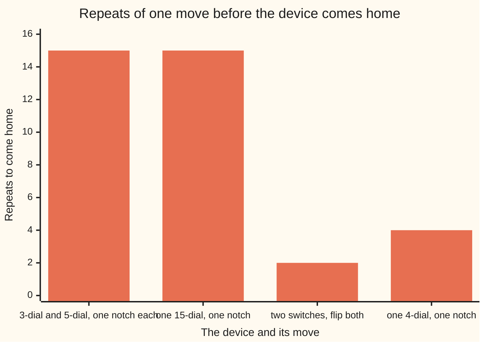
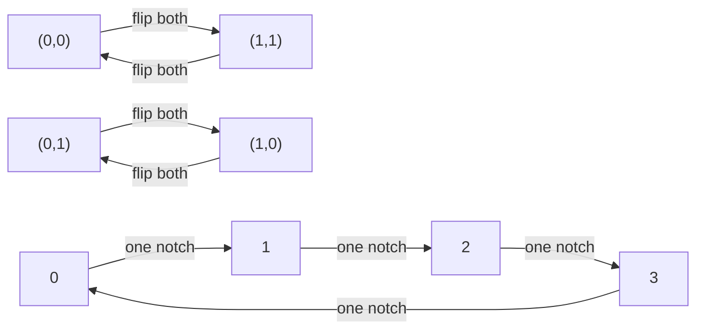

# Direct products: run two groups side by side, and when two clocks make one bigger clock

Algebra → Groups → Two groups at once → Direct products

---

## General Overview

A padlock has two dials, one with 3 positions, 0 to 2, the other with 5, 0 to 4. Each turns on its own and wraps round: 2 on the small dial plus one notch is 0. Settings in all: 3 × 5 = 15.

Turn both dials one notch together, again and again. From 0-0 the lock reads 1-1, 2-2, 0-3, 1-4, 2-0, and on through all 15 settings before coming home: one move, 15 settings, one loop — what a 15-position dial does.

Two on-off switches have four patterns: off-off, off-on, on-off, on-on. Flip both twice and the pattern is back where it started; every pattern here comes home in two flips at most, while one notch on a 4-position dial needs four. Four settings, not a 4-dial.

Both devices are two groups side by side, each combining by its own rule, neither reaching across: a **direct product**.

**Pairing two groups makes a group in which each half minds its own business: the settings multiply, while whether the pair acts like one bigger clock turns on whether the two clock sizes share a factor.**

**What kind of fact this is:** a definition, the pairing — with two theorems proved below in Why it works: a pair's return time is the least common multiple of its halves', and two clocks make one bigger clock exactly when their sizes share no factor.

### The picture: one move, four devices, how long until it comes home



The first two bars match: the padlock's joint notch and a 15-dial's notch both take 15 repeats. The last two do not: both switches flipped come home in 2, a 4-dial's notch in 4.

---

## The formula

Notation in words first. A pair goes in round brackets, the first group's member first: (2, 4). The group of all such pairs takes a cross, $G \times H$, said "G cross H" — the cross that counted 15 settings ([ordered-pairs-and-cartesian-product](../../01-Foundations/07-Sets/05-ordered-pairs-and-cartesian-product.md)). Bars count members, $\lvert G\rvert$; $*$ is whichever operation the group at hand uses; $e$, the identity, changes nothing; $\operatorname{ord}$ counts the repeats that bring a member home ([subgroups-and-cyclic-groups](02-subgroups-and-cyclic-groups.md)); $\cong$ means the same group relabelled ([homomorphisms-and-isomorphisms](05-homomorphisms-and-isomorphisms.md)).

The rule that makes the pairs a group:

$$(g, h) * (a, b) = (g * a, h * b)$$

**Read it aloud:** combine the first halves in the first group, the second halves in the second, and never let one half reach across.

Two counts follow, for finite groups and members that come home:

$$\lvert G \times H\rvert = \lvert G\rvert \times \lvert H\rvert, \qquad \operatorname{ord}(g, h) = \operatorname{lcm}(\operatorname{ord}(g), \operatorname{ord}(h))$$

Settings multiply; return times do not. The pair is home only when both halves are home at once — the least common multiple ([lcm](../../02-Number%20theory/02-Greatest%20Common%20Divisor%20and%20Euclid%27s%20Algorithm/02-lcm.md)).

| Symbol | Plain meaning | In our example | Push it up and the answer… |
| --- | --- | --- | --- |
| $G$, $H$, $\lvert G\rvert$ | the two groups, each with its own operation; how many members one has | the 3-dial, the 5-dial; 3 and 5 | more settings, longer returns |
| $G \times H$ | the direct product: every pair, one from each group | the 15 settings | — |
| $g$, $h$, $a$, $b$, $e$ | members, first group then second; $e$ changes nothing | notch counts; (0, 0) | — |
| $*$, $k$, $m$, $n$ | the group's operation; a repeat count or a reading; two clock sizes | notch addition; 0 to 14; 3 and 5 | — |
| $\operatorname{ord}$, $\operatorname{lcm}$, $\cong$ | repeats that bring a member home; smallest number two others divide into; the same group relabelled | 15 for the joint notch; lcm(3, 5) = 15; the padlock and one 15-dial | a longer joint return |

### When it holds

- **Both halves are groups already, each with its own operation.** Pair two sets with no operation and nothing combines.
- **Neither half reaches across.** A first entry depends only on first entries; a dial that drags the other is a different construction.
- **The return-time rule needs both halves to come home.** If one half never returns to its identity, neither does the pair; the size rule needs both halves finite.

---

## Why it works

### Step 0: two calculations that never meet

The four rules of a group ([groups](01-groups.md)) pass one half at a time: each half combines inside its own group, so the pair is closed; brackets move freely in each half; the pair of the two identities changes neither half; each half is undone on its own.

Swapping the order of two pairs swaps the order inside each half, so the product is commutative — order does not matter — exactly when both halves are.

### Step 1: a pair comes home when both halves do at once

Repeat a pair k times and each half has been repeated k times, separately. The first half stands at its identity at multiples of its own return time, the second at multiples of its own. Both at once wants a common multiple, and the first one is the least. That proves the second formula, in any two groups.

On the padlock the joint notch is the pair (1, 1): the 3-dial home every 3 notches, the 5-dial every 5, both first at 15 — also the number of settings, so that move reaches every one.

### Step 2: build the relabelling, not just match the counts

Equal size is not the same group, so the claim needs a relabelling that carries the operation.

Send reading k on a 15-dial to the pair (remainder of k on 3, remainder of k on 5); the code prints that grid. Remainders respect addition ([modular-addition-and-multiplication](../../02-Number%20theory/03-Clock%20Arithmetic/02-modular-addition-and-multiplication.md)), so adding then translating matches translating then adding. Two readings landing on one pair would differ by a multiple of 3 and of 5, hence of 15, since those share no factor ([coprime-numbers](../../02-Number%20theory/02-Greatest%20Common%20Divisor%20and%20Euclid%27s%20Algorithm/05-coprime-numbers.md)) — on a 15-dial, by nothing. Fifteen readings, fifteen pairs, no collisions. Writing Z mod n for the n-position clock ([residue-classes](../../02-Number%20theory/03-Clock%20Arithmetic/03-residue-classes.md)):

$$\text{Z mod 15} \;\cong\; \text{Z mod 3} \times \text{Z mod 5}$$

The reverse, for the pair (a, b):

$$k = (10a + 6b) \bmod 15$$

10 leaves remainder 1 on 3 and 0 on 5, 6 the opposite, so each coefficient carries its own dial. Pair (2, 4) gives (10 × 2 + 6 × 4) mod 15 = 14 — checked on all 15 settings, and all 225 sums.

### Step 3: why two switches are not a 4-dial



The two short loops are the switch patterns under "flip both": four patterns, never one loop. The four-node loop is the 4-dial.

Each switch is home after 2 flips, so by Step 1 no pattern's return time passes 2: the code prints 1, 2, 2, 2 against a 4-dial's 1, 4, 2, 4. A relabelling cannot change a return time — repeats match one for one through it — so a member needing four repeats must land on one needing four, and the switch group has none. It has a name: the Klein four-group.

The general rule, proved below: two clocks of m and n positions make one clock of m × n exactly when m and n share no factor above 1. Second case in the code, a 6-dial with a 4-dial: 24 settings, longest return 12.

<details>
<summary>Detailed proof</summary>

Clocks Z mod m and Z mod n; members are pairs (a, b).

**Every return time divides lcm(m, n).** The first half's divides m, the second's divides n, so both divide lcm(m, n), and by Step 1 the pair's is their least common multiple.

**No shared factor.** Then lcm(m, n) is m × n, so (1, 1) returns after m × n repeats: that many different settings in a group of exactly m × n, so all of them.

**A shared factor above 1.** Then lcm(m, n) is below m × n and every return time divides it, so no member reaches m × n settings, while an m × n clock has one — its own notch. The groups differ.

</details>

<details>
<summary>The classification, one line</summary>

Every finite commutative group is a direct product of clocks: stated here, proved nowhere on this card.

</details>

The same relabelling, done in remainders instead of pairs, is the [chinese-remainder-theorem](../../02-Number%20theory/03-Clock%20Arithmetic/06-chinese-remainder-theorem.md).

---

## Worked numbers, by hand

| Step | Arithmetic | Value |
| --- | --- | --- |
| count the settings | 3 × 5 | **15** |
| the joint notch's return time | lcm(3, 5) | **15** |
| reading 14 translated | 14 on each dial in turn | **(2, 4)** |
| that pair back to a reading | (10 × 2 + 6 × 4) mod 15 | **14** |
| two switches, each pattern | lcm of 1s and 2s | **1, 2, 2, 2** |

The two dials are one 15-dial under another name; the switches are no 4-dial under any name.

### What breaks if you drop a piece

| Mistake | Comes out at | What went wrong |
| --- | --- | --- |
| Adding the dial counts | 8 settings | every position meets every position, so counts multiply: 15 |
| Multiplying returns, not the least common multiple | 4 flips for two switches | both halves come home at 2; the extra laps are imaginary |
| Equal size read as the same group | returns 1, 2, 2, 2 against 1, 4, 2, 4 | a size is a count; a group is a count and an operation |
| The padlock argument on two switches | the joint flip reaches (0,0) and (1,1) | 2 and 2 share the factor 2, so lcm(2, 2) is 2 |

The code prints all four.

---

## Code, from first principles, and it actually runs

Nothing is imported. Each padlock return time comes out twice by roads sharing no arithmetic: repeating a pair until both dials are home, and the least common multiple of the dials' own return times, from Euclid's algorithm.

### Python

```python
# Direct products -- the check behind the card.  Nothing is imported.  A padlock
# with one 3-position dial and one 5-position dial: its group is the ordered
# pairs, each dial wrapping on its own.  Two roads: pairs are built and walked,
# and every return time is re-derived from a least common multiple.
M, N = 3, 5
def gcd(a, b):                           # Euclid, used only by the formula road
    while b: a, b = b, a % b
    return a
def lcm(a, b): return a * b // gcd(a, b)
def dial(a, m): return m // gcd(a, m)    # one dial's own return time
def add(p, q, m, n):                     # the componentwise rule
    return ((p[0] + q[0]) % m, (p[1] + q[1]) % n)
def order(p, m, n):                      # road one: repeat the pair until home
    x, k = p, 1
    while x != (0, 0):
        x, k = add(x, p, m, n), k + 1
    return k
def walk(p, m, n):                       # every setting that pair reaches
    out, x = [], (0, 0)
    while x not in out:
        out.append(x)
        x = add(x, p, m, n)
    return out
def restore(a, b): return (10 * a + 6 * b) % (M * N)    # a pair back to a reading
def show(ps): return " ".join(f"({a},{b})" for a, b in ps)
def nums(vs): return " ".join(str(v) for v in vs)
pairs = [(a, b) for a in range(M) for b in range(N)]    # every setting: 3 by 5
reads = [(k % M, k % N) for k in range(M * N)]          # reading k to its pair
cycle = walk((1, 1), M, N)
walked = [order(p, M, N) for p in reads]
formula = [lcm(dial(a, M), dial(b, N)) for a, b in reads]
sums = all(restore(*add(p, q, M, N)) == (restore(*p) + restore(*q)) % (M * N)
           for p in pairs for q in pairs)
sw = [(a, b) for a in range(2) for b in range(2)]
sw_ord, d4 = [order(p, 2, 2) for p in sw], [order((a, 0), 4, 1) for a in range(4)]
big = [order((a, b), 6, 4) for a in range(6) for b in range(4)]
print(f"padlock: {M} positions x {N} positions = {M * N} settings; pairs {len(pairs)}")
print(f"joint cycle from (1,1): {show(cycle)}")
print(f"the grid, rows the {M}-dial, columns the {N}-dial, entries the reading:")
for a in range(M):
    print(f"  row {a}" + "".join(f"{restore(a, b):>5}" for b in range(N)))
print(f"order of (1,1): walked {order((1, 1), M, N)}, lcm({M},{N}) = {lcm(M, N)}; "
      f"settings reached {len(cycle)}")
print(f"orders by reading 0 to {M * N - 1}: {nums(walked)}")
print(f"reading 14 is the pair ({14 % M},{14 % N}); the reverse "
      f"(10 x {14 % M} + 6 x {14 % N}) mod {M * N} gives {restore(14 % M, 14 % N)}")
print(f"all {len(pairs) ** 2} pair sums match the {M * N}-clock: {str(sums).lower()}")
print(f"two switches {show(sw)}: orders {nums(sw_ord)}, largest {max(sw_ord)}")
print(f"one 4-dial, readings 0 1 2 3: orders {nums(d4)}, largest {max(d4)}")
print(f"6 positions x 4 positions: {6 * 4} settings, largest order {max(big)}, "
      f"lcm(6,4) = {lcm(6, 4)}, gcd(6,4) = {gcd(6, 4)}")
print(f"mistakes: adding the dials gives {M + N} settings, not {M * N}; "
      f"multiplying the switch return times gives 4, not {order((1, 1), 2, 2)}")
print(f"the switches' joint step reaches only {show(walk((1, 1), 2, 2))}; "
      f"gcd(2,2) = {gcd(2, 2)} while gcd({M},{N}) = {gcd(M, N)}")
assert walked == formula and walked[1] == M * N and len(cycle) == M * N
assert walked == [M * N // gcd(k, M * N) for k in range(M * N)]
assert sums and sorted(reads) == pairs and all(restore(k % M, k % N) == k for k in range(M * N))
assert sw_ord == [1, 2, 2, 2] and d4 == [1, 4, 2, 4] and max(big) == lcm(6, 4)
print("ALL CHECKS PASS")
```

**Ran 2026-09-14 on macOS, Python 3.14.6, standard library only. All checks passed. Output, pasted from the run:**

```
padlock: 3 positions x 5 positions = 15 settings; pairs 15
joint cycle from (1,1): (0,0) (1,1) (2,2) (0,3) (1,4) (2,0) (0,1) (1,2) (2,3) (0,4) (1,0) (2,1) (0,2) (1,3) (2,4)
the grid, rows the 3-dial, columns the 5-dial, entries the reading:
  row 0    0    6   12    3    9
  row 1   10    1    7   13    4
  row 2    5   11    2    8   14
order of (1,1): walked 15, lcm(3,5) = 15; settings reached 15
orders by reading 0 to 14: 1 15 15 5 15 3 5 15 15 5 3 15 5 15 15
reading 14 is the pair (2,4); the reverse (10 x 2 + 6 x 4) mod 15 gives 14
all 225 pair sums match the 15-clock: true
two switches (0,0) (0,1) (1,0) (1,1): orders 1 2 2 2, largest 2
one 4-dial, readings 0 1 2 3: orders 1 4 2 4, largest 4
6 positions x 4 positions: 24 settings, largest order 12, lcm(6,4) = 12, gcd(6,4) = 2
mistakes: adding the dials gives 8 settings, not 15; multiplying the switch return times gives 4, not 2
the switches' joint step reaches only (0,0) (1,1); gcd(2,2) = 2 while gcd(3,5) = 1
ALL CHECKS PASS
```

### Rust

Same rows and labels, built with `rustc --edition 2021 -O`.

```rust
// Direct products -- the same check as the Python, in Rust.  No crates.  A
// padlock with one 3-position dial and one 5-position dial: its group is the
// ordered pairs, each dial wrapping on its own.  Two roads: pairs are built and
// walked, and every return time is re-derived from a least common multiple.
const M: i32 = 3;
const N: i32 = 5;
fn gcd(mut a: i32, mut b: i32) -> i32 {      // Euclid, used only by the formula road
    while b != 0 { let t = a % b; a = b; b = t; }
    a
}
fn lcm(a: i32, b: i32) -> i32 { a * b / gcd(a, b) }
fn dial(a: i32, m: i32) -> i32 { m / gcd(a, m) }      // one dial's own return time
fn add(p: (i32, i32), q: (i32, i32), m: i32, n: i32) -> (i32, i32) {   // componentwise
    ((p.0 + q.0) % m, (p.1 + q.1) % n)
}
fn order(p: (i32, i32), m: i32, n: i32) -> i32 {      // road one: repeat until home
    let (mut x, mut k) = (p, 1);
    while x != (0, 0) { x = add(x, p, m, n); k += 1; }
    k
}
fn walk(p: (i32, i32), m: i32, n: i32) -> Vec<(i32, i32)> {    // settings reached
    let (mut out, mut x) = (Vec::new(), (0, 0));
    while !out.contains(&x) { out.push(x); x = add(x, p, m, n); }
    out
}
fn restore(a: i32, b: i32) -> i32 { (10 * a + 6 * b) % (M * N) }   // pair to reading
fn show(ps: &[(i32, i32)]) -> String {
    ps.iter().map(|p| format!("({},{})", p.0, p.1)).collect::<Vec<_>>().join(" ")
}
fn nums(vs: &[i32]) -> String {
    vs.iter().map(|v| v.to_string()).collect::<Vec<_>>().join(" ")
}
fn main() {
    let pairs: Vec<(i32, i32)> = (0..M).flat_map(|a| (0..N).map(move |b| (a, b))).collect();
    let reads: Vec<(i32, i32)> = (0..M * N).map(|k| (k % M, k % N)).collect();
    let cycle = walk((1, 1), M, N);
    let walked: Vec<i32> = reads.iter().map(|&p| order(p, M, N)).collect();
    let formula: Vec<i32> = reads.iter().map(|&(a, b)| lcm(dial(a, M), dial(b, N))).collect();
    let sums = pairs.iter().all(|&p| pairs.iter().all(|&q| {
        let s = add(p, q, M, N);
        restore(s.0, s.1) == (restore(p.0, p.1) + restore(q.0, q.1)) % (M * N)
    }));
    let sw: Vec<(i32, i32)> = (0..2).flat_map(|a| (0..2).map(move |b| (a, b))).collect();
    let sw_ord: Vec<i32> = sw.iter().map(|&p| order(p, 2, 2)).collect();
    let d4: Vec<i32> = (0..4).map(|a| order((a, 0), 4, 1)).collect();
    let big: Vec<i32> = (0..6).flat_map(|a| (0..4).map(move |b| order((a, b), 6, 4))).collect();
    println!("padlock: {} positions x {} positions = {} settings; pairs {}",
             M, N, M * N, pairs.len());
    println!("joint cycle from (1,1): {}", show(&cycle));
    println!("the grid, rows the {}-dial, columns the {}-dial, entries the reading:", M, N);
    for a in 0..M {
        let mut line = format!("  row {}", a);
        for b in 0..N { line.push_str(&format!("{:>5}", restore(a, b))); }
        println!("{}", line);
    }
    println!("order of (1,1): walked {}, lcm({},{}) = {}; settings reached {}",
             order((1, 1), M, N), M, N, lcm(M, N), cycle.len());
    println!("orders by reading 0 to {}: {}", M * N - 1, nums(&walked));
    println!("reading 14 is the pair ({},{}); the reverse (10 x {} + 6 x {}) mod {} gives {}",
             14 % M, 14 % N, 14 % M, 14 % N, M * N, restore(14 % M, 14 % N));
    println!("all {} pair sums match the {}-clock: {}", pairs.len() * pairs.len(), M * N, sums);
    println!("two switches {}: orders {}, largest {}",
             show(&sw), nums(&sw_ord), sw_ord.iter().max().unwrap());
    println!("one 4-dial, readings 0 1 2 3: orders {}, largest {}",
             nums(&d4), d4.iter().max().unwrap());
    println!("6 positions x 4 positions: {} settings, largest order {}, lcm(6,4) = {}, gcd(6,4) = {}",
             6 * 4, big.iter().max().unwrap(), lcm(6, 4), gcd(6, 4));
    println!("mistakes: adding the dials gives {} settings, not {}; multiplying the switch return times gives 4, not {}",
             M + N, M * N, order((1, 1), 2, 2));
    println!("the switches' joint step reaches only {}; gcd(2,2) = {} while gcd({},{}) = {}",
             show(&walk((1, 1), 2, 2)), gcd(2, 2), M, N, gcd(M, N));
    assert!(walked == formula && walked[1] == M * N && cycle.len() as i32 == M * N);
    assert!(walked == (0..M * N).map(|k| M * N / gcd(k, M * N)).collect::<Vec<i32>>());
    let mut sorted = reads.clone();
    sorted.sort();
    assert!(sums && sorted == pairs && (0..M * N).all(|k| restore(k % M, k % N) == k));
    assert!(sw_ord == vec![1, 2, 2, 2] && d4 == vec![1, 4, 2, 4]
            && *big.iter().max().unwrap() == lcm(6, 4));
    println!("ALL CHECKS PASS");
}
```

**Ran 2026-09-14 on macOS, rustc 1.98.1, no crates. All checks passed. Output, pasted from the run:**

```
padlock: 3 positions x 5 positions = 15 settings; pairs 15
joint cycle from (1,1): (0,0) (1,1) (2,2) (0,3) (1,4) (2,0) (0,1) (1,2) (2,3) (0,4) (1,0) (2,1) (0,2) (1,3) (2,4)
the grid, rows the 3-dial, columns the 5-dial, entries the reading:
  row 0    0    6   12    3    9
  row 1   10    1    7   13    4
  row 2    5   11    2    8   14
order of (1,1): walked 15, lcm(3,5) = 15; settings reached 15
orders by reading 0 to 14: 1 15 15 5 15 3 5 15 15 5 3 15 5 15 15
reading 14 is the pair (2,4); the reverse (10 x 2 + 6 x 4) mod 15 gives 14
all 225 pair sums match the 15-clock: true
two switches (0,0) (0,1) (1,0) (1,1): orders 1 2 2 2, largest 2
one 4-dial, readings 0 1 2 3: orders 1 4 2 4, largest 4
6 positions x 4 positions: 24 settings, largest order 12, lcm(6,4) = 12, gcd(6,4) = 2
mistakes: adding the dials gives 8 settings, not 15; multiplying the switch return times gives 4, not 2
the switches' joint step reaches only (0,0) (1,1); gcd(2,2) = 2 while gcd(3,5) = 1
ALL CHECKS PASS
```

The two outputs match line for line.

> [!TIP]
> **Try changing**
> Guess first, then run it. The asserts are pinned to the 3-and-5 padlock.
> - **Pair the 3-dial with a 6-dial.** Set `N` to `6`. How many of the 18 settings does the joint notch reach? Six, since lcm(3, 6) is 6; the first assert stops it.
> - **Multiply the returns.** In `lcm`, drop the `// gcd(a, b)`. The padlock's 15 survives, but the 6-and-4 case claims 24 against a walked 12; the last assert stops it.
> - **Let one dial drag the other.** In `add`, add `p[0]` into the second half. The walked returns stop matching the formula.

---

## The usual mistake

> [!warning]
> **Counting the settings and thinking the group is settled.** Two switches and a 4-dial both have four settings, but in one every move is undone by doing it again, while in the other two moves need four repeats. Same count, different groups.
>
> - **Letting the halves mix.** The rule never allows the first dial to change the second.
> - **Multiplying return times.** For two switches that gives 4 where the answer is 2; it is right for 3 and 5 only because numbers sharing no factor have a least common multiple equal to their product.
> - **Expecting every group to come apart.** The pairing always builds a group; the reverse fails often. Two dials commute, and the shelf's square tile — eight moves that do not — is no pair of dials.

---

## Where you meet it in real life

- **Counters that wrap separately.** Hours and minutes, a lock's wheels, fields packed in a machine word: each is a direct product, coming home only at the least common multiple of its parts ([cycles-that-realign](../../02-Number%20theory/05-Check%20Digits%2C%20Calendars%20and%20Cycles/04-cycles-that-realign.md)).
- **Arithmetic done in pieces.** Work on a 15-clock splits into the 3-clock and the 5-clock, runs in smaller numbers, then rebuilds by the reverse formula — routine in cipher work ([rsa-in-outline](../../02-Number%20theory/06-Codes%20and%20Secrets/03-rsa-in-outline.md)).

> **Say it back**
> A direct product stores one member of two groups as an ordered pair and combines each half by its own rule. Settings multiply: dials of 3 and 5 positions make 15. Return times take the least common multiple instead, so both dials turned one notch come home after 15 notches — one move reaching every setting, which makes the padlock a 15-dial in disguise. Two switches have four settings too, but every pattern comes home in two flips where a 4-dial needs four.

---

## What this builds on

- [homomorphisms-and-isomorphisms](05-homomorphisms-and-isomorphisms.md): a reversible relabelling, and why one must be built, not inferred from a count.
- [subgroups-and-cyclic-groups](02-subgroups-and-cyclic-groups.md): a member's return time, and what it takes to reach a group.
- [chinese-remainder-theorem](../../02-Number%20theory/03-Clock%20Arithmetic/06-chinese-remainder-theorem.md): the same coprime-dial arithmetic, in remainders.
- [ordered-pairs-and-cartesian-product](../../01-Foundations/07-Sets/05-ordered-pairs-and-cartesian-product.md): the pairs, and why their count multiplies.

## Where this goes next

- van-kampens-theorem: the group of loops on a shape glued from two pieces, built from the pieces' groups — the same move where the parts interfere.
- mordell-weil-and-rank: the points on a curve form a commutative group built from clocks and copies of the whole numbers, whose count is the rank.

Pairing builds a group from parts. The reverse is harder: given a group, which parts is it made of, and what to do when the parts will not leave each other alone.

---

## Sources

Verified 14 Sep 2026: every link below resolves to the publisher's page.

- Judson, Thomas W. *Abstract Algebra: Theory and Applications*, chapters 9 and 13. Stephen F. Austin State University. [Publisher page](https://scholarworks.sfasu.edu/ebooks/23/). The direct product, a pair's return time, the coprime-clock relabelling, the classification.
- Milne, J. S. *Group Theory*. Course notes, chapter 1. [Notes page](https://www.jmilne.org/math/CourseNotes/gt.html). Products of groups in general, commuting or not.
- O'Connor, J. J., and E. F. Robertson. "The abstract group concept." MacTutor Archive, University of St Andrews. [History page](https://mathshistory.st-andrews.ac.uk/HistTopics/Abstract_groups/). Kronecker's 1870 definition of a commutative group.
