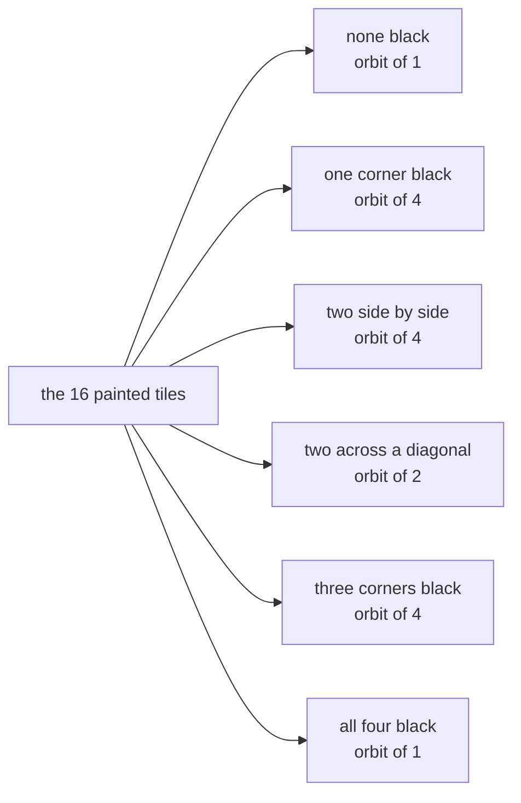
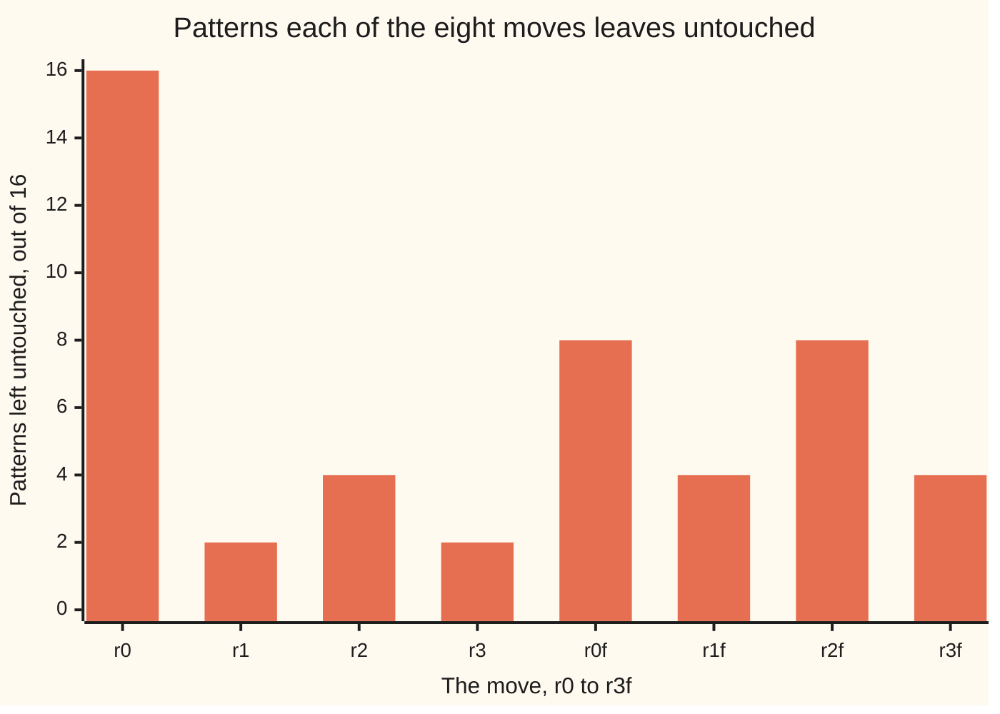

# Group actions: a group moving the members of a set, with orbit size times stabiliser size equal to the group's size

Algebra → Groups → Orbits and stabilisers → Group actions

---

## General Overview

A square ceramic tile drops into a square recess in a kitchen floor. Number its corners 0, 1, 2, 3 clockwise from the top left. The tile fits eight ways: four turns r0, r1, r2, r3 by quarters, and those four again after a flip, r0f to r3f. Those eight moves are a group ([groups](01-groups.md)).

Paint each corner black or white: 16 painted tiles. Many are one tile set down two ways — paint corner 0 black, turn the tile a quarter, and the black corner sits at position 1. Only six are genuinely different.

Each move carries a painted tile to a painted tile, so the group moves the set of 16 patterns: it is **acting** on that set. What a pattern can be carried to is its **orbit**, and the moves leaving it untouched are its **stabiliser**. All-black has orbit 1 and stabiliser 8; one black corner, orbit 4 and stabiliser 2. Both products are 8, the number of moves.

**A group acting on a set cuts it into orbits, and at every member the places it can be sent times the moves that leave it put is the size of the group.**

**What kind of fact this is:** a theorem — orbit-stabiliser — proved below from Lagrange's theorem; action, orbit and stabiliser are its definitions.

### The picture: sixteen patterns, six orbits



Six boxes holding 1, 4, 4, 2, 4 and 1 patterns, adding to 16; side-by-side and diagonal pairs cannot reach each other.

---

## The formula

The group takes the letter $G$, the set it moves takes $X$, and combining two moves keeps the star used on the cosets card, $a * b$, the right-hand move going first. The move that changes nothing is $e$ ([cosets-and-lagranges-theorem](04-cosets-and-lagranges-theorem.md)). Moving gets its own mark: a raised dot, move on the left, member of the set on the right, so $a \cdot x$ is "the pattern x after the move a". Patterns run B for black and W for white, corners 0 to 3 in order: BWWW is corner 0 black.

An action is two promises: doing nothing leaves everything put, and combining two moves before moving is the same as moving twice.

$$e \cdot x = x, \qquad (a * b) \cdot x = a \cdot (b \cdot x)$$

Each member brings two collections: Orb(x), all it can be carried to, and Stab(x), the moves leaving it alone.

$$\mathrm{Orb}(x) = \{\, a \cdot x \text{ for every } a \text{ in } G \,\}, \qquad \mathrm{Stab}(x) = \{\, a \text{ in } G \text{ with } a \cdot x = x \,\}$$

Bars count members, as on the cosets card:

$$\lvert \mathrm{Orb}(x)\rvert \times \lvert \mathrm{Stab}(x)\rvert = \lvert G\rvert$$

**Read it aloud:** the places a member can be sent, times the moves that send it nowhere, is the size of the group.

| Symbol | Plain meaning | In our example | Change it and… |
| --- | --- | --- | --- |
| $G$ | the group of moves | the tile's eight ways down | another group merges other patterns |
| $X$ | the set it moves | the 16 painted tiles | — |
| $a * b$ | two moves, the right one first | flip then quarter turn is r1f | r1 then the flip is r3f |
| $a \cdot x$ | pattern $x$ after move $a$ | r1 · BWWW = WBWW | — |
| $e$ | the move changing nothing | r0, set down unturned | — |
| Orb(x), Stab(x) | all $x$ can become; moves leaving it put | BWWW: 4 patterns, and r0 with r0f | a smaller stabiliser, a wider orbit |

### When it holds

- **Both promises, in that order.** Reversed, the second gives a right action, matching right cosets instead.
- **A finite group.** The claim is about counts, and an infinite group has nothing to multiply. The set may be endless; orbits stay no wider than $G$.
- **One member at a time.** Orbit sizes vary — 1 at all-black, 4 at one black corner — with the product 8 at each. And the set is not the group: 8 moves, 16 patterns, 6 orbits.

---

## Why it works

### Step 0: a move carries the paint with the corner

A move keeps each corner's number or negates it, then adds a fixed amount, wrapping at 4 ([groups](01-groups.md)). The paint travels with the corner, so a move turns one painted tile into another. Both promises hold: unturned changes nothing, and the flip then a quarter turn gives what r1f gives. The code checks the second on every pair of moves, against every pattern.

### Step 1: orbits cut the set into blocks that never overlap

Call two patterns related when some move carries one to the other. That holds between a pattern and itself, by $e$; it runs both ways, every move having an undo; and it chains, two moves in a row being again one move. Such a relation cuts a set into non-overlapping blocks ([equivalence-relations-and-partitions](../../01-Foundations/08-Relations%20and%20Functions/06-equivalence-relations-and-partitions.md)) — the orbits. So "how many different tiles" becomes "how many orbits": six, holding 4, 4, 4, 2, 1 and 1 patterns, adding to 16.

### Step 2: the moves landing a pattern on one spot form one coset

Fix a pattern x. Its stabiliser is a subgroup, since $e$ leaves x put and so do two such moves in a row and their undos. Pick a landing spot in the orbit and a move c reaching it. Anything in the stabiliser first, then c, reaches the same spot, and nothing else does, so the moves reaching that spot are the stabiliser slid by c — one coset ([cosets-and-lagranges-theorem](04-cosets-and-lagranges-theorem.md)).

At one black corner: 8 moves, 4 positions reached, 2 reaching each, and Lagrange's theorem counts those blocks: 8 = 4 × 2.

<details>
<summary>Detailed proof: landing spots and cosets, one for one</summary>

Write H for Stab(x), a subgroup, so the group splits into equal cosets of H. Send each coset $c * H$ to the pattern $c \cdot x$. Fair naming: a member of that coset is $c * h$ with h in H, and $(c * h) \cdot x = c \cdot (h \cdot x) = c \cdot x$ by the second promise.

No two cosets name one pattern: if $c \cdot x = d \cdot x$, undo d on both sides to get $(d^{-1} * c) \cdot x = x$, so $d^{-1} * c$ lies in H and the cosets are one.

Every orbit member is $c \cdot x$ for some c, so all are named. The orbit holds as many members as H has cosets, the index $[G:H]$, and Lagrange finishes: $\lvert G\rvert = [G:H] \times \lvert H\rvert$.

</details>

### Step 3: the count at every pattern, and the six orbits

The product is 8 at every pattern: 1 × 8 at all four black, 4 × 2 at one black corner, 2 × 4 across a diagonal. So orbit sizes divide 8, only 1, 2 and 4 appear, and the six sizes account for all 16 patterns. The answer is 6.

<details>
<summary>Burnside's lemma, the second road to six</summary>

Listing orbits works on 16 patterns and dies on twenty beads. An average does the same job.

Count the pairs made of a move and a pattern it leaves untouched. Move by move, that count is fixed by which corners the move ties together, and the eight counts are charted below: 16 + 2 + 4 + 2 + 8 + 4 + 8 + 4 = 48.

Counted by pattern instead, each contributes its stabiliser size, so each orbit contributes orbit times stabiliser, fixed at 8 by Step 2. So 48 = 8 × the orbit count, and 48 / 8 = 6.

That average is **Burnside's lemma**, from the 1897 book that spread it, though Cauchy and Frobenius had it first. At three colours it gives 21.

</details>

Harder counts track each move's cycles colour by colour: Pólya's method, set out where necklaces are counted ([circular-arrangements](../../04-Combinatorics%20and%20graphs/02-Repeats%2C%20Groups%20and%20Double%20Counting/04-circular-arrangements.md)).

---

## Worked numbers, by hand

Counts are taken at BWWW, corner 0 black.

| Step | Arithmetic | Value |
| --- | --- | --- |
| the painted tiles | 2 × 2 × 2 × 2 | 16 |
| BWWW's orbit | BWWW, WBWW, WWBW, WWWB | 4 |
| its stabiliser | r0 and r0f | 2 |
| the product, and the same at all-black | 4 × 2, then 1 × 8 | **8** |
| the six orbit sizes | 4 + 4 + 4 + 2 + 1 + 1 | 16 |
| Burnside's average | (16 + 2 + 4 + 2 + 8 + 4 + 8 + 4) / 8 | **6** |

Six is what the factory cuts.

### The picture: what each move leaves untouched



Doing nothing, r0, leaves all 16. The diagonal flips r0f and r2f stand at 8, each holding two corners still. The quarter turns r1 and r3 reach 2, needing every corner to match. The half turn and the side flips tie two pairs each, so 4.

### What breaks if you drop a piece

| Mistake | Comes out at | What went wrong |
| --- | --- | --- |
| Dividing the 16 patterns by the 8 moves | 2 | Orbits differ in size; all-black sits alone |
| Dropping the do-nothing move from the average | 4 | (48 − 16) / 8, and r0 counts every pattern |
| Reading BWWW's stabiliser as its orbit | 2 | 2 moves hold it; it reaches 4 patterns |
| Averaging over the four turns, three colours | 24 | Flips merge what turns cannot; 21 is right |

The code prints all four.

---

## Code, from first principles, and it actually runs

Nothing is imported, and two roads reach the count. Road one lists each pattern's orbit and drops repeats. Road two counts, move by move, the patterns left untouched, then averages. The action itself is built twice over, by pushing colours where they land and by asking each position which corner it receives.

### Python

```python
# Group actions -- the check behind the card.  Nothing is imported.  A square tile
# sits down eight ways; a move is the pair (sign, shift) of the groups card, sending
# the corner in position i to position sign*i + shift, wrapped at 4.  The four
# corners are painted black or white, giving 16 patterns.  Road one lists the orbits
# by brute force; road two counts the patterns each move leaves alone and averages
# them (Burnside).  The two roads share no arithmetic.
TURNS = 4
MOVES = [(s, k) for s in (1, -1) for k in range(TURNS)]
def name(a): return f"r{a[1]}" + ("f" if a[0] == -1 else "")   # r2f: flip, 2 turns
def homes(a): return tuple((a[0] * i + a[1]) % TURNS for i in range(TURNS))
def combine(a, b): return (a[0] * b[0], (a[0] * b[1] + a[1]) % TURNS)  # b first
def fixed(a, colours): return sum(1 for p in patterns(colours) if push(a, p) == p)
def row(t, values): print(f"{t:<28}" + "".join(f"{v:>6}" for v in values))

def push(a, p):                          # the action: every corner carries its
    out = [0] * TURNS                    # colour to the position it lands on
    for i, j in enumerate(homes(a)): out[j] = p[i]
    return tuple(out)
def pull(a, p):                          # the same action read backwards: every
    back = homes((a[0], -a[0] * a[1] % TURNS))      # position asks the undo of a
    return tuple(p[back[j]] for j in range(TURNS))  # which corner it is handed
def patterns(colours):                   # every way to paint corners 0, 1, 2, 3
    return [(w, x, y, z) for w in range(colours) for x in range(colours)
            for y in range(colours) for z in range(colours)]
def orbits(colours, group):              # road one: each pattern's orbit, deduped
    seen = set(frozenset(push(a, p) for a in group) for p in patterns(colours))
    return sorted(seen, key=lambda o: (-len(o), sorted(o)))

orbs = orbits(2, MOVES)
reps = [sorted(o)[0] for o in orbs]      # the most-black pattern of each orbit
stabs = [sum(1 for a in MOVES if push(a, r) == r) for r in reps]
alone = [fixed(a, 2) for a in MOVES]     # road two's raw material
row("move", [name(a) for a in MOVES])
row("positions 0 1 2 3 go to", ["".join(str(j) for j in homes(a)) for a in MOVES])
row("patterns it leaves alone", alone)
row("one pattern per orbit", ["".join("BWG"[v] for v in r) for r in reps])
row("patterns in that orbit", [len(o) for o in orbs])
row("moves leaving it put", stabs)
row("orbit size x stabiliser", [len(o) * s for o, s in zip(orbs, stabs)])
print(f"road one, by listing: the {len(patterns(2))} patterns fall into {len(orbs)} "
      f"orbits, their sizes adding to {sum(map(len, orbs))}")
print("road two, Burnside: " + " + ".join(str(v) for v in alone) +
      f" = {sum(alone)}, and {sum(alone)} / {len(MOVES)} = {sum(alone) // len(MOVES)}")
seats = sorted(set(homes(a)[0] for a in MOVES))          # corner 0's own orbit,
keep = [name(a) for a in MOVES if homes(a)[0] == 0]      # then its stabiliser
print(f"the same moves on the four corners: corner 0 reaches {len(seats)} positions, "
      f"{' and '.join(keep)} leave it put, {len(seats)} x {len(keep)} = {len(seats) * len(keep)}")
o3, f3 = orbits(3, MOVES), [fixed(a, 3) for a in MOVES]  # a third colour, grey
print(f"three colours: {len(patterns(3))} patterns, Burnside {sum(f3)} / {len(MOVES)} "
      f"= {sum(f3) // len(MOVES)}, by listing {len(o3)}")
t2, t3 = [sum(fixed(a, c) for a in MOVES[:TURNS]) // TURNS for c in (2, 3)]
print(f"turns only, flips forgotten: two colours still gives {t2}, three gives {t3}")
print(f"the four mistakes come out at {len(patterns(2)) // len(MOVES)}, "
      f"{(sum(alone) - alone[0]) // len(MOVES)}, {stabs[2]} and {t3}")
assert all(push(a, p) == pull(a, p) for a in MOVES for p in patterns(2))
assert all(push(combine(a, b), p) == push(a, push(b, p))
           for a in MOVES for b in MOVES for p in patterns(2))
assert all(len(o) * s == len(MOVES) for o, s in zip(orbs, stabs)) and sum(map(len, orbs)) == 16
assert sum(alone) == 48 and sum(alone) // 8 == len(orbs) and len(o3) == sum(f3) // 8
print("ALL CHECKS PASS")
```

**Ran 2026-09-14 on macOS, Python 3.14.6, standard library only. All checks passed. Output, pasted from the run:**

```
move                            r0    r1    r2    r3   r0f   r1f   r2f   r3f
positions 0 1 2 3 go to       0123  1230  2301  3012  0321  1032  2103  3210
patterns it leaves alone        16     2     4     2     8     4     8     4
one pattern per orbit         BBBW  BBWW  BWWW  BWBW  BBBB  WWWW
patterns in that orbit           4     4     4     2     1     1
moves leaving it put             2     2     2     4     8     8
orbit size x stabiliser          8     8     8     8     8     8
road one, by listing: the 16 patterns fall into 6 orbits, their sizes adding to 16
road two, Burnside: 16 + 2 + 4 + 2 + 8 + 4 + 8 + 4 = 48, and 48 / 8 = 6
the same moves on the four corners: corner 0 reaches 4 positions, r0 and r0f leave it put, 4 x 2 = 8
three colours: 81 patterns, Burnside 168 / 8 = 21, by listing 21
turns only, flips forgotten: two colours still gives 6, three gives 24
the four mistakes come out at 2, 4, 2 and 24
ALL CHECKS PASS
```

### Rust

Same numbers, same labels, built with `rustc --edition 2021 -O`.

```rust
// Group actions -- the same check as the Python, in Rust.  No crates.  A square tile
// sits down eight ways; a move is the pair (sign, shift) sending the corner in position
// i to position sign*i + shift, wrapped at 4.  The four corners are painted black or
// white, giving 16 patterns; road one lists the orbits, road two averages (Burnside).
use std::collections::BTreeSet;
const TURNS: i64 = 4;
fn md(x: i64) -> usize { ((x % TURNS + TURNS) % TURNS) as usize }         // wrap at 4
fn moves() -> Vec<(i64, i64)> { (0..2 * TURNS).map(|n| (1 - 2 * (n / TURNS), n % TURNS)).collect() }
fn name(a: (i64, i64)) -> String { format!("r{}{}", a.1, if a.0 == -1 { "f" } else { "" }) }
fn homes(a: (i64, i64)) -> Vec<usize> { (0..TURNS).map(|i| md(a.0 * i + a.1)).collect() }
fn combine(a: (i64, i64), b: (i64, i64)) -> (i64, i64) { (a.0 * b.0, md(a.0 * b.1 + a.1) as i64) }
fn strs(v: &[usize]) -> Vec<String> { v.iter().map(|x| x.to_string()).collect() }
fn paint(p: &[usize]) -> String { p.iter().map(|&v| "BWG".as_bytes()[v] as char).collect() }
fn push(a: (i64, i64), p: &[usize]) -> Vec<usize> {   // the action: every corner
    let mut out = vec![0usize; TURNS as usize];       // carries its colour to the
    for (i, j) in homes(a).iter().enumerate() { out[*j] = p[i]; }   // position it lands on
    out
}
fn pull(a: (i64, i64), p: &[usize]) -> Vec<usize> {   // the action read backwards: every
    let back = homes((a.0, md(-a.0 * a.1) as i64));   // position asks the undo of a
    (0..TURNS as usize).map(|j| p[back[j]]).collect() // which corner it is handed
}
fn patterns(c: usize) -> Vec<Vec<usize>> {       // every way to paint corners 0, 1, 2, 3
    (0..c * c * c * c)
        .map(|n| vec![n / (c * c * c), n / (c * c) % c, n / c % c, n % c]).collect()
}
fn fixed(a: (i64, i64), c: usize) -> usize { patterns(c).iter().filter(|p| push(a, p) == **p).count() }
fn orbits(c: usize, group: &[(i64, i64)]) -> Vec<Vec<Vec<usize>>> {   // road one
    let mut seen: BTreeSet<BTreeSet<Vec<usize>>> = BTreeSet::new();
    for p in patterns(c) { seen.insert(group.iter().map(|&a| push(a, &p)).collect()); }
    let mut v: Vec<Vec<Vec<usize>>> = seen.into_iter().map(|o| o.into_iter().collect()).collect();
    v.sort_by(|x, y| y.len().cmp(&x.len()).then(x[0].cmp(&y[0])));
    v
}
fn row(t: &str, v: &[String]) {
    println!("{:<28}{}", t, v.iter().map(|s| format!("{:>6}", s)).collect::<String>());
}
fn main() {
    let mv = moves();
    let orbs = orbits(2, &mv);
    let reps: Vec<Vec<usize>> = orbs.iter().map(|o| o[0].clone()).collect();
    let stabs: Vec<usize> = reps.iter()
        .map(|r| mv.iter().filter(|&&a| push(a, r) == *r).count()).collect();
    let alone: Vec<usize> = mv.iter().map(|&a| fixed(a, 2)).collect();   // road two
    let sizes: Vec<usize> = orbs.iter().map(|o| o.len()).collect();
    let prod: Vec<usize> = sizes.iter().zip(&stabs).map(|(n, s)| n * s).collect();
    row("move", &mv.iter().map(|&a| name(a)).collect::<Vec<String>>());
    row("positions 0 1 2 3 go to",
        &mv.iter().map(|&a| strs(&homes(a)).concat()).collect::<Vec<String>>());
    row("patterns it leaves alone", &strs(&alone));
    row("one pattern per orbit", &reps.iter().map(|r| paint(r)).collect::<Vec<String>>());
    row("patterns in that orbit", &strs(&sizes));
    row("moves leaving it put", &strs(&stabs));
    row("orbit size x stabiliser", &strs(&prod));
    let (total, tot): (usize, usize) = (sizes.iter().sum(), alone.iter().sum());
    println!("road one, by listing: the {} patterns fall into {} orbits, their sizes \
              adding to {}", patterns(2).len(), orbs.len(), total);
    println!("road two, Burnside: {} = {}, and {} / {} = {}",
             strs(&alone).join(" + "), tot, tot, mv.len(), tot / mv.len());
    let seats: BTreeSet<usize> = mv.iter().map(|&a| homes(a)[0]).collect();   // corner 0's orbit
    let keep: Vec<String> = mv.iter().filter(|&&a| homes(a)[0] == 0).map(|&a| name(a)).collect();
    println!("the same moves on the four corners: corner 0 reaches {} positions, {} \
              leave it put, {} x {} = {}", seats.len(), keep.join(" and "),
             seats.len(), keep.len(), seats.len() * keep.len());
    let (o3, f3) = (orbits(3, &mv), mv.iter().map(|&a| fixed(a, 3)).sum::<usize>());
    println!("three colours: {} patterns, Burnside {} / {} = {}, by listing {}",
             patterns(3).len(), f3, mv.len(), f3 / mv.len(), o3.len());
    let t2: usize = mv[..4].iter().map(|&a| fixed(a, 2)).sum::<usize>() / 4;   // the four
    let t3: usize = mv[..4].iter().map(|&a| fixed(a, 3)).sum::<usize>() / 4;   // turns alone
    println!("turns only, flips forgotten: two colours still gives {}, three gives {}", t2, t3);
    println!("the four mistakes come out at {}, {}, {} and {}",
             patterns(2).len() / mv.len(), (tot - alone[0]) / mv.len(), stabs[2], t3);
    assert!(mv.iter().all(|&a| patterns(2).iter().all(|p| push(a, p) == pull(a, p))));
    assert!(mv.iter().all(|&a| mv.iter().all(|&b| patterns(2).iter()
        .all(|p| push(combine(a, b), p) == push(a, &push(b, p))))));
    assert!(sizes.iter().zip(&stabs).all(|(n, s)| n * s == mv.len()) && total == 16);
    assert!(tot == 48 && tot / 8 == orbs.len() && o3.len() == f3 / 8);
    println!("ALL CHECKS PASS");
}
```

**Ran 2026-09-14 on macOS, rustc 1.98.1, no crates. All checks passed. Output, pasted from the run:**

```
move                            r0    r1    r2    r3   r0f   r1f   r2f   r3f
positions 0 1 2 3 go to       0123  1230  2301  3012  0321  1032  2103  3210
patterns it leaves alone        16     2     4     2     8     4     8     4
one pattern per orbit         BBBW  BBWW  BWWW  BWBW  BBBB  WWWW
patterns in that orbit           4     4     4     2     1     1
moves leaving it put             2     2     2     4     8     8
orbit size x stabiliser          8     8     8     8     8     8
road one, by listing: the 16 patterns fall into 6 orbits, their sizes adding to 16
road two, Burnside: 16 + 2 + 4 + 2 + 8 + 4 + 8 + 4 = 48, and 48 / 8 = 6
the same moves on the four corners: corner 0 reaches 4 positions, r0 and r0f leave it put, 4 x 2 = 8
three colours: 81 patterns, Burnside 168 / 8 = 21, by listing 21
turns only, flips forgotten: two colours still gives 6, three gives 24
the four mistakes come out at 2, 4, 2 and 24
ALL CHECKS PASS
```

The two outputs match line for line.

> [!TIP]
> **Try changing**
> Guess first, then run it; the asserts are pinned to the tile's numbers, so expect one to stop.
> - **Throw the flips away.** Replace `MOVES` with `MOVES[:TURNS]`. Guess the two-colour count: still 6, by luck. The last assert stops it, the sum now 24.
> - **Combine two moves the wrong way round.** In `combine`, use `(b[0] * a[1] + b[1]) % TURNS`. No printed row changes, but the second assert stops it: the second promise has failed.
> - **Paint with three colours.** Change the `2` to a `3` where `orbs` and `alone` are built. Guess the orbit count: 21, and the third assert stops it: 81 patterns, not 16.

---

## The usual mistake

> [!warning]
> **Dividing the number of patterns by the size of the group.** 16 / 8 = 2 is not the answer; 6 is. Dividing assumes every orbit is as wide as the group, and all-black refuses: eight moves leave it as it was, so its orbit holds one.
>
> - **Orbit and stabiliser swapped.** BWWW reaches 4 patterns and is held by 2 moves.
> - **Dropping the do-nothing move.** It contributes 16 of the 48; without it the average reads 4.
> - **Forgetting the flips.** At two colours the turns alone also give 6; at three colours, 24 against 21.

---

## Where you meet it in real life

- **Manufacturing.** A pattern on a square or round object is counted this way before cutting: 16 schemes, 6 products.
- **Chemistry.** Molecules differing only by a turn of a ring are one substance, so counting compounds is counting orbits.
- **Search programs.** A solver treating rotated positions as one is working with orbits, and the theorem sizes the saving.
- **Inside a group.** A group acting on itself by shifting becomes a group of rearrangements ([permutations-and-the-symmetric-group](03-permutations-and-the-symmetric-group.md)).

> **Say it back**
> A group acts on a set when its members carry that set's members around: doing nothing changes nothing, and two moves combined do what the two do in turn. What a member can be carried to is its orbit; the moves leaving it put are its stabiliser. Orbit size times stabiliser size is the group's size, because the moves landing a member on one spot form one coset of the stabiliser. Orbits never overlap, so counting different things means counting orbits: 16 painted tiles fall into 6, the average of what each move leaves untouched.

---

## What this builds on

- [cosets-and-lagranges-theorem](04-cosets-and-lagranges-theorem.md): the equal blocks, and the count behind the product.
- [permutations-and-the-symmetric-group](03-permutations-and-the-symmetric-group.md): the rearrangements an action turns a group into.
- [equivalence-relations-and-partitions](../../01-Foundations/08-Relations%20and%20Functions/06-equivalence-relations-and-partitions.md): why "carried to by some move" splits a set into blocks.

## Where this goes next

- [circular-arrangements](../../04-Combinatorics%20and%20graphs/02-Repeats%2C%20Groups%20and%20Double%20Counting/04-circular-arrangements.md): necklaces and seatings counted with the rotations, the average replacing the list.
- galois-groups-and-the-fundamental-theorem: a group acting on a polynomial's roots, a root's stabiliser being a field.
- homogeneous-spaces-and-group-actions: the same promises with a continuous group, an orbit becoming a surface.

Six orbits came out of 16 patterns listed in full, impossible for twenty beads; a later card asks how far the average alone carries.

---

## Sources

Verified 14 Sep 2026: every link below resolves to the publisher's page.

- Judson, Thomas W. *Abstract Algebra: Theory and Applications*, sections 14.1 and 14.3, hosted by LibreTexts. [Textbook section](https://math.libretexts.org/Bookshelves/Abstract_and_Geometric_Algebra/Abstract_Algebra%3A_Theory_and_Applications_(Judson)/14%3A_Group_Actions/14.03%3A_Burnside's_Counting_Theorem). Actions, orbits, stabilisers, Burnside.
- Artin, Michael. *Algebra*, Classic Version, 2nd ed. Pearson. [Publisher page](https://www.pearson.com/en-us/subject-catalog/p/Artin-Algebra-Classic-Version-2nd-Edition/P200000006078/9780137980994). Names this the counting formula.
- O'Connor, J. J., and E. F. Robertson. "William Burnside." MacTutor Archive, University of St Andrews. [Biography](https://mathshistory.st-andrews.ac.uk/Biographies/Burnside/). Dates *The Theory of Groups of Finite Order*, 1897.
- Pólya, George. "Kombinatorische Anzahlbestimmungen für Gruppen, Graphen und chemische Verbindungen." *Acta Mathematica* 68 (1937), 145-254. [doi:10.1007/BF02546665](https://doi.org/10.1007/BF02546665). Where this became a general method.
