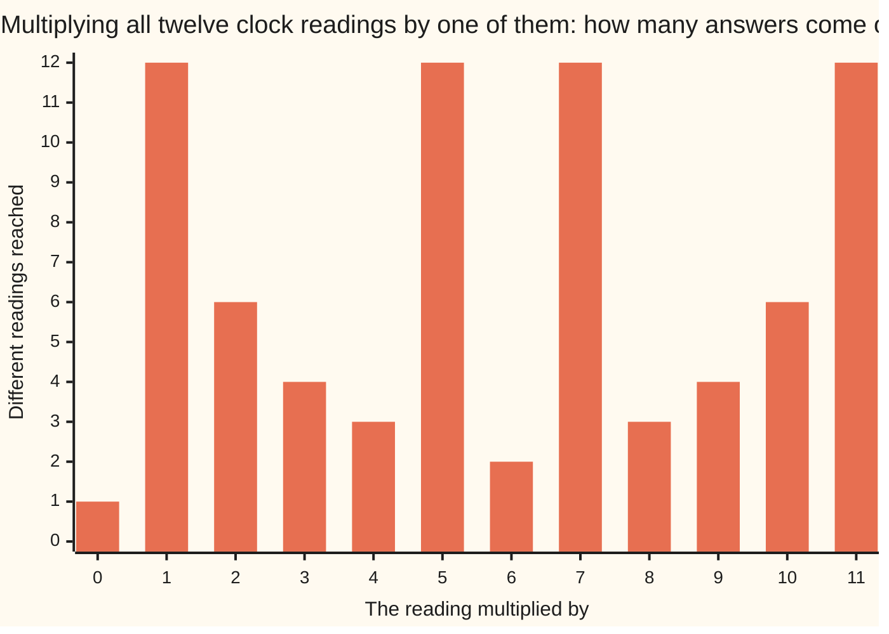
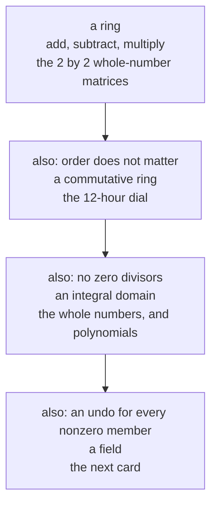

# Rings: add, subtract and multiply, but not always divide, and the clock where 3 times 4 is zero

Algebra → Rings and Fields → Two operations at once → Rings

---

## General Overview

A wall clock's dial is marked 0 to 11, with 0 where the 12 sits. Three jumps of four hours land back on 0: three fours make twelve, one whole turn. So reading 3 times reading 4 is 0, with neither reading 0.

Readings can be added, subtracted and multiplied, always landing on a reading. Dividing is another matter. Multiplying by 5 can be undone — five fives make two turns and land on 1 — while multiplying by 2 cannot, since twice a reading is always even. Only 1, 5, 7 and 11 have a partner making 1.

The whole numbers fail differently: no two nonzero ones multiply to 0, yet only 1 and −1 have a partner making 1.

One word covers the dial, the whole numbers, polynomials and square matrices: **ring** — adding, subtracting and multiplying promised, dividing not.

**A ring is one collection with two operations — adding, which every member can undo, and multiplying, which not every member can — tied together by the rule that a multiplier reaches every term in a bracket.**

**What kind of fact this is:** a definition — a test a collection and its two operations pass or fail together.

### The picture: how far each multiplier reaches



Four multipliers reach all twelve readings: 1, 5, 7 and 11. The rest fall short — 2 reaches six, 3 four, 6 two, 0 one — and a multiplier that falls short always misses 1.

---

## The formula

Notation first, in words. A ring takes a capital letter, $R$, its members small letters $a$, $b$, $c$, so one line covers every choice. Multiplying pushes letters together with no sign. The do-nothing members are 0 for adding and 1 for multiplying. The additive undo of $a$ is $-a$, the multiplicative undo $a^{-1}$, whose raised −1 means undo, not divide.

Eight rules, each holding for every choice of members:

$$(a+b)+c = a+(b+c), \qquad a+b = b+a, \qquad a+0 = a, \qquad a+(-a) = 0$$

$$(ab)c = a(bc), \qquad a1 = 1a = a$$

$$a(b+c) = ab+ac, \qquad (a+b)c = ac+bc$$

**Read it aloud:** adding regroups, reorders and undoes; multiplying regroups and has a do-nothing member; a multiplier reaches every term in a bracket.

Sums and products must also stay inside. The top line makes adding alone a group whose order does not matter ([groups](../08-Groups/01-groups.md)), which gives subtracting: $a-b$ is $a+(-b)$. The last line is the distributive law ([arithmetic-laws](../../01-Foundations/01-Everyday%20Arithmetic/05-arithmetic-laws.md)).

| Symbol | Plain meaning | In our example | Change it and… |
| --- | --- | --- | --- |
| $R$ | a collection with two operations | the twelve readings | another may fail a rule |
| $a$, $b$, $c$ | any members | any readings | — |
| $0$ | changes nothing when added | where the 12 sits | — |
| $1$ | changes nothing when multiplied | the reading 1 | 1 ≠ 0 here, or nothing else exists |
| $-a$ | the additive undo of $a$ | the hours back round the dial | every member has one |
| $a^{-1}$ | the multiplicative undo, if any | 5 is its own | most have none |

Three more words. A ring is **commutative** when $ab = ba$ always: the dial is, the matrices below are not. A **unit** has a multiplicative undo; the units are what is safe to divide by, and form a group under multiplying ([cosets-and-lagranges-theorem](../08-Groups/04-cosets-and-lagranges-theorem.md)). A **zero divisor** is a nonzero $a$ with $ab = 0$ for a nonzero $b$, as 3 and 4 are; a commutative ring with none is an **integral domain**.

### When it holds

- **The collection and both operations are named together.** The twelve readings pass under adding and multiplying, and fail under adding and *subtracting*, which will not regroup.
- **Both operations stay inside.** The odd readings are no ring: 3 + 5 is even and has left.
- **Nothing promises commuting or dividing.** The matrices below do not commute, and on the dial cancelling the 2 in "2x = 2" loses the answer 7.

---

## Why it works

### Step 0: the rules are a test, and whatever passes inherits every consequence

A rule claimed for a collection must hold for every choice of members — for an infinite one, by argument, not examples. The payment: what follows from the rules holds in every ring.

The dial's own argument is short. A reading stands for every whole number with the same remainder after division by 12 ([residue-classes](../../02-Number%20theory/03-Clock%20Arithmetic/03-residue-classes.md)). Swapping stand-ins shifts a sum or product by a multiple of 12 and leaves the reading alone, so the rules drop down from the whole numbers; the code walks the distributive rule over all 1728 triples.

### Step 1: zero swallows every product

Nothing above says that $a$ multiplied by 0 is 0. It follows: since 0 + 0 = 0, the distributive rule gives

$$a0 = a(0+0) = a0+a0$$

Adding the additive undo of $a0$ to both sides leaves $0 = a0$; the right-hand rule gives $0a = 0$. So 0 is never a unit.

### Step 2: a unit is never a zero divisor

Let $a$ be a unit with undo $a^{-1}$, and suppose $ab = 0$. Multiply on the left by $a^{-1}$:

$$a^{-1}(ab) = a^{-1}0$$

The right side is 0 by Step 1; the left regroups into $(a^{-1}a)b$, which is $b$. So $b = 0$.

That splits the dial: its units 1, 5, 7 and 11 are no zero divisors, and no zero divisor has an undo. It also gives cancelling: $ab = ac$ makes $a(b-c) = 0$, and with no zero divisors and $a$ nonzero, $b = c$ — an integral domain cancels but cannot divide.

### Step 3: on a dial, every nonzero reading is a unit or a zero divisor

A reading has an undo exactly when it shares no factor above 1 with the dial size ([modular-inverse](../../02-Number%20theory/03-Clock%20Arithmetic/04-modular-inverse.md)) — when their greatest common divisor, the largest whole number dividing both, is 1. At 12 that leaves 1, 5, 7 and 11.

Any other nonzero reading shares a factor $d$ above 1 with 12. Multiply it by 12 divided by $d$, a reading and not 0: the product is a whole number of turns, so it reads 0. So every nonzero reading is a unit or a zero divisor, never both (Step 2), its partner being 12 divided by the shared factor; the table below lists all seven pairs. The whole numbers have no such fork, where 2 is neither.

<details>
<summary>Detailed proof: why each bar is that tall</summary>

Write $d$ for the greatest common divisor of a reading $a$ with the dial size. Multiplying by $a$ lands on multiples of $d$ only, since $d$ divides $a$, and on all of them, since some whole-number combination of $a$ and the dial size makes $d$. The dial holds its size divided by $d$ such multiples, and that is the bar's height.

</details>

**Another route.** The full 12 by 12 multiplication table settles this dial by inspection; one divisor argument settles every size, and behind the dial is [ideals-and-quotient-rings](04-ideals-and-quotient-rings.md).

### Step 4: two more rings

**Polynomials with whole-number coefficients** ([polynomials](../02-Polynomials/01-polynomials.md)). Adding adds matching coefficients, multiplying gathers multiplied-out terms, and both inherit every rule from the coefficients. No zero divisors: a product's leading coefficient is the product of the two leading ones. So an integral domain whose only units are 1 and −1 — the shortage that makes polynomials divide with a remainder instead ([polynomials-behave-like-integers](03-polynomials-behave-like-integers.md)).

**The 2 by 2 matrices of whole numbers** ([matrix-multiplication](../04-Matrices/03-matrix-multiplication.md)). Adding is entry by entry, multiplying row into column. Two comforts go at once. With A = `[[1, 1], [0, 1]]` and B = `[[1, 0], [1, 1]]`, AB is `[[2, 1], [1, 1]]` while BA is `[[1, 1], [1, 2]]`; and `[[1, 0], [0, 0]]` times `[[0, 0], [0, 1]]` is all zeros.



Each rung adds a demand; its example sits there and no higher.

---

## Worked numbers, by hand

The dial, reading by reading.

| Step | Arithmetic | Value |
| --- | --- | --- |
| three jumps of four hours | 3 × 4, one whole turn | 0 |
| an undo for 5, then for 2 | five fives make two turns and an hour; 2 gives 0 2 4 6 8 10 | 1 for 5; never 1 for 2 |
| readings sharing no factor with 12 | 1, 5, 7, 11 | **four units** |
| the rest, each with a partner | 12 divided by the shared factor | 2 3 4 6 8 9 10, with **6 4 3 2 3 4 6** |
| the whole numbers | 2 times each from −20 to 20 | never 1; units **−1 and 1** |

Four readings of the twelve can be divided by; the other seven each pair off to 0.

### What breaks if you drop a piece

| Mistake | Comes out at | What went wrong |
| --- | --- | --- |
| Cancelling the 2 in "2x = 2" | x = 1, losing x = 7 | cancelling needs an undo |
| Expecting "2x = 1" to have an answer | nothing: 2 reaches 0 2 4 6 8 10 | six readings, not 1 |
| Reading "nonzero" as "no zero product" | 3 × 4 = 0 | two nonzero readings multiply to 0 |

The code prints all three.

---

## Code, from first principles, and it actually runs

Nothing is imported, and every claim about the dial is reached twice by roads sharing no arithmetic. Road one hunts, trying all twelve partners of each reading for a product of 1 and of 0. Road two argues from the greatest common divisor, written out in the script, predicting the same units, partners and bar heights. The distributive rule is then walked over 1728 triples, the whole numbers swept from −20 to 20, the polynomial product gathered and evaluated, the matrices multiplied both ways.

### Python

```python
# Rings -- the check behind the card.  Nothing is imported.  The twelve readings
# of a 12-hour clock, 0 where 12 sits, are added and multiplied by wrapping at 12.
# Road one hunts by brute force, trying every reading; road two argues from the
# greatest common divisor, written out below.  The two roads share no arithmetic.
N = 12
def hcf(a, b):                                   # greatest common divisor
    while b:
        a, b = b, a % b
    return a
def row(values):
    return " ".join(str(v) for v in values)
def times(a, b):                                 # product of two 2 by 2 matrices
    return [[a[i][0] * b[0][j] + a[i][1] * b[1][j] for j in (0, 1)] for i in (0, 1)]
def show(m):
    return f"[[{m[0][0]}, {m[0][1]}], [{m[1][0]}, {m[1][1]}]]"
def value(poly, x):                              # a polynomial at one integer
    return sum(c * x ** k for k, c in enumerate(poly))
readings = list(range(N))
reach = [len(set(a * x % N for x in readings)) for a in readings]       # road one
reach_hcf = [N // hcf(a, N) for a in readings]                          # road two
undo = [[x for x in readings if a * x % N == 1] for a in readings]      # road one
units = [a for a in readings if undo[a]]
units_hcf = [a for a in range(1, N) if hcf(a, N) == 1]                  # road two
zd = [a for a in range(1, N) if any(a * b % N == 0 for b in range(1, N))]
partner = [N // hcf(a, N) for a in zd]
triples = [(a, b, c) for a in readings for b in readings for c in readings]
spread = sum(1 for a, b, c in triples if a * ((b + c) % N) % N == (a * b + a * c) % N)
p, q, prod = [1, 1], [-1, 1], [0, 0, 0]          # (x + 1) and (x - 1), constant first
for i, pi in enumerate(p):
    for j, qj in enumerate(q):
        prod[i + j] += pi * qj
agree = all(value(prod, x) == value(p, x) * value(q, x) for x in range(-3, 4))
no2 = [k for k in range(-20, 21) if 2 * k == 1]
int_units = [k for k in range(-20, 21) if any(k * m == 1 for m in range(-20, 21))]
A, B, E, F = [[1, 1], [0, 1]], [[1, 0], [1, 1]], [[1, 0], [0, 0]], [[0, 0], [0, 1]]
print(f"clock size {N}: 3 x 4 = {3 * 4 % N}, and 5 x 5 = {5 * 5 % N}")
print(f"readings reached by multiplying by 0 to 11: {row(reach)}")
print(f"units by hunting an undo:  {row(units)}")
print(f"units by the gcd test:     {row(units_hcf)}")
print(f"the undo of each of them:  {row([undo[a][0] for a in units])}")
print(f"nonzero zero divisors: {row(zd)}")
print(f"a partner taking each to zero: {row(partner)}")
print(f"2 times 0 to 11: {row([2 * x % N for x in readings])}, and 1 is not there")
print(f"2x = 2 on the clock: x = {row([x for x in readings if 2 * x % N == 2])}")
print(f"distributivity: of {len(triples)} triples of readings, {spread} agree")
print(f"integers: 2k = 1 has {len(no2)} answers from -20 to 20; "
      f"the only units are {row(int_units)}")
print(f"polynomials: (x + 1)(x - 1) has coefficients {row(prod)} for 1, x, x^2; "
      f"agrees at every x from -3 to 3: {'yes' if agree else 'no'}")
print(f"A = {show(A)} and B = {show(B)}")
print(f"AB = {show(times(A, B))} but BA = {show(times(B, A))}")
print(f"matrix zero divisors: {show(E)} times {show(F)} = {show(times(E, F))}")
assert units == units_hcf == [1, 5, 7, 11] and reach == reach_hcf
assert zd == [2, 3, 4, 6, 8, 9, 10] and not set(units) & set(zd) and all(
    a * b % N == 0 for a, b in zip(zd, partner))
assert spread == len(triples) == 1728 and undo[2] == [] and no2 == [] and int_units == [-1, 1]
assert prod == [-1, 0, 1] and agree and times(A, B) == [[2, 1], [1, 1]] and times(
    B, A) == [[1, 1], [1, 2]] and times(E, F) == [[0, 0], [0, 0]]
print("ALL CHECKS PASS")
```

**Ran 2026-09-14 on macOS, Python 3.14.6, standard library only. All checks passed. Output, pasted from the run:**

```
clock size 12: 3 x 4 = 0, and 5 x 5 = 1
readings reached by multiplying by 0 to 11: 1 12 6 4 3 12 2 12 3 4 6 12
units by hunting an undo:  1 5 7 11
units by the gcd test:     1 5 7 11
the undo of each of them:  1 5 7 11
nonzero zero divisors: 2 3 4 6 8 9 10
a partner taking each to zero: 6 4 3 2 3 4 6
2 times 0 to 11: 0 2 4 6 8 10 0 2 4 6 8 10, and 1 is not there
2x = 2 on the clock: x = 1 7
distributivity: of 1728 triples of readings, 1728 agree
integers: 2k = 1 has 0 answers from -20 to 20; the only units are -1 1
polynomials: (x + 1)(x - 1) has coefficients -1 0 1 for 1, x, x^2; agrees at every x from -3 to 3: yes
A = [[1, 1], [0, 1]] and B = [[1, 0], [1, 1]]
AB = [[2, 1], [1, 1]] but BA = [[1, 1], [1, 2]]
matrix zero divisors: [[1, 0], [0, 0]] times [[0, 0], [0, 1]] = [[0, 0], [0, 0]]
ALL CHECKS PASS
```

### Rust

Same numbers, same labels, built with `rustc --edition 2021 -O`.

```rust
// Rings -- the same check as the Python, in Rust.  No crates.  The twelve readings
// of a 12-hour clock, 0 where 12 sits, are added and multiplied by wrapping at 12.
// Road one hunts by brute force, trying every reading; road two argues from the
// greatest common divisor, written out below.  The two roads share no arithmetic.
const N: i64 = 12;
type Mat = [[i64; 2]; 2];
fn hcf(mut a: i64, mut b: i64) -> i64 {           // greatest common divisor
    while b != 0 { (a, b) = (b, a % b); }
    a
}
fn row(values: &[i64]) -> String {
    values.iter().map(|v| v.to_string()).collect::<Vec<String>>().join(" ")
}
fn times(a: Mat, b: Mat) -> Mat {                 // product of two 2 by 2 matrices
    let mut c = [[0i64; 2]; 2];
    for i in 0..2 { for j in 0..2 { c[i][j] = a[i][0] * b[0][j] + a[i][1] * b[1][j]; } }
    c
}
fn show(m: Mat) -> String {
    format!("[[{}, {}], [{}, {}]]", m[0][0], m[0][1], m[1][0], m[1][1])
}
fn value(poly: &[i64], x: i64) -> i64 {           // a polynomial at one integer
    let mut total = 0;
    for (k, c) in poly.iter().enumerate() { total += c * x.pow(k as u32); }
    total
}
fn main() {
    let readings: Vec<i64> = (0..N).collect();
    let reach: Vec<i64> = readings.iter().map(|&a| {                        // road one
        let mut seen: Vec<i64> = Vec::new();
        for &x in &readings { if !seen.contains(&(a * x % N)) { seen.push(a * x % N); } }
        seen.len() as i64
    }).collect();
    let reach_hcf: Vec<i64> = readings.iter().map(|&a| N / hcf(a, N)).collect();  // road two
    let undo: Vec<Vec<i64>> = readings.iter().map(|&a|                      // road one
        readings.iter().cloned().filter(|&x| a * x % N == 1).collect()).collect();
    let units: Vec<i64> = readings.iter().cloned().filter(|&a| !undo[a as usize].is_empty()).collect();
    let units_hcf: Vec<i64> = (1..N).filter(|&a| hcf(a, N) == 1).collect();      // road two
    let zd: Vec<i64> = (1..N).filter(|&a| (1..N).any(|b| a * b % N == 0)).collect();
    let partner: Vec<i64> = zd.iter().map(|&a| N / hcf(a, N)).collect();
    let (mut triples, mut spread) = (0i64, 0i64);
    for &a in &readings { for &b in &readings { for &c in &readings {
        triples += 1;
        if a * ((b + c) % N) % N == (a * b + a * c) % N { spread += 1; }
    } } }
    let (p, q) = ([1i64, 1], [-1i64, 1]);         // (x + 1) and (x - 1), constant first
    let mut prod = [0i64; 3];
    for (i, pi) in p.iter().enumerate() { for (j, qj) in q.iter().enumerate() { prod[i + j] += pi * qj; } }
    let agree = (-3..=3).all(|x| value(&prod, x) == value(&p, x) * value(&q, x));
    let no2: Vec<i64> = (-20..=20).filter(|&k| 2 * k == 1).collect();
    let int_units: Vec<i64> = (-20..=20).filter(|&k| (-20..=20).any(|m| k * m == 1)).collect();
    let (am, bm, em, fm): (Mat, Mat, Mat, Mat) = ([[1, 1], [0, 1]], [[1, 0], [1, 1]], [[1, 0], [0, 0]], [[0, 0], [0, 1]]);
    let undos: Vec<i64> = units.iter().map(|&a| undo[a as usize][0]).collect();
    let twos: Vec<i64> = readings.iter().map(|&x| 2 * x % N).collect();
    let solve: Vec<i64> = readings.iter().cloned().filter(|&x| 2 * x % N == 2).collect();
    println!("clock size {}: 3 x 4 = {}, and 5 x 5 = {}", N, 3 * 4 % N, 5 * 5 % N);
    println!("readings reached by multiplying by 0 to 11: {}", row(&reach));
    println!("units by hunting an undo:  {}", row(&units));
    println!("units by the gcd test:     {}", row(&units_hcf));
    println!("the undo of each of them:  {}", row(&undos));
    println!("nonzero zero divisors: {}", row(&zd));
    println!("a partner taking each to zero: {}", row(&partner));
    println!("2 times 0 to 11: {}, and 1 is not there", row(&twos));
    println!("2x = 2 on the clock: x = {}", row(&solve));
    println!("distributivity: of {} triples of readings, {} agree", triples, spread);
    println!("integers: 2k = 1 has {} answers from -20 to 20; the only units are {}", no2.len(), row(&int_units));
    println!("polynomials: (x + 1)(x - 1) has coefficients {} for 1, x, x^2; agrees at \
              every x from -3 to 3: {}", row(&prod), if agree { "yes" } else { "no" });
    println!("A = {} and B = {}", show(am), show(bm));
    println!("AB = {} but BA = {}", show(times(am, bm)), show(times(bm, am)));
    println!("matrix zero divisors: {} times {} = {}", show(em), show(fm), show(times(em, fm)));
    assert!(units == units_hcf && units == vec![1, 5, 7, 11] && reach == reach_hcf);
    assert!(zd == vec![2, 3, 4, 6, 8, 9, 10] && !zd.iter().any(|a| units.contains(a))
        && zd.iter().zip(partner.iter()).all(|(a, b)| a * b % N == 0));
    assert!(spread == triples && triples == 1728 && undo[2].is_empty() && no2.is_empty()
        && int_units == vec![-1, 1]);
    assert!(prod == [-1, 0, 1] && agree && times(am, bm) == [[2, 1], [1, 1]]
        && times(bm, am) == [[1, 1], [1, 2]] && times(em, fm) == [[0, 0], [0, 0]]);
    println!("ALL CHECKS PASS");
}
```

**Ran 2026-09-14 on macOS, rustc 1.98.1, no crates. All checks passed. Output, pasted from the run:**

```
clock size 12: 3 x 4 = 0, and 5 x 5 = 1
readings reached by multiplying by 0 to 11: 1 12 6 4 3 12 2 12 3 4 6 12
units by hunting an undo:  1 5 7 11
units by the gcd test:     1 5 7 11
the undo of each of them:  1 5 7 11
nonzero zero divisors: 2 3 4 6 8 9 10
a partner taking each to zero: 6 4 3 2 3 4 6
2 times 0 to 11: 0 2 4 6 8 10 0 2 4 6 8 10, and 1 is not there
2x = 2 on the clock: x = 1 7
distributivity: of 1728 triples of readings, 1728 agree
integers: 2k = 1 has 0 answers from -20 to 20; the only units are -1 1
polynomials: (x + 1)(x - 1) has coefficients -1 0 1 for 1, x, x^2; agrees at every x from -3 to 3: yes
A = [[1, 1], [0, 1]] and B = [[1, 0], [1, 1]]
AB = [[2, 1], [1, 1]] but BA = [[1, 1], [1, 2]]
matrix zero divisors: [[1, 0], [0, 0]] times [[0, 0], [0, 1]] = [[0, 0], [0, 0]]
ALL CHECKS PASS
```

The two outputs match line for line.

> [!TIP]
> **Try changing**
> Guess first, then run it. An assert stops the program when a number comes out wrong, and these are pinned to the dial.
> - **Move to a seven-hour dial.** Set `N` to `7`. Every nonzero reading turns into a unit, and the first assert stops it: it holds out for 1, 5, 7 and 11.
> - **Break the rule tying the operations together.** In the `spread` line, change `(a * b + a * c) % N` to `(a * b + a * c + 1) % N`. Agreeing triples fall to 0, stopping the third assert.
> - **Swap the matrix order.** In `times`, swap the arguments. The AB row prints `[[1, 1], [1, 2]]`; the fourth assert stops it.

---

## The usual mistake

> [!warning]
> **Reading "nonzero" as "safe to divide by".** On the dial 2 is not 0, and nothing multiplies it up to 1; and 3 × 4 = 0 with neither factor 0.
>
> - **Cancelling a common factor.** From "2x = 2" it does not follow that x is 1: both 1 and 7 fit.
> - **Confusing the two undos.** $-a$ undoes adding, $a^{-1}$ multiplying. Every member has the first; the dial has four of the second, the whole numbers two.
> - **Borrowing an undo.** The reciprocal of 2 lives among fractions, not the whole numbers.

---

## Where you meet it in real life

- **Anything that wraps.** A clock, a weekday, hash buckets, a check digit: wrapping arithmetic is this ring, and its zero divisors decide which multipliers reach every slot.
- **Machine arithmetic.** Fixed-width integers wrap at a power of two: a ring whose units are the odd values.
- **Exact algebra, and codes.** Software that expands expressions without rounding works in a polynomial ring ([polynomials](../02-Polynomials/01-polynomials.md)), and the codes on a disc or a QR symbol use polynomial rings over a small dial ([finite-fields](05-finite-fields.md)).

> **Say it back**
> A ring is one collection with two operations: adding, which every member can undo, and multiplying, which not every member can, linked by the rule that a multiplier reaches every term in a bracket. On a 12-hour dial 3 × 4 = 0 with neither factor 0, and only 1, 5, 7 and 11 have a partner reaching 1. The whole numbers have no zero products, and only two units. Order may matter, and nonzero is not safe to divide by.

---

## What this builds on

- [groups](../08-Groups/01-groups.md): one operation, four rules.
- [polynomials](../02-Polynomials/01-polynomials.md): coefficients added, terms multiplied out.
- [matrix-multiplication](../04-Matrices/03-matrix-multiplication.md): row into column.
- [residue-classes](../../02-Number%20theory/03-Clock%20Arithmetic/03-residue-classes.md): a reading is a pile.
- [modular-inverse](../../02-Number%20theory/03-Clock%20Arithmetic/04-modular-inverse.md): which readings undo.
- [arithmetic-laws](../../01-Foundations/01-Everyday%20Arithmetic/05-arithmetic-laws.md): regrouping and brackets.

## Where this goes next

- [fields](02-fields.md): every nonzero member a unit.
- [ideals-and-quotient-rings](04-ideals-and-quotient-rings.md): rings from declared zeros.
- [pell-equation-and-root-two](../10-For%20the%20Curious/04-pell-equation-and-root-two.md): endless units.
- [boolean-algebra-and-lattices](../10-For%20the%20Curious/05-boolean-algebra-and-lattices.md): and and or.
- banach-algebras-and-the-gelfand-transform: members with size.
- c-star-algebras-in-outline: those, conjugated.
- algebraic-integers-and-number-fields: whole, further out.
- rings-of-integers-and-integral-bases: that ring listed.
- integral-domains-pids-and-unique-factorisation: factoring into primes.

Dividing stays a privilege of the few here, which is the next card's question: what changes when every nonzero member has an undo.

---

## Sources

Verified 14 Sep 2026: every link below resolves to the publisher's page.

- Judson, Thomas W. *Abstract Algebra: Theory and Applications*, chapter 16. Stephen F. Austin State University. [Publication page](https://scholarworks.sfasu.edu/ebooks/23/). The rules, units, zero divisors, domains, both rings above.
- O'Connor, J. J., and E. F. Robertson. "The development of Ring Theory." MacTutor History of Mathematics Archive, University of St Andrews. [History topic](https://mathshistory.st-andrews.ac.uk/HistTopics/Ring_theory/). Where the word came from.
- Noether, Emmy. "Idealtheorie in Ringbereichen." *Mathematische Annalen* 83 (1921): 24–66. [doi:10.1007/BF01464225](https://doi.org/10.1007/BF01464225). Ring theory rebuilt on rules.
