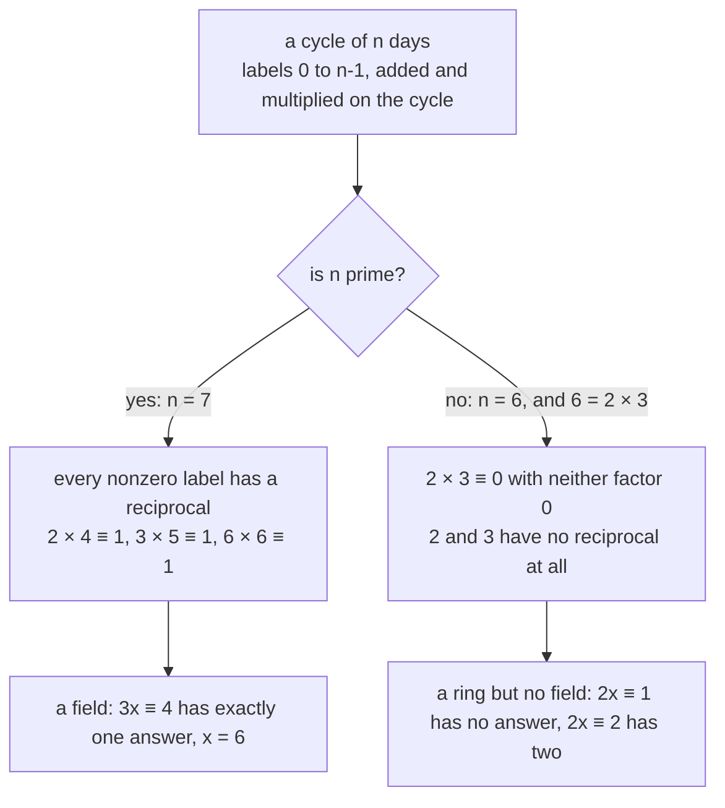
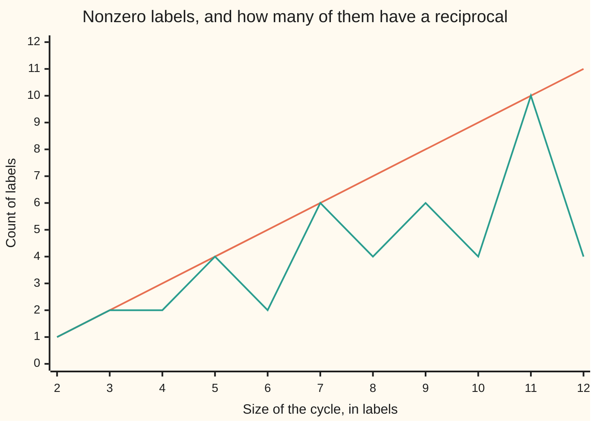

# Fields: a ring where every nonzero thing has a reciprocal, so every linear equation has exactly one answer

[Syllabus](../../../SYLLABUS.md) → [Algebra](../../../SYLLABUS.md#w03) → [Rings and Fields](../../../SYLLABUS.md#w03-s09) → Fields

---

## General Overview

A depot runs a seven-day rota, the days labelled 0 to 6 with 0 for Monday, so 18 days after a Monday lands on 4, Friday: two weeks and four over. A driver's shifts fall a fixed number of days apart, and the third shift after a Monday one falls on a Friday. So three gaps of x days must land on 4: 3x ≡ 4 (mod 7).

Multiplying by 5 undoes multiplying by 3 here: 3 × 5 = 15, a fortnight and a day over, so 3 × 5 ≡ 1 (mod 7). Multiply the target by 5 and 5 × 4 = 20 ≡ 6. Six days between shifts; check forward, 3 × 6 = 18 ≡ 4.

That 5 is the **reciprocal** of 3 on the week: the partner multiplying with it to give 1. Every nonzero day has one — 2 × 4 ≡ 1, 6 × 6 ≡ 1 — so "divide by 3" is legal here, meaning "multiply by 5".

Add, subtract and multiply under the usual laws and a set is a ring ([Rings](01-rings.md)). A ring where multiplication commutes, ab = ba, and every nonzero element also has a reciprocal inside the set is a **field**. Shorten the cycle to six days and that fails: 2 × 3 ≡ 0 (mod 6), and 2 has no reciprocal.

**A field is a ring with two rules added — multiplication commutes, and every nonzero element has a reciprocal inside the set — which is what makes dividing legal, so ax = b with a nonzero has exactly one answer.**

**What kind of fact this is:** a definition. Two theorems follow and are proved below: a nonzero coefficient gives one answer, and the n-day cycle is a field exactly when n is prime.

### The picture: which cycles can divide



---

## The formula

The ring rules give addition, subtraction and multiplication. A field adds two demands. Multiplication must commute, ab = ba. And for every element a of the set apart from 0, the set holds an element written $a^{-1}$, the reciprocal of a, with

$$a\,a^{-1} = 1$$

where 1 leaves everything unchanged under multiplication and is not 0. Division is shorthand: b/a means b times $a^{-1}$, written only when a is nonzero. What it buys:

$$ax = b,\ a \ne 0 \qquad\Longrightarrow\qquad x = a^{-1}b$$

**Read it aloud:** to undo a multiplication by anything but zero, multiply by its reciprocal — and that answer is the only one.

| Symbol | Plain meaning | In our example | Push it up and the answer… |
| --- | --- | --- | --- |
| $a$ | the coefficient, the thing divided by | 3, the three gaps | — |
| $a^{-1}$ | the reciprocal of a, its partner in multiplication | 5, since 3 × 5 ≡ 1 (mod 7) | — |
| $b$ | the target to hit | 4, Friday | — |
| $x$ | the unknown | 6 days | — |
| $n$ | the labels on the cycle, as in Z mod n | 7 | prime keeps a field, composite breaks one |

### When it holds

A field is a definition; these conditions belong to the two theorems, which cover one equation in one unknown.

- **A nonzero coefficient.** At a = 0 it is void: 0x ≡ 1 (mod 7) has no answer, 0x ≡ 0 (mod 7) all seven.
- **Commutative multiplication.** Without it, dividing from the left and the right come apart: a division ring.
- **Prime size, for a cycle.** On the twelve-hour clock seven of eleven nonzero labels have no reciprocal.

---

## Why it works

### Step 0: the reciprocal has to be in the set

Among whole numbers 2x = 1 has no answer: twice a whole number is even, 1 is odd. Among fractions it has one, and no nonzero fraction wants for a reciprocal — 3/4 and 4/3 multiply to 12/12, which is 1 ([Fractions](../../01-Foundations/01-Everyday%20Arithmetic/07-fractions.md)). The integers are short of reciprocals, not arithmetic: that lack is the whole distance from a field.

### Step 1: one reciprocal gives one answer, and never a second

Take ax = b with a nonzero. An answer exists: $a^{-1}b$. Multiply it by a and regroup, which the ring rules allow; the a meets its reciprocal and b is left. No second exists: multiply ax = b by $a^{-1}$ and regroup, and the left collapses to x, the right to $a^{-1}b$. Searching could never show that. The code solves all 42 equations on the week with a nonzero coefficient, each with one answer.

### Step 2: zero can never be handed a reciprocal

In any ring 0 times anything is 0, never 1 ([Rings](01-rings.md)), so "every nonzero element" is the most any set can promise — and why 0x ≡ 0 (mod 7) has all seven days as answers, 0x ≡ 1 (mod 7) none.

### Step 3: no zero divisors, so a composite cycle is out

Suppose ab = 0 with a nonzero. Multiply by $a^{-1}$: the left collapses to b, the right to 0. In a field two nonzero elements never multiply to zero; one that breaks this is a **zero divisor**. The six-day cycle has a pair, 2 × 3 ≡ 0 (mod 6), and every composite size splits the same way, into two numbers between 1 and itself whose product is one whole cycle. The clock: 3 × 4 ≡ 0 (mod 12).

### Step 4: a prime cycle supplies every reciprocal

Let the size be prime. Every label from 1 to one below it is then coprime to the size ([Coprime numbers](../../02-Number%20theory/02-Greatest%20Common%20Divisor%20and%20Euclid%27s%20Algorithm/05-coprime-numbers.md)). Euclid's algorithm writes a greatest common divisor as a whole-number combination: so many jumps of the label, plus so many whole cycles, adding to 1. Cycles read as 0, so that count of jumps is the reciprocal ([The modular inverse](../../02-Number%20theory/03-Clock%20Arithmetic/04-modular-inverse.md)). A construction, not an existence claim: the code runs it.

Steps 3 and 4 close on each other: **the n-day cycle, for n at least 2, is a field exactly when n is prime.** The cycle comes from the quotient machinery on [Ideals and quotient rings](04-ideals-and-quotient-rings.md).

<details>
<summary>Detailed proof</summary>

**Prime is enough.** Let n be prime and a a label from 1 to n − 1. Since n does not divide a, their greatest common divisor is 1, and Euclid's algorithm returns whole numbers t and s with ta + sn = 1. On the cycle sn reads as 0, leaving ta ≡ 1 (mod n), so t is the reciprocal of a. For a = 3 on the week, t = 5: 5 × 3 − 2 × 7 = 1.

**Prime is necessary.** Let n = uv with u and v strictly between 1 and n. Both are nonzero labels and uv reads as 0, so by Step 3 this is no field, and u has no reciprocal: multiplying uv ≡ 0 by one would force v ≡ 0. Size 1 is excluded, since there 0 and 1 are one label.

</details>



Upper line: the nonzero labels, one less than the size; lower line, those with a reciprocal. They meet at the primes 2, 3, 5, 7 and 11, and part at 4, 6, 8, 9, 10, 12.

**Another route.** Build a field instead of testing one, manufacturing the reciprocals a ring lacks — over polynomials, what [Polynomials behave like integers](03-polynomials-behave-like-integers.md) prepares.

<details>
<summary>Field of fractions</summary>

Pairs with a nonzero element underneath, counted equal when the cross-multiples agree and combined by the school rules for fractions, form a field: from the integers, the rationals. Every commutative ring with no zero divisors — an integral domain — sits inside a field this way.

</details>

---

## Worked numbers, by hand

| Step | Arithmetic | Value |
| --- | --- | --- |
| the question | 3x ≡ 4 (mod 7) | a = 3, b = 4 |
| the reciprocal of 3 | 3 × 5 = 15, and 15 − 14 = 1 | 5 |
| multiply the target by it | 5 × 4 = 20, and 20 − 14 = 6 | 6 |
| check it forward | 3 × 6 = 18, and 18 − 14 = 4 | **x = 6** |

Six days between shifts, as the rota required. Every nonzero day has a reciprocal: days 1 to 6 answer to 1, 4, 5, 2, 3 and 6 in order. On the twelve-hour clock only 1, 5, 7 and 11 do, and 3 × 4 = 12 reads as 0; on the six-day cycle, only 1 and 5.

### What breaks if you drop a piece

| Mistake | Comes out at | What went wrong |
| --- | --- | --- |
| The day that cancels 3 under addition | x = 2, and 3 × 2 ≡ 6, not 4 | 3 + 4 ≡ 0 (mod 7), but 3 × 4 ≡ 5 |
| Dividing by 2 on the six-day cycle | 2x ≡ 1 has 0 answers, 2x ≡ 2 has 2 | 2 has no reciprocal; uniqueness goes too |
| Cancelling the 3 in 3x ≡ 0 (mod 12) | 3 answers: x = 0, 4 and 8 | a zero divisor is not cancellable |
| Dividing by zero | 0x ≡ 1 has 0 answers, 0x ≡ 0 has 7 | 0 has no reciprocal |

The code prints all four.

---

## Code, from first principles, and it actually runs

Nothing is imported. Reciprocals come twice over by roads sharing no arithmetic: one keeps every label whose product reads as 1, the other runs Euclid's algorithm and reads the reciprocal off its combination. Both then count the labels with a reciprocal at sizes 2 to 12, and the sizes where all have one are checked against primes by trial division.

### Python

```python
# Fields -- the check behind the card.  Nothing is imported.  On a cycle of n days
# the labels are 0 to n-1, and a*x is read on the cycle.  Reciprocals come by two
# independent roads, trying every label and Euclid's algorithm, and are compared.
WEEK, SIX, CLOCK = 7, 6, 12

def answers(a, b, n):                       # road one: try every label on the cycle
    return [x for x in range(n) if a * x % n == b]

def reciprocal(a, n):                       # road two: Euclid, gcd as a combination
    r0, r1, t0, t1 = n, a % n, 0, 1         # r0 is always t0 jumps of a, plus n's
    while r1:
        q = r0 // r1
        r0, r1 = r1, r0 - q * r1
        t0, t1 = t1, t0 - q * t1
    return t0 % n if r0 == 1 else None      # nothing to return unless the gcd is 1

def is_prime(n):                            # trial division, independent of the rest
    return n >= 2 and all(n % d for d in range(2, n))

def grid(name, values): print(f"{name:<27}" + "".join(f"{v:>4}" for v in values))

sizes = list(range(2, CLOCK + 1))
euclid = [reciprocal(a, WEEK) for a in range(1, WEEK)]
searched = [answers(a, 1, WEEK)[0] for a in range(1, WEEK)]
units = [[a for a in range(1, n) if answers(a, 1, n)] for n in sizes]
by_search = [len(u) for u in units]
by_euclid = [len([a for a in range(1, n) if reciprocal(a, n) is not None]) for n in sizes]
fields = [n for n, c in zip(sizes, by_search) if c == n - 1]
primes = [n for n in sizes if is_prime(n)]
pairs = [(a, b) for a in range(1, WEEK) for b in range(WEEK)]
most = max(len(answers(a, b, WEEK)) for a, b in pairs)
x, wrong = 4 * reciprocal(3, WEEK) % WEEK, 4 * 4 % WEEK
print(f"week labels 0 to {WEEK - 1}; reciprocals of 1 to {WEEK - 1}: {euclid}")
print(f"reciprocal checks mod {WEEK}: 2*4 = {2 * 4 % WEEK}, 3*5 = {3 * 5 % WEEK}, "
      f"6*6 = {6 * 6 % WEEK}")
print(f"3x = 4 mod {WEEK}: Euclid road x = {x}, search road {answers(3, 4, WEEK)}")
print(f"by hand: 3*5 = {3 * 5}, {3 * 5} - {2 * WEEK} = {3 * 5 - 2 * WEEK}; 5*4 = {5 * 4}, "
      f"{5 * 4} - {2 * WEEK} = {5 * 4 - 2 * WEEK}; 3*6 = {3 * 6}, {3 * 6} - {2 * WEEK} = {3 * 6 - 2 * WEEK}")
print(f"all {len(pairs)} equations a*x = b mod {WEEK}, a nonzero: at most {most} answer")
print(f"zero coefficient mod {WEEK}: 0x = 1 has {len(answers(0, 1, WEEK))} answers, "
      f"0x = 0 has {len(answers(0, 0, WEEK))}")
print(f"3+4 = {(3 + 4) % WEEK} mod {WEEK} but 3*4 = {3 * 4 % WEEK}; that road gives "
      f"x = {wrong}, and 3*{wrong} = {3 * wrong % WEEK}, not 4")
print(f"six-day cycle: reciprocals only for {units[SIX - 2]}; 2*3 = {2 * 3 % SIX}; "
      f"2x = 1 answers {answers(2, 1, SIX)}; 2x = 2 answers {answers(2, 2, SIX)}")
print(f"twelve-hour clock: reciprocals only for {units[CLOCK - 2]}; "
      f"3*4 = {3 * 4 % CLOCK}; 3x = 0 answers {answers(3, 0, CLOCK)}")
print(f"integers: 2k = 1 has {len([k for k in range(-20, 21) if 2 * k == 1])} answers "
      f"for k from -20 to 20; rationals: (3/4)*(4/3) = {3 * 4}/{4 * 3} = 1")
grid("cycle size n", sizes)
grid("nonzero labels, n - 1", [n - 1 for n in sizes])
grid("of those, with a reciprocal", by_search)
grid("the same count, by Euclid", by_euclid)
print(f"cycle sizes that are fields: {fields}")
print(f"primes up to {CLOCK}, by trial division: {primes}")
assert euclid == searched == [1, 4, 5, 2, 3, 6]
assert all(answers(a, b, WEEK) == [b * reciprocal(a, WEEK) % WEEK] for a, b in pairs)
assert fields == primes == [2, 3, 5, 7, 11] and by_search == by_euclid
assert (answers(2, 1, SIX), answers(2, 2, SIX), answers(3, 0, CLOCK)) == ([], [1, 4], [0, 4, 8])
print("ALL CHECKS PASS")
```

**Ran 2026-09-14 on macOS, Python 3.14.6, standard library only. All checks passed. Output, pasted from the run:**

```
week labels 0 to 6; reciprocals of 1 to 6: [1, 4, 5, 2, 3, 6]
reciprocal checks mod 7: 2*4 = 1, 3*5 = 1, 6*6 = 1
3x = 4 mod 7: Euclid road x = 6, search road [6]
by hand: 3*5 = 15, 15 - 14 = 1; 5*4 = 20, 20 - 14 = 6; 3*6 = 18, 18 - 14 = 4
all 42 equations a*x = b mod 7, a nonzero: at most 1 answer
zero coefficient mod 7: 0x = 1 has 0 answers, 0x = 0 has 7
3+4 = 0 mod 7 but 3*4 = 5; that road gives x = 2, and 3*2 = 6, not 4
six-day cycle: reciprocals only for [1, 5]; 2*3 = 0; 2x = 1 answers []; 2x = 2 answers [1, 4]
twelve-hour clock: reciprocals only for [1, 5, 7, 11]; 3*4 = 0; 3x = 0 answers [0, 4, 8]
integers: 2k = 1 has 0 answers for k from -20 to 20; rationals: (3/4)*(4/3) = 12/12 = 1
cycle size n                  2   3   4   5   6   7   8   9  10  11  12
nonzero labels, n - 1         1   2   3   4   5   6   7   8   9  10  11
of those, with a reciprocal   1   2   2   4   2   6   4   6   4  10   4
the same count, by Euclid     1   2   2   4   2   6   4   6   4  10   4
cycle sizes that are fields: [2, 3, 5, 7, 11]
primes up to 12, by trial division: [2, 3, 5, 7, 11]
ALL CHECKS PASS
```

### Rust

Same numbers, same labels, built with `rustc --edition 2021 -O`.

```rust
// Fields -- the same check as the Python, in Rust.  No crates.  On a cycle of n days
// the labels are 0 to n-1, and a*x is read on the cycle.  Reciprocals come by two
// independent roads, trying every label and Euclid's algorithm, and are compared.
const WEEK: i64 = 7;
const SIX: i64 = 6;
const CLOCK: i64 = 12;

fn answers(a: i64, b: i64, n: i64) -> Vec<i64> {      // road one: try every label
    (0..n).filter(|x| a * x % n == b).collect()
}

fn reciprocal(a: i64, n: i64) -> Option<i64> {        // road two: Euclid's algorithm
    let (mut r0, mut r1, mut t0, mut t1) = (n, a % n, 0, 1);   // r0 = t0 jumps of a, plus n's
    while r1 != 0 {
        let q = r0 / r1;
        (r0, r1) = (r1, r0 - q * r1);
        (t0, t1) = (t1, t0 - q * t1);
    }
    if r0 == 1 { Some(t0.rem_euclid(n)) } else { None }        // nothing unless the gcd is 1
}

fn is_prime(n: i64) -> bool {                         // trial division, independent
    n >= 2 && (2..n).all(|d| n % d != 0)
}

fn grid(name: &str, values: &[i64]) {
    let mut line = format!("{:<27}", name);
    for v in values { line.push_str(&format!("{:>4}", v)); }
    println!("{}", line);
}

fn main() {
    let sizes: Vec<i64> = (2..=CLOCK).collect();
    let euclid: Vec<i64> = (1..WEEK).map(|a| reciprocal(a, WEEK).unwrap()).collect();
    let searched: Vec<i64> = (1..WEEK).map(|a| answers(a, 1, WEEK)[0]).collect();
    let units: Vec<Vec<i64>> = sizes.iter()
        .map(|&n| (1..n).filter(|&a| !answers(a, 1, n).is_empty()).collect()).collect();
    let by_search: Vec<i64> = units.iter().map(|u| u.len() as i64).collect();
    let by_euclid: Vec<i64> = sizes.iter()
        .map(|&n| (1..n).filter(|&a| reciprocal(a, n).is_some()).count() as i64).collect();
    let fields: Vec<i64> = sizes.iter().cloned().filter(|&n| by_search[(n - 2) as usize] == n - 1).collect();
    let primes: Vec<i64> = sizes.iter().cloned().filter(|&n| is_prime(n)).collect();
    let pairs: Vec<(i64, i64)> = (1..WEEK).flat_map(|a| (0..WEEK).map(move |b| (a, b))).collect();
    let most = pairs.iter().map(|&(a, b)| answers(a, b, WEEK).len()).max().unwrap();
    let (x, wrong) = (4 * reciprocal(3, WEEK).unwrap() % WEEK, 4 * 4 % WEEK);
    println!("week labels 0 to {}; reciprocals of 1 to {}: {:?}", WEEK - 1, WEEK - 1, euclid);
    println!("reciprocal checks mod {}: 2*4 = {}, 3*5 = {}, 6*6 = {}",
             WEEK, 2 * 4 % WEEK, 3 * 5 % WEEK, 6 * 6 % WEEK);
    println!("3x = 4 mod {}: Euclid road x = {}, search road {:?}", WEEK, x, answers(3, 4, WEEK));
    println!("by hand: 3*5 = {}, {} - {} = {}; 5*4 = {}, {} - {} = {}; 3*6 = {}, {} - {} = {}",
             3 * 5, 3 * 5, 2 * WEEK, 3 * 5 - 2 * WEEK, 5 * 4, 5 * 4, 2 * WEEK, 5 * 4 - 2 * WEEK,
             3 * 6, 3 * 6, 2 * WEEK, 3 * 6 - 2 * WEEK);
    println!("all {} equations a*x = b mod {}, a nonzero: at most {} answer", pairs.len(), WEEK, most);
    println!("zero coefficient mod {}: 0x = 1 has {} answers, 0x = 0 has {}",
             WEEK, answers(0, 1, WEEK).len(), answers(0, 0, WEEK).len());
    println!("3+4 = {} mod {} but 3*4 = {}; that road gives x = {}, and 3*{} = {}, not 4",
             (3 + 4) % WEEK, WEEK, 3 * 4 % WEEK, wrong, wrong, 3 * wrong % WEEK);
    println!("six-day cycle: reciprocals only for {:?}; 2*3 = {}; 2x = 1 answers {:?}; \
              2x = 2 answers {:?}",
             units[(SIX - 2) as usize], 2 * 3 % SIX, answers(2, 1, SIX), answers(2, 2, SIX));
    println!("twelve-hour clock: reciprocals only for {:?}; 3*4 = {}; 3x = 0 answers {:?}",
             units[(CLOCK - 2) as usize], 3 * 4 % CLOCK, answers(3, 0, CLOCK));
    println!("integers: 2k = 1 has {} answers for k from -20 to 20; rationals: \
              (3/4)*(4/3) = {}/{} = 1",
             (-20..=20).filter(|k| 2 * k == 1).count(), 3 * 4, 4 * 3);
    grid("cycle size n", &sizes);
    grid("nonzero labels, n - 1", &sizes.iter().map(|n| n - 1).collect::<Vec<i64>>());
    grid("of those, with a reciprocal", &by_search);
    grid("the same count, by Euclid", &by_euclid);
    println!("cycle sizes that are fields: {:?}", fields);
    println!("primes up to {}, by trial division: {:?}", CLOCK, primes);
    assert!(euclid == searched && euclid == vec![1, 4, 5, 2, 3, 6]);
    assert!(pairs.iter().all(|&(a, b)| answers(a, b, WEEK) == vec![b * reciprocal(a, WEEK).unwrap() % WEEK]));
    assert!(fields == primes && fields == vec![2, 3, 5, 7, 11] && by_search == by_euclid);
    assert!(answers(2, 1, SIX).is_empty() && answers(2, 2, SIX) == vec![1, 4]
        && answers(3, 0, CLOCK) == vec![0, 4, 8]);
    println!("ALL CHECKS PASS");
}
```

**Ran 2026-09-14 on macOS, rustc 1.98.1, no crates. All checks passed. Output, pasted from the run:**

```
week labels 0 to 6; reciprocals of 1 to 6: [1, 4, 5, 2, 3, 6]
reciprocal checks mod 7: 2*4 = 1, 3*5 = 1, 6*6 = 1
3x = 4 mod 7: Euclid road x = 6, search road [6]
by hand: 3*5 = 15, 15 - 14 = 1; 5*4 = 20, 20 - 14 = 6; 3*6 = 18, 18 - 14 = 4
all 42 equations a*x = b mod 7, a nonzero: at most 1 answer
zero coefficient mod 7: 0x = 1 has 0 answers, 0x = 0 has 7
3+4 = 0 mod 7 but 3*4 = 5; that road gives x = 2, and 3*2 = 6, not 4
six-day cycle: reciprocals only for [1, 5]; 2*3 = 0; 2x = 1 answers []; 2x = 2 answers [1, 4]
twelve-hour clock: reciprocals only for [1, 5, 7, 11]; 3*4 = 0; 3x = 0 answers [0, 4, 8]
integers: 2k = 1 has 0 answers for k from -20 to 20; rationals: (3/4)*(4/3) = 12/12 = 1
cycle size n                  2   3   4   5   6   7   8   9  10  11  12
nonzero labels, n - 1         1   2   3   4   5   6   7   8   9  10  11
of those, with a reciprocal   1   2   2   4   2   6   4   6   4  10   4
the same count, by Euclid     1   2   2   4   2   6   4   6   4  10   4
cycle sizes that are fields: [2, 3, 5, 7, 11]
primes up to 12, by trial division: [2, 3, 5, 7, 11]
ALL CHECKS PASS
```

The two outputs match line for line.

> [!TIP]
> **Try changing**
> Guess first, then run it. An assert stops the program when a number comes out wrong; these four are pinned to the week and the sizes 2 to 12.
> - **Confuse the two inverses.** In `reciprocal`, return `(-a) % n`, the day cancelling a under addition. The row prints 6, 5, 4, 3, 2, 1 and the first assert stops it.
> - **Read the wrong column.** Return `t1 % n` rather than `t0 % n`, one step too far. The first assert stops it again.
> - **Weaken the primality test.** In `is_prime`, start the trial division at 3. Then 4 joins the primes and the third assert stops it.

---

## The usual mistake

> [!warning]
> **Taking "b/a can be written" for "b/a exists".** The fraction can always be written; whether it names anything in the set is another matter. In the whole numbers 2x = 1 has no answer: one half is not a whole number. A field is the promise that the reciprocal is present, not merely expressible.
>
> - **Expecting every clock to divide.** On the six-day cycle 2x ≡ 2 (mod 6) has two answers and 2x ≡ 1 (mod 6) none.
> - **Taking the additive partner for the reciprocal.** On the week 3 + 4 ≡ 0, but 3 × 4 ≡ 5, and that road answers x = 2, not 6.
> - **Assuming a field must have prime size.** A field of 4 elements exists, though not as the four-day cycle, where only 2 of the 3 nonzero labels have a reciprocal.

---

## Where you meet it in real life

- **School algebra.** Dividing both sides by the coefficient is legal because the rationals and the reals are fields; the muttered "provided it is not zero" is this rule. A later card's "vector space over a field" says the same of its scalars.
- **Polynomial division.** It divides by a leading coefficient, so the coefficients need a field: [Polynomials behave like integers](03-polynomials-behave-like-integers.md).
- **Cryptography and error correction.** Key exchange runs modulo a prime, disc and QR codes in finite fields, where division is exact ([Finite fields](05-finite-fields.md)).

> **Say it back**
> A field is a ring where multiplication commutes and every nonzero element also has a reciprocal inside the set, so dividing is allowed. That forces ax = b with a nonzero to have exactly one answer, b times the reciprocal of a: on the week 3x ≡ 4 (mod 7) gives x = 6, because 3 × 5 ≡ 1. Zero never gets a reciprocal, so 0x ≡ 0 has every answer, 0x ≡ 1 none. The n-day cycle is a field exactly when n is prime.

---

## What this builds on

- [Rings](01-rings.md): the arithmetic a field inherits, and that 0 times anything is 0.
- [The modular inverse](../../02-Number%20theory/03-Clock%20Arithmetic/04-modular-inverse.md): Euclid's algorithm as a reciprocal on a cycle, Step 4's construction.
- [Coprime numbers](../../02-Number%20theory/02-Greatest%20Common%20Divisor%20and%20Euclid%27s%20Algorithm/05-coprime-numbers.md): why a prime size shares no factor with its labels.
- [Fractions](../../01-Foundations/01-Everyday%20Arithmetic/07-fractions.md): reciprocals in the first field anyone meets.

## Where this goes next

- [Polynomials behave like integers](03-polynomials-behave-like-integers.md): polynomials dividing with a remainder, over a field.
- [Finite fields](05-finite-fields.md): fields of size 4, 8 and 9, which no cycle gives.
- [Ruler and compass](../../05-Geometry%20and%20trig/06-Beyond%20Euclid/03-ruler-and-compass-constructions.md): what a ruler and compass reach, settled by fields.
- Field extensions: one field inside another, and the step's size.
- The Nullstellensatz: solution sets once the field holds every root.

One equation in one unknown is settled over any field. Open still is higher degree, where roots may need a larger field than the coefficients.

---

## Sources

Verified 14 Sep 2026: every link resolves to the publisher's page.

- Judson, Thomas W. *Abstract Algebra: Theory and Applications*. Stephen F. Austin State University. [Publisher page](https://scholarworks.sfasu.edu/ebooks/23/). Fields, cancellation, the prime cycle, fractions.
- O'Connor, J. J., and E. F. Robertson. "The development of Ring Theory." MacTutor, University of St Andrews. [History topic](https://mathshistory.st-andrews.ac.uk/HistTopics/Ring_theory/). Where the word came from: Dedekind's "Körper" is this card's definition, in German.
