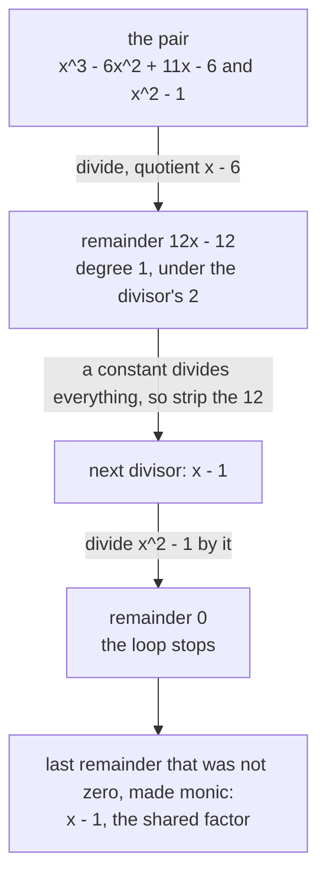

# Polynomials behave like integers: division with remainder, Euclid's algorithm and unique factorisation all work again

[Syllabus](../../../SYLLABUS.md) → [Algebra](../../../SYLLABUS.md#w03) → [Rings and Fields](../../../SYLLABUS.md#w03-s09) → Polynomials behave like integers

---

## General Overview

A tank design sheet carries two expressions in the same letter x: x^3 - 6x^2 + 11x - 6 and x^2 - 1. One is divided by the other further down the sheet, so any shared factor should cancel first. Which factor is it?

For whole numbers this is routine: divide and keep the leftover. With 84 and 36: 84 = 2 x 36 + 12, then 36 = 3 x 12 + 0, so they share 12, the last leftover that was not zero — Euclid's algorithm ([Euclid's algorithm](../../02-Number%20theory/02-Greatest%20Common%20Divisor%20and%20Euclid%27s%20Algorithm/03-euclidean-algorithm.md)). Guessing the factors of a cubic is not routine.

That loop never needed whole numbers. It needed division with remainder: a quotient, plus a leftover smaller than the divisor. Polynomials have that when their coefficients come from a field — a system where every nonzero number has a reciprocal, such as the fractions ([Fields](02-fields.md)). "Smaller" becomes "of lower degree", the degree being the highest power of x present.

Two rounds settle it: the cubic divided by x^2 - 1 leaves 12x - 12, then x^2 - 1 divided by x - 1 leaves nothing. The shared factor is x - 1.

**Over a field, polynomials divide with remainder, so Euclid's algorithm, primes and unique factorisation all come back, with degree doing the job size does for whole numbers.**

**What kind of fact this is:** a theorem, proved on this card in Why it works; uniqueness of the factorisation sits in the folded proof there.

### The picture: the loop on the sheet



Each round drops the divisor's degree.

---

## The formula

Division with remainder over a field:

$$f = q g + r, \qquad r = 0 \ \text{ or } \ \deg r < \deg g$$

**Read it aloud:** the polynomial is a quotient times the divisor, plus a remainder that is nothing at all, or of lower degree than the divisor.

| Symbol | Plain meaning | In our example | Push it up and the answer… |
| --- | --- | --- | --- |
| $F$, $F[x]$ | the coefficient field, and all polynomials in x over it | the fractions | more factors available |
| $f$ | the polynomial divided | x^3 - 6x^2 + 11x - 6 | — |
| $g$ | the divisor, never zero | x^2 - 1 | fewer rounds |
| $q$ | the quotient: copies of g removed | x - 6 | — |
| $r$ | the remainder, when no copy fits | 12x - 12 | zero means g divides f |
| $\deg f$ | the degree: highest power present | 3 | — |
| $h$ | the greatest common divisor (gcd), made monic | x - 1 | — |

$$\gcd(f, g) = \gcd(g, r)$$

In plain words: swapping (polynomial, divisor) for (divisor, remainder) changes nothing about what divides both. **Monic** means the top coefficient is 1. Every nonzero constant has a reciprocal and so divides everything, which leaves the gcd fixed only up to a constant; monic picks one. That is why 12x - 12 and x - 1 count as one answer.

### When it holds

- **Coefficients from a field.** Cancelling needs a reciprocal for the divisor's top coefficient, and whole numbers have none: dividing x by 2x asks for 1/2.
- **Degree shrinks, not size.** A remainder can be bigger in value than the divisor at some x; the loop still ends, degree being a count that falls.
- **Exact coefficients, one letter.** Rounding breaks exact division; with two letters nothing plays the part of degree.

---

## Why it works

### Step 0: a field lets the top term be cancelled, and cancelling drops the degree

Long division makes one move, repeated: subtract the multiple of the divisor carrying the same top term as whatever is left. Knocking x^3 off the cubic with x^2 - 1 needs the multiplier x; the -6x^2 surfacing next needs -6. The multiplier exists because the divisor's top coefficient divides into the one in hand, every nonzero number in a field having a reciprocal.

Each subtraction kills the top term, so what is left has lower degree, and a count that falls cannot fall forever. The division halts when what is left has degree below the divisor's, or is nothing: f = q g + r. No other pair works, since two quotients would differ by a nonzero polynomial times g, of degree at least deg g — more than remainders can differ by.

### Step 1: the remainder keeps every common divisor

Anything dividing f and g divides f - q g, which is r; anything dividing g and r divides q g + r, which is f. The two pairs have the same common divisors, so the swap loses nothing, and the new divisor has lower degree, so the remainder soon hits zero. That last divisor divides both originals, and every common divisor of them divides it — which is what greatest means: not bigger, but divisible by all the rest.

### Step 2: run the loop on the sheet

$$x^3 - 6x^2 + 11x - 6 = (x - 6)(x^2 - 1) + 12x - 12$$

The remainder becomes the next divisor, stripped of its constant 12.

$$x^2 - 1 = (x + 1)(x - 1) + 0$$

Zero remainder, so the loop stops at x - 1. No root was found on the way.

### Step 3: the primes of F[x]

A polynomial of degree 1 or more is **irreducible over F** when it is not a product of two polynomials of degree 1 or more with coefficients in F. Nonzero constants are the **units**, the invertible ones; like 1 and -1 among the whole numbers, they are not primes.

Any such polynomial is irreducible or splits into two of lower degree; repeat, and degrees fall until they cannot, so every polynomial of degree 1 or more is a product of irreducibles times a constant. Uniqueness is the content: **the irreducible factors are the same every time, up to order and up to nonzero constants** — proved as for whole numbers ([Why the factorisation is unique](../../02-Number%20theory/02-Greatest%20Common%20Divisor%20and%20Euclid%27s%20Algorithm/07-unique-factorisation.md)), through the same lemma ([Euclid's lemma](../../02-Number%20theory/02-Greatest%20Common%20Divisor%20and%20Euclid%27s%20Algorithm/06-euclids-lemma.md)).

<details>
<summary>Detailed proof: why the irreducible factors are the same every time</summary>

**A.** Each remainder is one polynomial minus a multiple of the other, so each is (something) times f plus (something) times g — the gcd included. That is Bezout's identity.

**B.** Let P be irreducible, dividing f g but neither factor. The monic gcd of P and f is 1: a common divisor of degree 1 or more would be P times a constant, making P divide f. So by A, u P + z f = 1 for polynomials u and z. Multiply by g: u P g + z f g = g, and P divides both left-hand terms, so P divides g. Contradiction — Euclid's lemma in F[x].

**C.** Take an irreducible from one factorisation: by B it divides a member of any other, and one irreducible dividing another leaves a constant. Cancel and repeat; monic factors leave only the order free.

</details>

**Another route.** Both split completely here — the cubic is (x - 1)(x - 2)(x - 3) — so their roots show the factor ([Roots and factors](../02-Polynomials/05-roots-and-the-factor-theorem.md)).

<details>
<summary>The names for what just happened: Euclidean domain, PID, UFD</summary>

A system with a division-with-remainder rule and a size that falls is a **Euclidean domain**: Z with size the absolute value, F[x] with size the degree. Every Euclidean domain is a **principal ideal domain**, a PID, in which every ideal is the multiples of one element ([Ideals and quotient rings](04-ideals-and-quotient-rings.md)). Every PID is a **unique factorisation domain**, a UFD. Both arrows go one way: a PID exists with no Euclidean size (Motzkin, 1949), and whole-number-coefficient polynomials are a UFD (Gauss's lemma) that is no PID. Named, not proved, here.

</details>

---

## Worked numbers, by hand

One round of long division at a time.

| Step | Arithmetic | Value |
| --- | --- | --- |
| take away x times g | f - (x^3 - x) | -6x^2 + 12x - 6 |
| take away -6 times g | that line - (-6x^2 + 6) | 12x - 12 |
| strip the constant | (12x - 12) / 12 | x - 1 |
| divide g by it | x^2 - 1 = (x + 1)(x - 1) | remainder 0 |
| the answer | leaves x^2 - 5x + 6 in f, x + 1 in g | **gcd = x - 1** |

The multipliers x and -6 make the quotient x - 6, and the pair shares nothing else.

### What breaks if you drop a piece

| Mistake | Comes out at | What went wrong |
| --- | --- | --- |
| Stopping at the first quotient | remainder 12x - 12, not 0 | x^2 - 1 does not divide the cubic |
| Taking x + 1, a factor of x^2 - 1 | remainder -24 in the cubic | a divisor must divide both; -24 is the cubic at x = -1 |

The code prints both.

---

## Code, from first principles, and it actually runs

A polynomial is a list of whole-number coefficients, constant term first. Two roads reach the gcd. Road one is the loop: divide, keep the remainder, strip its constant, repeat. Road two divides nothing — it evaluates each polynomial at every whole number from -9 to 9, keeps the numbers giving zero, and reads the shared factors off the shared numbers. The four asserts check the division identity by value, rebuild the cubic, compare the roads, and test a remainder.

### Python

```python
# Polynomials behave like integers -- the check behind the card.  Nothing is
# imported.  A polynomial is a list of whole-number coefficients, constant term
# first: [-6, 11, -6, 1] is x^3 - 6x^2 + 11x - 6 and [] is the zero polynomial.
# Every divisor here has leading coefficient 1, so whole numbers do; in general a field's fractions are needed.
def trim(p):                                   # drop zero top coefficients
    while p and p[-1] == 0: p.pop()
    return p
def show(p):                                   # write a polynomial the way the card does
    out = "" if p else "0"
    for k in range(len(p) - 1, -1, -1):
        c, a = p[k], abs(p[k])
        if c == 0: continue
        out += (" - " if c < 0 else " + ") if out else ("-" if c < 0 else "")
        out += ("" if a == 1 and k else str(a)) + ("" if k == 0 else "x" if k == 1 else f"x^{k}")
    return out
def value(p, t):                               # what the polynomial comes to at x = t
    return sum(c * t ** k for k, c in enumerate(p))
def divide(f, g):                              # long division, one top term cancelled at a time
    assert g and g[-1] == 1                    # the step needs 1 over the top coefficient
    q, r = [0] * max(0, len(f) - len(g) + 1), f[:]
    while r and len(r) >= len(g):
        k, c = len(r) - len(g), r[-1]
        q[k] = c
        for j, t in enumerate(g): r[k + j] -= c * t
        trim(r)
    return trim(q), r
def gcd(a, b):                                 # Euclid on whole numbers, the copied pattern
    while b: a, b = b, a % b
    return abs(a)
def primitive(p):                              # strip the shared whole-number constant
    d, s = 0, -1 if p[-1] < 0 else 1
    for c in p: d = gcd(d, c)
    return [s * c // d for c in p]
def euclid(f, g):                              # road one: divide, keep the remainder, repeat
    steps = []
    while g:
        q, r = divide(f, g)
        steps.append(f"{show(f)} = ({show(q)})({show(g)}) + {show(r)}")
        f, g = g, primitive(r) if r else []
    return f, steps
f, g, twog, root2 = [-6, 11, -6, 1], [-1, 0, 1], [-2, 0, 2], [-2, 0, 1]
q1, r1 = divide(f, g); h, steps = euclid(f, g)
rf = [t for t in range(-9, 10) if value(f, t) == 0]        # road two: hunt whole-number roots
rg, rh = [t for t in range(-9, 10) if value(g, t) == 0], [t for t in range(-9, 10) if value(h, t) == 0]
shared = [t for t in rf if t in rg]
print(f"f = {show(f)}, degree {len(f) - 1}; g = {show(g)}, degree {len(g) - 1}")
for i, s in enumerate(steps, 1): print(f"Euclid step {i}: {s}")
print(f"last nonzero remainder, made monic: {show(h)}, degree {len(h) - 1}")
print(f"whole-number roots -- f: {rf}, g: {rg}, shared: {shared}, gcd: {rh}")
print(f"f divided by {show(h)}: {show(divide(f, h)[0])}, remainder {show(divide(f, h)[1])}; g divided by {show(h)}: {show(divide(g, h)[0])}, remainder {show(divide(g, h)[1])}")
print(f"the same loop on whole numbers: 84 = {84 // 36} x 36 + {84 % 36}, 36 = {36 // 12} x 12 + {36 % 12}, gcd {gcd(84, 36)}")
print(f"stopping at the first quotient {show(q1)}: remainder {show(r1)}, not 0")
print(f"x + 1 divides g, so try it on f: remainder {show(divide(f, [1, 1])[1])}, and f(-1) = {value(f, -1)}")
print(f"constants are units: {show(twog)} strips to {show(primitive(twog))}, {show(r1)} strips to {show(primitive(r1))}")
print(f"{show(root2)} at x = -2, -1, 1, 2: {[value(root2, t) for t in (-2, -1, 1, 2)]}, no whole-number root")
assert all(value(f, t) == value(q1, t) * value(g, t) + value(r1, t) for t in range(-4, 5))
assert all(value(f, t) == (t - 1) * (t - 2) * (t - 3) for t in range(-4, 5))
assert rh == shared and len(h) - 1 == len(shared) and h[-1] == 1 and primitive(r1) == h
assert divide(f, [1, 1])[1] == [value(f, -1)] and value(f, -1) != 0
print("ALL CHECKS PASS")
```

**Ran 2026-09-14 on macOS, Python 3.14.6, standard library only. All checks passed. Output, pasted from the run:**

```
f = x^3 - 6x^2 + 11x - 6, degree 3; g = x^2 - 1, degree 2
Euclid step 1: x^3 - 6x^2 + 11x - 6 = (x - 6)(x^2 - 1) + 12x - 12
Euclid step 2: x^2 - 1 = (x + 1)(x - 1) + 0
last nonzero remainder, made monic: x - 1, degree 1
whole-number roots -- f: [1, 2, 3], g: [-1, 1], shared: [1], gcd: [1]
f divided by x - 1: x^2 - 5x + 6, remainder 0; g divided by x - 1: x + 1, remainder 0
the same loop on whole numbers: 84 = 2 x 36 + 12, 36 = 3 x 12 + 0, gcd 12
stopping at the first quotient x - 6: remainder 12x - 12, not 0
x + 1 divides g, so try it on f: remainder -24, and f(-1) = -24
constants are units: 2x^2 - 2 strips to x^2 - 1, 12x - 12 strips to x - 1
x^2 - 2 at x = -2, -1, 1, 2: [2, -1, -1, 2], no whole-number root
ALL CHECKS PASS
```

### Rust

Same numbers, same labels, from `rustc --edition 2021 -O`.

```rust
// Polynomials behave like integers -- the same check as the Python, in Rust.  No
// crates.  A polynomial is a list of whole-number coefficients, constant term
// first: [-6, 11, -6, 1] is x^3 - 6x^2 + 11x - 6 and [] is the zero polynomial.
// Every divisor here has leading coefficient 1, so whole numbers do; in general a field's fractions are needed.
fn trim(mut p: Vec<i64>) -> Vec<i64> {         // drop zero top coefficients
    while p.last() == Some(&0) { p.pop(); }
    p
}
fn show(p: &[i64]) -> String {                 // write a polynomial the way the card does
    let mut out = String::from(if p.is_empty() { "0" } else { "" });
    for k in (0..p.len()).rev() {
        let (c, a) = (p[k], p[k].abs());
        if c == 0 { continue; }
        out.push_str(if out.is_empty() { if c < 0 { "-" } else { "" } } else if c < 0 { " - " } else { " + " });
        if !(a == 1 && k > 0) { out.push_str(&a.to_string()); }
        out.push_str(&if k == 0 { String::new() } else if k == 1 { "x".to_string() } else { format!("x^{}", k) });
    }
    out
}
fn value(p: &[i64], t: i64) -> i64 {           // what the polynomial comes to at x = t
    let mut s = 0;
    for (k, &c) in p.iter().enumerate() { s += c * t.pow(k as u32); }
    s
}
fn divide(f: &[i64], g: &[i64]) -> (Vec<i64>, Vec<i64>) {   // long division, a top term at a time
    assert!(!g.is_empty() && *g.last().unwrap() == 1);      // the step needs 1 over the top coefficient
    let mut q = vec![0i64; if f.len() >= g.len() { f.len() - g.len() + 1 } else { 0 }];
    let mut r = f.to_vec();
    while !r.is_empty() && r.len() >= g.len() {
        let (k, c) = (r.len() - g.len(), *r.last().unwrap());
        q[k] = c;
        for (j, t) in g.iter().enumerate() { r[k + j] -= c * t; }
        r = trim(r);
    }
    (trim(q), r)
}
fn gcd(a: i64, b: i64) -> i64 { if b == 0 { a.abs() } else { gcd(b, a % b) } }   // whole-number Euclid
fn primitive(p: &[i64]) -> Vec<i64> {          // strip the shared whole-number constant
    let mut d = 0;
    for &c in p { d = gcd(d, c); }
    let s = if *p.last().unwrap() < 0 { -1 } else { 1 };
    p.iter().map(|&c| s * c / d).collect()
}
fn euclid(f0: &[i64], g0: &[i64]) -> (Vec<i64>, Vec<String>) {   // road one: divide, keep the remainder
    let (mut f, mut g, mut steps) = (f0.to_vec(), g0.to_vec(), Vec::new());
    while !g.is_empty() {
        let (q, r) = divide(&f, &g);
        steps.push(format!("{} = ({})({}) + {}", show(&f), show(&q), show(&g), show(&r)));
        f = g;
        g = if r.is_empty() { Vec::new() } else { primitive(&r) };
    }
    (f, steps)
}
fn main() {
    let (f, g) = (vec![-6i64, 11, -6, 1], vec![-1i64, 0, 1]);
    let (twog, root2) = (vec![-2i64, 0, 2], vec![-2i64, 0, 1]);
    let (q1, r1) = divide(&f, &g);
    let (h, steps) = euclid(&f, &g);
    let rf: Vec<i64> = (-9..=9).filter(|&t| value(&f, t) == 0).collect();   // road two: hunt the roots
    let rg: Vec<i64> = (-9..=9).filter(|&t| value(&g, t) == 0).collect();
    let rh: Vec<i64> = (-9..=9).filter(|&t| value(&h, t) == 0).collect();
    let shared: Vec<i64> = rf.iter().cloned().filter(|t| rg.contains(t)).collect();
    println!("f = {}, degree {}; g = {}, degree {}", show(&f), f.len() - 1, show(&g), g.len() - 1);
    for (i, s) in steps.iter().enumerate() { println!("Euclid step {}: {}", i + 1, s); }
    println!("last nonzero remainder, made monic: {}, degree {}", show(&h), h.len() - 1);
    println!("whole-number roots -- f: {:?}, g: {:?}, shared: {:?}, gcd: {:?}", rf, rg, shared, rh);
    println!("f divided by {}: {}, remainder {}; g divided by {}: {}, remainder {}", show(&h),
             show(&divide(&f, &h).0), show(&divide(&f, &h).1), show(&h), show(&divide(&g, &h).0), show(&divide(&g, &h).1));
    println!("the same loop on whole numbers: 84 = {} x 36 + {}, 36 = {} x 12 + {}, gcd {}", 84 / 36, 84 % 36, 36 / 12, 36 % 12, gcd(84, 36));
    println!("stopping at the first quotient {}: remainder {}, not 0", show(&q1), show(&r1));
    println!("x + 1 divides g, so try it on f: remainder {}, and f(-1) = {}", show(&divide(&f, &[1, 1]).1), value(&f, -1));
    println!("constants are units: {} strips to {}, {} strips to {}", show(&twog), show(&primitive(&twog)), show(&r1), show(&primitive(&r1)));
    let vals: Vec<i64> = [-2, -1, 1, 2].iter().map(|&t| value(&root2, t)).collect();
    println!("{} at x = -2, -1, 1, 2: {:?}, no whole-number root", show(&root2), vals);
    assert!((-4..=4).all(|t| value(&f, t) == value(&q1, t) * value(&g, t) + value(&r1, t)));
    assert!((-4..=4).all(|t| value(&f, t) == (t - 1) * (t - 2) * (t - 3)));
    assert!(rh == shared && h.len() - 1 == shared.len() && *h.last().unwrap() == 1 && primitive(&r1) == h);
    assert!(divide(&f, &[1, 1]).1 == vec![value(&f, -1)] && value(&f, -1) != 0);
    println!("ALL CHECKS PASS");
}
```

**Ran 2026-09-14 on macOS, rustc 1.98.1, no crates. All checks passed. Output, pasted from the run:**

```
f = x^3 - 6x^2 + 11x - 6, degree 3; g = x^2 - 1, degree 2
Euclid step 1: x^3 - 6x^2 + 11x - 6 = (x - 6)(x^2 - 1) + 12x - 12
Euclid step 2: x^2 - 1 = (x + 1)(x - 1) + 0
last nonzero remainder, made monic: x - 1, degree 1
whole-number roots -- f: [1, 2, 3], g: [-1, 1], shared: [1], gcd: [1]
f divided by x - 1: x^2 - 5x + 6, remainder 0; g divided by x - 1: x + 1, remainder 0
the same loop on whole numbers: 84 = 2 x 36 + 12, 36 = 3 x 12 + 0, gcd 12
stopping at the first quotient x - 6: remainder 12x - 12, not 0
x + 1 divides g, so try it on f: remainder -24, and f(-1) = -24
constants are units: 2x^2 - 2 strips to x^2 - 1, 12x - 12 strips to x - 1
x^2 - 2 at x = -2, -1, 1, 2: [2, -1, -1, 2], no whole-number root
ALL CHECKS PASS
```

The two outputs match line for line.

> [!TIP]
> **Try changing**
> Guess first, then run it. An assert stops the program when a number comes out wrong.
> - **Skip the constant-stripping.** In `euclid`, pass the raw remainder on instead of `primitive(r)`: the next divisor is 12x - 12, and `divide`'s monic check halts the run.
> - **Break the multiplier.** In `divide`, record `c + 1` for `c`: the division identity fails, and the first assert halts the run.
> - **Ask for the gcd of the cubic and x + 1.** Set `g` to `[1, 1]`: the loop ends on -24, stripped to the constant 1. No assert fires, because gcd 1 is the right answer: the two share no factor.

---

## The usual mistake

> [!warning]
> **Reading "greatest" as "bigger".** It is not the common divisor with the larger value at some x, nor the one with larger coefficients, but the one every other common divisor divides.
>
> - **Irreducible depends on the field.** Splitting x^2 - 2 over the fractions needs a fraction root, and in lowest terms such a root has top dividing 2 and bottom dividing 1: only -2, -1, 1 and 2 can be tried. The code prints 2, -1, -1 and 2 there, so no root exists. Over the real numbers it splits in two.
> - **Promoting a factor of one to a factor of both.** x + 1 divides x^2 - 1 exactly and leaves -24 in the cubic.
> - **Expecting roots to do the job.** Roots find only linear factors; the loop finds the gcd even when neither polynomial has a root.

---

## Where you meet it in real life

- **Cancelling an algebraic fraction.** Any system simplifying a ratio of polynomials runs this loop first.
- **Error-correcting codes.** A QR code's data are coefficients of a polynomial over a finite field, and decoding is division with remainder and gcd work ([Finite fields](05-finite-fields.md)).

> **Say it back**
> Over a field, one polynomial divided by another leaves a quotient and a remainder of lower degree, which is all Euclid's algorithm ever needed. So the loop runs on polynomials: divide, keep the remainder, repeat. Two rounds on the sheet return x - 1, the factor the two expressions share. Each swap keeps every common divisor, so nothing is lost, and the answer is pinned once it is made monic. Irreducible polynomials are the primes here, and a factorisation into them never changes.

---

## What this builds on

- [Polynomial long division](../02-Polynomials/04-polynomial-division.md): the division this card loops.
- [Roots and factors](../02-Polynomials/05-roots-and-the-factor-theorem.md): a root at x = c is a factor x - c.
- [Fields](02-fields.md): why nonzero coefficients can be divided by.
- [Euclid's algorithm](../../02-Number%20theory/02-Greatest%20Common%20Divisor%20and%20Euclid%27s%20Algorithm/03-euclidean-algorithm.md): the whole-number loop, copied unchanged.
- [Why the factorisation is unique](../../02-Number%20theory/02-Greatest%20Common%20Divisor%20and%20Euclid%27s%20Algorithm/07-unique-factorisation.md): the theorem Step 3 repeats.
- [Euclid's lemma](../../02-Number%20theory/02-Greatest%20Common%20Divisor%20and%20Euclid%27s%20Algorithm/06-euclids-lemma.md): the lemma the folded proof rebuilds.

## Where this goes next

- [Ideals and quotient rings](04-ideals-and-quotient-rings.md): keep only remainders, as clock time does after 12, and a number system appears.
- [Gaussian integers](../10-For%20the%20Curious/03-gaussian-integers-and-sums-of-two-squares.md): the same division with a square root of -1.
- [Pell's equation](../10-For%20the%20Curious/04-pell-equation-and-root-two.md): the loop on numbers built from root 2.
- Field extensions: an irreducible divisor makes a bigger field.
- Minimal polynomials: each new number carries one irreducible polynomial.
- Domains, principal ideals and unique factorisation: the folded tip's hierarchy, proved.

The loop returns x - 1 and stops. Treat all polynomials with the same remainder as one object and the remainders become a number system: that is the next card.

---

## Sources

Verified 14 Sep 2026: every link below resolves to the publisher's page.

- Judson, Thomas W. *Abstract Algebra: Theory and Applications*, free. Division with remainder: [17.2 The Division Algorithm](https://math.libretexts.org/Bookshelves/Abstract_and_Geometric_Algebra/Abstract_Algebra%3A_Theory_and_Applications_(Judson)/17%3A_Polynomials/17.02%3A_The_Division_Algorithm). The hierarchy, Theorem 18.21 and Remark 18.33: [18.2 Factorization in Integral Domains](https://math.libretexts.org/Bookshelves/Abstract_and_Geometric_Algebra/Abstract_Algebra%3A_Theory_and_Applications_(Judson)/18%3A_Integral_Domains/18.02%3A_Factorization_in_Integral_Domains).
- Artin, Michael. *Algebra*, Classic Version, 2nd edition. Section 12.2 for unique factorisation domains and the size making F[x] Euclidean, 12.3 for Gauss's lemma. Publisher page, paid: [Pearson](https://www.pearson.com/en-us/subject-catalog/p/Artin-Algebra-Classic-Version-2nd-Edition/P200000006078/9780137980994).
- Motzkin, Theodore. "The Euclidean algorithm." *Bulletin of the AMS* 55 (1949). The first PID shown to carry no Euclidean size: [Project Euclid](https://projecteuclid.org/journals/bulletin-of-the-american-mathematical-society/volume-55/issue-12/The-Euclidean-algorithm/bams/1183514381.full).
