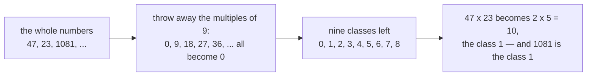

# Ideals and quotient rings: the multiples of n are the model, collapsing by them gives Z mod n, and every ring map has one as its kernel

Algebra → Rings and Fields → Collapsing a ring → Ideals and quotient rings

---

## General Overview

A delivery note lists 47 crates of bolts at $23 a crate. The printed total is $1,081. One check on it is centuries old: divide by 9 and keep the leftovers.

47 leaves 2. 23 leaves 5. Their product, 2 × 5 = 10, leaves 1. The total 1,081 leaves 1 as well, so it survives the check, a trick called **casting out nines**.

Notice what held. Every multiple of 9 became 0, almost every whole number gone, and multiplication still worked. Not every set can go that way: the multiples of 9 can, {0, 4, 6, 8} on the 12-hour clock cannot. A set that can is an **ideal**, and the arithmetic left behind is a **quotient ring**.

**An ideal is a set a ring can afford to treat as zero: throw it away, and addition and multiplication still work on what is left.**

**What kind of fact this is:** a definition, the two-part ideal test, with one theorem proved below: a ring map's kernel is always an ideal, and collapsing by it leaves the image.

### The picture



---

## The formula

Write $R$ for the ring being collapsed ([rings](01-rings.md)) and $I$ for the set thrown away — here the multiples of 9, written 9Z, with Z naming the whole numbers. A **class** is a pile the collapse leaves: everything differing from a name $a$ by a thrown-away amount.

$$a + I = \{\, a + i : i \in I \,\} \qquad a + I = b + I \ \text{ exactly when } \ a - b \in I$$

$$(a + I) + (b + I) = (a + b) + I \qquad (a + I)(b + I) = ab + I$$

**Read it aloud:** two numbers name one class when their difference was thrown away; to combine classes, combine any two names and see where the answer falls.

A nonempty $I$ is an **ideal** when both hold for every $a$, $b$ in $I$ and every $r$ in $R$:

$$a - b \in I \qquad ra \in I \ \text{ and } \ ar \in I$$

The first is closure under subtraction. The second is **absorbing**: a member times anything in the ring, either side, stays inside. Multiples of 9 absorb: a whole number times a multiple of 9 is another one.

| Symbol | Plain meaning | In our example | Change it and… |
| --- | --- | --- | --- |
| $R$, $I$ | the ring collapsed, the set thrown away | the whole numbers; multiples of 9 | a larger ideal, fewer classes |
| $a$, $b$, $r$ | members; a and b name classes, r is any member | 47, 23, any whole number | other names, same answer |
| $a + I$, $R/I$ | the class of a, the ring of classes, "R over I" | …, −7, 2, 11, 20, …; Z mod 9 | — |
| $\varphi$, $\ker\varphi$ | a ring map, all it sends to 0 | casting out nines; multiples of 9 | — |

### When it holds

- **Both halves.** {0, 4, 6, 8} on the 12-hour clock absorbs every product, yet 4 + 6 = 10 lies outside it; the constant polynomials are closed under subtraction, yet 1 times x escapes them. Either failure lets two names for one class give two answers.
- **Both sides.** Where multiplication order matters, both ra and ar must stay inside, or a product depends on the names picked.
- **Proper.** Throw the whole ring away and one class is left, where 1 and 0 agree: true, and empty.

---

## Why it works

### Step 0: the name must not matter

With the multiples of 9 gone, 47 and 56 name one class, so "multiply the classes" means something only if 47 × 23 and 56 × 32 land together.

### Step 1: where the test comes from

Change the names $a$ and $b$ by thrown-away amounts i and j. Adding:

$$(a + i) + (b + j) = (a + b) + (i + j)$$

The answer moved by i + j, so the set must hold sums, and differences too because names differ by a member: closure under subtraction. Multiplying:

$$(a + i)(b + j) = ab + aj + ib + ij$$

Now it moved by aj, ib and ij, each pairing a ring member with a thrown-away one, and nothing so far puts them inside. Demanding it is the second half of the test, and granting it holds the product's class still.

### Step 2: the invoice, two roads

Small names first: 47 leaves 2, 23 leaves 5, and 2 × 5 = 10 leaves 1. Large names first: 1,081 leaves 1. The script shifts both names by multiples of 9: all 121 pairs land in class 1.

### Step 3: the clock is Z over 9Z

Those nine classes are Z mod 9 ([modular-addition-and-multiplication](../../02-Number%20theory/03-Clock%20Arithmetic/02-modular-addition-and-multiplication.md)). Clock arithmetic is no separate invention: it is this construction, $R$ the whole numbers, $I$ the multiples of 9. Every ideal of Z is the multiples of some n: its smallest positive member divides the rest.

### Step 4: kernels are ideals

A **ring map** $\varphi$ carries both operations across: sums go to sums, products to products. Casting out nines is one; its **kernel**, all it sends to 0, is the multiples of 9.

Every kernel passes the test. If $a$ and $b$ go to 0, so does $a - b$: closed. If $a$ goes to 0, so do ra and ar, each an image times 0: absorbing. And sending each member to its class is a ring map with kernel $I$, so ideals and kernels are one list. The **first isomorphism theorem** states the pairing:

$$R/\ker\varphi \;\cong\; \operatorname{im}\varphi$$

≅ means one ring under two sets of names, and the image is what the map reaches: the nine classes are exactly the nine values the check returns.

<details>
<summary>Detailed proof: collapsing by the kernel leaves the image</summary>

Write K for the kernel, and send the class a + K to its image.
- **A function, and one-to-one.** If a + K = b + K then a − b is in K, so the two names have one image. Backwards: equal images make the image of a − b zero, so a − b is in K and the classes were equal.
- **Onto, and carrying the arithmetic.** Every image is hit by the class of its input; sums go to sums, products to products. That is ≅.

</details>

<details>
<summary>When the collapsed world has no zero divisors, and when it has division</summary>

Collapsing promises nothing about division: in Z mod 9 the class 3 is not 0, yet 3 × 3 = 0, a pair of zero divisors. Two conditions govern them where multiplication order does not matter. An ideal is **prime** when a product landing inside forces a factor inside, and no zero divisors survive: an **integral domain**. It is **maximal** when no ideal fits between it and the ring, and every nonzero class then has a reciprocal: a **field**.

| The ideal | The collapsed world | The ideal is |
| --- | --- | --- |
| multiples of 7 | Z mod 7: all 6 nonzero classes have a reciprocal | maximal, so prime |
| multiples of 9 | Z mod 9: 3 × 3 = 0; 6 of 8 have one | neither |

A prime number's multiples give a field; a composite's give zero divisors.

</details>

---

## Worked numbers, by hand

| Step | Arithmetic | Value |
| --- | --- | --- |
| the classes of 47 and 23 | divide by 9 | 2 and 5 |
| multiply the classes, then reduce | 2 × 5 = 10, then 10 − 9 | **1** |
| the class of the total 1,081 | divide by 9 | **1** |

The roads agree, so the total passes; a mismatch would prove an error.

### A second collapse: polynomials by x^2 + 1

The same runs on polynomials ([polynomials-behave-like-integers](03-polynomials-behave-like-integers.md)). Throw away every multiple of x^2 + 1. Division with remainder gives each class one name c + dx, two coordinates, and x^2 + 1 being 0 makes squaring x give −1. Multiplying (2 + 3x)(4 + x) out gives 8 + 14x + 3x^2; replacing 3x^2 by −3 leaves **5 + 14x**. The coordinate rule, with c, d, u, v real,

$$(c + dx)(u + vx) = (cu - dv) + (cv + du)x$$

gives 5 + 14x as well. That world is the doorway to the complex numbers; the collapse run over a clock instead is [finite-fields](05-finite-fields.md).

### What breaks if you drop a piece

| Mistake | Comes out at | What went wrong |
| --- | --- | --- |
| A passed check read as proof | 1,090 is class 1 too | Multiples of 9 were thrown away |
| Stopping at 2 × 5 | 10 | A name, not a class: it is class 1 |
| Collapsing by the constants | x | The constants do not absorb x |

---

## Code, from first principles, and it actually runs

Nothing is imported. Three roads reach the class: divide the total by 9; divide each factor first, then multiply; add decimal digits, which never divides by 9. Both names are then shifted, 121 pairs. The ideal test is written once, for any finite ring given with its operations.

### Python

```python
# Ideals and quotient rings -- the check behind the card.  Nothing is imported.  An
# invoice claims 47 crates at $23 each come to $1,081.  Casting out nines maps the
# whole numbers to Z mod 9, with the multiples of 9 as its kernel; the class of the
# total is reached by three roads, no two sharing a step.  Polynomials follow.
A, B, N = 47, 23, 9
def digit_class(n):                 # a road with no division by 9 in it at all
    while n > 9:
        n = sum(int(c) for c in str(n))
    return 0 if n == 9 else n
def is_ideal(ring, sub, add, mul):  # a subgroup under +, and it absorbs the ring
    closed = all(any(add(b, c) == a for c in sub) for a in sub for b in sub)
    return closed and all(mul(r, a) in sub and mul(a, r) in sub
                          for r in ring for a in sub)
def reduce_poly(c):                 # x^2 + 1 is zero, so x^k becomes -x^(k-2)
    c = list(c)
    while len(c) > 2:
        top = c.pop()
        c[len(c) - 2] -= top
    return tuple(c)
def poly_product(a, b):             # road one: multiply out in full, then reduce
    raw = [0] * (len(a) + len(b) - 1)
    for i in range(len(a)):
        for j in range(len(b)):
            raw[i + j] += a[i] * b[j]
    return raw, reduce_poly(raw)
def pair_product(a, b, m=0):        # road two: the two-coordinate formula
    c, d = a[0] * b[0] - a[1] * b[1], a[0] * b[1] + a[1] * b[0]
    return (c % m, d % m) if m else (c, d)
def reciprocals(n):                 # how many nonzero classes have a reciprocal
    return len([a for a in range(1, n) if any((a * b) % n == 1 for b in range(1, n))])
total, direct, classes = A * B, (A * B) % N, (A % N) * (B % N)  # reduce late, or early
shifted = [((A + N * i) * (B + N * j)) % N for i in range(-5, 6) for j in range(-5, 6)]
kernel = [k for k in range(41) if k % N == 0]
clock, cadd, cmul = list(range(12)), lambda a, b: (a + b) % 12, lambda a, b: (a * b) % 12
world = [(c, d) for c in range(3) for d in range(3)]   # x^2 = -1, coefficients mod 3
consts, wadd = [(c, 0) for c in range(3)], lambda p, q: ((p[0] + q[0]) % 3, (p[1] + q[1]) % 3)
ideals = [is_ideal(clock, [0, 3, 6, 9], cadd, cmul), is_ideal(clock, [0, 4, 6, 8], cadd, cmul),
          is_ideal(world, consts, wadd, lambda p, q: pair_product(p, q, 3))]
raw, poly = poly_product((2, 3), (4, 1))
pair, xx = pair_product((2, 3), (4, 1)), reduce_poly([0, 0, 1])
r9, r7, x1 = reciprocals(9), reciprocals(7), pair_product((0, 1), (1, 0))
print(f"the invoice: {A} x {B} = {total}")
print(f"class of the total, three roads: remainder of {total} is {direct}; classes "
      f"{A % N} x {B % N} = {classes} then {classes % N}; digit sums {digit_class(total)}")
print(f"other names, {A + N} x {B + N} = {(A + N) * (B + N)}, class {((A + N) * (B + N)) % N}")
print(f"all {len(shifted)} shifted pairs of names give one class: {sorted(set(shifted))}")
print(f"the wrong total 1090 has class {digit_class(1090)} too, so the check passes it")
print(f"kernel of casting out nines, 0 to 40: {kernel}")
print(f"ideal test: {{0, 3, 6, 9}} in Z mod 12 {str(ideals[0]).lower()}, {{0, 4, 6, 8}} "
      f"{str(ideals[1]).lower()}, the constants in the x^2 = -1 world {str(ideals[2]).lower()}")
print(f"(2 + 3x)(4 + x) multiplied out: {raw[0]} + {raw[1]}x + {raw[2]}x^2")
print(f"reduced by x^2 + 1: {poly[0]} + {poly[1]}x; coordinates: {pair[0]} + {pair[1]}x")
print(f"x times x reduced: {xx[0]} + {xx[1]}x; x times the constant 1: {x1[0]} + {x1[1]}x")
print(f"zero product among nonzero classes: 3 x 3 = {(3 * 3) % 9} in Z mod 9; with a "
      f"reciprocal: {r9} of 8 in Z mod 9, {r7} of 6 in Z mod 7")
assert direct == classes % N == digit_class(total) == 1
assert set(shifted) == {direct} and digit_class(1090) == direct and digit_class(1082) != direct
assert ideals == [True, False, False] and kernel == [0,9,18,27,36] and raw == [8, 14, 3]
assert poly == pair == (5, 14) and xx == (-1, 0) and x1 == (0, 1) and r9 == 6 and r7 == 6
print("ALL CHECKS PASS")
```

**Ran 2026-09-14 on macOS, Python 3.14.6, standard library only. All checks passed. Output, pasted from the run:**

```
the invoice: 47 x 23 = 1081
class of the total, three roads: remainder of 1081 is 1; classes 2 x 5 = 10 then 1; digit sums 1
other names, 56 x 32 = 1792, class 1
all 121 shifted pairs of names give one class: [1]
the wrong total 1090 has class 1 too, so the check passes it
kernel of casting out nines, 0 to 40: [0, 9, 18, 27, 36]
ideal test: {0, 3, 6, 9} in Z mod 12 true, {0, 4, 6, 8} false, the constants in the x^2 = -1 world false
(2 + 3x)(4 + x) multiplied out: 8 + 14x + 3x^2
reduced by x^2 + 1: 5 + 14x; coordinates: 5 + 14x
x times x reduced: -1 + 0x; x times the constant 1: 0 + 1x
zero product among nonzero classes: 3 x 3 = 0 in Z mod 9; with a reciprocal: 6 of 8 in Z mod 9, 6 of 6 in Z mod 7
ALL CHECKS PASS
```

### Rust

Same labels, same numbers, built with `rustc -O`.

```rust
// Ideals and quotient rings -- the same check as the Python, in Rust.  No crates.  An
// invoice claims 47 crates at $23 each come to $1,081.  Casting out nines maps the
// whole numbers to Z mod 9, with the multiples of 9 as its kernel; the class of the
// total is reached by three roads, no two sharing a step.  Polynomials follow.
const A: i64 = 47; const B: i64 = 23; const N: i64 = 9;
fn digit_class(mut n: i64) -> i64 {      // a road with no division by 9 in it at all
    while n > 9 {
        let mut s = 0;
        while n > 0 { s += n % 10; n /= 10; }
        n = s;
    }
    if n == 9 { 0 } else { n }
}
fn is_ideal<T: Copy + PartialEq>(ring: &[T], sub: &[T], add: fn(T, T) -> T,
                                 mul: fn(T, T) -> T) -> bool {
    let closed = sub.iter().all(|&a| sub.iter().all(|&b| sub.iter().any(|&c| add(b, c) == a)));
    closed && ring.iter().all(|&r| sub.iter()
        .all(|&a| sub.contains(&mul(r, a)) && sub.contains(&mul(a, r))))
}
fn cadd(a: i64, b: i64) -> i64 { (a + b).rem_euclid(12) }          // the 12-hour clock
fn cmul(a: i64, b: i64) -> i64 { (a * b).rem_euclid(12) }
fn wadd(p: (i64, i64), q: (i64, i64)) -> (i64, i64) { ((p.0 + q.0) % 3, (p.1 + q.1) % 3) }
fn wmul(p: (i64, i64), q: (i64, i64)) -> (i64, i64) { pair_product(p, q, 3) }
fn reduce_poly(c: &[i64]) -> (i64, i64) {  // x^2 + 1 is zero, so x^k becomes -x^(k-2)
    let mut v = c.to_vec();
    while v.len() > 2 {
        let top = v.pop().unwrap();
        let k = v.len() - 2; v[k] -= top;
    }
    (v[0], v[1])
}
fn poly_product(a: &[i64], b: &[i64]) -> (Vec<i64>, (i64, i64)) {
    let mut raw = vec![0; a.len() + b.len() - 1];   // multiply out in full, then reduce
    for i in 0..a.len() { for j in 0..b.len() { raw[i + j] += a[i] * b[j]; } }
    (raw.clone(), reduce_poly(&raw))
}
fn pair_product(a: (i64, i64), b: (i64, i64), m: i64) -> (i64, i64) {   // coordinates
    let (c, d) = (a.0 * b.0 - a.1 * b.1, a.0 * b.1 + a.1 * b.0);
    if m != 0 { (c.rem_euclid(m), d.rem_euclid(m)) } else { (c, d) }
}
fn reciprocals(n: i64) -> usize {        // how many nonzero classes have a reciprocal
    (1..n).filter(|&a| (1..n).any(|b| (a * b).rem_euclid(n) == 1)).count()
}
fn main() {
    let (total, direct, classes) = (A * B, (A * B) % N, (A % N) * (B % N));
    let mut shifted: Vec<i64> = Vec::new();
    for i in -5..=5 {
        for j in -5..=5 { shifted.push(((A + N * i) * (B + N * j)).rem_euclid(N)); }
    }
    let kernel: Vec<i64> = (0..41).filter(|k| k % N == 0).collect();
    let clock: Vec<i64> = (0..12).collect();
    let world: Vec<(i64, i64)> = (0..3).flat_map(|c| (0..3).map(move |d| (c, d))).collect();
    let consts: Vec<(i64, i64)> = (0..3).map(|c| (c, 0)).collect();
    let ideals = [is_ideal(&clock, &[0, 3, 6, 9], cadd, cmul),
                  is_ideal(&clock, &[0, 4, 6, 8], cadd, cmul), is_ideal(&world, &consts, wadd, wmul)];
    let (raw, poly) = poly_product(&[2, 3], &[4, 1]);
    let (pair, xx) = (pair_product((2, 3), (4, 1), 0), reduce_poly(&[0, 0, 1]));
    let (r9, r7, x1) = (reciprocals(9), reciprocals(7), pair_product((0, 1), (1, 0), 0));
    let mut one = shifted.clone(); one.sort(); one.dedup();
    println!("the invoice: {} x {} = {}", A, B, total);
    println!("class of the total, three roads: remainder of {} is {}; classes {} x {} = {} then \
              {}; digit sums {}", total, direct, A % N, B % N, classes, classes % N, digit_class(total));
    println!("other names, {} x {} = {}, class {}", A + N, B + N, (A + N) * (B + N),
             ((A + N) * (B + N)) % N);
    println!("all {} shifted pairs of names give one class: {:?}", shifted.len(), one);
    println!("the wrong total 1090 has class {} too, so the check passes it", digit_class(1090));
    println!("kernel of casting out nines, 0 to 40: {:?}", kernel);
    println!("ideal test: {{0, 3, 6, 9}} in Z mod 12 {}, {{0, 4, 6, 8}} {}, the constants in the \
              x^2 = -1 world {}", ideals[0], ideals[1], ideals[2]);
    println!("(2 + 3x)(4 + x) multiplied out: {} + {}x + {}x^2", raw[0], raw[1], raw[2]);
    println!("reduced by x^2 + 1: {} + {}x; coordinates: {} + {}x", poly.0, poly.1, pair.0, pair.1);
    println!("x times x reduced: {} + {}x; x times the constant 1: {} + {}x", xx.0, xx.1, x1.0, x1.1);
    println!("zero product among nonzero classes: 3 x 3 = {} in Z mod 9; with a \
              reciprocal: {} of 8 in Z mod 9, {} of 6 in Z mod 7", (3 * 3) % 9, r9, r7);
    assert!(direct == classes % N && classes % N == digit_class(total) && direct == 1);
    assert!(one == vec![direct] && digit_class(1090) == direct && digit_class(1082) != direct);
    assert!(ideals == [true, false, false] && kernel == vec![0,9,18,27,36] && raw == vec![8, 14, 3]);
    assert!(poly == pair && pair == (5, 14) && xx == (-1, 0) && x1 == (0, 1) && r9 == 6 && r7 == 6);
    println!("ALL CHECKS PASS");
}
```

**Ran 2026-09-14 on macOS, rustc 1.98.1, no crates. All checks passed. Output, pasted from the run:**

```
the invoice: 47 x 23 = 1081
class of the total, three roads: remainder of 1081 is 1; classes 2 x 5 = 10 then 1; digit sums 1
other names, 56 x 32 = 1792, class 1
all 121 shifted pairs of names give one class: [1]
the wrong total 1090 has class 1 too, so the check passes it
kernel of casting out nines, 0 to 40: [0, 9, 18, 27, 36]
ideal test: {0, 3, 6, 9} in Z mod 12 true, {0, 4, 6, 8} false, the constants in the x^2 = -1 world false
(2 + 3x)(4 + x) multiplied out: 8 + 14x + 3x^2
reduced by x^2 + 1: 5 + 14x; coordinates: 5 + 14x
x times x reduced: -1 + 0x; x times the constant 1: 0 + 1x
zero product among nonzero classes: 3 x 3 = 0 in Z mod 9; with a reciprocal: 6 of 8 in Z mod 9, 6 of 6 in Z mod 7
ALL CHECKS PASS
```

The two outputs match line for line.

> [!TIP]
> **Try changing**
> Guess first, then run it. An assert stops the program when a number comes out wrong.
> - **Drop the absorbing half.** In `is_ideal`, return `closed` alone. The constants pass as an ideal, that row prints `true`, and the third assert stops it: one line separates a subring from an ideal.
> - **Another set for the clock.** Change `[0, 4, 6, 8]` to `[0, 6]`: that row prints `true` and the third assert stops it, expecting `false`.
> - **Forget to reduce.** In `reduce_poly`, change `> 2` to `> 3`. The product prints as 8 + 14x and the fourth assert stops it.

---

## The usual mistake

> [!warning]
> **Assuming any set closed under its own arithmetic can be thrown away.** Such a set is a **subring**, which is weaker: the constant polynomials are a subring, yet 1 times x lies outside them, so collapsing by the constants would force x to be a constant. An ideal must absorb the whole ring.
>
> - **Believing a passed check.** An error that is a multiple of 9 is invisible: the wrong total 1,090 passes as 1,081 does.
> - **Confusing a class with its smallest name.** 2 × 5 = 10 is a correct product of classes; 10 names class 1.
> - **Expecting division.** Z mod 9 has 3 × 3 = 0 with 3 not zero; 6 of its 8 nonzero classes have a reciprocal.

---

## Where you meet it in real life

- **Checks on paper.** Casting out nines, and the rule that 9 divides a number when it divides its digit sum, are one statement: every power of ten is class 1.
- **Computer algebra and cryptography.** Reduction by a fixed polynomial holds every answer inside a fixed number of coordinates: [finite-fields](05-finite-fields.md).
- **Error-correcting codes.** Many codes are the multiples of one chosen polynomial, an ideal; decoding reads off the class.
- **Geometry.** The polynomials vanishing on a set of points form an ideal: ideals-and-varieties.

> **Say it back**
> An ideal is a set inside a ring, closed under subtraction, that absorbs multiplication by the whole ring. Throw it away and the ring falls into classes, two members sharing a class when their difference was thrown away, and those classes add and multiply: the quotient ring. The multiples of 9 give Z mod 9, which is why casting out nines checks the invoice: 47 and 23 become 2 and 5, and 2 × 5 = 10 is class 1, matching 1,081. Every ring map's kernel is an ideal, and collapsing by it leaves the image.

---

## What this builds on

- [normal-subgroups-and-quotient-groups](../08-Groups/06-normal-subgroups-and-quotient-groups.md): the same collapse with one operation; absorbing is its condition once piles multiply.
- [rings](01-rings.md): the two operations, and the distributive law absorbing leans on.
- [polynomials-behave-like-integers](03-polynomials-behave-like-integers.md): division with remainder, one name per class.
- [modular-addition-and-multiplication](../../02-Number%20theory/03-Clock%20Arithmetic/02-modular-addition-and-multiplication.md): arithmetic on leftovers, the case this generalises.

## Where this goes next

- [finite-fields](05-finite-fields.md): collapse by a polynomial that cannot be factored, and division appears.
- banach-algebras-and-the-gelfand-transform: rings of functions, where a maximal ideal gives a number.
- splitting-fields-and-algebraic-closure: the x^2 + 1 move on purpose, to make a root.
- ideals-and-unique-factorisation-in-dedekind-domains: factorisation into ideals where numbers fail.
- ideals-and-varieties: an ideal as every equation a shape satisfies.
- affine-varieties-and-coordinate-rings: that quotient ring as functions on a shape.
- spectrum-of-a-ring-and-schemes: prime ideals as a space, a ring as geometry.
- sofic-groups-and-kothe: one-sided absorbing sets, and an open question.

This collapse kept addition and multiplication and lost division. Which ideals leave a world where division works? The next card.

---

## Sources

Verified 14 Sep 2026: every link below resolves to the publisher's page.

- Judson, Thomas W. *Abstract Algebra: Theory and Applications*. Stephen F. Austin State University. [Publication page](https://scholarworks.sfasu.edu/ebooks/23/). Chapters 16 and 17: the ideal test, quotient rings, the isomorphism theorem, prime and maximal ideals.
- Noether, Emmy. "Idealtheorie in Ringbereichen." *Mathematische Annalen* 83 (1921): 24–66. [doi:10.1007/BF01464225](https://doi.org/10.1007/BF01464225). The paper that made ideals, not numbers, how a ring is studied.
- O'Connor, J. J., and E. F. Robertson. "Richard Dedekind." MacTutor History of Mathematics Archive, University of St Andrews. [Biography](https://mathshistory.st-andrews.ac.uk/Biographies/Dedekind/). Where the word "ideal" comes from.
