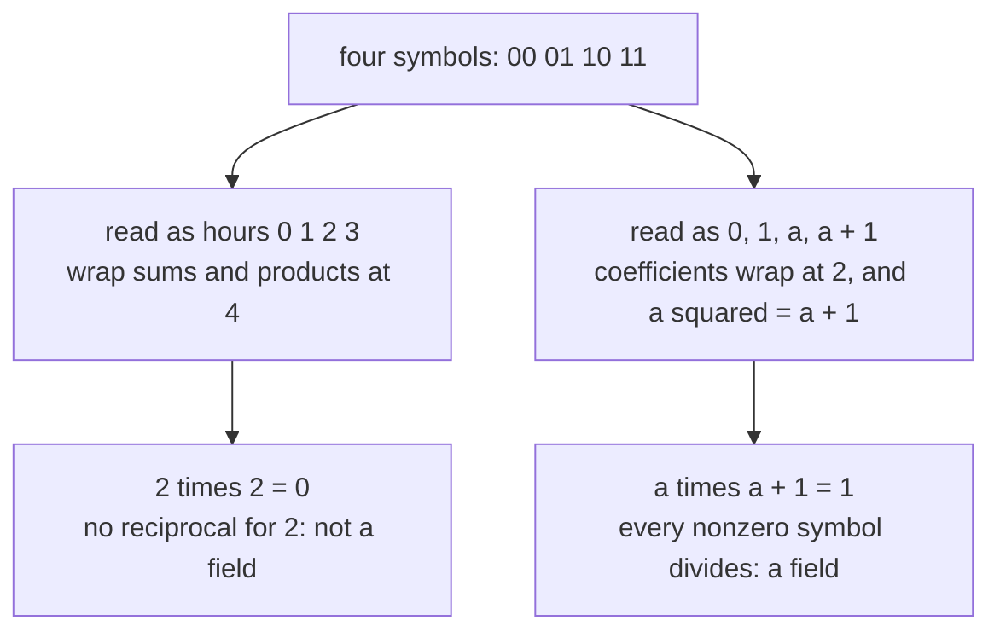
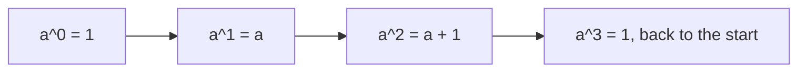

# Finite fields: a clock with a prime number of hours is a field, and a four-hour field exists if you build it from a polynomial

[Syllabus](../../../SYLLABUS.md) → [Algebra](../../../SYLLABUS.md#w03) → [Rings and Fields](../../../SYLLABUS.md#w03-s09) → Finite fields

---

## General Overview

A QR symbol repairs itself by solving equations in the alphabet it stores, so every nonzero element of that alphabet needs a reciprocal: a partner multiplying with it to give 1. Two bits give four symbols — 00, 01, 10, 11 — and as the hours of a four-hour clock they cannot divide: 2 times 2 wraps to 0, and neither factor of such a zero product has a reciprocal ([Rings](01-rings.md)).

Four is not prime, and a clock divides only at a prime number of hours ([Fields](02-fields.md)). Yet a field of exactly four elements exists: wrap polynomials rather than numbers, and out come 0, 1, a and a + 1, where a carries one rule, a squared is a + 1. That makes a times a + 1 equal 1, so a and a + 1 are reciprocals and every nonzero element divides.

**A finite field's size is always a prime raised to a positive whole power: at prime sizes it is the clock, and at every other size it is polynomials wrapped at one that does not factor.**

**What kind of fact this is:** a theorem, proved in Why it works, which also builds the four-element field. Existence at every prime power, sameness after renaming, and one element's powers giving the rest are stated here, proved in Finite fields.

### The picture: four symbols, two readings



Same four symbols on both branches; only the arithmetic differs.

---

## The formula

A field of a given size is written GF of that size, for Galois field, after Évariste Galois; GF(2) is the two-hour clock, 0 and 1 with 1 + 1 = 0. A polynomial over GF(2) has coefficients 0 and 1 only, its letter $x$ a placeholder, never a number ([Polynomials behave like integers](03-polynomials-behave-like-integers.md)), and is **irreducible** when it is not two smaller polynomials multiplied. Discarding every multiple of one chosen polynomial and keeping remainders is written as a division ([Ideals and quotient rings](04-ideals-and-quotient-rings.md)), and GF($p$)[$x$] means polynomials in $x$ over GF($p$):

$$\mathrm{GF}(p^k) = \mathrm{GF}(p)[x] \,/\, (f), \qquad f \text{ irreducible of degree } k$$

$$\mathrm{GF}(4) = \mathrm{GF}(2)[x] \,/\, (x^2 + x + 1), \qquad a = x, \qquad a^2 = a + 1$$

**Read it aloud:** polynomials with coefficients on a prime clock, the multiples of one that does not factor discarded, leave a field of the prime raised to that polynomial's degree.

| Symbol | Plain meaning | In our example | Change it and… |
| --- | --- | --- | --- |
| $p$ | a prime: how many values one coefficient has | 2 | a bigger coefficient clock |
| $k$ | coefficients per element, the degree of $f$ | 2 | more elements |
| $p^k$ | the element count, the only sizes possible | 4, called GF(4) | no prime power, no field |
| $x$ | the placeholder letter, never a number | $x^2 + x + 1$ | — |
| $f$ | what is wrapped by: irreducible, degree $k$ | $x^2 + x + 1$ | one that factors, and dividing breaks |
| $a$ | what $x$ becomes once $f$ is 0 | $a^2 = a + 1$ | another rule |

Multiplying two elements means multiplying out and then trading every $a^2$ for $a + 1$, with the coefficients wrapped at 2.

### When it holds

- **What is wrapped by must not factor.** Wrap at a composite number of hours, or by $x^2 + x$, and two nonzero elements multiply to 0.
- **Having no root proves irreducibility only up to degree three.** Degree four can miss every root and still be two quadratics.
- **One field per size means one after renaming.** Two fields of a size behave alike once matched up.

---

## Why it works

### Step 0: what you wrap by must have no factors

Both halves of this card are one move: divide by a fixed thing, keep the remainder. Division survives only when that thing has no factors, and Euclid's algorithm is the reason — run on two things sharing no factor it ends with one multiple of each adding to 1, and after the wrap the fixed thing's multiple is 0, leaving the other's multiplier as its reciprocal. Should the fixed thing factor, its factors survive as nonzero elements with product 0, and nothing in a zero product divides.

So a prime clock divides — the previous card's theorem ([Fields](02-fields.md)) — and that clock, GF($p$), is where the coefficients will live. The check confirms the seven-day week by both roads, 1, 4, 5, 2, 3, 6 each time, and at twelve hours 3 times 4 wraps to 0.

### Step 1: four symbols no clock can supply

The four-hour clock is finished before it starts: if 2 had a reciprocal r there, then 2 = 2 times 2 times r = 0 times r = 0.

Over GF(2) only two values can be tried in $x^2 + x + 1$: at $x = 0$ it is 1, at $x = 1$ it is 1 + 1 + 1, wrapping to 1. No root, so no factor of degree one — and at degree two that is the whole of it, since any factorisation is two degree-one pieces, each with a root. Irreducible.

Dividing by it leaves a remainder of degree at most one: 0, 1, $x$ or $x + 1$, four in all. The wrap sets $x^2 + x + 1$ to 0, so with $a$ for what $x$ becomes, and with adding and subtracting one operation here:

$$a^2 + a + 1 = 0, \qquad a^2 = a + 1, \qquad a(a+1) = a^2 + a = (a + 1) + a = 1.$$

Two lots of $a$ add to 0 and the 1 stands: a and a + 1 are each other's reciprocals, and a + 1 squared comes to a the same way.

None of that was special to this modulus. Any irreducible $f$ shares no factor with any nonzero remainder below its degree, so Step 0 gives each of those a reciprocal.

### Step 2: why the count is a prime power

Add 1 to itself over and over. A finite field runs out of new elements, so the total returns to one already seen, and the first return is to 0. That count is the **characteristic**. It cannot be composite: splitting it in two gives two nonzero elements multiplying to 0. So it is a prime, $p$, and the $p$ multiples of 1 are a copy of the $p$-hour clock inside the field. Take the fewest elements from which every element is built by multiplying with clock numbers and adding: call that many $k$. Every element is then one list of $k$ coefficients from that clock, different lists naming different elements, each coefficient chosen $p$ ways: the count is $p^k$.

<details>
<summary>Detailed proof: why the characteristic cannot be composite</summary>

Call the smallest positive number of 1's adding to 0 the count, and suppose it factors into two numbers, each above 1 and below it. The first many 1's add to one element, the second many to another, neither 0 by minimality — yet their product is the count's worth of 1's, which is 0. Multiplying by the first one's reciprocal forces the second to 0, a contradiction ([Prime factorisation](../../02-Number%20theory/01-Divisibility%20and%20Primes/07-prime-factorisation.md)).

</details>

### Step 3: three facts stated, proved elsewhere

One field exists for every prime power, and any two of a size are one field after a renaming, both proved in Finite fields. The third is the one hardware uses: the nonzero elements are the powers of a single one of them, a primitive root, now in a field instead of a clock ([The order of a number and primitive roots](../../02-Number%20theory/04-Powers%20on%20the%20Clock/05-order-and-primitive-roots.md)).



In GF(4) it is a: one loop over the three nonzero elements, which is how hardware multiplies by look-up. The other road skips the wrap: wherever $x^4 + x$ has all four of its roots, those roots are GF(4) already.

---

## Worked numbers, by hand

Coefficients wrap at 2, so 1 + 1 = 0.

| Step | Arithmetic | Value |
| --- | --- | --- |
| $x^2 + x + 1$ at $x = 0$, then $x = 1$ | 1; 1 + 1 + 1 wrapped | 1; 1: no root |
| a times a + 1, multiplied out and wrapped | $a^2 + a$, then $(a + 1) + a$ | **1** |
| a + 1, squared | $a^2 + a + a + 1$, wrapped | **a** |
| the powers of a | $a^0$ to $a^3$ | **1, a, a + 1, 1** |

So 1 pairs with 1, and a with a + 1. Adding is coefficient by coefficient, making every element its own negative; the code prints that table too. Here each cell combines row with column:

| × | 0 | 1 | a | a + 1 |
| --- | --- | --- | --- | --- |
| **0** | 0 | 0 | 0 | 0 |
| **1** | 0 | 1 | a | a + 1 |
| **a** | 0 | a | a + 1 | 1 |
| **a + 1** | 0 | a + 1 | 1 | a |

Every nonzero row holds a 1, which is division working.

### What breaks if you drop a piece

| Mistake | Comes out at | What went wrong |
| --- | --- | --- |
| GF(4) read as the four-hour clock | 2 times 2 = 0, 1 + 1 = 2 | Four is not prime; the field has 1 + 1 = 0 |
| Wrapping by $x^2 + 1$ | a + 1 squared = 0 | That is $x + 1$ twice over GF(2): reducible |

The code prints both.

---

## Code, from first principles, and it actually runs

Nothing is imported. Two roads reach all sixteen products, sharing no arithmetic and compared on every pair: one shifts and XORs the packed polynomials, folding the top power away with $x^2 + x + 1$; the other multiplies coefficients by a rule taken from $a^2 = a + 1$. The clock side is done twice too, by search and by Euclid.

### Python

```python
# Finite fields -- the check behind the card.  Nothing is imported.  Four symbols,
# each two coefficients wrapped at 2: 0, 1, a, a + 1, where a is the letter x once
# x^2 + x + 1 is set to 0, so a^2 = a + 1.  A symbol packs into an integer: bit 0 the
# plain coefficient, bit 1 the coefficient of a, so a + 1 is 3.  Road one multiplies by
# shifting and XOR, then folds the top power away with the modulus; road two uses the
# coordinate rule worked out by hand from a^2 = a + 1.  The roads share no arithmetic.
NAMES, E = ["0", "1", "a", "a+1"], range(4)
def times(u, v, modulus=0b111):          # road one: shift, XOR, fold at x^2 + x + 1
    raw = (u if v & 1 else 0) ^ (u << 1 if v & 2 else 0)
    while raw.bit_length() > 2:          # a^2 and above folds back down
        raw ^= modulus << (raw.bit_length() - 3)
    return raw
def coord_times(u, v):                   # road two: (c + da)(e + ha), coefficient by coefficient
    c, d, e, h = u & 1, u >> 1, v & 1, v >> 1
    return (c * e + d * h) % 2 | ((c * h + d * e + d * h) % 2) << 1
def clock_recip(n):                      # reciprocals on an n-hour clock by search, 0 for none
    return [next((b for b in range(1, n) if a * b % n == 1), 0) for a in range(1, n)]
def bezout_recip(a, n):                  # the other road on a clock: Euclid's gcd, run backwards
    old, new, s_old, s_new = a, n, 1, 0
    while new:
        q = old // new
        old, new, s_old, s_new = new, old - q * new, s_new, s_old - q * s_new
    return s_old % n if old == 1 else 0
def row(values): return " ".join(str(v) for v in values)
def named(values): return " ".join(NAMES[v] for v in values)

print("column order: 0 1 a a+1")
for u in E:
    print(f"add {NAMES[u]:<5} : {named([u ^ v for v in E])}")
for u in E:
    print(f"times {NAMES[u]:<3} : {named([times(u, v) for v in E])}")
roots = [(x * x + x + 1) % 2 for x in (0, 1)]
print(f"x^2 + x + 1 at x = 0 and at x = 1, wrapped at 2: {roots[0]} and {roots[1]}, never 0")
agree = sum(times(u, v) == coord_times(u, v) for u in E for v in E)
spread = sum(times(u, v ^ w) == times(u, v) ^ times(u, w) for u in E for v in E for w in E)
print(f"two roads: {agree} of 16 products agree, and {spread} of 64 triples distribute")
recip = [next(b for b in range(1, 4) if times(a, b) == 1) for a in range(1, 4)]
print(f"reciprocals of 1, a, a + 1: {named(recip)}, since a times a + 1 = "
      f"{NAMES[times(2, 3)]} and a + 1 squared = {NAMES[times(3, 3)]}")
powers = [1]
for _ in range(3): powers.append(times(powers[-1], 2))
print(f"powers a^0 a^1 a^2 a^3: {named(powers)}")
week, twelve = clock_recip(7), clock_recip(12)
print(f"the seven-day week: 3 times 5 = {3 * 5}, wrapping at 7 to {3 * 5 % 7}")
print(f"week reciprocals of 1 2 3 4 5 6: {row(week)} by search, "
      f"{row([bezout_recip(a, 7) for a in range(1, 7)])} by Euclid")
have = [a for a in range(1, 12) if twelve[a - 1]]
print(f"the twelve-hour clock: 3 times 4 = {3 * 4}, wrapping to {3 * 4 % 12}; "
      f"of 1 to 11 only {row(have)} have a reciprocal")
print(f"the four-hour clock: 2 times 2 = {2 * 2}, wrapping to {2 * 2 % 4}, and "
      f"1 + 1 = {(1 + 1) % 4} where the field has 1 + 1 = {1 ^ 1}")
print(f"wrapping by x^2 + 1 instead: a + 1 squared = {times(3, 3, 0b101)}; "
      f"by x^2 + x: a times a + 1 = {times(2, 3, 0b110)}")
assert agree == 16 and spread == 64
assert recip == [1, 3, 2] and powers == [1, 2, 3, 1]
assert week == [bezout_recip(a, 7) for a in range(1, 7)] == [1, 4, 5, 2, 3, 6]
assert have == [1, 5, 7, 11] and times(3, 3, 0b101) == 0 and times(2, 3, 0b110) == 0
print("ALL CHECKS PASS")
```

**Ran 2026-09-14 on macOS, Python 3.14.6, standard library only. All checks passed. Output, pasted from the run:**

```
column order: 0 1 a a+1
add 0     : 0 1 a a+1
add 1     : 1 0 a+1 a
add a     : a a+1 0 1
add a+1   : a+1 a 1 0
times 0   : 0 0 0 0
times 1   : 0 1 a a+1
times a   : 0 a a+1 1
times a+1 : 0 a+1 1 a
x^2 + x + 1 at x = 0 and at x = 1, wrapped at 2: 1 and 1, never 0
two roads: 16 of 16 products agree, and 64 of 64 triples distribute
reciprocals of 1, a, a + 1: 1 a+1 a, since a times a + 1 = 1 and a + 1 squared = a
powers a^0 a^1 a^2 a^3: 1 a a+1 1
the seven-day week: 3 times 5 = 15, wrapping at 7 to 1
week reciprocals of 1 2 3 4 5 6: 1 4 5 2 3 6 by search, 1 4 5 2 3 6 by Euclid
the twelve-hour clock: 3 times 4 = 12, wrapping to 0; of 1 to 11 only 1 5 7 11 have a reciprocal
the four-hour clock: 2 times 2 = 4, wrapping to 0, and 1 + 1 = 2 where the field has 1 + 1 = 0
wrapping by x^2 + 1 instead: a + 1 squared = 0; by x^2 + x: a times a + 1 = 0
ALL CHECKS PASS
```

### Rust

Same numbers, same labels, built with `rustc --edition 2021 -O`.

```rust
// Finite fields -- the same check as the Python, in Rust.  No crates.  Four symbols,
// each two coefficients wrapped at 2: 0, 1, a, a + 1, where a is the letter x once
// x^2 + x + 1 is set to 0, so a^2 = a + 1.  A symbol packs into an integer: bit 0 the
// plain coefficient, bit 1 the coefficient of a, so a + 1 is 3.  Road one multiplies by
// shifting and XOR, then folds the top power away with the modulus; road two uses the
// coordinate rule worked out by hand from a^2 = a + 1.  The roads share no arithmetic.
const NAMES: [&str; 4] = ["0", "1", "a", "a+1"];
fn times_mod(u: u32, v: u32, modulus: u32) -> u32 {   // road one: shift, XOR, fold
    let mut raw = (if v & 1 != 0 { u } else { 0 }) ^ (if v & 2 != 0 { u << 1 } else { 0 });
    while raw > 3 {                                   // a^2 and above folds back down
        raw ^= modulus << (31 - raw.leading_zeros() - 2);
    }
    raw
}
fn times(u: u32, v: u32) -> u32 { times_mod(u, v, 0b111) }
fn coord_times(u: u32, v: u32) -> u32 {   // road two: (c + da)(e + ha), coefficient by coefficient
    let (c, d, e, h) = (u & 1, u >> 1, v & 1, v >> 1);
    (c * e + d * h) % 2 | ((c * h + d * e + d * h) % 2) << 1
}
fn clock_recip(n: i64) -> Vec<i64> {      // reciprocals on an n-hour clock by search, 0 for none
    (1..n).map(|a| (1..n).find(|b| a * b % n == 1).unwrap_or(0)).collect()
}
fn bezout_recip(a: i64, n: i64) -> i64 {  // the other road on a clock: Euclid's gcd, run backwards
    let (mut old, mut new, mut s_old, mut s_new) = (a, n, 1, 0);
    while new != 0 {
        let q = old / new;
        (old, new, s_old, s_new) = (new, old - q * new, s_new, s_old - q * s_new);
    }
    if old == 1 { s_old.rem_euclid(n) } else { 0 }
}
fn row(vs: &[i64]) -> String { vs.iter().map(|v| v.to_string()).collect::<Vec<_>>().join(" ") }
fn named(vs: &[u32]) -> String { vs.iter().map(|&v| NAMES[v as usize]).collect::<Vec<_>>().join(" ") }
fn main() {
    println!("column order: 0 1 a a+1");
    for u in 0..4u32 {
        let sums: Vec<u32> = (0..4).map(|v| u ^ v).collect();
        println!("add {:<5} : {}", NAMES[u as usize], named(&sums));
    }
    for u in 0..4u32 {
        let prods: Vec<u32> = (0..4).map(|v| times(u, v)).collect();
        println!("times {:<3} : {}", NAMES[u as usize], named(&prods));
    }
    let roots: Vec<u32> = (0..2u32).map(|x| (x * x + x + 1) % 2).collect();
    println!("x^2 + x + 1 at x = 0 and at x = 1, wrapped at 2: {} and {}, never 0",
             roots[0], roots[1]);
    let (mut agree, mut spread) = (0, 0);
    for u in 0..4 { for v in 0..4 {
        if times(u, v) == coord_times(u, v) { agree += 1; }
        for w in 0..4 { if times(u, v ^ w) == times(u, v) ^ times(u, w) { spread += 1; } }
    } }
    println!("two roads: {} of 16 products agree, and {} of 64 triples distribute", agree, spread);
    let recip: Vec<u32> = (1..4).map(|a| (1..4).find(|&b| times(a, b) == 1).unwrap()).collect();
    println!("reciprocals of 1, a, a + 1: {}, since a times a + 1 = {} and a + 1 squared = {}",
             named(&recip), NAMES[times(2, 3) as usize], NAMES[times(3, 3) as usize]);
    let mut powers = vec![1u32];
    for _ in 0..3 { powers.push(times(powers[powers.len() - 1], 2)); }
    println!("powers a^0 a^1 a^2 a^3: {}", named(&powers));
    let (week, twelve) = (clock_recip(7), clock_recip(12));
    println!("the seven-day week: 3 times 5 = {}, wrapping at 7 to {}", 3 * 5, 3 * 5 % 7);
    let by_euclid: Vec<i64> = (1..7).map(|a| bezout_recip(a, 7)).collect();
    println!("week reciprocals of 1 2 3 4 5 6: {} by search, {} by Euclid",
             row(&week), row(&by_euclid));
    let have: Vec<i64> = (1..12).filter(|&a| twelve[(a - 1) as usize] != 0).collect();
    println!("the twelve-hour clock: 3 times 4 = {}, wrapping to {}; \
              of 1 to 11 only {} have a reciprocal", 3 * 4, 3 * 4 % 12, row(&have));
    println!("the four-hour clock: 2 times 2 = {}, wrapping to {}, and \
              1 + 1 = {} where the field has 1 + 1 = {}", 2 * 2, 2 * 2 % 4, (1 + 1) % 4, 1 ^ 1);
    println!("wrapping by x^2 + 1 instead: a + 1 squared = {}; by x^2 + x: a times a + 1 = {}",
             times_mod(3, 3, 0b101), times_mod(2, 3, 0b110));
    assert!(agree == 16 && spread == 64);
    assert!(recip == vec![1, 3, 2] && powers == vec![1, 2, 3, 1]);
    assert!(week == by_euclid && week == vec![1, 4, 5, 2, 3, 6]);
    assert!(have == vec![1, 5, 7, 11] && times_mod(3, 3, 0b101) == 0
        && times_mod(2, 3, 0b110) == 0);
    println!("ALL CHECKS PASS");
}
```

**Ran 2026-09-14 on macOS, rustc 1.98.1, no crates. All checks passed. Output, pasted from the run:**

```
column order: 0 1 a a+1
add 0     : 0 1 a a+1
add 1     : 1 0 a+1 a
add a     : a a+1 0 1
add a+1   : a+1 a 1 0
times 0   : 0 0 0 0
times 1   : 0 1 a a+1
times a   : 0 a a+1 1
times a+1 : 0 a+1 1 a
x^2 + x + 1 at x = 0 and at x = 1, wrapped at 2: 1 and 1, never 0
two roads: 16 of 16 products agree, and 64 of 64 triples distribute
reciprocals of 1, a, a + 1: 1 a+1 a, since a times a + 1 = 1 and a + 1 squared = a
powers a^0 a^1 a^2 a^3: 1 a a+1 1
the seven-day week: 3 times 5 = 15, wrapping at 7 to 1
week reciprocals of 1 2 3 4 5 6: 1 4 5 2 3 6 by search, 1 4 5 2 3 6 by Euclid
the twelve-hour clock: 3 times 4 = 12, wrapping to 0; of 1 to 11 only 1 5 7 11 have a reciprocal
the four-hour clock: 2 times 2 = 4, wrapping to 0, and 1 + 1 = 2 where the field has 1 + 1 = 0
wrapping by x^2 + 1 instead: a + 1 squared = 0; by x^2 + x: a times a + 1 = 0
ALL CHECKS PASS
```

The two outputs match line for line.

> [!TIP]
> **Try changing**
> Guess first, then run it. Each change stops the script.
> - **Wrap by something that factors.** Set the default `modulus` to `0b101`, which is $x^2 + 1$. The hunt for a reciprocal of a + 1 then finds nothing.
> - **Drop the 1 that $a^2$ carries.** In `coord_times`, change `(c * e + d * h) % 2` to `(c * e) % 2`. The line reads 12 of 16 products agree, and the first assert stops it.
> - **Leave Euclid's answer unwrapped.** Drop the `% n` ending `bezout_recip`: that road prints 1 -3 -2 2 3 -1 against search's 1 4 5 2 3 6, and the third assert stops it.

---

## The usual mistake

> [!warning]
> **Taking GF(4) to be the whole numbers wrapped at 4.** The size is right, the arithmetic wrong. In GF(4) every element added to itself gives 0, so 1 + 1 = 0, and no two nonzero elements multiply to 0; the clock has 1 + 1 = 2 and 2 times 2 = 0. No relabelling turns one into the other.
>
> - **Expecting a field of every size.** Prime powers only: none with 6 elements, none with 10.
> - **Reading $a$ as a number.** It is $x$ after the wrap, obeying one rule: a squared is a + 1.

---

## Where you meet it in real life

- **QR symbols and CDs.** Reed–Solomon repair reads a block as a polynomial over a finite field and solves for the lost pieces — exact division, no rounding (Hamming and Reed-Solomon).
- **AES, in every secure web session.** A byte is an element of the 256-element field: eight coefficients wrapping at 2, folded by a degree-eight polynomial, this build at $k$ = 8 (AES).

> **Say it back**
> A finite field has finitely many elements and lets you divide by anything nonzero. At a prime size it is the clock with that many hours; every other size is polynomials over a prime clock, the multiples of one that does not factor discarded. GF(2) and $x^2 + x + 1$ give 0, 1, a and a + 1, with a squared = a + 1, so a times a + 1 = 1. No four-hour clock copies that, and sizes are prime powers only.

---

## What this builds on

- [Fields](02-fields.md): the rule asked for, met by a clock at prime sizes.
- [Ideals and quotient rings](04-ideals-and-quotient-rings.md): the wrap, here on polynomials.
- [The order of a number and primitive roots](../../02-Number%20theory/04-Powers%20on%20the%20Clock/05-order-and-primitive-roots.md): one element's powers giving all.
- [Prime factorisation](../../02-Number%20theory/01-Divisibility%20and%20Primes/07-prime-factorisation.md): what a prime power is.

## Where this goes next

- Hamming and Reed-Solomon: the codes behind it.
- AES: the field inside a cipher.
- Elliptic curves: curves over a finite field.
- Quadratic reciprocity: squares on a prime clock.
- Finite fields: existence, uniqueness, symmetry.
- The curve mod p: counting points field by field.

Degree two over GF(2) was easy by hand; whether an irreducible polynomial of every degree exists is the next question.

---

## Sources

Verified 14 Sep 2026: every link below resolves to the publisher's page.

- Judson, Thomas W. *Abstract Algebra*, chapters 17 and 22. [Publication page](https://scholarworks.sfasu.edu/ebooks/23/). The construction, and the four-element field.
- Milne, J. S. *Fields and Galois Theory*, chapter 4. [Author's page](https://www.jmilne.org/math/CourseNotes/ft.html). Existence, uniqueness, cyclic powers.
- NIST. *FIPS 197: Advanced Encryption Standard*, section 4. [Standard page](https://csrc.nist.gov/pubs/fips/197/final). A byte in the 256-element field.
- DENSO WAVE. "Error correction feature." [Product page](https://www.qrcode.com/en/about/error_correction.html). Reed–Solomon in QR symbols.
