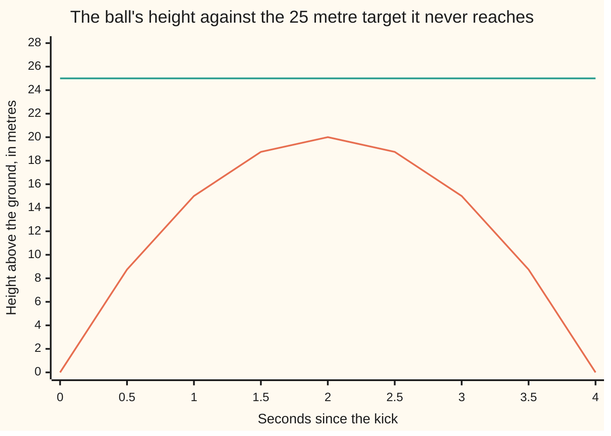

# The fundamental theorem of algebra: allow one new number whose square is -1 and every degree-n polynomial has exactly n roots

Algebra → For the Curious → Roots off the real line → The fundamental theorem of algebra

---

## General Overview

A football is kicked straight up at 20 metres a second. Its height t seconds later is 20t - 5t^2 metres, peaking at 20.00 metres two seconds in.

Ask when it is 25 metres up. Set the height to 25: 5t^2 - 20t + 25 = 0. The quadratic formula starts with the discriminant, the number under the square root sign ([quadratic-formula](../02-Polynomials/03-quadratic-formula.md)): (-20)^2 - 4 × 5 × 25, or -100. Nothing ordinary squares to a negative, so the formula stops, rightly: the ball never gets there.

Now allow one new number, written i, with one rule: i multiplied by itself is -1. The square root of -100 becomes 10i, the formula finishes, and two answers appear: 2 + i and 2 - i. No clock shows those readings: the algebra is completing a factorisation, not naming a moment. Multiply (t - 2 - i)(t - 2 + i) and every i cancels, leaving t^2 - 4t + 5.

The reach is the surprise. The factor theorem gave a ceiling: degree n allows at most n roots, one bracket each ([roots-and-the-factor-theorem](../02-Polynomials/05-roots-and-the-factor-theorem.md)). Admit i and the ceiling becomes the count.

**Allow one number whose square is -1 and no polynomial of degree 1 or more lacks roots again: degree n gives exactly n roots, counted with repeats, and n brackets, one per root.**

**What kind of fact this is:** a theorem. The step from one root to the full factorisation is proved below; the existence of that first root is stated here and proved on [liouville-and-the-fundamental-theorem-of-algebra](../../07-Complex%20analysis/03-Contour%20Integrals%20and%20Cauchy%27s%20Theorem/07-liouville-and-the-fundamental-theorem-of-algebra.md).

### The picture: the arc and the 25 metre line



The arc is the height 20t - 5t^2; the flat line is the 25 metre target.

---

## The formula

A **complex number** is an ordinary number — a **real number** — plus some multiple of i, written a + bi, where a and b are real and i obeys one rule:

$$i \times i = -1$$

They add and multiply by the ordinary bracket rules, with i × i replaced by -1. A real number is the case b = 0.

Now the theorem, for a polynomial of degree $n$ — the highest power of its unknown — with any complex coefficients:

$$P(x) = a_n x^n + \ldots + a_1 x + a_0, \qquad a_n \ne 0, \qquad n \ge 1$$

Then there are complex numbers $r_1$, $r_2$ up to $r_n$, repeats allowed, with

$$P(x) = a_n (x - r_1)(x - r_2) \ldots (x - r_n)$$

**Read it aloud:** P(x), the polynomial's value at x, is its **leading coefficient** $a_n$ times one bracket per root, the dots standing for one bracket at a time.

| Symbol | Plain meaning | In our example | Push it up and the answer… |
| --- | --- | --- | --- |
| $i$ | the new number: i × i = -1 | 10i is a square root of -100 | fixed by definition |
| $n$ | the degree: highest power present | 2, the ball | one more root, one more bracket |
| $a_n$ | the number on the highest power, never 0 | 5 | values scale, roots hold |
| $r_1$, $r_2$ to $r_n$ | the n roots, repeats included | 2 + i, 2 - i | — |

### When it holds

- **Degree at least 1.** A constant such as 7 is never 0, so it has no root.
- **Complex roots allowed.** On the real line 5t^2 - 20t + 25 has none; the check scans 41 candidate times, lowest value 5.00.
- **Repeats counted.** x^2 - 2x + 1 is (x - 1)(x - 1): two brackets, one distinct root, of **multiplicity** 2.
- **No recipe.** Existence is all that is promised, and past degree 4 no formula built from the coefficients with arithmetic and roots exists: [why-no-quintic-formula](02-why-no-quintic-formula.md).

---

## Why it works

### Step 0: one root is granted

The hard content is one sentence: **every polynomial of degree at least 1 with complex coefficients has at least one complex root.** It is not proved here; no known proof of it stays inside algebra.

The shape of one argument, with a + bi drawn as the point (a, b) on a plane: on a large circle of inputs the outputs trace a loop that wraps around zero n times, since the highest power dominates; shrink the circle and the loop shrinks to the constant term, wrapping none. Going from n wraps to none means crossing zero, so some input is a root.

That count is made exact on homology-of-spheres-and-degree; the shorter route is [liouville-and-the-fundamental-theorem-of-algebra](../../07-Complex%20analysis/03-Contour%20Integrals%20and%20Cauchy%27s%20Theorem/07-liouville-and-the-fundamental-theorem-of-algebra.md). Granted, the rest is bookkeeping.

### Step 1: one root buys one bracket

If r is a root, x - r divides the polynomial exactly and leaves a degree one lower ([roots-and-the-factor-theorem](../02-Polynomials/05-roots-and-the-factor-theorem.md)). Pure algebra: division runs the same whether the coefficients carry an i or not.

### Step 2: peel until nothing is left

Degree n, one root, one bracket, degree n - 1 left. If that is still 1 or more, Step 0 applies again and another bracket comes off. Each pass drops the degree by one, so after n passes the leftover is a single number, and it must be $a_n$, since n brackets give x^n and nothing larger.

<details>
<summary>Detailed proof</summary>

Induction on the degree, one root granted.

**Base, n = 1.** a_1 x + a_0 is a_1(x - r) for r = -a_0/a_1. Dividing by a_1 is legal: every non-zero complex number has a reciprocal, 1/(a + bi) = (a - bi)/(a^2 + b^2).

**Step.** Let P have degree n ≥ 2 and leading coefficient a_n, and assume the claim at degree n - 1. Step 0 gives a root r_1 and the factor theorem gives P(x) = (x - r_1)Q(x), where Q has degree n - 1 and leading coefficient a_n. By assumption Q(x) = a_n(x - r_2) … (x - r_n), so P has the n brackets claimed.

**No others.** If P(s) = 0 then some bracket of a_n(s - r_1) … (s - r_n) is 0, a product being 0 only when a factor is; so s is listed already.

</details>

### Step 3: why "exactly n" and not "at most n"

The factor theorem gives at most n: every root is on the list. Step 0 gives at least n: the list is as long as the degree. And roots that look real were complex all along: the cubic x^3 - 6x^2 + 11x - 6 has 1, 2 and 3, three numbers whose b is 0, in three brackets ([roots-and-the-factor-theorem](../02-Polynomials/05-roots-and-the-factor-theorem.md)).

### Step 4: the ball, all the way through

Divide 5t^2 - 20t + 25 = 0 by 5 and complete the square, as the quadratic formula does:

$$t^2 - 4t + 5 = (t - 2)^2 + 1$$

So (t - 2)^2 = -1. Anything whose square is -1 is i or -i, so t = 2 + i or 2 - i. Multiply back:

$$(t - 2 - i)(t - 2 + i) = (t - 2)^2 - i \times i = (t - 2)^2 + 1$$

The two i terms cancel and -i × i becomes +1. Restore the 5: 5(t - 2 - i)(t - 2 + i).

The same square settles the physical question with no i at all: the height is 20 - 5(t - 2)^2, and a real square is never negative, so the height never passes 20 metres — 5.00 metres short of the target.

The roots share their real part and carry opposite i parts: a **conjugate pair**. Real coefficients force that pairing, and it is why the brackets multiplied back with no i in sight.

---

## Worked numbers, by hand

The football, at the 25 metre target.

| Step | Arithmetic | Value |
| --- | --- | --- |
| the equation | 20t - 5t^2 = 25, so 5t^2 - 20t + 25 = 0 | — |
| the discriminant | (-20)^2 - 4 × 5 × 25 | **-100** |
| its square root, since i × i = -1 | 10i × 10i = -100 | **10i** |
| the quadratic formula | (20 ± 10i) ÷ 10 | **2 + i and 2 - i** |
| the brackets multiplied back, times 5 | 5 × (t - 2 - i)(t - 2 + i) | **5t^2 - 20t + 25** |
| the real peak instead | 20 - 5 × (2 - 2)^2 | **20.00 m** |

The ball tops out 5.00 metres below the target; the equation answers the question anyway.

### What breaks if you drop a piece

| Mistake | Comes out at | What went wrong |
| --- | --- | --- |
| Only real roots allowed | 0 roots for a degree-2 polynomial | Exact counting needs the complex numbers |
| The square root of -100 read as -10 | t = 1 and 3, where the polynomial is 10, not 0 | -10 squared is +100; those are the 15 metre times |
| The leading 5 dropped | constant term 5, not 25 | Roots fix the brackets, the leading coefficient the scale |

The code prints all three.

---

## Code, from first principles, and it actually runs

Nothing is imported and no built-in complex number is used: a + bi is the integer pair (a, b), and i × i = -1 is written into the multiplication by hand. Every root then gets two independent roads. Road one puts it into the polynomial and demands the pair (0, 0). Road two ignores the polynomial: it multiplies the brackets (x - root) together and compares the coefficients it builds against those given. A separate walk along the flight, in whole hundredths of a metre, reports the peak and finds 5t^2 - 20t + 25 never at 0 on that grid.

### Python

```python
# The fundamental theorem of algebra -- the check behind the card.  Nothing is
# imported.  A complex number a + bi is the integer pair (a, b), and i times i =
# -1 is the only new rule.  Two independent roads to every root: road one puts it
# into the polynomial, road two multiplies the brackets (x - root) back out.
I = (0, 1)
def add(p, q): return (p[0] + q[0], p[1] + q[1])
def mul(p, q): return (p[0] * q[0] - p[1] * q[1], p[0] * q[1] + p[1] * q[0])
def metres(h): return f"{h // 100}.{h % 100:02d}"      # hundredths of a metre
def value_at(coeffs, z):                   # road one: the polynomial at z
    out, power = (0, 0), (1, 0)            # coefficients, constant term first
    for c in coeffs:
        out, power = add(out, mul((c, 0), power)), mul(power, z)
    return out
def from_roots(lead, roots):               # road two: lead*(x - r1)(x - r2)...
    coeffs = [(lead, 0)]
    for r in roots:
        nxt = [(0, 0)] * (len(coeffs) + 1)
        for j, c in enumerate(coeffs):
            nxt[j] = add(nxt[j], mul(c, (-r[0], -r[1])))
            nxt[j + 1] = add(nxt[j + 1], c)
        coeffs = nxt
    return coeffs
def show(z):                               # the pair (a, b) written as a + bi
    a, b = z
    if b == 0: return str(a)
    tail = "i" if abs(b) == 1 else f"{abs(b)}i"
    return f"{a} + {tail}" if b > 0 else f"{a} - {tail}"
# the football: height 20t - 5t^2 metres at t = k/10 seconds, and the polynomial
# 5t^2 - 20t + 25 on the same grid, both in hundredths, so nothing is rounded
heights = [200 * k - 5 * k * k for k in range(41)]
floors = [5 * (k * k - 40 * k + 500) for k in range(41)]
max_h, min_p, real_hits = max(heights), min(floors), sum(1 for v in floors if v == 0)
EXAMPLES = [(5, [25, -20, 5], [(2, 1), (2, -1)], "5t^2 - 20t + 25"),
            (1, [-6, 11, -6, 1], [(1, 0), (2, 0), (3, 0)], "x^3 - 6x^2 + 11x - 6"),
            (1, [1, -2, 1], [(1, 0), (1, 0)], "x^2 - 2x + 1")]
r1, r2 = EXAMPLES[0][2]                    # the ball's two roots, 2 + i and 2 - i
gap = add(r1, (-r2[0], -r2[1]))            # r1 - r2, which is 2i
disc, alt = (-20) ** 2 - 4 * 5 * 25, 25 * mul(gap, gap)[0]   # two roads to it
print(f"i times i, as the pair (real part, i part): {mul(I, I)}")
print("height 20t - 5t^2 in metres, t = 0 to 4 seconds in half-seconds:")
print("  " + "".join(f"{metres(heights[k]):>7}" for k in range(0, 41, 5)))
print(f"the highest height on a tenth-second grid is {metres(max_h)} m, leaving the 25 m target {metres(2500 - max_h)} m out of reach")
print(f"5t^2 - 20t + 25 over {len(floors)} grid times: lowest value {metres(min_p)}, real roots found {real_hits}")
print(f"its discriminant: {disc} from b^2 - 4ac, {alt} from 25 x (root gap)^2; 10 x 10 = {10 * 10}, so the square root of {disc} is 10i")
for lead, coeffs, roots, label in EXAMPLES:
    road_one = ", ".join(str(value_at(coeffs, r)) for r in roots)
    road_two = ", ".join(str(c[0]) for c in from_roots(lead, roots))
    print(f"{label} = 0, degree {len(coeffs) - 1}, roots " + ", ".join(show(r) for r in roots))
    print(f"  road one, the polynomial at each root: {road_one}")
    print(f"  road two, brackets multiplied back, constant first: {road_two}")
    assert (all(value_at(coeffs, r) == (0, 0) for r in roots)
            and from_roots(lead, roots) == [(c, 0) for c in coeffs])
bad = value_at(EXAMPLES[0][1], (1, 0))[0]   # t = 1, from misreading the root
wrong = (from_roots(1, [r1, r2])[0][0], bad, 25 - bad)
print(f"mistakes: leading 5 dropped leaves constant {wrong[0]} not 25; times 1 "
      f"and 3 give {wrong[1]} not 0, a height of {wrong[2]} m not 25 m")
assert mul(I, I) == (-1, 0)
assert max_h == 2000 and max_h + min_p == 2500 and disc == alt
assert real_hits == 0 and wrong == (5, 10, 15)
print("ALL CHECKS PASS")
```

**Ran 2026-09-14 on macOS, Python 3.14.6, standard library only. All checks passed. Output, pasted from the run:**

```
i times i, as the pair (real part, i part): (-1, 0)
height 20t - 5t^2 in metres, t = 0 to 4 seconds in half-seconds:
     0.00   8.75  15.00  18.75  20.00  18.75  15.00   8.75   0.00
the highest height on a tenth-second grid is 20.00 m, leaving the 25 m target 5.00 m out of reach
5t^2 - 20t + 25 over 41 grid times: lowest value 5.00, real roots found 0
its discriminant: -100 from b^2 - 4ac, -100 from 25 x (root gap)^2; 10 x 10 = 100, so the square root of -100 is 10i
5t^2 - 20t + 25 = 0, degree 2, roots 2 + i, 2 - i
  road one, the polynomial at each root: (0, 0), (0, 0)
  road two, brackets multiplied back, constant first: 25, -20, 5
x^3 - 6x^2 + 11x - 6 = 0, degree 3, roots 1, 2, 3
  road one, the polynomial at each root: (0, 0), (0, 0), (0, 0)
  road two, brackets multiplied back, constant first: -6, 11, -6, 1
x^2 - 2x + 1 = 0, degree 2, roots 1, 1
  road one, the polynomial at each root: (0, 0), (0, 0)
  road two, brackets multiplied back, constant first: 1, -2, 1
mistakes: leading 5 dropped leaves constant 5 not 25; times 1 and 3 give 10 not 0, a height of 15 m not 25 m
ALL CHECKS PASS
```

### Rust

Same numbers, same labels, built with `rustc --edition 2021 -O`.

```rust
// The fundamental theorem of algebra -- the same check as the Python, in Rust.
// No crates.  A complex number a + bi is the integer pair (a, b), and i times i
// = -1 is the only new rule.  Two independent roads to every root: road one puts
// it into the polynomial, road two multiplies the brackets (x - root) back out.
type C = (i64, i64);
const I: C = (0, 1);
fn add(p: C, q: C) -> C { (p.0 + q.0, p.1 + q.1) }
fn mul(p: C, q: C) -> C { (p.0 * q.0 - p.1 * q.1, p.0 * q.1 + p.1 * q.0) }
fn metres(h: i64) -> String { format!("{}.{:02}", h / 100, h % 100) }  // hundredths of a metre
fn pair(z: C) -> String { format!("({}, {})", z.0, z.1) }
fn value_at(coeffs: &[i64], z: C) -> C {   // road one: the polynomial at z
    let (mut out, mut power) = ((0, 0), (1, 0));   // coefficients, constant first
    for &c in coeffs {
        out = add(out, mul((c, 0), power));
        power = mul(power, z);
    }
    out
}
fn from_roots(lead: i64, roots: &[C]) -> Vec<C> {  // road two: lead*(x - r1)...
    let mut coeffs = vec![(lead, 0)];
    for &r in roots {
        let mut nxt = vec![(0, 0); coeffs.len() + 1];
        for (j, &c) in coeffs.iter().enumerate() {
            nxt[j] = add(nxt[j], mul(c, (-r.0, -r.1)));
            nxt[j + 1] = add(nxt[j + 1], c);
        }
        coeffs = nxt;
    }
    coeffs
}
fn show(z: C) -> String {                  // the pair (a, b) written as a + bi
    let (a, b) = z;
    if b == 0 { return a.to_string(); }
    let tail = if b.abs() == 1 { "i".to_string() } else { format!("{}i", b.abs()) };
    if b > 0 { format!("{} + {}", a, tail) } else { format!("{} - {}", a, tail) }
}
fn main() {
    // the football: height 20t - 5t^2 and 5t^2 - 20t + 25 at t = k/10 s, in hundredths
    let heights: Vec<i64> = (0..41).map(|k| 200 * k - 5 * k * k).collect();
    let floors: Vec<i64> = (0..41).map(|k| 5 * (k * k - 40 * k + 500)).collect();
    let (max_h, min_p) = (*heights.iter().max().unwrap(), *floors.iter().min().unwrap());
    let real_hits = floors.iter().filter(|&&v| v == 0).count();
    let examples: Vec<(i64, Vec<i64>, Vec<C>, &str)> = vec![
        (5, vec![25, -20, 5], vec![(2, 1), (2, -1)], "5t^2 - 20t + 25"),
        (1, vec![-6, 11, -6, 1], vec![(1, 0), (2, 0), (3, 0)], "x^3 - 6x^2 + 11x - 6"),
        (1, vec![1, -2, 1], vec![(1, 0), (1, 0)], "x^2 - 2x + 1")];
    let (r1, r2) = (examples[0].2[0], examples[0].2[1]);   // the ball's two roots
    let gap = add(r1, (-r2.0, -r2.1));                     // r1 - r2, which is 2i
    let (disc, alt) = ((-20i64).pow(2) - 4 * 5 * 25, 25 * mul(gap, gap).0);  // two roads
    println!("i times i, as the pair (real part, i part): {}", pair(mul(I, I)));
    println!("height 20t - 5t^2 in metres, t = 0 to 4 seconds in half-seconds:");
    let mut row = String::from("  ");
    for k in (0..41).step_by(5) { row.push_str(&format!("{:>7}", metres(heights[k]))); }
    println!("{}", row);
    println!("the highest height on a tenth-second grid is {} m, leaving the 25 m \
              target {} m out of reach", metres(max_h), metres(2500 - max_h));
    println!("5t^2 - 20t + 25 over {} grid times: lowest value {}, real roots found {}",
             floors.len(), metres(min_p), real_hits);
    println!("its discriminant: {} from b^2 - 4ac, {} from 25 x (root gap)^2; 10 x 10 \
              = {}, so the square root of {} is 10i", disc, alt, 10 * 10, disc);
    for (lead, coeffs, roots, label) in &examples {
        let roots_s: Vec<String> = roots.iter().map(|&r| show(r)).collect();
        let road_one: Vec<String> = roots.iter().map(|&r| pair(value_at(coeffs, r))).collect();
        let back = from_roots(*lead, roots);
        let road_two: Vec<String> = back.iter().map(|c| c.0.to_string()).collect();
        println!("{} = 0, degree {}, roots {}", label, coeffs.len() - 1, roots_s.join(", "));
        println!("  road one, the polynomial at each root: {}", road_one.join(", "));
        println!("  road two, brackets multiplied back, constant first: {}", road_two.join(", "));
        assert!(roots.iter().all(|&r| value_at(coeffs, r) == (0, 0))
            && back == coeffs.iter().map(|&c| (c, 0)).collect::<Vec<C>>());
    }
    let bad = value_at(&examples[0].1, (1, 0)).0;   // t = 1, from misreading the root
    let wrong = (from_roots(1, &[r1, r2])[0].0, bad, 25 - bad);
    println!("mistakes: leading 5 dropped leaves constant {} not 25; times 1 and 3 \
              give {} not 0, a height of {} m not 25 m", wrong.0, wrong.1, wrong.2);
    assert!(mul(I, I) == (-1, 0));
    assert!(max_h == 2000 && max_h + min_p == 2500 && disc == alt);
    assert!(real_hits == 0 && wrong == (5, 10, 15));
    println!("ALL CHECKS PASS");
}
```

**Ran 2026-09-14 on macOS, rustc 1.98.1, no crates. All checks passed. Output, pasted from the run:**

```
i times i, as the pair (real part, i part): (-1, 0)
height 20t - 5t^2 in metres, t = 0 to 4 seconds in half-seconds:
     0.00   8.75  15.00  18.75  20.00  18.75  15.00   8.75   0.00
the highest height on a tenth-second grid is 20.00 m, leaving the 25 m target 5.00 m out of reach
5t^2 - 20t + 25 over 41 grid times: lowest value 5.00, real roots found 0
its discriminant: -100 from b^2 - 4ac, -100 from 25 x (root gap)^2; 10 x 10 = 100, so the square root of -100 is 10i
5t^2 - 20t + 25 = 0, degree 2, roots 2 + i, 2 - i
  road one, the polynomial at each root: (0, 0), (0, 0)
  road two, brackets multiplied back, constant first: 25, -20, 5
x^3 - 6x^2 + 11x - 6 = 0, degree 3, roots 1, 2, 3
  road one, the polynomial at each root: (0, 0), (0, 0), (0, 0)
  road two, brackets multiplied back, constant first: -6, 11, -6, 1
x^2 - 2x + 1 = 0, degree 2, roots 1, 1
  road one, the polynomial at each root: (0, 0), (0, 0)
  road two, brackets multiplied back, constant first: 1, -2, 1
mistakes: leading 5 dropped leaves constant 5 not 25; times 1 and 3 give 10 not 0, a height of 15 m not 25 m
ALL CHECKS PASS
```

The two outputs match line for line.

> [!TIP]
> **Try changing**
> Guess first, then run it. An assert is a line that stops the program when a number comes out wrong; these are pinned to the numbers above.
> - **Break the one new rule.** In `mul`, change the minus to a plus, making i × i come out as +1: the first pair printed becomes (1, 0) and 2 + i stops being a root.
> - **Move a root.** Set the ball's roots to `(2, 2)` and `(2, -2)`. Road one returns (-15, 0) and road two rebuilds a constant term of 40, not 25, so the assert stops it.
> - **Aim at 20 metres.** Coefficients `[20, -20, 5]` with roots `(2, 0)` and `(2, 0)`: the roads agree, and one root is counted twice at the top of the arc.

---

## The usual mistake

> [!warning]
> **Hearing "n roots" as "n different roots, and here is how to find them".** The theorem counts brackets, not distinct numbers, and supplies no method: x^2 - 2x + 1 has degree 2 and the list (1, 1).
>
> - **Reading it as a fact about real numbers.** On the real line 5t^2 - 20t + 25 has no roots; its lowest value over 41 candidate times is 5.00.
> - **Turning a root into a measurement.** 2 + i seconds is no moment in the flight: the peak is 20.00 metres against a target of 25.
> - **Losing the leading coefficient.** (t - 2 - i)(t - 2 + i) is t^2 - 4t + 5, constant term 5, not 25. Only $a_n$ sets the scale.

---

## Where you meet it in real life

- **Control engineering.** Whether a circuit or a cruise control settles or oscillates is read off the roots of a polynomial: a non-zero i part means oscillation.
- **Eigenvalues.** The eigenvalues of an n by n matrix are the roots of a degree-n polynomial ([eigenvalues-and-eigenvectors](../07-Eigenvalues%20and%20Symmetric%20Matrices/02-eigenvalues-and-eigenvectors.md)): n of them, counted with repeats.
- **Whole-number questions.** Which whole numbers are a sum of two squares is settled by factoring inside the complex numbers: [gaussian-integers-and-sums-of-two-squares](03-gaussian-integers-and-sums-of-two-squares.md).

> **Say it back**
> A football kicked at 20 metres a second never reaches 25, so 5t^2 - 20t + 25 = 0 has no answer on a stopwatch: its discriminant is -100. Admit i, whose square is -1, and the answers are 2 + i and 2 - i; multiply their brackets back and the i cancels. This always happens: one complex root exists, and peeling one bracket per root leaves exactly n brackets, repeats included.

---

## What this builds on

- [quadratic-formula](../02-Polynomials/03-quadratic-formula.md): the discriminant, and the completed square giving (t - 2)^2 = -1.
- [roots-and-the-factor-theorem](../02-Polynomials/05-roots-and-the-factor-theorem.md): one root gives one bracket, so degree n allows at most n roots.
- [irrational-numbers](../../01-Foundations/02-The%20Number%20Line/03-irrational-numbers.md): the earlier time the number system had to grow.

## Where this goes next

- [gaussian-integers-and-sums-of-two-squares](03-gaussian-integers-and-sums-of-two-squares.md): whole numbers a + bi, with their own primes.
- [complex-numbers](../../07-Complex%20analysis/01-Complex%20Numbers%20and%20the%20Plane/01-complex-numbers.md): a + bi as a point on a plane.
- [liouville-and-the-fundamental-theorem-of-algebra](../../07-Complex%20analysis/03-Contour%20Integrals%20and%20Cauchy%27s%20Theorem/07-liouville-and-the-fundamental-theorem-of-algebra.md): the missing existence proof.
- homology-of-spheres-and-degree: the wrap count of Step 0, made into a tool.
- splitting-fields-and-algebraic-closure: the property stated above has a name there, **algebraically closed**.

The n roots exist; finding them is another matter — [why-no-quintic-formula](02-why-no-quintic-formula.md).

---

## Sources

Verified 14 Sep 2026: every link below resolves to the publisher's page.

- *College Algebra 2e*, section 2.4, "Complex Numbers." OpenStax. [Textbook page](https://openstax.org/books/college-algebra-2e/pages/2-4-complex-numbers). i, and the arithmetic of a + bi.
- *College Algebra 2e*, section 5.5, "Zeros of Polynomial Functions." OpenStax. [Textbook page](https://openstax.org/books/college-algebra-2e/pages/5-5-zeros-of-polynomial-functions). The theorem stated with multiplicity.
- Judson, Thomas W. *Abstract Algebra: Theory and Applications*. Stephen F. Austin State University, 2020. [Download page](https://scholarworks.sfasu.edu/ebooks/23/). A full proof of the existence step, Theorem 23.34.
- O'Connor, J. J., and E. F. Robertson. "The fundamental theorem of algebra." MacTutor Archive, University of St Andrews. [History topic](https://mathshistory.st-andrews.ac.uk/HistTopics/Fund_theorem_of_algebra/). Two centuries of attempted proofs, d'Alembert to Gauss.
