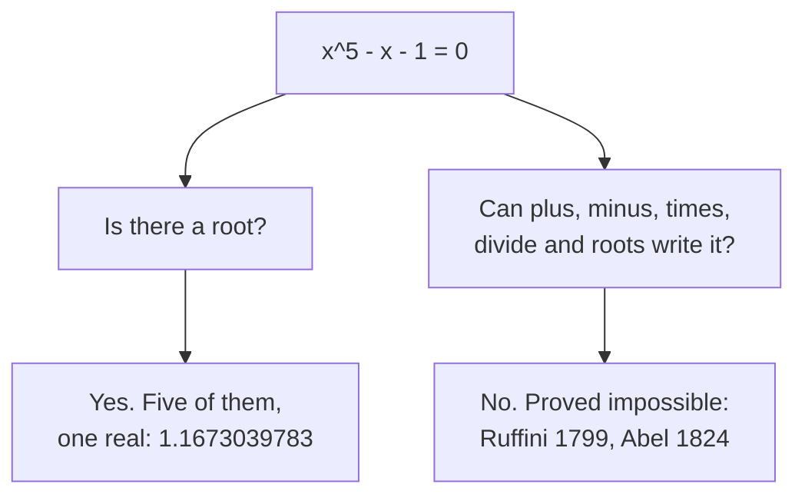
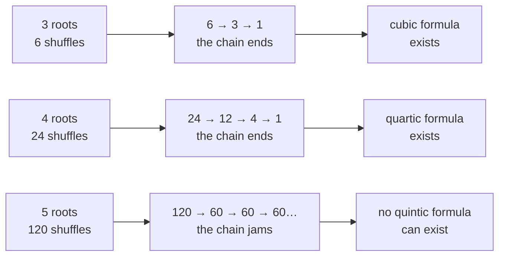

# Why there is no quintic formula: degrees 2, 3 and 4 have one, degree 5 provably cannot, because the roots' symmetries are too tangled

Algebra → For the Curious → The limit of radicals → Why there is no quintic formula

---

## General Overview

Two equations of degree five: the highest power of the unknown is the fifth. One asks for a number whose fifth power is 2, the other for a number whose fifth power is one more than itself. Both have an answer; only one can be written down.

The first is x^5 - 2 = 0, answered by the fifth root of 2: 1.1486983550 to ten places. The second is x^5 - x - 1 = 0, answered by 1.1673039783, which fifty halvings of an interval around it pin down. What cannot be done is write that root from whole numbers using plus, minus, times, divide and root-taking. Such an expression is a **radical expression**, and this root has none: Abel proved in 1824 that no radical formula solves every quintic; Ruffini had argued so in 1799.

A **quintic** is a degree-five polynomial equation, and it is where the school formulas stop. The reason is how the five roots may be shuffled without any whole-number equation between them noticing ([permutations-and-the-symmetric-group](../08-Groups/03-permutations-and-the-symmetric-group.md)). Taking a root breaks a group of shuffles into layers where order stops mattering. The 120 shuffles of five things refuse to break.

**A radical formula would take the shuffles of an equation's roots apart one order-free layer at a time; the shuffles of five roots stop coming apart at a core of 60, so no radical formula solves every quintic — while the roots are all still there to be found.**

**What kind of fact this is:** a theorem. Its group half is proved here and computed in the code; the bridge from radicals to peelable groups is stated here, proved in solvability-by-radicals-and-the-quintic.

### The picture: two questions about one equation



The left road is settled by the fundamental theorem of algebra ([fundamental-theorem-of-algebra](01-fundamental-theorem-of-algebra.md)); the right one closes.

---

## The formula

Each equation, with what its answer may be written as:

$$x^5 - 2 = 0 \quad\longrightarrow\quad x = \sqrt[5]{2} = 1.1486983550\ldots$$

$$x^5 - x - 1 = 0 \quad\longrightarrow\quad x = 1.1673039783\ldots, \text{ and no radical expression at all}$$

**Read it aloud:** both have a real answer; only the first has one the radical alphabet can spell.

**Abel–Ruffini, stated:** no expression built from a quintic's coefficients — the numbers multiplying its powers — by finitely many pluses, minuses, times, divides and nth roots gives a root of every quintic. Degrees 1 to 4 have one each; degree 5 and up, none.

One measurement carries the proof. Take two shuffles of the roots, $g$ and $h$: undo $h$, undo $g$, do $h$, do $g$, right to left as shuffles compose.

$$[g, h] = g\,h\,g^{-1}h^{-1}$$

where $g^{-1}$ undoes $g$. This is their **commutator**: if the two commute, either order giving the same result, it all cancels and nothing moves. A commutator records how much order mattered.

Collect the commutators of every pair in a group of shuffles and close them under "do one, then the next": out comes a group inside the original, its **peel**, with what commuted dropped. The standard name for it is the **commutator subgroup**. A group is **solvable** when repeated peeling reaches the do-nothing shuffle.

| Symbol | Plain meaning | In our example | Push it up and the answer… |
| --- | --- | --- | --- |
| $x$, $\sqrt[5]{2}$ | the unknown; the number whose fifth power is 2 | 1.1673039783; 1.1486983550 | another equation, another root |
| $S_n$, so $S_3$, $S_4$, $S_5$ | every shuffle of n roots | $S_5$: 120 shuffles of five | 720 for six roots, still stuck |
| $A_5$ | the 60 even shuffles of five roots | the core peeling cannot break | — |
| $g$, $h$, $[g, h]$ | two shuffles, and their commutator | two double swaps, from the code | — |

### When it holds

- **Radicals means that alphabet and no more.** Widen it and the wall moves: other functions write quintic roots, and halving a bracket writes them as decimals.
- **The stock starts at the whole numbers and their ratios.** Hand the recipe the wanted root as a constant and the question empties out.
- **One formula for all quintics fails, not every quintic.** A case is decided by the shuffles that equation's roots admit, not by its degree.

---

## Why it works

### Step 0: existence and spelling are different questions

Every degree-five polynomial has five complex roots, counted with repeats ([fundamental-theorem-of-algebra](01-fundamental-theorem-of-algebra.md)). Existence is settled; naming is not.

### Step 1: every root taken buys one order-free layer

A radical formula is a tower: each nth root taken adds a number to the stock, and the shuffles that step introduces commute, being only the choice of which nth root was meant. So the formula hands over a chain of order-free layers; peeling walks that chain from the other end, and a group that jams was never such a chain. That is the bridge, crossed by Galois in 1832:

**An equation is solvable by radicals exactly when the group of shuffles of its roots is solvable — when peeling reaches the do-nothing shuffle.**

### Step 2: three roots and four roots peel to the end

Peel the 6 shuffles of three things and 3 remain, the even ones; peel again and only the do-nothing shuffle is left: 6 → 3 → 1. Four things run 24 → 12 → 4 → 1. Both chains end, so the bridge permits the formulas Cardano and Ferrari published in 1545.



### Step 3: five roots jam at 60

Peel the 120 shuffles of five things and 60 come back: exactly the even ones, $A_5$. Peel those and the same 60 come back, for ever, so the chain reads 120 → 60 → 60 → 60.

Two facts do it, both checked in code. No peel reaches below the even shuffles, since every commutator is even. And the even shuffles are already commutators of even shuffles: a **three-place cycle** — cycling three places, fixing the rest — is the commutator of two double swaps, and three-place cycles build every even shuffle.

<details>
<summary>Detailed proof: the peel of the 60 is the 60 again</summary>

1. **Every commutator is even.** A shuffle and its undo take the same number of swaps, so the four pieces take an even number together. The peel of $S_5$ lies inside $A_5$, and no later peel escapes.
2. **Every three-place cycle is such a commutator.** Exchange places 2 and 3 and also 4 and 5; then places 1 and 2 and also 4 and 5. Both are even, and their commutator sends 1 to 2, 2 to 3, 3 to 1, fixing 4 and 5 — the code prints the pair. Relabelling the places carries it to all 20 three-place cycles.
3. **Three-place cycles build every even shuffle.** Take its swaps two at a time: equal swaps cancel, swaps sharing a place make a three-place cycle, and swaps a-b and c-d sharing none equal a to c, c to d, d to a followed by a to c, c to b, b to a.
4. **So the peel of $A_5$ is $A_5$.** By 2 and 3 it holds all 20 three-place cycles and so all 60; by 1 it holds no more. $S_5$ is not solvable, nor is any larger shuffle group, each holding these 60.

</details>

### Step 4: this quintic carries all 120 shuffles

The bridge asks about one equation's own shuffles: those keeping every whole-number equation between its roots true. For x^5 - x - 1 = 0 that is the full 120, as Conrad's paper below proves, so its roots have no radical expression — and, as it does not factor, not even one at a time. One such equation kills the general formula.

### Step 5: the root is still there, and two roads reach it

At x = 1 the expression x^5 - x - 1 comes out at -1, at x = 2 at 29. A polynomial cannot pass from below zero to above without crossing, so a root lies between. Halve the interval, keep the half still straddling zero, repeat: 50 halvings give 1.1673039783.

Newton's step is the second road: from a guess, follow the curve's own slope to the axis, landing at x - (x^5 - x - 1) / (5x^4 - 1). Eight steps from 1.2 give the same 1.1673039783. Abel's own proof used no groups; Galois's reworking is what generalises.

---

## Worked numbers, by hand

The two quintics, then the chains.

| Step | Arithmetic or check | Value |
| --- | --- | --- |
| the radical quintic, x^5 - 2 | 50 halvings, then 8 Newton steps | **1.1486983550** |
| bracket the other, x^5 - x - 1 | its value at x = 1 and at x = 2 | -1.00 and 29.00 |
| the root inside | 50 halvings, then 8 Newton steps | **1.1673039783** |
| peel three roots, then four | 6 → 3 → 1; 24 → 12 → 4 → 1 | **both reach 1** |
| peel five roots | 120 → 60 → 60 → 60 | **stuck at 60** |

Ten places of a number no radical expression can write, and a chain never reaching bottom.

### What breaks if you drop a piece

| Mistake | Comes out at | What went wrong |
| --- | --- | --- |
| Reusing the fifth root of 2 in x^5 - x - 1 | -0.1486983550, not 0 | the extra -x moves the root |
| "Degree five, so no radical answer" | x^5 - 2 answered at 1.1486983550 | the general formula fails, not every case |
| Stopping the peel at its first step | 60, read as if it were 1 | the 60 even shuffles peel to themselves |
| "No formula" read as "no root" | the root 1.1673039783, sitting there | existence is a separate theorem |

The code prints all four.

---

## Code, from first principles, and it actually runs

Nothing is imported, and each answer comes twice. The group half builds every commutator and closes it up, peeling the shuffles of three, four and five roots; that first peel is checked again against the even shuffles, counted by pairs standing out of order, and the jam by finding all 20 three-place cycles among commutators and rebuilding the 60.

### Python

```python
# Why there is no quintic formula -- the check behind the card.  Nothing is imported.  The
# group half peels the shuffles of 3, 4 and 5 roots by commutators; a shuffle of n places is
# a tuple of destinations, right-hand factor first.  The number half finds the root of
# x^5 - x - 1 and the radical root of x^5 - 2 by halving a bracket and again by Newton's step.
def shuffles(n):                               # every rearrangement of n places
    out = [()]
    for _ in range(n): out = [s + (d,) for s in out for d in range(1, n + 1) if d not in s]
    return out
def comp(a, b): return tuple(a[j - 1] for j in b)       # do b first, then a
def inv(a): return tuple(a.index(i) + 1 for i in range(1, len(a) + 1))
def odd(a): return sum(1 for i in range(len(a))         # pairs out of order
                       for j in range(i + 1, len(a)) if a[i] > a[j]) % 2
def bracket(a, b): return comp(comp(a, b), comp(inv(a), inv(b)))
def close(gens, ident):                        # smallest group holding the gens
    G = set(gens) | {ident}
    while G != (bigger := G | {comp(a, b) for a in G for b in G}): G = bigger
    return sorted(G)
def peel(G, ident): return close([bracket(a, b) for a in G for b in G], ident)
def ladder(n, steps=4):                     # group sizes down the peeling chain
    ident, G, sizes = tuple(range(1, n + 1)), shuffles(n), []
    for _ in range(steps): sizes.append(len(G)); G = peel(G, ident)
    return sizes
def chain(sizes): return " -> ".join(str(v) for v in sizes)
E5, S5 = tuple(range(1, 6)), shuffles(5)       # road two is the even shuffles,
A5, first = [s for s in S5 if not odd(s)], peel(S5, E5)    # road one the commutators
threes = [s for s in A5 if sum(1 for i, d in enumerate(s, 1) if d != i) == 3]
commutators = {bracket(a, b) for a in A5 for b in A5}
built, s3, s4, s5 = close(threes, E5), ladder(3), ladder(4), ladder(5)
lo_pair = next((a, b) for a in A5 for b in A5 if bracket(a, b) == (2, 3, 1, 4, 5))
print(f"shuffles of 3, 4 and 5 roots: {len(shuffles(3))}, {len(shuffles(4))} and {len(S5)}")
print(f"peeled by commutators, 3 roots: {chain(s3)}; 4 roots: {chain(s4)} -- both reach 1")
print(f"peeled by commutators, 5 roots: {chain(s5)} -- stuck at {s5[-1]}")
print(f"the first peel of the 120 is exactly the {len(A5)} even shuffles: {first == A5}")
print(f"all {len(threes)} three-place cycles are commutators of even shuffles: "
      f"{all(t in commutators for t in threes)}; they build all {len(built)}")
print(f"smallest such pair: [2, 3, 1, 4, 5] from {list(lo_pair[0])} and {list(lo_pair[1])}")
def five(x): return x * x * x * x * x
hard, easy = lambda x: five(x) - x - 1, lambda x: five(x) - 2
def halve(h, lo, hi, steps=50):                # both curves rise across 1 to 2
    for _ in range(steps):
        mid = (lo + hi) / 2; lo, hi = (mid, hi) if h(mid) < 0 else (lo, mid)
    return (lo + hi) / 2
def newton(h, slope, x, steps=8):
    for _ in range(steps): x = x - h(x) / slope(x)
    return x
eb, hb = halve(easy, 1.0, 2.0), halve(hard, 1.0, 2.0)
en = newton(easy, lambda x: 5 * x * x * x * x, 1.2)
hn = newton(hard, lambda x: 5 * x * x * x * x - 1, 1.2)
print(f"x^5 - 2 at x = 1 and x = 2: {easy(1.0):.2f} and {easy(2.0):.2f}; "
      f"x^5 - x - 1 there: {hard(1.0):.2f} and {hard(2.0):.2f}")
print(f"x^5 - 2, the radical case: 50 halvings give {eb:.10f}, 8 Newton steps {en:.10f}")
print(f"that root's fifth power, by five multiplications: {five(eb):.10f}")
print(f"x^5 - x - 1: 50 halvings give {hb:.10f}, 8 Newton steps from 1.2 {hn:.10f}")
print(f"the four mistakes come out at a residual of {hard(eb):.10f}, a radical answer of "
      f"{eb:.10f}, a peel stuck at {s5[-1]} instead of 1, and a root of {hb:.10f} all the same")
assert first == A5 and len(A5) == 60 and s5 == [120, 60, 60, 60]
assert all(t in commutators for t in threes) and built == A5 and len(threes) == 20
assert s3 == [6, 3, 1, 1] and s4 == [24, 12, 4, 1]
assert abs(hb - hn) < 1e-12 and abs(five(hb) - hb - 1) < 1e-12 and abs(five(eb) - 2) < 1e-12
print("ALL CHECKS PASS")
```

**Ran 2026-09-14 on macOS, Python 3.14.6, standard library only. All checks passed. Output, pasted from the run:**

```
shuffles of 3, 4 and 5 roots: 6, 24 and 120
peeled by commutators, 3 roots: 6 -> 3 -> 1 -> 1; 4 roots: 24 -> 12 -> 4 -> 1 -- both reach 1
peeled by commutators, 5 roots: 120 -> 60 -> 60 -> 60 -- stuck at 60
the first peel of the 120 is exactly the 60 even shuffles: True
all 20 three-place cycles are commutators of even shuffles: True; they build all 60
smallest such pair: [2, 3, 1, 4, 5] from [1, 3, 2, 5, 4] and [2, 1, 3, 5, 4]
x^5 - 2 at x = 1 and x = 2: -1.00 and 30.00; x^5 - x - 1 there: -1.00 and 29.00
x^5 - 2, the radical case: 50 halvings give 1.1486983550, 8 Newton steps 1.1486983550
that root's fifth power, by five multiplications: 2.0000000000
x^5 - x - 1: 50 halvings give 1.1673039783, 8 Newton steps from 1.2 1.1673039783
the four mistakes come out at a residual of -0.1486983550, a radical answer of 1.1486983550, a peel stuck at 60 instead of 1, and a root of 1.1673039783 all the same
ALL CHECKS PASS
```

### Rust

Same numbers, same labels, built with `rustc --edition 2021 -O`.

```rust
// Why there is no quintic formula -- the same check as the Python, in Rust.  No crates.  The group
// half peels the shuffles of 3, 4 and 5 roots by commutators; a shuffle of n places is a list of
// destinations, right-hand factor first.  The number half finds the root of x^5 - x - 1 and the
// radical root of x^5 - 2 by halving a bracket and again by Newton's step.
type P = Vec<i32>;
fn shuffles(n: i32) -> Vec<P> {                    // every rearrangement of n places
    let mut out: Vec<P> = vec![vec![]];
    for _ in 0..n { out = out.iter().flat_map(|s| (1..=n).filter(|d| !s.contains(d))
        .map(|d| { let mut t = s.clone(); t.push(d); t }).collect::<Vec<P>>()).collect(); }
    out
}
fn comp(a: &P, b: &P) -> P { b.iter().map(|&j| a[(j - 1) as usize]).collect() }   // b first
fn inv(a: &P) -> P { (1..=a.len() as i32).map(|i| a.iter().position(|&d| d == i).unwrap() as i32 + 1).collect() }
fn odd(a: &P) -> bool {                            // pairs standing out of order
    (0..a.len()).map(|i| (i + 1..a.len()).filter(|&j| a[i] > a[j]).count()).sum::<usize>() % 2 == 1
}
fn bracket(a: &P, b: &P) -> P { comp(&comp(a, b), &comp(&inv(a), &inv(b))) }
fn uniq(mut v: Vec<P>) -> Vec<P> { v.sort(); v.dedup(); v }
fn close(gens: Vec<P>, ident: &P) -> Vec<P> {      // smallest group holding the gens
    let mut g = uniq([gens, vec![ident.clone()]].concat());
    loop {
        let grown: Vec<P> = g.iter().flat_map(|a| g.iter().map(move |b| comp(a, b))).collect();
        let wider = uniq([g.clone(), grown].concat());
        if wider == g { return g; } else { g = wider; }
    }
}
fn peel(g: &[P], ident: &P) -> Vec<P> {
    close(g.iter().flat_map(|a| g.iter().map(move |b| bracket(a, b))).collect(), ident)
}
fn ladder(n: i32) -> Vec<usize> {                  // group sizes down the peeling chain
    let (ident, mut g, mut sizes): (P, Vec<P>, Vec<usize>) = ((1..=n).collect(), uniq(shuffles(n)), vec![]);
    for _ in 0..4 { sizes.push(g.len()); g = peel(&g, &ident); }
    sizes
}
fn chain(s: &[usize]) -> String { s.iter().map(|v| v.to_string()).collect::<Vec<_>>().join(" -> ") }
fn tf(b: bool) -> &'static str { if b { "True" } else { "False" } }
fn five(x: f64) -> f64 { x * x * x * x * x }
fn hard(x: f64) -> f64 { five(x) - x - 1.0 }
fn easy(x: f64) -> f64 { five(x) - 2.0 }
fn halve(h: &dyn Fn(f64) -> f64, mut lo: f64, mut hi: f64) -> f64 {    // both curves rise
    for _ in 0..50 { let mid = (lo + hi) / 2.0; if h(mid) < 0.0 { lo = mid; } else { hi = mid; } }
    (lo + hi) / 2.0
}
fn newton(h: &dyn Fn(f64) -> f64, slope: &dyn Fn(f64) -> f64, mut x: f64) -> f64 {
    for _ in 0..8 { x = x - h(x) / slope(x); }
    x
}
fn main() {
    let (e5, s5): (P, Vec<P>) = ((1..=5).collect(), uniq(shuffles(5)));
    let (a5, first): (Vec<P>, Vec<P>) = (s5.iter().filter(|s| !odd(s)).cloned().collect(), peel(&s5, &e5));
    let threes: Vec<P> = a5.iter().filter(|s| s.iter().enumerate()
        .filter(|(i, &d)| d != *i as i32 + 1).count() == 3).cloned().collect();
    let commutators = uniq(a5.iter().flat_map(|a| a5.iter().map(move |b| bracket(a, b))).collect());
    let (built, s3, s4, sizes) = (close(threes.clone(), &e5), ladder(3), ladder(4), ladder(5));
    let pair = a5.iter().flat_map(|a| a5.iter().map(move |b| (a, b)))
        .find(|(a, b)| bracket(a, b) == vec![2, 3, 1, 4, 5]).unwrap();
    let every_three = threes.iter().all(|t| commutators.contains(t));
    println!("shuffles of 3, 4 and 5 roots: {}, {} and {}", shuffles(3).len(), shuffles(4).len(), s5.len());
    println!("peeled by commutators, 3 roots: {}; 4 roots: {} -- both reach 1", chain(&s3), chain(&s4));
    println!("peeled by commutators, 5 roots: {} -- stuck at {}", chain(&sizes), sizes[3]);
    println!("the first peel of the 120 is exactly the {} even shuffles: {}", a5.len(), tf(first == a5));
    println!("all {} three-place cycles are commutators of even shuffles: {}; they build \
all {}", threes.len(), tf(every_three), built.len());
    println!("smallest such pair: [2, 3, 1, 4, 5] from {:?} and {:?}", pair.0, pair.1);
    let (eb, hb) = (halve(&easy, 1.0, 2.0), halve(&hard, 1.0, 2.0));
    let (en, hn) = (newton(&easy, &|x: f64| 5.0 * x * x * x * x, 1.2),
                    newton(&hard, &|x: f64| 5.0 * x * x * x * x - 1.0, 1.2));
    println!("x^5 - 2 at x = 1 and x = 2: {:.2} and {:.2}; x^5 - x - 1 there: {:.2} and {:.2}",
             easy(1.0), easy(2.0), hard(1.0), hard(2.0));
    println!("x^5 - 2, the radical case: 50 halvings give {:.10}, 8 Newton steps {:.10}", eb, en);
    println!("that root's fifth power, by five multiplications: {:.10}", five(eb));
    println!("x^5 - x - 1: 50 halvings give {:.10}, 8 Newton steps from 1.2 {:.10}", hb, hn);
    println!("the four mistakes come out at a residual of {:.10}, a radical answer of {:.10}, \
a peel stuck at {} instead of 1, and a root of {:.10} all the same", hard(eb), eb, sizes[3], hb);
    assert!(first == a5 && a5.len() == 60 && sizes == vec![120, 60, 60, 60]);
    assert!(every_three && built == a5 && threes.len() == 20);
    assert!(s3 == vec![6, 3, 1, 1] && s4 == vec![24, 12, 4, 1]);
    assert!((hb - hn).abs() < 1e-12 && (five(hb) - hb - 1.0).abs() < 1e-12 && (five(eb) - 2.0).abs() < 1e-12);
    println!("ALL CHECKS PASS");
}
```

**Ran 2026-09-14 on macOS, rustc 1.98.1, no crates. All checks passed. Output, pasted from the run:**

```
shuffles of 3, 4 and 5 roots: 6, 24 and 120
peeled by commutators, 3 roots: 6 -> 3 -> 1 -> 1; 4 roots: 24 -> 12 -> 4 -> 1 -- both reach 1
peeled by commutators, 5 roots: 120 -> 60 -> 60 -> 60 -- stuck at 60
the first peel of the 120 is exactly the 60 even shuffles: True
all 20 three-place cycles are commutators of even shuffles: True; they build all 60
smallest such pair: [2, 3, 1, 4, 5] from [1, 3, 2, 5, 4] and [2, 1, 3, 5, 4]
x^5 - 2 at x = 1 and x = 2: -1.00 and 30.00; x^5 - x - 1 there: -1.00 and 29.00
x^5 - 2, the radical case: 50 halvings give 1.1486983550, 8 Newton steps 1.1486983550
that root's fifth power, by five multiplications: 2.0000000000
x^5 - x - 1: 50 halvings give 1.1673039783, 8 Newton steps from 1.2 1.1673039783
the four mistakes come out at a residual of -0.1486983550, a radical answer of 1.1486983550, a peel stuck at 60 instead of 1, and a root of 1.1673039783 all the same
ALL CHECKS PASS
```

> [!TIP]
> **Try changing**
> Guess first, then run it. An assert halts the program on a wrong number.
> - **Peel with the wrong bracket.** In `bracket`, return `comp(a, b)`: nothing shrinks, the peel of the 120 is 120, first assert halts it.
> - **Take one Newton step, not eight.** Set `steps` to 1 in `newton`: the root prints 1.1692228864 against the halvings' 1.1673039783, fourth assert halts it.
> - **Peel one time fewer.** Set `steps` to 3 in `ladder`: four roots read 24 → 12 → 4 and look as jammed as five.

---

## The usual mistake

> [!warning]
> **Hearing "no formula" as "no answer".** Five roots exist for every quintic, and the real one here is pinned to ten places by 50 halvings. Abel ruled out one way of writing a root, not the root itself — and it is proved impossible, not unsolved.
>
> - **Thinking it kills every quintic.** x^5 - 2 = 0 is a quintic, and its answer is a single fifth root, 1.1486983550.
> - **Reusing one quintic's answer on another.** The fifth root of 2 put into x^5 - x - 1 gives -0.1486983550.
> - **Calling the first peel the end.** 120 down to 60 looks like progress; the next peel gives 60 again, never 1.

---

## Where you meet it in real life

- **Eigenvalues of a 5 by 5 matrix.** Roots of a degree-five polynomial: no radical formula gives them in general, and every library iterates ([eigenvalues-and-eigenvectors](../07-Eigenvalues%20and%20Symmetric%20Matrices/02-eigenvalues-and-eigenvectors.md)).
- **Computer algebra.** Asked to solve a quintic, a package returns radicals where the equation allows, else numbers or a name for the roots.
- **Engineering and graphics.** Polynomial roots in control design, ray tracing and orbit work are found by bracketing and iteration. Abel–Ruffini sits with the other proved impossibilities, such as trisecting an angle: knowing a tool cannot do a job redirects the work.

> **Say it back**
> Degrees 2, 3 and 4 have formulas built from plus, minus, times, divide and root-taking; degree 5 has none, and that is proved, not unknown. The reason is the shuffles of the roots: a radical formula would break them into order-free layers, and the 120 shuffles of five break to 60 and stop. The root is still there, 1.1673039783, found twice over.

---

## What this builds on

- [quadratic-formula](../02-Polynomials/03-quadratic-formula.md): the radical formula everyone has met, whose pattern degree 5 breaks.
- [permutations-and-the-symmetric-group](../08-Groups/03-permutations-and-the-symmetric-group.md): shuffles, how they compose, and even-or-odd as a property of the shuffle.
- [normal-subgroups-and-quotient-groups](../08-Groups/06-normal-subgroups-and-quotient-groups.md): throwing part of a group away and having a group left, as each peel does.
- [proof-by-contradiction](../../01-Foundations/06-Proof/03-proof-by-contradiction.md): the argument's shape — assume the formula, reach a chain that cannot exist.

## Where this goes next

- solvability-by-radicals-and-the-quintic: the bridge proved, and how to test one equation rather than a whole degree.

This card takes that bridge on trust: the one thing left to earn.

---

## Sources

Verified 14 Sep 2026: every link below resolves to the publisher's page.

- Abel, Niels Henrik. "Beweis der Unmöglichkeit, algebraische Gleichungen von höheren Graden als dem vierten allgemein aufzulösen." *Journal für die reine und angewandte Mathematik* 1 (1826), 65-84. [doi:10.1515/crll.1826.1.65](https://doi.org/10.1515/crll.1826.1.65). The 1824 proof as published.
- Conrad, Keith. "The Galois group of x^n - x - 1 over Q." University of Connecticut. [Expository paper](https://kconrad.math.uconn.edu/blurbs/gradnumthy/galoisselmerpoly.pdf). Proves this quintic's roots admit all 120 shuffles, as Step 4 needs.
- Judson, Thomas W. *Abstract Algebra: Theory and Applications*. Stephen F. Austin State University. [University publication page](https://scholarworks.sfasu.edu/ebooks/23/). Solvable groups and the chain of peels.
- O'Connor, J. J., and E. F. Robertson. "Paolo Ruffini." MacTutor History of Mathematics Archive, University of St Andrews. [Biography](https://mathshistory.st-andrews.ac.uk/Biographies/Ruffini/). The 1799 argument and its gap.
