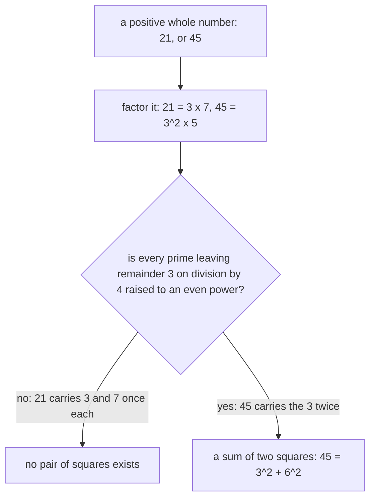

# Gaussian integers: whole numbers a + bi, where 5 is no longer prime, and which numbers are a sum of two squares

[Syllabus](../../../SYLLABUS.md) → [Algebra](../README.md) → [For the Curious](../README.md#s10) → Gaussian integers

---

## General Overview

A courtyard is paved in square tiles, a metre to a side. Pin a wire from one tile corner to another: 2 metres across, 1 metre up. Square each, add: 4 + 1 = 5, the wire's squared length.

Which whole numbers can be a squared length? 5 can, 13 can (9 + 4), and 21 cannot: no two of 0, 1, 4, 9 and 16 add to 21.

Among whole numbers 5 is prime: 1 and 5 are its only divisors. Now allow i, ruled only by i × i = -1 ([The fundamental theorem of algebra](01-fundamental-theorem-of-algebra.md) admitted it two cards ago). Then 5 = (2 + i)(2 - i): expanding, the middle terms cancel, -i × i is +1, and 4 + 1 = 5. Likewise 13 = (3 + 2i)(3 - 2i) = 9 + 4. A factorisation and a sum of two squares are one fact in two costumes.

A point a across and b up is written a + bi. These are the **Gaussian integers** from here on, and the squared length of one is its **norm**.

**A whole number is a sum of two squares exactly when it splits into a Gaussian integer times its mirror image, and which numbers split is settled by their ordinary prime factors.**

**What kind of fact this is:** a definition — the Gaussian integers and their norm — carrying two theorems. That norms multiply is proved below. Fermat's rule is stated here and proved on Two squares.

### The picture: norms in one corner of the grid

```
b = 3 |   9  10  13  18  25
b = 2 |   4   5   8  13  20
b = 1 |   1   2   5  10  17
b = 0 |   0   1   4   9  16
```

Rows are b, columns a, 0 to 4; each cell is a^2 + b^2. So 5 appears twice, at 2 + i and 1 + 2i, and 13 twice; the bottom row is the perfect squares; 21 appears nowhere.

---

## The formula

A **Gaussian integer** is a + bi, with a and b whole numbers and i fixed by one rule:

$$\mathbb{Z}[i] = \{a + bi : a, b \text{ whole numbers}\}, \qquad i \times i = -1$$

Add coordinate by coordinate: (2 + i) + (3 + 2i) = 5 + 3i. Multiply by expanding, then replacing i × i:

$$(a + bi)(c + di) = (ac - bd) + (ad + bc)i$$

The **conjugate** of a + bi is a - bi, the same point with its up-coordinate flipped. A point times its conjugate is its **norm**:

$$N(a + bi) = (a + bi)(a - bi) = a^2 + b^2$$

**Read it aloud:** multiply grid points as brackets always multiply, turning i × i into -1; a point times its mirror image is the sum of its two squared coordinates.

| Symbol | Plain meaning | In our example | Push it up and the answer… |
| --- | --- | --- | --- |
| $i$ | the new number, ruled by i × i = -1 | why 5 splits | a definition, not a dial |
| $a + bi$, $c + di$ | grid points: across, up, whole | 2 + i, 3 + 2i | further out, larger norm |
| $\mathbb{Z}[i]$ | all of them, "Z adjoin i"; the colon reads "such that" | the grid | — |
| $a - bi$ | the conjugate: b flipped | 2 - i | — |
| $N(a + bi)$ | the norm, a^2 + b^2 | 5, for 2 + i | — |

One consequence carries the card: a product's norm is the product of the norms:

$$(ac - bd)^2 + (ad + bc)^2 = (a^2 + b^2)(c^2 + d^2)$$

So a sum of two squares times a sum of two squares is another.

### When it holds

- **Coordinates stay whole.** One point divides another exactly when both coordinates of the exact quotient are whole.
- **The norm test runs one way.** Divisibility makes norms divide, never the reverse: 2 + i and 2 - i share norm 5, yet neither divides the other.
- **Fermat's rule is about primes.** For a composite the exponents decide; 21 leaves remainder 1 and still fails.
- **Zero and negatives are dull.** 0 = 0^2 + 0^2; nothing negative qualifies.

---

## Why it works

### Step 0: one new number, and the grid never leaks

Add or multiply two grid points and the answer is another grid point. Addition works coordinate by coordinate; multiplication leaves a bd × i × i term, which the rule turns into -bd on the across-coordinate. Whole in, whole out.

### Step 1: the norm multiplies, and that is the engine

Multiply out both squares: the middle terms -2abcd and +2abcd cancel, and the rest regroups as (a^2 + b^2)(c^2 + d^2).

Watch it pay. (2 + i)(3 + 2i) = 4 + 7i, whose norm 4^2 + 7^2 = 65 is 5 × 13: a new sum of two squares. Such sums are closed under multiplication, so only primes are left to settle.

### Step 2: which points are units, and why 5 has really split

A **unit** is a point whose reciprocal is also on the grid, carrying no information, as 1 and -1 do among whole numbers. Two points multiplying to 1 have norms multiplying to 1, and norms are whole and never negative, so both are 1. Then a^2 + b^2 = 1: only 1, -1, i, -i.

So 5 = (2 + i)(2 - i) is a factorisation worth the name: both factors have norm 5, so neither is a unit, and a product of two non-units is not prime. **5 is not prime among the Gaussian integers**, and nor is 13. But 3 cannot split: it sits at 3 + 0i, norm 9, so a split needs two factors of norm 3 — and no point has norm 3, or 7.

### Step 3: the norm rules a divisor out, never in

To divide, multiply top and bottom by the conjugate of the bottom, turning the bottom into its own norm:

$$\frac{a + bi}{c + di} = \frac{(a + bi)(c - di)}{c^2 + d^2}$$

So c + di divides a + bi exactly when c^2 + d^2 divides both coordinates of the top. Dividing 5 by 2 + i gives numerators (10, -5) over 5: quotient 2 - i, exact. Dividing 2 + i by 2 - i gives numerators (3, 4) over 5 — three fifths and four fifths, off the grid, though both norms are 5 and their ratio a clean 1. Failing the norm test finishes a candidate; passing it shows nothing.

<details>
<summary>Dividing with a remainder, and why factorisation here is unique</summary>

Round each coordinate of the exact quotient to the nearest whole number: each is off by at most a half, so the leftover's norm is at most half the divisor's. Shrinking leftovers are what Euclid's algorithm needs, so common divisors and unique factorisation into Gaussian primes follow, as for polynomials ([Polynomials behave like integers](../09-Rings%20and%20Fields/03-polynomials-behave-like-integers.md)).

</details>

### Step 4: Fermat's rule, and the exponents

**Fermat's rule.** An ordinary prime is a sum of two squares exactly when it is 2, or leaves remainder 1 on division by 4.

So 5 = 2^2 + 1^2 and 13 = 3^2 + 2^2, both remainder 1, while 3 and 7 leave remainder 3 and have none. A remainder-1 prime splits into a point times its mirror; a remainder-3 prime stays prime; and 2 = (1 + i)(1 - i).

The callout proves half. The hard half, that every remainder-1 prime splits, is proved on Two squares.

<details>
<summary>Detailed proof: no number leaving remainder 3 on division by 4 is a sum of two squares</summary>

What can one square leave on division by 4 ([Congruence](../../02-Number%20theory/03-Clock%20Arithmetic/01-congruence-mod-n.md))?
- **Even.** Twice a whole number, squared, is four times a square. Remainder 0.
- **Odd.** Twice a whole number plus 1, squared, is four times a square, plus four times that number, plus 1. Remainder 1.

So one square leaves 0 or 1, and two leave 0 + 0, 0 + 1 or 1 + 1: never 3. Every prime but 2 leaves remainder 1 or 3, so the easy half is done.

</details>

**The rule for every whole number.** A positive whole number is a sum of two squares exactly when every remainder-3 prime appears in its factorisation to an even power ([Prime factorisation](../../02-Number%20theory/01-Divisibility%20and%20Primes/07-prime-factorisation.md)).



One more: 65 = 5 × 13, both remainder-1 primes, so 65 is in twice over, as 1^2 + 8^2 and as 4^2 + 7^2.

An even power is a perfect square, itself a sum of two squares with a zero coordinate, so Step 1 multiplies the pieces together. The reverse direction needs one more fact, proved on Two squares.

---

## Worked numbers, by hand

| Step | Arithmetic | Value |
| --- | --- | --- |
| the wire, 2 across, 1 up | 2^2 + 1^2 | **5** |
| 5 and 13 as products | (2 + i)(2 - i), (3 + 2i)(3 - 2i) | **5 + 0i, 13 + 0i** |
| (2 + i)(3 + 2i), then its norm | across 2 × 3 - 1 × 2, up 2 × 2 + 1 × 3; 4^2 + 7^2 | **4 + 7i, 65** |
| 21, 45 by the rule | 3 × 7, each once; 3^2 × 5, the 3 twice | **none; 3^2 + 6^2** |

The 65 came from multiplying, not searching.

### What breaks if you drop a piece

| Mistake | Comes out at | What went wrong |
| --- | --- | --- |
| Reading i × i as +1 | 3 | (2 + i)(2 - i) becomes 4 - 1 |
| Trusting the norm test | ratio 1, so 2 - i passes for a divisor | the quotient is three fifths, four fifths |
| Using the prime rule on 21 | 21 mod 4 = 1, so 21 passes | composites need the exponents |

The code prints all three, and 25.

---

## Code, from first principles, and it actually runs

Two roads reach the same verdict for every whole number from 1 to 400: one reads the exponents of the remainder-3 primes, the other searches every pair of squares. They also print the norm grid, the units and two divisions.

### Python

```python
# Gaussian integers -- the check behind the card.  Nothing is imported.  The
# pair (a, b) stands for a + bi, where i times i is -1.  Road one factors a whole
# number and applies the exponent rule for primes leaving remainder 3 on division
# by 4.  Road two searches every pair of squares, and the roads are compared for
# every whole number from 1 to 400.
LIMIT, CASES = 400, [5, 13, 21, 45, 65]
def mul(z, w):                                  # (a+bi)(c+di), i times i = -1
    return z[0] * w[0] - z[1] * w[1], z[0] * w[1] + z[1] * w[0]
def conj(z): return (z[0], -z[1])               # the mirror image: flip b
def norm(z): return z[0] * z[0] + z[1] * z[1]   # the norm a*a + b*b
def quotient(z, w): return mul(z, conj(w)), norm(w)   # numerators, divisor
def divides(w, z):                              # exact division on the grid
    (across, up), den = quotient(z, w)
    return den != 0 and across % den == 0 and up % den == 0
def primes_in(n):                               # trial division: prime, power
    out, p = [], 2
    while p * p <= n:
        e = 0
        while n % p == 0: n //= p; e += 1
        if e: out.append((p, e))
        p += 1
    if n > 1: out.append((n, 1))
    return out
def rule(n):                                    # road one: the exponent rule
    return all(p % 4 != 3 or e % 2 == 0 for p, e in primes_in(n))
def pairs(n):                                   # road two: search the squares
    top = 0
    while (top + 1) * (top + 1) <= n: top += 1
    return [(a, b) for a in range(top + 1) for b in range(a, top + 1) if a * a + b * b == n]

Z, W = (2, 1), (3, 2)                           # the points 2 + i and 3 + 2i
five, thirteen, prod = mul(Z, conj(Z)), mul(W, conj(W)), mul(Z, W)
units = [(a, b) for a in (-1, 0, 1) for b in (-1, 0, 1) if norm((a, b)) == 1]
exact, off = quotient((5, 0), Z), quotient(Z, conj(Z))
agree = sum(1 for n in range(1, LIMIT + 1) if rule(n) == bool(pairs(n)))

print("the pair (a, b) means a + bi, i times i = -1; the grid holds the norm a*a + b*b, columns a = 0 to 4")
for b in (3, 2, 1, 0): print(f"b = {b} |" + "".join(f"{a * a + b * b:>4}" for a in range(5)))
print(f"(2 + i) + (3 + 2i) = {Z[0] + W[0]} + {Z[1] + W[1]}i")
print(f"(2 + i)(2 - i) = {five[0]} + {five[1]}i, factor norms {norm(Z)} and "
      f"{norm(conj(Z))}, and the norm of 5 + 0i is {norm((5, 0))}")
print(f"(3 + 2i)(3 - 2i) = {thirteen[0]} + {thirteen[1]}i, factor norms {norm(W)} and {norm(conj(W))}")
print(f"(2 + i)(3 + 2i) = {prod[0]} + {prod[1]}i, norm {norm(prod)} = "
      f"{norm(Z)} x {norm(W)}, and 4*4 + 7*7 = {prod[0] ** 2 + prod[1] ** 2}")
print(f"the grid points of norm 1, the units, are {units}: -1, -i, i and 1")
print(f"5 over (2 + i): numerators {exact[0]} over {exact[1]}, quotient "
      f"({exact[0][0] // exact[1]}, {exact[0][1] // exact[1]}), on the grid")
print(f"(2 + i) over (2 - i): numerators {off[0]} over {off[1]}, off the grid, "
      f"norm ratio {norm(Z) // norm(conj(Z))}")
for n in CASES:
    got, ps = pairs(n), " ".join(f"{p}^{e}" for p, e in primes_in(n))
    shown = " ".join(f"({a}, {b})" for a, b in got) if got else "none"
    print(f"n = {n}: primes {ps}, rule says {'yes' if rule(n) else 'no'}, pairs {shown}")
print(f"rule and square-search agree for every n from 1 to {LIMIT}: {agree} of {LIMIT}")
print(f"with i times i = +1, (2 + i)(2 - i) would be {2 * 2 - 1 * 1}, not {five[0]}; and 21 mod 4 = {21 % 4}")
assert five == (5, 0) and thirteen == (13, 0) and units == [(-1, 0), (0, -1), (0, 1), (1, 0)]
assert norm(prod) == norm(Z) * norm(W) and prod == (4, 7)
assert agree == LIMIT and pairs(5) == [(1, 2)] and pairs(21) == []
assert exact == ((10, -5), 5) and off == ((3, 4), 5) and not divides(conj(Z), Z) and divides(Z, (5, 0))
print("ALL CHECKS PASS")
```

**Ran 2026-09-14 on macOS, Python 3.14.6, standard library only. All checks passed. Output, pasted from the run:**

```
the pair (a, b) means a + bi, i times i = -1; the grid holds the norm a*a + b*b, columns a = 0 to 4
b = 3 |   9  10  13  18  25
b = 2 |   4   5   8  13  20
b = 1 |   1   2   5  10  17
b = 0 |   0   1   4   9  16
(2 + i) + (3 + 2i) = 5 + 3i
(2 + i)(2 - i) = 5 + 0i, factor norms 5 and 5, and the norm of 5 + 0i is 25
(3 + 2i)(3 - 2i) = 13 + 0i, factor norms 13 and 13
(2 + i)(3 + 2i) = 4 + 7i, norm 65 = 5 x 13, and 4*4 + 7*7 = 65
the grid points of norm 1, the units, are [(-1, 0), (0, -1), (0, 1), (1, 0)]: -1, -i, i and 1
5 over (2 + i): numerators (10, -5) over 5, quotient (2, -1), on the grid
(2 + i) over (2 - i): numerators (3, 4) over 5, off the grid, norm ratio 1
n = 5: primes 5^1, rule says yes, pairs (1, 2)
n = 13: primes 13^1, rule says yes, pairs (2, 3)
n = 21: primes 3^1 7^1, rule says no, pairs none
n = 45: primes 3^2 5^1, rule says yes, pairs (3, 6)
n = 65: primes 5^1 13^1, rule says yes, pairs (1, 8) (4, 7)
rule and square-search agree for every n from 1 to 400: 400 of 400
with i times i = +1, (2 + i)(2 - i) would be 3, not 5; and 21 mod 4 = 1
ALL CHECKS PASS
```

### Rust

Same numbers, same labels, built with `rustc --edition 2021 -O`.

```rust
// Gaussian integers -- the same check as the Python, in Rust.  No crates.  The pair
// (a, b) stands for a + bi, where i times i is -1.  Road one factors a whole number
// and applies the exponent rule for primes leaving remainder 3 on division by 4.
// Road two searches every pair of squares; the roads are compared for n = 1 to 400.
const LIMIT: i64 = 400;
const CASES: [i64; 5] = [5, 13, 21, 45, 65];
type G = (i64, i64);
fn mul(z: G, w: G) -> G {                       // (a+bi)(c+di), i times i = -1
    (z.0 * w.0 - z.1 * w.1, z.0 * w.1 + z.1 * w.0)
}
fn conj(z: G) -> G { (z.0, -z.1) }              // the mirror image: flip b
fn norm(z: G) -> i64 { z.0 * z.0 + z.1 * z.1 }  // the norm a*a + b*b
fn quotient(z: G, w: G) -> (G, i64) { (mul(z, conj(w)), norm(w)) }   // numerators, divisor
fn divides(w: G, z: G) -> bool {                // exact division on the grid
    let ((across, up), den) = quotient(z, w);
    den != 0 && across % den == 0 && up % den == 0
}
fn primes_in(mut n: i64) -> Vec<(i64, i64)> {   // trial division: prime, power
    let (mut out, mut p) = (vec![], 2);
    while p * p <= n {
        let mut e = 0;
        while n % p == 0 { n /= p; e += 1; }
        if e > 0 { out.push((p, e)); }
        p += 1;
    }
    if n > 1 { out.push((n, 1)); }
    out
}
fn rule(n: i64) -> bool {                       // road one: the exponent rule
    primes_in(n).iter().all(|&(p, e)| p % 4 != 3 || e % 2 == 0)
}
fn pairs(n: i64) -> Vec<G> {                    // road two: search the squares
    let mut top = 0;
    while (top + 1) * (top + 1) <= n { top += 1; }
    let mut out = vec![];
    for a in 0..=top { for b in a..=top { if a * a + b * b == n { out.push((a, b)); } } }
    out
}
fn main() {
    let (z, w) = ((2, 1), (3, 2));              // the points 2 + i and 3 + 2i
    let (five, thirteen, prod) = (mul(z, conj(z)), mul(w, conj(w)), mul(z, w));
    let mut units = vec![];
    for a in -1..=1 { for b in -1..=1 { if norm((a, b)) == 1 { units.push((a, b)); } } }
    let (exact, off) = (quotient((5, 0), z), quotient(z, conj(z)));
    let agree = (1..=LIMIT).filter(|&n| rule(n) == !pairs(n).is_empty()).count() as i64;
    println!("the pair (a, b) means a + bi, i times i = -1; the grid holds the norm a*a + b*b, columns a = 0 to 4");
    for b in [3i64, 2, 1, 0] {
        let mut line = format!("b = {} |", b);
        for a in 0..5 { line.push_str(&format!("{:>4}", a * a + b * b)); }
        println!("{}", line);
    }
    println!("(2 + i) + (3 + 2i) = {} + {}i", z.0 + w.0, z.1 + w.1);
    println!("(2 + i)(2 - i) = {} + {}i, factor norms {} and {}, and the norm of 5 + 0i is {}",
             five.0, five.1, norm(z), norm(conj(z)), norm((5, 0)));
    println!("(3 + 2i)(3 - 2i) = {} + {}i, factor norms {} and {}", thirteen.0, thirteen.1, norm(w), norm(conj(w)));
    println!("(2 + i)(3 + 2i) = {} + {}i, norm {} = {} x {}, and 4*4 + 7*7 = {}",
             prod.0, prod.1, norm(prod), norm(z), norm(w), prod.0 * prod.0 + prod.1 * prod.1);
    println!("the grid points of norm 1, the units, are {:?}: -1, -i, i and 1", units);
    println!("5 over (2 + i): numerators {:?} over {}, quotient ({}, {}), on the grid",
             exact.0, exact.1, exact.0.0 / exact.1, exact.0.1 / exact.1);
    println!("(2 + i) over (2 - i): numerators {:?} over {}, off the grid, norm ratio {}",
             off.0, off.1, norm(z) / norm(conj(z)));
    for n in CASES {
        let got = pairs(n);
        let ps: Vec<String> = primes_in(n).iter().map(|(p, e)| format!("{}^{}", p, e)).collect();
        let shown = if got.is_empty() { "none".to_string() }
            else { got.iter().map(|(a, b)| format!("({}, {})", a, b)).collect::<Vec<_>>().join(" ") };
        println!("n = {}: primes {}, rule says {}, pairs {}", n, ps.join(" "),
                 if rule(n) { "yes" } else { "no" }, shown);
    }
    println!("rule and square-search agree for every n from 1 to {}: {} of {}", LIMIT, agree, LIMIT);
    println!("with i times i = +1, (2 + i)(2 - i) would be {}, not {}; and 21 mod 4 = {}",
             2 * 2 - 1 * 1, five.0, 21 % 4);
    assert!(five == (5, 0) && thirteen == (13, 0) && units == vec![(-1, 0), (0, -1), (0, 1), (1, 0)]);
    assert!(norm(prod) == norm(z) * norm(w) && prod == (4, 7));
    assert!(agree == LIMIT && pairs(5) == vec![(1, 2)] && pairs(21).is_empty());
    assert!(exact == ((10, -5), 5) && off == ((3, 4), 5) && !divides(conj(z), z) && divides(z, (5, 0)));
    println!("ALL CHECKS PASS");
}
```

**Ran 2026-09-14 on macOS, rustc 1.98.1, no crates. All checks passed. Output, pasted from the run:**

```
the pair (a, b) means a + bi, i times i = -1; the grid holds the norm a*a + b*b, columns a = 0 to 4
b = 3 |   9  10  13  18  25
b = 2 |   4   5   8  13  20
b = 1 |   1   2   5  10  17
b = 0 |   0   1   4   9  16
(2 + i) + (3 + 2i) = 5 + 3i
(2 + i)(2 - i) = 5 + 0i, factor norms 5 and 5, and the norm of 5 + 0i is 25
(3 + 2i)(3 - 2i) = 13 + 0i, factor norms 13 and 13
(2 + i)(3 + 2i) = 4 + 7i, norm 65 = 5 x 13, and 4*4 + 7*7 = 65
the grid points of norm 1, the units, are [(-1, 0), (0, -1), (0, 1), (1, 0)]: -1, -i, i and 1
5 over (2 + i): numerators (10, -5) over 5, quotient (2, -1), on the grid
(2 + i) over (2 - i): numerators (3, 4) over 5, off the grid, norm ratio 1
n = 5: primes 5^1, rule says yes, pairs (1, 2)
n = 13: primes 13^1, rule says yes, pairs (2, 3)
n = 21: primes 3^1 7^1, rule says no, pairs none
n = 45: primes 3^2 5^1, rule says yes, pairs (3, 6)
n = 65: primes 5^1 13^1, rule says yes, pairs (1, 8) (4, 7)
rule and square-search agree for every n from 1 to 400: 400 of 400
with i times i = +1, (2 + i)(2 - i) would be 3, not 5; and 21 mod 4 = 1
ALL CHECKS PASS
```

The two outputs match line for line.

> [!TIP]
> **Try changing**
> Guess each new number first. An assert fires when one is wrong.
> - **Drop the rule defining i.** In `mul`, change `- z[1] * w[1]` to `+ z[1] * w[1]`: (2 + i)(2 - i) becomes 3, and the first assert fires.
> - **Trust the norm test.** In `divides`, return `den != 0 and norm(z) % den == 0`: 2 - i then counts as a divisor of 2 + i, and the fourth assert fires.
> - **Watch the wrong remainder.** In `rule`, change `p % 4 != 3` to `p % 4 != 1`: 5 and 13 turn into "no", 21 into "yes", and the third assert fires.

---

## The usual mistake

> [!warning]
> **Treating the norm test as a divisibility test.** A norm is a squared length, and length forgets direction. 2 + i and 2 - i share the norm 5, so the ratio is a clean 1 — yet neither divides the other, since the quotient is three fifths and four fifths. A norm test rejects divisors; it never certifies one.
>
> - **"Prime" needs its system named.** 5 is prime among whole numbers and splits among Gaussian integers. The allowed factors grew, not 5.
> - **The norm of 5 is 25, not 5.** The whole number 5 sits at 5 + 0i; norm 5 belongs to points like 2 + i and 1 + 2i.
> - **Remainder 1 is no licence for a composite.** 21 leaves remainder 1 and still has no representation.

---

## Where you meet it in real life

- **Square grids.** Squared distances between corners of a tiled floor or a pixel grid are exactly the sums of two squares: 5 and 13 occur, 21 never does.
- **An old question in a bigger system.** [Pell's equation](04-pell-equation-and-root-two.md) makes the same move with another new number.

> **Say it back**
> A Gaussian integer is a grid point a + bi with whole coordinates, where i × i = -1, and its norm is a^2 + b^2. A point times its mirror image is its norm, so a whole number is a sum of two squares exactly when it splits that way: 5 = (2 + i)(2 - i), 13 = (3 + 2i)(3 - 2i). Norms multiply, so those two combine into 65 = 4^2 + 7^2, leaving only the primes to settle. Fermat's rule settles them: 2 and the remainder-1 primes qualify, the rest do not. For a composite, every remainder-3 prime must appear an even number of times — why 45 qualifies and 21 does not.

---

## What this builds on

- [Polynomials behave like integers](../09-Rings%20and%20Fields/03-polynomials-behave-like-integers.md): factors, units, what "prime" means in a new system.
- [The fundamental theorem of algebra](01-fundamental-theorem-of-algebra.md): admits i on one rule; its pair 2 + i and 2 - i multiplies to 5 here.
- [Congruence](../../02-Number%20theory/03-Clock%20Arithmetic/01-congruence-mod-n.md): remainders on division by 4.
- [Prime factorisation](../../02-Number%20theory/01-Divisibility%20and%20Primes/07-prime-factorisation.md): the exponents the rule reads.

## Where this goes next

- Two squares: proves the half stated here, and counts representations.

This card says which whole numbers are sums of two squares; it cannot say why remainder 1 suffices, nor why 65 has two representations and 45 one.

---

## Sources

Verified 14 Sep 2026: every link below resolves to the publisher's page.

- Conrad, Keith. "The Gaussian Integers." Notes, University of Connecticut. [PDF](https://kconrad.math.uconn.edu/blurbs/ugradnumthy/Zinotes.pdf). Norms, units, division with a remainder, both two-square theorems proved.
- Zagier, D. "A One-Sentence Proof That Every Prime p ≡ 1 (mod 4) Is a Sum of Two Squares." *The American Mathematical Monthly* 97 (1990): 144. [doi:10.2307/2323918](https://doi.org/10.2307/2323918). The hard half.
- O'Connor, J. J., and E. F. Robertson. "Pierre de Fermat." MacTutor History of Mathematics Archive, St Andrews. [Biography](https://mathshistory.st-andrews.ac.uk/Biographies/Fermat/). His own descent argument.
