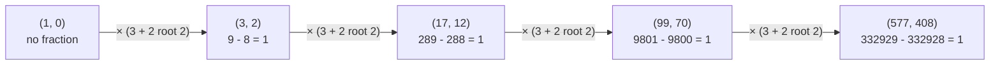

# Pell's equation: the whole-number solutions of x^2 - 2y^2 = 1 never run out, and each one is a better fraction for root 2

[Syllabus](../../../SYLLABUS.md) → [Algebra](../README.md) → [For the Curious](../README.md#s10) → Pell's equation

---

## General Overview

Lay 289 counters out as a square, 17 rows of 17. Rebuild them as two equal squares: two squares of 12 by 12 take 288, and one counter is left over. Nine counters do the same against two squares of 2 by 2, and 9801 against two of 70 by 70.

Exactness is impossible: the big side over a small side would be root 2, the number that gives 2 when multiplied by itself, and root 2 is no fraction ([Irrational numbers](../../01-Foundations/02-The%20Number%20Line/03-irrational-numbers.md)). With x the big square's side and y a small one's, these near misses are the whole-number solutions of x^2 - 2y^2 = 1, known as a **Pell equation** after Euler misattributed it.

And the near miss pays: 3/2 = 1.5000000, 17/12 = 1.4166667, 99/70 = 1.4142857, against root 2 = 1.4142136.

**The pairs that leave exactly one counter over never stop coming: each is the pair before it multiplied by 3 + 2 root 2, and each is a sharper fraction for root 2.**

**What kind of fact this is:** a theorem, proved in Why it works. Every power of 3 + 2 root 2 solves the equation, and nothing else does.

### The picture: one multiplication, the whole list



Each arrow multiplies by 3 + 2 root 2; the lower line is the equation's left side, 1 every time.

---

## The formula

$$x^2 - 2y^2 = 1$$

**Read it aloud:** x multiplied by itself, less twice y multiplied by itself, comes to exactly one.

| Symbol | Plain meaning | In our example | Push it up and the answer… |
| --- | --- | --- | --- |
| $x$ | the big square's side, the fraction's top | 99 | y grows to match |
| $y$ | a small square's side, the fraction's bottom | 70 | x/y lands closer to root 2 |
| $x^2 - 2y^2$ | the big square less the two small ones | 9801 − 9800 | — |
| $\sqrt{2}$ | root 2: gives 2 when multiplied by itself | 1.4142136 | — |
| $n$ | which solution, counting from 1 | 3, for (99, 70) | both numbers roughly sextuple |
| $3 + 2\sqrt{2}$ | the multiplier from one solution to the next | fixed | — |

From (x, y) the next solution is the pair

$$(3x + 4y, \; 2x + 3y)$$

Both entries use the old pair, not each other. The rule is one multiplication in disguise, n counting the solutions:

$$x + y\sqrt{2} = (3 + 2\sqrt{2})^n$$

### When it holds

- **x and y are whole and above zero.** (1, 0) solves it but gives no fraction. Negatives add only sign-flipped copies.
- **The 2 fixes the rule.** For x^2 - 3y^2 = 1 the first solution is (2, 1), the multiplier 2 + root 3; the 3 and 4 above belong to the 2 alone.
- **The right-hand side is exactly 1.** The pair (7, 5) gives 49 - 50, or -1: another equation, another list.
- **No perfect square under the root.** x^2 - 4y^2 = 1 factors into (x - 2y)(x + 2y) = 1, forcing y = 0; the check finds no solution to 10,000.

---

## Why it works

### Step 0: the left side is a number times its mirror

Work inside the numbers a + b root 2, a and b whole. Add, subtract or multiply two of them and the answer is again one of them, since two root 2s meeting turn into a plain 2. A set closed like that is a **ring** ([Rings](../09-Rings%20and%20Fields/01-rings.md)).

Flip the sign before the root for the mirror image, properly the **conjugate**: 3 + 2 root 2 has conjugate 3 - 2 root 2. A number times its own conjugate loses the root:

$$(x + y\sqrt{2})(x - y\sqrt{2}) = x^2 - 2y^2$$

So the equation says more than it appears to: x + y root 2 times its conjugate is 1, making the conjugate its reciprocal. A member whose reciprocal is also a member is a **unit**, so the equation hunts the units of a + b root 2. The quantity x^2 - 2y^2 is the **norm** of x + y root 2.

### Step 1: two solutions multiply into a third

$$(x + y\sqrt{2})(3 + 2\sqrt{2}) = 3x + 4y + (2x + 3y)\sqrt{2}$$

There is the step rule, read off a multiplication rather than guessed.

Conjugating flips a sign, so (x - y root 2)(3 - 2 root 2) is 3x + 4y - (2x + 3y) root 2. Multiply those two results, each number with its own conjugate, and Step 0 turns each side into norms:

$$(x^2 - 2y^2) \times (3^2 - 2 \times 2^2) = (3x + 4y)^2 - 2(2x + 3y)^2$$

Since 9 - 8 = 1, the left side is 1 × 1 for any solution, so the new pair has norm 1: it solves the equation. Norms multiply; no cases are checked. From (3, 2) the rule gives 17 and 12, with 289 - 288 = 1, or in one line (3 + 2 root 2)^2 = 17 + 12 root 2.

### Step 2: the list never ends

The new bottom number, 2x + 3y, beats y whenever both are above zero, so every step lifts it: 2, 12, 70, 408, 2378. No pair repeats and nothing stops the multiplying, so the solutions are endless.

### Step 3: nothing is missed

An endless list could still have gaps; this one does not, because the multiplication runs backwards. By Step 0, 3 - 2 root 2 is the reciprocal of 3 + 2 root 2, so multiplying by it undoes a step: from (x, y) it gives (3x - 4y, 3y - 2x), norm 1 × 1 again. On (17, 12): 51 - 48 = 3, 36 - 34 = 2, so (3, 2); on (3, 2) it gives (1, 0), the end of the line.

Each backward step lands on a smaller solution, still above zero; whole numbers cannot shrink for ever, so the steps reach (1, 0), and read forwards that path is the chain.

<details>
<summary>Detailed proof</summary>

Let x and y be above zero with x^2 - 2y^2 = 1, and (x', y') = (3x - 4y, 3y - 2x). Step 1's identity, with 3 - 2 root 2 in place of 3 + 2 root 2, gives x'^2 - 2y'^2 = 1, so only positivity is in question.

**No solution has y = 1**, since x^2 would be 3; y = 2 forces x = 3, the first solution. Any other has y > 2.

**Both entries stay positive when y > 2.** Divide by y^2: (x/y)^2 = 2 + 1/y^2, under 2.25, so x/y < 1.5 and 3y - 2x > 0. It is also above 2, so x/y > root 2 > 4/3, since 4/3 times itself is 16/9. Hence 3x - 4y > 0.

**The bottom number shrinks.** 3y - 2x < y says y < x, true since x^2 = 2y^2 + 1 exceeds y^2.

A decreasing run of positive whole numbers is finite, so the steps reach (3, 2), then (1, 0).

</details>

### Step 4: why each solution is a better fraction

Divide x^2 - 2y^2 = 1 by y^2:

$$(x/y)^2 = 2 + 1/y^2$$

The square sits above 2 by 1/y^2, so the fraction sits above root 2 by much less. For the overshoot exactly, split the difference of squares:

$$(x/y - \sqrt{2})(x/y + \sqrt{2}) = 1/y^2$$

Divide by the second bracket:

$$x/y - \sqrt{2} = \frac{1}{y^2 \, (x/y + \sqrt{2})}$$

That bracket exceeds 2 root 2, so the overshoot is under 1 over (2 root 2 × y^2) — at (99, 70), a bound of 0.0000721538 against the true 0.0000721519. Each step divides it by roughly 34, from 0.0857864376 to 0.0024531043 to 0.0000721519.

**The other door.** These fractions are the stops of the continued fraction of root 2 ([Continued fractions](../../02-Number%20theory/07-For%20the%20Curious/05-continued-fractions-and-leap-years.md)): 1/1, 3/2, 7/5, 17/12, 41/29, 99/70, every second one a solution here. That route also proves no bottom number under 70 beats 99/70.

---

## Worked numbers, by hand

| Step | Arithmetic | Value |
| --- | --- | --- |
| the first solution | 9 − 8 | (3, 2), and 1 |
| next pair, 3 × 3 + 4 × 2 and 2 × 3 + 3 × 2 | its check, 289 − 288 | (17, 12), and 1 |
| next pair, 3 × 17 + 4 × 12 and 2 × 17 + 3 × 12 | its check, 9801 − 9800 | (99, 70), and 1 |
| the fraction | 99 divided by 70 | **1.4142857** |
| root 2, to seven places | | 1.4142136 |
| the overshoot | 99/70 − root 2 | **0.0000721519** |

Seventy counters to a side pin root 2 to four decimal places; the leftover counter is the whole error.

```
Decimal places of root 2 that each fraction gets right.  One block = one place.

    3/2                        0
   17/12      ██               2
   99/70      ████             4
  577/408     █████            5
 3363/2378    ██████           6
```

### What breaks if you drop a piece

| Mistake | Comes out at | What went wrong |
| --- | --- | --- |
| The new top number fed into the bottom rule: 2 × 17 + 3 × 2 = 40 | 17^2 - 2 × 40^2 = -2911 | Both new numbers use the old pair |
| Rounding root 2 to two places: 141/100 | 141^2 - 2 × 100^2 = -119 | Close to root 2 is not solving it |
| Taking any continued-fraction stop: 7/5 | 7^2 - 2 × 5^2 = -1 | That is the minus-one equation |

The code prints all three.

---

## Code, from first principles, and it actually runs

Nothing is imported. Road one multiplies: from (1, 0), apply the step rule until the bottom number passes 10,000 — five pairs. Road two multiplies nothing: it walks every bottom number to 10,000, asking whether 1 + 2y^2 is a perfect square, with a square root it writes itself. One road knows the algebra, the other only the equation, and their lists must agree. The script also steps backwards and checks each overshoot against Step 4's bound.

### Python

```python
# Pell's equation x^2 - 2y^2 = 1 -- the check behind the card.  Nothing is
# imported.  Road one multiplies by 3 + 2 root 2 and reads the whole numbers
# off.  Road two searches every bottom number up to 10,000 and asks whether
# 1 + 2y^2 is a perfect square.  The two roads must hand back the same pairs.
LIMIT = 10000

def isqrt(n):                                   # whole-number square root, floor
    k = n
    while k * k > n:
        k = (k + n // k) // 2
    return k

def norm(p):                                    # x + y root 2 times its conjugate
    return p[0] * p[0] - 2 * p[1] * p[1]

def forward(x, y):                              # multiply by 3 + 2 root 2
    return 3 * x + 4 * y, 2 * x + 3 * y

def backward(x, y):                             # multiply by 3 - 2 root 2
    return 3 * x - 4 * y, 3 * y - 2 * x

def places_right(x, y):                         # decimals of x/y that match root 2
    k = 0
    while x * 10 ** (k + 1) // y == isqrt(2 * 10 ** (2 * k + 2)):
        k += 1
    return k

chain, x, y = [], 1, 0                          # road one: start at 1 + 0 root 2
while True:
    x, y = forward(x, y)
    if y > LIMIT:
        break
    chain.append((x, y))
found = [(isqrt(1 + 2 * t * t), t) for t in range(1, LIMIT + 1)   # road two
         if isqrt(1 + 2 * t * t) ** 2 == 1 + 2 * t * t]
root2 = 2 ** 0.5
over = [x / y - root2 for x, y in chain]
places = [places_right(x, y) for x, y in chain]

print(f"root 2 to seven places: {root2:.7f}")
for n, ((x, y), o, p) in enumerate(zip(chain, over, places), 1):
    print(f"step {n}: ({x:>4}, {y:>4})  {x * x:>8} - {2 * y * y:>8} = {norm((x, y))}"
          f"   {x:>4}/{y:<4} = {x / y:.7f}   over by {o:.10f}   places right {p}")
print(f"search to y = {LIMIT}: {len(found)} pairs, the same list in the same order")
print(f"backward step from (17, 12): {backward(17, 12)}, from (3, 2): {backward(3, 2)}")
print(f"overshoot bound at (99, 70): {1 / (2 * root2 * 70 * 70):.10f}, actual {over[2]:.10f}")
print(f"A4 paper, 297 over 210, reduces to {297 // 3}/{210 // 3}: step 3 exactly")
wrong = [norm((chain[1][0], 2 * chain[1][0] + 3 * chain[0][1])),   # new top, old bottom
         norm((141, 100)), norm((7, 5))]
print(f"mistakes: 17^2 - 2 x 40^2 = {wrong[0]}, 141^2 - 2 x 100^2 = {wrong[1]}, "
      f"7^2 - 2 x 5^2 = {wrong[2]}, none of them 1")
square = [t for t in range(1, LIMIT + 1) if isqrt(1 + 4 * t * t) ** 2 == 1 + 4 * t * t]
print(f"x^2 - 4y^2 = 1, bottom numbers 1 to {LIMIT}: {len(square)} solutions")
assert chain == found
assert [backward(x, y) for x, y in chain[1:]] == chain[:-1] and backward(3, 2) == (1, 0)
assert all(0 < o < 1 / (2 * root2 * y * y) for (x, y), o in zip(chain, over))
assert places == [0, 2, 4, 5, 6] and wrong == [-2911, -119, -1] and square == []
print("ALL CHECKS PASS")
```

**Ran 2026-09-14 on macOS, Python 3.14.6, standard library only. All checks passed. Output, pasted from the run:**

```
root 2 to seven places: 1.4142136
step 1: (   3,    2)         9 -        8 = 1      3/2    = 1.5000000   over by 0.0857864376   places right 0
step 2: (  17,   12)       289 -      288 = 1     17/12   = 1.4166667   over by 0.0024531043   places right 2
step 3: (  99,   70)      9801 -     9800 = 1     99/70   = 1.4142857   over by 0.0000721519   places right 4
step 4: ( 577,  408)    332929 -   332928 = 1    577/408  = 1.4142157   over by 0.0000021239   places right 5
step 5: (3363, 2378)  11309769 - 11309768 = 1   3363/2378 = 1.4142136   over by 0.0000000625   places right 6
search to y = 10000: 5 pairs, the same list in the same order
backward step from (17, 12): (3, 2), from (3, 2): (1, 0)
overshoot bound at (99, 70): 0.0000721538, actual 0.0000721519
A4 paper, 297 over 210, reduces to 99/70: step 3 exactly
mistakes: 17^2 - 2 x 40^2 = -2911, 141^2 - 2 x 100^2 = -119, 7^2 - 2 x 5^2 = -1, none of them 1
x^2 - 4y^2 = 1, bottom numbers 1 to 10000: 0 solutions
ALL CHECKS PASS
```

### Rust

Same numbers and labels, built with `rustc --edition 2021 -O`.

```rust
// Pell's equation x^2 - 2y^2 = 1 -- the same check as the Python, in Rust.  No
// crates.  Road one multiplies by 3 + 2 root 2 and reads the whole numbers off.
// Road two searches every bottom number up to 10,000 and asks whether
// 1 + 2y^2 is a perfect square.  The two roads must hand back the same pairs.
const LIMIT: i128 = 10000;

fn isqrt(n: i128) -> i128 {                     // whole-number square root, floor
    let mut k = n;
    while k * k > n {
        k = (k + n / k) / 2;
    }
    k
}

fn norm(p: (i128, i128)) -> i128 {              // x + y root 2 times its conjugate
    p.0 * p.0 - 2 * p.1 * p.1
}

fn forward(x: i128, y: i128) -> (i128, i128) {  // multiply by 3 + 2 root 2
    (3 * x + 4 * y, 2 * x + 3 * y)
}

fn backward(x: i128, y: i128) -> (i128, i128) { // multiply by 3 - 2 root 2
    (3 * x - 4 * y, 3 * y - 2 * x)
}

fn places_right(x: i128, y: i128) -> u32 {      // decimals of x/y that match root 2
    let mut k: u32 = 0;
    while x * 10i128.pow(k + 1) / y == isqrt(2 * 10i128.pow(2 * k + 2)) {
        k += 1;
    }
    k
}

fn is_square(n: i128) -> bool {
    isqrt(n) * isqrt(n) == n
}

fn main() {
    let mut chain: Vec<(i128, i128)> = Vec::new();
    let (mut x, mut y) = forward(1, 0);                 // road one: from 1 + 0 root 2
    while y <= LIMIT {
        chain.push((x, y));
        let step = forward(x, y);
        x = step.0;
        y = step.1;
    }
    let found: Vec<(i128, i128)> = (1..=LIMIT)          // road two: search
        .filter(|t| is_square(1 + 2 * t * t))
        .map(|t| (isqrt(1 + 2 * t * t), t))
        .collect();
    let root2 = 2f64.sqrt();
    let over: Vec<f64> = chain.iter().map(|&(x, y)| x as f64 / y as f64 - root2).collect();
    let places: Vec<u32> = chain.iter().map(|&(x, y)| places_right(x, y)).collect();

    println!("root 2 to seven places: {:.7}", root2);
    for (i, &(x, y)) in chain.iter().enumerate() {
        println!("step {}: ({:>4}, {:>4})  {:>8} - {:>8} = {}   {:>4}/{:<4} = {:.7}   over by {:.10}   places right {}",
                 i + 1, x, y, x * x, 2 * y * y, norm((x, y)),
                 x, y, x as f64 / y as f64, over[i], places[i]);
    }
    println!("search to y = {}: {} pairs, the same list in the same order", LIMIT, found.len());
    let (b1, b2) = (backward(17, 12), backward(3, 2));
    println!("backward step from (17, 12): ({}, {}), from (3, 2): ({}, {})", b1.0, b1.1, b2.0, b2.1);
    println!("overshoot bound at (99, 70): {:.10}, actual {:.10}",
             1.0 / (2.0 * root2 * 70.0 * 70.0), over[2]);
    println!("A4 paper, 297 over 210, reduces to {}/{}: step 3 exactly", 297 / 3, 210 / 3);
    let wrong = [norm((chain[1].0, 2 * chain[1].0 + 3 * chain[0].1)), norm((141, 100)), norm((7, 5))];
    println!("mistakes: 17^2 - 2 x 40^2 = {}, 141^2 - 2 x 100^2 = {}, 7^2 - 2 x 5^2 = {}, none of them 1",
             wrong[0], wrong[1], wrong[2]);
    let square: Vec<i128> = (1..=LIMIT).filter(|t| is_square(1 + 4 * t * t)).collect();
    println!("x^2 - 4y^2 = 1, bottom numbers 1 to {}: {} solutions", LIMIT, square.len());
    assert_eq!(chain, found);
    let backs: Vec<(i128, i128)> = chain[1..].iter().map(|&(x, y)| backward(x, y)).collect();
    assert!(backs.as_slice() == &chain[..chain.len() - 1] && backward(3, 2) == (1, 0));
    assert!(chain.iter().zip(over.iter())
        .all(|(&(_x, y), &o)| o > 0.0 && o < 1.0 / (2.0 * root2 * y as f64 * y as f64)));
    assert!(places == vec![0, 2, 4, 5, 6] && wrong == [-2911, -119, -1] && square.is_empty());
    println!("ALL CHECKS PASS");
}
```

**Ran 2026-09-14 on macOS, rustc 1.98.1, no crates. All checks passed. Output, pasted from the run:**

```
root 2 to seven places: 1.4142136
step 1: (   3,    2)         9 -        8 = 1      3/2    = 1.5000000   over by 0.0857864376   places right 0
step 2: (  17,   12)       289 -      288 = 1     17/12   = 1.4166667   over by 0.0024531043   places right 2
step 3: (  99,   70)      9801 -     9800 = 1     99/70   = 1.4142857   over by 0.0000721519   places right 4
step 4: ( 577,  408)    332929 -   332928 = 1    577/408  = 1.4142157   over by 0.0000021239   places right 5
step 5: (3363, 2378)  11309769 - 11309768 = 1   3363/2378 = 1.4142136   over by 0.0000000625   places right 6
search to y = 10000: 5 pairs, the same list in the same order
backward step from (17, 12): (3, 2), from (3, 2): (1, 0)
overshoot bound at (99, 70): 0.0000721538, actual 0.0000721519
A4 paper, 297 over 210, reduces to 99/70: step 3 exactly
mistakes: 17^2 - 2 x 40^2 = -2911, 141^2 - 2 x 100^2 = -119, 7^2 - 2 x 5^2 = -1, none of them 1
x^2 - 4y^2 = 1, bottom numbers 1 to 10000: 0 solutions
ALL CHECKS PASS
```

The two outputs match line for line.

> [!TIP]
> **Try changing**
> Guess first, then run it. An assert stops the program when a number comes out wrong.
> - **Search further.** Set `LIMIT` to `100000`: two more pairs appear on both roads, and the last assert stops the program, its list of places two rows short.
> - **Break the step rule.** In `forward`, write `2 * x + 4 * y` for the bottom number: the roads part at the second pair and the first assert stops it.
> - **Tighten the bound.** In the third assert, write `4 * root2`: the overshoot no longer fits under the halved bound, and it stops at once.

---

## The usual mistake

> [!warning]
> **Treating "very close to root 2" as "solves the equation".** 141/100 sits within a hundredth of root 2, and its norm is -119. The equation is about whole numbers: exactly true or false, with no credit for closeness. Step 4 forces a solution to be a fine fraction; a fine fraction is under no obligation to be a solution.
>
> - The new bottom number worked out from the new top: 40 in place of 12, and the norm crashes to -2911.
> - Reusing 3 + 2 root 2 when the number under the root changes. Each root has its own first solution and rule.
> - Reading successful checks as a proof. Five pairs, or five thousand, say nothing about "for ever": Step 1's identity does, and the backward step rules out anything between them.

---

## Where you meet it in real life

- **A4 paper.** Its long side over its short side is 297 over 210, exactly 99/70 — step three of the list. Fold it in half and the shape returns almost, not quite, unchanged.
- **How many units a family has.** Among whole numbers built with the square root of -1, four hold their reciprocal inside the family ([Gaussian integers](03-gaussian-integers-and-sums-of-two-squares.md)). With root 2 there are endlessly many.

> **Say it back**
> A 17 by 17 square of counters is one more than two 12 by 12 squares, and pairs like that never run out. The left side of x^2 - 2y^2 = 1 is x + y root 2 times its conjugate, so a solution is a number whose reciprocal is still whole. Norms multiply, so multiplying by 3 + 2 root 2 turns any solution into the next, for ever. Backwards it shrinks the bottom number, and shrinking whole numbers must stop, so nothing is missed. Each fraction sits just above root 2: 99/70 is right to four places.

---

## What this builds on

- [Rings](../09-Rings%20and%20Fields/01-rings.md): adding and multiplying without leaving the set; the unit hunted here.
- [Polynomials behave like integers](../09-Rings%20and%20Fields/03-polynomials-behave-like-integers.md): a new arithmetic as a system in its own right.
- [Irrational numbers](../../01-Foundations/02-The%20Number%20Line/03-irrational-numbers.md): why no fraction equals root 2.
- [Continued fractions](../../02-Number%20theory/07-For%20the%20Curious/05-continued-fractions-and-leap-years.md): the stops of root 2, the best fractions of their size.

## Where this goes next

- The unit theorem: how many units a number family has, in general.
- Pell's equation: any whole number under the root, the continued fraction supplying the first solution.

This card starts from (3, 2) and never says where that pair came from: finding the first solution is a later card's job.

---

## Sources

Verified 14 Sep 2026: every link below resolves to the publisher's page.

- O'Connor, J. J., and E. F. Robertson. "Pell's equation." MacTutor History of Mathematics Archive, University of St Andrews. [History topic](https://mathshistory.st-andrews.ac.uk/HistTopics/Pell/). Brahmagupta's composition rule, the identity behind Step 1, and Euler's misattribution of the name.
- Barbeau, Edward J. *Pell's Equation*. Springer, 2003. [Publisher page](https://link.springer.com/book/10.1007/b97610). The first solution, the rest by powers, and how large first solutions grow.
- Stein, William. *Elementary Number Theory: Primes, Congruences, and Secrets*. Springer, 2009, free edition online. [Book page](https://wstein.org/ent/). Continued fractions of roots, and the best-approximation theorem behind the other door.
