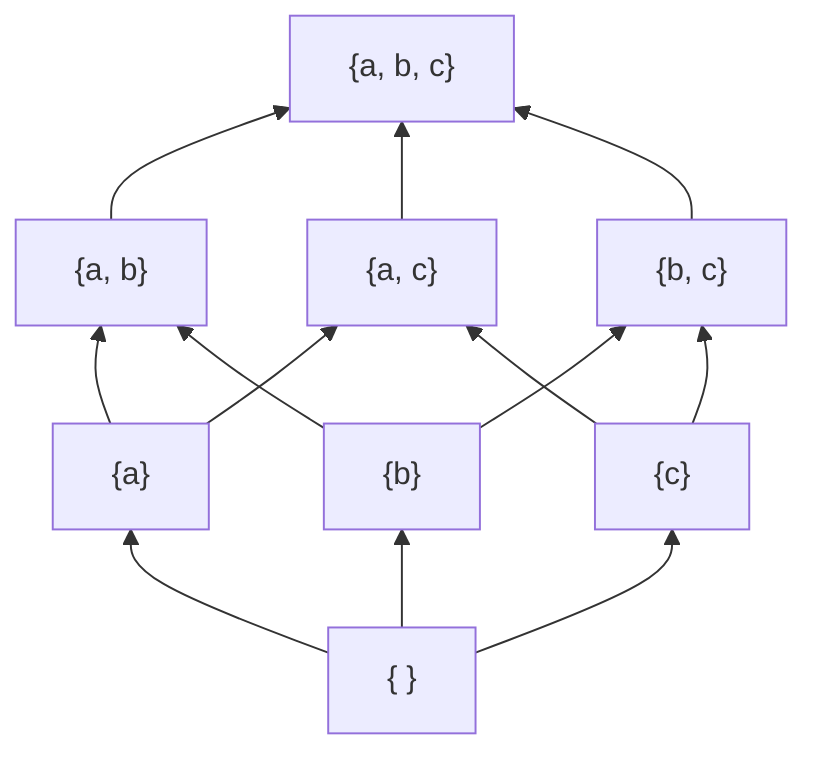
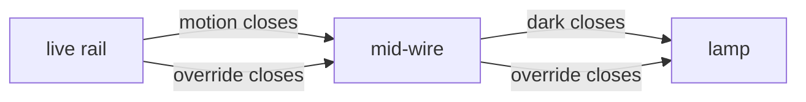

# Boolean algebra: true/false, sets and switches obey the same rules, and the power set drawn as a cube is a lattice

[Syllabus](../../../SYLLABUS.md) → [Algebra](../../../SYLLABUS.md#w03) → [For the Curious](../../../SYLLABUS.md#w03-s10) → Boolean algebra

---

## General Overview

A porch light follows one rule: come on when there is motion and the room is dark, or whenever the override switch is thrown. Three inputs, each a plain yes or no, make eight situations. The light is on in five of them and off in three.

A record filter has the same shape: in both the staff list and the on-shift list, or in the always-allowed list. So does a switch network, where series means both and parallel means either.

One list of laws governs all three. Boolean algebra is that list stripped of subject matter: two operations on pairs, one reversing a single thing, a bottom and a top. The pair take neutral names — **meet** for "and, both, series", **join** for "or, either, parallel".

An order hides underneath. "Is inside" orders sets, but only partly: neither {a, b} nor {b, c} is inside the other. Draw the eight subsets of {a, b, c}, an arrow per added member, and the picture is a cube. The meet of two sets is the highest set below both, the join the lowest above both; an order giving every pair both is a **lattice**.

**Truth values, the subsets of a fixed collection and switch networks obey one list of laws; drawn as an order, a Boolean algebra is a lattice whose operations spread across each other, with an opposite for every element.**

**What kind of fact this is:** a definition — both names stand for lists of laws, and Why it works shows the light rule, the subsets and the switches obeying them.

### The picture: the subsets of {a, b, c}, stacked by what contains what



Eight vertices, twelve upward edges, one added member per edge. An upward path means the lower set is inside the upper. Sets on separate branches have no path: nine of the twenty-eight pairs.

---

## The formula

Write M for "there is motion", D for "the room is dark", O for "the override is on". The rule, then the override multiplied into both halves:

$$L = (M \land D) \lor O = (M \lor O) \land (D \lor O)$$

The wedge is the meet, read "and"; the vee is the join, "or"; the hook is "not".

**Read it aloud:** the light is on when motion and darkness both hold, or the override holds — equally, when motion-or-override and darkness-or-override both hold.

De Morgan's laws turn the reversal of a meet into the join of two reversals, giving the off rule:

$$\neg L = (\neg M \lor \neg D) \land \neg O$$

**Read it aloud:** off when the override is off and motion or darkness is missing.

| Symbol | Plain meaning | In our example | Change it and the answer… |
| --- | --- | --- | --- |
| $M$, $D$, $O$, $L$ | the yes-or-no inputs — motion, dark, override — and the light | MDO = 110, light on | flip one input, read another row |
| $\land$ (also $\cap$) | **meet**: and, intersection, series | both sensors wanted | a requirement only subtracts |
| $\lor$ (also $\cup$) | **join**: or, union, parallel | the override suffices | an alternative only adds |
| $\neg$ | **complement**: not, or outside a set | the off rule | — |
| $0$, $1$ | bottom and top: false and true, empty and whole | override down 0, up 1 | — |
| $U$, $A$, $B$, $\subseteq$ | a universe, two subsets, "is inside" | A = {a, b} inside U = {a, b, c} | — |

### When it holds

- **Each input is settled yes or no.** A warming-up sensor is neither, and three-valued logic is another algebra.
- **The universe is fixed first.** With U = {a, b, c} the complement of {a, b} is {c}; add a letter and that changes.
- **The join is inclusive.** Read as "exactly one", the join darkens row MDO = 111.

---

## Why it works

### Step 0: one yes-or-no question at a time

Membership is a yes-or-no question: a member of U is in A or it is not. A set is an answer sheet, one answer per member. Intersection says yes where both sheets do, union where at least one does, complement flips every answer. So a law checked on single yes-or-no values holds for sets member by member, whatever their size.

### Step 1: the two forms agree, by cases on the override

If O holds, the plain rule holds, and O sits in both brackets of the second form, so both hold and so does their meet. If O fails, each bracket falls back to its other half and both forms become M and D. Two cases exhaust O, so the forms agree everywhere. That is the **distributive law**: a join spread across a meet.

### Step 2: the same rule as switches

Motion and override go in parallel, darkness and override too, the two blocks in series.



Current reaches the lamp only through both stages, and a stage passes it if either switch is closed: series is meet, parallel is join. The code takes this road without the formula. It lays the four wires out, floods the network from the live rail and asks whether the lamp was reached. All eight rows agree.

### Step 3: De Morgan turns the rule inside out

For the light to be off, neither branch may succeed: the override must be off and the motion-and-dark branch must fail. A meet fails as soon as one part fails — no motion, or no darkness. That is the off rule, meet swapped for join. Sets say it too: outside the union of A and B is outside A and outside B.

<details>
<summary>Detailed proof: De Morgan from the laws alone, with no rows to check</summary>

**A complement is unique.** If B and C both complement A, then $B = B \land 1 = B \land (A \lor C) = (B \land A) \lor (B \land C)$, which is $B \land C$ because $B \land A = 0$. Swapping names gives $C = C \land B$: the same element.

**The law.** $(A \lor B) \land (\neg A \land \neg B)$ distributes into halves that each meet an element with its own complement, so it is 0. $(A \lor B) \lor (\neg A \land \neg B)$ distributes into brackets that each join one with its complement, so it is 1. Meeting at the bottom and joining at the top is a complement's job, so by uniqueness $\neg(A \lor B) = \neg A \land \neg B$.

</details>

### Step 4: the subsets of {a, b, c} really are a lattice

The intersection of A and B is inside both, so it is a lower bound; and any set inside both is inside the intersection, which therefore sits above every other lower bound. Greatest lower bound: the meet. Union contains both and sits inside anything containing both: least upper bound, the join.

So every pair has both and the cube is a lattice, empty set at the bottom, {a, b, c} at the top. The meet of A = {a, b} and B = {b, c} is {b}, the join {a, b, c}, though neither contains the other — as with nine of the twenty-eight pairs, which have meets and joins all the same. The code checks intersection against a search for the greatest lower bound, on all sixty-four pairs.

### Step 5: what makes an algebra Boolean

A **lattice** is a partial order where every pair has a meet and a join. A **Boolean algebra** adds a bottom 0, a top 1, distributivity both ways, and for every element a complement meeting it at 0 and joining it at 1. Truth values are the smallest case, a universe's subsets the everyday one. Order the divisors of 12 by which divides which: meet is gcd, join is the smallest common multiple, and 2 and 6 have no opposite.

<details>
<summary>The same algebra written as a ring</summary>

Let multiplication be the meet and addition be "in exactly one of the two" — exclusive or for statements, symmetric difference for sets. Those two make a ring ([Rings](../09-Rings%20and%20Fields/01-rings.md)): addition has a zero, every element is its own negative, multiplication spreads across addition. One identity marks it out: a thing met with itself is unchanged, so x^2 = x. Every Boolean algebra is such a Boolean ring in disguise.

</details>

An alternative route is the truth table. Its eight rows settle this rule and nothing wider. Step 0 and the folded proof widen it.

---

## Worked numbers, by hand

Read the inputs as motion, dark, override: MDO = 110 is motion yes, room dark, override down.

| Step | Arithmetic | Value |
| --- | --- | --- |
| the rule at MDO = 110 | (1 and 1) or 0 | 1 |
| the same row distributed | (1 or 0) and (1 or 0) | 1 |
| the off rule there | (0 or 0) and 1 | 0 |
| all eight rows counted | on, off | **5 on, 3 off** |
| meet, join and complement of {a, b} | against {b, c}, inside U | **{b}, {a, b, c}, {c}** |

The three off rows have the override down and no motion or a lit room.

### What breaks if you drop a piece

| Mistake | Comes out at | What went wrong |
| --- | --- | --- |
| the join read as "exactly one" | 1 row of 8 wrong: MDO = 111 goes dark | both branches at once is still a yes |
| a meet reversed term by term | 2 rows wrong: MDO = 010 and 100 | one failed part fails a meet |
| the override in one bracket | 2 rows wrong: MDO = 001 and 101 | a join spreads over every bracket |
| two sets taken as comparable | 9 of the 28 pairs sit side by side | containment leaves branches unranked |

The code prints all four.

---

## Code, from first principles, and it actually runs

Only `product`, listing the eight rows, is imported. Three roads reach the light: the rule row by row; four ideal switches flooded with current until the lamp is reached or missed; and the whole truth column at once, as a subset of the rows.

### Python

```python
# Boolean algebra -- the check behind the card.  A porch light is on when (motion
# AND dark) OR override.  Road one evaluates that rule row by row; road two closes
# ideal switches and hunts for a live path.  The eight subsets of {a, b, c} are then
# ordered by inclusion, and meet and join are found twice: by search, and by set algebra.
from itertools import product

ROWS = list(product((0, 1), repeat=3))               # motion, dark, override
SUBSETS = [frozenset("abc"[i] for i in range(3) if k >> i & 1) for k in range(8)]
U = frozenset("abc")

def rule(m, d, o): return bool((m and d) or o)       # road one: the rule as written
def off_rule(m, d, o): return ((not m) or (not d)) and (not o)   # the off condition
def bits(flags): return sum(1 << i for i, f in enumerate(flags) if f)
def name(s): return "".join(sorted(s))
def lows(A, B): return [s for s in SUBSETS if s <= A and s <= B]
def ups(A, B): return [s for s in SUBSETS if A <= s and B <= s]
def show(m): return ", ".join("".join(map(str, ROWS[i])) for i in range(8) if m >> i & 1)

def switches(m, d, o):                               # road two: parallel pairs in series
    wires = [(0, 1, m), (0, 1, o), (1, 2, d), (1, 2, o)]
    live = {0}                                       # 0 the live rail, 2 the lamp
    for _ in wires:                                  # spread current along closed wires
        for a, b, closed in wires:
            if closed and a in live: live.add(b)
    return 2 in live

def extreme(cands, upper):     # the one candidate all the others sit below, or above
    hits = [s for s in cands if all((t <= s) if upper else (s <= t) for t in cands)]
    return hits[0] if len(hits) == 1 else None

on, net, off = [rule(*r) for r in ROWS], [switches(*r) for r in ROWS], [off_rule(*r) for r in ROWS]
for r, a, b, c in zip(ROWS, on, net, off):
    print(f"MDO={r[0]}{r[1]}{r[2]}: rule={int(a)} switches={int(b)} off={int(c)}")
print(f"light on in {sum(on)} of the {len(ROWS)} rows, off in {sum(off)}")
mM, mD, mO = [bits([r[k] for r in ROWS]) for k in range(3)]
on_set, off_set = (mM & mD) | mO, ((255 ^ mM) | (255 ^ mD)) & (255 ^ mO)
print(f"on rows from set algebra: {show(on_set)}; off rows from its complement: {show(off_set)}")
meets = [(extreme(lows(A, B), True), A & B) for A in SUBSETS for B in SUBSETS]
joins = [(extreme(ups(A, B), False), A | B) for A in SUBSETS for B in SUBSETS]
edges = sum(1 for A in SUBSETS for B in SUBSETS if A < B and len(B - A) == 1)
pairs = [(A, B) for i, A in enumerate(SUBSETS) for B in SUBSETS[i + 1:]]
comp, incomp = sum(1 for A, B in pairs if A <= B or B <= A), sum(1 for A, B in pairs if not (A <= B or B <= A))
print(f"subset cube of {{a, b, c}}: {len(SUBSETS)} vertices, {edges} upward edges; "
      f"meet and join agree on all {len(meets)} pairs")
print(f"order: {comp} of the {len(pairs)} pairs are comparable, {incomp} are not")
A, B = frozenset("ab"), frozenset("bc")
print(f"A=ab, B=bc: meet by search={name(extreme(lows(A, B), True))}, by intersection="
      f"{name(A & B)}; join by search={name(extreme(ups(A, B), False))}, by union={name(A | B)}")
print(f"complement in U=abc: of A=ab it is {name(U - A)}, of the empty set it is {name(U - frozenset())}")
xor_bad = [bool((m and d) ^ o) != on[i] for i, (m, d, o) in enumerate(ROWS)]
neg_bad = [(((not m) and (not d)) and (not o)) != off[i] for i, (m, d, o) in enumerate(ROWS)]
half_bad = [bool((m or o) and d) != on[i] for i, (m, d, o) in enumerate(ROWS)]
print(f"exclusive-or instead of OR: fails {sum(xor_bad)} of 8 rows, at MDO={show(bits(xor_bad))}")
print(f"NOT(M AND D) as (NOT M) AND (NOT D): fails {sum(neg_bad)} of 8 rows, at MDO={show(bits(neg_bad))}")
print(f"override dropped from the second bracket: fails {sum(half_bad)} of 8 rows, at MDO={show(bits(half_bad))}")
assert net == on and off == [not a for a in on]
assert on_set == bits(on) and off_set == 255 ^ on_set
assert all(s == i for s, i in meets) and all(s == u for s, u in joins) and edges == 3 * 2 ** 2
assert comp == 3 ** 3 - 2 ** 3 and incomp == (4 ** 3 - 2 * 3 ** 3 + 2 ** 3) // 2 and [sum(xor_bad), sum(neg_bad), sum(half_bad)] == [1, 2, 2]
print("ALL CHECKS PASS")
```

**Ran 2026-09-14 on macOS, Python 3.14.6, standard library only. All checks passed. Output, pasted from the run:**

```
MDO=000: rule=0 switches=0 off=1
MDO=001: rule=1 switches=1 off=0
MDO=010: rule=0 switches=0 off=1
MDO=011: rule=1 switches=1 off=0
MDO=100: rule=0 switches=0 off=1
MDO=101: rule=1 switches=1 off=0
MDO=110: rule=1 switches=1 off=0
MDO=111: rule=1 switches=1 off=0
light on in 5 of the 8 rows, off in 3
on rows from set algebra: 001, 011, 101, 110, 111; off rows from its complement: 000, 010, 100
subset cube of {a, b, c}: 8 vertices, 12 upward edges; meet and join agree on all 64 pairs
order: 19 of the 28 pairs are comparable, 9 are not
A=ab, B=bc: meet by search=b, by intersection=b; join by search=abc, by union=abc
complement in U=abc: of A=ab it is c, of the empty set it is abc
exclusive-or instead of OR: fails 1 of 8 rows, at MDO=111
NOT(M AND D) as (NOT M) AND (NOT D): fails 2 of 8 rows, at MDO=010, 100
override dropped from the second bracket: fails 2 of 8 rows, at MDO=001, 101
ALL CHECKS PASS
```

### Rust

Same numbers, same labels, built with `rustc --edition 2021 -O`.

```rust
// Boolean algebra -- the same check as the Python, in Rust.  No crates.  A porch
// light is on when (motion AND dark) OR override.  Road one evaluates that rule row by
// row; road two closes ideal switches and hunts for a live path.  The eight subsets of
// {a, b, c} are then ordered by inclusion, and meet and join are found twice: by
// searching the order, and by set algebra on three-bit masks.
fn rule(m: u32, d: u32, o: u32) -> bool { (m == 1 && d == 1) || o == 1 }
fn off_rule(m: u32, d: u32, o: u32) -> bool { (m == 0 || d == 0) && o == 0 }
fn sub(a: u32, b: u32) -> bool { a & b == a }        // a is a subset of b
fn name(k: u32) -> String { (0..3).filter(|i| k >> i & 1 == 1).map(|i| (b'a' + i as u8) as char).collect() }

fn switches(m: u32, d: u32, o: u32) -> bool {        // road two: parallel pairs in series
    let wires = [(0usize, 1usize, m), (0, 1, o), (1, 2, d), (1, 2, o)];
    let mut live = [true, false, false];             // 0 the live rail, 2 the lamp
    for _ in 0..wires.len() {                        // spread current along closed wires
        for &(a, b, closed) in wires.iter() { if closed == 1 && live[a] { live[b] = true; } }
    }
    live[2]
}

fn extreme(cands: &[u32], upper: bool) -> u32 {   // the one all the others sit below, or above
    let hits: Vec<u32> = cands.iter().cloned()
        .filter(|&s| cands.iter().all(|&t| if upper { sub(t, s) } else { sub(s, t) })).collect();
    if hits.len() == 1 { hits[0] } else { 99 }
}

fn main() {
    let mut rows: Vec<(u32, u32, u32)> = Vec::new();
    for m in 0..2 { for d in 0..2 { for o in 0..2 { rows.push((m, d, o)); } } }
    let show = |k: u32| -> String { (0..rows.len()).filter(|i| k >> i & 1 == 1)
        .map(|i| format!("{}{}{}", rows[i].0, rows[i].1, rows[i].2)).collect::<Vec<String>>().join(", ") };
    let bits = |f: &[bool]| -> u32 { let mut b = 0; for i in 0..f.len() { if f[i] { b |= 1 << i; } } b };
    let on: Vec<bool> = rows.iter().map(|&(m, d, o)| rule(m, d, o)).collect();
    let net: Vec<bool> = rows.iter().map(|&(m, d, o)| switches(m, d, o)).collect();
    let off: Vec<bool> = rows.iter().map(|&(m, d, o)| off_rule(m, d, o)).collect();
    for i in 0..rows.len() { println!("MDO={}{}{}: rule={} switches={} off={}", rows[i].0,
        rows[i].1, rows[i].2, on[i] as u8, net[i] as u8, off[i] as u8); }
    let (n_on, n_off) = (on.iter().filter(|&&v| v).count(), off.iter().filter(|&&v| v).count());
    println!("light on in {} of the {} rows, off in {}", n_on, rows.len(), n_off);
    let cols: Vec<Vec<bool>> = (0..3).map(|k| rows.iter().map(|&(m, d, o)| [m, d, o][k] == 1).collect()).collect();
    let (mm, md, mo) = (bits(&cols[0]), bits(&cols[1]), bits(&cols[2]));
    let (on_set, off_set) = ((mm & md) | mo, ((255 ^ mm) | (255 ^ md)) & (255 ^ mo));
    println!("on rows from set algebra: {}; off rows from its complement: {}", show(on_set), show(off_set));
    let subsets: Vec<u32> = (0..8).collect();
    let lows = |a: u32, b: u32| -> Vec<u32> { subsets.iter().cloned().filter(|&s| sub(s, a) && sub(s, b)).collect() };
    let ups = |a: u32, b: u32| -> Vec<u32> { subsets.iter().cloned().filter(|&s| sub(a, s) && sub(b, s)).collect() };
    let (mut meets_ok, mut joins_ok, mut all_pairs) = (true, true, 0);
    for &a in &subsets { for &b in &subsets {
        all_pairs += 1;
        if extreme(&lows(a, b), true) != (a & b) { meets_ok = false; }
        if extreme(&ups(a, b), false) != (a | b) { joins_ok = false; }
    } }
    let mut edges = 0;
    for &a in &subsets { for &b in &subsets { if a != b && sub(a, b) && (b ^ a).count_ones() == 1 { edges += 1; } } }
    let (mut comp, mut incomp, mut pairs) = (0, 0, 0);
    for i in 0..8 { for j in (i + 1)..8 {
        pairs += 1;
        if sub(subsets[i], subsets[j]) || sub(subsets[j], subsets[i]) { comp += 1 } else { incomp += 1 }
    } }
    println!("subset cube of {{a, b, c}}: {} vertices, {} upward edges; meet and join agree on all {} pairs",
             subsets.len(), edges, all_pairs);
    println!("order: {} of the {} pairs are comparable, {} are not", comp, pairs, incomp);
    let (a, b) = (3u32, 6u32);                       // {a, b} and {b, c}
    println!("A=ab, B=bc: meet by search={}, by intersection={}; join by search={}, by union={}",
             name(extreme(&lows(a, b), true)), name(a & b), name(extreme(&ups(a, b), false)), name(a | b));
    println!("complement in U=abc: of A=ab it is {}, of the empty set it is {}", name(7 ^ a), name(7 ^ 0));
    let xor_bad: Vec<bool> = rows.iter().enumerate().map(|(i, &(m, d, o))| (((m & d) ^ o) == 1) != on[i]).collect();
    let neg_bad: Vec<bool> = rows.iter().enumerate().map(|(i, &(m, d, o))| ((m == 0 && d == 0) && o == 0) != off[i]).collect();
    let half_bad: Vec<bool> = rows.iter().enumerate().map(|(i, &(m, d, o))| ((m == 1 || o == 1) && d == 1) != on[i]).collect();
    let cnt = |f: &[bool]| f.iter().filter(|&&x| x).count();
    println!("exclusive-or instead of OR: fails {} of 8 rows, at MDO={}", cnt(&xor_bad), show(bits(&xor_bad)));
    println!("NOT(M AND D) as (NOT M) AND (NOT D): fails {} of 8 rows, at MDO={}", cnt(&neg_bad), show(bits(&neg_bad)));
    println!("override dropped from the second bracket: fails {} of 8 rows, at MDO={}", cnt(&half_bad), show(bits(&half_bad)));
    assert!(net == on && off == on.iter().map(|&v| !v).collect::<Vec<bool>>());
    assert!(on_set == bits(&on) && off_set == 255 ^ on_set);
    assert!(meets_ok && joins_ok && edges == 3 * 2i32.pow(2));
    assert!(comp == 3i32.pow(3) - 2i32.pow(3) && incomp == (4i32.pow(3) - 2 * 3i32.pow(3) + 2i32.pow(3)) / 2 && [cnt(&xor_bad), cnt(&neg_bad), cnt(&half_bad)] == [1, 2, 2]);
    println!("ALL CHECKS PASS");
}
```

**Ran 2026-09-14 on macOS, rustc 1.98.1, no crates. All checks passed. Output, pasted from the run:**

```
MDO=000: rule=0 switches=0 off=1
MDO=001: rule=1 switches=1 off=0
MDO=010: rule=0 switches=0 off=1
MDO=011: rule=1 switches=1 off=0
MDO=100: rule=0 switches=0 off=1
MDO=101: rule=1 switches=1 off=0
MDO=110: rule=1 switches=1 off=0
MDO=111: rule=1 switches=1 off=0
light on in 5 of the 8 rows, off in 3
on rows from set algebra: 001, 011, 101, 110, 111; off rows from its complement: 000, 010, 100
subset cube of {a, b, c}: 8 vertices, 12 upward edges; meet and join agree on all 64 pairs
order: 19 of the 28 pairs are comparable, 9 are not
A=ab, B=bc: meet by search=b, by intersection=b; join by search=abc, by union=abc
complement in U=abc: of A=ab it is c, of the empty set it is abc
exclusive-or instead of OR: fails 1 of 8 rows, at MDO=111
NOT(M AND D) as (NOT M) AND (NOT D): fails 2 of 8 rows, at MDO=010, 100
override dropped from the second bracket: fails 2 of 8 rows, at MDO=001, 101
ALL CHECKS PASS
```

The two outputs match line for line.

> [!TIP]
> **Try changing**
> Guess first, then run it. An assert stops the program when a number is wrong.
> - **Take the override off the first stage.** Delete the wire `(0, 1, o)`. Which rows lose their path? Rows 001 and 011, where the switch column stops matching the rule.
> - **Read the join as exclusive.** In `rule`, write `(m and d) ^ o`. Row 111 prints rule=0 while the switches print 1.
> - **Hunt for the wrong bound.** In `extreme`, swap the comparisons to keep the least lower bound. Every meet returns the empty set.

---

## The usual mistake

> [!warning]
> **Reading "or" as one or the other but not both.** The join is inclusive. With motion, darkness and the override all on — row MDO = 111 — the light is on, and the exclusive reading darkens it: 1 row of 8 wrong.
>
> - **Reversing a meet term by term.** "Not (motion and dark)" is not "no motion and no dark": 2 rows wrong, MDO = 010 and 100.
> - **Multiplying an "or" into one bracket.** Dropped from the second, the override stops working alone: 2 rows wrong.
> - **Taking a lattice for a ranking.** Neither {a, b} nor {b, c} is inside the other, as with 9 of the 28 pairs.
> - **Calling every lattice Boolean.** Distributivity and complements are the scarce half.

---

## Where you meet it in real life

- **Home automation.** A rule engine takes this condition as written; the distributed form shows the override in every branch.
- **Digital circuits.** Series and parallel switches were Shannon's point in 1938: a network is an expression, so shortening it removes gates.
- **The rest of this shelf**: [The fundamental theorem of algebra](01-fundamental-theorem-of-algebra.md), [Why there is no quintic formula](02-why-no-quintic-formula.md), [Gaussian integers](03-gaussian-integers-and-sums-of-two-squares.md), [Pell's equation](04-pell-equation-and-root-two.md).

> **Say it back**
> A light rule, a list filter and a switch network obey one list of laws: a meet (and, intersection, series), a join (or, union, parallel), and a complement that swaps them. The light is off when the override is off and motion or darkness is missing. The eight subsets of {a, b, c} draw a cube where meet is intersection and join is union; nine of the twenty-eight pairs have no order between them. A lattice needs meets and joins; Boolean adds a bottom, a top, distributivity and complements.

---

## What this builds on

- [Logical equivalence and De Morgan](../../01-Foundations/05-Logic/03-logical-equivalence-and-de-morgan.md): the two-value laws and the swap.
- [Set operations](../../01-Foundations/07-Sets/03-set-operations.md): intersection, union and complement — meet, join and reversal in set clothes.
- [Orders](../../01-Foundations/08-Relations%20and%20Functions/07-partial-and-total-orders.md): partial orders, and incomparable pairs.
- [Rings](../09-Rings%20and%20Fields/01-rings.md): plus and times as a list of laws, the pattern followed here.

## Where this goes next

- Cook-Levin: whether some row of a formula comes out true — one question standing in for every problem with quickly checked answers.
- Boolean circuits: the gates a network needs, a formula as cost rather than truth.

Eight rows can be read by hand. The laws say nothing about the cost of finding whether some row of a large rule comes out true — a later card's question.

---

## Sources

Verified 14 Sep 2026: every link below resolves to the publisher's page.

- Shannon, Claude E. "A Symbolic Analysis of Relay and Switching Circuits." *Transactions of the American Institute of Electrical Engineers* 57 (1938): 713–723. [doi:10.1109/T-AIEE.1938.5057767](https://doi.org/10.1109/T-AIEE.1938.5057767). Switching networks as algebra.
- Boole, George. *An Investigation of the Laws of Thought*. 1854; Cambridge Library Collection reissue. [doi:10.1017/CBO9780511693090](https://doi.org/10.1017/CBO9780511693090). Where the laws became algebra.
- Davey, B. A., and H. A. Priestley. *Introduction to Lattices and Order*. 2nd ed. Cambridge University Press, 2002. [doi:10.1017/CBO9780511809088](https://doi.org/10.1017/CBO9780511809088). Lattices, and where one turns Boolean.
