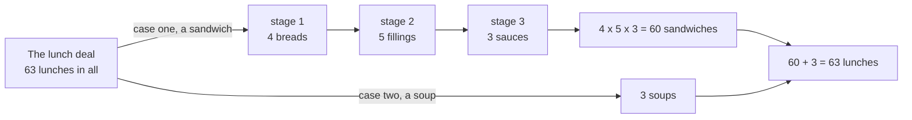

# The rules of sum and product: add the options when they cannot overlap, multiply when they come in stages

[Syllabus](../../../SYLLABUS.md) → [Combinatorics and graphs](../README.md) → [Counting Principles](../README.md#s01) → The rules of sum and product

---

## General Overview

A cafe board offers a lunch deal. Build a sandwich: one of 4 breads, one of 5 fillings, one of 3 sauces. Or skip the sandwich and take one of 3 soups.

How many lunches does the board describe? Writing them out works, and it is slow. The answer is 63, and no list is needed.

Inside the sandwich the picks come in stages, and no pick spoils the next: every bread still opens all 5 fillings, and every bread-and-filling pair opens all 3 sauces. The stage sizes multiply: 4 × 5 × 3 = 60 sandwiches.

The soup is not a fourth stage but a separate case. A lunch is a sandwich or a soup, never both, so the case counts add: 60 + 3 = 63 lunches.

Multiply across stages, add across cases. Every later formula on this shelf is built from those two moves, and swapping them is the classic error.

**Options that come in stages multiply; options that fall into cases with nothing in common add.**

**What kind of fact this is:** a theorem, proved on this card in Why it works, resting on one definition borrowed from set theory — the set of ordered pairs, written $A \times B$.

### The picture: two cases, three stages



Arrows in a row are stages and multiply; arrows forking from one box are cases and add.

---

## The formula

The notation first, in words. A **set** is a collection of distinct things, written in braces: the breads are {rye, white, sourdough, flat}. Bars count it: $\lvert A\rvert$ is how many members the set $A$ has, read "the size of A". Two sets combine in two ways, both met earlier ([Set operations](../../01-Foundations/07-Sets/03-set-operations.md)): the **union** $A \cup B$ holds everything in either, the **intersection** $A \cap B$ only what is in both. The empty set, $\varnothing$, has no members. And $A \times B$ is the set of **ordered pairs**: a member of $A$, then a member of $B$ ([Ordered pairs and the Cartesian product](../../01-Foundations/07-Sets/05-ordered-pairs-and-cartesian-product.md)).

The rule of product:

$$\lvert A \times B\rvert = \lvert A\rvert \times \lvert B\rvert$$

**Read it aloud:** the number of ways to take one thing from the first set and then one from the second is the first set's size times the second's.

The rule of sum, for two whole cases $A$ and $B$:

$$\lvert A \cup B\rvert = \lvert A\rvert + \lvert B\rvert \quad \text{when } A \cap B = \varnothing$$

**Read it aloud:** when two sets share no member, the count of everything in either is one size plus the other.

Three stages of sizes $n_1$, $n_2$ and $n_3$ give $n_1 \times n_2 \times n_3$ outcomes, here 60; each further stage adds a factor, and each further case another count.

| Symbol | Plain meaning | In our example | Push it up and the answer… |
| --- | --- | --- | --- |
| $A$ | one stage's options, or one case | the 4 breads; the 60 sandwiches | rises in proportion |
| $B$ | the next stage's options, or the other case | the 5 fillings; the 3 soups | rises in proportion |
| $\lvert A\rvert$ | a set's size: its member count | 4, for the breads | — |
| $A \times B$ | the ordered pairs, one pick from each | the 20 bread-and-filling pairs | — |
| $A \cup B$ | the union: everything in either | the 63 lunches | — |
| $A \cap B$ | the intersection: what is in both | empty: no lunch is sandwich and soup | any shared member and the sum over-counts |
| $\varnothing$ | the empty set, no members | what the two cases share | — |
| $n_1$, $n_2$, $n_3$ | the stage sizes, in order | 4, 5 and 3 | the count grows by that factor |

### When it holds

- **Every stage offers the same number of options, whatever came before.** Each of the 4 breads opens the same 5 fillings. Where that number varies with the earlier pick, count the branches one at a time and add.
- **A stage that shrinks equally on every branch still multiplies.** Each of 20 captains leaves the same 19 vice-captains: 20 × 19 = 380.
- **Cases must share nothing.** Rye sandwiches number 15 and chilli 20, but 5 are both, so adding gives 35 where the truth is 30; overlaps need a correction ([Inclusion-exclusion](../../01-Foundations/07-Sets/04-inclusion-exclusion.md)).
- **Cases must cover everything, and name each outcome once.** Drop the soups and the count is 60, not 63; print "no sauce" on two lines and every sauceless sandwich is counted twice.

---

## Why it works

### Step 0: count the labels, not the things

A finished sandwich is three names: bread, filling, sauce. Every sandwich has one such triple, and every triple one sandwich. A matching with nothing left over on either side means the collections are the same size, so counting sandwiches becomes counting triples — the move behind every rule here.

### Step 1: two stages make a rectangle

Breads down the side, fillings across the top. Each cell is one pair. Count a row at a time.

| Breads so far | Pairs added | Pairs so far |
| --- | --- | --- |
| rye | rye with each of 5 fillings | 5 |
| and white | 5 more | 10 |
| and sourdough | 5 more | 15 |
| and flat | 5 more | 20 |

Four rows of five, no cell reached twice. Adding five four times is what 4 × 5 means ([Multiplying and dividing](../../01-Foundations/01-Everyday%20Arithmetic/03-multiplying-and-dividing.md)), so the pairs number 20: the rule of product with two stages, and the rectangle is $A \times B$ drawn out.

### Step 2: each further stage repeats the whole count

Each of the 20 pairs opens the same 3 sauces: 20 blocks of 3, so 60 sandwiches. The rectangle again, pairs down the side and sauces across.

The argument never said what the stages were. A further stage of size $n_3$ makes that many copies of whatever is built so far, multiplying the running count by $n_3$: start at 4, multiply by 5, multiply by 3.

<details>
<summary>Detailed proof: any number of stages, by induction</summary>

**Claim.** For stages of sizes $n_1$, $n_2$ and so on, where a stage's options number the same whatever was picked before, the completed choices number $n_1 \times n_2 \times \cdots$.

**One stage.** The choices are the options themselves: $n_1$ of them.

**One more stage.** Say the stages so far give the product of their sizes; call that set of part-built choices $A$, and let $B$ hold the next stage's options. A longer choice is the ordered pair (part-built choice, option), so the longer choices are exactly $A \times B$: a rectangle of $\lvert A\rvert$ rows holding $\lvert B\rvert$ pairs each, every pair in one row only. Adding equal rows is multiplying, so the count picks up one factor, $\lvert B\rvert$. The equal-option condition is used just here: it keeps the same $B$ in every row.

So the count gains exactly one factor per stage, and after the last stage it is the product of them all.

</details>

### Step 3: separate cases add

The 60 sandwiches and 3 soups have nothing in common, so walking the first list then the second names every lunch once: 60 + 3 = 63.

The condition does real work. The 15 rye sandwiches and 20 chilli sandwiches overlap in the 5 that are both, so 15 + 20 = 35 counts those 5 twice; "rye or chilli" is 30.

### Step 4: a shrinking stage, counted branch by branch

Naming a captain and then a vice-captain from a 20-player squad is not the lunch deal: the second stage cannot re-use the first pick. Take it a branch at a time. Shirt 1 as captain leaves 19 candidates, and so does every other shirt: twenty branches of 19, which add to 20 × 19 = 380.

So the product rule is branch-counting with equal branches, which is why it survives a stage that shrinks equally. Picks that keep shrinking make a formula of their own ([Ordered picks](04-ordered-picks.md)). A third route runs backwards, counting everything and taking away what does not qualify ([Counting the complement](06-complementary-counting.md)).

---

## Worked numbers, by hand

| Step | Arithmetic | Value |
| --- | --- | --- |
| breads and fillings | 4 rows of 5: 5, 10, 15, 20 | 20 pairs |
| add the sauces | 20 × 3 | **60 sandwiches** |
| the other case | the soups, counted straight off | 3 |
| the whole board | 60 + 3 | **63 lunches** |
| the squad's captain | any of the 20 | 20 |
| its vice-captain | 19 left on each branch | 19 |
| the pair, in order | 20 × 19 | **380 ways** |

Sixty-three is the whole choice on the board; 380 is how many captain-and-vice-captain pairs the squad allows.

### What breaks if you drop a piece

| Mistake | Comes out at | What went wrong |
| --- | --- | --- |
| Stage sizes added | 4 + 5 + 3 = 12 | Stages multiply; 12 is fewer than the 15 rye sandwiches alone |
| The two cases multiplied | 60 × 3 = 180 | That counts a sandwich *and* a soup, not on offer |
| Vice-captain drawn from all 20 | 20 × 20 = 400 | The 20 branches naming one player twice do not exist |
| Overlapping groups added | 15 + 20 = 35 | Rye and chilli share 5, counted twice; the truth is 30 |

The code prints all four.

---

## Code, from first principles, and it actually runs

Nothing is imported. Every count is reached twice. Road one multiplies or adds the stage sizes. Road two builds every lunch one pick at a time, counts the finished list, multiplying nothing, and checks no lunch was built twice. The captain-and-vice-captain count runs both ways too, and the rye and chilli groups show what the sum rule refuses.

### Python

```python
# The rules of sum and product -- the check behind the card.  Nothing is
# imported.  The lunch deal: 4 breads x 5 fillings x 3 sauces, or one of 3
# soups instead.  Every count is reached twice: once from the stage sizes,
# multiplied or added, and once by building every lunch and counting them one
# at a time, a road that never multiplies or adds a stage size at all.
BREADS = ["rye", "white", "sourdough", "flat"]
FILLINGS = ["cheese", "ham", "tuna", "falafel", "egg"]
SAUCES = ["chilli", "mustard", "none"]
SOUPS = ["tomato", "lentil", "pea"]
SQUAD = list(range(1, 21))                   # the squad's 20 shirt numbers

def build(stages):                           # road two: pile the rows up, one pick at a time
    rows = [()]
    for stage in stages:
        rows = [row + (pick,) for row in rows for pick in stage]
    return rows

def yn(claim):
    return "yes" if claim else "no"

pairs = build([BREADS, FILLINGS])
running = [sum(1 for p in pairs if p[0] in BREADS[:k + 1]) for k in range(len(BREADS))]
sandwiches = build([BREADS, FILLINGS, SAUCES])
by_stages = len(BREADS) * len(FILLINGS) * len(SAUCES)            # road one
lunches = [("sandwich",) + s for s in sandwiches] + [("soup", s) for s in SOUPS]
by_cases = by_stages + len(SOUPS)
leaders = [(c, v) for c in SQUAD for v in SQUAD if v != c]       # captain, then vice-captain
by_shrinking = len(SQUAD) * (len(SQUAD) - 1)
rye = [s for s in sandwiches if s[0] == "rye"]
chilli = [s for s in sandwiches if s[2] == "chilli"]
both = [s for s in rye if s in chilli]
either = [s for s in sandwiches if s in rye or s in chilli]

print(f"stage sizes: {len(BREADS)} breads, {len(FILLINGS)} fillings, {len(SAUCES)} sauces;"
      f" and {len(SOUPS)} soups in the other case")
print(f"bread-and-filling pairs, counted one bread at a time: {running}")
print(f"sandwiches, stage sizes multiplied: {len(BREADS)} x {len(FILLINGS)} x {len(SAUCES)} = {by_stages}")
print(f"sandwiches, every one built and counted: {len(sandwiches)}; no two alike: "
      f"{yn(len(set(sandwiches)) == len(sandwiches))}")
print(f"first built and last: {' + '.join(sandwiches[0])} and {' + '.join(sandwiches[-1])}")
print(f"lunches, the two cases added: {by_stages} + {len(SOUPS)} = {by_cases}")
print(f"lunches, every one built and counted: {len(lunches)}; no lunch counted twice: "
      f"{yn(len(set(lunches)) == len(lunches))}")
print(f"captain then vice-captain, stage sizes multiplied: {len(SQUAD)} x {len(SQUAD) - 1} = {by_shrinking}")
print(f"the same, every ordered pair of two different players listed: {len(leaders)}")
print(f"rye sandwiches {len(rye)}, chilli sandwiches {len(chilli)}, both {len(both)}, either {len(either)}")
print(f"mistake 1, stage sizes added: {len(BREADS)} + {len(FILLINGS)} + {len(SAUCES)} = "
      f"{len(BREADS) + len(FILLINGS) + len(SAUCES)}, not {by_stages}")
print(f"mistake 2, the two cases multiplied: {by_stages} x {len(SOUPS)} = {by_stages * len(SOUPS)}, not {by_cases}")
print(f"mistake 3, the vice-captain drawn from all {len(SQUAD)}: {len(SQUAD)} x {len(SQUAD)} = "
      f"{len(SQUAD) * len(SQUAD)}, not {by_shrinking}")
print(f"mistake 4, overlapping groups added: {len(rye)} + {len(chilli)} = {len(rye) + len(chilli)}, not {len(either)}")
assert len(sandwiches) == by_stages and len(set(sandwiches)) == by_stages
assert len(lunches) == by_cases and len(set(lunches)) == len(sandwiches) + len(SOUPS)
assert len(leaders) == by_shrinking and len({c for c, v in leaders}) == len(SQUAD)
assert len(either) == len(rye) + len(chilli) - len(both) and len(both) == len(FILLINGS)
print("ALL CHECKS PASS")
```

**Ran 2026-09-14 on macOS, Python 3.14.6, standard library only. All checks passed. Output, pasted from the run:**

```
stage sizes: 4 breads, 5 fillings, 3 sauces; and 3 soups in the other case
bread-and-filling pairs, counted one bread at a time: [5, 10, 15, 20]
sandwiches, stage sizes multiplied: 4 x 5 x 3 = 60
sandwiches, every one built and counted: 60; no two alike: yes
first built and last: rye + cheese + chilli and flat + egg + none
lunches, the two cases added: 60 + 3 = 63
lunches, every one built and counted: 63; no lunch counted twice: yes
captain then vice-captain, stage sizes multiplied: 20 x 19 = 380
the same, every ordered pair of two different players listed: 380
rye sandwiches 15, chilli sandwiches 20, both 5, either 30
mistake 1, stage sizes added: 4 + 5 + 3 = 12, not 60
mistake 2, the two cases multiplied: 60 x 3 = 180, not 63
mistake 3, the vice-captain drawn from all 20: 20 x 20 = 400, not 380
mistake 4, overlapping groups added: 15 + 20 = 35, not 30
ALL CHECKS PASS
```

### Rust

Same numbers, same labels, built with `rustc --edition 2021 -O`.

```rust
// The rules of sum and product -- the same check as the Python, in Rust.  No
// crates.  The lunch deal: 4 breads x 5 fillings x 3 sauces, or one of 3 soups
// instead.  Every count is reached twice: once from the stage sizes, multiplied
// or added, and once by building every lunch and counting them one at a time, a
// road that never multiplies or adds a stage size at all.
fn build<'a>(stages: &[&[&'a str]]) -> Vec<Vec<&'a str>> {   // road two: pile the rows up
    let mut rows: Vec<Vec<&str>> = vec![Vec::new()];
    for stage in stages {
        let mut next: Vec<Vec<&str>> = Vec::new();
        for row in &rows {
            for pick in stage.iter() { let mut r = row.clone(); r.push(pick); next.push(r) }
        }
        rows = next;
    }
    rows
}
fn distinct(rows: &[Vec<&str>]) -> usize {                   // rows unlike every earlier row
    let mut seen: Vec<&Vec<&str>> = Vec::new();
    for r in rows { if !seen.contains(&r) { seen.push(r) } }
    seen.len()
}
fn yn(claim: bool) -> &'static str { if claim { "yes" } else { "no" } }
fn main() {
    let breads: &[&str] = &["rye", "white", "sourdough", "flat"];
    let fillings: &[&str] = &["cheese", "ham", "tuna", "falafel", "egg"];
    let sauces: &[&str] = &["chilli", "mustard", "none"];
    let soups: &[&str] = &["tomato", "lentil", "pea"];
    let squad: Vec<i64> = (1..=20).collect();                // the squad's 20 shirt numbers
    let pairs = build(&[breads, fillings]);
    let running: Vec<usize> = (0..breads.len())
        .map(|k| pairs.iter().filter(|p| breads[..=k].contains(&p[0])).count())
        .collect();
    let sandwiches = build(&[breads, fillings, sauces]);
    let by_stages = breads.len() * fillings.len() * sauces.len();     // road one
    let mut lunches: Vec<Vec<&str>> = sandwiches
        .iter().map(|s| { let mut r = vec!["sandwich"]; r.extend(s); r }).collect();
    for s in soups { lunches.push(vec!["soup", s]) }
    let by_cases = by_stages + soups.len();
    let mut leaders: Vec<(i64, i64)> = Vec::new();           // captain, then vice-captain
    for &c in &squad { for &v in &squad { if v != c { leaders.push((c, v)) } } }
    let by_shrinking = squad.len() * (squad.len() - 1);
    let rye = sandwiches.iter().filter(|s| s[0] == "rye").count();
    let chilli = sandwiches.iter().filter(|s| s[2] == "chilli").count();
    let both = sandwiches.iter().filter(|s| s[0] == "rye" && s[2] == "chilli").count();
    let either = sandwiches.iter().filter(|s| s[0] == "rye" || s[2] == "chilli").count();
    let mut captains: Vec<i64> = leaders.iter().map(|&(c, _)| c).collect();
    captains.dedup();
    println!("stage sizes: {} breads, {} fillings, {} sauces; and {} soups in the other case",
             breads.len(), fillings.len(), sauces.len(), soups.len());
    println!("bread-and-filling pairs, counted one bread at a time: {:?}", running);
    println!("sandwiches, stage sizes multiplied: {} x {} x {} = {}",
             breads.len(), fillings.len(), sauces.len(), by_stages);
    println!("sandwiches, every one built and counted: {}; no two alike: {}",
             sandwiches.len(), yn(distinct(&sandwiches) == sandwiches.len()));
    println!("first built and last: {} and {}",
             sandwiches[0].join(" + "), sandwiches[sandwiches.len() - 1].join(" + "));
    println!("lunches, the two cases added: {} + {} = {}", by_stages, soups.len(), by_cases);
    println!("lunches, every one built and counted: {}; no lunch counted twice: {}",
             lunches.len(), yn(distinct(&lunches) == lunches.len()));
    println!("captain then vice-captain, stage sizes multiplied: {} x {} = {}",
             squad.len(), squad.len() - 1, by_shrinking);
    println!("the same, every ordered pair of two different players listed: {}", leaders.len());
    println!("rye sandwiches {}, chilli sandwiches {}, both {}, either {}", rye, chilli, both, either);
    println!("mistake 1, stage sizes added: {} + {} + {} = {}, not {}", breads.len(), fillings.len(),
             sauces.len(), breads.len() + fillings.len() + sauces.len(), by_stages);
    println!("mistake 2, the two cases multiplied: {} x {} = {}, not {}",
             by_stages, soups.len(), by_stages * soups.len(), by_cases);
    println!("mistake 3, the vice-captain drawn from all {}: {} x {} = {}, not {}",
             squad.len(), squad.len(), squad.len(), squad.len() * squad.len(), by_shrinking);
    println!("mistake 4, overlapping groups added: {} + {} = {}, not {}", rye, chilli, rye + chilli, either);
    assert!(sandwiches.len() == by_stages && distinct(&sandwiches) == by_stages);
    assert!(lunches.len() == by_cases && distinct(&lunches) == sandwiches.len() + soups.len());
    assert!(leaders.len() == by_shrinking && captains.len() == squad.len());
    assert!(either == rye + chilli - both && both == fillings.len());
    println!("ALL CHECKS PASS");
}
```

**Ran 2026-09-14 on macOS, rustc 1.98.1, no crates. All checks passed. Output, pasted from the run:**

```
stage sizes: 4 breads, 5 fillings, 3 sauces; and 3 soups in the other case
bread-and-filling pairs, counted one bread at a time: [5, 10, 15, 20]
sandwiches, stage sizes multiplied: 4 x 5 x 3 = 60
sandwiches, every one built and counted: 60; no two alike: yes
first built and last: rye + cheese + chilli and flat + egg + none
lunches, the two cases added: 60 + 3 = 63
lunches, every one built and counted: 63; no lunch counted twice: yes
captain then vice-captain, stage sizes multiplied: 20 x 19 = 380
the same, every ordered pair of two different players listed: 380
rye sandwiches 15, chilli sandwiches 20, both 5, either 30
mistake 1, stage sizes added: 4 + 5 + 3 = 12, not 60
mistake 2, the two cases multiplied: 60 x 3 = 180, not 63
mistake 3, the vice-captain drawn from all 20: 20 x 20 = 400, not 380
mistake 4, overlapping groups added: 15 + 20 = 35, not 30
ALL CHECKS PASS
```

The two outputs match line for line.

> [!TIP]
> **Try changing**
> Guess first, then run it. The first keeps both roads in step; the others break one road, and the run stops.
> - **A fourth sauce, then a fourth soup.** Add `"garlic"` to `SAUCES`: 80 sandwiches and 83 lunches, because a stage multiplies. Add `"squash"` to `SOUPS` instead: still 60 sandwiches, but 64 lunches, because a case adds. Both roads move together, so the asserts pass.
> - **Let the vice-captain be the captain.** Drop the `if v != c` test from `leaders`: the listing climbs to 400 while the multiplied road stays at 380, and the third assert stops the run.
> - **A repeated option.** Add a second `"none"` to `SAUCES`: 80 rows built, 60 different, and the first assert stops the run.

---

## The usual mistake

> [!warning]
> **Reading "and" as a case and "or" as a stage.** The board says bread *and* filling *and* sauce, then sandwich *or* soup. Stages joined by "and" multiply; cases joined by "or" add. Swap them and 60 becomes 12, 63 becomes 180.
>
> - **Adding overlapping groups.** 15 rye plus 20 chilli is 35, not 30: the 5 that are both get counted twice.
> - **Keeping the stage size when the stage shrinks.** 20 × 20 = 400 names a captain who is also vice-captain; the count is 380.
> - **Forgetting a case, or counting one outcome twice.** Sandwiches alone give 60, missing the soups; "no sauce" on two menu lines counts every sauceless sandwich twice.

---

## Where you meet it in real life

- **Passwords and keys.** Each character is a stage and the stage size is the alphabet, so length multiplies the count rather than adding to it — which is why one more character beats one more rule ([Strings with repetition](02-strings-and-powers.md)).
- **Number plates, postcodes, bar codes.** A format is a list of stages: so many letters, so many digits. The stage sizes multiplied say how many it can issue before it runs out.
- **Configurators and test plans.** Colours, trims and engines are stages, and so are a program's settings: multiply the list lengths for the orderable cars, or the tests to run.

> **Say it back**
> A choice made in stages, each offering the same options whatever came before, is counted by multiplying the stage sizes: 4 breads, 5 fillings and 3 sauces make 60 sandwiches. A choice that splits into cases with nothing in common is counted by adding: 60 sandwiches and 3 soups make 63 lunches. Adding across stages, or multiplying across cases, is the usual slip. A stage that shrinks equally still multiplies: captain then vice-captain from 20 players is 380.

---

## What this builds on

- [Multiplying and dividing](../../01-Foundations/01-Everyday%20Arithmetic/03-multiplying-and-dividing.md): multiplication as equal groups added — Step 1's rectangle.
- [Set operations](../../01-Foundations/07-Sets/03-set-operations.md): union, intersection, and two sets sharing nothing.
- [Ordered pairs and the Cartesian product](../../01-Foundations/07-Sets/05-ordered-pairs-and-cartesian-product.md): the ordered pairs whose size the product rule computes.

## Where this goes next

- [Strings with repetition](02-strings-and-powers.md): every stage the same size, turning the product into a power.
- [Factorials](03-factorial.md): a stage shrinking by one each time, all the way down.
- [Pigeonhole, extended](../04-Inclusion-Exclusion%20and%20Pigeonhole/05-pigeonhole-extended.md): what these counts force once outcomes outnumber options.
- [Recurrences](../05-Recurrences/01-recurrences-and-fibonacci.md): counts built from smaller counts, the cases being one decision's branches.
- Incompressibility: counting descriptions against things described, to show most have no short one.
- Circuit lower bounds: counting circuits against the functions they must compute.

Here the stages differ in size; when every stage offers the same options, the product becomes a power — [Strings with repetition](02-strings-and-powers.md).

---

## Sources

Verified 14 Sep 2026: every link below resolves to the publisher's page.

- Rosen, Kenneth H. *Discrete Mathematics and Its Applications*, 8th ed. McGraw Hill. [Publisher page](https://www.mheducation.com/highered/product/discrete-mathematics-and-its-applications-rosen.html). "The Basics of Counting" states both rules and their conditions.
- Keller, Mitchel T., and William T. Trotter. *Applied Combinatorics*. [Full text, free](https://appliedcombinatorics.org/appcomb/). Chapter 2 builds both rules from the set operations used here.
- Lehman, Eric, F. Thomson Leighton, and Albert R. Meyer. *Mathematics for Computer Science*. MIT OpenCourseWare 6.042J. [Course page and full text](https://ocw.mit.edu/courses/6-042j-mathematics-for-computer-science-spring-2015/). Counting a collection by matching it to another, the move behind Step 0.
