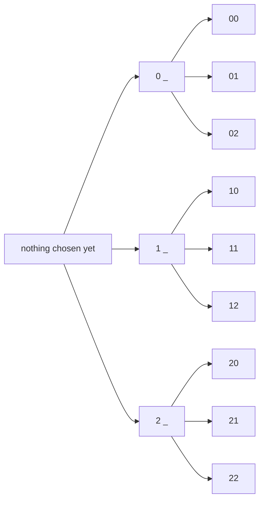

# Strings with repetition: when every position may reuse the options, the count is a power

[Syllabus](../../../SYLLABUS.md) → [Combinatorics and graphs](../../../SYLLABUS.md#w04) → [Counting Principles](../../../SYLLABUS.md#w04-s01) → Strings with repetition

---

## General Overview

A cash machine asks for a four-digit PIN. Each position takes any digit from 0 to 9, and nothing stops a digit turning up twice: 1234 is a PIN, and so is 7777.

Count them by filling the positions one at a time. The first can be any of ten digits. For each of those ten the second can again be any of ten: a hundred two-digit openings, then a thousand, then ten thousand. Ten times ten times ten times ten is 10,000 PINs.

A licence plate shaped as three letters then three digits works the same way: 26 × 26 × 26 × 10 × 10 × 10 = 17,576,000 plates.

Both counts are easy because the choices never interfere: a digit spent at the first position is still on the menu at the second. A run of choices made in order, repeats allowed, is called a **string** — the word from here on, whether the entries are digits, letters, or the words "in" and "out".

The same number multiplied in once per position is exactly what a power is.

**When each of k positions is filled from the same n options and repeats are allowed, the number of strings is n multiplied by itself k times: n^k.**

**What kind of fact this is:** a theorem, proved on this card in Why it works; it is the rule of product ([The rules of sum and product](01-rules-of-sum-and-product.md)) applied once per position.

### The picture: a two-position code over three digits

Shrink the PIN to two positions over the digits 0, 1 and 2. Each path from left to right is one string.



Three branches, then three again from each: 3 × 3 = 9 endings, which are the nine strings. A real PIN is the same tree over ten digits, four levels deep, with 10,000 endings.

---

## The formula

A raised number counts multiplies: 10^4 means four 10s multiplied together ([Exponents](../../01-Foundations/03-Powers%2C%20Roots%20and%20Logarithms/01-exponents-and-powers.md)). The options are the base; the positions say how many multiplies.

$$n^k \;=\; \underbrace{n \times n \times \cdots \times n}_{k \text{ positions}}$$

**Read it aloud:** one factor of n for every position, because every position is decided from the same n options no matter what the other positions did.

| Symbol | Plain meaning | In our example | Push it up and the answer… |
| --- | --- | --- | --- |
| $n$ | how many options one position offers | 10 digits; 26 letters; 2 for in-or-out | climbs steeply: every position gains at once |
| $k$ | how many positions there are to fill | 4 in the PIN, 20 in the squad | each added position multiplies the count by $n$ |
| $n^k$ | the count of strings: $n$ multiplied in $k$ times | 10^4 = 10,000 PINs | — |

### When it holds

- **The same n options at every position.** Where positions differ the count is a product but not a single power: the plate is 26^3 × 10^3 = 17,576,000, not 36^6 = 2,176,782,336.
- **Repeats allowed.** Ban them and each pick uses an option up, so the factors fall: 10 × 9 × 8 × 7 = 5,040 PINs with no digit twice. That count is [Ordered picks](04-ordered-picks.md).
- **The positions carry an identity.** 1234 and 4321 are two strings. Pour the entries into an unlabelled bag and strings differing only by order collapse into one.
- **Every string is allowed.** A bank forbidding 0000 counts something smaller; the ban is subtracted afterwards ([Counting the complement](06-complementary-counting.md)).

---

## Why it works

### Step 0: the choices do not interfere

Spending the digit 7 on the first position does not take it off the menu. Whatever the first three digits were, the fourth still has ten options, so the ways of finishing a string never depend on how it started. That one property is all the count needs.

### Step 1: one position at a time multiplies

The rule of product says a choice made in stages, each stage offering a fixed number of options whatever came before, has as many outcomes as those numbers multiplied together ([The rules of sum and product](01-rules-of-sum-and-product.md)). Every stage here offers the same n.

So the PIN's stages give 10 × 10 = 100, then 1,000, then 10,000.

### Step 2: k positions give k factors

Filling no positions at all can be done exactly one way — write nothing down. So the empty string is one string, and n^0 is 1.

Take the strings one position shorter and stick an entry on the end of each. Every short string yields n long ones, and every long string arises exactly once: chop off its last entry and the short string it grew from is what remains. So each added position multiplies the count by n. Starting at 1 and multiplying by n a total of k times gives n^k.

<details>
<summary>Detailed proof, written out as an induction</summary>

Fix a set of n options and write S(k) for the strings of length k drawn from it.

**Base, k = 0.** There is one way to write nothing, so S(0) has 1 member and n^0 = 1.

**Step.** Suppose S(k−1) has n^(k−1) members. Match each string in S(k) to the pair made of its first k−1 entries and its last entry. One-to-one: two strings with the same front and the same last entry agree entry by entry. Onto: any short string and any option glue into a string of length k, because nothing restricts the last entry — the step that fails the moment repeats are banned. So S(k) has as many members as those pairs, n^(k−1) × n = n^k, and the induction closes. It never asked what the options were, so it holds for digits, letters and the words "in" and "out" alike.

</details>

### Step 3: a string is a function

A function hands each input exactly one output ([Functions](../../01-Foundations/08-Relations%20and%20Functions/02-functions.md)). Take the k positions as the inputs and the n options as the outputs. A string is then a rule giving each position one option, which is a function; and every such function writes out as a string, its output at position 1, then at position 2, and so on.

The two collections are one collection described twice, so counting either counts both. **A set of k members has n^k functions into a set of n members.**

Nothing extra is demanded: two positions may receive the same option, which is repetition, and an option may go unused. Insisting every option be used is a harder count with its own card ([Onto functions](../04-Inclusion-Exclusion%20and%20Pigeonhole/03-counting-surjections.md)).

### Step 4: subsets are strings of yes and no

A 20-player squad must name a travelling party. Each player is in or out, and the ruling on the goalkeeper uses up no ruling on anyone else. Walk the squad in a fixed order and write "in" or "out" for each: a string of length 20 over 2 options. So 2^20 = 1,048,576 possible parties, the empty one and the whole squad included.

That is the count wing 01 reaches for the subsets of a set ([Subsets and the power set](../../01-Foundations/07-Sets/02-subsets-and-power-set.md)): every subset is a yes-or-no string, and every yes-or-no string a subset.

A second road reaches the same total without multiplying. Split the parties by size: nobody, one player, two, out to twenty. Each count is the sum of two from the row above, since a party of a given size either takes the newest player or leaves him behind, so the row is built by addition alone. Totalled for 20 players it lands on 1,048,576. Splitting by size is [Combinations, n choose k](05-n-choose-k.md).

---

## Worked numbers, by hand

| Step | Arithmetic | Value |
| --- | --- | --- |
| one PIN digit | the menu of digits | 10 |
| two digits, then three | 10 × 10, then 100 × 10 | 100, then 1,000 |
| four digits | 1,000 × 10 | **10,000** |
| the plate's letters | 26 × 26 × 26 | 17,576 |
| the plate's digits | 10 × 10 × 10 | 1,000 |
| the whole plate | 17,576 × 1,000 | **17,576,000** |
| the squad's parties | 2 multiplied in 20 times | **1,048,576** |
| the same total, by addition | the row of party counts by size, totalled | **1,048,576** |

Ten thousand PINs is why a cash machine allows three wrong tries and not thirty: three blind guesses are three favourable cases out of 10,000.

### What breaks if you drop a piece

| Mistake | Comes out at | What went wrong |
| --- | --- | --- |
| Adding the options instead of multiplying | 10 + 10 + 10 + 10 = 40 | Stages multiply; only alternatives add |
| Quietly banning repeats | 10 × 9 × 8 × 7 = 5,040 | Counts PINs whose four digits all differ |
| Options and positions swapped | 4^10 = 1,048,576 | The base is the menu, the raised number the slots |
| Plate read as one 36-symbol alphabet | 36^6 = 2,176,782,336 | Counts plates such as A1B2C3, which are never issued |

The code prints all four.

---

## Code, from first principles, and it actually runs

Nothing is imported. Three roads run to the same counts. The first builds every string, a position at a time, and counts the list at each stage: the nine small strings, the 10,000 PINs and the plate's two blocks are counted, not assumed. The second multiplies whole numbers. The third reaches the squad's total by addition alone, building the row of party counts by size and totalling it. Listing all 1,048,576 parties would mean a million strings, so the building and adding roads are tied together at 12 players, where both give 4,096.

### Python

```python
# Strings with repetition -- the check behind the card.  Nothing is imported.
# A 4-digit PIN, a licence plate of 3 letters then 3 digits, and the travelling
# parties from a 20-player squad.  Every count is reached twice: once by
# building every string and counting them, once by a road that lists nothing.
DIGITS, LETTERS = "0123456789", "ABCDEFGHIJKLMNOPQRSTUVWXYZ"

def strings(options, k):            # road one: build every string, a position at a time
    out = [""]
    for _ in range(k):
        out = [s + ch for s in out for ch in options]
    return out

def product(factors):               # multiply whole numbers together, nothing else
    out = 1
    for f in factors:
        out *= f
    return out

def power(n, k): return product([n] * k)                  # road two: n multiplied in k times
def falling(n, k): return product(range(n, n - k, -1))    # no repeats: options used up
def c(n): return f"{n:,}"                                 # separators, as the card quotes them

def triangle_row(n):                # road three: additions only, nothing multiplied
    row = [1]
    for _ in range(n):
        row = [a + b for a, b in zip([0] + row, row + [0])]
    return row

small, pins = strings("012", 2), strings(DIGITS, 4)
stages = [len(strings(DIGITS, k)) for k in range(5)]   # 0 to 4 positions, built each time
plate_letters, plate_digits = strings(LETTERS, 3), strings(DIGITS, 3)
plate = len(plate_letters) * len(plate_digits)
parties = triangle_row(20)
total = sum(parties)
alldiff = sum(1 for s in pins if len(set(s)) == 4)
print(f"small case, 2 positions over the digits 0, 1, 2: 3 x 3 = {len(small)} strings")
print("the nine of them: " + " ".join(small))
print("PIN stages, 0 to 4 positions built: " + ", ".join(c(v) for v in stages))
print(f"PIN: 10 digits, 4 positions -> built {c(len(pins))} strings, 10^4 = {c(power(10, 4))}")
print(f"the first and the last PIN built: {pins[0]} and {pins[-1]}")
print(f"plate letters: built {c(len(plate_letters))}, 26^3 = {c(power(26, 3))}")
print(f"plate digits: built {c(len(plate_digits))}, 10^3 = {c(power(10, 3))}")
print(f"whole plate: {c(len(plate_letters))} x {c(len(plate_digits))} = {c(plate)}")
print(f"squad of 20, each player in or out: 2^20 = {c(power(2, 20))}")
print(f"the same total by adding only, row 20 of the sum triangle: {c(total)}")
print(f"parties by size, the first six entries of that row: {parties[:6]}")
print(f"12-player squad both ways: built {c(len(strings('io', 12)))} strings, "
      f"row 12 totals {c(sum(triangle_row(12)))}")
print(f"a byte, 8 positions over 2 options: 2^8 = {c(power(2, 8))}")
print(f"mistake 1, adding the options: 10 + 10 + 10 + 10 = {10 * 4}, not {c(len(pins))}")
print(f"mistake 2, no digit reused: 10 x 9 x 8 x 7 = {c(falling(10, 4))}, "
      f"and the built PINs with four different digits number {c(alldiff)}")
print(f"mistake 3, options and positions swapped: 4^10 = {c(power(4, 10))}, not {c(power(10, 4))}")
print(f"mistake 4, the plate read as one 36-symbol alphabet: 36^6 = {c(power(36, 6))}, not {c(plate)}")
assert len(pins) == power(10, 4) == 10000 and stages == [power(10, k) for k in range(5)]
assert len(plate_letters) * len(plate_digits) == power(26, 3) * power(10, 3) == 17576000
assert total == power(2, 20) and sum(triangle_row(12)) == len(strings("io", 12))
assert alldiff == falling(10, 4) and alldiff < len(pins)
print("ALL CHECKS PASS")
```

**Ran 2026-09-14 on macOS, Python 3.14.6, standard library only. All checks passed. Output, pasted from the run:**

```
small case, 2 positions over the digits 0, 1, 2: 3 x 3 = 9 strings
the nine of them: 00 01 02 10 11 12 20 21 22
PIN stages, 0 to 4 positions built: 1, 10, 100, 1,000, 10,000
PIN: 10 digits, 4 positions -> built 10,000 strings, 10^4 = 10,000
the first and the last PIN built: 0000 and 9999
plate letters: built 17,576, 26^3 = 17,576
plate digits: built 1,000, 10^3 = 1,000
whole plate: 17,576 x 1,000 = 17,576,000
squad of 20, each player in or out: 2^20 = 1,048,576
the same total by adding only, row 20 of the sum triangle: 1,048,576
parties by size, the first six entries of that row: [1, 20, 190, 1140, 4845, 15504]
12-player squad both ways: built 4,096 strings, row 12 totals 4,096
a byte, 8 positions over 2 options: 2^8 = 256
mistake 1, adding the options: 10 + 10 + 10 + 10 = 40, not 10,000
mistake 2, no digit reused: 10 x 9 x 8 x 7 = 5,040, and the built PINs with four different digits number 5,040
mistake 3, options and positions swapped: 4^10 = 1,048,576, not 10,000
mistake 4, the plate read as one 36-symbol alphabet: 36^6 = 2,176,782,336, not 17,576,000
ALL CHECKS PASS
```

### Rust

Same numbers, same labels, built with `rustc --edition 2021 -O`.

```rust
// Strings with repetition -- the same check as the Python, in Rust.  No crates.
// A 4-digit PIN, a licence plate of 3 letters then 3 digits, and the travelling
// parties from a 20-player squad.  Every count is reached twice: once by
// building every string and counting them, once by a road that lists nothing.
const DIGITS: &str = "0123456789";
const LETTERS: &str = "ABCDEFGHIJKLMNOPQRSTUVWXYZ";

fn strings(options: &str, k: usize) -> Vec<String> {   // road one: build every string
    let mut out = vec![String::new()];
    for _ in 0..k {
        let mut next: Vec<String> = Vec::new();
        for s in &out { for ch in options.chars() { next.push(format!("{}{}", s, ch)) } }
        out = next;
    }
    out
}

fn product(factors: &[u64]) -> u64 { factors.iter().fold(1, |a, b| a * b) }   // nothing else

fn power(n: u64, k: usize) -> u64 { product(&vec![n; k]) }               // road two
fn falling(n: u64, k: u64) -> u64 { product(&(n - k + 1..=n).collect::<Vec<u64>>()) }

fn c(n: u64) -> String {                // separators, as the card quotes them
    let s = n.to_string();
    let mut out = String::new();
    for (i, ch) in s.chars().enumerate() { if i > 0 && (s.len() - i) % 3 == 0 { out.push(',') } out.push(ch) }
    out
}

fn triangle_row(n: usize) -> Vec<u64> { // road three: additions only, nothing multiplied
    let mut row = vec![1u64];
    for _ in 0..n {
        let mut next = vec![0u64; row.len() + 1];
        for (i, v) in row.iter().enumerate() { next[i] += v; next[i + 1] += v }
        row = next;
    }
    row
}

fn all_different(s: &str) -> bool {     // true when no symbol is used twice
    let mut seen: Vec<char> = Vec::new();
    for ch in s.chars() { if seen.contains(&ch) { return false } seen.push(ch) }
    true
}

fn main() {
    let small = strings("012", 2);
    let pins = strings(DIGITS, 4);
    let (plate_letters, plate_digits) = (strings(LETTERS, 3), strings(DIGITS, 3));
    let (plate, np) = ((plate_letters.len() * plate_digits.len()) as u64, pins.len() as u64);
    let stages: Vec<u64> = (0..5).map(|k| strings(DIGITS, k).len() as u64).collect();
    let parties = triangle_row(20); let total: u64 = parties.iter().sum();
    let alldiff = pins.iter().filter(|s| all_different(s)).count() as u64;
    println!("small case, 2 positions over the digits 0, 1, 2: 3 x 3 = {} strings", small.len());
    println!("the nine of them: {}", small.join(" "));
    println!("PIN stages, 0 to 4 positions built: {}", stages.iter().map(|&v| c(v)).collect::<Vec<String>>().join(", "));
    println!("PIN: 10 digits, 4 positions -> built {} strings, 10^4 = {}", c(np), c(power(10, 4)));
    println!("the first and the last PIN built: {} and {}", pins[0], pins[pins.len() - 1]);
    println!("plate letters: built {}, 26^3 = {}", c(plate_letters.len() as u64), c(power(26, 3)));
    println!("plate digits: built {}, 10^3 = {}", c(plate_digits.len() as u64), c(power(10, 3)));
    println!("whole plate: {} x {} = {}", c(plate_letters.len() as u64), c(plate_digits.len() as u64), c(plate));
    println!("squad of 20, each player in or out: 2^20 = {}", c(power(2, 20)));
    println!("the same total by adding only, row 20 of the sum triangle: {}", c(total));
    println!("parties by size, the first six entries of that row: {:?}", &parties[..6]);
    println!("12-player squad both ways: built {} strings, row 12 totals {}",
             c(strings("io", 12).len() as u64), c(triangle_row(12).iter().sum::<u64>()));
    println!("a byte, 8 positions over 2 options: 2^8 = {}", c(power(2, 8)));
    println!("mistake 1, adding the options: 10 + 10 + 10 + 10 = {}, not {}", 10 * 4, c(np));
    println!("mistake 2, no digit reused: 10 x 9 x 8 x 7 = {}, and the built PINs with four different digits number {}",
             c(falling(10, 4)), c(alldiff));
    println!("mistake 3, options and positions swapped: 4^10 = {}, not {}", c(power(4, 10)), c(power(10, 4)));
    println!("mistake 4, the plate read as one 36-symbol alphabet: 36^6 = {}, not {}", c(power(36, 6)), c(plate));
    assert!(np == power(10, 4) && np == 10000 && stages == (0..5).map(|k| power(10, k)).collect::<Vec<u64>>());
    assert!((plate_letters.len() * plate_digits.len()) as u64 == power(26, 3) * power(10, 3) && plate == 17_576_000);
    assert!(total == power(2, 20) && triangle_row(12).iter().sum::<u64>() == strings("io", 12).len() as u64);
    assert!(alldiff == falling(10, 4) && alldiff < np);
    println!("ALL CHECKS PASS");
}
```

**Ran 2026-09-14 on macOS, rustc 1.98.1, no crates. All checks passed. Output, pasted from the run:**

```
small case, 2 positions over the digits 0, 1, 2: 3 x 3 = 9 strings
the nine of them: 00 01 02 10 11 12 20 21 22
PIN stages, 0 to 4 positions built: 1, 10, 100, 1,000, 10,000
PIN: 10 digits, 4 positions -> built 10,000 strings, 10^4 = 10,000
the first and the last PIN built: 0000 and 9999
plate letters: built 17,576, 26^3 = 17,576
plate digits: built 1,000, 10^3 = 1,000
whole plate: 17,576 x 1,000 = 17,576,000
squad of 20, each player in or out: 2^20 = 1,048,576
the same total by adding only, row 20 of the sum triangle: 1,048,576
parties by size, the first six entries of that row: [1, 20, 190, 1140, 4845, 15504]
12-player squad both ways: built 4,096 strings, row 12 totals 4,096
a byte, 8 positions over 2 options: 2^8 = 256
mistake 1, adding the options: 10 + 10 + 10 + 10 = 40, not 10,000
mistake 2, no digit reused: 10 x 9 x 8 x 7 = 5,040, and the built PINs with four different digits number 5,040
mistake 3, options and positions swapped: 4^10 = 1,048,576, not 10,000
mistake 4, the plate read as one 36-symbol alphabet: 36^6 = 2,176,782,336, not 17,576,000
ALL CHECKS PASS
```

The two outputs match line for line.

> [!TIP]
> **Try changing**
> Guess first, then run it. The asserts are pinned to the PIN's numbers, so expect one to stop the program.
> - **Two more positions.** Change `strings(DIGITS, 4)` to `strings(DIGITS, 6)`. The built count climbs to a million while the multiplied road still reads 10^4 = 10,000, so the first assert stops the run.
> - **A thirteenth player.** Change both 12s in the third assert to 13. The roads move together and the third assert holds; change one only and it stops.
> - **Lose an option.** Inside `strings`, use `options[:-1]`: the enumeration works over nine digits and the first assert stops it.

---

## The usual mistake

> [!warning]
> **Swapping the options and the positions.** The PIN count is 10^4 = 10,000, not 4^10 = 1,048,576 — over a hundredfold out, and equal to the squad's total only by accident, since 4^10 and 2^20 are both twenty 2s multiplied. The base is what one position may hold; the raised number is how many positions there are. The menu of ten digits is used again at each of four positions, so ten is the base.
>
> - **Adding the options.** 10 + 10 + 10 + 10 = 40 counts digit choices, not PINs. Stages of one choice multiply; alternatives that rule each other out add.
> - **Banning repeats without meaning to.** 10 × 9 × 8 × 7 = 5,040 answers a different question: PINs whose four digits all differ ([Ordered picks](04-ordered-picks.md)).
> - **Melting two alphabets into one.** Six positions over 36 symbols gives 36^6 = 2,176,782,336, counting plates like A1B2C3. Letters and digits are counted apart, then multiplied: 17,576,000.
> - **Forgetting the empty string.** n^0 is 1, not 0: there is one way to fill no positions, which is why the empty travelling party is one of the 1,048,576.

---

## Where you meet it in real life

- **PINs, passwords and keys.** A four-digit PIN has 10,000 settings, which is why cash machines allow three tries. A cryptographic key is the same count with two options and hundreds of positions, which is why key length is quoted in bits.
- **Plates, postcodes and part numbers.** A registry picks the shape of the code to fit the fleet: three letters then three digits carry 17,576,000 plates, and one more letter multiplies that by 26.
- **Bytes.** Eight positions over two options: 2^8 = 256, the reason one byte holds 256 values.
- **Team sheets and order forms.** Any list of in-or-out decisions is a yes-or-no string: the squad of 20 has 1,048,576 travelling parties, and a form with 20 optional extras as many orders.

> **Say it back**
> A string is a run of choices made in order, with repeats allowed. When every position draws from the same menu the choices never interfere, so each position multiplies the count already reached, which makes the count a power. A four-digit PIN over ten digits is 10,000; three letters then three digits is 17,576,000; a squad of 20 has 1,048,576 travelling parties, one yes-or-no position per player.

---

## What this builds on

- [The rules of sum and product](01-rules-of-sum-and-product.md): the product rule this card applies once per position.
- [Exponents](../../01-Foundations/03-Powers%2C%20Roots%20and%20Logarithms/01-exponents-and-powers.md): what the raised number means, and why n^0 is 1.
- [Subsets and the power set](../../01-Foundations/07-Sets/02-subsets-and-power-set.md): the 2^n count of subsets, re-read as yes-or-no strings.
- [Functions](../../01-Foundations/08-Relations%20and%20Functions/02-functions.md): one output for every input, which is what a string is.

## Where this goes next

- [Ordered picks](04-ordered-picks.md): when each pick uses an option up, so the factors fall.
- [Counting the complement](06-complementary-counting.md): counting the unwanted strings and subtracting them.
- [Bijections and double counting](../02-Repeats%2C%20Groups%20and%20Double%20Counting/05-bijection-and-double-counting.md): matching collections to move a count, as Step 3 does.
- [Onto functions](../04-Inclusion-Exclusion%20and%20Pigeonhole/03-counting-surjections.md): the strings that leave no option unused.
- [The twelvefold way](../08-Partitions/06-twelvefold-way.md): which rule applies when positions or options are interchangeable.
- [De Bruijn sequences](../11-Tours%20-%20Euler%20and%20Hamilton/05-de-bruijn-sequences.md): one cyclic string carrying every string of a length exactly once.

n^k counts every string there is, repetitive and wasteful alike, and each card above answers the same next question: how to count only the strings that meet a condition.

---

## Sources

Verified 14 Sep 2026: every link below resolves to the publisher's page.

- Rosen, Kenneth H. *Discrete Mathematics and Its Applications*, 8th ed. McGraw Hill. [Publisher page](https://www.mheducation.com/highered/product/discrete-mathematics-and-its-applications-rosen.html). "The Basics of Counting" reads strings, functions and subsets off the product rule.
- Brualdi, Richard A. *Introductory Combinatorics*, Classic Version, 5th ed. Pearson, 2017. [Publisher page](https://www.pearson.com/en-us/subject-catalog/p/introductory-combinatorics-classic-version/P200000006138/9780137981045). Counts functions between finite sets, apart from the one-to-one ones.
- Levin, Oscar. *Discrete Mathematics: An Open Introduction*, 4th ed. [Counting chapter, full text](https://discrete.openmathbooks.org/dmoi4/ch_counting.html). Free and complete; works the bit-string and subset counts side by side.
