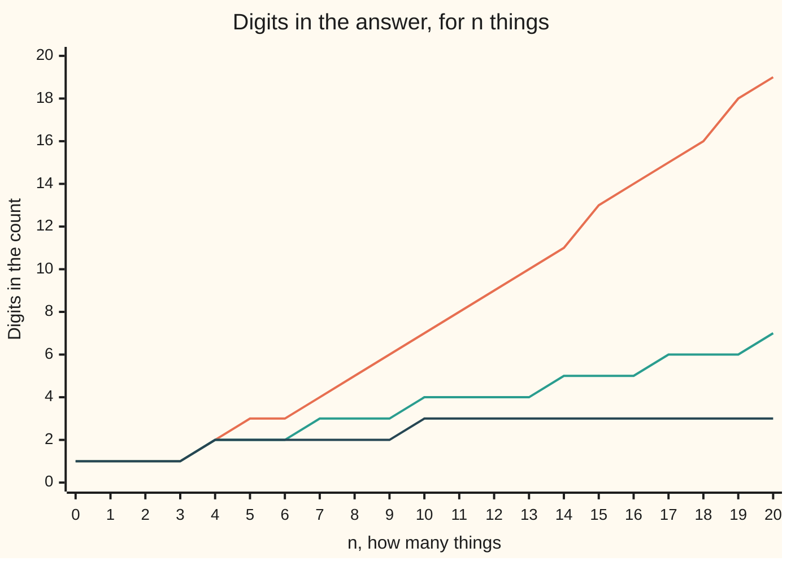

# Factorials: the number of ways to line things up, and how fast it explodes

Combinatorics and graphs → Counting Principles → Orderings → Factorials

---

## General Overview

A playlist holds ten songs. Play them in a different order and the evening sounds different, so order is part of the playlist. How many orders are there?

The picks come in stages, and stage sizes multiply ([rules-of-sum-and-product](01-rules-of-sum-and-product.md)). The first slot offers ten songs, the second the nine left, the third eight. The last has one song and no choice at all. So the count is 10 x 9 x 8 x 7 x 6 x 5 x 4 x 3 x 2 x 1 = 3,628,800.

Over three and a half million orders, out of ten songs. Eight runners cross a finish line in 40,320 orders. Twenty songs give 2,432,902,008,176,640,000.

That countdown product has its own mark: an exclamation mark after the number. Ten factorial, written 10!, is the product above. The mark is not emphasis; it says multiply down to 1.

**The number of ways to put n different things in a line is n!, the product of every whole number from n down to 1, and that product outruns every doubling and every fixed power.**

**What kind of fact this is:** a definition — n! is the product of the whole numbers from 1 to n — carrying one theorem, proved on this card in Why it works: that product is exactly the number of orderings. The value 0! = 1 is a convention, forced by that count.

### The picture: how long the answer gets

A nineteen-digit count is hard to feel; digit counts are easier. The chart tracks three of them up to twenty things.



The climbing line is the orderings, n!. The middle is 2^n, a doubling at each step. The flat one is n^2. All three are level at four things; by twenty the orderings need nineteen digits, the doublings seven, the squares three.

---

## The formula

$$n! \;=\; n \times (n-1) \times (n-2) \times \cdots \times 2 \times 1, \qquad 0! = 1$$

**Read it aloud:** start at n, count down to 1, multiplying everything passed.

| Symbol | Plain meaning | In our example | Push it up and the answer… |
| --- | --- | --- | --- |
| $n$ | how many different things go in the line | 10 songs | explodes: each extra thing multiplies by a larger number |
| $n!$ | "n factorial": the product of every whole number from 1 to $n$ | 3,628,800 | — |
| $0!$ | the empty product: the one way to line up nothing | 1 | — |
| $S_n$ | Stirling's estimate of $n!$, skipping the multiplying | 2.422787 million million million at $n$ = 20 | — |
| $e$ | the fixed number 2.718281…, the base of natural growth | divides $n$ inside the estimate | — |
| $\pi$ | the fixed number 3.141592… | sits under the square root in the estimate | — |

Two helper statements follow.

$$n! \;=\; n \times (n-1)!$$

A line of n things is one thing at the front, then a line of the rest. Second, Stirling's estimate:

$$S_n \;=\; \sqrt{2\pi n}\left(\frac{n}{e}\right)^{n}$$

Take n divided by $e$, use it as a factor n times over, then scale by the square root of $2\pi n$. An estimate, not an equality; Step 5 measures the error.

### When it holds

- **The things are all different.** Two copies of one song and the count doubles up: the truth is 1,814,400, half of 3,628,800 ([multiset-permutations](../02-Repeats%2C%20Groups%20and%20Double%20Counting/01-multiset-permutations.md)).
- **All of them are used, and order counts.** Line up only some and the countdown stops early ([ordered-picks](04-ordered-picks.md)).
- **The line has a first place and a last.** Seat the same things round a table with no head and rotations collapse together ([circular-arrangements](../02-Repeats%2C%20Groups%20and%20Double%20Counting/04-circular-arrangements.md)).
- **Stirling's estimate controls the ratio, never the difference.** At n = 20 it is 0.416 percent low, and the gap left over is 0.010115 million million million orderings. Compare sizes with it; never subtract.

---

## Why it works

### Step 0: a line is filled one place at a time

No new idea is needed. A line is built by stages, and no pick spoils the next: whatever goes first, every remaining song is still free for second place. Stage sizes multiply, so the count is a product ([rules-of-sum-and-product](01-rules-of-sum-and-product.md)).

### Step 1: the stage sizes run down to one

Each stage offers one fewer thing than the last, because what is placed is gone. Three songs A, B and C make the point at a size small enough to write out:

| First track | What is left | The orderings |
| --- | --- | --- |
| A | B and C | ABC, ACB |
| B | A and C | BAC, BCA |
| C | A and B | CAB, CBA |

Three openers, two orders of the remainder, six orderings: 3 x 2 x 1 = 6. Ten songs, same shape: 10 x 9 x 8 x 7 x 6 x 5 x 4 x 3 x 2 x 1 = 3,628,800.

### Step 2: the recurrence is that table in one line

The table holds one block per opener, every block the same size: the orderings of what is left. That is the whole content of n! = n x (n-1)!, a recurrence: each value built from the one below. Ten songs make 10 blocks, each holding the 362,880 orderings of the other nine, so 3,628,800.

### Step 3: what 0! has to be

A line of nothing is still a line — the empty one — and there is exactly one of it, so zero things have one ordering. The recurrence agrees: n = 1 in n! = n x (n-1)! reads 1! = 1 x 0!, and one song lines up in one way, so 0! = 1.

Setting 0! = 0 knocks the bottom out: 1! becomes 0, then 2! = 2 x 0 = 0, and every factorial reads 0. The check prints that collapse.

<details>
<summary>Detailed proof: the product counts the orderings, for every n</summary>

Write L(n) for the number of orderings of n distinct things. The claim: L(n) = n! for every whole n at least 0, with n! fixed by 0! = 1 and n! = n x (n-1)!. The method is induction ([proof-by-induction](../../01-Foundations/06-Proof/04-proof-by-induction.md)).

**Base case.** With nothing to line up there is one ordering, the empty one: L(0) = 1 = 0!.

**Step.** Take n at least 1 and suppose L(n-1) = (n-1)!. Sort the orderings of n things into blocks by which thing stands first: n blocks, none overlapping. In the block headed by x, deleting x leaves an ordering of the other n-1 things and putting x back recovers the original, so that block holds L(n-1) orderings. Blocks that do not overlap are counted by adding, so L(n) = n x (n-1)! = n!.

The claim holds at 0 and passes from n-1 to n, so it holds for every n. The check tests that step numerically.

</details>

### Step 4: why it leaves doubling behind

Nine songs to ten multiplies the count by 10; ten to eleven, by 11. The multiplier itself grows. Doubling never does: 2^n gains a factor of 2 at every step, for ever, and squaring is weaker still ([linear-vs-exponential-growth](../../01-Foundations/03-Powers%2C%20Roots%20and%20Logarithms/02-linear-vs-exponential-growth.md)). So the factorial starts behind, 6 against 8 at three things, crosses at four, 24 against 16, and never falls back.

### Step 5: an estimate that skips the multiplying

Twenty multiplications are cheap; a factorial of a million cannot be written out. Stirling's estimate replaces the product with one short expression. At n = 20 it gives 2.422787 against the true 2.432902, both in units of a million million million: dividing, 0.995842, low by 0.416 percent, and the percentage shrinks as n grows. Where the square root and the $2\pi$ come from is answered on [stirlings-approximation](../../06-Calculus%20and%20analysis/06-Series/09-stirlings-approximation.md).

A second road reaches the same counts without multiplying: tally the orderings of every subset of the ten songs, each tally built by asking which song comes last and adding the tallies of the smaller subsets. The full set tallies 3,628,800.

---

## Worked numbers, by hand

The ladder, one rung at a time: each rung is the rung below times its own number.

| Step | Arithmetic | Value |
| --- | --- | --- |
| 0! | the empty product | 1 |
| 1! | 1 x 1 | 1 |
| 2! | 2 x 1 | 2 |
| 3! | 3 x 2 | 6 |
| 4! | 4 x 6 | 24 |
| 8!, the eight runners | 8 x 5,040 | **40,320** |
| 10!, the ten-song playlist | 10 x 362,880 | **3,628,800** |
| 20!, a twenty-song playlist | keep climbing to twenty | **2,432,902,008,176,640,000** |
| Stirling's estimate at 20 | root of 2 x pi x 20, times 20-divided-by-e twenty times over | **2.422787 million million million** |
| the estimate divided by 20! | 2.422787 / 2.432902 | **0.995842** |

Ten songs on shuffle come out 3,628,800 ways, which is why a shuffle rarely repeats.

### What breaks if you drop a piece

| Mistake | Comes out at | What went wrong |
| --- | --- | --- |
| Taking 0! to be 0 | 0, and so does every factorial | 1! is 1 x 0!, so a zero at the bottom wipes out the ladder |
| Letting songs repeat: ten slots, any of ten songs in each | 10,000,000,000 | that counts lists with repeats, a different question |
| Two copies of one song treated as different | 3,628,800, where the truth is 1,814,400 | swapping the copies makes no new playlist, so each is counted twice |

The code prints all three; lists with repeats are counted on [strings-and-powers](02-strings-and-powers.md).

---

## Code, from first principles, and it actually runs

Nothing is imported. Three roads sharing no arithmetic reach the count: multiplying the stage sizes down from n to 1; tallying orderings subset by subset, adding only; and building every ordering of a small set, then counting them. Stirling's estimate calls no library: its square root is Newton's method, its power a loop.

### Python

```python
# Factorials -- the check behind the card.  Nothing is imported.  A playlist of
# 10 songs, 8 runners and a 20-song playlist.  The count of orderings is reached
# by roads that share no arithmetic: multiplying the choices down, a tally that
# only ever adds, and a listing of every ordering of a small set.
SONGS, RUNNERS, BIG, PI, E = 10, 8, 20, 3.141592653589793, 2.718281828459045

def multiply_down(n):                       # road one: n x (n-1) x ... x 1
    out = 1
    for k in range(n, 0, -1):
        out *= k
    return out

def by_adding(n):                           # road two: a tally that never multiplies
    ways = [0] * (1 << n)                   # ways[s] = orderings of the songs in set s
    ways[0] = 1
    for s in range(1, 1 << n):
        ways[s] = sum(ways[s ^ (1 << i)] for i in range(n) if s >> i & 1)
    return ways[(1 << n) - 1]

def orderings(items):                       # road three: build every ordering, then count
    if not items:
        return [""]
    return [x + tail for i, x in enumerate(items)
            for tail in orderings(items[:i] + items[i + 1:])]

def stirling(n):                            # sqrt(2 pi n) x (n/e)^n, no library call
    p, under = 1.0, 2.0 * PI * n            # under: the number whose square root is wanted
    for _ in range(n):
        p *= n / E
    g = under                               # the root itself, by Newton's method
    for _ in range(60):
        g = 0.5 * (g + under / g)
    return g * p

ten, eight, f20 = multiply_down(SONGS), multiply_down(RUNNERS), multiply_down(BIG)
listed, three = orderings("ABCDEFGH"), orderings("ABC")
rows = [(len(str(multiply_down(n))), len(str(2 ** n)), len(str(n * n))) for n in range(BIG + 1)]
d_fact, d_two, d_sq = ([r[i] for r in rows] for i in (0, 1, 2))
s20 = stirling(BIG)
wrong = 0                                   # 0! taken as 0, then the recurrence applied
for n in range(1, SONGS + 1): wrong *= n
print(f"{'10 songs, one position at a time: 10 x 9 x 8 x 7 x 6 x 5 x 4 x 3 x 2 x 1':<74} = {ten:,}")
print(f"{'the same count, by a tally that only ever adds':<74} = {by_adding(SONGS):,}")
print(f"8 runners by multiplying down: {eight:,}; every ordering built and counted: {len(listed):,}")
print(f"the 3-song playlists, all {len(three)} of them: {' '.join(three)}")
print(f"0! up to 10!: {[multiply_down(n) for n in range(SONGS + 1)]}; "
      f"n! first passes 2^n at n = 4, {multiply_down(4)} against {2 ** 4}")
print(f"digits in n!,  n = 0 to 20: {d_fact}")
print(f"digits in 2^n, n = 0 to 20: {d_two}")
print(f"digits in n^2, n = 0 to 20: {d_sq}")
print(f"20! exactly: {f20:,}")
print(f"Stirling's estimate of 20!, then 20! itself, in units of a million million million: "
      f"{s20 / 1e18:.6f} and {f20 / 1e18:.6f}")
print(f"Stirling divided by 20! = {s20 / f20:.6f}, low by {(1 - s20 / f20) * 100:.3f} percent; the gap it leaves, same units: {(f20 - s20) / 1e18:.6f}")
print(f"mistake 1, 0! taken as 0: 10! reads {wrong}; mistake 2, repeats allowed: {10 ** SONGS:,}; mistake 3, one song on twice: {ten // 2:,}")
assert ten == by_adding(SONGS) == 3628800
assert len(listed) == eight == 40320 and len(orderings("ABCD")) == 24
assert all(by_adding(n) == n * multiply_down(n - 1) for n in range(1, 9))
assert 0.9958 < s20 / f20 < 0.9959 and f20 - s20 > 1.0e16
print("ALL CHECKS PASS")
```

**Ran 2026-09-14 on macOS, Python 3.14.6, standard library only. All checks passed. Output, pasted from the run:**

```
10 songs, one position at a time: 10 x 9 x 8 x 7 x 6 x 5 x 4 x 3 x 2 x 1   = 3,628,800
the same count, by a tally that only ever adds                             = 3,628,800
8 runners by multiplying down: 40,320; every ordering built and counted: 40,320
the 3-song playlists, all 6 of them: ABC ACB BAC BCA CAB CBA
0! up to 10!: [1, 1, 2, 6, 24, 120, 720, 5040, 40320, 362880, 3628800]; n! first passes 2^n at n = 4, 24 against 16
digits in n!,  n = 0 to 20: [1, 1, 1, 1, 2, 3, 3, 4, 5, 6, 7, 8, 9, 10, 11, 13, 14, 15, 16, 18, 19]
digits in 2^n, n = 0 to 20: [1, 1, 1, 1, 2, 2, 2, 3, 3, 3, 4, 4, 4, 4, 5, 5, 5, 6, 6, 6, 7]
digits in n^2, n = 0 to 20: [1, 1, 1, 1, 2, 2, 2, 2, 2, 2, 3, 3, 3, 3, 3, 3, 3, 3, 3, 3, 3]
20! exactly: 2,432,902,008,176,640,000
Stirling's estimate of 20!, then 20! itself, in units of a million million million: 2.422787 and 2.432902
Stirling divided by 20! = 0.995842, low by 0.416 percent; the gap it leaves, same units: 0.010115
mistake 1, 0! taken as 0: 10! reads 0; mistake 2, repeats allowed: 10,000,000,000; mistake 3, one song on twice: 1,814,400
ALL CHECKS PASS
```

### Rust

Same numbers, same labels, built with `rustc --edition 2021 -O`.

```rust
// Factorials -- the same check as the Python, in Rust.  No crates.  A playlist of
// 10 songs, 8 runners and a 20-song playlist.  The count of orderings is reached
// by roads that share no arithmetic: multiplying the choices down, a tally that
// only ever adds, and a listing of every ordering of a small set.
const SONGS: u32 = 10; const RUNNERS: u32 = 8; const BIG: u32 = 20;
const PI: f64 = 3.141592653589793; const E: f64 = 2.718281828459045;

fn multiply_down(n: u32) -> u64 {           // road one: n x (n-1) x ... x 1
    let mut out: u64 = 1;
    for k in (1..=n as u64).rev() { out *= k }
    out
}

fn by_adding(n: u32) -> u64 {               // road two: a tally that never multiplies
    let mut ways = vec![0u64; 1 << n];      // ways[s] = orderings of the songs in set s
    ways[0] = 1;
    for s in 1..(1usize << n) {
        let mut t = 0u64;
        for i in 0..n as usize { if s >> i & 1 == 1 { t += ways[s ^ (1 << i)] } }
        ways[s] = t;
    }
    ways[(1usize << n) - 1]
}

fn orderings(items: &str) -> Vec<String> {  // road three: build every ordering, then count
    if items.is_empty() { return vec![String::new()] }
    let mut out = Vec::new();
    for (i, x) in items.chars().enumerate() {
        let rest: String = items.chars().enumerate().filter(|&(j, _)| j != i).map(|(_, c)| c).collect();
        for tail in orderings(&rest) { out.push(format!("{}{}", x, tail)) }
    }
    out
}

fn stirling(n: u32) -> f64 {                // sqrt(2 pi n) x (n/e)^n, no library call
    let (mut p, under) = (1.0f64, 2.0 * PI * n as f64);   // under: the number whose root is wanted
    for _ in 0..n { p *= n as f64 / E }
    let mut g = under;                      // the root itself, by Newton's method
    for _ in 0..60 { g = 0.5 * (g + under / g) }
    g * p
}

fn commas(x: u64) -> String {               // 3628800 -> "3,628,800", the way Python prints it
    let s = x.to_string();
    let mut out = String::new();
    for (i, c) in s.chars().enumerate() {
        if i > 0 && (s.len() - i) % 3 == 0 { out.push(',') }
        out.push(c);
    }
    out
}

fn main() {
    let (ten, eight, f20) = (multiply_down(SONGS), multiply_down(RUNNERS), multiply_down(BIG));
    let (listed, three) = (orderings("ABCDEFGH"), orderings("ABC"));
    let small: Vec<u64> = (0..=SONGS).map(multiply_down).collect();
    let d_fact: Vec<usize> = (0..=BIG).map(|n| multiply_down(n).to_string().len()).collect();
    let d_two: Vec<usize> = (0..=BIG).map(|n| (1u64 << n).to_string().len()).collect();
    let d_sq: Vec<usize> = (0..=BIG).map(|n| ((n as u64) * (n as u64)).to_string().len()).collect();
    let (s20, f20f) = (stirling(BIG), f20 as f64);   // f20f: the same 20!, as a decimal
    let mut wrong: u64 = 0;                 // 0! taken as 0, then the recurrence applied
    for n in 1..=SONGS as u64 { wrong *= n }
    println!("{:<74} = {}", "10 songs, one position at a time: 10 x 9 x 8 x 7 x 6 x 5 x 4 x 3 x 2 x 1", commas(ten));
    println!("{:<74} = {}", "the same count, by a tally that only ever adds", commas(by_adding(SONGS)));
    println!("8 runners by multiplying down: {}; every ordering built and counted: {}", commas(eight), commas(listed.len() as u64));
    println!("the 3-song playlists, all {} of them: {}", three.len(), three.join(" "));
    println!("0! up to 10!: {:?}; n! first passes 2^n at n = 4, {} against {}", small, multiply_down(4), 1u64 << 4);
    println!("digits in n!,  n = 0 to 20: {:?}", d_fact);
    println!("digits in 2^n, n = 0 to 20: {:?}", d_two);
    println!("digits in n^2, n = 0 to 20: {:?}", d_sq);
    println!("20! exactly: {}", commas(f20));
    println!("Stirling's estimate of 20!, then 20! itself, in units of a million million million: {:.6} and {:.6}", s20 / 1e18, f20f / 1e18);
    println!("Stirling divided by 20! = {:.6}, low by {:.3} percent; the gap it leaves, same units: {:.6}", s20 / f20f, (1.0 - s20 / f20f) * 100.0, (f20f - s20) / 1e18);
    println!("mistake 1, 0! taken as 0: 10! reads {}; mistake 2, repeats allowed: {}; mistake 3, one song on twice: {}", wrong, commas(10u64.pow(SONGS)), commas(ten / 2));
    assert!(ten == by_adding(SONGS) && ten == 3628800);
    assert!(listed.len() as u64 == eight && eight == 40320 && orderings("ABCD").len() == 24);
    assert!((1..9u32).all(|n| by_adding(n) == n as u64 * multiply_down(n - 1)));
    assert!(s20 / f20f > 0.9958 && s20 / f20f < 0.9959 && f20f - s20 > 1.0e16);
    println!("ALL CHECKS PASS");
}
```

**Ran 2026-09-14 on macOS, rustc 1.98.1, no crates. All checks passed. Output, pasted from the run:**

```
10 songs, one position at a time: 10 x 9 x 8 x 7 x 6 x 5 x 4 x 3 x 2 x 1   = 3,628,800
the same count, by a tally that only ever adds                             = 3,628,800
8 runners by multiplying down: 40,320; every ordering built and counted: 40,320
the 3-song playlists, all 6 of them: ABC ACB BAC BCA CAB CBA
0! up to 10!: [1, 1, 2, 6, 24, 120, 720, 5040, 40320, 362880, 3628800]; n! first passes 2^n at n = 4, 24 against 16
digits in n!,  n = 0 to 20: [1, 1, 1, 1, 2, 3, 3, 4, 5, 6, 7, 8, 9, 10, 11, 13, 14, 15, 16, 18, 19]
digits in 2^n, n = 0 to 20: [1, 1, 1, 1, 2, 2, 2, 3, 3, 3, 4, 4, 4, 4, 5, 5, 5, 6, 6, 6, 7]
digits in n^2, n = 0 to 20: [1, 1, 1, 1, 2, 2, 2, 2, 2, 2, 3, 3, 3, 3, 3, 3, 3, 3, 3, 3, 3]
20! exactly: 2,432,902,008,176,640,000
Stirling's estimate of 20!, then 20! itself, in units of a million million million: 2.422787 and 2.432902
Stirling divided by 20! = 0.995842, low by 0.416 percent; the gap it leaves, same units: 0.010115
mistake 1, 0! taken as 0: 10! reads 0; mistake 2, repeats allowed: 10,000,000,000; mistake 3, one song on twice: 1,814,400
ALL CHECKS PASS
```

The two outputs match line for line.

> [!TIP]
> **Try changing**
> Guess first, then run it. The asserts are pinned to the playlist and the race, so expect one to stop it.
> - **Nine songs, not ten.** Set `SONGS` to 9: the count drops to 362,880, a tenth of before. The first assert stops it.
> - **Knock the bottom out.** Set `ways[0]` to 2 in the tally road: tallies double, the roads disagree, and the first assert stops it.
> - **A longer race.** Set `RUNNERS` to 9: the multiplying road climbs to 362,880 while the listing road still builds its 40,320, and the second assert stops it.
> - **Take e out of Stirling.** Replace `n / E` with `n / 2.6`: the estimate stops tracking the factorial and the last assert stops it.

---

## The usual mistake

> [!warning]
> **Reaching for n! whenever things are being counted.** It counts one thing: the orderings of n things all different, all used, in a line with a first place and a last. Change any of those and the answer changes.
>
> - **Writing 0! = 0.** The ladder stands on 1! = 1 x 0!, so a zero at the bottom makes every factorial read 0.
> - **Allowing repeats without noticing.** Ten slots, each free to hold any of the ten songs, is 10,000,000,000 — not 3,628,800.
> - **Treating identical things as different.** One song on the playlist twice gives 1,814,400 playlists, not 3,628,800.
> - **Expecting the estimate to be close in plain size.** At n = 20 it is 0.416 percent low, and 0.416 percent of a nineteen-digit number is not small.

---

## Where you meet it in real life

- **Shuffle.** A shuffle button picks one of the n! orders — for ten tracks, one of 3,628,800.
- **Delivery rounds.** Twenty stops can be visited in 2,432,902,008,176,640,000 orders, so no route planner tries them all (sorting-and-searching).
- **Sorting.** A method that compares pairs must tell n! orders apart, and that count sets the floor on sorting's cost.

> **Say it back**
> Lining up n different things is a stage-by-stage job: n ways to fill the first place, n-1 the second, one for the last. The stage sizes multiply, and that product is n!. Ten songs make 3,628,800 orders, eight runners 40,320. There is one way to line up nothing, so 0! = 1; any other value collapses the ladder to zero. Each extra thing multiplies by a bigger number than the last, so n! leaves doubling behind from four things on; Stirling's estimate sizes what is too big to multiply out.

---

## What this builds on

- [rules-of-sum-and-product](01-rules-of-sum-and-product.md): picks made in stages multiply — the rule the countdown rests on.
- [proof-by-induction](../../01-Foundations/06-Proof/04-proof-by-induction.md): turns the one-step recurrence into a claim about every n.
- [linear-vs-exponential-growth](../../01-Foundations/03-Powers%2C%20Roots%20and%20Logarithms/02-linear-vs-exponential-growth.md): the doubling curve the factorial overtakes at four.
- [compounding-frequency-and-e](../../01-Foundations/04-Compound%20Growth%20and%20Discounting/04-compounding-frequency-and-e.md): where e comes from, the number inside Stirling's estimate.

## Where this goes next

- [ordered-picks](04-ordered-picks.md): the count when only some of the things go in the line.
- [multiset-permutations](../02-Repeats%2C%20Groups%20and%20Double%20Counting/01-multiset-permutations.md): the count when some things are identical: 1,814,400.
- [circular-arrangements](../02-Repeats%2C%20Groups%20and%20Double%20Counting/04-circular-arrangements.md): the same things round a table, no place first.
- [permutations-by-cycles](../08-Partitions/05-permutations-by-cycles.md): the n! orderings sorted by the loops they make.
- [stirlings-approximation](../../06-Calculus%20and%20analysis/06-Series/09-stirlings-approximation.md): where the square root and the 2 pi come from.
- sorting-and-searching: n! as the number of orders a sorting method must separate.

Ten songs into ten slots is settled; open still is the count when only five of the ten make the disc, which [ordered-picks](04-ordered-picks.md) answers.

---

## Sources

Verified 14 Sep 2026: every link below resolves to the publisher's page.

- Hammack, Richard. *Book of Proof*, 3rd ed. [Author's page](https://richardhammack.github.io/BookOfProof/), [full PDF](https://richardhammack.github.io/BookOfProof/Main.pdf), free under CC BY-NC-ND 4.0. Defines n!, sets 0! = 1, proves the list-counting principle behind Step 0.
- Brualdi, Richard A. *Introductory Combinatorics*, Classic Version, 5th ed. Pearson. [Publisher page](https://www.pearson.com/en-us/subject-catalog/p/introductory-combinatorics-classic-version/P200000006138/9780137981045). Permutations of n distinct objects, and where the factorial sits inside later formulas.
- Robbins, Herbert. "A Remark on Stirling's Formula." *The American Mathematical Monthly* 62, no. 1 (1955): 26–29. [doi:10.2307/2308012](https://doi.org/10.2307/2308012). Bounds the estimate above and below for every n at least 1.
