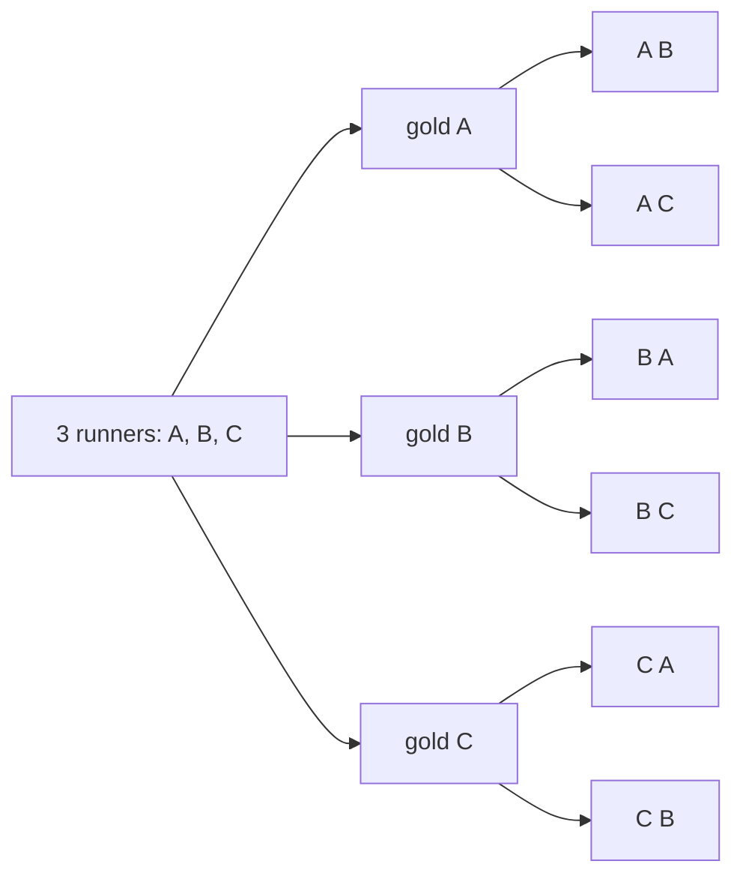

# Ordered picks: choosing k of n in order is the falling factorial n(n-1)...(n-k+1)

Combinatorics and graphs → Counting Principles → Arrangements → Ordered picks

---

## General Overview

Eight runners line up for a track final, A to H. Three medals: gold, silver, bronze. How many podiums could the race produce?

Count one medal at a time. Gold can go eight ways. Whoever takes it is out of the running for silver, so silver can go seven. Bronze, six. Multiply: 8 × 7 × 6 = 336 podiums.

Two facts did that work. The medals differ, so A gold, B silver, C bronze is not B gold, A silver, C bronze. And nobody takes two medals, so each award shrinks the field by one.

A count of that shape — some of the things, none repeated, set into places that differ — is an **ordered pick**. Books call it a k-permutation of n things; one idea, two names, and the plainer carries this card. Nothing about medals made it work: any places filled from a pool without repeats fall the same way.

**Picking some of a pool with the order counted is a single multiplication: start at the size of the pool, multiply the next number down for each further place, and stop when every place is filled.**

**What kind of fact this is:** a theorem, proved on this card in Why it works.

### The picture: three runners, two medals



Three ways to hand out the gold, two runners left for the silver each time: 3 × 2 = 6 lists. No letter twice in a line, and A B is not B A.

---

## The formula

Two pieces of notation first, in words. The factorial of a whole number, written $n!$ and read "n factorial", is that number times every whole number below it down to 1 ([factorial](03-factorial.md)); 5! is 5 × 4 × 3 × 2 × 1 = 120. This card's count is written $P(n,k)$, read "n permute k": the ways to fill $k$ places, in order, from a pool of $n$ things.

$$P(n,k) = n(n-1)(n-2)\cdots(n-k+1) = \frac{n!}{(n-k)!}$$

**Read it aloud:** begin at the size of the pool and multiply the next number down each time, one factor per place, stopping when the places run out.

The left-hand product is the **falling factorial**: a factorial stopped early. The right-hand form says the same by cancelling, as Step 2 shows.

| Symbol | Plain meaning | In our example | Push it up and the answer… |
| --- | --- | --- | --- |
| $n$ | the pool: how many things there are to pick from | 8 runners | climbs fast: every factor grows |
| $k$ | how many places are filled, with order counted | 3 medals | one more factor in the product |
| $P(n,k)$ | the number of ordered picks | 336 podiums | — |
| $n!$ | the factorial: the orders of all $n$ things | 8! = 40,320 | — |
| $(n-k)!$ | the orders of the things left out, divided off | 5! = 120 | more divided away, count falls |
| $n-k+1$ | the last factor: the pool left at the final place | 8 − 3 + 1 = 6 | — |

### When it holds

- **The things are tellable apart.** If two runners cannot be told apart, podiums the product counts twice are one podium, and 336 is too many.
- **No repeats.** Every pick leaves the pool. Let one runner take two medals and the count is 8 × 8 × 8 = 512, the strings-with-repetition count ([strings-and-powers](02-strings-and-powers.md)), not 336.
- **The places differ.** Gold, silver and bronze are different prizes. Swap them for three identical ribbons and each trio is counted 3! = 6 times over; the answer is then 336 ÷ 6 = 56 ([n-choose-k](05-n-choose-k.md)).
- **At most as many places as things.** Fill every place and the product runs to the end: the plain factorial, 8! = 40,320. Ask for more places than things and a factor hits zero — the right answer, since no such pick exists.

---

## Why it works

### Step 0: fill one place at a time, and the pool shrinks as it goes

The rule of product: if a first choice goes one number of ways and, for each of those, a second goes a fixed number of ways, the pair goes the product ([rules-of-sum-and-product](01-rules-of-sum-and-product.md)).

The only new thing here is that the second number is smaller. Gold: eight runners. For each of those, silver: seven, since one already holds a medal. For each of those, bronze: six. So 8 × 7 × 6 = 336.

*Which* seven are left for silver depends on who took the gold. How many does not, and only the number enters a product.

### Step 1: where the last factor comes from

The first place faces the whole pool, the second one fewer, the third two fewer. At the final place every earlier place has taken one thing, so the pool has shrunk by one less than the number of places: it stands at $n-k+1$. For the medals, 8 − 3 + 1 = 6, the bronze count above.

The product $n(n-1)(n-2)\cdots(n-k+1)$ therefore has exactly $k$ factors — one per place, not one per runner.

### Step 2: the same product, written with factorials

All eight in a full finishing order: 8! = 40,320, that is 8 × 7 × 6 × 5 × 4 × 3 × 2 × 1. The first three factors are the podium count; the tail 5 × 4 × 3 × 2 × 1 = 120 is 5!, the orders of the five who missed out.

Divide the tail away: 40,320 ÷ 120 = 336, which is $P(n,k) = n!/(n-k)!$. The product is what a person multiplies; the ratio is what a formula quotes, as in 20! ÷ 15! = 1,860,480 below.

### Step 3: an ordered pick is a one-to-one map

Name the places: first medal, second, third. An ordered pick hands each place a runner and repeats none — a one-to-one function from the three places into the eight runners; *injective* is the standard word ([injective-surjective-bijective](../../01-Foundations/08-Relations%20and%20Functions/04-injective-surjective-bijective.md)).

So $P(n,k)$ answers a question with no medals in it: how many one-to-one maps run from a set of $k$ things into a set of $n$. Drop the one-to-one demand and every map counts, the string count 8 × 8 × 8 = 512 ([strings-and-powers](02-strings-and-powers.md)); the gap to 336 is the maps that repeat a runner.

<details>
<summary>Detailed proof: induction on the number of places</summary>

The claim: for a pool of $n$ and $k$ places with $0 \le k \le n$, the ordered picks number $n(n-1)\cdots(n-k+1)$, a product of $k$ factors.

**Base.** There is one way to fill no places: the empty list; a product of no factors is 1 by convention, so the two agree.

**Step.** Suppose the claim holds for $k-1$ places from a pool of any size. Take $k$ places and a pool of $n$. The first place can be filled $n$ ways; fix one, and the remaining $k-1$ places draw on a pool of $n-1$, which by supposition goes $(n-1)(n-2)\cdots(n-k+1)$ ways — still $k-1$ factors, starting one lower and ending at $(n-1)-(k-1)+1 = n-k+1$. That count is the same whichever thing went first, so the rule of product gives $n(n-1)\cdots(n-k+1)$. ∎

The step is an identity in its own right: $P(n,k) = n \times P(n-1,k-1)$, one place filled and a smaller pick left behind. It is the third road the code takes at the larger size: 20 × P(19, 4) = 1,860,480.

</details>

Another route runs the other way round. Settle *which* runners are on the podium, ignoring which medal each gets, then arrange those three: 3! = 6 ways. The 336 podiums fall into groups of 6, one per trio, and there are 56 trios: 56 × 6 = 336. Counting the trios directly is the job of [n-choose-k](05-n-choose-k.md).

---

## Worked numbers, by hand

A squad of 20 players. The manager names five penalty takers and the order they shoot in, first kick to fifth. Nobody takes two kicks.

| Step | Arithmetic | Value |
| --- | --- | --- |
| first kick | any of the squad | 20 |
| second kick | 20 × 19 | 380 |
| third kick | 380 × 18 | 6,840 |
| fourth kick | 6,840 × 17 | 116,280 |
| fifth kick | 116,280 × 16 | **1,860,480** |
| the same, by factorials | 20! ÷ 15! | **1,860,480** |
| the same, one kick then a smaller pick | 20 × P(19, 4) | **1,860,480** |
| if a player could shoot twice | 20^5 | **3,200,000** |

The manager is choosing between 1,860,480 shooting orders; barring a second kick holds the figure below 3,200,000.

### What breaks if you drop a piece

| Mistake | Comes out at | What went wrong |
| --- | --- | --- |
| Dividing the podiums by 3! as well | 56 | That counts the medallists, not the podium |
| Letting a runner take two medals | 512 | 8 × 8 × 8 counts strings, and repeats are not podiums |
| Dividing 8! by 3! instead of 5! | 6,720 | The divided-off factorial counts the things left out: five runners, not three medals |

The code prints all three.

---

## Code, from first principles, and it actually runs

Nothing is imported. The 336 podiums are reached three ways, sharing no arithmetic: multiplying 8 × 7 × 6 down, dividing 8! by 5!, and writing every podium out and counting the lines. The squad of 20 is too large to write out, so it takes the falling product, the factorial ratio and the smaller-pick identity 20 × P(19, 4). The picture's tiny case and the three wrong answers above are printed too.

### Python

```python
# Ordered picks -- the check behind the card.  Nothing is imported.  Eight
# runners, three medals in order: gold, silver, bronze.  The count is reached by
# three roads that share no arithmetic -- counting down, dividing factorials,
# and writing every podium out -- and a squad of 20 repeats the test bigger.
RUNNERS, MEDALS, SQUAD, TAKERS, NAMES = 8, 3, 20, 5, "ABCDEFGH"

def factorial(m):                          # written out, since nothing is imported
    out = 1
    for i in range(2, m + 1):
        out *= i
    return out
def falling(n, k):                         # road one: k factors, counting down
    out = 1
    for i in range(k):
        out *= n - i
    return out
def by_factorials(n, k):                   # road two: the leftovers divided back out
    return factorial(n) // factorial(n - k)
def lists(pool, k, repeats):               # road three: write every pick down
    if k == 0:
        return [""]
    out = []
    for i, r in enumerate(pool):
        rest = pool if repeats else pool[:i] + pool[i + 1:]
        out += [r + tail for tail in lists(rest, k - 1, repeats)]
    return out
def commas(v):                             # 1860480 -> 1,860,480
    s = str(v)
    return s if len(s) <= 3 else commas(int(s[:-3])) + "," + s[-3:]

tiny = lists(NAMES[:3], 2, False)
podiums = lists(NAMES, MEDALS, False)
repeated = lists(NAMES, MEDALS, True)
unordered = {"".join(sorted(p)) for p in podiums}
running = [falling(SQUAD, i) for i in range(1, TAKERS + 1)]
recurrence = SQUAD * falling(SQUAD - 1, TAKERS - 1)
print(f"3 runners A, B, C, two medals in order: 3 x 2 = {len(tiny)}")
print(f"the six lists: {', '.join(tiny)}")
print(f"{RUNNERS} runners, {MEDALS} medals in order -- counting down: 8 x 7 x 6 = {falling(RUNNERS, MEDALS)}")
print(f"road 2, factorials: 8! / 5! = {commas(factorial(RUNNERS))} / {factorial(RUNNERS - MEDALS)}"
      f" = {by_factorials(RUNNERS, MEDALS)}")
print(f"road 3, every podium written out: {len(podiums)}")
print(f"the first three podiums listed: {', '.join(podiums[:3])}")
print(f"repeats allowed, written out: 8 x 8 x 8 = {len(repeated)}")
print(f"the same podiums with the order forgotten: {len(unordered)}, and "
      f"{len(unordered)} x 3! = {len(unordered) * factorial(MEDALS)}")
print(f"squad of {SQUAD}, {TAKERS} takers -- running product: {', '.join(commas(v) for v in running)}")
print(f"road 2, factorials: 20! / 15! = {commas(by_factorials(SQUAD, TAKERS))}")
print(f"road 3, one kick then a smaller pick: 20 x P(19, 4) = {commas(recurrence)}")
print(f"repeats allowed: 20^5 = {commas(SQUAD ** TAKERS)}")
print(f"mistake 1, dividing by 3! as well: {len(unordered)}, not {falling(RUNNERS, MEDALS)}")
print(f"mistake 2, letting one runner take two medals: {len(repeated)}, not {falling(RUNNERS, MEDALS)}")
print(f"mistake 3, dividing by 3! instead of 5!: 8! / 3! = "
      f"{commas(factorial(RUNNERS) // factorial(MEDALS))}, not {falling(RUNNERS, MEDALS)}")
assert len(podiums) == falling(RUNNERS, MEDALS) == by_factorials(RUNNERS, MEDALS)
assert all(len(set(p)) == MEDALS for p in podiums) and len(set(podiums)) == len(podiums)
assert len(unordered) * factorial(MEDALS) == len(podiums) and len(repeated) == RUNNERS ** MEDALS
assert running[-1] == by_factorials(SQUAD, TAKERS) == recurrence == 1860480
print("ALL CHECKS PASS")
```

**Ran 2026-09-14 on macOS, Python 3.14.6, standard library only. All checks passed. Output, pasted from the run:**

```
3 runners A, B, C, two medals in order: 3 x 2 = 6
the six lists: AB, AC, BA, BC, CA, CB
8 runners, 3 medals in order -- counting down: 8 x 7 x 6 = 336
road 2, factorials: 8! / 5! = 40,320 / 120 = 336
road 3, every podium written out: 336
the first three podiums listed: ABC, ABD, ABE
repeats allowed, written out: 8 x 8 x 8 = 512
the same podiums with the order forgotten: 56, and 56 x 3! = 336
squad of 20, 5 takers -- running product: 20, 380, 6,840, 116,280, 1,860,480
road 2, factorials: 20! / 15! = 1,860,480
road 3, one kick then a smaller pick: 20 x P(19, 4) = 1,860,480
repeats allowed: 20^5 = 3,200,000
mistake 1, dividing by 3! as well: 56, not 336
mistake 2, letting one runner take two medals: 512, not 336
mistake 3, dividing by 3! instead of 5!: 8! / 3! = 6,720, not 336
ALL CHECKS PASS
```

### Rust

Same numbers, same labels, built with `rustc --edition 2021 -O`.

```rust
// Ordered picks -- the same check as the Python, in Rust.  No crates.  Eight
// runners, three medals in order: gold, silver, bronze.  The count is reached by
// three roads that share no arithmetic -- counting down, dividing factorials,
// and writing every podium out -- and a squad of 20 repeats the test bigger.
const RUNNERS: u64 = 8;
const MEDALS: u64 = 3;
const SQUAD: u64 = 20;
const TAKERS: u64 = 5;
const NAMES: &str = "ABCDEFGH";
fn factorial(m: u64) -> u64 {              // written out, since no crate is used
    let mut out = 1;
    for i in 2..=m { out *= i }
    out
}
fn falling(n: u64, k: u64) -> u64 {        // road one: k factors, counting down
    let mut out = 1;
    for i in 0..k { out *= n - i }
    out
}
fn by_factorials(n: u64, k: u64) -> u64 { factorial(n) / factorial(n - k) }  // road two
fn lists(pool: &str, k: u64, repeats: bool) -> Vec<String> {   // road three: write every pick down
    if k == 0 { return vec![String::new()] }
    let mut out: Vec<String> = Vec::new();
    for (i, r) in pool.chars().enumerate() {
        let rest: String = if repeats { pool.to_string() }
            else { pool.chars().enumerate().filter(|p| p.0 != i).map(|p| p.1).collect() };
        for tail in lists(&rest, k - 1, repeats) { out.push(format!("{}{}", r, tail)) }
    }
    out
}
fn commas(v: u64) -> String {              // 1860480 -> 1,860,480
    let s = v.to_string();
    if s.len() <= 3 { s } else { format!("{},{}", commas(v / 1000), &s[s.len() - 3..]) }
}
fn sorted(word: &str) -> Vec<char> {       // the same letters, put in alphabetical order
    let mut c: Vec<char> = word.chars().collect();
    c.sort();
    c
}
fn main() {
    let tiny = lists(&NAMES[..3], 2, false);
    let podiums = lists(NAMES, MEDALS, false);
    let repeated = lists(NAMES, MEDALS, true);
    let mut unordered: Vec<String> = podiums.iter().map(|p| sorted(p).into_iter().collect()).collect();
    unordered.sort(); unordered.dedup();
    let mut once: Vec<String> = podiums.clone();
    once.sort(); once.dedup();
    let running: Vec<u64> = (1..=TAKERS).map(|i| falling(SQUAD, i)).collect();
    let shown: Vec<String> = running.iter().map(|&v| commas(v)).collect();
    let recurrence = SQUAD * falling(SQUAD - 1, TAKERS - 1);
    println!("3 runners A, B, C, two medals in order: 3 x 2 = {}", tiny.len());
    println!("the six lists: {}", tiny.join(", "));
    println!("{} runners, {} medals in order -- counting down: 8 x 7 x 6 = {}",
             RUNNERS, MEDALS, falling(RUNNERS, MEDALS));
    println!("road 2, factorials: 8! / 5! = {} / {} = {}", commas(factorial(RUNNERS)),
             factorial(RUNNERS - MEDALS), by_factorials(RUNNERS, MEDALS));
    println!("road 3, every podium written out: {}", podiums.len());
    println!("the first three podiums listed: {}", podiums[..3].join(", "));
    println!("repeats allowed, written out: 8 x 8 x 8 = {}", repeated.len());
    println!("the same podiums with the order forgotten: {}, and {} x 3! = {}",
             unordered.len(), unordered.len(), unordered.len() as u64 * factorial(MEDALS));
    println!("squad of {}, {} takers -- running product: {}", SQUAD, TAKERS, shown.join(", "));
    println!("road 2, factorials: 20! / 15! = {}", commas(by_factorials(SQUAD, TAKERS)));
    println!("road 3, one kick then a smaller pick: 20 x P(19, 4) = {}", commas(recurrence));
    println!("repeats allowed: 20^5 = {}", commas(SQUAD.pow(TAKERS as u32)));
    println!("mistake 1, dividing by 3! as well: {}, not {}", unordered.len(), falling(RUNNERS, MEDALS));
    println!("mistake 2, letting one runner take two medals: {}, not {}", repeated.len(), falling(RUNNERS, MEDALS));
    println!("mistake 3, dividing by 3! instead of 5!: 8! / 3! = {}, not {}",
             commas(factorial(RUNNERS) / factorial(MEDALS)), falling(RUNNERS, MEDALS));
    assert!(podiums.len() as u64 == falling(RUNNERS, MEDALS)
            && falling(RUNNERS, MEDALS) == by_factorials(RUNNERS, MEDALS));
    assert!(podiums.iter().all(|p| { let mut c = sorted(p); c.dedup(); c.len() as u64 == MEDALS })
            && once.len() == podiums.len());
    assert!(unordered.len() as u64 * factorial(MEDALS) == podiums.len() as u64
            && repeated.len() as u64 == RUNNERS.pow(MEDALS as u32));
    assert!(running[running.len() - 1] == by_factorials(SQUAD, TAKERS)
            && recurrence == by_factorials(SQUAD, TAKERS) && recurrence == 1860480);
    println!("ALL CHECKS PASS");
}
```

**Ran 2026-09-14 on macOS, rustc 1.98.1, no crates. All checks passed. Output, pasted from the run:**

```
3 runners A, B, C, two medals in order: 3 x 2 = 6
the six lists: AB, AC, BA, BC, CA, CB
8 runners, 3 medals in order -- counting down: 8 x 7 x 6 = 336
road 2, factorials: 8! / 5! = 40,320 / 120 = 336
road 3, every podium written out: 336
the first three podiums listed: ABC, ABD, ABE
repeats allowed, written out: 8 x 8 x 8 = 512
the same podiums with the order forgotten: 56, and 56 x 3! = 336
squad of 20, 5 takers -- running product: 20, 380, 6,840, 116,280, 1,860,480
road 2, factorials: 20! / 15! = 1,860,480
road 3, one kick then a smaller pick: 20 x P(19, 4) = 1,860,480
repeats allowed: 20^5 = 3,200,000
mistake 1, dividing by 3! as well: 56, not 336
mistake 2, letting one runner take two medals: 512, not 336
mistake 3, dividing by 3! instead of 5!: 8! / 3! = 6,720, not 336
ALL CHECKS PASS
```

The two outputs match line for line.

> [!TIP]
> **Try changing**
> Guess first, then run it. An assert halts the program when two roads disagree, or when a pinned number moves.
> - **A fourth medal.** Set `MEDALS` to 4. Counting down gains a factor, 8 × 7 × 6 × 5 = 1,680, the listing grows to match, and every assert still passes: nothing in the three roads is special to three medals. Only the labels, typed in by hand, go stale.
> - **Let a runner win twice.** Where `podiums` is built, pass `True` for `False`. Both roads now describe strings, the count climbs from 336 to 512, and the first assert halts it.
> - **A larger squad.** Raise `SQUAD` by one. All three squad roads move together and agree, but the last assert is pinned to 1,860,480 and halts the run.

---

## The usual mistake

> [!warning]
> **Treating a podium like a team.** The order is not decoration here, it is most of the count. Eight runners give 336 podiums but only 56 sets of three medallists, and the two differ by the 3! = 6 ways to hand three medals to three fixed people. Ask "does swapping two of them change the answer?" before reaching for either count.
>
> - **Dividing by the wrong factorial.** 8! ÷ 3! = 6,720, not 336. The factorial divided off counts the things left *out*, so it is 5! here, not 3!.
> - **Letting a pick repeat.** 8 × 8 × 8 = 512 is the count when a runner may take two medals. That is a string, not a podium.
> - **Reading P(n,n) as something new.** Fill every place and the product runs to the end: 8! = 40,320, the full finishing order of the race.

---

## Where you meet it in real life

- **Sport.** Podium finishes, batting orders, the penalty takers above: the list is the answer, and shuffling it is a different plan.
- **Codes without repeats.** A lock code barring a repeated character is an ordered pick; allow reuse and the count is a plain power ([strings-and-powers](02-strings-and-powers.md)).
- **Named roles.** Chair, secretary and treasurer are three different jobs, so counting them is an ordered pick; the same three people with no titles would be [n-choose-k](05-n-choose-k.md).

> **Say it back**
> An ordered pick fills a run of distinct places from a pool, with nothing used twice. Fill them one at a time and the pool shrinks by one each time, so the count is a falling product: 8 × 7 × 6 = 336 podiums from eight runners. Stopping the factorial early is the same as dividing off the orders of everything left out, so the count is also 8! ÷ 5! = 40,320 ÷ 120. Allowing repeats gives 512; forgetting the order gives 56.

---

## What this builds on

- [strings-and-powers](02-strings-and-powers.md): the count when repeats are allowed, 8 × 8 × 8 = 512 — the thing this count is not.
- [factorial](03-factorial.md): the full product 8! = 40,320, and the convention making a product of no factors 1.
- [injective-surjective-bijective](../../01-Foundations/08-Relations%20and%20Functions/04-injective-surjective-bijective.md): one-to-one maps, which an ordered pick becomes once the places are named.

## Where this goes next

- [n-choose-k](05-n-choose-k.md): the same picks with the order thrown away, 336 ÷ 6 = 56.
- [twelvefold-way](../08-Partitions/06-twelvefold-way.md): the grid sorting every counting question by whether things and places can be told apart; this count is one cell.
- [equally-likely-outcomes-and-counting](../../09-Probability%20and%20statistics/01-Chance%20and%20Events/04-equally-likely-outcomes-and-counting.md): counts like this turned into chances, favourable over possible.

The order of the medals was doing real work in the 336; dividing it back out, to count who is on the podium rather than what each won, is the content of [n-choose-k](05-n-choose-k.md).

---

## Sources

Verified 14 Sep 2026: every link below resolves to the publisher's page.

- Brualdi, Richard A. *Introductory Combinatorics*, Classic Version, 5th ed. Pearson. [Publisher page](https://www.pearson.com/en-us/subject-catalog/p/introductory-combinatorics-classic-version/P200000006138/9780137981045). Its "Permutations of Sets" section fills the places one at a time and lands on n!/(n−k)!.
- Hammack, Richard. *Book of Proof*, 3rd ed. [Author page, full text free](https://richardhammack.github.io/BookOfProof/). Its counting chapter proves the rule of product Step 0 leans on, then the list count.
- Stanley, Richard P. *Enumerative Combinatorics*, Volume 1, 2nd ed. Cambridge University Press, 2011. [doi:10.1017/CBO9781139058520](https://doi.org/10.1017/CBO9781139058520). Chapter 1 counts one-to-one maps between finite sets: the same number, from the function side.
- Graham, Ronald L., Donald E. Knuth and Oren Patashnik. *Concrete Mathematics*, 2nd ed. Addison-Wesley. [Publisher page](https://www.informit.com/store/concrete-mathematics-a-foundation-for-computer-science-9780201558029). Where the name "falling factorial power" comes from.
