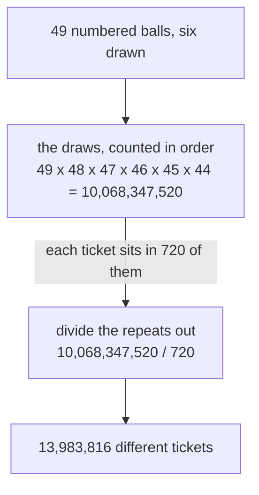
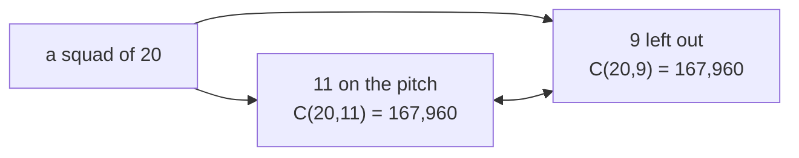

# Combinations, n choose k: unordered picks are ordered picks divided by k!, the workhorse of counting

[Syllabus](../../../SYLLABUS.md) → [Combinatorics and graphs](../README.md) → [Counting Principles](../README.md#s01) → Combinations, n choose k

---

## General Overview

A lottery machine holds 49 numbered balls and draws six. A ticket carries six numbers. The order the balls leave the drum changes nothing: 4, 11, 23, 28, 39 and 46 is one ticket however those six come out.

Counting the draws in order is the easy part. The first ball can be any of the 49, the second any of the 48 still in the drum, down to 44 for the sixth: 49 × 48 × 47 × 46 × 45 × 44 = 10,068,347,520 ordered draws ([Ordered picks](04-ordered-picks.md)).

Ten billion is far too many: it counts each ticket over and over. Those six numbers can leave the drum in 720 different orders, and all 720 are the same ticket. Divide the repeats out: 10,068,347,520 ÷ 720 = 13,983,816 tickets.

The same division answers questions with no lottery in them: a squad of 20 fields a starting eleven 167,960 ways.

**Count the picks as if order mattered, then divide by the number of orders each pick was counted in.**

**What kind of fact this is:** a theorem, proved on this card in Why it works; the notation C(n, k) for that count is a definition.

### The picture: ten billion draws, fourteen million tickets



---

## The formula

Notation first, in words. The count of picks with the order thrown away is written C(n, k) and read "n choose k": the ways to take k things out of n when no order is recorded. Books often stack the two numbers in a tall bracket; this library writes C(n, k). The factorial n! — the orders of n different things, n × (n−1) × … × 1 — comes from [Factorials](03-factorial.md).

$$C(n, k) = \frac{n!}{k!\,(n-k)!}$$

**Read it aloud:** the orders of everything, divided by the orders inside the pick and the orders of the part left behind.

Nobody computes it that way. The $(n-k)!$ underneath cancels the tail of $n!$, leaving $k$ factors on top:

$$C(n, k) = \frac{n \times (n-1) \times \cdots \times (n-k+1)}{k!}$$

That is the form used by hand and by the code: six factors over 720, never the full 49!.

| Symbol | Plain meaning | In our example | Push it up and the answer… |
| --- | --- | --- | --- |
| $n$ | how many different things are available | 49 balls, or 20 players | more to pick from, a larger count |
| $k$ | how many are picked | 6 balls, or 11 players | climbs to the middle, then falls |
| $n!$ | factorial: the orders of all $n$ things | 49! and 20! | — |
| $k!$ | the orders inside one pick | 6! = 720 | a bigger divisor, fewer picks |
| $(n-k)!$ | the orders of the part left behind | 43! and 9! | — |
| $C(n,k)$ | the count of picks, order thrown away | C(49,6) = 13,983,816 | — |
| $P(n,k)$ | ordered picks: the same k in order | 10,068,347,520 | — |

The helper is one card back: ordered picks, $P(n, k) = n!/(n-k)!$, the same k things counted with their order kept ([Ordered picks](04-ordered-picks.md)). C(n, k) is that divided by k!.

### When it holds

- **Whole numbers, with $k$ between 0 and $n$.** Outside that range nothing exists to count and the answer is zero; no factorial of a negative number is ever asked for.
- **The things are all different.** Two balls stamped 17 would merge some tickets, dropping the true count below 13,983,816.
- **Nothing is taken twice.** The balls are not returned. Put each one back and keep the order and the count is 49^6 = 13,841,287,201 ([Strings with repetition](02-strings-and-powers.md)); put each back and drop the order and it is a third count again ([Stars and bars](../02-Repeats%2C%20Groups%20and%20Double%20Counting/02-stars-and-bars.md)).
- **The order is genuinely thrown away.** If the six balls filled six different prizes, order pays and the answer is 10,068,347,520.

---

## Why it works

### Step 0: count with the order in, then divide the repeats out

Counting ordered things is easy; counting unordered things is not. So count the easy thing, then correct: when every answer has been counted the same number of times, divide by that number. That is the **rule of division**, and this card is that rule applied once.

"Same" carries the weight: divide by 720 only once every ticket is known to be counted 720 times, not most of them.

### Step 1: the ordered draws are a product

49 choices, then 48, 47, 46, 45, 44: multiplied, 10,068,347,520 ordered draws ([The rules of sum and product](01-rules-of-sum-and-product.md)).

### Step 2: every ticket was counted 6! times, exactly

Fix one ticket: 4, 11, 23, 28, 39, 46. Which ordered draws produce it? The orderings of those six numbers, 6 × 5 × 4 × 3 × 2 × 1 = 720 of them ([Factorials](03-factorial.md)).

Nothing about that ticket was special: any six different numbers have 720 orderings. So the ordered draws fall into piles, one per ticket, every pile 720 deep, no draw in two piles.

<details>
<summary>Detailed proof: the ordered draws split into equal piles</summary>

Let T be the collection of ordered draws of six different balls, so T holds P(49, 6) members. Send each draw to its ticket: the six numbers it holds, order dropped.

Nothing is missed: write any ticket's six numbers in some order and that is a draw in T.

Take a ticket K. The draws sent to K are those whose entries are exactly K's six numbers — the orderings of K's members. The factorial card counts them: 6!, and the same 6! for every K, since every ticket holds six different numbers.

A draw has one set of entries, so it goes to one ticket: the piles do not overlap. Counting T a pile at a time gives P(49, 6) = C(49, 6) × 6!.

The quotient is whole, and not by luck: it is the number of piles. Writing P(n, k) as n!/(n−k)! turns the same statement into C(n, k) = n!/(k!(n−k)!). No step used the number 49 or the number 6.

</details>

### Step 3: divide, and read off the count

10,068,347,520 ÷ 720 = 13,983,816 tickets. The ÷ 720 undid the ordering, nothing else.

### Step 4: choosing who is left out is the same job

A squad of 20 fields a starting eleven. Name the eleven who play and the nine who sit are named too; name nine to rest and the eleven are fixed. The pairing runs both ways — apply it twice and the original eleven is back — so the two collections are the same size:

$$C(n, k) = C(n, n-k)$$

Here C(20, 11) = C(20, 9) = 167,960. This is the **symmetry identity**. It is visible in the formula too: swapping k for n−k swaps k! and (n−k)!, and multiplication ignores the order of two factors. It is also the shortcut: to count 11 from 20, count 9 from 20.



Two names for one decision.

Another road: mark one player — every eleven either uses that player or does not, and counting the two cases apart gives each entry of Pascal's triangle as the sum of the two above it, by addition alone. That is the second road the code takes, proved on [Pascal's rule](../03-Binomial%20Coefficients%20and%20Identities/01-pascals-rule-and-the-triangle.md).

---

## Worked numbers, by hand

The lottery, then the same arithmetic on the squad of 20.

| Step | Arithmetic | Value |
| --- | --- | --- |
| the draw, counted in order | 49 × 48 × 47 × 46 × 45 × 44 | 10,068,347,520 |
| orders of one ticket | 6 × 5 × 4 × 3 × 2 × 1 | 720 |
| divide the order out | 10,068,347,520 ÷ 720 | **13,983,816** |
| five penalty takers, in order | 20 × 19 × 18 × 17 × 16 | 1,860,480 |
| an eleven from the 20, in order | 20 × 19 × … × 10 | 6,704,425,728,000 |
| orders inside one eleven | 11! | 39,916,800 |
| divide the order out | 6,704,425,728,000 ÷ 39,916,800 | **167,960** |
| the nine left out | C(20, 9) | **167,960** |

Hold one ticket and it is one of 13,983,816 equally possible outcomes.

### What breaks if you drop a piece

| Mistake | Comes out at | What went wrong |
| --- | --- | --- |
| Keeping the order in | 10,068,347,520 | every ticket counted 720 times over |
| Dividing by 6 instead of 6! | 1,678,057,920 | 6 is how many balls are taken, 720 how many orders they arrive in |
| Putting each ball back | 13,841,287,201 | a number may then repeat, and that count keeps the order |
| Eleven named shirt numbers | 6,704,425,728,000 | line-ups with roles, not squads: 167,960 × 11! |

The code prints all four.

---

## Code, from first principles, and it actually runs

Nothing is imported. Three roads reach the counts. One multiplies 49 down six times and divides by 720. One builds Pascal's triangle to row 49 by addition alone, nothing multiplied or divided, and reads the entry off. One lists all 1,048,576 ways to mark 20 players on or off the pitch, counts those with eleven on, and pairs each with the nine left out. A toy draw of 2 from 5 is listed in full, ten tickets to count by eye.

### Python

```python
# Combinations, n choose k -- the check behind the card.  Nothing is imported.
# A lottery draws 6 balls from 49; a 20-player squad fields a starting eleven.
# Every count is reached twice: once by multiplying and dividing, once by
# addition alone (Pascal's triangle) or by listing every line-up one by one.
LOTTO_N, LOTTO_K, SQUAD, ELEVEN = 49, 6, 20, 11

def fact(m):                              # m! = m x (m-1) x ... x 1, with 0! = 1
    out = 1
    for j in range(2, m + 1): out *= j
    return out

def ordered(n, k):                        # n x (n-1) x ... x (n-k+1): k factors
    out = 1
    for j in range(k): out *= n - j
    return out

def choose(n, k):                         # road one: the quotient, (n-k)! cancelled
    return 0 if k < 0 or k > n else ordered(n, k) // fact(k)

def yn(claim): return "yes" if claim else "no"

rows = [[1]]                              # road two: addition only, nothing multiplied
for n in range(1, LOTTO_N + 1):
    prev = rows[-1]
    rows.append([1] + [prev[j - 1] + prev[j] for j in range(1, n)] + [1])

full, elevens, nines = (1 << SQUAD) - 1, set(), set()
lineups = [0] * (SQUAD + 1)               # road three: list every line-up of the 20
for mask in range(1 << SQUAD):            # one bit per player, 1 = on the pitch
    bits = mask.bit_count()
    lineups[bits] += 1
    if bits == ELEVEN: elevens.add(mask)
    elif bits == SQUAD - ELEVEN: nines.add(mask)
paired = {full ^ m for m in elevens} == nines
toy = [f"{a}{b}" for a in range(1, 6) for b in range(a + 1, 6)]
drawn, orders = ordered(LOTTO_N, LOTTO_K), fact(LOTTO_K)
first_seven = " ".join(str(v) for v in rows[SQUAD][:7])

print(f"toy draw, 2 balls from 5, listed: {' '.join(toy)} = {len(toy)} tickets; C(5,2) = {choose(5, 2)}")
print(f"lottery, 6 balls from 49, in the order drawn: 49x48x47x46x45x44 = {drawn}")
print(f"orders of one ticket: 6! = {orders}")
print(f"divide the order out: {drawn} / {orders} = {drawn // orders} tickets")
print(f"the same count by addition alone, row 49 of Pascal's triangle: {rows[LOTTO_N][LOTTO_K]}")
print(f"squad of 20, an eleven in order: 20x19x...x10 = {ordered(SQUAD, ELEVEN)}, orders inside one eleven: 11! = {fact(ELEVEN)}")
print(f"divide the order out: {ordered(SQUAD, ELEVEN)} / {fact(ELEVEN)} = {choose(SQUAD, ELEVEN)} starting elevens")
print(f"the nine left out: C(20,9) = {choose(SQUAD, SQUAD - ELEVEN)}")
print(f"all {sum(lineups)} line-ups listed: 11 on the pitch {lineups[ELEVEN]}, 9 on the pitch {lineups[SQUAD - ELEVEN]}")
print(f"each eleven paired with the nine it leaves out, one to one: {yn(paired)}")
print(f"row 20 of Pascal, first seven entries: {first_seven}")
print(f"row 20 adds to {sum(rows[SQUAD])}, the number of line-ups listed: {yn(sum(rows[SQUAD]) == sum(lineups))}")
print(f"five penalty takers in order, same squad: 20x19x18x17x16 = {ordered(SQUAD, 5)}")
print(f"mistake 1, the order kept: {drawn}, not {drawn // orders}")
print(f"mistake 2, divided by 6 instead of 720: {drawn // LOTTO_K}")
print(f"mistake 3, each ball put back: 49^6 = {LOTTO_N ** LOTTO_K}")
print(f"mistake 4, eleven named positions: {ordered(SQUAD, ELEVEN)}, not {choose(SQUAD, ELEVEN)}")
assert rows[LOTTO_N][LOTTO_K] == choose(LOTTO_N, LOTTO_K)        # addition against dividing
assert lineups[ELEVEN] * fact(ELEVEN) == ordered(SQUAD, ELEVEN)  # listed sets x 11! = ordered
assert lineups[ELEVEN] == rows[SQUAD][ELEVEN] and paired         # listing against Pascal
assert sum(lineups) == sum(rows[SQUAD]) and len(toy) == choose(5, 2)
print("ALL CHECKS PASS")
```

**Ran 2026-09-14 on macOS, Python 3.14.6, standard library only. All checks passed. Output, pasted from the run:**

```
toy draw, 2 balls from 5, listed: 12 13 14 15 23 24 25 34 35 45 = 10 tickets; C(5,2) = 10
lottery, 6 balls from 49, in the order drawn: 49x48x47x46x45x44 = 10068347520
orders of one ticket: 6! = 720
divide the order out: 10068347520 / 720 = 13983816 tickets
the same count by addition alone, row 49 of Pascal's triangle: 13983816
squad of 20, an eleven in order: 20x19x...x10 = 6704425728000, orders inside one eleven: 11! = 39916800
divide the order out: 6704425728000 / 39916800 = 167960 starting elevens
the nine left out: C(20,9) = 167960
all 1048576 line-ups listed: 11 on the pitch 167960, 9 on the pitch 167960
each eleven paired with the nine it leaves out, one to one: yes
row 20 of Pascal, first seven entries: 1 20 190 1140 4845 15504 38760
row 20 adds to 1048576, the number of line-ups listed: yes
five penalty takers in order, same squad: 20x19x18x17x16 = 1860480
mistake 1, the order kept: 10068347520, not 13983816
mistake 2, divided by 6 instead of 720: 1678057920
mistake 3, each ball put back: 49^6 = 13841287201
mistake 4, eleven named positions: 6704425728000, not 167960
ALL CHECKS PASS
```

### Rust

Same numbers, same labels, built with `rustc --edition 2021 -O`.

```rust
// Combinations, n choose k -- the same check as the Python, in Rust.  No crates.
// A lottery draws 6 balls from 49; a 20-player squad fields a starting eleven.
// Every count is reached twice: once by multiplying and dividing, once by
// addition alone (Pascal's triangle) or by listing every line-up one by one.
use std::collections::HashSet;
const LOTTO_N: u64 = 49;
const LOTTO_K: u64 = 6;
const SQUAD: u32 = 20;
const ELEVEN: u32 = 11;

fn fact(m: u64) -> u128 {                       // m! = m x (m-1) x ... x 1, with 0! = 1
    let mut out: u128 = 1;
    for j in 2..=m as u128 { out *= j }
    out
}

fn ordered(n: u64, k: u64) -> u128 {            // n x (n-1) x ... x (n-k+1): k factors
    let mut out: u128 = 1;
    for j in 0..k { out *= (n - j) as u128 }
    out
}

fn choose(n: u64, k: u64) -> u128 {             // road one: the quotient, (n-k)! cancelled
    if k > n { 0 } else { ordered(n, k) / fact(k) }
}

fn yn(claim: bool) -> &'static str { if claim { "yes" } else { "no" } }

fn main() {
    let mut rows: Vec<Vec<u128>> = vec![vec![1]];   // road two: addition only, no multiplying
    for n in 1..=LOTTO_N as usize {
        let mut row: Vec<u128> = vec![1];
        for j in 1..n { row.push(rows[n - 1][j - 1] + rows[n - 1][j]) }
        row.push(1);
        rows.push(row);
    }
    let full: u32 = (1u32 << SQUAD) - 1;
    let (mut elevens, mut nines): (HashSet<u32>, HashSet<u32>) = (HashSet::new(), HashSet::new());
    let mut lineups = vec![0u128; SQUAD as usize + 1];   // road three: list every line-up
    for mask in 0..(1u32 << SQUAD) {                     // one bit per player, 1 = on the pitch
        let bits = mask.count_ones();
        lineups[bits as usize] += 1;
        if bits == ELEVEN { elevens.insert(mask); }
        else if bits == SQUAD - ELEVEN { nines.insert(mask); }
    }
    let paired = elevens.iter().map(|m| full ^ m).collect::<HashSet<u32>>() == nines;
    let toy: Vec<String> = (1..6).flat_map(|a| (a + 1..6).map(move |b| format!("{}{}", a, b))).collect();
    let (drawn, orders) = (ordered(LOTTO_N, LOTTO_K), fact(LOTTO_K));
    let first_seven: Vec<String> = rows[SQUAD as usize][..7].iter().map(|v| v.to_string()).collect();
    let (e, o, all) = (ELEVEN as usize, (SQUAD - ELEVEN) as usize, lineups.iter().sum::<u128>());
    let row20: u128 = rows[SQUAD as usize].iter().sum();
    println!("toy draw, 2 balls from 5, listed: {} = {} tickets; C(5,2) = {}", toy.join(" "), toy.len(), choose(5, 2));
    println!("lottery, 6 balls from 49, in the order drawn: 49x48x47x46x45x44 = {}", drawn);
    println!("orders of one ticket: 6! = {}", orders);
    println!("divide the order out: {} / {} = {} tickets", drawn, orders, drawn / orders);
    println!("the same count by addition alone, row 49 of Pascal's triangle: {}", rows[LOTTO_N as usize][LOTTO_K as usize]);
    println!("squad of 20, an eleven in order: 20x19x...x10 = {}, orders inside one eleven: 11! = {}", ordered(SQUAD as u64, ELEVEN as u64), fact(ELEVEN as u64));
    println!("divide the order out: {} / {} = {} starting elevens", ordered(SQUAD as u64, ELEVEN as u64), fact(ELEVEN as u64), choose(SQUAD as u64, ELEVEN as u64));
    println!("the nine left out: C(20,9) = {}", choose(SQUAD as u64, (SQUAD - ELEVEN) as u64));
    println!("all {} line-ups listed: 11 on the pitch {}, 9 on the pitch {}", all, lineups[e], lineups[o]);
    println!("each eleven paired with the nine it leaves out, one to one: {}", yn(paired));
    println!("row 20 of Pascal, first seven entries: {}", first_seven.join(" "));
    println!("row 20 adds to {}, the number of line-ups listed: {}", row20, yn(row20 == all));
    println!("five penalty takers in order, same squad: 20x19x18x17x16 = {}", ordered(SQUAD as u64, 5));
    println!("mistake 1, the order kept: {}, not {}", drawn, drawn / orders);
    println!("mistake 2, divided by 6 instead of 720: {}", drawn / LOTTO_K as u128);
    println!("mistake 3, each ball put back: 49^6 = {}", (LOTTO_N as u128).pow(LOTTO_K as u32));
    println!("mistake 4, eleven named positions: {}, not {}", ordered(SQUAD as u64, ELEVEN as u64), choose(SQUAD as u64, ELEVEN as u64));
    assert!(rows[LOTTO_N as usize][LOTTO_K as usize] == choose(LOTTO_N, LOTTO_K));   // addition against dividing
    assert!(lineups[e] * fact(ELEVEN as u64) == ordered(SQUAD as u64, ELEVEN as u64));  // listed sets x 11!
    assert!(lineups[e] == rows[SQUAD as usize][e] && paired);                        // listing against Pascal
    assert!(all == row20 && toy.len() as u128 == choose(5, 2));
    println!("ALL CHECKS PASS");
}
```

**Ran 2026-09-14 on macOS, rustc 1.98.1, no crates. All checks passed. Output, pasted from the run:**

```
toy draw, 2 balls from 5, listed: 12 13 14 15 23 24 25 34 35 45 = 10 tickets; C(5,2) = 10
lottery, 6 balls from 49, in the order drawn: 49x48x47x46x45x44 = 10068347520
orders of one ticket: 6! = 720
divide the order out: 10068347520 / 720 = 13983816 tickets
the same count by addition alone, row 49 of Pascal's triangle: 13983816
squad of 20, an eleven in order: 20x19x...x10 = 6704425728000, orders inside one eleven: 11! = 39916800
divide the order out: 6704425728000 / 39916800 = 167960 starting elevens
the nine left out: C(20,9) = 167960
all 1048576 line-ups listed: 11 on the pitch 167960, 9 on the pitch 167960
each eleven paired with the nine it leaves out, one to one: yes
row 20 of Pascal, first seven entries: 1 20 190 1140 4845 15504 38760
row 20 adds to 1048576, the number of line-ups listed: yes
five penalty takers in order, same squad: 20x19x18x17x16 = 1860480
mistake 1, the order kept: 10068347520, not 13983816
mistake 2, divided by 6 instead of 720: 1678057920
mistake 3, each ball put back: 49^6 = 13841287201
mistake 4, eleven named positions: 6704425728000, not 167960
ALL CHECKS PASS
```

The two outputs match line for line.

> [!TIP]
> **Try changing**
> Guess first, then run it.
> - **Draw seven balls.** Set `LOTTO_K` to 7. Rise or fall? It rises: six is short of the middle of row 49, where the counts peak. Both roads still agree and the run passes.
> - **Divide by the wrong thing.** In `choose`, divide by `k` instead of `fact(k)`. The addition road never touches `choose`, so the first assert stops the program.
> - **Break the pairing.** Replace `full ^ m` with `m ^ 1`: one player swapped in or out, rather than the whole eleven traded for the nine. The third assert stops the program.

---

## The usual mistake

> [!warning]
> **Counting a pick as though it were a list.** The balls come out in some order, but the ticket holds six numbers with no order in it. Counting the draws in order gives 10,068,347,520 — every ticket counted 720 times over. The question decides: if the six take six different roles, order pays; if they are just six things, divide.
>
> - **Dividing by k instead of k!.** That leaves 1,678,057,920: the orders of the other five balls were never cancelled. The divisor is the number of orders, 720, not the number of balls, 6.
> - **Assuming a bigger pick is always more ways.** Eleven from 20 gives 167,960, and so does nine from 20; counts climb to the middle of a row, then fall back.
> - **Letting a thing be taken twice.** With each ball returned the count is 13,841,287,201, a different question ([Strings with repetition](02-strings-and-powers.md)).
> - **Naming positions without meaning to.** "Pick eleven players" and "fill eleven numbered shirts" are different counts: 167,960 against 6,704,425,728,000.

---

## Where you meet it in real life

- **Draws and lotteries.** Six balls from 49 make 13,983,816 tickets; every lottery's headline odds are a count like this one.
- **Team sheets and rotas.** 167,960 starting elevens from a squad of 20; the manager who picks the nine to rest counts the same thing.
- **Testing a batch.** How many samples of a fixed size a delivery holds is a choose; which of them hold a stated number of faulty units is [Hypergeometric](../../09-Probability%20and%20statistics/03-Discrete%20Distributions/03-hypergeometric.md).
- **Computing.** A pick of k out of n is a pattern of on-and-off bits, which is how the code lists all 1,048,576 line-ups of the squad.
- **Counting what is left out.** When the unwanted cases are the smaller pile, count those and subtract: [Counting the complement](06-complementary-counting.md).

> **Say it back**
> A combination is a pick with the order thrown away. Count in order first, since that is a plain product: 10,068,347,520 ordered lottery draws. Every ticket shows up once for each of its 720 orders, and every ticket has the same 720, so dividing is allowed: 13,983,816 tickets. Written out, C(n, k) = n!/(k!(n−k)!); in practice, k factors on top over k!. Picking eleven from twenty also picks the nine who sit out: C(20, 11) = C(20, 9) = 167,960.

---

## What this builds on

- [Ordered picks](04-ordered-picks.md): the count 10,068,347,520 this card divides, and the notation P(n, k).
- [Fractions](../../01-Foundations/01-Everyday%20Arithmetic/07-fractions.md): dividing a count into equal piles, and why the answer is a whole number of them.

## Where this goes next

- [Counting the complement](06-complementary-counting.md): count the unwanted cases and subtract, when that pile is smaller.
- [Arranging with repeats](../02-Repeats%2C%20Groups%20and%20Double%20Counting/01-multiset-permutations.md): arrangements when some things are identical, dividing once per repeated group.
- [Stars and bars](../02-Repeats%2C%20Groups%20and%20Double%20Counting/02-stars-and-bars.md): picks where a thing may be taken more than once.
- [Round tables and bracelets](../02-Repeats%2C%20Groups%20and%20Double%20Counting/04-circular-arrangements.md): seats round a table, where the repeats divided out are rotations.
- [Bijections and double counting](../02-Repeats%2C%20Groups%20and%20Double%20Counting/05-bijection-and-double-counting.md): the pairing of Step 4 as a general method.
- [Pascal's rule](../03-Binomial%20Coefficients%20and%20Identities/01-pascals-rule-and-the-triangle.md): the addition road, proved, and the triangle it builds.
- [Lattice paths](../06-Lattice%20Paths%20and%20Catalan%20Numbers/01-lattice-paths.md): the same count as routes across a grid.
- [Graphs](../09-Graphs%20-%20Dots%20and%20Lines/01-graphs-vertices-and-edges.md): picks of two counting the possible lines between dots.
- [Mantel and Turan](../14-Ramsey%20and%20Extremal%2C%20in%20Outline/05-mantel-and-turan.md): how many such lines a network holds before a triangle is forced.
- [Counting chances](../../09-Probability%20and%20statistics/01-Chance%20and%20Events/04-equally-likely-outcomes-and-counting.md): favourable picks over possible picks, where lottery odds come from.
- [Hypergeometric](../../09-Probability%20and%20statistics/03-Discrete%20Distributions/03-hypergeometric.md): counting the picks holding a stated number of winners.
- Counting: counting when no formula like this one exists.

Every count here assumed 49 different numbers, each taken once; what to do when some things are identical is [Arranging with repeats](../02-Repeats%2C%20Groups%20and%20Double%20Counting/01-multiset-permutations.md).

---

## Sources

Verified 14 Sep 2026: every link below resolves to the publisher's page.

- Brualdi, Richard A. *Introductory Combinatorics* (Classic Version), 5th ed. Pearson, 2024. [Publisher page](https://www.pearson.com/en-us/subject-catalog/p/introductory-combinatorics-classic-version/P200000006138/9780137981045). Combinations of sets, in the divide-out form used here.
- Keller, Mitchel T., and William T. Trotter. *Applied Combinatorics*. [Free full text](https://www.appliedcombinatorics.org/). Open textbook; permutations, combinations and subsets as one set of tools.
- Levin, Oscar. *Discrete Mathematics: An Open Introduction*, 3rd ed. [Free full text](https://discrete.openmathbooks.org/dmoi3.html). Open textbook; counting and combinatorial proof.
- Graham, Ronald L., Donald E. Knuth, and Oren Patashnik. *Concrete Mathematics: A Foundation for Computer Science*, 2nd ed. Addison-Wesley. [Publisher page](https://www.informit.com/store/concrete-mathematics-a-foundation-for-computer-science-9780201558029). The symmetry identity among the basic binomial identities.
