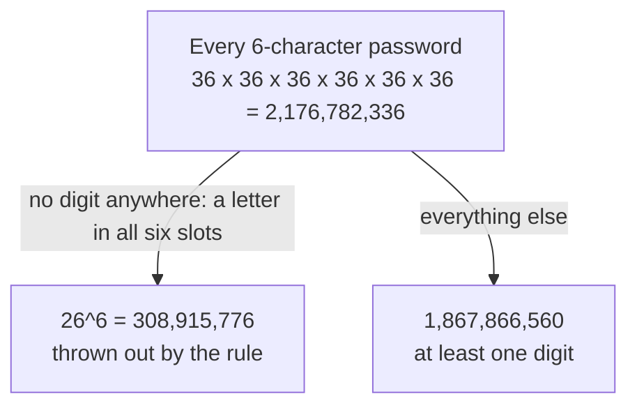

# Counting the complement: when 'at least one' is hard, count 'none' and subtract from everything

[Syllabus](../../../SYLLABUS.md) → [Combinatorics and graphs](../../../SYLLABUS.md#w04) → [Counting Principles](../../../SYLLABUS.md#w04-s01) → Counting the complement

---

## General Overview

A sign-up form asks for a password of exactly six characters. The keyboard offers 26 lowercase letters and 10 digits: 36 symbols for each of the six slots. One rule: the password must contain at least one digit. How many passwords pass?

The direct attack sorts passwords by how many digits they hold: one, two, three, up to six. Six separate counts, each needing the digit slots chosen as well as filled, then an addition.

The other attack ignores the rule first. Six slots, 36 symbols each: 36^6 = 2,176,782,336 passwords in all. Then it counts only the ones the rule throws out — no digit anywhere, a letter in every slot, 26^6 = 308,915,776. No password sits in both piles, so the rest pass. Subtract: 2,176,782,336 − 308,915,776 = **1,867,866,560**.

**Whatever a rule allows is the whole collection minus what the rule throws out, so when the thrown-out pile has the simpler description, count that pile and subtract.**

**What kind of fact this is:** a method, justified on this card in Why it works by the rule of sum.

### The picture: one pile or the other



The branches share no password and together hold every one, so either is the top box minus the other.

---

## The formula

Notation first, in words. A capital letter names a collection of objects; bars around it count them, so $\lvert S\rvert$ reads "how many objects are in S". A bar over a letter means "not": everything in the surrounding collection that the named set leaves out. That leftover set is the **complement** ([Set operations](../../01-Foundations/07-Sets/03-set-operations.md)), the word used from here on.

$$\lvert A\rvert = \lvert S\rvert - \lvert \overline{A}\rvert$$

**Read it aloud:** the objects a rule allows are everything, minus the objects the rule refuses.

| Symbol | Plain meaning | In our example | Push it up and the answer… |
| --- | --- | --- | --- |
| $S$ | the whole collection, rule ignored | every 6-character password, 2,176,782,336 | the allowed count rises one for one |
| $A$ | the objects the rule allows | passwords holding at least one digit | — |
| $\overline{A}$ | the complement: everything in $S$ that $A$ leaves out | letters-only passwords, 308,915,776 | the allowed count falls one for one |
| $\lvert A\rvert$ | bars count the objects inside | 1,867,866,560 | — |
| $n$ | symbols allowed in one slot | 36 in all, 26 of them letters | an extra letter raises both counts, an extra digit only the total |
| $k$ | slots to fill | 6 | one more slot multiplies the total by 36, the complement by 26 |

Both counts on the right are strings with repetition ([Strings with repetition](02-strings-and-powers.md)), one factor of $n$ per slot:

$$\lvert S\rvert = n^k = 36^6, \qquad \lvert \overline{A}\rvert = 26^6$$

The squad example below uses C(n, k), read "n choose k": the ways to take k things from n when order does not matter ([Combinations, n choose k](05-n-choose-k.md)).

### When it holds

- **The two piles must not overlap.** Every object fails the rule or passes it, never both. If the refused pile's description also catches allowed objects, those come off too and the answer is low.
- **Together they must be everything.** Total and complement must be counted over the same collection. Count the total over six-character passwords and the complement over five-character ones, and the subtraction means nothing.
- **"At least one" is the signal; its opposite is "none".** Not "one digit": "no digits". "At least two" has a two-part complement, "none" and "exactly one", so it needs two subtractions.
- **The complement has to be the cheaper count.** Where it is not, the method is still true and still useless: count the allowed pile directly.

---

## Why it works

### Step 0: every object answers the rule, once

Take one password, `mk4tzp`, and hold it against the rule. It carries a digit or it does not: no third reading. The whole method rests on that.

### Step 1: two piles that do not overlap add to the whole

When a collection splits into groups that cannot overlap, the group sizes add — the rule of sum ([The rules of sum and product](01-rules-of-sum-and-product.md)). Step 0 makes the allowed and refused piles such a split, so

$$\lvert A\rvert + \lvert \overline{A}\rvert = \lvert S\rvert$$

Move one term across and the method is finished: $\lvert A\rvert = \lvert S\rvert - \lvert \overline{A}\rvert$. Everything below is about which pile is cheaper to count.

### Step 2: why the refused pile is the cheap one

"No digit anywhere" settles the same thing about every slot: it holds a letter. Six slots, 26 letters each, 26^6. One count, done.

"At least one digit" settles nothing about any slot: the digit may sit anywhere, or in several places. Every pattern of digit-slots is its own count, and they must be added.

### Step 3: the hard road, walked once for comparison

Fix how many digits the password holds, exactly k of them. Choose which k of the six slots carry them, C(6, k) ways; fill those with digits, 10^k ways; fill the other 6 − k with letters, 26^(6−k) ways.

| Digits held | Slots chosen × digits × letters | Count |
| --- | --- | --- |
| exactly 1 | C(6,1) × 10 × 26^5 | 712,882,560 |
| exactly 2 | C(6,2) × 10^2 × 26^4 | 685,464,000 |
| exactly 3 | C(6,3) × 10^3 × 26^3 | 351,520,000 |
| exactly 4 | C(6,4) × 10^4 × 26^2 | 101,400,000 |
| exactly 5 | C(6,5) × 10^5 × 26 | 15,600,000 |
| exactly 6 | C(6,6) × 10^6 | 1,000,000 |
| all six added | | **1,867,866,560** |

Six products and five additions, against one subtraction.

<details>
<summary>Detailed proof: the six terms and the subtraction must agree</summary>

Build a password slot by slot. Each slot takes one of 26 letters or one of 10 digits, so the collection is a sixth power of a 36-way choice: 36^6 = (26 + 10)^6.

Expand that power by tracking which slots took the digit half. Pick the k slots that do, C(6, k) ways; each has 10 choices, 10^k; the other 6 − k have 26 each, 26^(6−k). Running k from 0 to 6 covers every password once, so

36^6 = C(6,0) × 26^6 + C(6,1) × 10 × 26^5 + C(6,2) × 10^2 × 26^4 + … + C(6,6) × 10^6.

The k = 0 term is 26^6, the letters-only pile. Take it off both sides and the six terms left are 36^6 − 26^6: one piece of arithmetic read in two directions. Expanding a power of a sum this way is the binomial theorem, stated in general later in this wing.

</details>

### Step 4: the same move on a squad

A football squad holds 20 players, two of them goalkeepers. How many starting elevens include at least one goalkeeper?

Every eleven that can be picked from 20 players: C(20, 11) = 167,960. The refused pile is the elevens with no goalkeeper, all 11 taken from the 18 outfield players: C(18, 11) = 31,824. Subtract: 136,136. Counted directly it would be two counts, exactly one goalkeeper and exactly two, then an addition.

When two features are forbidden at once, the refused piles can share objects, and subtracting each in turn removes the shared ones twice. The repair adds the overlap back, then takes out the triple overlaps, and so on: the alternating sum called inclusion and exclusion ([Inclusion-exclusion](../../01-Foundations/07-Sets/04-inclusion-exclusion.md)). This card is the one-feature case, where there is nothing to add back.

---

## Worked numbers, by hand

| Step | Arithmetic | Value |
| --- | --- | --- |
| every 6-character password | 36 × 36 × 36 × 36 × 36 × 36 | 2,176,782,336 |
| the complement, a letter in every slot | 26 × 26 × 26 × 26 × 26 × 26 | 308,915,776 |
| passwords holding at least one digit | 2,176,782,336 − 308,915,776 | **1,867,866,560** |
| share of all passwords the rule allows | 1,867,866,560 out of 2,176,782,336 | **85.81%** |
| every eleven from the 20-player squad | C(20,11) | 167,960 |
| the complement, elevens from the 18 outfielders | C(18,11) | 31,824 |
| elevens holding at least one goalkeeper | 167,960 − 31,824 | **136,136** |

The rule turns away 308,915,776 of the 2,176,782,336 passwords and keeps 85.81%; of the 167,960 elevens a manager could name, 136,136 already carry a goalkeeper.

### What breaks if you drop a piece

| Mistake | Comes out at | What went wrong |
| --- | --- | --- |
| Place one digit first, then fill the other five slots freely | 3,627,970,560 | A password with two digits is built twice, once from each digit; the answer beats the 2,176,782,336 that exist |
| Complement read as "exactly one digit" instead of "none" | 1,463,899,776 | The wrong pile came off: this keeps the letters-only passwords and drops the one-digit ones |
| Name a goalkeeper first, then pick ten from the other 19 | 184,756 | Elevens carrying both keepers are built twice; the answer beats the 167,960 that exist |

The code prints all three.

---

## Code, from first principles, and it actually runs

Nothing is imported; no library counts anything. The password answer is reached twice: by the subtraction, and by adding the six "exactly k digits" terms, which share no arithmetic with it. The method is then tested against plain listing: a toy question of the same shape — 3 letters, 2 digits, strings of 4 — has all 625 strings built one at a time, and the squad all 1,048,576 of its subsets.

### Python

```python
# Counting the complement -- the check behind the card.  Nothing is imported.  A
# 6-character password from 26 letters and 10 digits must carry at least one digit.
# The count is reached twice: the whole collection minus the letters-only passwords,
# and by adding the six "exactly k digits" terms.  A toy version is then listed string
# by string, and a 20-player squad subset by subset, against the same closed forms.
LETTERS, DIGITS, LENGTH = 26, 10, 6
SQUAD, PICK, KEEPERS = 20, 11, 2
TL, TD, TN = 3, 2, 4                       # toy size: 3 letters, 2 digits, length 4

def comb(n, k):                            # n choose k, multiplied out, nothing imported
    out = 1
    for i in range(k):
        out = out * (n - i) // (i + 1)
    return out

total = (LETTERS + DIGITS) ** LENGTH                       # every password
letters_only = LETTERS ** LENGTH                           # the complement: no digit
by_subtraction = total - letters_only                      # road one
terms = [comb(LENGTH, k) * DIGITS ** k * LETTERS ** (LENGTH - k) for k in range(1, LENGTH + 1)]
by_terms = sum(terms)                                      # road two: exactly k digits
share = 100 * by_subtraction / total

toy_all = toy_letters = 0
for code in range((TL + TD) ** TN):                        # every toy string, listed
    c, seen = code, False
    for _ in range(TN):
        seen, c = seen or c % (TL + TD) >= TL, c // (TL + TD)
    toy_all, toy_letters = toy_all + 1, toy_letters + (0 if seen else 1)
toy_listed = (toy_all, toy_letters, toy_all - toy_letters)
toy_closed = ((TL + TD) ** TN, TL ** TN, (TL + TD) ** TN - TL ** TN)

elevens = keeperless = 0
for mask in range(1 << SQUAD):                             # every subset of the squad, listed
    if bin(mask).count("1") == PICK:
        elevens, keeperless = elevens + 1, keeperless + (0 if mask & ((1 << KEEPERS) - 1) else 1)
squad_listed = (elevens, keeperless, elevens - keeperless)
squad_closed = (comb(SQUAD, PICK), comb(SQUAD - KEEPERS, PICK), comb(SQUAD, PICK) - comb(SQUAD - KEEPERS, PICK))
digit_first = LENGTH * DIGITS * (LETTERS + DIGITS) ** (LENGTH - 1)
keeper_first = KEEPERS * comb(SQUAD - 1, PICK - 1)

print(f"all 6-character passwords from 36 symbols: 36^6 = {total}")
print(f"passwords with no digit at all, 26 letters only: 26^6 = {letters_only}")
print(f"at least one digit, by subtraction: {total} - {letters_only} = {by_subtraction}")
print(f"at least one digit, by adding the six exact-count terms: {by_terms}")
print(f"exactly 1, 2, 3, 4, 5, 6 digits: {terms}")
print(f"share of all passwords the rule allows: {share:.2f}%")
print(f"toy question, 3 letters and 2 digits in strings of 4, every string listed: {toy_listed}")
print(f"the same toy counts from the closed forms: {toy_closed}")
print(f"every starting eleven from 20 players: C(20,11) = {squad_closed[0]}")
print(f"elevens with no goalkeeper, 11 from the other 18: C(18,11) = {squad_closed[1]}")
print(f"at least one goalkeeper, by subtraction: {squad_closed[0]} - {squad_closed[1]} = {squad_closed[2]}")
print(f"the same three counts by listing all {1 << SQUAD} subsets: {squad_listed}")
print(f"mistake 1, a digit placed first then the rest free: 6 x 10 x 36^5 = {digit_first}, over the {total} that exist")
print(f"mistake 2, complement read as exactly one digit: {total} - {terms[0]} = {total - terms[0]}")
print(f"mistake 3, a keeper placed first then ten from 19: 2 x C(19,10) = {keeper_first}, over the {squad_closed[0]} that exist")
assert by_subtraction == by_terms                  # subtraction against the six separate terms
assert toy_listed == toy_closed                    # 625 strings listed against the closed forms
assert squad_listed == squad_closed                # 1,048,576 subsets listed against C(n, k)
assert digit_first > total and keeper_first > squad_closed[0]    # both overcounts break their ceilings
print("ALL CHECKS PASS")
```

**Ran 2026-09-14 on macOS, Python 3.14.6, standard library only. All checks passed. Output, pasted from the run:**

```
all 6-character passwords from 36 symbols: 36^6 = 2176782336
passwords with no digit at all, 26 letters only: 26^6 = 308915776
at least one digit, by subtraction: 2176782336 - 308915776 = 1867866560
at least one digit, by adding the six exact-count terms: 1867866560
exactly 1, 2, 3, 4, 5, 6 digits: [712882560, 685464000, 351520000, 101400000, 15600000, 1000000]
share of all passwords the rule allows: 85.81%
toy question, 3 letters and 2 digits in strings of 4, every string listed: (625, 81, 544)
the same toy counts from the closed forms: (625, 81, 544)
every starting eleven from 20 players: C(20,11) = 167960
elevens with no goalkeeper, 11 from the other 18: C(18,11) = 31824
at least one goalkeeper, by subtraction: 167960 - 31824 = 136136
the same three counts by listing all 1048576 subsets: (167960, 31824, 136136)
mistake 1, a digit placed first then the rest free: 6 x 10 x 36^5 = 3627970560, over the 2176782336 that exist
mistake 2, complement read as exactly one digit: 2176782336 - 712882560 = 1463899776
mistake 3, a keeper placed first then ten from 19: 2 x C(19,10) = 184756, over the 167960 that exist
ALL CHECKS PASS
```

### Rust

Same numbers, same labels, built with `rustc --edition 2021 -O`.

```rust
// Counting the complement -- the same check as the Python, in Rust.  No crates.  A
// 6-character password from 26 letters and 10 digits must carry at least one digit.
// The count is reached twice: the whole collection minus the letters-only passwords,
// and by adding the six "exactly k digits" terms.  A toy version is then listed string
// by string, and a 20-player squad subset by subset, against the same closed forms.
const LETTERS: i64 = 26;
const DIGITS: i64 = 10;
const LENGTH: u32 = 6;
const SQUAD: i64 = 20;
const PICK: u32 = 11;
const KEEPERS: i64 = 2;
const TL: i64 = 3;                          // toy size: 3 letters, 2 digits, length 4
const TD: i64 = 2;
const TN: u32 = 4;

fn comb(n: i64, k: i64) -> i64 {            // n choose k, multiplied out, no crates
    let mut out = 1;
    for i in 0..k {
        out = out * (n - i) / (i + 1);
    }
    out
}

fn main() {
    let total = (LETTERS + DIGITS).pow(LENGTH);                  // every password
    let letters_only = LETTERS.pow(LENGTH);                      // the complement: no digit
    let by_subtraction = total - letters_only;                   // road one
    let terms: Vec<i64> = (1..=LENGTH)
        .map(|k| comb(LENGTH as i64, k as i64) * DIGITS.pow(k) * LETTERS.pow(LENGTH - k))
        .collect();
    let by_terms: i64 = terms.iter().sum();                      // road two: exactly k digits
    let share = 100.0 * by_subtraction as f64 / total as f64;

    let (mut toy_all, mut toy_letters) = (0i64, 0i64);
    for code in 0..(TL + TD).pow(TN) {                           // every toy string, listed
        let (mut c, mut seen) = (code, false);
        for _ in 0..TN {
            seen = seen || c % (TL + TD) >= TL;
            c /= TL + TD;
        }
        toy_all += 1;
        toy_letters += if seen { 0 } else { 1 };
    }
    let toy_listed = (toy_all, toy_letters, toy_all - toy_letters);
    let toy_closed = ((TL + TD).pow(TN), TL.pow(TN), (TL + TD).pow(TN) - TL.pow(TN));

    let (mut elevens, mut keeperless) = (0i64, 0i64);
    for mask in 0..(1u32 << SQUAD) {                             // every subset of the squad, listed
        if mask.count_ones() == PICK {
            elevens += 1;
            keeperless += if mask & ((1u32 << KEEPERS) - 1) != 0 { 0 } else { 1 };
        }
    }
    let squad_listed = (elevens, keeperless, elevens - keeperless);
    let squad_closed = (comb(SQUAD, PICK as i64), comb(SQUAD - KEEPERS, PICK as i64),
                        comb(SQUAD, PICK as i64) - comb(SQUAD - KEEPERS, PICK as i64));
    let digit_first = LENGTH as i64 * DIGITS * (LETTERS + DIGITS).pow(LENGTH - 1);
    let keeper_first = KEEPERS * comb(SQUAD - 1, PICK as i64 - 1);

    println!("all 6-character passwords from 36 symbols: 36^6 = {}", total);
    println!("passwords with no digit at all, 26 letters only: 26^6 = {}", letters_only);
    println!("at least one digit, by subtraction: {} - {} = {}", total, letters_only, by_subtraction);
    println!("at least one digit, by adding the six exact-count terms: {}", by_terms);
    println!("exactly 1, 2, 3, 4, 5, 6 digits: {:?}", terms);
    println!("share of all passwords the rule allows: {:.2}%", share);
    println!("toy question, 3 letters and 2 digits in strings of 4, every string listed: {:?}", toy_listed);
    println!("the same toy counts from the closed forms: {:?}", toy_closed);
    println!("every starting eleven from 20 players: C(20,11) = {}", squad_closed.0);
    println!("elevens with no goalkeeper, 11 from the other 18: C(18,11) = {}", squad_closed.1);
    println!("at least one goalkeeper, by subtraction: {} - {} = {}", squad_closed.0, squad_closed.1, squad_closed.2);
    println!("the same three counts by listing all {} subsets: {:?}", 1i64 << SQUAD, squad_listed);
    println!("mistake 1, a digit placed first then the rest free: 6 x 10 x 36^5 = {}, over the {} that exist", digit_first, total);
    println!("mistake 2, complement read as exactly one digit: {} - {} = {}", total, terms[0], total - terms[0]);
    println!("mistake 3, a keeper placed first then ten from 19: 2 x C(19,10) = {}, over the {} that exist", keeper_first, squad_closed.0);
    assert!(by_subtraction == by_terms);              // subtraction against the six separate terms
    assert!(toy_listed == toy_closed);                // 625 strings listed against the closed forms
    assert!(squad_listed == squad_closed);            // 1,048,576 subsets listed against C(n, k)
    assert!(digit_first > total && keeper_first > squad_closed.0);  // both overcounts break their ceilings
    println!("ALL CHECKS PASS");
}
```

**Ran 2026-09-14 on macOS, rustc 1.98.1, no crates. All checks passed. Output, pasted from the run:**

```
all 6-character passwords from 36 symbols: 36^6 = 2176782336
passwords with no digit at all, 26 letters only: 26^6 = 308915776
at least one digit, by subtraction: 2176782336 - 308915776 = 1867866560
at least one digit, by adding the six exact-count terms: 1867866560
exactly 1, 2, 3, 4, 5, 6 digits: [712882560, 685464000, 351520000, 101400000, 15600000, 1000000]
share of all passwords the rule allows: 85.81%
toy question, 3 letters and 2 digits in strings of 4, every string listed: (625, 81, 544)
the same toy counts from the closed forms: (625, 81, 544)
every starting eleven from 20 players: C(20,11) = 167960
elevens with no goalkeeper, 11 from the other 18: C(18,11) = 31824
at least one goalkeeper, by subtraction: 167960 - 31824 = 136136
the same three counts by listing all 1048576 subsets: (167960, 31824, 136136)
mistake 1, a digit placed first then the rest free: 6 x 10 x 36^5 = 3627970560, over the 2176782336 that exist
mistake 2, complement read as exactly one digit: 2176782336 - 712882560 = 1463899776
mistake 3, a keeper placed first then ten from 19: 2 x C(19,10) = 184756, over the 167960 that exist
ALL CHECKS PASS
```

The two outputs match line for line.

> [!TIP]
> **Try changing**
> Guess first, then run it. An assert is a line that stops the program when a number comes out wrong.
> - **Require at least one letter instead of a digit.** Set the first line to `LETTERS, DIGITS, LENGTH = 10, 26, 6`. The refused pile becomes the digits-only passwords, 1,000,000 — the number already printed as "exactly 6 digits" — and every assert still passes: the method never cared which feature was required.
> - **Subtract a pile that is not the complement.** Change `letters_only` to `LETTERS ** (LENGTH - 1)`. The six-term road does not move, so the first assert stops the program.
> - **Bar three named players rather than two.** Set `KEEPERS` to `3`: both squad roads follow and the run holds. Now change only the closed form, `SQUAD - KEEPERS` to `SQUAD - 2`, and the listing disagrees: the third assert stops it.

---

## The usual mistake

> [!warning]
> **Subtracting a pile that is not the complement.** The opposite of "at least one digit" is "no digit at all", and nothing else. Read it as "exactly one digit" and 712,882,560 comes off instead of 308,915,776, leaving 1,463,899,776 — which keeps the letters-only passwords it should have dropped and drops the one-digit ones it should have kept.
>
> - **Building the wanted object feature-first.** A slot chosen for a digit, then the other five filled freely, gives 6 × 10 × 36^5 = 3,627,970,560 — more than the 2,176,782,336 that exist, because `a1b2cd` is built once from the 1 and again from the 2.
> - **The squad version of the same slip.** Naming a goalkeeper and then picking ten from the remaining 19 gives 2 × C(19,10) = 184,756, against only 167,960 possible elevens: every eleven with both goalkeepers was built twice.
> - **A total counted over a different collection.** Total and complement must range over the same objects — same length, same alphabet, same squad — or the subtraction joins two unrelated numbers.

---

## Where you meet it in real life

- **Password rules.** "Must contain a digit", "must contain a symbol": the space a rule leaves is sized by counting the strings it refuses and subtracting.
- **Team and committee selection.** The squad question above, and every "the panel must include at least one X". The piles subtracted are the ordinary picks of this shelf, [Ordered picks](04-ordered-picks.md) and [Combinations, n choose k](05-n-choose-k.md).
- **Backups and spare parts.** "At least one of four drives survives the week" is counted by counting the ways all four fail and subtracting.

> **Say it back**
> Every object passes a rule or fails it, never both, so the two piles add to the whole collection. That turns a count into a subtraction: what a rule allows is everything minus what it refuses. "At least one" is the signal, because its opposite is the tidy "none". Six-character passwords needing a digit come to 36^6 − 26^6 = 1,867,866,560; starting elevens needing a goalkeeper come to C(20,11) − C(18,11) = 136,136. The trap is subtracting the wrong pile, or building wanted objects one feature at a time and counting some twice.

---

## What this builds on

- [Strings with repetition](02-strings-and-powers.md): the counts 36^6 and 26^6, one factor per slot.
- [Combinations, n choose k](05-n-choose-k.md): C(20,11) and C(18,11), the squad picks that get subtracted.
- [Set operations](../../01-Foundations/07-Sets/03-set-operations.md): the complement of a set, and why a set and its complement share nothing and cover everything.

## Where this goes next

- [Two classics](../../09-Probability%20and%20statistics/03-Discrete%20Distributions/07-birthday-and-coupon-collector.md): "at least two people share a birthday" counted as everything minus the arrangements where all the birthdays differ.

This card handles one forbidden feature, where the refused pile is a single clean set; what it leaves open is what to subtract when two forbidden features overlap and the objects caught by both would come off twice.

---

## Sources

Verified 14 Sep 2026: every link below resolves to the publisher's page.

- Brualdi, Richard A. *Introductory Combinatorics*, Classic Version, 5th ed. Pearson. [Publisher page](https://www.pearson.com/en-us/subject-catalog/p/introductory-combinatorics-classic-version/P200000006138/9780137981045). The method among the permutation and combination rules.
- Rosen, Kenneth H. *Discrete Mathematics and Its Applications*. McGraw Hill. [Publisher page](https://www.mheducation.com/highered/product/discrete-mathematics-and-its-applications-rosen.html). Its standard worked example of a complement subtraction: the password count with a required digit.
- Keller, Mitchel T., and William T. Trotter. *Applied Combinatorics*. [Strings, sets and binomial coefficients](https://www.appliedcombinatorics.org/book/ch_strings.html). Free and complete; the string counts this card subtracts.
- Keller, Mitchel T., and William T. Trotter. *Applied Combinatorics*. [Inclusion and exclusion](https://www.appliedcombinatorics.org/book/ch_inclusion-exclusion.html). The general case: more than one forbidden feature, refused piles that overlap.
