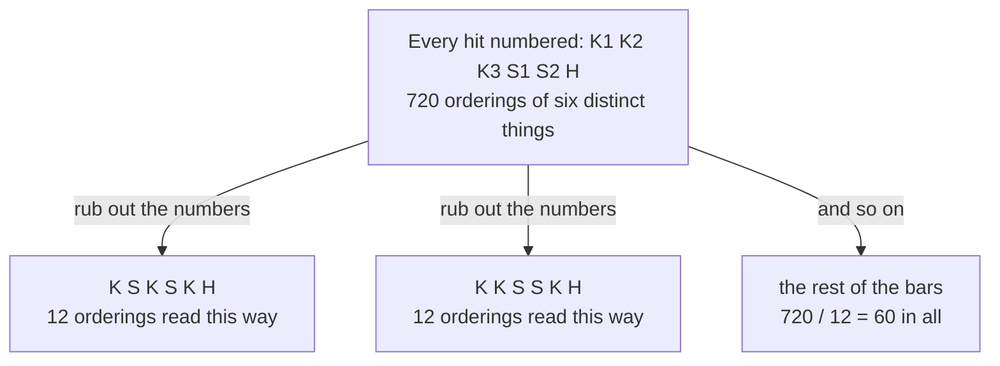

# Arranging with repeats: divide out the orderings of the identical copies

[Syllabus](../../../SYLLABUS.md) → [Combinatorics and graphs](../../../SYLLABUS.md#w04) → [Repeats, Groups and Double Counting](../../../SYLLABUS.md#w04-s02) → Arranging with repeats

---

## General Overview

A drum machine holds one bar of six slots. The kit is three kicks, two snares and one hat: six hits, every slot filled. How many different bars can that kit play?

Six things in a row make 6 × 5 × 4 × 3 × 2 × 1 = 720 orderings, the factorial of six ([Factorials](../01-Counting%20Principles/03-factorial.md)). That is the wrong answer here: swap the first kick with the third and the bar sounds as it did, so 720 counts each real bar several times over.

How many times? Once for each way of shuffling the three kicks among their own slots, 6 ways, times each way of shuffling the two snares, 2 ways, times the one way of placing the hat: 6 × 2 × 1 = 12. Twelve orderings per bar, so 720 orderings are 60 bars.

The same division scales up. MISSISSIPPI has eleven letters: one M, four I's, four S's, two P's. Give every letter a small number that tells the copies apart and the eleven make 11! = 39,916,800 lines, each real word answering to 4! × 4! × 2! = 1,152 of them. The distinct rearrangements number 39,916,800 / 1,152 = 34,650.

**Count the line as though every copy were distinct, then divide once by the orderings inside each block of identical copies.**

**What kind of fact this is:** a theorem, proved on this card in Why it works.

### The picture: 720 numbered orderings, 60 bars



Rubbing out the numbers sends 720 orderings onto 60 bars, twelve onto each.

---

## The formula

Two pieces of notation, both from the shelf before. The factorial $n!$ means $n$ × ($n$ − 1) × … × 1, the number of orderings of $n$ distinct things ([Factorials](../01-Counting%20Principles/03-factorial.md)). The binomial coefficient $C(n, k)$, read "n choose k", counts the ways of picking k positions out of $n$, order ignored ([Combinations, n choose k](../01-Counting%20Principles/05-n-choose-k.md)).

Let the line hold $n$ items of $m$ kinds: $a_1$ copies of the first kind, $a_2$ of the second, and so on to $a_m$ of the last, the copies together filling the line, so that $a_1$ + $a_2$ + … + $a_m$ = $n$.

$$\text{distinct arrangements} \;=\; \frac{n!}{a_1!\,a_2!\cdots a_m!}$$

Books call this number the multinomial coefficient.

**Read it aloud:** all the orderings of the line, divided once by the orderings inside each block of identical copies.

| Symbol | Plain meaning | In our example | Push it up and the answer… |
| --- | --- | --- | --- |
| $n$ | how many items stand in the line | 11 letters; 6 drum slots | climbs fast: one more letter multiplies the count |
| $m$ | how many kinds of item | 4 kinds of letter; 3 drum sounds | climbs, since the same $n$ splits into smaller blocks |
| $a_1$, $a_2$, …, $a_m$ | copies of each kind, adding to $n$ | 1, 4, 4, 2; 3, 2, 1 | falls: a fatter block hides more orderings |
| $n!$ | the orderings of $n$ distinct things | 11! = 39,916,800 | — |
| $a_1!$, …, $a_m!$ | the orderings inside one block | 4! = 24, 2! = 2 | falls, one division at a time |
| $C(n, k)$ | ways of choosing k of the $n$ positions | C(10, 4) = 210 | — |

### When it holds

- **The copies in a block are interchangeable.** Number every letter, so that swapping two P's makes a new word, and the count goes back to 39,916,800.
- **The counts fill the line exactly:** 1 + 4 + 4 + 2 = 11. Leave slots empty and the empties are a kind of their own: count them in, or the answer is for a shorter line.
- **The positions are distinguishable**, eleven places in a row, each its own. Bend the line into a loop and rotations become the same arrangement, a smaller count: [Round tables and bracelets](04-circular-arrangements.md).
- **Order along the line is what is counted.** If two lines count as the same thing whenever they use the same letters, there is nothing to count and the answer is 1.

---

## Why it works

### Step 0: number the copies, count, then rub the numbers out

An identical copy is the whole difficulty. Paint a small number on each and it goes away: six distinct hits, eleven distinct letters, a plain factorial. Rubbing the numbers out afterwards is where the division comes from.

### Step 1: numbered, the count is a factorial

Six numbered hits fill six slots in 720 ways. Eleven numbered letters fill eleven places in 11! = 39,916,800 ways. Nothing repeats yet, so nothing is overcounted yet.

### Step 2: each real bar answers to exactly twelve numbered orderings

Fix one bar: kick, snare, kick, snare, kick, hat. Its kick slots are the first, third and fifth. The three numbered kicks spread over them in 3! = 6 ways, the two snares over their two slots in 2! = 2 ways, independently.

| The three kicks, over slots 1, 3, 5 | The two snares, over slots 2, 4 |
| --- | --- |
| K1 K2 K3, K1 K3 K2, K2 K1 K3 | S1 S2 |
| K2 K3 K1, K3 K1 K2, K3 K2 K1 | S2 S1 |

Six kick numberings times two snare numberings times the one hat: 6 × 2 × 1 = 12 numbered orderings, all reading kick, snare, kick, snare, kick, hat. The argument works from any bar, so every bar answers to twelve.

### Step 3: equal groups can be divided

Sort the 720 numbered orderings into groups, one per bar. Every group holds exactly 12, nothing sits in two groups, nothing is left over. So the groups number 720 / 12 = 60. Cutting a set into equal blocks and dividing is the move this shelf is built on ([Bijections and double counting](05-bijection-and-double-counting.md)).

For MISSISSIPPI the group size is 4! × 4! × 2! = 1,152, and 39,916,800 / 1,152 = 34,650.

### Step 4: the same answer without any numbering

Nothing forces the copies to be numbered. Place one kind at a time instead. Choose which 3 of the 6 slots take kicks: C(6, 3) = 20 ways. Of the 3 slots left, choose 2 for snares: C(3, 2) = 3. The hat takes the last slot: C(1, 1) = 1. Multiply: 20 × 3 × 1 = 60.

MISSISSIPPI the same way: C(11, 1) × C(10, 4) × C(6, 4) × C(2, 2) = 11 × 210 × 15 × 1 = 34,650. Two roads, one answer.

<details>
<summary>Detailed proof</summary>

**Claim.** A line of $n$ items of $m$ kinds, with $a_1$ + $a_2$ + … + $a_m$ = $n$ copies, has $n!/(a_1!\,a_2!\cdots a_m!)$ distinct arrangements.

**Numbering road.** Number the copies of kind 1 from 1 to $a_1$, and likewise for each kind. All $n$ items are now distinct, so the numbered lines number $n!$, and rubbing the numbers out sends each to one arrangement.

Fix an arrangement. It fixes which positions hold kind 1, and the $a_1$ numbers spread over them in $a_1!$ ways, independently of every other kind. So the numbered lines rubbing out to it number $a_1!\,a_2!\cdots a_m!$, whatever the arrangement. They split into groups of that one size, one per arrangement, hence (arrangements) × $a_1!\,a_2!\cdots a_m!$ = $n!$, the claim.

**Position road.** Choose the $a_1$ positions for kind 1, then the $a_2$ positions for kind 2 from what is left, and so on:
$$C(n, a_1)\,C(n - a_1, a_2)\cdots C(a_m, a_m) = \frac{n!}{a_1!\,(n-a_1)!}\cdot\frac{(n-a_1)!}{a_2!\,(n-a_1-a_2)!}\cdots\frac{a_m!}{a_m!\,0!}$$
Each numerator cancels the denominator before it, the last leftover being 0! = 1. What survives is $n!/(a_1!\,a_2!\cdots a_m!)$, the same number by a road that never numbered anything.

</details>

A third road runs through algebra. Multiply (K + S + H) by itself six times and collect terms: the number in front of the term carrying three K's, two S's and one H is 60, since that term is built once per bar. Reading counts off a product is what [Exponential generating functions](../07-Generating%20Functions/04-exponential-generating-functions.md) are built for.

---

## Worked numbers, by hand

MISSISSIPPI, letter by letter.

| Step | Arithmetic | Value |
| --- | --- | --- |
| the letters counted | M 1, I 4, S 4, P 2 | 11 |
| all eleven, numbered | 11! | 39,916,800 |
| inside the I block | 4! | 24 |
| inside the S block | 4! | 24 |
| inside the P block | 2! | 2 |
| one word, counted over | 24 × 24 × 2 | 1,152 |
| distinct words | 39,916,800 / 1,152 | **34,650** |

The drum bar in one line: 720 / (6 × 2 × 1) = 720 / 12 = **60**.

A word puzzle on MISSISSIPPI therefore has 34,650 answers, and that drum kit holds 60 bars.

### What breaks if you drop a piece

| Mistake | Comes out at | What went wrong |
| --- | --- | --- |
| No division at all | 39,916,800 | Counts the four S's as four different letters |
| Dividing by 4! and 4!, but not 2! | 69,300 | Exactly twice the truth: the two P's still swap |
| Dividing by 4! + 4! + 2! = 50 | 798,336 | The blocks multiply, they do not add |
| Counting only where the S's go, C(11, 4) | 330 | Places one kind and leaves the other seven letters unplaced |

The code prints all four.

---

## Code, from first principles, and it actually runs

Nothing is imported. Each count is reached three ways that share no arithmetic: the factorial formula; a product of binomial coefficients from Pascal's triangle, built by addition alone and never dividing; and a listing that builds every distinct arrangement one at a time. A second worked case counts the shortest routes across a street grid.

### Python

```python
# Arranging with repeats -- the check behind the card.  Nothing is imported.
# Two lines that repeat: a six-slot drum bar of 3 kicks, 2 snares and 1 hat,
# and the eleven letters of MISSISSIPPI.  Each count is reached three ways that
# share no arithmetic: the factorial formula, a product of binomial
# coefficients built by addition alone, and a listing of the arrangements.
DRUM, WORD = (3, 2, 1), (1, 4, 4, 2)
def factorial(m):                             # road one's only ingredient
    out = 1
    for i in range(2, m + 1):
        out *= i
    return out
def by_formula(counts):                       # road one: n! divided by each block
    out = factorial(sum(counts))
    for a in counts:
        out //= factorial(a)
    return out
def choose(n, k):                             # Pascal's triangle: addition only
    row = [1]
    for _ in range(n):
        row = [1] + [row[i] + row[i + 1] for i in range(len(row) - 1)] + [1]
    return row[k]
def by_positions(counts):                     # road two: one kind's places at a time
    left, steps, out = sum(counts), [], 1
    for a in counts:
        steps.append(choose(left, a))
        out *= steps[-1]
        left -= a
    return out, steps
def by_listing(counts):                       # road three: build every arrangement
    if sum(counts) == 0:
        return 1
    return sum(by_listing(counts[:i] + (a - 1,) + counts[i + 1:])
               for i, a in enumerate(counts) if a)

drum_p, drum_s = by_positions(DRUM)
word_p, word_s = by_positions(WORD)
inside_drum, inside_word = factorial(3) * factorial(2) * factorial(1), factorial(4) ** 2 * factorial(2)
no_division, by_sum = factorial(11), factorial(4) + factorial(4) + factorial(2)
one_block = no_division // (factorial(4) * factorial(4))
print(f"factorials in play: 2! = {factorial(2)}, 3! = {factorial(3)}, 4! = {factorial(4)}, 6! = {factorial(6)}, 11! = {no_division}")
print("drum bar, 6 slots: 3 kicks, 2 snares, 1 hat")
print(f"  numbered orderings {factorial(6)}, each bar counted 3! x 2! x 1! = {inside_drum} times, {factorial(6)} / {inside_drum} = {by_formula(DRUM)}")
print(f"  road 2, one kind at a time: C(6,3) x C(3,2) x C(1,1) = {drum_s[0]} x {drum_s[1]} x {drum_s[2]} = {drum_p}")
print(f"  road 3, distinct bars built one by one: {by_listing(DRUM)}")
print("MISSISSIPPI, 11 letters: M 1, I 4, S 4, P 2")
print(f"  numbered orderings {no_division}, each word counted 4! x 4! x 2! = {inside_word} times, {no_division} / {inside_word} = {by_formula(WORD)}")
print(f"  road 2, one kind at a time: C(11,1) x C(10,4) x C(6,4) x C(2,2) = {word_s[0]} x {word_s[1]} x {word_s[2]} x {word_s[3]} = {word_p}")
print(f"  road 3, distinct words built one by one: {by_listing(WORD)}")
print(f"grid paths, 5 steps right and 3 steps up: 8! / (5! 3!) = {by_formula((5, 3))}, and C(8,3) = {choose(8, 3)}")
print(f"mistake 1, no division at all: {no_division}")
print(f"mistake 2, the two P's left undivided: {one_block}")
print(f"mistake 3, dividing by 4! + 4! + 2! = {by_sum}: {no_division // by_sum}")
print(f"mistake 4, counting only where the four S's go, C(11,4): {choose(11, 4)}")
print(f"try changing: 3 kicks and 3 snares gives {by_formula((3, 3))}; a second M in MISSISSIPPI gives {by_formula((2, 4, 4, 2))}")
assert by_formula(DRUM) == drum_p == by_listing(DRUM) == 60          # three roads, one bar
assert by_formula(WORD) == word_p == by_listing(WORD) == 34650       # the same three roads
assert one_block == 2 * by_formula(WORD) == 69300                    # dropping 2! double counts
assert by_formula((5, 3)) == choose(8, 3) == 56                      # formula meets Pascal
print("ALL CHECKS PASS")
```

**Ran 2026-09-14 on macOS, Python 3.14.6, standard library only. All checks passed. Output, pasted from the run:**

```
factorials in play: 2! = 2, 3! = 6, 4! = 24, 6! = 720, 11! = 39916800
drum bar, 6 slots: 3 kicks, 2 snares, 1 hat
  numbered orderings 720, each bar counted 3! x 2! x 1! = 12 times, 720 / 12 = 60
  road 2, one kind at a time: C(6,3) x C(3,2) x C(1,1) = 20 x 3 x 1 = 60
  road 3, distinct bars built one by one: 60
MISSISSIPPI, 11 letters: M 1, I 4, S 4, P 2
  numbered orderings 39916800, each word counted 4! x 4! x 2! = 1152 times, 39916800 / 1152 = 34650
  road 2, one kind at a time: C(11,1) x C(10,4) x C(6,4) x C(2,2) = 11 x 210 x 15 x 1 = 34650
  road 3, distinct words built one by one: 34650
grid paths, 5 steps right and 3 steps up: 8! / (5! 3!) = 56, and C(8,3) = 56
mistake 1, no division at all: 39916800
mistake 2, the two P's left undivided: 69300
mistake 3, dividing by 4! + 4! + 2! = 50: 798336
mistake 4, counting only where the four S's go, C(11,4): 330
try changing: 3 kicks and 3 snares gives 20; a second M in MISSISSIPPI gives 207900
ALL CHECKS PASS
```

### Rust

Same numbers, same labels, built with `rustc --edition 2021 -O`.

```rust
// Arranging with repeats -- the same check as the Python, in Rust.  No crates.
// Two lines that repeat: a six-slot drum bar of 3 kicks, 2 snares and 1 hat,
// and the eleven letters of MISSISSIPPI.  Each count is reached three ways that
// share no arithmetic: the factorial formula, a product of binomial
// coefficients built by addition alone, and a listing of the arrangements.
const DRUM: [u64; 3] = [3, 2, 1];
const WORD: [u64; 4] = [1, 4, 4, 2];
fn factorial(m: u64) -> u64 {                 // road one's only ingredient
    let mut out = 1;
    for i in 2..=m { out *= i }
    out
}
fn by_formula(counts: &[u64]) -> u64 {        // road one: n! divided by each block
    let mut out = factorial(counts.iter().sum());
    for &a in counts { out /= factorial(a) }
    out
}
fn choose(n: u64, k: usize) -> u64 {          // Pascal's triangle: addition only
    let mut row = vec![0u64; n as usize + 1];
    row[0] = 1;
    for r in 1..=n as usize {
        for i in (1..=r).rev() { row[i] += row[i - 1] }
    }
    row[k]
}
fn by_positions(counts: &[u64]) -> (u64, Vec<u64>) {   // road two: one kind's places at a time
    let (mut left, mut steps, mut out) = (counts.iter().sum::<u64>(), Vec::new(), 1);
    for &a in counts {
        steps.push(choose(left, a as usize));
        out *= steps[steps.len() - 1];
        left -= a;
    }
    (out, steps)
}
fn by_listing(counts: &mut Vec<u64>) -> u64 { // road three: build every arrangement
    if counts.iter().all(|&a| a == 0) { return 1 }
    let mut out = 0;
    for i in 0..counts.len() {
        if counts[i] > 0 {
            counts[i] -= 1; out += by_listing(counts); counts[i] += 1;
        }
    }
    out
}
fn main() {
    let (drum_p, drum_s) = by_positions(&DRUM);
    let (word_p, word_s) = by_positions(&WORD);
    let (inside_drum, inside_word) = (factorial(3) * factorial(2) * factorial(1), factorial(4) * factorial(4) * factorial(2));
    let (no_division, by_sum) = (factorial(11), factorial(4) + factorial(4) + factorial(2));
    let one_block = no_division / (factorial(4) * factorial(4));
    let (drum_l, word_l) = (by_listing(&mut DRUM.to_vec()), by_listing(&mut WORD.to_vec()));
    println!("factorials in play: 2! = {}, 3! = {}, 4! = {}, 6! = {}, 11! = {}",
             factorial(2), factorial(3), factorial(4), factorial(6), no_division);
    println!("drum bar, 6 slots: 3 kicks, 2 snares, 1 hat");
    println!("  numbered orderings {}, each bar counted 3! x 2! x 1! = {} times, {} / {} = {}",
             factorial(6), inside_drum, factorial(6), inside_drum, by_formula(&DRUM));
    println!("  road 2, one kind at a time: C(6,3) x C(3,2) x C(1,1) = {} x {} x {} = {}",
             drum_s[0], drum_s[1], drum_s[2], drum_p);
    println!("  road 3, distinct bars built one by one: {}", drum_l);
    println!("MISSISSIPPI, 11 letters: M 1, I 4, S 4, P 2");
    println!("  numbered orderings {}, each word counted 4! x 4! x 2! = {} times, {} / {} = {}",
             no_division, inside_word, no_division, inside_word, by_formula(&WORD));
    println!("  road 2, one kind at a time: C(11,1) x C(10,4) x C(6,4) x C(2,2) = {} x {} x {} x {} = {}",
             word_s[0], word_s[1], word_s[2], word_s[3], word_p);
    println!("  road 3, distinct words built one by one: {}", word_l);
    println!("grid paths, 5 steps right and 3 steps up: 8! / (5! 3!) = {}, and C(8,3) = {}",
             by_formula(&[5, 3]), choose(8, 3));
    println!("mistake 1, no division at all: {}", no_division);
    println!("mistake 2, the two P's left undivided: {}", one_block);
    println!("mistake 3, dividing by 4! + 4! + 2! = {}: {}", by_sum, no_division / by_sum);
    println!("mistake 4, counting only where the four S's go, C(11,4): {}", choose(11, 4));
    println!("try changing: 3 kicks and 3 snares gives {}; a second M in MISSISSIPPI gives {}",
             by_formula(&[3, 3]), by_formula(&[2, 4, 4, 2]));
    assert!(by_formula(&DRUM) == drum_p && drum_p == drum_l && drum_l == 60);
    assert!(by_formula(&WORD) == word_p && word_p == word_l && word_l == 34650);
    assert!(one_block == 2 * by_formula(&WORD) && one_block == 69300);
    assert!(by_formula(&[5, 3]) == choose(8, 3) && choose(8, 3) == 56);
    println!("ALL CHECKS PASS");
}
```

**Ran 2026-09-14 on macOS, rustc 1.98.1, no crates. All checks passed. Output, pasted from the run:**

```
factorials in play: 2! = 2, 3! = 6, 4! = 24, 6! = 720, 11! = 39916800
drum bar, 6 slots: 3 kicks, 2 snares, 1 hat
  numbered orderings 720, each bar counted 3! x 2! x 1! = 12 times, 720 / 12 = 60
  road 2, one kind at a time: C(6,3) x C(3,2) x C(1,1) = 20 x 3 x 1 = 60
  road 3, distinct bars built one by one: 60
MISSISSIPPI, 11 letters: M 1, I 4, S 4, P 2
  numbered orderings 39916800, each word counted 4! x 4! x 2! = 1152 times, 39916800 / 1152 = 34650
  road 2, one kind at a time: C(11,1) x C(10,4) x C(6,4) x C(2,2) = 11 x 210 x 15 x 1 = 34650
  road 3, distinct words built one by one: 34650
grid paths, 5 steps right and 3 steps up: 8! / (5! 3!) = 56, and C(8,3) = 56
mistake 1, no division at all: 39916800
mistake 2, the two P's left undivided: 69300
mistake 3, dividing by 4! + 4! + 2! = 50: 798336
mistake 4, counting only where the four S's go, C(11,4): 330
try changing: 3 kicks and 3 snares gives 20; a second M in MISSISSIPPI gives 207900
ALL CHECKS PASS
```

The two outputs match line for line.

> [!TIP]
> **Try changing**
> Guess first, then run it. The asserts are pinned to the bar and the word, so expect one to stop it.
> - **Make the hat a third snare.** Set `DRUM` to `(3, 3)`: two blocks of three, a bigger divisor than 12, and 20 bars. The first assert stops it.
> - **Give MISSISSIPPI a second M.** Set `WORD` to `(2, 4, 4, 2)`: twelve letters, 207,900 words. The second assert stops it.
> - **Drop one division.** Stop the formula road dividing by the P block and the count doubles to 69,300, the second row of the what-breaks table.

---

## The usual mistake

> [!warning]
> **Dividing by the number of repeated letters instead of by each block's factorial.** Counting the repeated letters in MISSISSIPPI and dividing 39,916,800 once by that total is not the answer. The divisor is 4! for the I's times 4! for the S's times 2! for the P's: 1,152, giving 34,650.
>
> - **Adding the blocks instead of multiplying.** 4! + 4! + 2! = 50 gives 798,336. Each block's shuffles combine with every other block's, and combining is multiplying.
> - **Forgetting the smallest block.** Dividing by 4! and 4! alone gives 69,300, exactly double, because the two P's are still being told apart.
> - **Stopping after one kind.** C(11, 4) = 330 places the four S's and leaves seven letters in a heap.

---

## Where you meet it in real life

- **Drum machines and rhythm.** Three kicks, two snares and a hat in a six-slot bar give 60 patterns — a space small enough to hear end to end.
- **Anagrams and word puzzles.** The distinct rearrangements of a word are this count: 34,650 for MISSISSIPPI, against 39,916,800 were every letter unique.
- **Routes across a street grid.** Five blocks east and three north: every shortest route is a line of five E's and three N's, so 8! / (5! 3!) = 56 routes. Positions, not letters, the same division.
- **Shuffling a deck with identical cards.** The different-looking shuffles are this count; drawing one at random is Fair choices from a list you cannot hold.
- **Dealing into named piles.** Handing 11 tasks to 4 people in fixed numbers is the same arithmetic from the pile side: [Splitting into groups](03-splitting-into-groups.md).

> **Say it back**
> Identical copies make a plain factorial count too big. Number the copies, count the numbered lines, then rub the numbers out: each real arrangement answers to one group of numbered lines, and every group is the same size — the orderings inside each block, multiplied together. Equal groups can be divided, so the count is the factorial of the line divided by the factorial of each block. Three kicks, two snares and a hat give 720 / 12 = 60 bars; MISSISSIPPI gives 39,916,800 / 1,152 = 34,650 words. Choosing positions one kind at a time returns the same two numbers.

---

## What this builds on

- [Factorials](../01-Counting%20Principles/03-factorial.md): the count of orderings when everything is distinct — the number this card divides.
- [Combinations, n choose k](../01-Counting%20Principles/05-n-choose-k.md): choosing positions for one kind, which is the second road to the same answer.

## Where this goes next

- [Stars and bars](02-stars-and-bars.md): counts how many ways the block sizes themselves can be chosen.
- [Splitting into groups](03-splitting-into-groups.md): the same division applied to piles rather than a line, and what changes when the piles have no names.
- [Exponential generating functions](../07-Generating%20Functions/04-exponential-generating-functions.md): the same counts read off a product instead of assembled by hand.
- Fair choices from a list you cannot hold: drawing one arrangement at random, all of them equally likely.

Every count here started from block sizes handed over in advance: three kicks, two snares, one hat. How many ways those sizes could have been chosen is [Stars and bars](02-stars-and-bars.md).

---

## Sources

Verified 14 Sep 2026: every link below resolves to the publisher's page.

- Brualdi, Richard A. *Introductory Combinatorics* (Classic Version), 5th ed. Pearson. [Publisher page](https://www.pearson.com/en-us/subject-catalog/p/introductory-combinatorics-classic-version/P200000006138/9780137981045). Chapter 2 sets out permutations of multisets and proves the division.
- Graham, Ronald L., Donald E. Knuth, and Oren Patashnik. *Concrete Mathematics: A Foundation for Computer Science*, 2nd ed. Addison-Wesley. [Publisher page](https://www.informit.com/store/concrete-mathematics-a-foundation-for-computer-science-9780201558029). Chapter 5 treats this count as the multinomial coefficient.
- Knuth, Donald E. *The Art of Computer Programming, Volume 4A: Combinatorial Algorithms, Part 1*. Addison-Wesley. [Publisher page](https://www.informit.com/store/art-of-computer-programming-volume-4a-combinatorial-algorithms-9780201038040). Section 7.2.1.2 generates the arrangements of a multiset one at a time, the code's third road.
