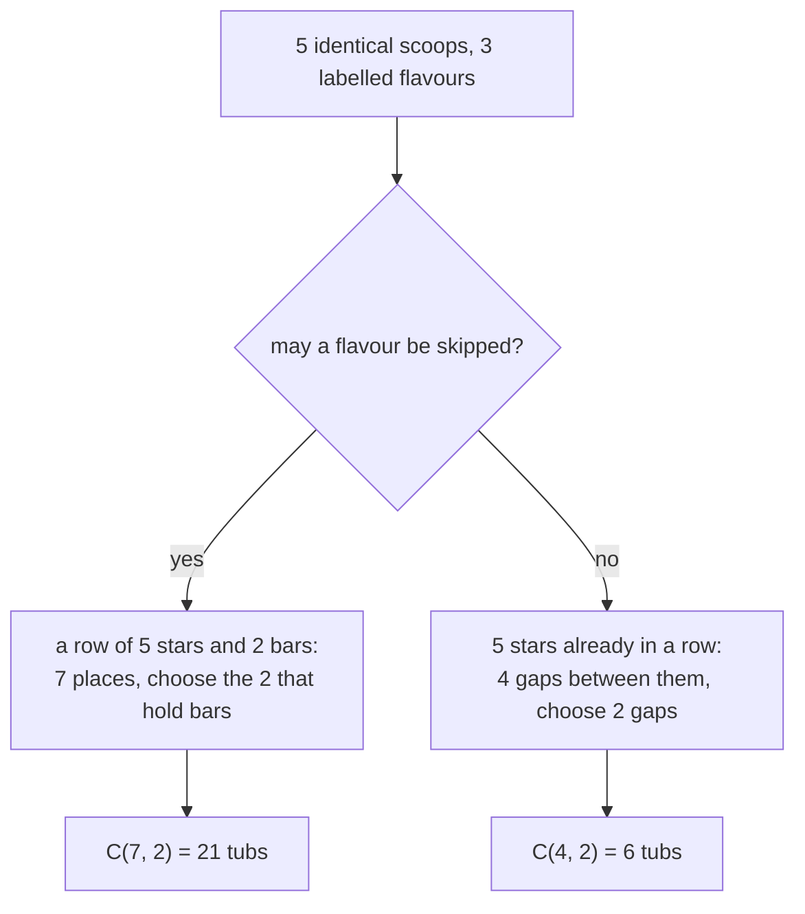

# Stars and bars: identical items into labelled boxes, counted by placing dividers

[Syllabus](../../../SYLLABUS.md) → [Combinatorics and graphs](../README.md) → [Repeats, Groups and Double Counting](../README.md#s02) → Stars and bars

---

## General Overview

A gelato counter sells three flavours: vanilla, pistachio, chocolate. A tub takes five scoops. Scoops of one flavour are identical and the order goes unrecorded, so a tub is three counts: how much vanilla, how much pistachio, how much chocolate. How many tubs are there?

Writing them all out gives 21, but stops being practical at eight flavours.

Here is a move that does not stop. Draw the five scoops as marks in a row, then drop two dividers in. Marks before the first divider are vanilla, marks between the dividers are pistachio, marks after the second are chocolate. Two dividers, never three: three flavours have two walls between them.

Every tub draws one such row, and every row reads back as one tub. Counting tubs is therefore counting rows, and a row is seven places with two of them holding dividers. Choosing which two is an ordinary choose count: 21 again.

The marks are called **stars** and the dividers **bars**, the names used from here on.

**Sharing identical items among labelled boxes is the same job as choosing where the dividers sit in a row of items and dividers.**

**What kind of fact this is:** a theorem, proved on this card in Why it works by matching the two collections one to one.

### Four of the twenty-one tubs

| The row | Vanilla | Pistachio | Chocolate |
| --- | --- | --- | --- |
| `*****\|\|` | 5 | 0 | 0 |
| `**\|\|***` | 2 | 0 | 3 |
| `\|*****\|` | 0 | 5 | 0 |
| `*\|**\|**` | 1 | 2 | 2 |

Bars side by side skip the flavour between them; a bar at an end skips an end flavour.

### The picture: one row, two questions



Deciding which branch is asked is half the work.

---

## The formula

One reminder first. $C(m, r)$, read "m choose r", counts the ways to pick r things out of m when the order of the pick does not matter ([Combinations, n choose k](../01-Counting%20Principles/05-n-choose-k.md)).

Write $n$ for the identical items and $k$ for the labelled boxes. With empty boxes allowed:

$$\text{ways} = C(n + k - 1,\ k - 1)$$

**Read it aloud:** lay the items in a row, add one bar fewer than there are boxes, and choose which places in the row hold the bars.

Five scoops across three flavours: C(5 + 3 − 1, 3 − 1) = C(7, 2) = 21.

Now the other question: twelve identical tins on three labelled shelves, no shelf left bare.

$$\text{ways, no box empty} = C(n - 1,\ k - 1)$$

**Read it aloud:** with the items already in a row, put the bars into the gaps between them, at most one to a gap.

Twelve tins on three shelves: C(12 − 1, 3 − 1) = C(11, 2) = 55.

| Symbol | Plain meaning | In our example | Push it up and the answer… |
| --- | --- | --- | --- |
| $n$ | identical items to share out | 5 scoops; 12 tins | rises, and fast |
| $k$ | labelled boxes receiving them | 3 flavours; 3 shelves | rises too |
| $C(m, r)$ | ways to pick r of m, order ignored | C(7, 2) = 21 | — |
| $k - 1$ | the bars: one fewer than the boxes | 2 bars | more ways to cut |
| $n + k - 1$ | places in the row, stars and bars | 7 places | — |
| $n - 1$ | gaps between items, for no empty box | 11 for the tins | — |

### When it holds

- **The items are identical.** Only the count in each box matters; tell the scoops apart and each picks its own flavour, a far larger count.
- **The boxes are labelled.** (2, 0, 3) and (3, 0, 2) are two tubs. Strip the labels and 21 tubs collapse to 5 shapes: [Integer partitions](../08-Partitions/01-integer-partitions.md), not this count.
- **No box has a ceiling.** One flavour may take all five scoops; cap a box at 3 and the formula counts too many.
- **Empty or not, decided before counting.** Empties allowed gives 21, every flavour used gives 6, and neither substitutes for the other. No-empty also needs items enough to go round: with fewer items than boxes there is no way at all.

---

## Why it works

### Step 0: write the answer down instead of counting it

A tub is an outcome; a row of stars and bars is a piece of writing. Everything rests on one point: the writing carries exactly as much information as the outcome. Counting writings then counts outcomes, and writings are easy to count.

### Step 1: the match runs both ways

Going out: write a tub's vanilla scoops as stars, a bar, its pistachio scoops, a bar, then its chocolate scoops. `(2, 0, 3)` becomes `**||***`.

Coming back: read the stars before the first bar, between the bars, and after the last. `*|**|**` is 1 vanilla, 2 pistachio, 2 chocolate.

Neither direction loses or invents anything, and the two undo each other, so the collections are the same size. Matching to count is this shelf's standard move, set out on [Bijections and double counting](05-bijection-and-double-counting.md).

### Step 2: counting the rows is a choose

A row holds 5 stars and 2 bars, so it is 7 places long. Fix which 2 hold bars and the row is settled: the rest hold stars. The rows number C(7, 2) = 21, so the tubs do too. In general the row is $n + k - 1$ places long and holds $k - 1$ bars: the first formula.

One more route skips the row entirely. Fix the chocolate at 0, then 1, up to 5; the rest splits between two flavours in 6, 5, 4, 3, 2 and 1 ways, adding to 21.

### Step 3: when no box may be empty, hand out one item first

Twelve tins, three shelves, none bare. Put one tin on each shelf before counting. Nine are left and the shelves are already safe, so share those nine with empties allowed: C(9 + 3 − 1, 2) = C(11, 2) = 55.

A second picture agrees. Stand the twelve tins in a row: 11 gaps between neighbours. Put the 2 bars into different gaps, none at an end, and every shelf keeps a tin: C(11, 2) = 55. That is the second formula.

<details>
<summary>Detailed proof: the same match, written formally</summary>

Write $n$ for the items and $k$ for the boxes, and number the row's places 1 up to $n + k - 1$. Choose $k - 1$ of those numbers as bar places and write them in order as $b_1 < \cdots < b_{k-1}$. Set $b_0 = 0$ in front and $b_k = n + k$ behind, and take box i's contents to be

$$x_i = b_i - b_{i-1} - 1 \qquad i = 1, 2, \ldots, k$$

the distance between its two boundary numbers, less one for the boundary itself. Each is 0 or more since the boundaries increase, and adding all k cancels every interior boundary, leaving $n$. Going back, put a bar after the stars of each of the first $k - 1$ boxes. The two constructions undo each other, so the fillings number $C(n + k - 1, k - 1)$; removing one item from every box first turns the no-empty count into $C(n - 1, k - 1)$.

</details>

### Step 4: an ordered sum of a number is the same picture

Write 6 as an ordered run of positive parts: 6, or 1 + 5, or 5 + 1, or 2 + 2 + 2. Order counts, so 1 + 5 and 5 + 1 are two answers. These writings are called **compositions**.

Stand 6 stars in a row. Each of the 5 gaps is cut or left alone, and the cuts are the plus signs: 2 × 2 × 2 × 2 × 2 = 32 compositions.

A second count uses this card. A composition with a fixed number of parts is a filling with no empty box: 1 part gives C(5, 0), 2 parts C(5, 1), up to 6 parts giving C(5, 5). Those are 1, 5, 10, 10, 5, 1, adding to 32.

---

## Worked numbers, by hand

| Step | Arithmetic | Value |
| --- | --- | --- |
| stars in the row | one per scoop | 5 |
| bars needed | 3 flavours, so 3 − 1 | 2 |
| places in the row | 5 + 2 | 7 |
| choose the bar places | C(7, 2) = 7 × 6 ÷ 2 | **21** |
| 12 tins, 3 shelves, none bare | 11 gaps, choose 2: 11 × 10 ÷ 2 | **55** |
| 6 as an ordered sum of positive parts | 5 gaps, each cut or not | **32** |

Twenty-one tubs at five scoops from three flavours; 55 shelvings for a dozen tins, none bare.

### What breaks if you drop a piece

| Mistake | Comes out at | What went wrong |
| --- | --- | --- |
| Choosing 3 bar places, not 2: C(7, 3) | 35 | three flavours need two walls |
| Forgetting the bars need places: C(5, 2) | 10 | the row is 7 places, not 5 |
| The no-empty count where a flavour may be skipped: C(4, 2) | 6 | the other branch of the picture |
| Leaving the flavours unlabelled | 5 | vanilla and pistachio stop being distinct |

The code prints all four.

---

## Code, from first principles, and it actually runs

Nothing is imported. Four roads reach 21 and share no arithmetic: a recursion writes every tub out without mentioning choose; the rows of 5 stars and 2 bars are built from the bar patterns across seven places, then decoded back into tubs; a ladder fixes the chocolate count and shares the rest; and the choose count is built one factor at a time. The two lists are compared item by item, and the tins and the compositions get two roads each.

### Python

```python
# Stars and bars -- the check behind the card.  Nothing is imported.  Five
# identical scoops across three flavours; twelve identical tins on three
# shelves with none empty; the number 6 written as an ordered sum of positive
# parts.  Every count is reached twice, by roads that share no arithmetic.
SCOOPS, FLAVOURS, TINS, SHELVES, TARGET = 5, 3, 12, 3, 6

def choose(m, r):                          # C(m, r), built one factor at a time
    out = 1
    for i in range(r):
        out = out * (m - i) // (i + 1)
    return out

def tubs_listed(n, k, low):                # road one: write every way out in full
    if k == 0:
        return [()] if n == 0 else []
    return [(first,) + rest for first in range(low, n + 1)
            for rest in tubs_listed(n - first, k - 1, low)]

def rows_listed(n, k):                     # road two: every row of stars and bars
    slots, out = n + k - 1, []
    for mask in range(1 << slots):         # one bit per slot, a 1 means a bar
        bars = [s for s in range(slots) if (mask >> s) & 1]
        if len(bars) == k - 1:
            cut = [-1] + bars + [slots]
            out.append(tuple(cut[i + 1] - cut[i] - 1 for i in range(k)))
    return sorted(out)

def picture(tub):                          # the row of stars and bars for one tub
    return "|".join("*" * c for c in tub)

tubs = sorted(tubs_listed(SCOOPS, FLAVOURS, 0))
rows = rows_listed(SCOOPS, FLAVOURS)
ladder = [SCOOPS - c + 1 for c in range(SCOOPS + 1)]   # road three: fix the chocolate
full = tubs_listed(TINS, SHELVES, 1)
gift = tubs_listed(TINS - SHELVES, SHELVES, 0)
comps = [c for k in range(1, TARGET + 1) for c in tubs_listed(TARGET, k, 1)]
listed = [len(tubs_listed(TARGET, k, 1)) for k in range(1, TARGET + 1)]
formula = [choose(TARGET - 1, k - 1) for k in range(1, TARGET + 1)]
shapes = {tuple(sorted(t, reverse=True)) for t in tubs}
shown = [(5, 0, 0), (2, 0, 3), (0, 5, 0), (1, 2, 2)]
print(f"{SCOOPS} scoops across {FLAVOURS} flavours, a flavour may be skipped")
print("  four tubs written out: " + ", ".join(f"{t} -> {picture(t)}" for t in shown))
print(f"  every tub listed: {len(tubs)}")
print(f"  {SCOOPS} stars and {FLAVOURS - 1} bars in {SCOOPS + FLAVOURS - 1} slots: {len(rows)} rows, "
      f"the same list: {'yes' if tubs == rows else 'no'}; C(7, 2) = {choose(7, 2)}")
print(f"  chocolate 0 to {SCOOPS}, the rest shared by two flavours: {ladder}, adding to {sum(ladder)}")
print(f"{TINS} tins on {SHELVES} shelves, no shelf left empty")
print(f"  every arrangement listed: {len(full)}; C(11, 2) = {choose(11, 2)}")
print(f"  one tin to each shelf first, then {TINS - SHELVES} shared with empties allowed: {len(gift)}")
print(f"{TARGET} as an ordered sum of positive parts: {len(comps)} ways")
print(f"  split by number of parts, listed: {listed}")
print(f"  split by number of parts, from C(5, parts - 1): {formula}")
print(f"  cut or leave each of the {TARGET - 1} gaps: 2 x 2 x 2 x 2 x 2 = {2 ** (TARGET - 1)}")
print(f"wrong turns on the {SCOOPS}-scoop tub: C(7, 3) = {choose(7, 3)}, C(5, 2) = {choose(5, 2)}, "
      f"C(4, 2) = {choose(4, 2)}, flavours left unlabelled = {len(shapes)}")
assert tubs == rows and len(tubs) == choose(SCOOPS + FLAVOURS - 1, FLAVOURS - 1)
assert sum(ladder) == len(tubs) and len(tubs) == 21
assert len(full) == choose(TINS - 1, SHELVES - 1) and len(full) == len(gift)
assert listed == formula and len(comps) == 2 ** (TARGET - 1)
print("ALL CHECKS PASS")
```

**Ran 2026-09-14 on macOS, Python 3.14.6, standard library only. All checks passed. Output, pasted from the run:**

```
5 scoops across 3 flavours, a flavour may be skipped
  four tubs written out: (5, 0, 0) -> *****||, (2, 0, 3) -> **||***, (0, 5, 0) -> |*****|, (1, 2, 2) -> *|**|**
  every tub listed: 21
  5 stars and 2 bars in 7 slots: 21 rows, the same list: yes; C(7, 2) = 21
  chocolate 0 to 5, the rest shared by two flavours: [6, 5, 4, 3, 2, 1], adding to 21
12 tins on 3 shelves, no shelf left empty
  every arrangement listed: 55; C(11, 2) = 55
  one tin to each shelf first, then 9 shared with empties allowed: 55
6 as an ordered sum of positive parts: 32 ways
  split by number of parts, listed: [1, 5, 10, 10, 5, 1]
  split by number of parts, from C(5, parts - 1): [1, 5, 10, 10, 5, 1]
  cut or leave each of the 5 gaps: 2 x 2 x 2 x 2 x 2 = 32
wrong turns on the 5-scoop tub: C(7, 3) = 35, C(5, 2) = 10, C(4, 2) = 6, flavours left unlabelled = 5
ALL CHECKS PASS
```

### Rust

Same numbers and labels, built with `rustc --edition 2021 -O`.

```rust
// Stars and bars -- the same check as the Python, in Rust.  No crates.  Five
// identical scoops across three flavours; twelve identical tins on three
// shelves with none empty; the number 6 written as an ordered sum of positive
// parts.  Every count is reached twice, by roads that share no arithmetic.
const SCOOPS: i64 = 5; const FLAVOURS: i64 = 3; const TINS: i64 = 12;
const SHELVES: i64 = 3; const TARGET: i64 = 6;
fn choose(m: i64, r: i64) -> i64 {             // C(m, r), built one factor at a time
    let mut out = 1;
    for i in 0..r { out = out * (m - i) / (i + 1) }
    out
}
fn tubs_listed(n: i64, k: i64, low: i64) -> Vec<Vec<i64>> {   // road one: every way in full
    if k == 0 { return if n == 0 { vec![Vec::new()] } else { Vec::new() } }
    let mut out = Vec::new();
    for first in low..=n {
        for rest in tubs_listed(n - first, k - 1, low) {
            let mut tub = vec![first]; tub.extend(rest); out.push(tub);
        }
    }
    out
}
fn rows_listed(n: i64, k: i64) -> Vec<Vec<i64>> {   // road two: every row of stars and bars
    let slots = n + k - 1;
    let mut out = Vec::new();
    for mask in 0..(1i64 << slots) {           // one bit per slot, a 1 means a bar
        let bars: Vec<i64> = (0..slots).filter(|&s| (mask >> s) & 1 == 1).collect();
        if bars.len() as i64 == k - 1 {
            let mut cut = vec![-1]; cut.extend(&bars); cut.push(slots);
            out.push((0..k as usize).map(|i| cut[i + 1] - cut[i] - 1).collect());
        }
    }
    out.sort();
    out
}
fn picture(tub: &[i64]) -> String {            // the row of stars and bars for one tub
    tub.iter().map(|&c| "*".repeat(c as usize)).collect::<Vec<String>>().join("|")
}
fn show(tub: &[i64]) -> String {               // a tub written (a, b, c), as Python writes it
    format!("({})", tub.iter().map(|c| c.to_string()).collect::<Vec<String>>().join(", "))
}
fn main() {
    let mut tubs = tubs_listed(SCOOPS, FLAVOURS, 0); tubs.sort();
    let rows = rows_listed(SCOOPS, FLAVOURS);
    let ladder: Vec<i64> = (0..=SCOOPS).map(|c| SCOOPS - c + 1).collect();  // road three
    let sum_ladder: i64 = ladder.iter().sum();
    let full = tubs_listed(TINS, SHELVES, 1);
    let gift = tubs_listed(TINS - SHELVES, SHELVES, 0);
    let mut comps: Vec<Vec<i64>> = Vec::new();
    for k in 1..=TARGET { comps.extend(tubs_listed(TARGET, k, 1)) }
    let listed: Vec<i64> = (1..=TARGET).map(|k| tubs_listed(TARGET, k, 1).len() as i64).collect();
    let formula: Vec<i64> = (1..=TARGET).map(|k| choose(TARGET - 1, k - 1)).collect();
    let mut shapes: Vec<Vec<i64>> = Vec::new();
    for tub in &tubs {
        let mut s = tub.clone(); s.sort(); s.reverse();
        if !shapes.contains(&s) { shapes.push(s) }
    }
    let shown = [[5, 0, 0], [2, 0, 3], [0, 5, 0], [1, 2, 2]];
    let four: Vec<String> = shown.iter().map(|t| format!("{} -> {}", show(t), picture(t))).collect();
    println!("{} scoops across {} flavours, a flavour may be skipped", SCOOPS, FLAVOURS);
    println!("  four tubs written out: {}", four.join(", "));
    println!("  every tub listed: {}", tubs.len());
    println!("  {} stars and {} bars in {} slots: {} rows, the same list: {}; C(7, 2) = {}", SCOOPS,
             FLAVOURS - 1, SCOOPS + FLAVOURS - 1, rows.len(), if tubs == rows { "yes" } else { "no" }, choose(7, 2));
    println!("  chocolate 0 to {}, the rest shared by two flavours: {:?}, adding to {}", SCOOPS, ladder, sum_ladder);
    println!("{} tins on {} shelves, no shelf left empty", TINS, SHELVES);
    println!("  every arrangement listed: {}; C(11, 2) = {}", full.len(), choose(11, 2));
    println!("  one tin to each shelf first, then {} shared with empties allowed: {}", TINS - SHELVES, gift.len());
    println!("{} as an ordered sum of positive parts: {} ways", TARGET, comps.len());
    println!("  split by number of parts, listed: {:?}", listed);
    println!("  split by number of parts, from C(5, parts - 1): {:?}", formula);
    println!("  cut or leave each of the {} gaps: 2 x 2 x 2 x 2 x 2 = {}", TARGET - 1, 1i64 << (TARGET - 1));
    println!("wrong turns on the {}-scoop tub: C(7, 3) = {}, C(5, 2) = {}, C(4, 2) = {}, \
flavours left unlabelled = {}", SCOOPS, choose(7, 3), choose(5, 2), choose(4, 2), shapes.len());
    assert!(tubs == rows && tubs.len() as i64 == choose(SCOOPS + FLAVOURS - 1, FLAVOURS - 1));
    assert!(sum_ladder == tubs.len() as i64 && tubs.len() == 21);
    assert!(full.len() as i64 == choose(TINS - 1, SHELVES - 1) && full.len() == gift.len());
    assert!(listed == formula && comps.len() as i64 == 1i64 << (TARGET - 1));
    println!("ALL CHECKS PASS");
}
```

**Ran 2026-09-14 on macOS, rustc 1.98.1, no crates. All checks passed. Output, pasted from the run:**

```
5 scoops across 3 flavours, a flavour may be skipped
  four tubs written out: (5, 0, 0) -> *****||, (2, 0, 3) -> **||***, (0, 5, 0) -> |*****|, (1, 2, 2) -> *|**|**
  every tub listed: 21
  5 stars and 2 bars in 7 slots: 21 rows, the same list: yes; C(7, 2) = 21
  chocolate 0 to 5, the rest shared by two flavours: [6, 5, 4, 3, 2, 1], adding to 21
12 tins on 3 shelves, no shelf left empty
  every arrangement listed: 55; C(11, 2) = 55
  one tin to each shelf first, then 9 shared with empties allowed: 55
6 as an ordered sum of positive parts: 32 ways
  split by number of parts, listed: [1, 5, 10, 10, 5, 1]
  split by number of parts, from C(5, parts - 1): [1, 5, 10, 10, 5, 1]
  cut or leave each of the 5 gaps: 2 x 2 x 2 x 2 x 2 = 32
wrong turns on the 5-scoop tub: C(7, 3) = 35, C(5, 2) = 10, C(4, 2) = 6, flavours left unlabelled = 5
ALL CHECKS PASS
```

The two outputs match line for line.

> [!TIP]
> **Try changing**
> Guess first, then run it. The asserts are pinned to the counter's numbers, so expect one to stop the run.
> - **A fourth flavour.** Set `FLAVOURS` to `4`. Does the count double? The row gains a place and a bar: C(8, 3) = 56. The second assert, pinned to 21, stops the run.
> - **Six scoops.** Set `SCOOPS` to `6`. The row gains a place but keeps two bars: C(8, 2) = 28. The extra flavour buys more than the extra scoop.
> - **Break the row.** In `rows_listed`, change `k - 1` to `k`. Three bars in seven places gives 35 rows against 21 tubs, and the first assert stops the run.

---

## The usual mistake

> [!warning]
> **Answering the wrong branch of the picture.** "How many tubs?" and "how many tubs using every flavour?" have different formulas: 21 and 6. The swap is never a small error: it is a correct answer to a question nobody asked.
>
> - **Counting the boxes instead of the walls.** Three flavours take two bars; three bar places gives C(7, 3) = 35.
> - **Forgetting the bars take up room.** Five stars plus two bars is seven places, so two out of five gives C(5, 2) = 10.
> - **Losing the labels.** Treat vanilla and pistachio as interchangeable and the 21 tubs fall to 5 shapes, a much harder count.

---

## Where you meet it in real life

- **Splitting a whole-number budget.** Twelve identical units among three named departments, none left out: 55 ways.
- **Whole-number equations.** "How many whole-number solutions does x + y + z = 5 have?" is the tub question in algebra, and the answer is 21. Sampler boxes of coffee pods or paint testers ask the same question.
- **Identical particles.** Physics counts how many identical particles sit at each energy level; that count is the core of Bose–Einstein statistics.
- **Cutting a run into stretches.** A six-week job split into consecutive stages: 32 ways, one per set of cuts.

> **Say it back**
> Draw the identical items as stars in a row and the walls between the labelled boxes as bars. Every row is one sharing-out, and every sharing-out is one row. Choosing which places hold bars settles the row, so the count is C(items + boxes − 1, boxes − 1): five scoops from three flavours is C(7, 2) = 21. If no box may be empty, give each box one item first and share the rest: C(items − 1, boxes − 1), or C(11, 2) = 55 for twelve tins on three shelves.

---

## What this builds on

- [Combinations, n choose k](../01-Counting%20Principles/05-n-choose-k.md): the count of ways to pick places out of a row, this card's whole right-hand side.
- [Arranging with repeats](01-multiset-permutations.md): arranging items when some are identical, and thinking in counts rather than individuals.

## Where this goes next

- [Counting by multiplying series](../07-Generating%20Functions/02-counting-with-generating-functions.md): the same count read off a product, one factor per box, which is what makes capped boxes tractable.
- [Integer partitions](../08-Partitions/01-integer-partitions.md): the labels torn off the boxes, where 21 tubs become 5 shapes.
- [The twelvefold way](../08-Partitions/06-twelvefold-way.md): the grid of twelve counting problems, of which this card is two.

This card counts items into boxes of unlimited size; cap a flavour at three scoops and the row picture counts too many, which is what later cards repair.

---

## Sources

Verified 14 Sep 2026: every link below resolves to the publisher's page.

- Stanley, Richard P. *Enumerative Combinatorics*, Volume 1, 2nd ed. Cambridge University Press, 2012. [doi:10.1017/CBO9781139058520](https://doi.org/10.1017/CBO9781139058520). Section 1.2 states the count among multisets.
- Hammack, Richard. *Book of Proof*, 3rd ed. Free and complete: [author's page](https://richardhammack.github.io/BookOfProof/). Section 3.8, "Counting Multisets", is this argument for a first course.
- Brualdi, Richard A. *Introductory Combinatorics*, Classic Version, 5th ed. Pearson. [Publisher page](https://www.pearson.com/en-us/subject-catalog/p/introductory-combinatorics-classic-version/P200000006138/9780137981045). Combinations with repetition and the no-empty-box variant, side by side.
- Feller, William. *An Introduction to Probability Theory and Its Applications*, Volume 1, 3rd ed. Wiley. [Publisher page](https://www.wiley.com/en-us/An+Introduction+to+Probability+Theory+and+Its+Applications%2C+Volume+1%2C+3rd+Edition-p-9780471257080). Chapter II treats it as an occupancy problem, the form physics uses.
