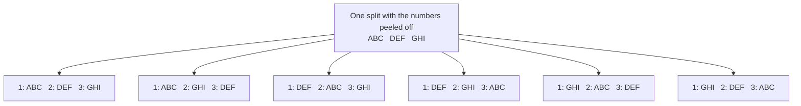

# Splitting into groups: the multinomial coefficient for named piles, and divide by k! when the piles are not named

Combinatorics and graphs → Repeats, Groups and Double Counting → Named and unnamed piles → Splitting into groups

---

## General Overview

Nine players arrive for a table tennis session. Three tables stand ready, numbered 1, 2 and 3, and three players go to each.

How many ways can the coach send them out? Not the number of ways to line all nine up. The three at table 1 are a set, not a queue: who walked over first changes nothing. The answer is 1,680.

Now peel the numbers off. The coach wants three trios warming up anywhere in the hall. Swapping two trios between two tables produces nothing new, and the count falls to 280, which is 1,680 divided by 6.

That gap is the whole card. Named piles are one count; the same piles unnamed are a smaller one. The shrinking factor is how many ways the names could be shuffled among piles of equal size — six here, since three trios take three numbers in six ways.

**Line everyone up, divide out the ordering inside each pile for the named count, then divide again by the ways equal-sized piles could trade places for the unnamed one.**

**What kind of fact this is:** a theorem, proved on this card in Why it works; the number it produces, the multinomial coefficient, is a definition.

### The picture: one split, six sets of table numbers



Nine players lettered A to I. Each of the 280 unnamed splits can be pinned to numbered tables in six ways, which is why the named count is 1,680.

---

## The formula

Notation first, in words. Factorial is written with an exclamation mark: 9! means 1 × 2 × 3 × … × 9, the number of ways to line nine distinct things up. This count gets a notation of its own: write it $C(n; n_1, n_2, \ldots, n_k)$, the **multinomial coefficient**, the semicolon saying that a list of pile sizes follows, not one choice. Books often stack the sizes under the n instead. The binomial coefficient $C(n, k)$, "n choose k", is its two-pile case.

$$C(n; n_1, n_2, \ldots, n_k) = \frac{n!}{n_1!\,n_2!\cdots n_k!}$$

**Read it aloud:** count every line-up of everyone, then divide out the line-ups inside each pile, which were never different splits.

For the session: $C(9; 3, 3, 3) = 9! / (3!\,3!\,3!) = 362,880 / 216 = 1,680$.

Take the names off and one more division follows. Where $m$ piles share a size and carry no names:

$$\text{unnamed count} = \frac{1}{m!} \cdot C(n; n_1, n_2, \ldots, n_k)$$

All three piles are trios, so $m$ is 3 and the count is 1,680 / 6 = 280. With every pile the same size $m$ equals $k$: the divide-by-k! of the title. Where only some sizes repeat, divide once per repeated size, by the factorial of how many share it.

| Symbol | Plain meaning | In our example | Push it up and the answer… |
| --- | --- | --- | --- |
| $n$ | how many distinct things are split | 9 players | climbs faster than any fixed power |
| $k$ | how many piles they go into | 3 tables | more cuts, so more splits |
| $n_1$, $n_2$, … , $n_k$ | the pile sizes, adding up to $n$ | 3, 3 and 3 | near-equal sizes give the largest count |
| $m$ | how many unnamed piles share one size | 3 trios | the count shrinks by a factorial |
| $C(n; n_1, n_2, \ldots, n_k)$ | the multinomial coefficient: splits into named piles | 1,680 | — |
| $C(n, k)$ | the binomial coefficient, the two-pile case | C(9,3) = 84 | — |

### When it holds

- **The things being split are distinct.** Nine named players. Where items repeat, the job is [multiset-permutations](01-multiset-permutations.md).
- **The sizes are fixed in advance and add up to $n$.** Let them vary and the question becomes how many size lists exist, which is [stars-and-bars](02-stars-and-bars.md).
- **Order inside a pile does not count.** Rank each table first, second and third board and the divisions are wrong: the count is 362,880.
- **Only equal-sized unnamed piles get the extra division.** Piles of 4, 3 and 2 cannot be mistaken for each other, so named and unnamed agree at 1,260; dividing anyway gives 210.

---

## Why it works

### Step 0: count something easy, then divide by how often each answer turned up

Counting splits head-on is awkward; counting line-ups is not. So count line-ups, notice every split was reached the same number of times, and divide by that number. The method rests on that overcount being identical for every split — [bijection-and-double-counting](05-bijection-and-double-counting.md) makes the point properly.

### Step 1: line the nine up and cut

Stand the nine in a row: 362,880 orders. Send the first three to table 1, the next three to table 2, the last three to table 3. Every named split appears this way.

How many orders give the same split? Shuffle the three at table 1 among themselves, 6 ways, and the same at tables 2 and 3: 6 × 6 × 6 = 216 orders per split, and 216 for every split alike. So the count is 362,880 / 216 = 1,680.

### Step 2: a second road, one table at a time

Choose 3 of the 9 for table 1: C(9,3) = 84 ways. Choose 3 of the 6 left for table 2: C(6,3) = 20. The last three go to table 3, C(3,3) = 1 way, no choice. Multiply: 84 × 20 × 1 = 1,680, reached without lining anyone up.

<details>
<summary>The algebra behind this, if you want it</summary>

Write the choices as factorials and watch them cancel:

$$\frac{9!}{3!\,6!}\cdot\frac{6!}{3!\,3!}\cdot\frac{3!}{3!\,0!} = \frac{9!}{3!\,3!\,3!}$$

The 6! left by the first choice is eaten by the second, the 3! left by the second by the third. With more piles it runs the whole way down, so the piles may be filled in any order. The last factor is 1, since 0! is 1 by convention.

</details>

### Step 3: peel the table numbers off

Take a split with the numbers on: ABC at table 1, DEF at table 2, GHI at table 3. Hand the numbers back as DEF, GHI, ABC and the same three trios give a different named split. Three numbers reach three trios in 6 ways, all counted separately.

So the 1,680 named splits fall into blocks of 6 sharing a set of trios, and the block count is 1,680 / 6 = 280.

<details>
<summary>Detailed proof: why the division is exactly by that factorial</summary>

Take a split with no names: piles of the stated sizes, disjoint, covering everyone. Naming it means deciding which pile is called 1, which 2, and so on. A pile of four cannot take a label reserved for a pile of three without changing the sizes, so the free choices lie among piles that already share a size.

Suppose $m$ piles share a size. Those $m$ labels can be dealt out in $m!$ ways, and every deal gives a different named split, since two equal-sized piles are still different sets of people.

Do that for each repeated size and every unnamed split holds the product of those factorials as its named versions. No named split belongs to two unnamed ones, since rubbing the names out is forced. So the named splits sit in equal blocks, and the block count is the named count over the block size — here 6, and the check confirms all 280 blocks hold six.

</details>

### Step 4: uneven piles have nothing to trade

Change the session: tables of four, three and two. The named count is 9! / (4! 3! 2!) = 1,260. Take the numbers off and the pile of four is still the pile of four; no relabelling turns it into the pile of three. Nothing is left to divide by, so the unnamed count is 1,260 too. Divide by 6 from habit and 210 appears, an answer to no question.

A third road reaches the same 1,680. Hand each player their table number: that writes a nine-character word with three 1s, three 2s and three 3s, and counting those words is arranging with repeats ([multiset-permutations](01-multiset-permutations.md)). The check takes that road literally, writing out all 19,683 ways to hand three numbers to nine players and keeping the 1,680 that fill every table.

---

## Worked numbers, by hand

| Step | Arithmetic | Value |
| --- | --- | --- |
| line all nine up | 1 × 2 × … × 9 | 362,880 |
| shuffles inside one table | 1 × 2 × 3 | 6 |
| shuffles inside all three | 6 × 6 × 6 | 216 |
| three numbered tables | 362,880 / 216 | **1,680** |
| the same, one table at a time | 84 × 20 × 1 | **1,680** |
| numbers handed to three trios | 1 × 2 × 3 | 6 |
| three unnumbered trios | 1,680 / 6 | **280** |
| tables of 4, 3 and 2, numbered or not | 362,880 / (4! 3! 2!) | **1,260** |

Three numbered tables admit 1,680 sessions. Forget the numbers and 280 genuinely different groupings remain.

### What breaks if you drop a piece

| Mistake | Comes out at | What went wrong |
| --- | --- | --- |
| Dividing by 3! when the tables are numbered | 280 | The numbers make the piles different, so none can trade places |
| Forgetting the last pile's 3! | 10,080 | The third table is left ordered |
| Dividing by 3! when the piles are 4, 3 and 2 | 210 | Piles of different sizes cannot be confused |

The code prints all three.

---

## Code, from first principles, and it actually runs

Nothing is imported. Three roads with no arithmetic in common reach the named count: hand out table numbers and keep the handouts that fill every table, divide factorials, or fill one table at a time from a Pascal's triangle the script builds. Two reach the unnamed count: collect the distinct splits the first road throws up, or divide the factorial count by 6. Tables of 4, 3 and 2 run the same machinery.

### Python

```python
# Splitting into groups -- the check behind the card.  Nothing is imported.
# Nine players, A to I, are split into three piles.  The named count (tables
# numbered 1, 2, 3) and the unnamed count are each reached twice, by roads that
# share no arithmetic: hand out table numbers and count, or divide factorials.
PLAYERS, EVEN, ODD = "ABCDEFGHI", (3, 3, 3), (4, 3, 2)

def fact(m):                                   # 1 x 2 x ... x m, written out here
    out = 1
    for j in range(2, m + 1): out *= j
    return out

def choose(a, b):                              # C(a, b) from Pascal's triangle alone
    row = [1]
    for _ in range(a):
        row = [1] + [row[i] + row[i + 1] for i in range(len(row) - 1)] + [1]
    return row[b]

def by_factorials(sizes):                      # road two: n! divided by each pile's factorial
    out = fact(sum(sizes))
    for s in sizes: out //= fact(s)
    return out

def labellings(sizes):                         # road one: every way to hand out table numbers
    k, out = len(sizes), []
    for code in range(k ** len(PLAYERS)):
        tags = [(code // k ** i) % k for i in range(len(PLAYERS))]
        if all(tags.count(t) == sizes[t] for t in range(k)):
            out.append(frozenset(frozenset(PLAYERS[i] for i, x in enumerate(tags) if x == t)
                                 for t in range(k)))
    return out

def com(v):                                    # 1680 printed 1,680, as written on the card
    s, out = str(v), ""
    for i, ch in enumerate(s):
        out += ch + ("," if (len(s) - i - 1) % 3 == 0 and i < len(s) - 1 else "")
    return out

even, orbit = labellings(EVEN), {}
for s in even:
    orbit[s] = orbit.get(s, 0) + 1
odd = set(labellings(ODD))
seq = [choose(9, 3), choose(6, 3), choose(3, 3)]
named, unnamed, even_piles = len(even), len(orbit), fact(3) ** 3
print("nine players, A to I, into three piles at tables numbered 1, 2 and 3")
print(f"road one, every labelling: 3^9 = {com(3 ** 9)} in all, {com(named)} put three players at each table")
print(f"road two, factorials: 9! / (3! 3! 3!) = {com(fact(9))} / {even_piles} = {com(by_factorials(EVEN))}")
print(f"road three, choose in turn: C(9,3) x C(6,3) x C(3,3) = {seq[0]} x {seq[1]} x {seq[2]} = {com(seq[0] * seq[1] * seq[2])}")
print(f"unnamed trios, by collecting the distinct splits: {com(unnamed)}")
print(f"unnamed trios, by formula: {com(named)} / 3! = {com(named)} / {fact(3)} = {com(named // fact(3))}")
print(f"every unnamed split wears exactly {fact(3)} sets of table numbers: {'yes' if set(orbit.values()) == {fact(3)} else 'no'}")
print(f"piles of 4, 3 and 2: 9! / (4! 3! 2!) = {com(by_factorials(ODD))} named, and {com(len(odd))} unnamed")
print(f"mistake 1, dividing by 3! when the tables are numbered: {com(named // 6)}, not {com(named)}")
print(f"mistake 2, forgetting the last pile's 3!: {com(fact(9) // (fact(3) * fact(3)))}, not {com(named)}")
print(f"mistake 3, dividing by 3! when the piles are 4, 3 and 2: {com(by_factorials(ODD) // 6)}, not {com(by_factorials(ODD))}")
assert named == by_factorials(EVEN) == seq[0] * seq[1] * seq[2]     # three roads, one count
assert unnamed == by_factorials(EVEN) // fact(3) and set(orbit.values()) == {fact(3)}
assert len(odd) == by_factorials(ODD)                               # uneven piles, brute against formula
assert choose(9, 3) * fact(3) * fact(6) == fact(9)                  # Pascal against factorials
print("ALL CHECKS PASS")
```

**Ran 2026-09-14 on macOS, Python 3.14.6, standard library only. All checks passed. Output, pasted from the run:**

```
nine players, A to I, into three piles at tables numbered 1, 2 and 3
road one, every labelling: 3^9 = 19,683 in all, 1,680 put three players at each table
road two, factorials: 9! / (3! 3! 3!) = 362,880 / 216 = 1,680
road three, choose in turn: C(9,3) x C(6,3) x C(3,3) = 84 x 20 x 1 = 1,680
unnamed trios, by collecting the distinct splits: 280
unnamed trios, by formula: 1,680 / 3! = 1,680 / 6 = 280
every unnamed split wears exactly 6 sets of table numbers: yes
piles of 4, 3 and 2: 9! / (4! 3! 2!) = 1,260 named, and 1,260 unnamed
mistake 1, dividing by 3! when the tables are numbered: 280, not 1,680
mistake 2, forgetting the last pile's 3!: 10,080, not 1,680
mistake 3, dividing by 3! when the piles are 4, 3 and 2: 210, not 1,260
ALL CHECKS PASS
```

### Rust

Same numbers, same labels, built with `rustc --edition 2021 -O`.

```rust
// Splitting into groups -- the same check as the Python, in Rust.  No crates.
// Nine players, A to I, are split into three piles.  The named count (tables
// numbered 1, 2, 3) and the unnamed count are each reached twice, by roads that
// share no arithmetic: hand out table numbers and count, or divide factorials.
use std::collections::HashMap;
const PLAYERS: &str = "ABCDEFGHI";
const EVEN: [usize; 3] = [3, 3, 3];
const ODD: [usize; 3] = [4, 3, 2];

fn fact(m: u64) -> u64 {                       // 1 x 2 x ... x m, written out here
    let mut out = 1;
    for j in 2..=m { out *= j }
    out
}

fn choose(a: usize, b: usize) -> u64 {         // C(a, b) from Pascal's triangle alone
    let mut row: Vec<u64> = vec![1];
    for _ in 0..a {
        let mut next: Vec<u64> = vec![1];
        for i in 0..row.len() - 1 { next.push(row[i] + row[i + 1]) }
        next.push(1); row = next;
    }
    row[b]
}

fn by_factorials(sizes: &[usize]) -> u64 {     // road two: n! divided by each pile's factorial
    let mut out = fact(sizes.iter().sum::<usize>() as u64);
    for &s in sizes { out /= fact(s as u64) }
    out
}

fn labellings(sizes: &[usize]) -> Vec<String> {  // road one: every way to hand out table numbers
    let (k, chars) = (sizes.len(), PLAYERS.chars().collect::<Vec<char>>());
    let mut out = Vec::new();
    for code in 0..k.pow(chars.len() as u32) {
        let tags: Vec<usize> = (0..chars.len()).map(|i| (code / k.pow(i as u32)) % k).collect();
        if (0..k).all(|t| tags.iter().filter(|&&x| x == t).count() == sizes[t]) {
            let mut piles: Vec<String> = (0..k).map(|t| (0..chars.len())
                .filter(|&i| tags[i] == t).map(|i| chars[i]).collect()).collect();
            piles.sort();
            out.push(piles.join(" "));
        }
    }
    out
}

fn com(v: u64) -> String {                     // 1680 printed 1,680, as written on the card
    let (s, mut out) = (v.to_string(), String::new());
    for (i, ch) in s.chars().enumerate() {
        out.push(ch);
        if (s.len() - i - 1) % 3 == 0 && i < s.len() - 1 { out.push(',') }
    }
    out
}

fn main() {
    let (even, mut orbit) = (labellings(&EVEN), HashMap::<String, u64>::new());
    for s in &even { *orbit.entry(s.clone()).or_insert(0) += 1 }
    let mut odd = labellings(&ODD);
    odd.sort(); odd.dedup();
    let seq = [choose(9, 3), choose(6, 3), choose(3, 3)];
    let (named, unnamed, even_piles) = (even.len() as u64, orbit.len() as u64, fact(3).pow(3));
    let same = unnamed > 0 && orbit.values().all(|&v| v == fact(3));
    println!("nine players, A to I, into three piles at tables numbered 1, 2 and 3");
    println!("road one, every labelling: 3^9 = {} in all, {} put three players at each table", com(3u64.pow(9)), com(named));
    println!("road two, factorials: 9! / (3! 3! 3!) = {} / {} = {}", com(fact(9)), even_piles, com(by_factorials(&EVEN)));
    println!("road three, choose in turn: C(9,3) x C(6,3) x C(3,3) = {} x {} x {} = {}", seq[0], seq[1], seq[2], com(seq[0] * seq[1] * seq[2]));
    println!("unnamed trios, by collecting the distinct splits: {}", com(unnamed));
    println!("unnamed trios, by formula: {} / 3! = {} / {} = {}", com(named), com(named), fact(3), com(named / fact(3)));
    println!("every unnamed split wears exactly {} sets of table numbers: {}", fact(3), if same { "yes" } else { "no" });
    println!("piles of 4, 3 and 2: 9! / (4! 3! 2!) = {} named, and {} unnamed", com(by_factorials(&ODD)), com(odd.len() as u64));
    println!("mistake 1, dividing by 3! when the tables are numbered: {}, not {}", com(named / 6), com(named));
    println!("mistake 2, forgetting the last pile's 3!: {}, not {}", com(fact(9) / (fact(3) * fact(3))), com(named));
    println!("mistake 3, dividing by 3! when the piles are 4, 3 and 2: {}, not {}", com(by_factorials(&ODD) / 6), com(by_factorials(&ODD)));
    assert!(named == by_factorials(&EVEN) && by_factorials(&EVEN) == seq[0] * seq[1] * seq[2]);
    assert!(unnamed == by_factorials(&EVEN) / fact(3) && same);
    assert!(odd.len() as u64 == by_factorials(&ODD));           // uneven piles, brute against formula
    assert!(choose(9, 3) * fact(3) * fact(6) == fact(9));       // Pascal against factorials
    println!("ALL CHECKS PASS");
}
```

**Ran 2026-09-14 on macOS, rustc 1.98.1, no crates. All checks passed. Output, pasted from the run:**

```
nine players, A to I, into three piles at tables numbered 1, 2 and 3
road one, every labelling: 3^9 = 19,683 in all, 1,680 put three players at each table
road two, factorials: 9! / (3! 3! 3!) = 362,880 / 216 = 1,680
road three, choose in turn: C(9,3) x C(6,3) x C(3,3) = 84 x 20 x 1 = 1,680
unnamed trios, by collecting the distinct splits: 280
unnamed trios, by formula: 1,680 / 3! = 1,680 / 6 = 280
every unnamed split wears exactly 6 sets of table numbers: yes
piles of 4, 3 and 2: 9! / (4! 3! 2!) = 1,260 named, and 1,260 unnamed
mistake 1, dividing by 3! when the tables are numbered: 280, not 1,680
mistake 2, forgetting the last pile's 3!: 10,080, not 1,680
mistake 3, dividing by 3! when the piles are 4, 3 and 2: 210, not 1,260
ALL CHECKS PASS
```

The two outputs match line for line.

> [!TIP]
> **Try changing**
> Guess first, then run it. The asserts are pinned to three trios, so expect one to stop the program.
> - **Four tables: three, three, two and one.** Set `EVEN` to `(3, 3, 2, 1)`. The named count is 5,040, and since only the two trios can trade places the unnamed count is 2,520. The first assert stops the run: road three is wired to three trios.
> - **Tables of five, three and one.** Set `ODD` to `(5, 3, 1)`. Nothing breaks: the run prints 504 as both counts, since no two piles share a size.
> - **Rank the boards.** In `by_factorials`, drop the division by each pile's factorial. The count becomes 362,880, a count of line-ups, and the first assert stops the run.

---

## The usual mistake

> [!warning]
> **Dividing by k! out of habit.** That division belongs to the unnamed count alone: it rubs out names, and numbered tables are names. Apply it here and 1,680 becomes 280 — the answer to the other question, not the one asked.
>
> - **Forgetting a pile's factorial.** Leave out the last 3! and the count reads 10,080, the third table still ordered.
> - **Dividing when the sizes differ.** Tables of 4, 3 and 2 give 1,260 either way; dividing by 3! gives 210.
> - **Dividing by the wrong factorial.** Only piles sharing a size can trade places, so divide by the factorial of how many share it, not of how many piles there are.
> - **Reading a multinomial as a binomial.** C(9,3) = 84 counts one table against everyone else. Three tables need that choice three times over.

---

## Where you meet it in real life

- **Card games.** Dealing a pack into hands, one per seat, splits into named piles: the seats have names, so nothing is divided out.
- **Tournament draws.** Teams into lettered groups is a named split; the same teams into unlettered pools is the smaller count, and the letters are what the division removes.
- **Anagrams.** The same number counts the rearrangements of a word with repeated letters, reached from the other side by [multiset-permutations](01-multiset-permutations.md).
- **Seating what was split.** Sitting one trio round a table is its own count: [circular-arrangements](04-circular-arrangements.md).

> **Say it back**
> Splitting nine distinct players into piles of stated sizes starts from all 362,880 line-ups and divides out the ordering inside each pile. Three numbered tables give 1,680 splits. Take the numbers off and the trios trade places in 6 ways, all counted separately, so the count drops to 280. The extra division fits only equal-sized unnamed piles: tables of 4, 3 and 2 give 1,260 either way.

---

## What this builds on

- [multiset-permutations](01-multiset-permutations.md): dividing a line-up count by the shuffles that change nothing, the move this card makes pile by pile.

## Where this goes next

- [binomial-theorem](../03-Binomial%20Coefficients%20and%20Identities/02-binomial-theorem.md): the same coefficients appear when a sum is raised to a power, the two-term case first and the many-term case citing this card.
- [multinomial](../../09-Probability%20and%20statistics/03-Discrete%20Distributions/05-multinomial.md): a chance attached to each pile, so this count becomes one factor in the chance of a tally.

Every split counted here stands equal with every other, which the world rarely allows; what changes when each pile carries its own weight is where [multinomial](../../09-Probability%20and%20statistics/03-Discrete%20Distributions/05-multinomial.md) begins.

---

## Sources

Verified 14 Sep 2026: every link below resolves to the publisher's page.

- Graham, Ronald L., Donald E. Knuth, and Oren Patashnik. *Concrete Mathematics: A Foundation for Computer Science*, 2nd ed. Addison-Wesley, 1994. [Publisher page](https://www.informit.com/store/concrete-mathematics-a-foundation-for-computer-science-9780201558029). Chapter 5 sets the multinomial coefficient beside the binomial, its two-pile case.
- Keller, Mitchel T., and William T. Trotter. *Applied Combinatorics*. [Free full text](https://appliedcombinatorics.org/book/). Its counting chapter builds these coefficients from strings over an alphabet, the check's first road.
- Feller, William. *An Introduction to Probability Theory and Its Applications*, Volume 1, 3rd ed. Wiley, 1968. [Publisher page](https://www.wiley.com/en-us/An+Introduction+to+Probability+Theory+and+Its+Applications%2C+Volume+1%2C+3rd+Edition-p-9780471257080). Chapter II treats the number as an occupancy count: distinct items into named cells of stated contents.
