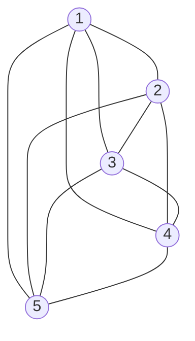
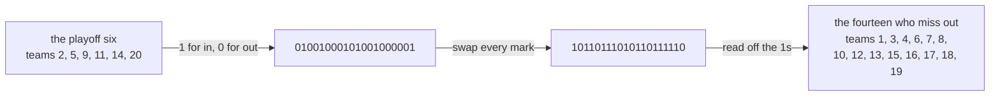

# Bijections and double counting: match two collections one-to-one, or count one collection two ways, and the numbers must agree

[Syllabus](../../../SYLLABUS.md) → [Combinatorics and graphs](../../../SYLLABUS.md#w04) → [Repeats, Groups and Double Counting](../../../SYLLABUS.md#w04-s02) → Bijections and double counting

---

## General Overview

A league holds 20 teams. Every team plays every other team once. How many matches is that?

Count from the teams' side. Each team has 19 opponents, so 20 teams times 19 opponents is 380. That answer is wrong, in a way worth naming: the match between team 3 and team 11 was counted from team 3's fixture list and again from team 11's. Every match was counted twice, so the season holds 380 divided by 2, which is 190 matches.

Two moves did that, and no formula. First: count one collection in two ways, and the answers must agree, because a collection has one size. Second: partner the members of one collection with the members of another, one for one, nothing left over either side, and the two are the same size. A partnering of that kind is a **bijection**, the word used from here on.

**Two collections matched one to one hold the same count, and one collection counted two ways gives two expressions for a single number, so those expressions are equal.**

**What kind of fact this is:** a method — two ways of proving a counting statement, both justified below in Why it works.

### The picture: five teams, ten matches, twenty line-ends

The league cut to its first five teams, a line drawn for each match.



Ten lines, so 10 matches. Counted from the teams instead, each of the 5 touches 4 lines: 20 line-ends, two per match. The same story as a grid: 25 cells, 5 blank on the diagonal, 20 filled cells holding 10 matches twice over.

---

## The formula

Notation first, in words. Bars count members: $\lvert A \rvert$ is how many things collection A holds. An arrow names a rule sending each member of one collection to a member of another, so $f : A \to B$ reads "f sends each member of A to a member of B"; a double arrow means "so". And C(n, k), read "n choose k", counts the ways of choosing k things out of n when order does not matter ([Combinations, n choose k](../01-Counting%20Principles/05-n-choose-k.md)).

$$f : A \to B \ \text{one to one and onto} \quad \Longrightarrow \quad \lvert A \rvert = \lvert B \rvert$$

**Read it aloud:** if every member of A has exactly one partner in B, and every member of B is somebody's partner, the two collections are the same size.

Double counting usually arrives as a listing that names each wanted thing the same number of times — call that number $d$.

$$\lvert A \rvert = d \times \lvert B \rvert$$

**Read it aloud:** a listing running d entries per thing counted is d times too long, so divide by d.

Here A is the 380 slips, B the matches, d is 2. Worked for any number of teams, the two rules give this card's identities:

$$C(n, 2) = \frac{n(n-1)}{2} \qquad \text{and} \qquad C(n, k) = C(n, n-k)$$

| Symbol | Plain meaning | In our example | Push it up and the answer… |
| --- | --- | --- | --- |
| $A$, $B$ | the two collections compared | 380 slips, 190 matches | — |
| $\lvert A \rvert$ | the size of a collection | 380 | — |
| $f$ | the rule sending each member of one to a member of the other | slip → its match | — |
| $d$ | how many members of A name each member of B | 2, one per side | fewer things counted |
| $n$ | how many things to choose from | 20 teams | far more choices |
| $k$ | how many are chosen | 6 playoff places | peaks at half of n |
| $C(n, k)$ | ways to choose k of n, order ignored | C(20, 2) = 190 | — |

### When it holds

- **One to one and onto, both.** Filing the 38760 six-team picks under their smallest team fuses them into 15 buckets: a rule landing many members on one proves no equality.
- **The same d every time, and finitely many.** Every match draws two slips: the check prints smallest 2, largest 2. Where some draw two and others three, no division fixes the total, and endless collections leave no number to divide ([Same size means pairable](../../01-Foundations/09-Sizes%20of%20Infinity/01-same-size-by-pairing.md)).
- **The same collection, both times.** Counting slips one road and matches the other proves nothing: 380 and 190 are both correct, and they differ.

---

## Why it works

### Step 0: a collection has exactly one size

A finite collection holds one number of members, and any correct count finds it. Two correct counts are two names for one number, so writing them equal is the same fact twice.

### Step 1: count the fixture slips two ways

Hand every team one slip per opponent: team 7 gets 19 slips, one naming each other team.

Road one counts by team: 20 teams, 19 slips each, 380 slips.

Road two counts by match. Sort the pile by the match each slip names: team 3's slip for team 11 lands with team 11's slip for team 3, and nothing else does, so every match gets exactly 2.

One pile, two counts: 380, and 2 per match. So 380 = 2 × (number of matches), and the matches number 190.

### Step 2: the same argument for n teams gives C(n, 2)

Nothing above used the number 20. With n teams each has n − 1 opponents, so the slips number n(n − 1), and every match still draws 2.

A match is a choice of 2 teams out of n, order ignored — which is what C(n, 2) counts.

$$C(n, 2) = \frac{n(n-1)}{2}$$

No factorials, and no formula for C(n, k) assumed. The check lists the matches for 2, 3, 4, 5 and 6 teams — 1, 3, 6, 10, 15 — and n(n − 1) / 2 agrees every time.

<details>
<summary>Detailed proof: the division rule, in general</summary>

Let A and B be finite, and $f$ a rule sending each member of A to a member of B, with every member b of B named by exactly d members of A, the same d throughout.

The groups, one per b, cover A: every member of A goes somewhere, so it sits in the group of its destination. They do not overlap: a member goes to one member of B, not two. So A is cut into $\lvert B \rvert$ blocks of d, and counting block by block gives $\lvert A \rvert = d \times \lvert B \rvert$. The bijection rule is d = 1, each block one member.

</details>

### Step 3: a choice of teams is a string of marks

The league takes 6 teams into a playoff. How many playoff sixes are possible?

Write a line of 20 marks, one per team in league order: 1 for in, 0 for out. The six named 2, 5, 9, 11, 14 and 20 becomes 01001000101001000001.

Every six gives one such string, and every string of 20 marks holding six 1s gives back one six. That is a bijection, so counting the strings counts the sixes: C(20, 6) = 38760 ([Strings with repetition](../01-Counting%20Principles/02-strings-and-powers.md) counts strings of marks).

### Step 4: swap the marks, and C(n, k) = C(n, n − k)

Change every 1 to a 0 and every 0 to a 1. The playoff string becomes 10110111010110111110, holding fourteen 1s that name the teams which missed out.



Swapping twice returns the original, so the swap undoes itself, and a rule with an undo is one to one and onto: nothing fused, nothing missed. The six-team and fourteen-team strings match one for one, and by Step 3 so do the playoff sixes and the also-ran fourteens — 38760 of each.

$$C(n, k) = C(n, n-k)$$

Choosing who is in is the same act as choosing who is out. Nothing is computed.

The factorial formula reaches both identities too, and the check uses it as the second road ([Combinations, n choose k](../01-Counting%20Principles/05-n-choose-k.md)): quicker here, silent about why.

The rest of this shelf is these two moves at work. [Stars and bars](02-stars-and-bars.md) matches each way of handing out items with a line of dots and dividers; [Arranging with repeats](01-multiset-permutations.md), [Splitting into groups](03-splitting-into-groups.md) and [Round tables and bracelets](04-circular-arrangements.md) each divide by a block of arrangements naming one thing.

---

## Worked numbers, by hand

| Step | Arithmetic | Value |
| --- | --- | --- |
| teams, and opponents each | 20, and 20 − 1 | 20, 19 |
| fixture slips | 20 × 19 | 380 |
| slips per match | one per side | 2 |
| matches | 380 ÷ 2 | **190** |
| by the identity | C(20, 2) = 20 × 19 / 2 | **190** |
| playoff sixes, listed | 20-mark strings with six 1s | **38760** |
| the fourteen left out | C(20, 14), by the swap | **38760** |

A 20-team round robin — everyone plays everyone once — runs 190 matches, and the playoff six can come out 38760 ways, matching the also-ran fourteen, since naming one names the other.

### What breaks if you drop a piece

| Mistake | Comes out at | What went wrong |
| --- | --- | --- |
| Stopping at the slips | 380 matches | Every match was written from both sides |
| Letting a team play itself | 400 slips, 200 matches | A team has 19 opponents, not 20 |
| Filing picks by smallest team | 38760 picks, 15 buckets | A many-to-one rule proves no equality |

The code prints all three.

---

## Code, from first principles, and it actually runs

Nothing is imported. Road one lists and counts: every slip, every match, and all 1048576 strings of 20 marks, keeping those with the right number of 1s. Road two does arithmetic and builds no list. The swap then runs over all 38760 six-team strings against the fourteen-team strings.

### Python

```python
# Bijections and double counting -- the check behind the card.  Nothing is
# imported.  Twenty teams play a single round robin.  The matches are counted
# twice over: by listing every one, and by arithmetic.  Then the ways to pick
# the playoff six are matched one to one with the ways to pick the fourteen
# who miss out, by swapping every mark in a twenty-mark string.
N, K, SMALL = 20, 6, [2, 3, 4, 5, 6]

def factorial(n):                        # written out here, nothing imported
    out = 1
    for i in range(2, n + 1):
        out *= i
    return out

def choose(n, k):                        # road two: n! / (k! x (n-k)!)
    return factorial(n) // (factorial(k) * factorial(n - k))

def matches(n):                          # road one: each match written once
    return [(a, b) for a in range(1, n + 1) for b in range(a + 1, n + 1)]

def slips(n):                            # one slip per team, per opponent
    return [(a, b) for a in range(1, n + 1) for b in range(1, n + 1) if a != b]

def marks(teams):                        # a set of teams as a twenty-mark string
    return "".join("1" if t in teams else "0" for t in range(1, N + 1))

listed, ordered = matches(N), slips(N)
tally = {}
for a, b in ordered:                     # file each slip under the match it names
    m = (min(a, b), max(a, b))
    tally[m] = tally.get(m, 0) + 1
counts = sorted(set(tally.values()))
by_listing = [len(matches(m)) for m in SMALL]
six = [s for s in range(1 << N) if bin(s).count("1") == K]
fourteen = [s for s in range(1 << N) if bin(s).count("1") == N - K]
flipped = sorted(s ^ ((1 << N) - 1) for s in six)          # swap every mark
buckets = len({(s & -s).bit_length() for s in six})
pick = [2, 5, 9, 11, 14, 20]
rest = [t for t in range(1, N + 1) if t not in pick]
print(f"league of {N} teams, each plays {N - 1} others")
print(f"road one, by listing: {len(ordered)} slips (team, opponent) and {len(listed)} matches")
print(f"road two, by arithmetic: {N} x {N - 1} / 2 = {N * (N - 1) // 2} matches, and C({N}, 2) = {choose(N, 2)}")
print(f"slips per match, smallest and largest: {counts[0]} and {counts[-1]}")
print(f"the five-team grid: {5 * 5} cells, {5} blanked, {5 * 4} filled, {5 * 4 // 2} matches")
print("teams          " + "".join(f"{m:>4}" for m in SMALL))
print("matches listed " + "".join(f"{v:>4}" for v in by_listing))
print("n(n-1)/2       " + "".join(f"{m * (m - 1) // 2:>4}" for m in SMALL))
print(f"strings of {N} marks: {1 << N} in all; picking {K} of {N} by listing them: {len(six)}, by formula C({N}, {K}) = {choose(N, K)}")
print(f"picking {N - K} of {N}: by listing marks {len(fourteen)}, by formula C({N}, {N - K}) = {choose(N, N - K)}")
print(f"swapping marks sends the {K}-team strings onto the {N - K}-team strings, none repeated: "
      f"{'yes' if flipped == fourteen else 'no'}")
print(f"one pick: {pick} -> {marks(pick)} -> swapped -> {marks(rest)} -> {rest}")
print(f"mistake 1, stopping at the slips: {len(ordered)} matches, not {len(listed)}")
print(f"mistake 2, letting a team play itself: {N * N} slips, {N * N // 2} matches")
print(f"mistake 3, filing the {len(six)} picks under their smallest team: {buckets} buckets")
assert len(listed) == N * (N - 1) // 2 == len(ordered) // 2
assert by_listing == [m * (m - 1) // 2 for m in SMALL]
assert len(six) == choose(N, K) and len(fourteen) == choose(N, N - K)
assert flipped == fourteen and counts == [2]
print("ALL CHECKS PASS")
```

**Ran 2026-09-14 on macOS, Python 3.14.6, standard library only. All checks passed. Output, pasted from the run:**

```
league of 20 teams, each plays 19 others
road one, by listing: 380 slips (team, opponent) and 190 matches
road two, by arithmetic: 20 x 19 / 2 = 190 matches, and C(20, 2) = 190
slips per match, smallest and largest: 2 and 2
the five-team grid: 25 cells, 5 blanked, 20 filled, 10 matches
teams             2   3   4   5   6
matches listed    1   3   6  10  15
n(n-1)/2          1   3   6  10  15
strings of 20 marks: 1048576 in all; picking 6 of 20 by listing them: 38760, by formula C(20, 6) = 38760
picking 14 of 20: by listing marks 38760, by formula C(20, 14) = 38760
swapping marks sends the 6-team strings onto the 14-team strings, none repeated: yes
one pick: [2, 5, 9, 11, 14, 20] -> 01001000101001000001 -> swapped -> 10110111010110111110 -> [1, 3, 4, 6, 7, 8, 10, 12, 13, 15, 16, 17, 18, 19]
mistake 1, stopping at the slips: 380 matches, not 190
mistake 2, letting a team play itself: 400 slips, 200 matches
mistake 3, filing the 38760 picks under their smallest team: 15 buckets
ALL CHECKS PASS
```

### Rust

Same numbers, same labels, built with `rustc --edition 2021 -O`.

```rust
// Bijections and double counting -- the same check as the Python, in Rust.  No
// crates.  Twenty teams play a single round robin.  The matches are counted
// twice over: by listing every one, and by arithmetic.  Then the ways to pick
// the playoff six are matched one to one with the ways to pick the fourteen
// who miss out, by swapping every mark in a twenty-mark string.
const N: u32 = 20;
const K: u32 = 6;
const SMALL: [u32; 5] = [2, 3, 4, 5, 6];

fn factorial(n: u32) -> u128 {              // written out here, no crates
    let mut out: u128 = 1;
    for i in 2..=(n as u128) { out *= i }
    out
}

fn choose(n: u32, k: u32) -> u128 {         // road two: n! / (k! x (n-k)!)
    factorial(n) / (factorial(k) * factorial(n - k))
}

fn matches(n: u32) -> Vec<(u32, u32)> {     // road one: each match written once
    let mut out = Vec::new();
    for a in 1..=n { for b in (a + 1)..=n { out.push((a, b)) } }
    out
}

fn slips(n: u32) -> Vec<(u32, u32)> {       // one slip per team, per opponent
    let mut out = Vec::new();
    for a in 1..=n { for b in 1..=n { if a != b { out.push((a, b)) } } }
    out
}

fn marks(teams: &[u32]) -> String {         // a set of teams as a twenty-mark string
    (1..=N).map(|t| if teams.contains(&t) { '1' } else { '0' }).collect()
}

fn main() {
    let (listed, ordered) = (matches(N), slips(N));
    let mut tally = vec![0u32; ((N + 1) * (N + 1)) as usize];
    for &(a, b) in &ordered {               // file each slip under the match it names
        tally[(a.min(b) * (N + 1) + a.max(b)) as usize] += 1;
    }
    let mut counts: Vec<u32> = tally.iter().copied().filter(|&c| c > 0).collect();
    counts.sort(); counts.dedup();
    let by_listing: Vec<usize> = SMALL.iter().map(|&m| matches(m).len()).collect();
    let six: Vec<u32> = (0..(1u32 << N)).filter(|s| s.count_ones() == K).collect();
    let fourteen: Vec<u32> = (0..(1u32 << N)).filter(|s| s.count_ones() == N - K).collect();
    let mut flipped: Vec<u32> = six.iter().map(|s| s ^ ((1u32 << N) - 1)).collect();
    flipped.sort();                         // swap every mark
    let mut lows: Vec<u32> = six.iter().map(|s| s.trailing_zeros()).collect();
    lows.sort(); lows.dedup();
    let pick: Vec<u32> = vec![2, 5, 9, 11, 14, 20];
    let rest: Vec<u32> = (1..=N).filter(|t| !pick.contains(t)).collect();
    let row = |name: &str, vals: Vec<String>| println!("{}{}", name, vals.join(""));
    println!("league of {} teams, each plays {} others", N, N - 1);
    println!("road one, by listing: {} slips (team, opponent) and {} matches", ordered.len(), listed.len());
    println!("road two, by arithmetic: {} x {} / 2 = {} matches, and C({}, 2) = {}",
             N, N - 1, N * (N - 1) / 2, N, choose(N, 2));
    println!("slips per match, smallest and largest: {} and {}", counts[0], counts[counts.len() - 1]);
    println!("the five-team grid: {} cells, {} blanked, {} filled, {} matches", 5 * 5, 5, 5 * 4, 5 * 4 / 2);
    row("teams          ", SMALL.iter().map(|m| format!("{:>4}", m)).collect());
    row("matches listed ", by_listing.iter().map(|v| format!("{:>4}", v)).collect());
    row("n(n-1)/2       ", SMALL.iter().map(|m| format!("{:>4}", m * (m - 1) / 2)).collect());
    println!("strings of {} marks: {} in all; picking {} of {} by listing them: {}, by formula C({}, {}) = {}",
             N, 1u32 << N, K, N, six.len(), N, K, choose(N, K));
    println!("picking {} of {}: by listing marks {}, by formula C({}, {}) = {}",
             N - K, N, fourteen.len(), N, N - K, choose(N, N - K));
    println!("swapping marks sends the {}-team strings onto the {}-team strings, none repeated: {}",
             K, N - K, if flipped == fourteen { "yes" } else { "no" });
    println!("one pick: {:?} -> {} -> swapped -> {} -> {:?}", pick, marks(&pick), marks(&rest), rest);
    println!("mistake 1, stopping at the slips: {} matches, not {}", ordered.len(), listed.len());
    println!("mistake 2, letting a team play itself: {} slips, {} matches", N * N, N * N / 2);
    println!("mistake 3, filing the {} picks under their smallest team: {} buckets", six.len(), lows.len());
    assert!(listed.len() as u32 == N * (N - 1) / 2 && listed.len() == ordered.len() / 2);
    assert!(by_listing == SMALL.iter().map(|&m| (m * (m - 1) / 2) as usize).collect::<Vec<usize>>());
    assert!(six.len() as u128 == choose(N, K) && fourteen.len() as u128 == choose(N, N - K));
    assert!(flipped == fourteen && counts == vec![2]);
    println!("ALL CHECKS PASS");
}
```

**Ran 2026-09-14 on macOS, rustc 1.98.1, no crates. All checks passed. Output, pasted from the run:**

```
league of 20 teams, each plays 19 others
road one, by listing: 380 slips (team, opponent) and 190 matches
road two, by arithmetic: 20 x 19 / 2 = 190 matches, and C(20, 2) = 190
slips per match, smallest and largest: 2 and 2
the five-team grid: 25 cells, 5 blanked, 20 filled, 10 matches
teams             2   3   4   5   6
matches listed    1   3   6  10  15
n(n-1)/2          1   3   6  10  15
strings of 20 marks: 1048576 in all; picking 6 of 20 by listing them: 38760, by formula C(20, 6) = 38760
picking 14 of 20: by listing marks 38760, by formula C(20, 14) = 38760
swapping marks sends the 6-team strings onto the 14-team strings, none repeated: yes
one pick: [2, 5, 9, 11, 14, 20] -> 01001000101001000001 -> swapped -> 10110111010110111110 -> [1, 3, 4, 6, 7, 8, 10, 12, 13, 15, 16, 17, 18, 19]
mistake 1, stopping at the slips: 380 matches, not 190
mistake 2, letting a team play itself: 400 slips, 200 matches
mistake 3, filing the 38760 picks under their smallest team: 15 buckets
ALL CHECKS PASS
```

The two outputs match line for line.

> [!TIP]
> **Try changing**
> Guess first, then run it. The asserts are pinned to the 20-team league, so expect one to stop the program.
> - **Break the halving.** Change `range(a + 1, n + 1)` to `range(a, n + 1)`: every team now plays itself, so the listing counts 20 matches more than the arithmetic's 190, and the first assert stops it.
> - **Swap the wrong marks.** Change `(1 << N) - 1` to `(1 << N) - 2`: one mark is left alone, so the swap misses the fourteen-team strings and the last assert stops it.
> - **Pick a different six.** Change `pick` to `[1, 2, 3, 4, 5, 6]`: the string is six 1s then fourteen 0s, its swap six 0s then fourteen 1s, and no count moves.

---

## The usual mistake

> [!warning]
> **Counting the list instead of the thing.** Twenty teams times nineteen opponents counts a real collection: fixture slips, 380 of them. It is not the count of matches. Every double-counting argument turns on naming what was counted, then how many entries each wanted thing drew.
>
> - **Dividing when the entries are uneven.** Every match here draws 2. Where the number varies, dividing by an average proves nothing.
> - **A rule that fuses members.** Filing the 38760 playoff sixes under their smallest team leaves 15 buckets holding all 38760.
> - **Taking C(20, 6) = C(20, 14) for a coincidence.** They agree because naming the six in names the fourteen out.

---

## Where you meet it in real life

- **Fixture lists.** A 20-team league playing home and away runs 380 matches a season: the slip count, undivided, because home and away are different matches.
- **Handshakes and cables.** Twenty people who all shake hands once make 190 handshakes — 380 hand-ends, two per shake — and joining 20 offices to each other needs 190 cables. The same count told with dots and lines is [Degrees and the handshaking lemma](../09-Graphs%20-%20Dots%20and%20Lines/02-degree-and-handshaking.md).
- **Shortlists.** Choosing which 6 of 20 applicants to interview also names the 14 to decline, so the two lists are one list: 38760 either way.

> **Say it back**
> A collection has one size, so two honest counts of it must agree, and writing them equal proves something. Slips counted by team give 380, counted by match 2 apiece, so a 20-team round robin holds 190 matches — and the same argument for n teams gives C(n, 2) = n(n − 1) / 2. The other move is a partnering: each playoff six is a 20-mark string with six 1s, and swapping every mark makes a string with fourteen. The swap undoes itself, so nothing is fused and nothing missed — C(20, 6) = C(20, 14) = 38760.

---

## What this builds on

- [Combinations, n choose k](../01-Counting%20Principles/05-n-choose-k.md): the count C(n, k), and its factorial formula, the second road here.
- [Strings with repetition](../01-Counting%20Principles/02-strings-and-powers.md): strings of marks, and how many of a given length.
- [Same size means pairable](../../01-Foundations/09-Sizes%20of%20Infinity/01-same-size-by-pairing.md): pairing as the test of equal size, before any counting.
- [One-to-one and onto](../../01-Foundations/08-Relations%20and%20Functions/04-injective-surjective-bijective.md): one to one, onto, and the word bijection.

## Where this goes next

- [Pascal's rule](../03-Binomial%20Coefficients%20and%20Identities/01-pascals-rule-and-the-triangle.md): one identity generating every C(n, k), proved by splitting on one member.
- [Committee and chair](../03-Binomial%20Coefficients%20and%20Identities/05-committee-chair-identity.md): a committee with a chair, counted two ways.
- [The reflection principle](../06-Lattice%20Paths%20and%20Catalan%20Numbers/02-reflection-principle-and-ballot-problem.md): a bijection that flips part of a path to count the bad cases.
- [Degrees and the handshaking lemma](../09-Graphs%20-%20Dots%20and%20Lines/02-degree-and-handshaking.md): the slip count as a statement about dots and lines.
- [Spanning trees](../10-Trees%20and%20Cheapest%20Routes/03-spanning-trees-and-cayleys-formula.md): a hard count made easy by matching each object with a string.

Each identity here took its own argument, invented on the spot; a later card gets every value of C(n, k) from a single split, so the counts can be generated rather than re-argued.

---

## Sources

Verified 14 Sep 2026: every link below resolves to the publisher's page.

- Stanley, Richard P. *Enumerative Combinatorics, Volume 1*, 2nd ed. Cambridge University Press, 2011. [doi:10.1017/CBO9781139058520](https://doi.org/10.1017/CBO9781139058520); the author's [full text](https://math.mit.edu/~rstan/ec/ec1.pdf) is free. Chapter 1 sets out bijective proof as the subject's basic move.
- Aigner, Martin, and Günter M. Ziegler. *Proofs from THE BOOK*. Springer, 2018. [doi:10.1007/978-3-662-57265-8](https://doi.org/10.1007/978-3-662-57265-8). Its "Pigeon-hole and double counting" chapter works the technique on harder problems.
- van Lint, J. H., and R. M. Wilson. *A Course in Combinatorics*, 2nd ed. Cambridge University Press, 2001. [doi:10.1017/CBO9780511987045](https://doi.org/10.1017/CBO9780511987045). Opens by counting one collection two ways.
