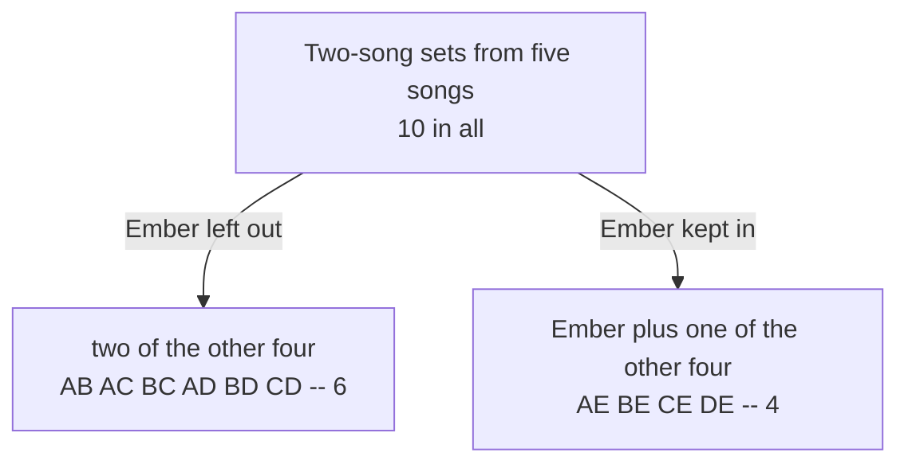

# Pascal's rule: each entry is the sum of the two above it, so the whole triangle builds itself and each row sums to 2^n

[Syllabus](../../../SYLLABUS.md) → [Combinatorics and graphs](../../../SYLLABUS.md#w04) → [Binomial Coefficients and Identities](../../../SYLLABUS.md#w04-s03) → Pascal's rule

---

## General Overview

A band has five songs ready: Anchor, Blue Hour, Cinders, Drift and Ember. A radio slot fits two. Which two? The question is which songs make the set, not the order they are played in. By first letter: AB, AC, BC, AD, BD, CD, AE, BE, CE, DE — ten of them.

Count them again without writing anything down. Single out one song, Ember. Every two-song set either leaves it out or keeps it in. Out, and both songs come from the other four: six sets. In, and the free slot takes one of the other four: four sets. No set is in both piles, none escapes both. Six and four make ten: one count on five songs became two counts on four. That works whatever the numbers are, and it is Pascal's rule.

Stack the counts in rows, one row per number of songs to choose from, and every entry is the sum of the two above it. Addition alone fills the array: Pascal's triangle, named for Blaise Pascal, whose *Treatise on the Arithmetical Triangle* was not the first study of it but the one that shaped what came after.

Add a row up and a second fact appears. The five-song row, 1 5 10 10 5 1, adds to 32: every set from silence to the full show. Thirty-two is 2 multiplied in five times, one yes-or-no decision per song.

**Each count of k items chosen from n splits by one singled-out item, in or out, so every entry of the triangle is the sum of the two above it, and a row adds to 2^n.**

**What kind of fact this is:** a theorem, proved on this card in Why it works.

### The picture: ten sets, split by one song



The branches add to the whole: 6 + 4 = 10.

---

## The formula

C(n, k) counts the ways to choose k items from n when order is ignored, read "n choose k" ([Combinations, n choose k](../01-Counting%20Principles/05-n-choose-k.md)). One convention makes the ends of a row behave: a count of something impossible is zero, so C(n, k) = 0 whenever k is below 0 or above n.

$$C(n, k) = C(n-1, k-1) + C(n-1, k)$$

**Read it aloud:** the picks of size k are the picks that keep one singled-out item, plus the picks that leave it out.

Adding a whole row gives the second statement:

$$C(n, 0) + C(n, 1) + \cdots + C(n, n) = 2^n$$

**Read it aloud:** counting picks size by size and adding gives the same total as one yes-or-no answer per item.

| Symbol | Plain meaning | In our example | Push it up and the answer… |
| --- | --- | --- | --- |
| $n$ | items available | 5 songs | longer rows, bigger counts |
| $k$ | items in one pick | 2 | climbs to mid-row, then falls |
| $C(n,k)$ | picks of $k$ from $n$ | C(5,2) = 10 | — |
| $C(n-1,k-1)$ | picks keeping the singled-out item | C(4,1) = 4 | — |
| $C(n-1,k)$ | picks leaving it out | C(4,2) = 6 | — |
| $2^n$ | 2 multiplied in $n$ times | 32 | doubles per item |

### When it holds

- **Whole numbers, and zero off the row.** Without C(n, k) = 0 past the ends, a row's outer entries have one parent, not two.
- **One item singled out, the same one on both sides.** Split on a different song in each branch and sets get counted twice.
- **Order ignored.** Count running orders and the two-song figure is 20, not 10.
- **Every size counted for the row sum.** Drop the empty set and the full set and 32 falls to 30.

---

## Why it works

### Step 0: one item turns a count into two smaller counts

Every two-song set answers one question about Ember — in or out — exactly once. Splitting a count along such a question is the plainest form of counting a collection two ways ([Bijections and double counting](../02-Repeats%2C%20Groups%20and%20Double%20Counting/05-bijection-and-double-counting.md)).

### Step 1: size the two branches

Take n items, pick k of them, single one item out.

- **Left out.** All k come from the remaining n − 1: C(n − 1, k) picks. Ember out: C(4, 2) = 6.
- **Kept in.** It fills one slot, the other k − 1 come from the remaining n − 1: C(n − 1, k − 1) picks. Ember in: C(4, 1) = 4.

Ember cannot be both, so nothing is counted twice and nothing escapes. Adding gives the rule: C(5, 2) = 6 + 4 = 10.

### Step 2: the ends of the row

The first and last entry of every row is 1: one way to take nothing, one to take everything. The zero convention keeps the rule true there, since C(n, 0) = C(n − 1, −1) + C(n − 1, 0) = 0 + 1 = 1.

### Step 3: the triangle builds itself

Row 0 is a single 1. Lined up by k, the size of the pick, each entry of row n is the sum of the one directly above it and the one above-left — the parents C(n − 1, k) and C(n − 1, k − 1), with blanks off the row counting as zero. Row 3 is 1 3 3 1, so row 4 is 1 4 6 4 1: the 6 is 3 + 3, each 4 is 1 + 3. The run below carries the array to row 10.

Step 1 proved the rule for every n and k, so the array of sums is the array of counts all the way down ([Induction](../../01-Foundations/06-Proof/04-proof-by-induction.md)): every entry is reachable by addition, no factorial formed, no division done.

### Step 4: the row doubles, by two separate arguments

**From the rule.** Each entry C(n − 1, j) of row n − 1 is a parent twice over, feeding C(n, j) and C(n, j + 1), so row n adds to twice row n − 1. Row 0 adds to 1, so row n adds to 2 multiplied in n times.

**Without the rule.** A pick of any size is a subset ([Subsets and the power set](../../01-Foundations/07-Sets/02-subsets-and-power-set.md)), and a subset is one yes-or-no answer per item: 2 × 2 × … × 2, n times over. Sorting the subsets by size and adding must reach the same total. Five songs give 32 sets, and 1 + 5 + 10 + 10 + 5 + 1 = 32.

<details>
<summary>The algebra behind the rule, if you want it</summary>

Write C(m, j) = m! / (j! (m − j)!), with m! = 1 × 2 × … × m and 0! = 1. For 0 < k < n, both C(n − 1, k − 1) = (n − 1)! / ((k − 1)! (n − k)!) and C(n − 1, k) = (n − 1)! / (k! (n − 1 − k)!) carry the factor (n − 1)! / ((k − 1)! (n − 1 − k)!). Pulling it out leaves 1/(n − k) and 1/k, which add to n / (k (n − k)). The total is then n! / (k! (n − k)!) = C(n, k), using (k − 1)! × k = k! and (n − 1 − k)! × (n − k) = (n − k)!. At k = 0 and k = n both sides read 1, since C(n − 1, −1) = C(n − 1, n) = 0.

</details>

A third route sets both letters to 1 in the expansion of a two-term power, collapsing it to the row's total; [The binomial theorem](02-binomial-theorem.md) does that, and the rule proved here is what makes those coefficients the triangle.

---

## Worked numbers, by hand

The triangle built by hand from the top, one addition at a time.

| Step | Arithmetic | Value |
| --- | --- | --- |
| row 5, from row 4 | 1, 1+4, 4+6, 6+4, 4+1, 1 | 1 5 10 10 5 1 |
| the two-song entry | 6 + 4 | **10** |
| row 5, added up | 1+5+10+10+5+1 | **32** |
| row 4 as one number | 10000 + 4000 + 600 + 40 + 1 | **14,641** |
| eleven, four times over | 11 × 11 × 11 × 11 | **14,641** |
| row 10, added up | 32 doubled five more times | **1,024** |

The band has 32 possible sets, 10 of them exactly two songs long. The last two lines are one fact twice: multiplying by 11 adds each digit to its neighbour, which is the rule again. Past row 4 the entries pass 9 and carry; row 5 gives 161,051.

### What breaks if you drop a piece

| Mistake | Comes out at | What went wrong |
| --- | --- | --- |
| Silence and the full show left out | 30, not 32 | The 1s at each end are picks too |
| C(4,2) added to itself, not to C(4,1) | 12, not 10 | Branches differ: 6 without Ember, 4 with |
| Running orders counted instead of sets | 20, not 10 | Two songs can be played two ways |

The code prints all three.

---

## Code, from first principles, and it actually runs

Nothing is imported. The triangle is built three ways sharing no arithmetic: adding the two entries above, the factorial formula with the factorials written out, and listing every pick and tallying the sizes. All three agree on rows 0 to 10. Row sums are then checked against plain doubling.

### Python

```python
# Pascal's rule and the triangle -- the check behind the card.  Nothing is imported.
# Five songs -- Anchor, Blue Hour, Cinders, Drift, Ember -- and a pick is which songs
# make the set, not the order they are played in.  The triangle is built three ways
# sharing no arithmetic: adding the two entries above, the factorial formula, and
# listing every pick one at a time.
ROWS = 10
SONGS = ["Anchor", "Blue Hour", "Cinders", "Drift", "Ember"]
def by_addition(top):                      # road one: each entry from the two above
    rows = [[1]]
    for n in range(1, top + 1):
        above = rows[-1]
        rows.append([1] + [above[k - 1] + above[k] for k in range(1, n)] + [1])
    return rows
def factorial(m):                          # 1 x 2 x ... x m, and 0! = 1
    out = 1
    for i in range(2, m + 1): out *= i
    return out
def choose(n, k):                          # road two: n! / (k! (n-k)!), zero off the row
    if k < 0 or k > n: return 0
    return factorial(n) // (factorial(k) * factorial(n - k))
def every_pick(n):                         # road three: one bit per song, in or out
    return [[i for i in range(n) if m >> i & 1] for m in range(2 ** n)]
def sizes(n):                              # how many of the listed picks are each size
    counts = [0] * (n + 1)
    for pick in every_pick(n): counts[len(pick)] += 1
    return counts
def as_number(row):                        # the row read as the digits of one number
    return sum(x * 10 ** (len(row) - 1 - i) for i, x in enumerate(row))
def elevens(k):                            # 11 multiplied in k times
    out = 1
    for _ in range(k): out *= 11
    return out
def yn(claim): return "yes" if claim else "no"

rows = by_addition(ROWS)
formula = [[choose(n, k) for k in range(n + 1)] for n in range(ROWS + 1)]
listed = [sizes(n) for n in range(ROWS + 1)]
sums = [sum(r) for r in rows]
doubling = [2 ** n for n in range(ROWS + 1)]
two = ["".join(SONGS[i][0] for i in p) for p in every_pick(5) if len(p) == 2]
out_e = [t for t in two if "E" not in t]
in_e = [t for t in two if "E" in t]
orders = [(a, b) for a in range(5) for b in range(5) if a != b]
print(f"five songs: {', '.join(SONGS)} -- a pick is which songs, not their order")
for n in range(ROWS + 1):
    print(f"row {n:>2}: {' '.join(str(x) for x in rows[n]):<36}adds to {sums[n]} = 2^{n}")
print(f"the same eleven rows from the factorial formula: {yn(formula == rows)}")
print(f"the same eleven rows by listing every pick: {yn(listed == rows)}")
print(f"the two-song picks, listed: {' '.join(two)}  ->  {len(two)}")
print(f"Pascal's rule at n = 5, k = 2: {len(out_e)} without Ember + {len(in_e)} with Ember = {len(two)}")
print(f"row 4 as one number: {as_number(rows[4])} = 11 multiplied in 4 times ({elevens(4)}); "
      f"row 5 carries to {as_number(rows[5])} = {elevens(5)}")
print(f"mistakes: dropping the empty and the full pick gives {sums[5] - 2}, not {sums[5]}; "
      f"adding C(4,2) twice gives {2 * choose(4, 2)}, not {choose(5, 2)}; "
      f"counting running orders gives {len(orders)}, not {len(two)}")
assert rows == formula                                   # addition against factorials
assert rows == listed                                    # addition against every pick listed
assert sums == doubling and sums[ROWS] == 1024           # row sums against doublings
assert as_number(rows[4]) == elevens(4) and len(out_e) + len(in_e) == choose(5, 2) == len(two)
print("ALL CHECKS PASS")
```

**Ran 2026-09-14 on macOS, Python 3.14.6, standard library only. All checks passed. Output, pasted from the run:**

```
five songs: Anchor, Blue Hour, Cinders, Drift, Ember -- a pick is which songs, not their order
row  0: 1                                   adds to 1 = 2^0
row  1: 1 1                                 adds to 2 = 2^1
row  2: 1 2 1                               adds to 4 = 2^2
row  3: 1 3 3 1                             adds to 8 = 2^3
row  4: 1 4 6 4 1                           adds to 16 = 2^4
row  5: 1 5 10 10 5 1                       adds to 32 = 2^5
row  6: 1 6 15 20 15 6 1                    adds to 64 = 2^6
row  7: 1 7 21 35 35 21 7 1                 adds to 128 = 2^7
row  8: 1 8 28 56 70 56 28 8 1              adds to 256 = 2^8
row  9: 1 9 36 84 126 126 84 36 9 1         adds to 512 = 2^9
row 10: 1 10 45 120 210 252 210 120 45 10 1 adds to 1024 = 2^10
the same eleven rows from the factorial formula: yes
the same eleven rows by listing every pick: yes
the two-song picks, listed: AB AC BC AD BD CD AE BE CE DE  ->  10
Pascal's rule at n = 5, k = 2: 6 without Ember + 4 with Ember = 10
row 4 as one number: 14641 = 11 multiplied in 4 times (14641); row 5 carries to 161051 = 161051
mistakes: dropping the empty and the full pick gives 30, not 32; adding C(4,2) twice gives 12, not 10; counting running orders gives 20, not 10
ALL CHECKS PASS
```

### Rust

Same numbers, same labels, built with `rustc --edition 2021 -O`.

```rust
// Pascal's rule and the triangle -- the same check as the Python, in Rust.  No
// crates.  Five songs -- Anchor, Blue Hour, Cinders, Drift, Ember -- and a pick is
// which songs make the set, not the order they are played in.  The triangle is
// built three ways sharing no arithmetic: adding the two entries above, the
// factorial formula, and listing every pick one at a time.
const ROWS: usize = 10;
const SONGS: [&str; 5] = ["Anchor", "Blue Hour", "Cinders", "Drift", "Ember"];
fn by_addition(top: usize) -> Vec<Vec<u64>> {   // road one: each entry from the two above
    let mut rows: Vec<Vec<u64>> = vec![vec![1]];
    for n in 1..=top {
        let above = &rows[n - 1];
        let mut row: Vec<u64> = (1..n).map(|k| above[k - 1] + above[k]).collect();
        row.insert(0, 1);
        row.push(1);
        rows.push(row);
    }
    rows
}
fn factorial(m: u64) -> u64 { (2..=m).fold(1, |out, i| out * i) }   // 1 x 2 x ... x m, and 0! = 1
fn choose(n: i64, k: i64) -> u64 {              // road two: n! / (k! (n-k)!), zero off the row
    if k < 0 || k > n { return 0 }
    factorial(n as u64) / (factorial(k as u64) * factorial((n - k) as u64))
}
fn every_pick(n: usize) -> Vec<Vec<usize>> {    // road three: one bit per song, in or out
    (0..(1usize << n)).map(|m| (0..n).filter(|i| m >> i & 1 == 1).collect()).collect()
}
fn sizes(n: usize) -> Vec<u64> {                // how many of the listed picks are each size
    let mut counts = vec![0u64; n + 1];
    for pick in every_pick(n) { counts[pick.len()] += 1 }
    counts
}
fn as_number(row: &[u64]) -> u64 {              // the row read as the digits of one number
    row.iter().enumerate().map(|(i, x)| x * 10u64.pow((row.len() - 1 - i) as u32)).sum()
}
fn elevens(k: u32) -> u64 { (0..k).fold(1u64, |out, _| out * 11) }  // 11 multiplied in k times
fn yn(claim: bool) -> &'static str { if claim { "yes" } else { "no" } }

fn main() {
    let rows = by_addition(ROWS);
    let formula: Vec<Vec<u64>> =
        (0..=ROWS).map(|n| (0..=n).map(|k| choose(n as i64, k as i64)).collect()).collect();
    let listed: Vec<Vec<u64>> = (0..=ROWS).map(sizes).collect();
    let sums: Vec<u64> = rows.iter().map(|r| r.iter().sum()).collect();
    let doubling: Vec<u64> = (0..=ROWS).map(|n| 1u64 << n).collect();
    let two: Vec<String> = every_pick(5).into_iter().filter(|p| p.len() == 2)
        .map(|p| p.iter().map(|&i| SONGS[i].chars().next().unwrap()).collect()).collect();
    let out_e: Vec<&String> = two.iter().filter(|t| !t.contains('E')).collect();
    let in_e: Vec<&String> = two.iter().filter(|t| t.contains('E')).collect();
    let orders: Vec<(i32, i32)> =
        (0..5).flat_map(|a| (0..5).map(move |b| (a, b))).filter(|(a, b)| a != b).collect();
    println!("five songs: {} -- a pick is which songs, not their order", SONGS.join(", "));
    for n in 0..=ROWS {
        let cells: Vec<String> = rows[n].iter().map(|x| x.to_string()).collect();
        println!("row {:>2}: {:<36}adds to {} = 2^{}", n, cells.join(" "), sums[n], n);
    }
    println!("the same eleven rows from the factorial formula: {}", yn(formula == rows));
    println!("the same eleven rows by listing every pick: {}", yn(listed == rows));
    println!("the two-song picks, listed: {}  ->  {}", two.join(" "), two.len());
    println!("Pascal's rule at n = 5, k = 2: {} without Ember + {} with Ember = {}",
             out_e.len(), in_e.len(), two.len());
    println!("row 4 as one number: {} = 11 multiplied in 4 times ({}); row 5 carries to {} = {}",
             as_number(&rows[4]), elevens(4), as_number(&rows[5]), elevens(5));
    println!("mistakes: dropping the empty and the full pick gives {}, not {}; adding C(4,2) twice \
gives {}, not {}; counting running orders gives {}, not {}",
             sums[5] - 2, sums[5], 2 * choose(4, 2), choose(5, 2), orders.len(), two.len());
    assert!(rows == formula);                            // addition against factorials
    assert!(rows == listed);                             // addition against every pick listed
    assert!(sums == doubling && sums[ROWS] == 1024);     // row sums against doublings
    assert!(as_number(&rows[4]) == elevens(4)
            && (out_e.len() + in_e.len()) as u64 == choose(5, 2) && two.len() == 10);
    println!("ALL CHECKS PASS");
}
```

**Ran 2026-09-14 on macOS, rustc 1.98.1, no crates. All checks passed. Output, pasted from the run:**

```
five songs: Anchor, Blue Hour, Cinders, Drift, Ember -- a pick is which songs, not their order
row  0: 1                                   adds to 1 = 2^0
row  1: 1 1                                 adds to 2 = 2^1
row  2: 1 2 1                               adds to 4 = 2^2
row  3: 1 3 3 1                             adds to 8 = 2^3
row  4: 1 4 6 4 1                           adds to 16 = 2^4
row  5: 1 5 10 10 5 1                       adds to 32 = 2^5
row  6: 1 6 15 20 15 6 1                    adds to 64 = 2^6
row  7: 1 7 21 35 35 21 7 1                 adds to 128 = 2^7
row  8: 1 8 28 56 70 56 28 8 1              adds to 256 = 2^8
row  9: 1 9 36 84 126 126 84 36 9 1         adds to 512 = 2^9
row 10: 1 10 45 120 210 252 210 120 45 10 1 adds to 1024 = 2^10
the same eleven rows from the factorial formula: yes
the same eleven rows by listing every pick: yes
the two-song picks, listed: AB AC BC AD BD CD AE BE CE DE  ->  10
Pascal's rule at n = 5, k = 2: 6 without Ember + 4 with Ember = 10
row 4 as one number: 14641 = 11 multiplied in 4 times (14641); row 5 carries to 161051 = 161051
mistakes: dropping the empty and the full pick gives 30, not 32; adding C(4,2) twice gives 12, not 10; counting running orders gives 20, not 10
ALL CHECKS PASS
```

The two outputs match line for line.

> [!TIP]
> **Try changing**
> Guess first, then run it.
> - **Break the addition.** In `by_addition`, add 1 to each interior entry: row 2 reads 1 3 1, and the first assert stops it.
> - **Split on another song.** Swap `"E"` for `"A"` in the lines building `out_e` and `in_e`. Still 6 and 4: which item is singled out never matters.
> - **Miscount one size.** In `sizes`, add 2 instead of 1 for a pick of three songs. Only the listing road moves, so the second assert stops it.

---

## The usual mistake

> [!warning]
> **Reading the triangle as a pattern in numbers rather than a record of choices.** Each addition is a real split: a set of k songs either keeps the singled-out song or leaves it out. Lose that and the rule looks like coincidence: the wrong pair gets added — C(4,2) + C(4,2) is 12, while the true split is 6 + 4 = 10.
>
> - **Forgetting that playing nothing is a pick.** Five songs give 32 sets, not 30. Silence and the full show are the 1s at the ends of the row.
> - **Counting running orders.** Two songs can be played two ways: 20 line-ups, but only 10 sets. The triangle counts sets.
> - **Starting the rows at one.** The top row is row 0, holding C(0,0) = 1. Call 1 4 6 4 1 the fifth row and the five-song answer reads 16, not 32.

---

## Where you meet it in real life

- **Tables of choice counts in software.** Addition keeps every number no larger than the answer; the factorial road builds enormous products first and overflows fixed-width integers far sooner.
- **Switches and trials.** Five on-off switches give 32 settings, 10 of them with exactly two on; the same row says 10 of the 32 records of five coin tosses show exactly two heads, favourable over possible.
- **Routes across a grid.** Each junction's count is the sum of the two feeding it — this rule drawn on paper: [Lattice paths](../06-Lattice%20Paths%20and%20Catalan%20Numbers/01-lattice-paths.md).

> **Say it back**
> Five songs, and a two-song set is one of ten. Count the ten again by singling out one song: six sets leave it out, four keep it in, and the piles never overlap. That split works for any number of items and any size of pick, so each count is the sum of two smaller counts, and addition alone fills Pascal's triangle. A row adds to 2 multiplied in n times, since a pick of any size is one yes-or-no answer per item: row 5 adds to 32, row 10 to 1,024.

---

## What this builds on

- [Combinations, n choose k](../01-Counting%20Principles/05-n-choose-k.md): what C(n, k) counts, and the factorial formula the second road uses.
- [Bijections and double counting](../02-Repeats%2C%20Groups%20and%20Double%20Counting/05-bijection-and-double-counting.md): why splitting a count into non-overlapping piles and adding is legitimate.
- [Induction](../../01-Foundations/06-Proof/04-proof-by-induction.md): how one row's total carries down to the next, forever.
- [Subsets and the power set](../../01-Foundations/07-Sets/02-subsets-and-power-set.md): the yes-or-no count of subsets that gives the row sum without the rule.

## Where this goes next

- [The binomial theorem](02-binomial-theorem.md): the rows as the coefficients of a two-term power.
- [Vandermonde's identity](03-vandermonde-identity.md): the same splitting argument run on two groups at once.
- [The hockey stick](04-hockey-stick-identity.md): what a diagonal of the triangle adds to.
- [Committee and chair](05-committee-chair-identity.md): singling out a member of the pick instead of the pool.
- [The middle of the row](07-central-binomial-and-bounds.md): how large the middle entry of a row gets.
- [Lattice paths](../06-Lattice%20Paths%20and%20Catalan%20Numbers/01-lattice-paths.md): the triangle drawn as a grid of routes.
- [Set partitions and Bell numbers](../08-Partitions/03-set-partitions-and-bell-numbers.md): the in-or-out split applied to breaking a set into groups.
- [Ramsey numbers](../14-Ramsey%20and%20Extremal%2C%20in%20Outline/02-ramsey-numbers.md): row entries used as bounds on when order must appear.

The rule fills the triangle but says nothing about what the rows are for; they turn out to be the coefficients of a two-term power, which is [The binomial theorem](02-binomial-theorem.md).

---

## Sources

Verified 14 Sep 2026: every link below resolves to the publisher's page.

- Edwards, A. W. F. *Pascal's Arithmetical Triangle: The Story of a Mathematical Idea*. Dover. [Publisher page](https://store.doverpublications.com/products/9780486832791). Traces the array through Hindu, Arabic and Chinese work long before Pascal.
- Graham, Ronald L., Donald E. Knuth, and Oren Patashnik. *Concrete Mathematics*, 2nd ed. Addison-Wesley, 1994. [Publisher page](https://www.informit.com/store/concrete-mathematics-a-foundation-for-computer-science-9780201558029). Chapter 5 states the addition formula and the row sum.
- "A007318: Pascal's triangle read by rows." On-Line Encyclopedia of Integer Sequences. [Sequence page](https://oeis.org/A007318). The entries, the recurrence and the row sums.
- O'Connor, J. J., and E. F. Robertson. "Blaise Pascal." MacTutor Archive, University of St Andrews. [Biography](https://mathshistory.st-andrews.ac.uk/Biographies/Pascal/). Places the *Treatise on the Arithmetical Triangle* and notes Pascal was not its first student.
