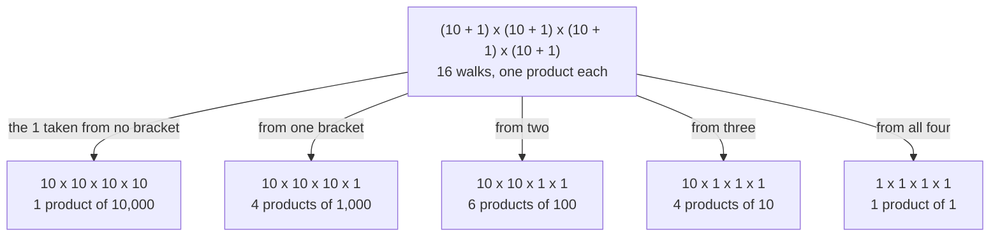
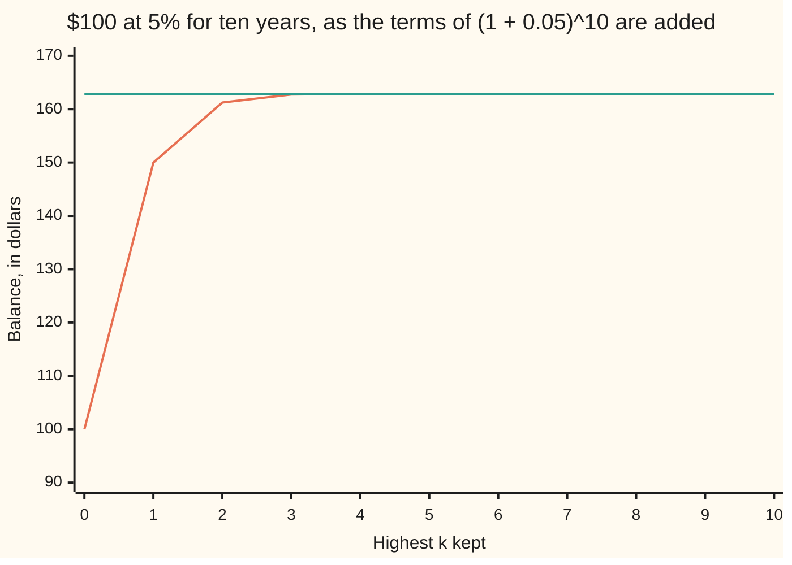

# The binomial theorem: (a + b)^n expands with choice counts as coefficients, and so does (a + b + c)^n

[Syllabus](../../../SYLLABUS.md) → [Combinatorics and graphs](../README.md) → [Binomial Coefficients and Identities](../README.md#s03) → The binomial theorem

---

## General Overview

Raise 11 to the fourth power: 14,641. The digits are 1, 4, 6, 4, 1 — row 4 of Pascal's triangle, the array in which each entry is the sum of the two above it ([Pascal's rule](01-pascals-rule-and-the-triangle.md)).

No coincidence. 11 is 10 + 1, so 11^4 is four brackets of (10 + 1) multiplied together. Multiplying them out means taking the 10 or the 1 from each and multiplying the four things taken. There are 16 walks: one takes no 1 and gives 10,000, four take it once and give 1,000 apiece, six take it twice and give 100, four give 10, one gives 1. The piles add: 10,000 + 4,000 + 600 + 40 + 1 = 14,641.

A pile's size counts the ways of choosing which brackets handed over the 1, and the triangle holds those counts. This card states the rule for any two numbers and any whole power, adds the three-term version, and takes a familiar balance apart: $100 at 5% for ten years reaches $162.89, where simple interest alone would stop at $150.00.

**Multiplying out n brackets of (a + b) means taking a or b from each, and walks that took b equally often land on the same piece — so the coefficients are choice counts, a row of Pascal's triangle.**

**What kind of fact this is:** a theorem, proved on this card in Why it works.

### The picture: sixteen walks, five piles



The five piles add to 14,641.

---

## The formula

Shorthand first, in words. A capital sigma, $\sum$, says add. Below it goes the letter that changes and where it starts, above it where it stops: k = 0 below and n above means work out what follows for k = 0, then k = 1, on up to n, and add.

Here $n$ is the power, the number of brackets; $a$ and $b$ the two things inside each; $k$ how many brackets hand over $b$. C(n, k) counts the ways of choosing which, read "n choose k" ([Pascal's rule](01-pascals-rule-and-the-triangle.md)).

$$(a + b)^n = \sum_{k=0}^{n} C(n, k)\; a^{\,n-k} b^{\,k}$$

**Read it aloud:** take b from k brackets and a from the rest, count the ways, and add one piece for every k from none to all. A piece is a **term**.

With a third thing, $c$, in the bracket, naming the brackets that gave $b$ no longer fixes a walk: each bracket has three doors. What fixes it is the split into the groups that gave $a$, $b$ and $c$ — sizes i, j and l, adding to n. Such splits number n! divided by i!, j! and l! ([Splitting into groups](../02-Repeats%2C%20Groups%20and%20Double%20Counting/03-splitting-into-groups.md)). Write it C(n; i, j, l), read "n split into i, j and l".

$$(a + b + c)^n = \sum C(n; i, j, l)\; a^{\,i} b^{\,j} c^{\,l}, \qquad C(n; i, j, l) = \frac{n!}{i!\; j!\; l!}$$

**Read it aloud:** one piece per triple of sizes i, j, l, weighted by how many splits give it. The sum runs over all whole i, j, l adding to n.

| Symbol | Plain meaning | In our example | Push it up and the answer… |
| --- | --- | --- | --- |
| $a$, $b$, $c$ | the things inside a bracket | 10 and 1, or 100, 10, 1 | pieces grow |
| $n$ | the power: how many brackets | 4 | longer row |
| $k$ | brackets handing over $b$ | 0 to 4 | weight to $b$ |
| $\sum$ | add what follows, once per $k$ | k = 0 up to 4 | more to add |
| $C(n, k)$ | ways to choose those $k$ | 1, 4, 6, 4, 1 | peaks mid-row |
| $C(n; i, j, l)$ | splits into three named groups | C(3; 1, 1, 1) = 6 | more piles |

### When it holds

- **A whole power, zero or more.** At n = 4 the sum stops after five pieces; a half or a minus never stops — Newton's series ([The binomial series and the number e](../../06-Calculus%20and%20analysis/06-Series/06-binomial-series-and-e.md)).
- **Order of multiplication must not matter.** Numbers are safe, square matrices are not: (A + B)^2 is A×A + A×B + B×A + B×B, and A×B + B×A need not be 2A×B.
- **A negative b is fine; the sign rides in b^k.** Odd k subtracts: (10 − 1)^4 is 6,561, or 9^4.
- **Empty powers count as 1, and 0! = 1.** That is what makes the ends of the row a^n and b^n.

---

## Why it works

### Step 0: multiplying brackets out is choosing from each

A fourth power is four copies, so 11^4 is (10 + 1) four times over. Every part of one bracket meets every part of the next: a walk takes one thing from each and multiplies them. Two doors, four brackets, 16 walks.

### Step 1: same doors, same piece, so a pile is a choice count

Taking the 1 from the second bracket only, and from the fourth only, both give 10 × 10 × 10 × 1 = 1,000: order of multiplication does not matter, so the product depends on how many brackets gave the 1, not which. The pile for "exactly k brackets" holds one walk per way of choosing those k out of n, which is C(n, k). At n = 4: 1, 4, 6, 4, 1.

### Step 2: add the piles

Every walk sits in one pile and no other, so the piles add to the whole expansion: C(n, k) copies of a^(n−k) b^k for each k. At a = 10, b = 1, n = 4: 10,000 + 4,000 + 600 + 40 + 1 = 14,641.

### Step 3: a second road, which never counts walks

Take (a + b)^3 = a^3 + 3a^2b + 3ab^2 + b^3 and multiply by one more bracket. Multiplying a piece by a leaves its count of b alone; by b raises it by one. So the new coefficient at k is the old one at k plus the old one at k − 1 — two neighbours in the row above. That is Pascal's rule: these coefficients are the triangle, not merely equal to it here.

<details>
<summary>Detailed proof, by adding one bracket at a time</summary>

The claim: for every whole n ≥ 0, (a + b)^n is the sum over k from 0 to n of C(n, k) a^(n−k) b^k.

**Base.** At n = 0 the empty product is 1, and the sum holds one piece: C(0, 0) a^0 b^0 = 1.

**Step.** Assume it at n and multiply by (a + b). Each piece times a gives C(n, k) a^(n+1−k) b^k; times b it gives C(n, k) a^(n−k) b^(k+1). Rename k + 1 as k in the second sum and its pieces read C(n, k − 1) a^(n+1−k) b^k. Both sums now cover the same pieces, so the coefficient of a^(n+1−k) b^k is C(n, k) + C(n, k − 1) — which Pascal's rule turns into C(n + 1, k). Off the ends, a count of something impossible is zero.

The claim at n forces it at n + 1 ([Induction](../../01-Foundations/06-Proof/04-proof-by-induction.md)).

</details>

### Step 4: two settings collapse the whole sum

Set a and b both to 1: every piece becomes its own coefficient, so the row adds to 2^n, and row 10 adds to 1,024. Set a = 1 and b = −1: the pieces are the coefficients with alternating signs, the left side is 0 to a positive power, and row 10 alternates to 0 — as many even-sized choices as odd ([Alternating sums](06-alternating-sums-and-binomial-inversion.md)).

### Step 5: three doors per bracket

With three doors a pile is fixed by a split rather than a choice, so it holds C(n; i, j, l) walks. Read 111^3 as (100 + 10 + 1)^3: the pile where every bracket gives something different holds 3!/(1! 1! 1!) = 6 walks worth 100 × 10 × 1, contributing 6,000. The piles add to 1,367,631.

---

## Worked numbers, by hand

Rows 0 to 10 are the house example; 11^4 needs row 4.

| Step | Arithmetic | Value |
| --- | --- | --- |
| row 3, then row 4 | 1 3 3 1, neighbours added | 1 4 6 4 1 |
| the pieces added | 10,000 + 4,000 + 600 + 40 + 1 | **14,641** |
| the row with b = −1 | 10,000 − 4,000 + 600 − 40 + 1 | **6,561**, or 9^4 |
| row 10 added up | 1 + 10 + 45 + 120 + 210 + 252 + … | **1,024** |

The digits match the triangle because the piles line up with the columns of a written number — while no coefficient reaches 10.

### A second case: what compounding is made of

$100 at 5% for ten years is 100 × (1 + 0.05)^10 ([Compound interest](../../01-Foundations/04-Compound%20Growth%20and%20Discounting/03-compound-interest.md)). Expanding with a = 1 and b = 0.05 takes it apart.

| Terms kept | What they are | Balance |
| --- | --- | --- |
| k = 0, then k = 1 | the $100, then 10 payments of 5% of it | **150.00**, simple interest |
| k = 2, then the rest | 45 pieces of interest earning interest, then smaller ones | 161.25, then **162.89** |

Everything past simple interest is $12.89, most of it the k = 2 piece.



The climbing line is the running total, the level line the balance, $162.89.

### What breaks if you drop a piece

| Mistake | Comes out at | What went wrong |
| --- | --- | --- |
| (10 + 1)^4 as 10^4 + 1^4 | 10,001 | 2 of the 16 walks counted |
| The counts dropped | 11,111 | 4, 6 and 4 walks read as one |
| (10 − 1)^4, signs lost | 14,641, not 6,561 | b^k carries the sign |
| Two terms of (1 + 0.05)^10 | 150.00, not 162.89 | Simple interest only |

The code prints all four.

---

## Code, from first principles, and it actually runs

Nothing is imported. The coefficients are built twice by roads sharing no arithmetic: adding neighbours down the triangle, and dividing factorials. (10 + 1)^4 is then reached by the formula and by marching over all 16 walks, the three-term case the same way with 27. The interest is done in exact whole cents, then by multiplying 1.05 in ten times.

### Python

```python
# The binomial theorem -- the check behind the card.  Nothing is imported.  Three
# roads to (10 + 1)^4 = 14,641: Pascal's triangle built by adding neighbours, the
# same counts built from factorials, and all 16 picks from the four brackets
# multiplied out.  Then $100 at 5% for ten years, and (100 + 10 + 1)^3 = 111^3.
ROWS = [[1]]
for _ in range(10):                          # road one: a row from the row above
    p = ROWS[-1]
    ROWS.append([1] + [p[i] + p[i + 1] for i in range(len(p) - 1)] + [1])
def fact(m):                                 # factorials, written out here
    out = 1
    for i in range(2, m + 1): out *= i
    return out
def choose(n, k): return fact(n) // (fact(k) * fact(n - k))   # road two, from factorials
def expand(a, b, n): return [ROWS[n][k] * a ** (n - k) * b ** k for k in range(n + 1)]
def picks(parts, n):                         # road three: every pick from every bracket
    total = 0
    for word in range(len(parts) ** n):
        prod, w = 1, word
        for _ in range(n): prod, w = prod * parts[w % len(parts)], w // len(parts)
        total += prod
    return total
def split3(a, b, c, n):                      # n!/(i! j! l!) over every split of n
    total = 0
    for i in range(n + 1):
        for j in range(n + 1 - i):
            l = n - i - j
            total += fact(n) // (fact(i) * fact(j) * fact(l)) * a ** i * b ** j * c ** l
    return total
def money(c): return f"{c // 100}.{c % 100:02d}"              # whole cents, as dollars
terms, signed = expand(10, 1, 4), expand(10, -1, 4)
digits = int("".join(str(v) for v in ROWS[5]))
cents = [(sum(ROWS[10][k] * 100 ** (10 - k) * 5 ** k for k in range(m + 1))
          + 5 * 10 ** 15) // 10 ** 16 for m in range(11)]     # exact, in whole cents
grown = 100.0
for _ in range(10): grown *= 1.05            # the same ten years, by multiplying
laws = all(sum(r) == 2 ** n and (n == 0 or sum((-1) ** k * v for k, v in enumerate(r)) == 0)
           for n, r in enumerate(ROWS))
print(f"row 4 by adding neighbours: {ROWS[4]}; by factorials: {[choose(4, k) for k in range(5)]}")
print(f"(10 + 1)^4 term by term: {' + '.join(str(t) for t in terms)} = {sum(terms)}; 11^4 = {11 ** 4}")
print(f"all {2 ** 4} picks from the four brackets, multiplied and added: {picks([10, 1], 4)}")
print(f"(10 - 1)^4 term by term: {signed} adds to {sum(signed)}; 9^4 = {9 ** 4}")
print(f"row 5: {ROWS[5]}; pasted together as digits {digits}, but 11^5 = {11 ** 5}")
print(f"row 10: {ROWS[10]}")
print(f"row 10 added up: {sum(ROWS[10])}; with alternating signs: "
      f"{sum((-1) ** k * v for k, v in enumerate(ROWS[10]))}")
print(f"every row 0 to 10 adds to 2^n, and alternates to 0 after row 0: {'yes' if laws else 'no'}")
print("$100 at 5% for ten years, one term at a time: " + " ".join(money(c) for c in cents))
print(f"the same balance by multiplying 1.05 in ten times: {grown:.2f}")
print(f"first two terms alone: {money(cents[1])}, simple interest; the other nine: {money(cents[10] - cents[1])}")
print(f"(100 + 10 + 1)^3 by split counts: {split3(100, 10, 1, 3)}; 111^3 = {111 ** 3}")
print(f"all {3 ** 3} picks from the three brackets, multiplied and added: {picks([100, 10, 1], 3)}")
print(f"one bracket each: 3!/(1!1!1!) = {fact(3) // (fact(1) ** 3)} orders, term {fact(3) * 100 * 10}")
print(f"mistake 1, (10 + 1)^4 read as 10^4 + 1^4: {10 ** 4 + 1 ** 4}, not {sum(terms)}")
print(f"mistake 2, the counts dropped: {sum(10 ** (4 - k) for k in range(5))}, not {sum(terms)}")
print(f"mistake 3, (10 - 1)^4 with the minus signs lost: {sum(terms)}, not {sum(signed)}")
assert sum(terms) == picks([10, 1], 4) == 11 ** 4 == 14641
assert [choose(4, k) for k in range(5)] == ROWS[4] and sum(ROWS[10]) == 2 ** 10
assert sum(signed) == 9 ** 4 and round(grown * 100) == cents[10] == 16289
assert split3(100, 10, 1, 3) == picks([100, 10, 1], 3) == 111 ** 3 and laws
print("ALL CHECKS PASS")
```

**Ran 2026-09-14 on macOS, Python 3.14.6, standard library only. All checks passed. Output, pasted from the run:**

```
row 4 by adding neighbours: [1, 4, 6, 4, 1]; by factorials: [1, 4, 6, 4, 1]
(10 + 1)^4 term by term: 10000 + 4000 + 600 + 40 + 1 = 14641; 11^4 = 14641
all 16 picks from the four brackets, multiplied and added: 14641
(10 - 1)^4 term by term: [10000, -4000, 600, -40, 1] adds to 6561; 9^4 = 6561
row 5: [1, 5, 10, 10, 5, 1]; pasted together as digits 15101051, but 11^5 = 161051
row 10: [1, 10, 45, 120, 210, 252, 210, 120, 45, 10, 1]
row 10 added up: 1024; with alternating signs: 0
every row 0 to 10 adds to 2^n, and alternates to 0 after row 0: yes
$100 at 5% for ten years, one term at a time: 100.00 150.00 161.25 162.75 162.88 162.89 162.89 162.89 162.89 162.89 162.89
the same balance by multiplying 1.05 in ten times: 162.89
first two terms alone: 150.00, simple interest; the other nine: 12.89
(100 + 10 + 1)^3 by split counts: 1367631; 111^3 = 1367631
all 27 picks from the three brackets, multiplied and added: 1367631
one bracket each: 3!/(1!1!1!) = 6 orders, term 6000
mistake 1, (10 + 1)^4 read as 10^4 + 1^4: 10001, not 14641
mistake 2, the counts dropped: 11111, not 14641
mistake 3, (10 - 1)^4 with the minus signs lost: 14641, not 6561
ALL CHECKS PASS
```

### Rust

Same numbers, same labels, built with `rustc --edition 2021 -O`.

```rust
// The binomial theorem -- the same check as the Python, in Rust.  No crates.  Three roads
// to (10 + 1)^4 = 14,641: Pascal's triangle built by adding neighbours, the same counts from
// factorials, and all 16 picks multiplied out.  Then $100 at 5%, and (100 + 10 + 1)^3 = 111^3.
fn rows() -> Vec<Vec<i128>> {                    // road one: a row from the row above
    let mut out: Vec<Vec<i128>> = vec![vec![1]];
    for _ in 0..10 {
        let p = out[out.len() - 1].clone();
        let mut r: Vec<i128> = (0..p.len() - 1).map(|i| p[i] + p[i + 1]).collect();
        r.insert(0, 1); r.push(1);
        out.push(r);
    }
    out
}
fn fact(m: i128) -> i128 { let mut out = 1; for i in 2..=m { out *= i } out }
fn choose(n: i128, k: i128) -> i128 { fact(n) / (fact(k) * fact(n - k)) }   // road two
fn expand(rows: &[Vec<i128>], a: i128, b: i128, n: usize) -> Vec<i128> {
    (0..=n).map(|k| rows[n][k] * a.pow((n - k) as u32) * b.pow(k as u32)).collect()
}
fn picks(parts: &[i128], n: u32) -> i128 {       // road three: every pick from every bracket
    let m = parts.len() as i128;
    let mut total = 0;
    for word in 0..m.pow(n) {
        let (mut prod, mut w) = (1i128, word);
        for _ in 0..n { prod *= parts[(w % m) as usize]; w /= m }
        total += prod;
    }
    total
}
fn split3(a: i128, b: i128, c: i128, n: i128) -> i128 {    // n!/(i! j! l!) over every split
    let mut total = 0;
    for i in 0..=n { for j in 0..=(n - i) {
        let l = n - i - j;
        total += fact(n) / (fact(i) * fact(j) * fact(l)) * a.pow(i as u32) * b.pow(j as u32) * c.pow(l as u32);
    }}
    total
}
fn money(c: i128) -> String { format!("{}.{:02}", c / 100, c % 100) }       // cents as dollars
fn main() {
    let rw = rows();
    let (terms, signed) = (expand(&rw, 10, 1, 4), expand(&rw, 10, -1, 4));
    let (sum_t, sum_s): (i128, i128) = (terms.iter().sum(), signed.iter().sum());
    let digits: i128 = rw[5].iter().map(|v| v.to_string()).collect::<String>().parse().unwrap();
    let cents: Vec<i128> = (0..=10).map(|m| {                          // exact, in whole cents
        let partial: i128 = (0..=m).map(|k| rw[10][k] * 100i128.pow((10 - k) as u32) * 5i128.pow(k as u32)).sum();
        (partial + 5 * 10i128.pow(15)) / 10i128.pow(16)
    }).collect();
    let mut grown = 100.0f64;
    for _ in 0..10 { grown *= 1.05 }             // the same ten years, by multiplying
    let alt = |r: &Vec<i128>| -> i128 { r.iter().enumerate().map(|(k, v)| if k % 2 == 0 { *v } else { -v }).sum() };
    let laws = rw.iter().enumerate()
        .all(|(n, r)| r.iter().sum::<i128>() == 1i128 << n && (n == 0 || alt(r) == 0));
    let row10: i128 = rw[10].iter().sum();
    let by_fact: Vec<i128> = (0..=4).map(|k| choose(4, k)).collect();
    println!("row 4 by adding neighbours: {:?}; by factorials: {:?}", rw[4], by_fact);
    println!("(10 + 1)^4 term by term: {} = {}; 11^4 = {}",
             terms.iter().map(|t| t.to_string()).collect::<Vec<String>>().join(" + "), sum_t, 11i128.pow(4));
    println!("all {} picks from the four brackets, multiplied and added: {}", 2i32.pow(4), picks(&[10, 1], 4));
    println!("(10 - 1)^4 term by term: {:?} adds to {}; 9^4 = {}", signed, sum_s, 9i128.pow(4));
    println!("row 5: {:?}; pasted together as digits {}, but 11^5 = {}", rw[5], digits, 11i128.pow(5));
    println!("row 10: {:?}", rw[10]);
    println!("row 10 added up: {}; with alternating signs: {}", row10, alt(&rw[10]));
    println!("every row 0 to 10 adds to 2^n, and alternates to 0 after row 0: {}",
             if laws { "yes" } else { "no" });
    println!("$100 at 5% for ten years, one term at a time: {}",
             cents.iter().map(|&c| money(c)).collect::<Vec<String>>().join(" "));
    println!("the same balance by multiplying 1.05 in ten times: {:.2}", grown);
    println!("first two terms alone: {}, simple interest; the other nine: {}",
             money(cents[1]), money(cents[10] - cents[1]));
    println!("(100 + 10 + 1)^3 by split counts: {}; 111^3 = {}", split3(100, 10, 1, 3), 111i128.pow(3));
    println!("all {} picks from the three brackets, multiplied and added: {}", 3i32.pow(3), picks(&[100, 10, 1], 3));
    println!("one bracket each: 3!/(1!1!1!) = {} orders, term {}", fact(3) / fact(1).pow(3), fact(3) * 100 * 10);
    println!("mistake 1, (10 + 1)^4 read as 10^4 + 1^4: {}, not {}", 10i128.pow(4) + 1, sum_t);
    println!("mistake 2, the counts dropped: {}, not {}", (0..=4).map(|k| 10i128.pow(4 - k)).sum::<i128>(), sum_t);
    println!("mistake 3, (10 - 1)^4 with the minus signs lost: {}, not {}", sum_t, sum_s);
    assert!(sum_t == picks(&[10, 1], 4) && sum_t == 11i128.pow(4) && sum_t == 14641);
    assert!(by_fact == rw[4] && row10 == 1i128 << 10);
    assert!(sum_s == 9i128.pow(4) && (grown * 100.0).round() as i128 == cents[10] && cents[10] == 16289);
    assert!(split3(100, 10, 1, 3) == picks(&[100, 10, 1], 3) && split3(100, 10, 1, 3) == 111i128.pow(3) && laws);
    println!("ALL CHECKS PASS");
}
```

**Ran 2026-09-14 on macOS, rustc 1.98.1, no crates. All checks passed. Output, pasted from the run:**

```
row 4 by adding neighbours: [1, 4, 6, 4, 1]; by factorials: [1, 4, 6, 4, 1]
(10 + 1)^4 term by term: 10000 + 4000 + 600 + 40 + 1 = 14641; 11^4 = 14641
all 16 picks from the four brackets, multiplied and added: 14641
(10 - 1)^4 term by term: [10000, -4000, 600, -40, 1] adds to 6561; 9^4 = 6561
row 5: [1, 5, 10, 10, 5, 1]; pasted together as digits 15101051, but 11^5 = 161051
row 10: [1, 10, 45, 120, 210, 252, 210, 120, 45, 10, 1]
row 10 added up: 1024; with alternating signs: 0
every row 0 to 10 adds to 2^n, and alternates to 0 after row 0: yes
$100 at 5% for ten years, one term at a time: 100.00 150.00 161.25 162.75 162.88 162.89 162.89 162.89 162.89 162.89 162.89
the same balance by multiplying 1.05 in ten times: 162.89
first two terms alone: 150.00, simple interest; the other nine: 12.89
(100 + 10 + 1)^3 by split counts: 1367631; 111^3 = 1367631
all 27 picks from the three brackets, multiplied and added: 1367631
one bracket each: 3!/(1!1!1!) = 6 orders, term 6000
mistake 1, (10 + 1)^4 read as 10^4 + 1^4: 10001, not 14641
mistake 2, the counts dropped: 11111, not 14641
mistake 3, (10 - 1)^4 with the minus signs lost: 14641, not 6561
ALL CHECKS PASS
```

The two outputs match line for line.

> [!TIP]
> **Try changing**
> Guess first, then run it. The asserts are pinned to 11^4, so expect one to stop the program.
> - **Put 2 in the bracket.** Change `expand(10, 1, 4)` and both `picks([10, 1], 4)` calls to use 2: the roads still agree, at 12^4 = 20,736, and the first assert stops the run.
> - **Break the triangle.** Add 1 to each new entry as the rows are built: row 4 stops being 1 4 6 4 1 and the factorial road no longer matches.
> - **Drop the last piece.** Run k from 0 to n − 1 in `expand`: the total falls one short of 14,641.

---

## The usual mistake

> [!warning]
> **Writing (a + b)^n as a^n + b^n.** At 10 and 1 that gives 10,001 against a true 14,641. The missing 4,000 + 600 + 40 is most of the answer: every walk that used both doors.
>
> - **Reading digits off the triangle once an entry reaches 10.** Row 5 is 1, 5, 10, 10, 5, 1; pasted together they read 15101051, while 11^5 is 161,051. The carrying is what breaks, not the pieces.
> - **Losing the sign.** (10 − 1)^4 unsigned gives 14,641, not 6,561.
> - **Forgetting the counts.** One copy of each piece gives 11,111.
> - **Stopping early.** Two terms of (1 + 0.05)^10 give $150.00, not $162.89.

---

## Where you meet it in real life

- **Arithmetic in the head.** 11^4 is row 4 as digits, 14,641; 9^4 is the same row with alternating signs, 6,561.
- **Savings and debt.** The $162.89 balance is the $150.00 that simple interest would reach, plus $12.89 of interest earning interest ([Compound interest](../../01-Foundations/04-Compound%20Growth%20and%20Discounting/03-compound-interest.md)).
- **Counting collections.** Both letters set to 1 makes this a subset count: row 10 adds to 1,024, one per way to answer ten yes-or-no questions.

> **Say it back**
> Multiplying brackets out means taking one thing from each and multiplying what was taken. Walks that took b equally often land on the same piece, so the pieces arrive in piles, and a pile's size counts the ways of choosing those brackets — an entry of Pascal's triangle. A third thing in the bracket puts a three-group split in place of that choice.

---

## What this builds on

- [Pascal's rule](01-pascals-rule-and-the-triangle.md): the counts, the rule that builds them, and the row sum 2^n.
- [Splitting into groups](../02-Repeats%2C%20Groups%20and%20Double%20Counting/03-splitting-into-groups.md): n! over the group sizes' factorials, the three-term coefficient.
- [Polynomials](../../03-Algebra/02-Polynomials/01-polynomials.md): what multiplying brackets out means, and why like pieces are collected.
- [Compound interest](../../01-Foundations/04-Compound%20Growth%20and%20Discounting/03-compound-interest.md): the $162.89 this card takes apart.

## Where this goes next

- [Alternating sums](06-alternating-sums-and-binomial-inversion.md): what the a = 1, b = −1 setting is good for.
- [Generating functions](../07-Generating%20Functions/01-ordinary-generating-functions.md): (1 + b)^n as a machine carrying a whole row.
- [The binomial series and the number e](../../06-Calculus%20and%20analysis/06-Series/06-binomial-series-and-e.md): the same sum when the power is a half or a minus.
- [Binomial](../../09-Probability%20and%20statistics/03-Discrete%20Distributions/01-bernoulli-and-binomial.md): these pieces, with a and b as the chances of a miss and a hit.

Every term here is weighed by a plain count, which leaves a later shelf's question: what a whole row is worth once the powers mark places in a sequence.

---

## Sources

Verified 14 Sep 2026: every link below resolves to the publisher's page.

- Olver, F. W. J., et al., eds. *NIST Digital Library of Mathematical Functions*, §1.2(i), "Binomial Coefficients". [dlmf.nist.gov/1.2](https://dlmf.nist.gov/1.2). Free. The expansion, the row sum 2^n, the alternating sum.
- Olver, F. W. J., et al., eds. *NIST DLMF*, §26.4, "Multinomial Coefficients". [dlmf.nist.gov/26.4](https://dlmf.nist.gov/26.4). Free. The three-term version.
- Hammack, Richard. *Book of Proof*, 3rd ed. [Full text, free](https://richardhammack.github.io/BookOfProof/). Section 3.6 proves it from the choice count and from Pascal's rule.
- O'Connor, J. J., and E. F. Robertson. "Blaise Pascal." MacTutor Archive, St Andrews. [Biography](https://mathshistory.st-andrews.ac.uk/Biographies/Pascal/). Dates the *Treatise on the Arithmetical Triangle*.
