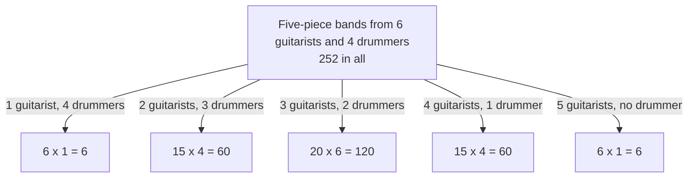

# Vandermonde's identity: choosing from two merged groups splits by how many come from each

[Syllabus](../../../SYLLABUS.md) → [Combinatorics and graphs](../README.md) → [Binomial Coefficients and Identities](../README.md#s03) → Vandermonde's identity

---

## General Overview

A studio is putting a five-piece band together. Six guitarists and four drummers have auditioned: ten players, five seats, no seat named — a band is which five play, not who stands where. Ignore who plays what and the count is the ten-choose-five figure, 252.

Now ask what the studio cares about: how many guitars? That number settles the rest, since the seats left over go to drummers.

So count one guitar-count at a time. One guitarist: 6 ways to pick that player, and all four drummers play — 6 bands. Two: 15 ways to pick the pair, 4 ways to leave one drummer out — 60. Three: 20 times 6 — 120. Four: 15 times 4 — 60. Five: 6 times 1 — 6. Nothing is double-booked and nothing escapes, so the cases add to the whole: 6 + 60 + 120 + 60 + 6 = 252 — the same number, counted the long way.

That is the theorem. It carries the name of Alexandre-Théophile Vandermonde, a violinist who turned to mathematics at thirty-five; the identity is older, and Chinese texts had it by 1303.

**Choosing a fixed number of people from two separate groups splits by how many come from the first group: multiply the two counts inside each split, add the splits, and the total is the count from the merged pool.**

**What kind of fact this is:** a theorem, proved on this card in Why it works.

### The picture: 252 bands, sorted by how many guitars



There is no branch for a band with no guitarist: five seats cannot be filled from four drummers.

---

## The formula

C(n, k) counts the ways to choose k items from n when order is ignored, read "n choose k"; it is 0 whenever k is below 0 or above n, a count of something impossible ([Pascal's rule](01-pascals-rule-and-the-triangle.md)). The tall Σ is the instruction to add, with the letter that changes and its first value below, its last value above ([The binomial theorem](02-binomial-theorem.md)).

$$C(m+n,\ r) \;=\; \sum_{k=0}^{r} C(m,\ k)\; C(n,\ r-k)$$

**Read it aloud:** for each number k that could come from the first group, multiply the ways to pick those k by the ways to finish from the second, then add.

Here $m$ is 6 guitarists, $n$ is 4 drummers, $r$ is 5 seats, and the term at $k$ = 0 is C(6, 0) × C(4, 5) = 1 × 0 = 0 — the missing branch on the picture, doing its job quietly.

| Symbol | Plain meaning | In our example | Push it up and the answer… |
| --- | --- | --- | --- |
| $m$ | size of the first group | 6 guitarists | bigger terms |
| $n$ | size of the second group | 4 drummers | bigger terms |
| $r$ | how many are chosen in all | 5 seats | climbs to mid-row, then falls |
| $k$ | how many of the $r$ come from the first group | 0 to 5 | picks out a different term |
| $C(m,k)$ | ways to choose those $k$ | C(6,3) = 20 | — |
| $C(n,r-k)$ | ways to fill the rest | C(4,2) = 6 | — |
| $C(m+n,r)$ | ways to choose $r$ from the pool | C(10,5) = 252 | — |
| $\sum_{k=0}^{r}$ | add the term over every $k$ | 0+6+60+120+60+6 | — |

### When it holds

- **The groups share no member.** A player on both lists falls into two branches: nine real people give 126 bands, while the split reports 252.
- **Counts of the impossible read as zero.** C(4, 5) = 0 makes the no-guitarist term vanish rather than break the sum.
- **Order ignored on both sides.** Count line-ups and the figure is 30,240, not 252.
- **k runs over every split, 0 to r.** Stopping at 4, the drummer count, loses the six all-guitar bands: 246.

---

## Why it works

### Step 0: every band answers one question about itself

Pick up any of the 252 bands and count its guitarists. The answer is one number between 0 and 5, never two, so the bands fall into six labelled piles and each sits in exactly one. Counting pile by pile and adding is the move behind every identity on this shelf.

### Step 1: size one pile

Take the pile with exactly 3 guitarists. Building one is two choices in a row: which 3 of the 6 guitarists play, C(6, 3) = 20 ways, then which 2 of the 4 drummers fill the seats left over, C(4, 2) = 6 ways. Any trio goes with any drummer pair, each pairing a different band, so the pile holds 20 × 6 = 120. In letters, the pile labelled $k$ holds C($m$, $k$) × C($n$, $r-k$) bands.

### Step 2: add the piles

The piles cannot overlap, since a band has one guitar count, and nothing escapes them, since every band has one. So the pile sizes add to the total — which is what the pooled count C($m+n$, $r$) measures. That is the identity.

### Step 3: the zero convention closes the ends

Let $k$ run from 0 to $r$ and an end term can look wrong: there is no such thing as 5 drummers chosen from 4. Read that as a count of zero and the term is 1 × 0 = 0, which is right — there are no bands without a guitarist. One formula then covers every pool, with no special cases.

<details>
<summary>Detailed proof</summary>

Let A and B share no member, A holding $m$ people and B holding $n$. A band is a set S of $r$ people from the two pooled: C($m+n$, $r$) of them.

Every S splits into the part inside A and the part inside B. Those share no one and together hold all of S, so their sizes add to $r$. Write $k$ for the size of the part inside A; the other has size $r-k$.

The bands with a given $k$ are exactly the pairs — a set of $k$ from A, a set of $r-k$ from B. Each pair pools to one band and each band gives back one pair, so that pile holds C($m$, $k$) × C($n$, $r-k$) bands. Different $k$ give different bands and every band has a $k$, so adding over $k$ counts each band once. Terms where $k$ exceeds $m$, or $r-k$ exceeds $n$, count empty collections and contribute 0.

</details>

### Step 4: equal groups turn the sum into a sum of squares

Change the pool: 5 guitarists and 5 drummers, five seats. The split gives 1, 25, 100, 100, 25, 1 — adding again to 252, since the pool is still ten players.

The term at $k$ is C(5, $k$) × C(5, 5−$k$). Choosing which 3 of 5 drummers play is choosing which 2 sit out, so C(5, 5−$k$) = C(5, $k$) and every term is a number multiplied by itself: 1, 5, 10, 10, 5 and 1, squared.

In letters, with both groups of size $n$ and $r$ = $n$ seats:

$$C(2n,\ n) \;=\; \sum_{k=0}^{n} C(n,\ k)^2$$

**Read it aloud:** the middle entry of an even-numbered row of Pascal's triangle is every entry of the half-sized row squared and added. Row 5 is 1 5 10 10 5 1, and its squares add to 252.

A second road reaches the identity through powers rather than piles. Multiply out a bracket raised to $m$ against one raised to $n$ and collect the terms carrying the same number of one letter: drawing $k$ copies from the first bracket and $r-k$ from the second is a band again. The two brackets multiply to one raised to $m+n$, so the collected counts must agree. [The binomial theorem](02-binomial-theorem.md) sets up that expansion properly.

---

## Worked numbers, by hand

The band, split by guitar count, checked against the pooled figure.

| Step | Arithmetic | Value |
| --- | --- | --- |
| no guitarist | 1 × C(4,5): four drummers cannot fill five seats | 0 |
| one guitarist | 6 × 1 | 6 |
| two guitarists | 15 × 4 | 60 |
| three guitarists | 20 × 6 | 120 |
| four guitarists | 15 × 4 | 60 |
| five guitarists | 6 × 1 | 6 |
| the splits, added | 0 + 6 + 60 + 120 + 60 + 6 | **252** |
| the pool, counted once | C(10,5), the middle of row 10 | **252** |
| the row it sits in | 1 10 45 120 210 252 210 120 45 10 1, adding to | **1,024** |

Both roads say 252, and 120 of those bands — just under half — put three guitars on stage. The split humps in the middle: a mixed band can be built in far more ways than a pure one.

```
Bands by how many guitarists play, one █ per 6 bands

1 guitarist   █                                   6
2 guitarists  ██████████                         60
3 guitarists  ████████████████████              120
4 guitarists  ██████████                         60
5 guitarists  █                                   6
```

### What breaks if you drop a piece

| Mistake | Comes out at | What went wrong |
| --- | --- | --- |
| The same k in both groups, C(6,k) × C(4,k) | 1 + 24 + 90 + 80 + 15 = 210 | Counts bands of 2k players, not of 5 |
| k stopped at 4, the drummer count | 246 | The six all-guitar bands count too |
| Line-ups counted instead of bands | 30,240 | Order counted: 252 × 120 |
| One player on both lists | 252, where nine people give 126 | Overlapping groups double-book |

The code prints all four.

---

## Code, from first principles, and it actually runs

Nothing is imported. The 252 bands are counted twice by roads sharing no arithmetic. The first lists every five-member band out of the ten players and tallies them by guitar count — no formula in it. The second reads C(6, k) and C(4, 5−k) off a triangle built by addition alone, and multiplies. A second case runs the equal pool, 5 and 5, against the squares of row 5; a sweep then tests every pool up to 8 and 8.

### Python

```python
# Vandermonde's identity -- the check behind the card.  Nothing is imported.  Ten
# musicians, 6 guitarists and 4 drummers, and a band is 5 of them, order ignored.
# The bands are counted twice by roads sharing no arithmetic: every band listed one
# at a time, and the split C(6,k) x C(4,5-k) read off a triangle built by addition
# alone.  Equal groups then turn the same sum into a sum of squares.
GUITARS, DRUMS, SEATS = 6, 4, 5
def triangle(top):                      # every count from addition alone, no factorials
    rows = [[1]]
    for n in range(1, top + 1):
        up = rows[-1]
        rows.append([1] + [up[k - 1] + up[k] for k in range(1, n)] + [1])
    return rows
T = triangle(16)
def C(n, k):                            # picks of k from n, and zero off the row
    return 0 if k < 0 or k > n else T[n][k]
def listed(pool, seats, first):         # road one: every band listed, split by first-group size
    counts = [0] * (seats + 1)
    for mask in range(1 << pool):
        chosen = [i for i in range(pool) if mask >> i & 1]
        if len(chosen) == seats:
            counts[sum(1 for i in chosen if i < first)] += 1
    return counts
def split(m, n, r):                     # road two: k from the first group, the rest from the second
    return [C(m, k) * C(n, r - k) for k in range(r + 1)]
def grid(name, xs): print(f"{name:<33}" + "".join(f"{x:>6}" for x in xs))
def flat(xs): return " ".join(str(x) for x in xs)
by_hand = listed(GUITARS + DRUMS, SEATS, GUITARS)
terms = split(GUITARS, DRUMS, SEATS)
whole = C(GUITARS + DRUMS, SEATS)
even = listed(2 * SEATS, SEATS, SEATS)
squares = [C(SEATS, k) ** 2 for k in range(SEATS + 1)]
triples = [(m, n, r) for m in range(9) for n in range(9) for r in range(m + n + 3)]
holds = sum(1 for m, n, r in triples if C(m + n, r) == sum(split(m, n, r)))
same_k = [C(GUITARS, k) * C(DRUMS, k) for k in range(DRUMS + 1)]
stopped = sum(terms[:SEATS])
lineups, orderings = 1, 1
for i in range(SEATS): lineups *= GUITARS + DRUMS - i
for i in range(1, SEATS + 1): orderings *= i
shared = sum(listed(GUITARS + DRUMS - 1, SEATS, 0))
print(f"{GUITARS + DRUMS} musicians: {GUITARS} guitarists and {DRUMS} drummers; "
      f"a band is {SEATS} of them, order ignored")
grid("guitarists in the band, k", list(range(SEATS + 1)))
grid("ways to choose those guitarists", [C(GUITARS, k) for k in range(SEATS + 1)])
grid("ways to fill the rest from 4", [C(DRUMS, SEATS - k) for k in range(SEATS + 1)])
grid("bands with that many guitarists", terms)
print(f"road one, every band listed and sorted by guitarist count: {flat(by_hand)}, adding to {sum(by_hand)}")
print(f"road two, the products above added: {sum(terms)}; the whole pool at once, C(10,5) = {whole}")
print(f"row 10 of the triangle: {flat(T[10])}, adding to {sum(T[10])}, middle entry {T[10][SEATS]}")
print(f"5 guitarists and 5 drummers instead: {flat(even)}, adding to {sum(even)}")
print(f"the same six terms as the squares of row 5 ({flat(T[5])}): {flat(squares)}")
print(f"the identity on every m, n up to 8 and every r up to m+n+2: {holds} of {len(triples)} triples hold")
print(f"mistake 1, the same k in both groups: {' + '.join(str(x) for x in same_k)} = {sum(same_k)}, not {whole}")
print(f"mistake 2, k stopped at 4, the drummer count: {stopped}, not {whole}")
print(f"mistake 3, line-ups counted instead of bands: {lineups} = {whole} x {orderings}, not {whole}")
print(f"mistake 4, one player on both lists: 9 people give {shared} bands, the split still says {sum(terms)}")
assert by_hand == terms and sum(by_hand) == whole          # listing against the split, and against C(10,5)
assert even == squares and sum(even) == whole              # equal groups: listing against squares of row 5
assert holds == len(triples) and lineups == whole * orderings
assert shared == C(GUITARS + DRUMS - 1, SEATS) and sum(same_k) == C(GUITARS + DRUMS, DRUMS)
print("ALL CHECKS PASS")
```

**Ran 2026-09-14 on macOS, Python 3.14.6, standard library only. All checks passed. Output, pasted from the run:**

```
10 musicians: 6 guitarists and 4 drummers; a band is 5 of them, order ignored
guitarists in the band, k             0     1     2     3     4     5
ways to choose those guitarists       1     6    15    20    15     6
ways to fill the rest from 4          0     1     4     6     4     1
bands with that many guitarists       0     6    60   120    60     6
road one, every band listed and sorted by guitarist count: 0 6 60 120 60 6, adding to 252
road two, the products above added: 252; the whole pool at once, C(10,5) = 252
row 10 of the triangle: 1 10 45 120 210 252 210 120 45 10 1, adding to 1024, middle entry 252
5 guitarists and 5 drummers instead: 1 25 100 100 25 1, adding to 252
the same six terms as the squares of row 5 (1 5 10 10 5 1): 1 25 100 100 25 1
the identity on every m, n up to 8 and every r up to m+n+2: 891 of 891 triples hold
mistake 1, the same k in both groups: 1 + 24 + 90 + 80 + 15 = 210, not 252
mistake 2, k stopped at 4, the drummer count: 246, not 252
mistake 3, line-ups counted instead of bands: 30240 = 252 x 120, not 252
mistake 4, one player on both lists: 9 people give 126 bands, the split still says 252
ALL CHECKS PASS
```

### Rust

Same numbers, same labels, built with `rustc --edition 2021 -O`.

```rust
// Vandermonde's identity -- the same check as the Python, in Rust.  No crates.  Ten
// musicians, 6 guitarists and 4 drummers, and a band is 5 of them, order ignored.
// The bands are counted twice by roads sharing no arithmetic: every band listed one
// at a time, and the split C(6,k) x C(4,5-k) read off a triangle built by addition
// alone.  Equal groups then turn the same sum into a sum of squares.
const GUITARS: i64 = 6;  const DRUMS: i64 = 4;  const SEATS: i64 = 5;
fn triangle(top: usize) -> Vec<Vec<i64>> {   // every count from addition alone, no factorials
    let mut rows: Vec<Vec<i64>> = vec![vec![1]];
    for n in 1..=top {
        let up = &rows[n - 1];
        let mut r: Vec<i64> = (1..n).map(|k| up[k - 1] + up[k]).collect();
        r.insert(0, 1);  r.push(1);  rows.push(r);
    }
    rows
}
fn c(t: &[Vec<i64>], n: i64, k: i64) -> i64 {   // picks of k from n, and zero off the row
    if k < 0 || k > n { 0 } else { t[n as usize][k as usize] }
}
fn listed(pool: i64, seats: i64, first: i64) -> Vec<i64> {  // road one: every band listed
    let mut counts = vec![0i64; seats as usize + 1];
    for mask in 0..(1i64 << pool) {
        let chosen: Vec<i64> = (0..pool).filter(|i| mask >> i & 1 == 1).collect();
        if chosen.len() as i64 == seats {
            counts[chosen.iter().filter(|&&i| i < first).count()] += 1;
        }
    }
    counts
}
fn split(t: &[Vec<i64>], m: i64, n: i64, r: i64) -> Vec<i64> {   // road two: k from the first group
    (0..=r).map(|k| c(t, m, k) * c(t, n, r - k)).collect()
}
fn grid(name: &str, xs: &[i64]) {
    let mut line = format!("{:<33}", name);
    for x in xs { line.push_str(&format!("{:>6}", x)); }
    println!("{}", line);
}
fn flat(xs: &[i64]) -> String { xs.iter().map(|x| x.to_string()).collect::<Vec<_>>().join(" ") }
fn total(xs: &[i64]) -> i64 { xs.iter().sum() }
fn main() {
    let t = triangle(16);
    let by_hand = listed(GUITARS + DRUMS, SEATS, GUITARS);
    let terms = split(&t, GUITARS, DRUMS, SEATS);
    let whole = c(&t, GUITARS + DRUMS, SEATS);
    let even = listed(2 * SEATS, SEATS, SEATS);
    let squares: Vec<i64> = (0..=SEATS).map(|k| c(&t, SEATS, k) * c(&t, SEATS, k)).collect();
    let (mut triples, mut holds) = (0i64, 0i64);
    for m in 0..9 { for n in 0..9 { for r in 0..(m + n + 3) {
        triples += 1;
        if c(&t, m + n, r) == total(&split(&t, m, n, r)) { holds += 1 }
    }}}
    let same_k: Vec<i64> = (0..=DRUMS).map(|k| c(&t, GUITARS, k) * c(&t, DRUMS, k)).collect();
    let stopped: i64 = total(&terms[..SEATS as usize]);
    let (mut lineups, mut orderings) = (1i64, 1i64);
    for i in 0..SEATS { lineups *= GUITARS + DRUMS - i }
    for i in 1..=SEATS { orderings *= i }
    let shared = total(&listed(GUITARS + DRUMS - 1, SEATS, 0));
    println!("{} musicians: {} guitarists and {} drummers; a band is {} of them, order ignored",
             GUITARS + DRUMS, GUITARS, DRUMS, SEATS);
    grid("guitarists in the band, k", &(0..=SEATS).collect::<Vec<i64>>());
    grid("ways to choose those guitarists", &(0..=SEATS).map(|k| c(&t, GUITARS, k)).collect::<Vec<i64>>());
    grid("ways to fill the rest from 4", &(0..=SEATS).map(|k| c(&t, DRUMS, SEATS - k)).collect::<Vec<i64>>());
    grid("bands with that many guitarists", &terms);
    println!("road one, every band listed and sorted by guitarist count: {}, adding to {}", flat(&by_hand), total(&by_hand));
    println!("road two, the products above added: {}; the whole pool at once, C(10,5) = {}", total(&terms), whole);
    println!("row 10 of the triangle: {}, adding to {}, middle entry {}", flat(&t[10]), total(&t[10]), t[10][SEATS as usize]);
    println!("5 guitarists and 5 drummers instead: {}, adding to {}", flat(&even), total(&even));
    println!("the same six terms as the squares of row 5 ({}): {}", flat(&t[5]), flat(&squares));
    println!("the identity on every m, n up to 8 and every r up to m+n+2: {} of {} triples hold", holds, triples);
    println!("mistake 1, the same k in both groups: {} = {}, not {}",
             same_k.iter().map(|x| x.to_string()).collect::<Vec<_>>().join(" + "), total(&same_k), whole);
    println!("mistake 2, k stopped at 4, the drummer count: {}, not {}", stopped, whole);
    println!("mistake 3, line-ups counted instead of bands: {} = {} x {}, not {}", lineups, whole, orderings, whole);
    println!("mistake 4, one player on both lists: 9 people give {} bands, the split still says {}", shared, total(&terms));
    assert!(by_hand == terms && total(&by_hand) == whole);      // listing against the split, and against C(10,5)
    assert!(even == squares && total(&even) == whole);          // equal groups: listing against squares of row 5
    assert!(holds == triples && lineups == whole * orderings);
    assert!(shared == c(&t, GUITARS + DRUMS - 1, SEATS) && total(&same_k) == c(&t, GUITARS + DRUMS, DRUMS));
    println!("ALL CHECKS PASS");
}
```

**Ran 2026-09-14 on macOS, rustc 1.98.1, no crates. All checks passed. Output, pasted from the run:**

```
10 musicians: 6 guitarists and 4 drummers; a band is 5 of them, order ignored
guitarists in the band, k             0     1     2     3     4     5
ways to choose those guitarists       1     6    15    20    15     6
ways to fill the rest from 4          0     1     4     6     4     1
bands with that many guitarists       0     6    60   120    60     6
road one, every band listed and sorted by guitarist count: 0 6 60 120 60 6, adding to 252
road two, the products above added: 252; the whole pool at once, C(10,5) = 252
row 10 of the triangle: 1 10 45 120 210 252 210 120 45 10 1, adding to 1024, middle entry 252
5 guitarists and 5 drummers instead: 1 25 100 100 25 1, adding to 252
the same six terms as the squares of row 5 (1 5 10 10 5 1): 1 25 100 100 25 1
the identity on every m, n up to 8 and every r up to m+n+2: 891 of 891 triples hold
mistake 1, the same k in both groups: 1 + 24 + 90 + 80 + 15 = 210, not 252
mistake 2, k stopped at 4, the drummer count: 246, not 252
mistake 3, line-ups counted instead of bands: 30240 = 252 x 120, not 252
mistake 4, one player on both lists: 9 people give 126 bands, the split still says 252
ALL CHECKS PASS
```

The two outputs match line for line.

> [!TIP]
> **Try changing**
> Guess first, then run it. The asserts are pinned to the band, so expect one to stop it.
> - **Pair the same k in both groups.** In `split`, change `C(n, r - k)` to `C(n, k)`. The total drops to 210 and the first assert stops it.
> - **Hire a bigger pool.** Set `GUITARS` to 8. Listing and split still agree, at 792, but the pinned trap numbers do not, and a later assert stops it.
> - **Break the triangle.** In `triangle`, add 1 to each interior entry. Only the second road moves, so the two counts of 252 split apart.

---

## The usual mistake

> [!warning]
> **Pairing the same k on both sides, writing C(6, k) × C(4, k) instead of C(6, k) × C(4, 5 − k).** It looks symmetrical and counts something else: bands of 2k players, one group matching the other. At this pool it totals 210, the count of four-piece bands — Vandermonde again, since C(4, k) = C(4, 4 − k). The second factor is what is left after the first choice, so its lower number is the leftover, 5 − k.
>
> - **Reading it as Pascal's rule.** Pascal splits one group by whether a named member is in; this splits one choice across two groups. Pascal is the case where the second group holds one person.
> - **Stopping the sum early.** Letting k run only to 4, the drummer count, gives 246.
> - **Letting the groups overlap.** Nine people give 126 bands, and the split still says 252.
> - **Meeting the other Vandermonde.** A determinant carries the same surname, unrelated to this sum.

---

## Where you meet it in real life

- **Sampling a batch with two kinds in it.** Take 5 units from a crate of 6 good and 4 faulty: exactly 3 good ones happens in 120 of the 252 draws, favourable over possible — one term of this sum over the total.
- **Routes across a grid.** Cut a route to a far corner at a line partway across: the pieces on each side multiply, and the cuts add. This identity, drawn on paper: [Lattice paths](../06-Lattice%20Paths%20and%20Catalan%20Numbers/01-lattice-paths.md).
- **The middle of a row.** The sum-of-squares form is where the central entry 252 comes from, and that entry governs how big a row gets: [The middle of the row](07-central-binomial-and-bounds.md).

> **Say it back**
> Ten players, six on guitar and four on drums, make 252 five-piece bands. Count them again by how many guitars are on stage: 6, then 60, then 120, then 60, then 6, adding to the same 252. The piles cannot overlap and none is missed, so the pooled count equals the sum of the split counts. That is Vandermonde's identity. When the groups are the same size and the band takes half the pool, every term becomes a square: the middle entry of a row of Pascal's triangle is the squares of the row half its size, added.

---

## What this builds on

- [Pascal's rule](01-pascals-rule-and-the-triangle.md): what C(n, k) counts, the zero convention, and the triangle the code builds by addition alone.

## Where this goes next

- [The middle of the row](07-central-binomial-and-bounds.md): how fast the middle entry grows.
- [Lattice paths](../06-Lattice%20Paths%20and%20Catalan%20Numbers/01-lattice-paths.md): the same split made by cutting a route across a grid.

Nothing here says how large that middle entry grows as rows lengthen — [The middle of the row](07-central-binomial-and-bounds.md) puts bounds on it.

---

## Sources

Verified 14 Sep 2026: every link below resolves to the publisher's page.

- Graham, Ronald L., Donald E. Knuth, and Oren Patashnik. *Concrete Mathematics*, 2nd ed. Addison-Wesley, 1994. [Publisher page](https://www.informit.com/store/concrete-mathematics-a-foundation-for-computer-science-9780201558029). Section 5.1, the convolution and the symmetric forms it generates.
- NIST Digital Library of Mathematical Functions, equation 15.4.24. [Chu–Vandermonde identity](https://dlmf.nist.gov/15.4.E24). The same sum once the group sizes stop being whole numbers.
- "A000984: Central binomial coefficients." On-Line Encyclopedia of Integer Sequences. [Sequence page](https://oeis.org/A000984). Lists 252 in place, and records it as a row of squares added.
- O'Connor, J. J., and E. F. Robertson. "Alexandre-Theophile Vandermonde." MacTutor Archive, University of St Andrews. [Biography](https://mathshistory.st-andrews.ac.uk/Biographies/Vandermonde/). The violinist who turned to mathematics at thirty-five, and his four papers of 1770 to 1772.
