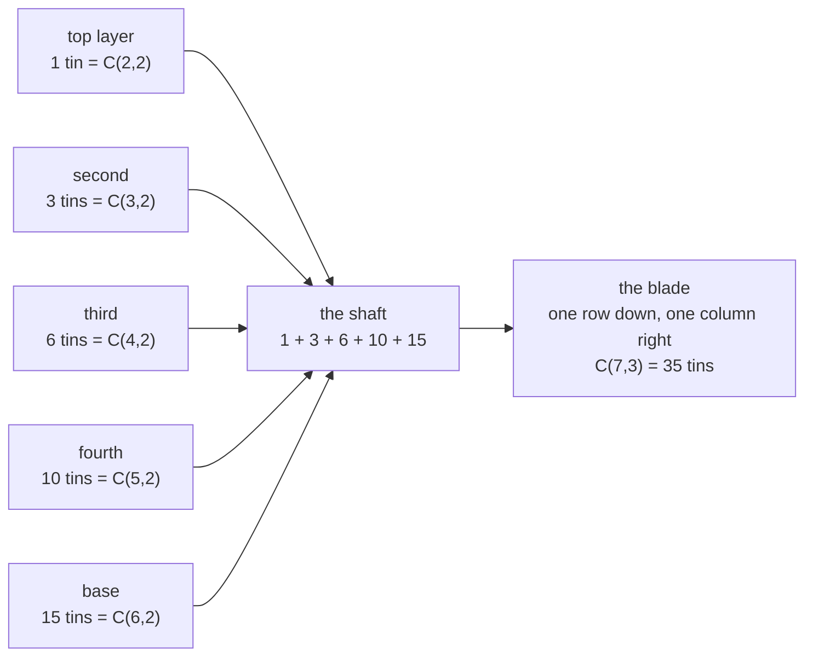

# The hockey stick: adding down a diagonal of the triangle lands one step below and right

Combinatorics and graphs → Binomial Coefficients and Identities → Summing a diagonal → The hockey stick

---

## General Overview

A grocer stacks tins in a pyramid with a triangular base. The top is one tin; under it sit triangles of three, six and ten, and fifteen along the floor. Five layers, 1 + 3 + 6 + 10 + 15 = 35 tins.

Thirty-five answers a second question, with no stacking in it. Stand seven tins in a row, labelled 1 to 7, and choose three to sell: 35 choices, written C(7,3) and read "7 choose 3".

The two thirty-fives are one fact. The layer counts 1, 3, 6, 10, 15 are the entries C(2,2), C(3,2), C(4,2), C(5,2), C(6,2) — a straight run down one diagonal of Pascal's triangle ([pascals-rule-and-the-triangle](01-pascals-rule-and-the-triangle.md)). In C(i,k) the first number is the row and the second the column, so that run is column 2 all the way down. Their total sits one row lower and one column right: C(7,3). Shaded in, run and total draw a long shaft with a blade off the end. Hence the name, and the two words used from here on: the **shaft** is the run of entries added, the **blade** is the entry they add to.

**Adding the entries straight down any diagonal of Pascal's triangle, from its top, gives the entry one row below and one column right of where the run stopped.**

**What kind of fact this is:** a theorem, proved on this card in Why it works, twice over.

### The picture: shaft and blade



---

## The formula

One term per row of the triangle, with C(n, k) the count of ways to choose k items from n:

$$C(k,k) + C(k+1,k) + C(k+2,k) + \cdots + C(n,k) = C(n+1,k+1)$$

**Read it aloud:** add one column of the triangle from its top entry down to any row; the total is the entry one row further down and one column right.

Capital sigma is shorthand for that instruction: add the terms as the row counter runs from the number below the sign up to the one above ([binomial-theorem](02-binomial-theorem.md)).

$$\sum_{i=k}^{n} C(i,k) = C(n+1,k+1)$$

| Symbol | Plain meaning | In our example | Push it up and the answer… |
| --- | --- | --- | --- |
| $k$ | the column, fixed all the way down | 2, the pairs column | a diagonal starting lower |
| $n$ | the shaft's last row | 6 | a longer shaft, a bigger blade |
| $i$ | the running row, $k$ to $n$ | 2, 3, 4, 5, 6 | — |
| $C(i,k)$ | a shaft entry: picks of $k$ from $i$ | C(4,2) = 6 | — |
| $C(n+1,k+1)$ | the blade: picks of $k+1$ from $n+1$ | C(7,3) = 35 | — |
| $\sum$ | add the terms, $i$ from $k$ to $n$ | 1 + 3 + 6 + 10 + 15 | — |

### When it holds

- **Whole numbers, with n ≥ k.** The shaft runs down the column, never up. Run it backwards and there is nothing to add.
- **The shaft starts at the top of its column.** That first entry is C(k,k) = 1. Start one row late and the pile loses its top tin: 34, not 35.
- **One column, all the way down.** The column number never moves; add across a row instead and row 6 gives 64.
- **Counts off the triangle are none.** C(k, k+1) asks for more items than the pool holds; that empty term is what lets Step 1 close.

---

## Why it works

### Step 0: Pascal's rule turns every entry into a difference

Pascal's rule says each entry is the sum of the two above it: C(i+1, k+1) = C(i, k) + C(i, k+1) ([pascals-rule-and-the-triangle](01-pascals-rule-and-the-triangle.md)). Move one term across:

$$C(i,k) = C(i+1,k+1) - C(i,k+1)$$

Every shaft entry is now a gap between two entries of the column to its right. Here the shaft is column 2, and column 3 holds 1, 4, 10, 20, 35 in rows 3 to 7.

### Step 1: add the gaps and the middle cancels

Rewrite each layer as its gap, then add down the column:

- 1 is C(3,3) minus the entry above it in column 3, which asks three tins from a pool of two — none.
- 3 is C(4,3) − C(3,3), that is 4 − 1.
- 6 is C(5,3) − C(4,3), that is 10 − 4.
- 10 is C(6,3) − C(5,3), that is 20 − 10.
- 15 is C(7,3) − C(6,3), that is 35 − 20.

Each of 1, 4, 10 and 20 is added once and taken away once, so the middle destroys itself — the move is called **telescoping**, after the tubes of a hand telescope sliding into each other. What survives is the last entry, C(7,3) = 35. The running totals show the cancelling: each is the next entry of column 3.

| Row | the shaft, C(i,2) | running total | the next column, C(i+1,3) |
| --- | --- | --- | --- |
| 2 | 1 | 1 | 1 |
| 3 | 3 | 4 | 4 |
| 4 | 6 | 10 | 10 |
| 5 | 10 | 20 | 20 |
| 6 | 15 | 35 | **35** |

Nothing in the argument used the number 2 or the number 6: it runs down any column to any row.

<details>
<summary>Detailed proof: the telescope written out in general</summary>

Fix whole numbers n and k with n ≥ k. Pascal's rule rearranged gives C(i, k) = C(i+1, k+1) − C(i, k+1) for every row i from k to n. Add those lines:

$$\sum_{i=k}^{n} C(i,k) = \sum_{i=k}^{n} \bigl( C(i+1,k+1) - C(i,k+1) \bigr)$$

The right-hand side adds C(k+1, k+1) through C(n+1, k+1) and takes away C(k, k+1) through C(n, k+1). Everything from C(k+1, k+1) to C(n, k+1) stands in both lists and cancels, leaving C(n+1, k+1) added and C(k, k+1) taken away. That last term asks for k+1 items from a pool of k, so it counts none, and the total is C(n+1, k+1).

</details>

### Step 2: the second route — ask where the largest label is

The blade counts something directly: C(7,3) is the ways to pick 3 tins from the 7 in the row. Sort each pick and look at its largest label. Exactly one label is largest, so the picks fall into piles with no overlap and nothing left out.

- Largest label 3: the other two come from labels 1 and 2 — 1 pick.
- Largest 4: the other two from three labels — 3 picks.
- Largest 5: from four labels — 6 picks.
- Largest 6: from five labels — 10 picks.
- Largest 7: from six labels — 15 picks.

Adding the piles gives 1 + 3 + 6 + 10 + 15 = 35, and those counts are C(2,2), C(3,2), C(4,2), C(5,2), C(6,2): the shaft again, reached without Pascal's rule and without a subtraction.

### Step 3: why a layer of tins is an entry of the triangle

The pile is still a claim about tins, not labels. Match each tin of the base layer to a pair of labels: the tin in row r, place c goes to the pair (c, r + 1). Since c never exceeds r, the first label is always the smaller, and every pair of labels from 1 to 6 comes from one tin. So the base holds C(6,2) = 15 tins, and a layer of m rows holds C(m+1, 2). The five layers are the shaft, and Steps 1 and 2 make the pile the blade: 35 tins.

A third route runs induction on the shaft's length: one use of Pascal's rule joins a shorter shaft's blade to the next entry down.

---

## Worked numbers, by hand

Pascal's triangle down to row 10 is the shelf's standing example; the pile lives in rows 2 to 7 of it.

| Step | Arithmetic | Value |
| --- | --- | --- |
| the shaft, rows 2 to 6 | C(2,2) down to C(6,2) | 1, 3, 6, 10, 15 |
| two layers | 1 + 3 | 4 |
| three layers | 4 + 6 | 10 |
| four layers | 10 + 10 | 20 |
| five layers | 20 + 15 | **35** |
| the blade, read off row 7 | C(7,3) | **35** |
| the blade, from the factorial formula | 7 × 6 × 5 ÷ (3 × 2 × 1) | **35** |

The pyramid holds 35 tins, and 35 trios can be picked from seven on a shelf: one count, two questions.

### What breaks if you drop a piece

| Mistake | Comes out at | What went wrong |
| --- | --- | --- |
| Shaft started one row late | 34, not 35 | C(2,2) = 1 is the pile's top layer |
| Blade read as C(6,3) | 20, not 35 | The blade drops a row; 20 is level with the shaft's last entry |
| Blade read as C(7,2) | 21, not 35 | The blade moves a column right too; 21 totals the column to the left |
| A row added instead of a diagonal | 64, not 35 | Row 6 adds to 64, the row-doubling fact, not this one |

The code prints all four.

---

## Code, from first principles, and it actually runs

Nothing is imported. The 35 is reached by four roads sharing no arithmetic: Pascal's triangle built by addition alone, the factorial formula, laying each layer of tins out one position at a time, and listing every three-tin pick from seven labelled tins split by largest label. Two further shafts run as second cases: column 1 to row 6, and column 3 to row 7.

### Python

```python
# The hockey stick -- the check behind the card.  Nothing is imported.  Tins are
# stacked in a triangular pile five layers deep: 1, 3, 6, 10, 15 tins, 35 in all.
# The 35 is reached by four roads sharing no arithmetic: Pascal's triangle built
# by addition alone, the factorial formula, laying the tins out one position at a
# time, and listing every 3-tin pick from 7 labelled tins.
TOP, K, N = 10, 2, 6                       # triangle depth; the stick's column, its last row
def triangle(top):                         # road one: each entry from the two above it
    rows = [[1]]
    for n in range(1, top + 1):
        rows.append([1] + [rows[-1][j - 1] + rows[-1][j] for j in range(1, n)] + [1])
    return rows
def choose(n, k):                          # road two: n! / (k! (n-k)!), zero off the row
    if k < 0 or k > n: return 0
    f = [1]                                # the factorials 0!, 1!, ..., n!, written out here
    for i in range(1, n + 1): f.append(f[-1] * i)
    return f[n] // (f[k] * f[n - k])
def layer(m):                              # road three: a triangle of tins, m rows deep
    return [(r, c) for r in range(1, m + 1) for c in range(1, r + 1)]
def listed(items, size):                   # road four: every pick of that size, listed
    if size == 0: return [[]]
    return [[x] + rest for j, x in enumerate(items)
            for rest in listed(items[j + 1:], size - 1)]
def stick(k, n, rows):                     # the diagonal C(k,k), C(k+1,k), ..., C(n,k)
    return [rows[i][k] for i in range(k, n + 1)]
def totals(xs):                            # running totals, one entry at a time
    out = []
    for x in xs: out.append(x + (out[-1] if out else 0))
    return out

rows = triangle(TOP)
bar = stick(K, N, rows)
running = totals(bar)
next_column = [choose(i + 1, K + 1) for i in range(K, N + 1)]
layers = [len(layer(m)) for m in range(1, N - K + 2)]
total = running[-1]
picks = listed(list(range(1, N + 2)), K + 1)
by_largest = [len([p for p in picks if p[-1] == i + 1]) for i in range(K, N + 1)]
flat = totals(stick(1, N, rows))[-1]
deep = totals(stick(3, 7, rows))[-1]
print(f"a {N - K + 1}-layer pile of tins, layer by layer: {' + '.join(str(x) for x in bar)} = {total} tins")
print(f"the same layers by laying tins out one position at a time: {layers}")
print(f"the stick at k = {K}, its running total, and the next column one row down:")
for j, i in enumerate(range(K, N + 1)):
    print(f"  row {i}: C({i},{K}) = {bar[j]:<3} running total {running[j]:<3} "
          f"C({i + 1},{K + 1}) = {next_column[j]}")
print(f"the blade C({N + 1},{K + 1}) read straight off row {N + 1}: {rows[N + 1][K + 1]}")
print(f"picks of {K + 1} from {N + 1} labelled tins, listed one by one: {len(picks)}")
print(f"those picks split by their largest label: {by_largest}")
print(f"the stick at k = 1, rows 1 to {N}: 1 + 2 + 3 + 4 + 5 + 6 = {flat} = C(7,2) = {choose(7, 2)}")
print(f"the stick at k = 3, rows 3 to 7: 1 + 4 + 10 + 20 + 35 = {deep} = C(8,4) = {choose(8, 4)}")
print(f"mistake 1, stick started one row late: {total - bar[0]}, not {total}")
print(f"mistake 2, blade read as C({N},{K + 1}): {choose(N, K + 1)}, not {total}")
print(f"mistake 3, blade read as C({N + 1},{K}): {choose(N + 1, K)}, not {total}")
print(f"mistake 4, row {N} added instead of the diagonal: {sum(rows[N])}, not {total}")
assert bar == layers                                    # triangle by addition vs. tins laid out
assert running == next_column and rows[N + 1][K + 1] == total   # running totals vs. factorials
assert by_largest == layers and len(picks) == total     # every pick listed, split by its largest
assert flat == choose(7, 2) and deep == choose(8, 4)    # running totals vs. the factorial formula
print("ALL CHECKS PASS")
```

**Ran 2026-09-14 on macOS, Python 3.14.6, standard library only. All checks passed. Output, pasted from the run:**

```
a 5-layer pile of tins, layer by layer: 1 + 3 + 6 + 10 + 15 = 35 tins
the same layers by laying tins out one position at a time: [1, 3, 6, 10, 15]
the stick at k = 2, its running total, and the next column one row down:
  row 2: C(2,2) = 1   running total 1   C(3,3) = 1
  row 3: C(3,2) = 3   running total 4   C(4,3) = 4
  row 4: C(4,2) = 6   running total 10  C(5,3) = 10
  row 5: C(5,2) = 10  running total 20  C(6,3) = 20
  row 6: C(6,2) = 15  running total 35  C(7,3) = 35
the blade C(7,3) read straight off row 7: 35
picks of 3 from 7 labelled tins, listed one by one: 35
those picks split by their largest label: [1, 3, 6, 10, 15]
the stick at k = 1, rows 1 to 6: 1 + 2 + 3 + 4 + 5 + 6 = 21 = C(7,2) = 21
the stick at k = 3, rows 3 to 7: 1 + 4 + 10 + 20 + 35 = 70 = C(8,4) = 70
mistake 1, stick started one row late: 34, not 35
mistake 2, blade read as C(6,3): 20, not 35
mistake 3, blade read as C(7,2): 21, not 35
mistake 4, row 6 added instead of the diagonal: 64, not 35
ALL CHECKS PASS
```

### Rust

Same numbers, same labels, built with `rustc --edition 2021 -O`.

```rust
// The hockey stick -- the same check as the Python, in Rust.  No crates.  Tins are
// stacked in a triangular pile five layers deep: 1, 3, 6, 10, 15 tins, 35 in all.
// The 35 is reached by four roads sharing no arithmetic: Pascal's triangle built
// by addition alone, the factorial formula, laying the tins out one position at a
// time, and listing every 3-tin pick from 7 labelled tins.
const TOP: usize = 10;                      // triangle depth
const K: usize = 2;                         // the stick's column
const N: usize = 6;                         // the stick's last row
fn triangle(top: usize) -> Vec<Vec<i64>> {  // road one: each entry from the two above it
    let mut rows: Vec<Vec<i64>> = vec![vec![1]];
    for n in 1..=top {
        let a = rows[n - 1].clone();
        rows.push((0..=n).map(|j| if j == 0 || j == n { 1 } else { a[j - 1] + a[j] }).collect());
    }
    rows
}
fn choose(n: i64, k: i64) -> i64 {           // road two: n! / (k! (n-k)!), zero off the row
    if k < 0 || k > n { return 0 }
    let mut f: Vec<i64> = vec![1];           // the factorials 0!, 1!, ..., n!, written out here
    for i in 1..=n { f.push(f[(i - 1) as usize] * i) }
    f[n as usize] / (f[k as usize] * f[(n - k) as usize])
}
fn layer(m: usize) -> Vec<(usize, usize)> {  // road three: a triangle of tins, m rows deep
    (1..=m).flat_map(|r| (1..=r).map(move |c| (r, c))).collect()
}
fn listed(items: &[i64], size: usize) -> Vec<Vec<i64>> {  // road four: every pick, listed
    if size == 0 { return vec![vec![]] }
    let mut out: Vec<Vec<i64>> = Vec::new();
    for (j, &x) in items.iter().enumerate() {
        for rest in listed(&items[j + 1..], size - 1) { out.push([vec![x], rest].concat()) }
    }
    out
}
fn stick(k: usize, n: usize, rows: &[Vec<i64>]) -> Vec<i64> {  // the diagonal C(k,k)...C(n,k)
    (k..=n).map(|i| rows[i][k]).collect()
}
fn totals(xs: &[i64]) -> Vec<i64> {          // running totals, one entry at a time
    let mut out: Vec<i64> = Vec::new();
    for &x in xs { out.push(x + out.last().copied().unwrap_or(0)) }
    out
}

fn main() {
    let rows = triangle(TOP);
    let bar = stick(K, N, &rows);
    let running = totals(&bar);
    let next_column: Vec<i64> = (K..=N).map(|i| choose(i as i64 + 1, K as i64 + 1)).collect();
    let layers: Vec<i64> = (1..=(N - K + 1)).map(|m| layer(m).len() as i64).collect();
    let total = *running.last().unwrap();
    let picks = listed(&(1..=(N as i64 + 1)).collect::<Vec<i64>>(), K + 1);
    let by_largest: Vec<i64> = (K..=N).map(|i| picks.iter()
        .filter(|p| *p.last().unwrap() == i as i64 + 1).count() as i64).collect();
    let flat = *totals(&stick(1, N, &rows)).last().unwrap();
    let deep = *totals(&stick(3, 7, &rows)).last().unwrap();
    let terms: Vec<String> = bar.iter().map(|x| x.to_string()).collect();
    println!("a {}-layer pile of tins, layer by layer: {} = {} tins", N - K + 1, terms.join(" + "), total);
    println!("the same layers by laying tins out one position at a time: {:?}", layers);
    println!("the stick at k = {}, its running total, and the next column one row down:", K);
    for (j, i) in (K..=N).enumerate() {
        println!("  row {}: C({},{}) = {:<3} running total {:<3} C({},{}) = {}",
                 i, i, K, bar[j], running[j], i + 1, K + 1, next_column[j]);
    }
    println!("the blade C({},{}) read straight off row {}: {}", N + 1, K + 1, N + 1, rows[N + 1][K + 1]);
    println!("picks of {} from {} labelled tins, listed one by one: {}", K + 1, N + 1, picks.len());
    println!("those picks split by their largest label: {:?}", by_largest);
    println!("the stick at k = 1, rows 1 to {}: 1 + 2 + 3 + 4 + 5 + 6 = {} = C(7,2) = {}", N, flat, choose(7, 2));
    println!("the stick at k = 3, rows 3 to 7: 1 + 4 + 10 + 20 + 35 = {} = C(8,4) = {}", deep, choose(8, 4));
    println!("mistake 1, stick started one row late: {}, not {}", total - bar[0], total);
    println!("mistake 2, blade read as C({},{}): {}, not {}", N, K + 1, choose(N as i64, K as i64 + 1), total);
    println!("mistake 3, blade read as C({},{}): {}, not {}", N + 1, K, choose(N as i64 + 1, K as i64), total);
    println!("mistake 4, row {} added instead of the diagonal: {}, not {}", N, rows[N].iter().sum::<i64>(), total);
    assert!(bar == layers);                                   // triangle by addition vs. tins laid out
    assert!(running == next_column && rows[N + 1][K + 1] == total);   // running totals vs. factorials
    assert!(by_largest == layers && picks.len() as i64 == total);     // every pick, split by its largest
    assert!(flat == choose(7, 2) && deep == choose(8, 4));    // running totals vs. the factorial formula
    println!("ALL CHECKS PASS");
}
```

**Ran 2026-09-14 on macOS, rustc 1.98.1, no crates. All checks passed. Output, pasted from the run:**

```
a 5-layer pile of tins, layer by layer: 1 + 3 + 6 + 10 + 15 = 35 tins
the same layers by laying tins out one position at a time: [1, 3, 6, 10, 15]
the stick at k = 2, its running total, and the next column one row down:
  row 2: C(2,2) = 1   running total 1   C(3,3) = 1
  row 3: C(3,2) = 3   running total 4   C(4,3) = 4
  row 4: C(4,2) = 6   running total 10  C(5,3) = 10
  row 5: C(5,2) = 10  running total 20  C(6,3) = 20
  row 6: C(6,2) = 15  running total 35  C(7,3) = 35
the blade C(7,3) read straight off row 7: 35
picks of 3 from 7 labelled tins, listed one by one: 35
those picks split by their largest label: [1, 3, 6, 10, 15]
the stick at k = 1, rows 1 to 6: 1 + 2 + 3 + 4 + 5 + 6 = 21 = C(7,2) = 21
the stick at k = 3, rows 3 to 7: 1 + 4 + 10 + 20 + 35 = 70 = C(8,4) = 70
mistake 1, stick started one row late: 34, not 35
mistake 2, blade read as C(6,3): 20, not 35
mistake 3, blade read as C(7,2): 21, not 35
mistake 4, row 6 added instead of the diagonal: 64, not 35
ALL CHECKS PASS
```

The two outputs match line for line.

> [!TIP]
> **Try changing**
> Guess first, then run it.
> - **Start the shaft late.** Change `stick` to run from `k + 1`: the total drops to 34, the tins still count 35, and the first assert stops it.
> - **Break the blade's position.** In `next_column`, ask for `choose(i + 1, K)`: the running totals stop matching, and the second assert stops it.
> - **Take a label away.** In `picks`, list only labels 1 to 6: 20 picks of three survive, the pile with largest label 7 empties, and the third assert stops it.

---

## The usual mistake

> [!warning]
> **Looking for the total at the end of the shaft.** The blade is not the next entry down the same column, nor the entry beside the last one. It steps one row down and one column right, together. For the tins the candidates are C(7,3) = 35, right; C(6,3) = 20, level with the shaft's last entry; and C(7,2) = 21, the column to the left.
>
> - **Starting below the top of the column.** The shaft begins at C(k,k) = 1. Drop it and the pile reads 34, not 35.
> - **Adding a row instead of a diagonal.** Row 6 adds to 64 — the doubling fact on [pascals-rule-and-the-triangle](01-pascals-rule-and-the-triangle.md), a different question about the same array.
> - **Calling it Pascal's rule.** Pascal joins two entries into one. This adds a whole column: the same step applied all the way down.
> - **Taking the check for the proof.** The code audits three shafts; the theorem covers every column and row, and Step 1 carries it there.

---

## Where you meet it in real life

- **Stacked goods.** Tins, oranges and cannonballs pile into triangular pyramids, and the count is the blade: five layers, 35 units.
- **Adding 1 to n.** One column left of the tins sits 1 + 2 + 3 + 4 + 5 + 6 = 21 = C(7,2): the schoolroom formula for adding whole numbers is this identity one column over.
- **Running totals in code.** A program listing every trio from a growing list gains C(i,2) new trios when item i+1 arrives; the running total is the blade.
- **Sorting by the largest.** Splitting a count by where its biggest element sits, as in Step 2, is standard for binomial identities; singling out a member of the chosen group gives [committee-chair-identity](05-committee-chair-identity.md).

> **Say it back**
> Five triangular layers hold 1, 3, 6, 10 and 15 tins, 35 in all. Those counts are one straight diagonal of Pascal's triangle, and 35 is the entry one row below and one column right of where the diagonal stopped. Pascal's rule makes each entry a gap between two entries of the next column, and adding the gaps cancels the middle. Second route: 35 also counts three tins chosen from seven, split by which is largest. Start one row late and 35 reads 34; look in the wrong place, 20 or 21.

---

## What this builds on

- [pascals-rule-and-the-triangle](01-pascals-rule-and-the-triangle.md): the rule that rewrites each entry as a gap between two entries of the next column, the array the shaft runs down, and the convention that counts of the impossible are none.

## Where this goes next

Two neighbours work the same triangle from other directions:

- [vandermonde-identity](03-vandermonde-identity.md): splitting one pick across two separate pools rather than down one column.
- [committee-chair-identity](05-committee-chair-identity.md): singling out a member of the chosen group, which turns a sum of entries into a product.

Every term added here is positive; what a row adds to once the signs alternate, and how that inverts a sum, is [alternating-sums-and-binomial-inversion](06-alternating-sums-and-binomial-inversion.md).

---

## Sources

Verified 14 Sep 2026: every link below resolves to the publisher's page.

- Graham, Ronald L., Donald E. Knuth, and Oren Patashnik. *Concrete Mathematics*, 2nd ed. Addison-Wesley, 1994. [Publisher page](https://www.informit.com/store/concrete-mathematics-a-foundation-for-computer-science-9780201558029). Chapter 5 sums binomial coefficients by the telescope of Step 1.
- Brualdi, Richard A. *Introductory Combinatorics*, Classic Version, 5th ed. Pearson. [Publisher page](https://www.pearson.com/en-us/subject-catalog/p/introductory-combinatorics-classic-version/P200000006138/9780137981045). States the column-sum identity among the standard ones.
- Hammack, Richard. *Book of Proof*, 3rd ed. [Author's page, full text free](https://richardhammack.github.io/BookOfProof/). The counting chapter gives Pascal's rule and Step 2's subset arguments.
- "A000292: Tetrahedral numbers." On-Line Encyclopedia of Integer Sequences. [Sequence page](https://oeis.org/A000292). Lists 1, 4, 10, 20, 35 and gives the blade as a binomial coefficient.
