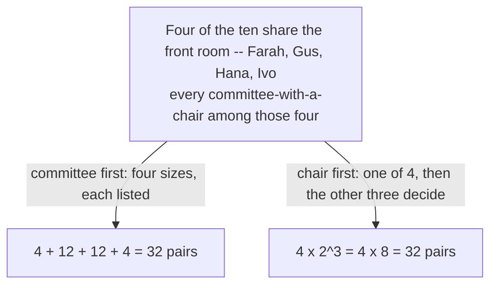
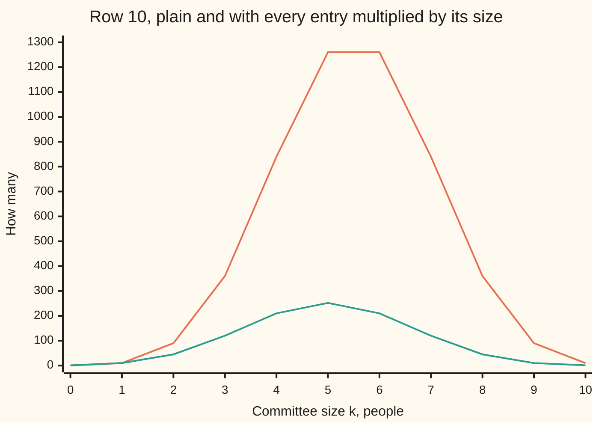

# Committee and chair: k C(n,k) = n C(n-1,k-1), so the weighted row sum is n 2^(n-1)

[Syllabus](../../../SYLLABUS.md) → [Combinatorics and graphs](../README.md) → [Binomial Coefficients and Identities](../README.md#s03) → Committee and chair

---

## General Overview

An office of ten sets up a working group. Any number may serve, from nobody to all ten, and whoever serves picks one chair from among themselves. How many outcomes is that — a group, and a chair inside it?

In the obvious order it is a long job: work through the groups of one, then of two, on to the group of ten, and at each size multiply the number of groups by how many may chair one.

In the other order it takes a line. Name the chair first: ten choices. Then let each of the other nine decide whether to serve alongside. Nine yes-or-no answers is 2 multiplied in nine times: 512 groups behind every chair. Ten chairs, 512 groups each, 5,120 outcomes.

Same office, same rules, two orders of appointing, so the counts must agree. Setting them side by side size by size is what this card proves. Each outcome is a committee-and-chair pair from here on, and the fact has a name: the **absorption identity**, because the multiplier in front of a choice count is swallowed into it.

**Counting committee-and-chair pairs of one size two ways gives k C(n,k) = n C(n-1,k-1), and adding that across a whole row turns a weighted row sum into n 2^(n-1).**

**What kind of fact this is:** a theorem, proved on this card in Why it works.

### The picture: the front room of four, counted both ways



Four of the ten are few enough to list every pair by hand, and the run below does. Ten are not: 5,120 pairs is where the formula earns its keep.

---

## The formula

C(n, k) counts the ways to choose k items from n, order ignored, read "n choose k" ([Pascal's rule](01-pascals-rule-and-the-triangle.md)). A count of something impossible is zero, so C(n, k) = 0 when k is below 0 or above n.

$$k \cdot C(n, k) = n \cdot C(n-1, k-1)$$

**Read it aloud:** committees of that size times the members each may promote is the same number as chairs times the ways to fill the seats left over.

Add that across every size and the left becomes every pair in the office. The capital Greek sigma is shorthand for "add these up as k runs through the listed values" ([The binomial theorem](02-binomial-theorem.md)):

$$\sum_{k=0}^{n} k \cdot C(n, k) \;=\; n \cdot 2^{\,n-1}$$

**Read it aloud:** add the pair count for every size and the total is the number of people times 2 multiplied in n − 1 times.

| Symbol | Plain meaning | In our example | Push it up and the answer… |
| --- | --- | --- | --- |
| $n$ | people to choose from | 10 in the office | doubles, and more, per extra person |
| $k$ | how many sit on the committee | any size, 0 to 10 | peaks near mid-row, then falls |
| $C(n,k)$ | committees of $k$ from $n$, order ignored | C(10,3) = 120 | — |
| $k\,C(n,k)$ | committee-and-chair pairs of that size | 3 × 120 = 360 | — |
| $C(n-1,k-1)$ | ways to fill the seats a chair leaves | C(9,2) = 36 | — |
| $2^{\,n-1}$ | committees behind one chair: 2 multiplied in $n-1$ times | 512 | doubles per colleague |
| $n\,2^{\,n-1}$ | every committee-and-chair pair, all sizes | 5,120 | — |

### When it holds

- **Whole numbers, n at least 1, with the zero convention.** At k = 0 the left reads 0 × 1 and the right 10 × C(9,−1), both 0: the empty committee contributes nothing.
- **The chair sits on the committee.** Let the chair come from anywhere in the office and the total is 10 × 1,024 = 10,240.
- **One chair, and a committee is a set.** Two chairs, or an order inside it, is a different collection and count.
- **Every size counted for the row sum.** Drop one and the total falls short; the full office contributes 10 pairs alone.

---

## Why it works

### Step 0: name one collection, then count it twice

Fix the collection first: every pair made of a committee and one of its own members marked as chair. One collection counted two ways gives an equation — double counting ([Bijections and double counting](../02-Repeats%2C%20Groups%20and%20Double%20Counting/05-bijection-and-double-counting.md)).

### Step 1: committee first

Pick the committee, then its chair. Committees of size k number C(n, k), and each offers exactly k people to chair it: k C(n, k) pairs of that size. Committees of three in the office of ten: C(10,3) = 120 of them, three candidates in each, 360 pairs.

### Step 2: chair first

Pick the chair first: any of the n people. The chair fills one seat, so the remaining k − 1 are filled from the n − 1 colleagues left, C(n − 1, k − 1) ways: n C(n − 1, k − 1) pairs. Committees of three again: 10 chairs, then C(9,2) = 36 ways to pick the two who join — 360 pairs.

### Step 3: the two routes describe the same pairs

Every pair holds one committee and one chair, so each route produces it exactly once — never twice, never missed. Two honest counts of one collection are equal:

k C(n, k) = n C(n − 1, k − 1).

The k that stood outside on the left is absorbed: on the right the only multiplier is n.

<details>
<summary>Detailed proof: the same identity out of the factorials</summary>

The counting argument above is the proof. This is the algebra it matches, with C(n, k) = n! / (k! (n − k)!), where n! = 1 × 2 × … × n and 0! = 1.

Take k from 1 to n: k C(n, k) = k × n! / (k! (n − k)!). Since k! = k × (k − 1)!, the k on top cancels the k inside k!, leaving n! / ((k − 1)! (n − k)!). Peel one factor off: n! = n × (n − 1)!, giving n × (n − 1)! / ((k − 1)! (n − k)!). The bottom is what C(n − 1, k − 1) needs, since (n − 1) − (k − 1) = n − k, so the whole thing is n C(n − 1, k − 1).

At k = 0 the left is 0 × C(n, 0) = 0 and the right n × C(n − 1, −1) = 0 by the zero convention, so the sides agree along the whole row.

</details>

### Step 4: add the identity across the row

Add every size, k from 0 to n. On the left the sizes account for every committee-and-chair pair in the office. On the right the n comes out in front, leaving C(n − 1, 0) + C(n − 1, 1) + … + C(n − 1, n − 1) — a full row of the triangle, adding to 2 multiplied in n − 1 times ([Pascal's rule](01-pascals-rule-and-the-triangle.md)). So the weighted row sum is n 2^(n−1): for the office of ten, 10 × 512 = 5,120.

### The other door: pair each committee with its opposite

One route to 5,120 never touches the identity. Beside any committee set the one holding the colleagues it leaves out. No committee is its own opposite, so the 1,024 fall into 512 couples, each holding ten people between them: 512 × 10 = 5,120. Read backwards, 5,120 over 1,024 committees says the average committee seats five.

---

## Worked numbers, by hand

The shelf's triangle, built by addition, runs to row 10 — the office's own row.

| Step | Arithmetic | Value |
| --- | --- | --- |
| row 10 of the triangle | 1 10 45 120 210 252 210 120 45 10 1 | adds to **1,024** |
| the size-3 term, committee first | 3 × 120 | **360** |
| the same term, chair first | 10 × 36 | **360** |
| all eleven terms | 0 + 10 + 90 + 360 + 840 + 1260 + 1260 + 840 + 360 + 90 + 10 | **5,120** |
| chair first, in one step | 10 × 512 | **5,120** |
| opposite committees paired off | 512 × 10 | **5,120** |
| average committee size | 5,120 ÷ 1,024 | **5** |

The office can form a working group and name its chair in 5,120 ways; across the 1,024 possible groups the average seats five.

### The picture: the row, before and after the weight



The taller line is the weighted row, pairs of each size, adding to 5,120; the lower is the plain row, committees of each size, adding to 1,024. The weight erases the empty committee and tips the row rightwards: joint-largest terms of 1,260 at sizes 5 and 6, not one peak in the middle.

### What breaks if you drop a piece

| Mistake | Comes out at | What went wrong |
| --- | --- | --- |
| A chair drawn from the whole office | 10,240, not 5,120 | 10 × 1,024 lets a chair sit outside the committee |
| The row added with no size weight | 1,024, not 5,120 | That counts committees, not committee-and-chair pairs |
| Index shifted: 10 C(9,k) for 10 C(9,k−1) | 840 at size 3, not 360 | The chair holds a seat, so k − 1 remain to fill |

The code prints all three.

---

## Code, from first principles, and it actually runs

Nothing is imported. Three roads sharing no arithmetic reach the total: every one of the 1,024 committees walked with its members tallied, the closed form read term by term off a triangle built by addition, and each committee paired with its opposite. The front room of four is listed in full.

### Python

```python
# Committee and chair -- the check behind the card.  Nothing is imported.  An office
# of 10 picks a committee of any size and one chair from inside it.  The (committee,
# chair) pairs are counted by roads that share no arithmetic: every committee walked
# one at a time, the closed form 10 x 2^9 read off Pascal's triangle, and every
# committee paired with the one holding everybody it leaves out.  The front room of
# four is listed by hand.
N = 10
FRONT = ["Farah", "Gus", "Hana", "Ivo"]
def committees(n):                         # every committee: one bit per person, in or out
    out = [[i for i in range(n) if m >> i & 1] for m in range(2 ** n)]
    out.sort(key=lambda s: (len(s), s))
    return out
def triangle(top):                         # Pascal's rule: each entry from the two above
    rows = [[1]]
    for n in range(1, top + 1):
        above = rows[-1]
        rows.append([1] + [above[k - 1] + above[k] for k in range(1, n)] + [1])
    return rows
def letters(s): return "".join(FRONT[i][0] for i in s)   # a committee, by first letters
def yn(claim): return "yes" if claim else "no"

rows = triangle(N)
front = committees(len(FRONT))
front_pairs = [(s, c) for s in front for c in s]   # committee first, then a chair inside it
front_sizes = [sum(1 for s, c in front_pairs if len(s) == k) for k in range(len(FRONT) + 1)]
office = committees(N)                             # road one: walk all 1,024 committees
pairs = sum(len(s) for s in office)
listed = [sum(len(s) for s in office if len(s) == k) for k in range(N + 1)]
absorbed = [N * rows[N - 1][k - 1] if k >= 1 else 0 for k in range(N + 1)]   # road two
closed = N * 2 ** (N - 1)
complement = len(office) // 2 * N                  # road three: a committee and the rest
row_total = sum(rows[N])

print(f"office of {N}; a committee of any size, one chair from inside it")
print(f"front room of {len(FRONT)} -- {', '.join(FRONT)} -- every committee|chair pair listed:")
for k in range(1, len(FRONT) + 1):
    got = [f"{letters(s)}|{FRONT[c][0]}" for s, c in front_pairs if len(s) == k]
    print(f"  size {k}: {' '.join(got)}  ->  {len(got)}")
print(f"  total {len(front_pairs)}; chair first: {len(FRONT)} x 2^{len(FRONT) - 1} = "
      f"{len(FRONT)} x {2 ** (len(FRONT) - 1)} = {len(FRONT) * 2 ** (len(FRONT) - 1)}")
print(f"row {N} of the triangle: {' '.join(str(x) for x in rows[N])}  adds to {row_total}")
print(f"pairs by committee size, k C({N},k): {' '.join(str(x) for x in listed)}")
print(f"the same terms, chair first, {N} C({N - 1},k-1): "
      f"{' '.join(str(x) for x in absorbed)}  (agree: {yn(listed == absorbed)})")
print(f"the eleven terms added: {sum(listed)}; chair first in one step: "
      f"{N} x 2^{N - 1} = {N} x {2 ** (N - 1)} = {closed}")
print(f"every committee walked one at a time: {pairs} pairs over {len(office)} committees")
print(f"complement pairing: {len(office) // 2} pairs of committees x {N} people = {complement}")
print(f"average committee size: {pairs} / {len(office)} = {pairs // len(office)}")
print(f"the k = 3 term: 3 x {rows[N][3]} = {3 * rows[N][3]} = "
      f"{N} x C({N - 1},2) = {N} x {rows[N - 1][2]}")
print(f"mistakes: a chair from the whole office gives {N * len(office)}, not {pairs}; "
      f"dropping the k gives {row_total}, not {pairs}; shifting the index gives "
      f"{N} x C({N - 1},3) = {N * rows[N - 1][3]} at k = 3, not {3 * rows[N][3]}")
assert pairs == closed                             # every committee walked, against the formula
assert listed == absorbed                          # size by size: committee first vs chair first
assert row_total == 1024 and complement == pairs   # the house row sum, and the third road
assert front_sizes == [0, 4, 12, 12, 4] and len(front_pairs) == len(FRONT) * 2 ** (len(FRONT) - 1)
print("ALL CHECKS PASS")
```

**Ran 2026-09-14 on macOS, Python 3.14.6, standard library only. All checks passed. Output, pasted from the run:**

```
office of 10; a committee of any size, one chair from inside it
front room of 4 -- Farah, Gus, Hana, Ivo -- every committee|chair pair listed:
  size 1: F|F G|G H|H I|I  ->  4
  size 2: FG|F FG|G FH|F FH|H FI|F FI|I GH|G GH|H GI|G GI|I HI|H HI|I  ->  12
  size 3: FGH|F FGH|G FGH|H FGI|F FGI|G FGI|I FHI|F FHI|H FHI|I GHI|G GHI|H GHI|I  ->  12
  size 4: FGHI|F FGHI|G FGHI|H FGHI|I  ->  4
  total 32; chair first: 4 x 2^3 = 4 x 8 = 32
row 10 of the triangle: 1 10 45 120 210 252 210 120 45 10 1  adds to 1024
pairs by committee size, k C(10,k): 0 10 90 360 840 1260 1260 840 360 90 10
the same terms, chair first, 10 C(9,k-1): 0 10 90 360 840 1260 1260 840 360 90 10  (agree: yes)
the eleven terms added: 5120; chair first in one step: 10 x 2^9 = 10 x 512 = 5120
every committee walked one at a time: 5120 pairs over 1024 committees
complement pairing: 512 pairs of committees x 10 people = 5120
average committee size: 5120 / 1024 = 5
the k = 3 term: 3 x 120 = 360 = 10 x C(9,2) = 10 x 36
mistakes: a chair from the whole office gives 10240, not 5120; dropping the k gives 1024, not 5120; shifting the index gives 10 x C(9,3) = 840 at k = 3, not 360
ALL CHECKS PASS
```

### Rust

Same numbers, same labels, built with `rustc --edition 2021 -O`.

```rust
// Committee and chair -- the same check as the Python, in Rust.  No crates.  An
// office of 10 picks a committee of any size and one chair from inside it.  The
// (committee, chair) pairs are counted by roads that share no arithmetic: every
// committee walked one at a time, the closed form 10 x 2^9 read off Pascal's
// triangle, and every committee paired with the one holding those it leaves out.
const N: usize = 10;
const FRONT: [&str; 4] = ["Farah", "Gus", "Hana", "Ivo"];

fn committees(n: usize) -> Vec<Vec<usize>> {   // every committee: one bit per person, in or out
    let mut out: Vec<Vec<usize>> =
        (0..(1usize << n)).map(|m| (0..n).filter(|i| m >> i & 1 == 1).collect()).collect();
    out.sort_by(|a, b| (a.len(), a).cmp(&(b.len(), b)));
    out
}

fn triangle(top: usize) -> Vec<Vec<u64>> {     // Pascal's rule: each entry from the two above
    let mut rows: Vec<Vec<u64>> = vec![vec![1]];
    for n in 1..=top {
        let r: Vec<u64> = (0..=n)
            .map(|k| if k == 0 || k == n { 1 } else { rows[n - 1][k - 1] + rows[n - 1][k] }).collect();
        rows.push(r);
    }
    rows
}

fn letters(s: &[usize]) -> String {            // one committee, written by first letters
    s.iter().map(|&i| FRONT[i].chars().next().unwrap()).collect() }
fn spaced(v: &[u64]) -> String { v.iter().map(|x| x.to_string()).collect::<Vec<_>>().join(" ") }
fn yn(claim: bool) -> &'static str { if claim { "yes" } else { "no" } }

fn main() {
    let (rows, m) = (triangle(N), FRONT.len());
    let front = committees(m);
    let mut front_pairs: Vec<(Vec<usize>, usize)> = Vec::new();   // committee first, chair inside
    for s in &front { for &c in s { front_pairs.push((s.clone(), c)) } }
    let front_sizes: Vec<u64> = (0..=m)
        .map(|k| front_pairs.iter().filter(|(s, _)| s.len() == k).count() as u64).collect();
    let office = committees(N);                // road one: walk all 1,024 committees
    let pairs: u64 = office.iter().map(|s| s.len() as u64).sum();
    let listed: Vec<u64> = (0..=N)
        .map(|k| office.iter().filter(|s| s.len() == k).map(|s| s.len() as u64).sum()).collect();
    let absorbed: Vec<u64> =                   // road two: chair first, rest from the other nine
        (0..=N).map(|k| if k >= 1 { N as u64 * rows[N - 1][k - 1] } else { 0 }).collect();
    let closed = N as u64 * (1u64 << (N - 1));
    let complement = (office.len() / 2) as u64 * N as u64;   // road three: a committee and the rest
    let row_total: u64 = rows[N].iter().sum();
    println!("office of {}; a committee of any size, one chair from inside it", N);
    println!("front room of {} -- {} -- every committee|chair pair listed:", m, FRONT.join(", "));
    for k in 1..=m {
        let got: Vec<String> = front_pairs.iter().filter(|(s, _)| s.len() == k)
            .map(|(s, c)| format!("{}|{}", letters(s), FRONT[*c].chars().next().unwrap())).collect();
        println!("  size {}: {}  ->  {}", k, got.join(" "), got.len());
    }
    println!("  total {}; chair first: {} x 2^{} = {} x {} = {}", front_pairs.len(), m, m - 1, m,
             1 << (m - 1), m * (1 << (m - 1)));
    println!("row {} of the triangle: {}  adds to {}", N, spaced(&rows[N]), row_total);
    println!("pairs by committee size, k C({},k): {}", N, spaced(&listed));
    println!("the same terms, chair first, {} C({},k-1): {}  (agree: {})",
             N, N - 1, spaced(&absorbed), yn(listed == absorbed));
    println!("the eleven terms added: {}; chair first in one step: {} x 2^{} = {} x {} = {}",
             listed.iter().sum::<u64>(), N, N - 1, N, 1u64 << (N - 1), closed);
    println!("every committee walked one at a time: {} pairs over {} committees", pairs, office.len());
    println!("complement pairing: {} pairs of committees x {} people = {}",
             office.len() / 2, N, complement);
    println!("average committee size: {} / {} = {}", pairs, office.len(), pairs / office.len() as u64);
    println!("the k = 3 term: 3 x {} = {} = {} x C({},2) = {} x {}",
             rows[N][3], 3 * rows[N][3], N, N - 1, N, rows[N - 1][2]);
    println!("mistakes: a chair from the whole office gives {}, not {}; dropping the k gives {}, \
not {}; shifting the index gives {} x C({},3) = {} at k = 3, not {}",
             N as u64 * office.len() as u64, pairs, row_total, pairs,
             N, N - 1, N as u64 * rows[N - 1][3], 3 * rows[N][3]);
    assert!(pairs == closed);                           // every committee walked, against the formula
    assert!(listed == absorbed);                        // size by size: committee first vs chair first
    assert!(row_total == 1024 && complement == pairs);  // the house row sum, and the third road
    assert!(front_sizes == vec![0, 4, 12, 12, 4] && front_pairs.len() == m * (1 << (m - 1)));
    println!("ALL CHECKS PASS");
}
```

**Ran 2026-09-14 on macOS, rustc 1.98.1, no crates. All checks passed. Output, pasted from the run:**

```
office of 10; a committee of any size, one chair from inside it
front room of 4 -- Farah, Gus, Hana, Ivo -- every committee|chair pair listed:
  size 1: F|F G|G H|H I|I  ->  4
  size 2: FG|F FG|G FH|F FH|H FI|F FI|I GH|G GH|H GI|G GI|I HI|H HI|I  ->  12
  size 3: FGH|F FGH|G FGH|H FGI|F FGI|G FGI|I FHI|F FHI|H FHI|I GHI|G GHI|H GHI|I  ->  12
  size 4: FGHI|F FGHI|G FGHI|H FGHI|I  ->  4
  total 32; chair first: 4 x 2^3 = 4 x 8 = 32
row 10 of the triangle: 1 10 45 120 210 252 210 120 45 10 1  adds to 1024
pairs by committee size, k C(10,k): 0 10 90 360 840 1260 1260 840 360 90 10
the same terms, chair first, 10 C(9,k-1): 0 10 90 360 840 1260 1260 840 360 90 10  (agree: yes)
the eleven terms added: 5120; chair first in one step: 10 x 2^9 = 10 x 512 = 5120
every committee walked one at a time: 5120 pairs over 1024 committees
complement pairing: 512 pairs of committees x 10 people = 5120
average committee size: 5120 / 1024 = 5
the k = 3 term: 3 x 120 = 360 = 10 x C(9,2) = 10 x 36
mistakes: a chair from the whole office gives 10240, not 5120; dropping the k gives 1024, not 5120; shifting the index gives 10 x C(9,3) = 840 at k = 3, not 360
ALL CHECKS PASS
```

The two outputs match line for line.

> [!TIP]
> **Try changing**
> Guess first, then run it. The asserts are pinned to the office of ten, so expect one to stop the program.
> - **Shrink the office.** Set `N` to 6. The roads still agree, but the third assert holds the house row total at 1,024 and stops the run.
> - **Let anyone chair.** Where `pairs` is computed, use `N` in place of `len(s)`: the total reads 10,240 and the first assert stops it.
> - **Drop the weight.** In `listed`, count each committee once instead of once per member: the terms become row 10 itself, adding to 1,024 not 5,120, and the second assert stops it.

---

## The usual mistake

> [!warning]
> **Reading k C(n,k) as a larger version of C(n,k).** It counts something else. C(10,3) = 120 counts committees of three; multiplying by 3 gives 360, which counts committees of three each carrying a named chair. Two collections, two kinds of member. Identities on this shelf go wrong the moment the collection stops being stated.
>
> - **Picking the chair from the whole office.** That gives 10 × 1,024 = 10,240, most of them seating a chair who is not on the committee.
> - **Shifting the index.** The chair holds a seat already, so the rest arrive k − 1 at a time from the other nine. C(9,k) where C(9,k−1) belongs gives 840 at size 3, not 360.
> - **Expecting the empty committee to contribute.** Nobody can chair a committee of nobody, so its term is 0 × 1 = 0 — the one entry the weight erases.
> - **Reading n 2^(n-1) as a count of committees.** Committees number 1,024; pairs number 5,120, five times as many, because the average committee seats five.

---

## Where you meet it in real life

- **Any "pick a group, then a leader" count.** A jury and its foreman, a project team and its lead, a delegation and its spokesperson. The answer is never the number of groups but that number times how many may lead.
- **The total size of all the subsets.** Add up the members of each of the 1,024 possible committees and the answer is 5,120 — the figure a planner needs when the cost of visiting a subset grows with its size.
- **Averages read off a weighted sum.** 5,120 divided by 1,024 is 5, half the office. A weighted total over a plain total is how an average is built, and yes-or-no choices make it come out clean.

> **Say it back**
> An office of ten forms a committee of any size and names one chair from inside it. Counted committee first, each size gives its committee count times its size. Counted chair first, each size gives ten times the ways to fill the seats the chair leaves. Both count the same pairs, so k C(n,k) = n C(n-1,k-1). Added across the row, that leaves a full row of the triangle times ten: 10 × 512 = 5,120, five times the 1,024 committees.

---

## What this builds on

- [Pascal's rule](01-pascals-rule-and-the-triangle.md): row 10, and the fact that a full row adds to 2 multiplied in n times — the step that collapses the right-hand sum.
- [Bijections and double counting](../02-Repeats%2C%20Groups%20and%20Double%20Counting/05-bijection-and-double-counting.md): why two honest counts of one collection may be set equal.

## Where this goes next

- [Alternating sums](06-alternating-sums-and-binomial-inversion.md): the same row weighted by a switching sign, not by size.
- [The middle of the row](07-central-binomial-and-bounds.md): how large a single term gets, once the row's total is known.

Weighting each term by its size gave a clean total; weighting by a sign that flips at every step cancels the row to nothing instead, which is [Alternating sums](06-alternating-sums-and-binomial-inversion.md).

---

## Sources

Verified 14 Sep 2026: every link below resolves to the publisher's page.

- Graham, Ronald L., Donald E. Knuth, and Oren Patashnik. *Concrete Mathematics*, 2nd ed. Addison-Wesley, 1994. [Publisher page](https://www.informit.com/store/concrete-mathematics-a-foundation-for-computer-science-9780201558029). Chapter 5 names the absorption identity and uses it on weighted sums.
- "A001787: a(n) = n*2^(n-1)." On-Line Encyclopedia of Integer Sequences. [Sequence page](https://oeis.org/A001787). The totals, 5,120 at n = 10, given as the size of all subsets added together and as the count of subset-and-member pairs.
- Bogart, Kenneth P. *Combinatorics Through Guided Discovery*. Open Textbook Library. [Textbook page](https://open.umn.edu/opentextbooks/textbooks/combinatorics-through-guided-discovery). Free and complete; builds the binomial identities from counting arguments of this shape.
- Levin, Oscar. *Discrete Mathematics: An Open Introduction*, 3rd ed. [Full text](https://discrete.openmathbooks.org/dmoi3.html). Its chapter on combinatorial proofs works the committee-and-chair argument.
