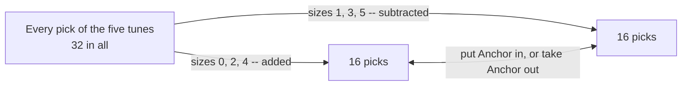

# Alternating sums: a row added with alternating signs cancels to zero, which lets you undo a binomial sum

[Syllabus](../../../SYLLABUS.md) → [Combinatorics and graphs](../README.md) → [Binomial Coefficients and Identities](../README.md#s03) → Alternating sums

---

## General Overview

The Lantern, a room above a pub, runs a Tuesday showcase. A player turns up with five tunes ready: Anchor, Bramble, Cinder, Dovetail and Ember. A setlist is a running order of some of them — which tunes, in what order, each played at most once. Playing nothing counts too: the empty setlist.

Five tunes allow 326 setlists, four 65, three 16, two 5, one 2, none 1. Those totals are easy: list them. The harder question is how many of the 326 leave nothing out, using all five. That count is 120.

The easy totals are built out of the hard ones. Every setlist uses one pick of tunes and uses all of it, and a pick of size k can be made in C(5, k) ways — row 5 of Pascal's triangle ([Pascal's rule](01-pascals-rule-and-the-triangle.md)). So 326 is the row 1 5 10 10 5 1 weighted by the leave-nothing-out counts 1, 1, 2, 6, 24, 120. Running that backwards, one total against six unknowns, looks hopeless.

It is not, and one small fact is why. Add row 5 with the signs flipping: 1 − 5 + 10 − 10 + 5 − 1 = 0. Every row past the top does the same, and that cancellation makes the forward sum reversible.

**A row of Pascal's triangle added with alternating signs comes to zero past the top row, and that cancellation turns a sum over all sizes back into the count for one exact size.**

**What kind of fact this is:** a theorem, proved on this card in Why it works.

### The picture: 32 picks, paired off by one tune



A perfect pairing: each added pick has one subtracted partner, so the total is 16 − 16 = 0.

---

## The formula

Two pieces of shorthand, both already on this shelf. C(n, k) counts the ways to pick k things from n when order is ignored, read "n choose k". The Greek capital sigma, $\sum$, with a starting value under it and a stopping value over it, means "add these as k runs from first to last" ([The binomial theorem](02-binomial-theorem.md)).

$$\sum_{k=0}^{n} (-1)^k\, C(n,k) \;=\; C(n,0) - C(n,1) + C(n,2) - \cdots \;=\; 0 \qquad (n \ge 1)$$

**Read it aloud:** walk along a row of the triangle adding and subtracting in turn; past the top row the total is nothing.

That zero unlocks a pair of sums that undo each other, binomial inversion:

$$b_n = \sum_{k=0}^{n} C(n,k)\, a_k \qquad\Longleftrightarrow\qquad a_n = \sum_{k=0}^{n} (-1)^{n-k}\, C(n,k)\, b_k$$

**Read it aloud:** if each loose count is the exact counts weighted by a row, each exact count is the loose counts weighted by that row, signs alternating and the last term positive.

| Symbol | Plain meaning | In our example | Push it up and the answer… |
| --- | --- | --- | --- |
| $n$ | tunes in the pool, and the row number | 5 | longer rows, larger counts |
| $k$ | the index along the row | 0 to 5 | — |
| $\sum$ | add the terms as $k$ runs from below to above | k from 0 to 5 | — |
| $C(n,k)$ | picks of k tunes from n, order ignored | C(5,2) = 10 | climbs to mid-row, then falls |
| $(-1)^k$ | the sign: plus on even k, minus on odd | −1 at k = 3 | — |
| $a_k$, $a_j$, $a_n$ | the exact count: setlists using all k tunes | 1, 1, 2, 6, 24, 120 | every loose count rises |
| $b_n$, $b_k$ | the loose count: setlists a pool of n allows | 1, 2, 5, 16, 65, 326 | — |

### When it holds

- **At least one thing to toggle.** Row 0 is a single 1, so its alternating sum is 1, not 0 — and that lone 1 survives to deliver the answer.
- **Both sequences indexed from 0, and the sign written $(-1)^{n-k}$.** Drop the k = 0 term and the five-tune count reads 121; write $(-1)^k$ and every recovered count flips on odd rows.
- **Only adding and subtracting.** No division anywhere, so this holds for any quantities that add: counts, dollars, remainders on a clock.

---

## Why it works

### Step 0: a signed total is a race between two piles

C(n, k) counts the picks of size k. Alternating signs put the even sizes in a plus pile and the odd sizes in a minus pile, so the signed total is one subtraction: even-size picks minus odd-size picks. It is zero when the piles match in size.

### Step 1: one item pairs the piles off

Single out Anchor. Toggle it in any pick: Anchor in, take it out; Anchor out, put it in. The size moves by one, so an even pick becomes odd and an odd pick even. Toggling twice returns the original, so no pick is used twice and none left over — a one-for-one matching ([Bijections and double counting](../02-Repeats%2C%20Groups%20and%20Double%20Counting/05-bijection-and-double-counting.md)). Of the 32 picks, 16 are even-size and 16 odd, so the signed total is 0.

Nothing about five was used: wherever there is an item to toggle the piles match, and with none there is only the empty pick, no partner, so row 0 comes to 1.

### Step 2: the same zero from a two-term power

The binomial theorem expands (x + y)^n into terms C(n, k) x^(n−k) y^k added over k ([The binomial theorem](02-binomial-theorem.md)). Set x = 1 and y = −1: every power of 1 is 1, y^k is the alternating sign, and the expansion is the alternating row sum. The left side is (1 − 1)^n — 0 for n ≥ 1, and 1 for n = 0, an empty product.

### Step 3: the forward sum, and what undoing it means

Sort the setlists from n tunes by the pick each uses: C(n, k) picks of size k, each carrying $a_k$ setlists. Adding over the sizes gives the forward sum

$$b_n = C(n,0)\,a_0 + C(n,1)\,a_1 + \cdots + C(n,n)\,a_n.$$

For five tunes the groups hold 1, 5, 20, 60, 120 and 120 setlists, adding to 326. Undoing means recovering $a_n$ from the loose counts alone.

### Step 4: substitute, swap the order, and watch the row cancel

Put the forward sum inside the claimed inverse. Each loose count is itself a sum over sizes, so the result is a double sum; the question is what weight each $a_j$ carries. Choosing k tunes from n and then j of those k is the same act as choosing the j first and the other k − j from the n − j left over, so the nested picks count the other way round. That pulls a constant clear and leaves an alternating sum over the whole of row n − j — 0 by Step 1 unless the row is the top one, which happens only at j = n.

So every $a_j$ vanishes but $a_n$, weight 1: the inverse hands back what went in. At n = 5 the terms −1 + 10 − 50 + 160 − 325 + 326 come to 120.

<details>
<summary>Detailed proof: the two sums undo each other</summary>

Take $b_k = \sum_{j=0}^{k} C(k,j)\, a_j$ and put it inside the signed sum. Both indices run over the pairs with j ≤ k ≤ n, so the order can be swapped:
$$\sum_{k=0}^{n} (-1)^{n-k} C(n,k)\, b_k = \sum_{j=0}^{n} a_j \sum_{k=j}^{n} (-1)^{n-k} C(n,k)\, C(k,j).$$
Nested picks counted the other way round give C(n,k) C(k,j) = C(n,j) C(n−j, k−j). Apply it and substitute i = k − j, turning the sign (−1)^(n−k) into (−1)^((n−j)−i):
$$\sum_{k=j}^{n} (-1)^{n-k} C(n,k) C(k,j) = C(n,j) \sum_{i=0}^{n-j} (-1)^{(n-j)-i} C(n-j,\, i).$$
The inner sum is a full row with alternating signs, differing from Step 1's only by a factor of (−1)^(n−j), which cannot change a zero. So it is 0 unless j = n, where it is 1: only that term survives, weight C(n,n) = 1, leaving $a_n$. The same argument with the signs on the other transform gives the converse.

</details>

As tables of numbers, the plain and signed rows multiply to 1s down the diagonal and 0s elsewhere: each is the other's inverse. Applied to sets rather than sizes, the same cancellation is the sieve ([Inclusion-exclusion for any number of sets](../04-Inclusion-Exclusion%20and%20Pigeonhole/01-inclusion-exclusion-for-n-sets.md)).

---

## Worked numbers, by hand

| Step | Arithmetic | Value |
| --- | --- | --- |
| row 5, signs alternating | 1 − 5 + 10 − 10 + 5 − 1 | **0** |
| the picks behind it | 16 even-size − 16 odd-size | **0** |
| row 10, plain then signed | 1 + 10 + 45 + ⋯ + 1, with signs | 1,024 then **0** |
| setlists of exactly k tunes | C(5,k) × k! | 1, 5, 20, 60, 120, 120 |
| all setlists, five tunes | 1 + 5 + 20 + 60 + 120 + 120 | **326** |
| the inverse at n = 5 | −1 + 10 − 50 + 160 − 325 + 326 | **120** |
| the same count, straight | 5 × 4 × 3 × 2 × 1 | **120** |

The player has 326 setlists; 120 leave no tune out — a count the loose totals hand back once the signs are right.

### What breaks if you drop a piece

| Mistake | Comes out at | What went wrong |
| --- | --- | --- |
| Inverting with no signs | 872, not 120 | Nothing cancels: the loose counts pile up |
| Stopping row 5 one term short | 1, not 0 | The final −1 is a real pick: the whole set |
| Dropping the k = 0 term | 121, not 120 | The empty setlist counts, and at n = 5 it is minus |

The code prints all three.

---

## Code, from first principles, and it actually runs

Nothing is imported. Pascal's rows are built by addition alone, not from factorials, and every count is reached twice by roads sharing no arithmetic: the signed row sums from the triangle, then from listing every pick and subtracting the odd-size count from the even-size one; the loose totals from listing every setlist, then from the forward sum. The inverse is checked against k! by multiplying.

### Python

```python
# Alternating sums and binomial inversion -- the check behind the card.  Nothing is
# imported.  Five tunes -- Anchor, Bramble, Cinder, Dovetail, Ember -- and a setlist is
# a running order of some of them.  Pascal's rows come from addition alone, and every
# count is reached twice: once by listing the things, once by a formula.
ROWS, N = 10, 5
TUNES = ["Anchor", "Bramble", "Cinder", "Dovetail", "Ember"]
def triangle(top):                         # rows 0 to top, each entry from the two above
    out = [[1]]
    for n in range(1, top + 1):
        out.append([1] + [out[-1][k - 1] + out[-1][k] for k in range(1, n)] + [1])
    return out
def factorial(m): return 1 if m < 2 else m * factorial(m - 1)     # 1 x 2 x ... x m, 0! = 1
def subsets(n):                            # every in-or-out choice over n tunes
    return [[i for i in range(n) if m >> i & 1] for m in range(2 ** n)]
def setlists(pool):                        # every running order of some of the pool
    out = [[]]
    for i, t in enumerate(pool):
        for rest in setlists(pool[:i] + pool[i + 1:]): out.append([t] + rest)
    return out
def signs(row):                            # the row written out with its signs
    return " ".join(("+" if k % 2 == 0 else "-") + str(x) for k, x in enumerate(row))
def yn(claim): return "yes" if claim else "no"

tri = triangle(ROWS)
signed = [sum((-1) ** k * tri[n][k] for k in range(n + 1)) for n in range(ROWS + 1)]
plain = [sum(tri[n]) for n in range(ROWS + 1)]
evens = [sum(1 for s in subsets(n) if len(s) % 2 == 0) for n in range(ROWS + 1)]
odds = [sum(1 for s in subsets(n) if len(s) % 2 == 1) for n in range(ROWS + 1)]
diff = [e - o for e, o in zip(evens, odds)]                       # road two to the signed sums
exact = [factorial(k) for k in range(N + 1)]                      # a(k) = k!
by_order = [sum(1 for s in setlists(TUNES[:k]) if len(s) == k) for k in range(N + 1)]
b_listed = [len(setlists(TUNES[:n])) for n in range(N + 1)]       # road one: list every setlist
b_sum = [sum(tri[n][k] * exact[k] for k in range(n + 1)) for n in range(N + 1)]
back = [sum((-1) ** (n - k) * tri[n][k] * b_listed[k] for k in range(n + 1)) for n in range(N + 1)]
terms = [(-1) ** (N - k) * tri[N][k] * b_listed[k] for k in range(N + 1)]
sizes = [tri[N][k] * exact[k] for k in range(N + 1)]
unsigned = sum(tri[N][k] * b_listed[k] for k in range(N + 1))     # mistake one: no signs
early = sum((-1) ** k * tri[N][k] for k in range(N))              # mistake two: row cut short
no_zero = sum((-1) ** (N - k) * tri[N][k] * b_listed[k] for k in range(1, N + 1))
run = str(terms[0]) + "".join(f" {'+' if t > 0 else '-'} {abs(t)}" for t in terms[1:])
print(f"five tunes: {', '.join(TUNES)} -- a setlist is a running order of some of them")
print(f"row 5 signed: {signs(tri[5])} -> {signed[5]}; unsigned -> {plain[5]}")
print(f"row 10 signed: {signs(tri[10])} -> {signed[10]}; unsigned -> {plain[10]}")
print(f"signed row sums, rows 0 to {ROWS}: {signed}")
print(f"even-size picks, by listing: {evens}")
print(f"odd-size picks, by listing:  {odds}")
print(f"each signed row sum is even-size minus odd-size: {yn(signed == diff)}")
print(f"setlists of exactly k tunes from {N}, k = 0 to {N}: {sizes}")
print(f"'at most' counts b(n) for pools of 0 to {N} tunes, by listing every setlist: {b_listed}")
print(f"the same counts from b(n) = sum C(n,k) k!: {yn(b_listed == b_sum)}")
print(f"inverting with signs: a(n) = {back}; k! by multiplying, and by listing running orders: "
      f"{yn(exact == by_order)}")
print(f"the inverse at n = {N}, term by term: {run} = {sum(terms)}")
print(f"mistakes: inverting without signs gives {unsigned}, not {back[N]}; stopping row {N} one "
      f"term early gives {early}, not {signed[N]}; dropping the k = 0 term gives {no_zero}, not {back[N]}")
assert signed == diff                                # signed rows against counts of picks by parity
assert b_listed == b_sum and by_order == exact       # listing against the forward sum
assert back == exact                                 # the signed inverse against k! by multiplying
assert (unsigned, early, no_zero) == (872, 1, 121)   # the three mistakes, worked by hand
print("ALL CHECKS PASS")
```

**Ran 2026-09-14 on macOS, Python 3.14.6, standard library only. All checks passed. Output, pasted from the run:**

```
five tunes: Anchor, Bramble, Cinder, Dovetail, Ember -- a setlist is a running order of some of them
row 5 signed: +1 -5 +10 -10 +5 -1 -> 0; unsigned -> 32
row 10 signed: +1 -10 +45 -120 +210 -252 +210 -120 +45 -10 +1 -> 0; unsigned -> 1024
signed row sums, rows 0 to 10: [1, 0, 0, 0, 0, 0, 0, 0, 0, 0, 0]
even-size picks, by listing: [1, 1, 2, 4, 8, 16, 32, 64, 128, 256, 512]
odd-size picks, by listing:  [0, 1, 2, 4, 8, 16, 32, 64, 128, 256, 512]
each signed row sum is even-size minus odd-size: yes
setlists of exactly k tunes from 5, k = 0 to 5: [1, 5, 20, 60, 120, 120]
'at most' counts b(n) for pools of 0 to 5 tunes, by listing every setlist: [1, 2, 5, 16, 65, 326]
the same counts from b(n) = sum C(n,k) k!: yes
inverting with signs: a(n) = [1, 1, 2, 6, 24, 120]; k! by multiplying, and by listing running orders: yes
the inverse at n = 5, term by term: -1 + 10 - 50 + 160 - 325 + 326 = 120
mistakes: inverting without signs gives 872, not 120; stopping row 5 one term early gives 1, not 0; dropping the k = 0 term gives 121, not 120
ALL CHECKS PASS
```

### Rust

Same numbers, same labels, built with `rustc --edition 2021 -O`.

```rust
// Alternating sums and binomial inversion -- the same check as the Python, in Rust.  No
// crates.  Five tunes -- Anchor, Bramble, Cinder, Dovetail, Ember -- and a setlist is a
// running order of some of them.  Pascal's rows come from addition alone, and every
// count is reached twice: once by listing the things, once by a formula.
const ROWS: usize = 10;
const N: usize = 5;
const TUNES: [&str; 5] = ["Anchor", "Bramble", "Cinder", "Dovetail", "Ember"];
fn triangle(top: usize) -> Vec<Vec<i64>> {     // rows 0 to top, each entry from the two above
    let mut out: Vec<Vec<i64>> = vec![vec![1]];
    for n in 1..=top {
        let a = out[n - 1].clone();
        out.push((0..=n).map(|k| if k == 0 || k == n { 1 } else { a[k - 1] + a[k] }).collect());
    }
    out
}
fn factorial(m: i64) -> i64 { if m < 2 { 1 } else { m * factorial(m - 1) } }  // 0! = 1
fn subsets(n: usize) -> Vec<Vec<usize>> {      // every in-or-out choice over n tunes
    (0..(1usize << n)).map(|m| (0..n).filter(|i| m >> i & 1 == 1).collect()).collect()
}
fn setlists(pool: &[usize]) -> Vec<Vec<usize>> {   // every running order of some of the pool
    let mut out: Vec<Vec<usize>> = vec![vec![]];
    for (i, &t) in pool.iter().enumerate() {
        let rest: Vec<usize> = pool.iter().enumerate().filter(|p| p.0 != i).map(|p| *p.1).collect();
        for mut s in setlists(&rest) { s.insert(0, t); out.push(s) }
    }
    out
}
fn signs(row: &[i64]) -> String {              // the row written out with its signs
    row.iter().enumerate().map(|(k, x)| format!("{}{}", if k % 2 == 0 { "+" } else { "-" }, x))
        .collect::<Vec<String>>().join(" ")
}
fn yn(claim: bool) -> &'static str { if claim { "yes" } else { "no" } }

fn main() {
    let tri = triangle(ROWS);
    let sign = |k: usize, v: i64| if k % 2 == 0 { v } else { -v };
    let signed: Vec<i64> = (0..=ROWS).map(|n| (0..=n).map(|k| sign(k, tri[n][k])).sum()).collect();
    let plain: Vec<i64> = (0..=ROWS).map(|n| tri[n].iter().sum()).collect();
    let parity = |n: usize, r: usize| subsets(n).iter().filter(|s| s.len() % 2 == r).count() as i64;
    let evens: Vec<i64> = (0..=ROWS).map(|n| parity(n, 0)).collect();
    let odds: Vec<i64> = (0..=ROWS).map(|n| parity(n, 1)).collect();
    let diff: Vec<i64> = evens.iter().zip(&odds).map(|(e, o)| e - o).collect();  // road two
    let exact: Vec<i64> = (0..=N).map(|k| factorial(k as i64)).collect();        // a(k) = k!
    let pool: Vec<usize> = (0..N).collect();
    let by_order: Vec<i64> = (0..=N)
        .map(|k| setlists(&pool[..k]).iter().filter(|s| s.len() == k).count() as i64).collect();
    let b_listed: Vec<i64> = (0..=N).map(|n| setlists(&pool[..n]).len() as i64).collect();
    let b_sum: Vec<i64> = (0..=N).map(|n| (0..=n).map(|k| tri[n][k] * exact[k]).sum()).collect();
    let inv = |n: usize, f: usize| -> i64 { (f..=n).map(|k| sign(n - k, tri[n][k] * b_listed[k])).sum() };
    let back: Vec<i64> = (0..=N).map(|n| inv(n, 0)).collect();
    let terms: Vec<i64> = (0..=N).map(|k| sign(N - k, tri[N][k] * b_listed[k])).collect();
    let sizes: Vec<i64> = (0..=N).map(|k| tri[N][k] * exact[k]).collect();
    let unsigned: i64 = (0..=N).map(|k| tri[N][k] * b_listed[k]).sum();   // mistake one: no signs
    let early: i64 = (0..N).map(|k| sign(k, tri[N][k])).sum();            // mistake two: cut short
    let no_zero = inv(N, 1);
    let mut run = terms[0].to_string();
    for t in &terms[1..] { run += &format!(" {} {}", if *t > 0 { "+" } else { "-" }, t.abs()) }
    println!("five tunes: {} -- a setlist is a running order of some of them", TUNES.join(", "));
    println!("row 5 signed: {} -> {}; unsigned -> {}", signs(&tri[5]), signed[5], plain[5]);
    println!("row 10 signed: {} -> {}; unsigned -> {}", signs(&tri[10]), signed[10], plain[10]);
    println!("signed row sums, rows 0 to {}: {:?}", ROWS, signed);
    println!("even-size picks, by listing: {:?}", evens);
    println!("odd-size picks, by listing:  {:?}", odds);
    println!("each signed row sum is even-size minus odd-size: {}", yn(signed == diff));
    println!("setlists of exactly k tunes from {}, k = 0 to {}: {:?}", N, N, sizes);
    println!("'at most' counts b(n) for pools of 0 to {} tunes, by listing every setlist: {:?}", N, b_listed);
    println!("the same counts from b(n) = sum C(n,k) k!: {}", yn(b_listed == b_sum));
    println!("inverting with signs: a(n) = {:?}; k! by multiplying, and by listing running orders: {}",
             back, yn(exact == by_order));
    println!("the inverse at n = {}, term by term: {} = {}", N, run, terms.iter().sum::<i64>());
    println!("mistakes: inverting without signs gives {}, not {}; stopping row {} one term early \
gives {}, not {}; dropping the k = 0 term gives {}, not {}",
             unsigned, back[N], N, early, signed[N], no_zero, back[N]);
    assert!(signed == diff);                     // signed rows against counts of picks by parity
    assert!(b_listed == b_sum && by_order == exact);   // listing against the forward sum
    assert!(back == exact);                      // the signed inverse against k! by multiplying
    assert!((unsigned, early, no_zero) == (872, 1, 121));  // the three mistakes, worked by hand
    println!("ALL CHECKS PASS");
}
```

**Ran 2026-09-14 on macOS, rustc 1.98.1, no crates. All checks passed. Output, pasted from the run:**

```
five tunes: Anchor, Bramble, Cinder, Dovetail, Ember -- a setlist is a running order of some of them
row 5 signed: +1 -5 +10 -10 +5 -1 -> 0; unsigned -> 32
row 10 signed: +1 -10 +45 -120 +210 -252 +210 -120 +45 -10 +1 -> 0; unsigned -> 1024
signed row sums, rows 0 to 10: [1, 0, 0, 0, 0, 0, 0, 0, 0, 0, 0]
even-size picks, by listing: [1, 1, 2, 4, 8, 16, 32, 64, 128, 256, 512]
odd-size picks, by listing:  [0, 1, 2, 4, 8, 16, 32, 64, 128, 256, 512]
each signed row sum is even-size minus odd-size: yes
setlists of exactly k tunes from 5, k = 0 to 5: [1, 5, 20, 60, 120, 120]
'at most' counts b(n) for pools of 0 to 5 tunes, by listing every setlist: [1, 2, 5, 16, 65, 326]
the same counts from b(n) = sum C(n,k) k!: yes
inverting with signs: a(n) = [1, 1, 2, 6, 24, 120]; k! by multiplying, and by listing running orders: yes
the inverse at n = 5, term by term: -1 + 10 - 50 + 160 - 325 + 326 = 120
mistakes: inverting without signs gives 872, not 120; stopping row 5 one term early gives 1, not 0; dropping the k = 0 term gives 121, not 120
ALL CHECKS PASS
```

The two outputs match line for line.

> [!TIP]
> **Try changing**
> Guess first, then run it. The asserts are pinned to these numbers, so expect one to stop the program.
> - **Take the signs off.** Drop the `(-1) ** (n - k)` factor in `back`: nothing cancels, the count becomes 872, and the third assert stops it.
> - **Flip the convention.** Change that factor to `(-1) ** k`: even rows survive, odd rows come back negative, same assert.
> - **Break Pascal's addition.** Add 1 to each interior entry in `triangle`: the signed sums move, the listed picks do not, first assert.

---

## The usual mistake

> [!warning]
> **Reading the zero as an accident of the numbers rather than a perfect pairing.** 1 − 5 + 10 − 10 + 5 − 1 looks like luck. It is not: toggling one chosen tune matches every added pick to one subtracted pick, so the piles are equal on any row with an item in it. The identity needs no arithmetic at all.
>
> - **Forgetting that row 0 is different.** Its alternating sum is 1, not 0, and that surviving 1 delivers the recovered count. A proof making every row vanish proves too much.
> - **Inverting with the plain row, or stopping before the last term.** Leaving the signs off gives 872 instead of 120; row 5 cut one term short adds to 1, not 0.
> - **Confusing a signed row with a diagonal.** Adding a diagonal is a different identity with a different answer ([The hockey stick](04-hockey-stick-identity.md)).

---

## Where you meet it in real life

- **Sieve counts.** Counting what dodges several conditions at once means adding, subtracting, adding back — these signs, applied to sets instead of sizes: [Inclusion-exclusion for any number of sets](../04-Inclusion-Exclusion%20and%20Pigeonhole/01-inclusion-exclusion-for-n-sets.md).
- **Turning loose records into exact ones.** A log storing only "how many, at any size" still yields exact-size counts, given the loose counts for every smaller pool: 1, 2, 5, 16, 65, 326 give back 1, 1, 2, 6, 24, 120.
- **Differences of a table.** Subtracting neighbouring entries of a table, again and again, produces exactly these signed weights — the usual way of reading the polynomial behind a column of numbers.
- **Checks on counting code.** A row of choice counts that fails to cancel has a wrong entry.

> **Say it back**
> Row 5 of Pascal's triangle is 1 5 10 10 5 1, and with the signs flipping it adds to 0: toggling one chosen item pairs each even-size pick with one odd-size pick, 16 against 16. Only row 0 escapes, adding to 1. That zero makes a binomial sum reversible — if a loose count is the exact counts weighted by a row, the exact count is the loose counts weighted by that row with alternating signs. Five tunes allow 326 setlists, and −1 + 10 − 50 + 160 − 325 + 326 hands back the 120 using all five.

---

## What this builds on

- [The binomial theorem](02-binomial-theorem.md): the expansion of (x + y)^n, giving the alternating row sum in one line at x = 1, y = −1, and the sigma shorthand.

## Where this goes next

- [Inclusion-exclusion for any number of sets](../04-Inclusion-Exclusion%20and%20Pigeonhole/01-inclusion-exclusion-for-n-sets.md): the same alternating signs applied to overlapping sets, each size of overlap a term of the row.

This card cancels a row indexed by size; what happens when the things counted overlap in named ways is [Inclusion-exclusion for any number of sets](../04-Inclusion-Exclusion%20and%20Pigeonhole/01-inclusion-exclusion-for-n-sets.md).

---

## Sources

Verified 14 Sep 2026: every link below resolves to the publisher's page.

- Graham, Ronald L., Donald E. Knuth, and Oren Patashnik. *Concrete Mathematics*, 2nd ed. Addison-Wesley, 1994. [Publisher page](https://www.informit.com/store/concrete-mathematics-a-foundation-for-computer-science-9780201558029). Chapter 5 states the alternating row sum and inverts the transform.
- Stanley, Richard P. *Enumerative Combinatorics*, Volume 1, 2nd ed. Cambridge University Press, 2011. [doi:10.1017/CBO9781139058520](https://doi.org/10.1017/CBO9781139058520). Chapter 2 sets this inversion in the theory of sieves.
- "A000522: Total number of arrangements of a set with n elements." On-Line Encyclopedia of Integer Sequences. [Sequence page](https://oeis.org/A000522). The loose counts 1, 2, 5, 16, 65, 326.
