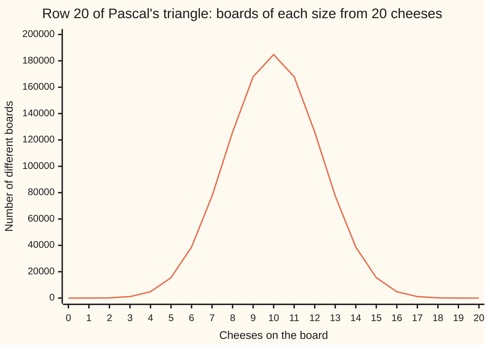
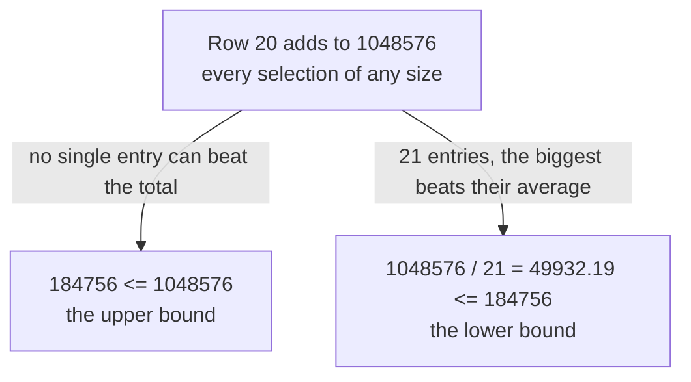

# The middle of the row: C(2n,n) is the biggest entry, and cheap bounds size any choice count without computing it

[Syllabus](../../../SYLLABUS.md) → [Combinatorics and graphs](../README.md) → [Binomial Coefficients and Identities](../README.md#s03) → The middle of the row

---

## General Overview

A cheese counter holds 20 varieties. A tasting board takes 10, and only which ten matters, not the order on the plate. There are 184,756 different boards.

That count is the middle entry of row 20 of Pascal's triangle ([Pascal's rule](01-pascals-rule-and-the-triangle.md)), and the row's largest, though not by much: boards of 9 cheeses and of 11 come to 167,960 each.

Two questions follow. Is the middle always the biggest? And how large is it, without doing the work? Row 20 adds to 1,048,576 — every selection of any size, one yes-or-no per cheese. Its 21 entries, one per board size, average 49,932.19. No entry beats the row's total, and the biggest cannot fall below that average. That pins the count from both sides:

49,932.19 ≤ 184,756 ≤ 1,048,576

Not precise, but an answer to "how big": six digits, give or take one. The middle entry of an even row has a name — the **central binomial coefficient**, written C(2n, n), the term used from here on.

**The middle entry of an even row is its largest, so it is trapped between the row's total and the row's average — and a similar trap fits any entry of any row.**

**What kind of fact this is:** a theorem, proved on this card in Why it works; the central binomial coefficient it names is a definition.

### The picture: row 20, size by size



Row 20 entry by entry: one empty board, 20 of one cheese, up to 184,756 at ten, then back down. The peak is broad and flat; the 21 values add to 1,048,576.

---

## The formula

Notation first, in words. $n$ is how many items there are to choose from, $k$ how many go in one pick, C(n, k) the number of picks. An even row number has one entry dead centre; write the row as 2n and that entry is C(2n, n). With n of 10 it is C(20, 10) = 184,756.

Side-by-side entries have a ratio with no factorials in it:

$$\frac{C(n,k)}{C(n,k-1)} = \frac{n-k+1}{k}$$

**Read it aloud:** one step right multiplies the count by the items still unpicked, over the items now picked.

That makes the middle entry the largest, which gives the sandwich:

$$\frac{4^n}{2n+1} \;\le\; C(2n,n) \;\le\; 4^n$$

**Read it aloud:** the middle entry is at most the whole row, at least the row shared evenly among its entries.

Away from the middle the row total is too blunt. A second pair serves, for every $k$ from 1 to $n$:

$$\left(\frac{n}{k}\right)^{k} \;\le\; C(n,k) \;\le\; \frac{n^{k}}{k!}$$

**Read it aloud:** the count lies between n over k multiplied in k times, and n multiplied in k times over the orderings of a pick.

| Symbol | Plain meaning | In our example | Push it up and the answer… |
| --- | --- | --- | --- |
| $n$ | items to choose from | 20 cheeses | longer rows, larger counts |
| $k$ | items in one pick | 10 on a board | climbs to mid-row, then falls |
| $C(n,k)$ | picks of $k$ from $n$, order ignored | C(20,10) = 184,756 | — |
| $C(2n,n)$ | the middle entry of an even row | 184,756, with n of 10 | — |
| $4^n$ | 4 multiplied in $n$ times: row 2n's total | 1,048,576 | the sandwich slides up, same width |
| $2n+1$ | entries in row 2n | 21 | the lower bound sinks |
| $(n/k)^k$ | the lower bound away from the middle | (20/10)^10 = 1,024 | — |
| $n^k/k!$ | the upper bound away from the middle | 20^10/10! = 2,821,869.49 | — |

### When it holds

- **Whole numbers, $k$ from 0 to $n$.** Past those ends the count is zero by convention; the neighbour ratio needs $k$ at least 1.
- **One peak needs an even row.** An odd row has two biggest entries side by side, the ratio landing on 1 between them.
- **The sandwich is about row 2n, not row n.** Row 20 adds to 1,048,576, so the power is 4^10. Use 2^10 = 1,024 and the "upper bound" falls below the count it caps.
- **The general pair needs $n$ at least $k$.** Past that the count is zero and the lower bound is not.

---

## Why it works

### Step 0: neighbours sit in a fixed ratio

Build every board of 10 from a board of 9: take one of the 167,960 nine-cheese boards, add one of the 11 cheeses left off. That makes 11 × 167,960 results, each a board of 10 with one cheese marked. Every board of 10 turns up 10 times, once per cheese as newcomer. So 11 × 167,960 and 10 × 184,756 count one pile: k × C(n,k) = (n−k+1) × C(n,k−1).

### Step 1: the ratio crosses 1 once, so the row rises then falls

The ratio (n−k+1)/k beats 1 exactly when n + 1 is more than twice k. At n = 20 that reads 21 against 2k, so entries grow every step to k = 10 and shrink after. The last climb multiplies by 11/10 = 1.100, the first fall by 10/11 = 0.909. No entry's size was needed, only the direction of travel.

### Step 2: the whole row adds to 4^n

Row 20 adds to 1,048,576 ([Pascal's rule](01-pascals-rule-and-the-triangle.md)): a selection is one yes-or-no per cheese, and sorting the selections by size and adding back returns all of them. Two 2s make a 4, so 2 multiplied in 20 times is 4 multiplied in 10 times: row 2n adds to 4^n. The run reaches it a second way, by listing.

### Step 3: one total, two bounds



The upper bound needs nothing else: entries are counts, none negative, so none exceeds the sum. The lower bound needs Step 1: the largest of 21 numbers beats their average, and the largest is the middle. Cleared of fractions: 1,048,576 ≤ 21 × 184,756 = 3,879,876.

### Step 4: bounds for any pick size

Write the count as a product: C(n, k) = n(n−1)…(n−k+1) divided by k!, the orderings of a pick.

**Upper.** Each of the k factors on top is at most n, so the top is at most n^k. For the board, 20^10/10! = 2,821,869.49.

**Lower.** Pair the factors off instead: C(n, k) = (n/k) × ((n−1)/(k−1)) × … × ((n−k+1)/1). Taking the same amount off top and bottom of a fraction above 1 makes it larger, so each fraction is at least n/k and the product at least (n/k)^k. The board's ten run 20/10, 19/9 down to 11/1, none below 2.

The pair bracket the board at 1,024 ≤ 184,756 ≤ 2,821,869.49. Away from the middle the upper bound tightens: a wholesaler's boxes of 5 from 100 cheeses number 75,287,520, over 3,200,000 and under 83,333,333.33 — an overshoot of 1.11 against 15.27 mid-row.

<details>
<summary>Detailed proof: the ratio from factorials, and why every factor clears n/k</summary>

**The ratio from factorials.** C(n,k)/C(n,k−1) is n!/(k!(n−k)!) over n!/((k−1)!(n−k+1)!). The n! cancels; k! = (k−1)! × k and (n−k+1)! = (n−k)! × (n−k+1), so (k−1)! and (n−k)! go too, leaving (n−k+1)/k.

**Every factor clears n/k.** Claim: (n−i)/(k−i) ≥ n/k for i from 0 to k−1, given n ≥ k ≥ 1. Denominators are positive, so multiply through by k(k−i): the claim becomes k(n−i) ≥ n(k−i), that is ni ≥ ki, true since i is not negative and n ≥ k. Equality needs i = 0 or n = k, which is why the bound is weak mid-row and tight for small k.

</details>

### Step 5: how much the bounds miss by

The sandwich is wide on purpose. The middle entry is 0.1762 of its row, beats the average by 3.70 and misses the whole row by 5.68 — factors multiplying to 21, the entry count, which never shrinks. A factor of 21 sits between 10 and 100, so the sandwich is one to two digits wide on a base-10 scale ([Log laws and log scales](../../01-Foundations/03-Powers%2C%20Roots%20and%20Logarithms/06-log-laws-and-log-scales.md)): 5 digits at the bottom, 6 for the count, 7 at the top. A cheap bound buys the digit count, not the digits. Replacing k! by an estimate of its own size sharpens the upper bound to (en/k)^k, with e the growth constant — a step that needs the series for e^x, in wing 06.

Another road: Vandermonde's identity ([Vandermonde's identity](03-vandermonde-identity.md)) makes C(20, 10) the entries of row 10 squared and added, which the run confirms at 184,756.

---

## Worked numbers, by hand

| Step | Arithmetic | Value |
| --- | --- | --- |
| the last climb, from nine cheeses | (20 − 10 + 1) / 10 = 11/10 | 1.100 |
| the middle entry, largest in the row | 167,960 × 11/10 | **184,756** |
| the whole row | 4 multiplied in 10 times | **1,048,576** |
| the average entry | 1,048,576 / 21 | **49,932.19** |
| the sandwich | 49,932.19 ≤ 184,756 ≤ 1,048,576 | **6 digits** |
| the house row, row 10 | 1,024 / 11 = 93.09 ≤ 252 ≤ 1,024 | **252** |
| 5 from 100, a sampler box | 3,200,000 ≤ 75,287,520 ≤ 83,333,333.33 | **75,287,520** |

Nobody counted the 184,756 boards to know the figure runs to six digits: the row's total and its entry count settle it, as they settle row 10, where 252 sits between 93.09 and 1,024.

### What breaks if you drop a piece

| Mistake | Comes out at | What went wrong |
| --- | --- | --- |
| The middle entry read as half the row | 524,288 | 21 entries share the row, not two |
| 2^n used where row 2n needs 4^n | 1,024 | Row 20 adds to 1,048,576 |
| The average read as the count | 49,932.19 | The peak clears the average by 3.70 |
| n^k/k! read as the count | 2,821,869.49 | It overshoots by 15.27 mid-row |

The code prints all four.

---

## Code, from first principles, and it actually runs

Nothing is imported. The board count is reached four ways: adding down Pascal's triangle, the product formula with its factorial written out, listing all 1,048,576 selections, and squaring row 10 and adding. The peak is found twice, by the neighbour ratio and by a scan of the row. Every bound is checked in whole numbers, and a second case, 5 from 100, runs them far from the middle.

### Python

```python
# The middle of the row -- the check behind the card.  Nothing is imported.  A shop stocks
# 20 cheeses and a tasting board holds 10.  The count of boards is reached four ways, then
# trapped between bounds that never compute it; and again for 5 from 100.
N, K, M, J = 20, 10, 100, 5           # the board; and a second case, k far from the middle
def triangle_row(n, width):           # road one: each entry is the sum of the two above it
    row = [1] + [0] * width           # row 0, kept to its first width + 1 entries
    for _ in range(n):
        row = [1] + [row[j - 1] + row[j] for j in range(1, width + 1)]
    return row
def falling(n, k):                    # n(n-1)...(n-k+1): k slots filled in order
    out = 1
    for i in range(k): out *= n - i
    return out
def factorial(m):                     # 1 x 2 x ... x m
    out = 1
    for i in range(2, m + 1): out *= i
    return out
def by_listing(n):                    # road three: one bit per cheese, in or out
    counts = [0] * (n + 1)
    for m in range(1 << n): counts[m.bit_count()] += 1
    return counts

row, ten, hundred = triangle_row(N, N), triangle_row(K, K), triangle_row(M, J)
listed = by_listing(N)
central = falling(N, K) // factorial(K)                 # road two: the product formula
vander = sum(x * x for x in ten)                        # road four: row 10 squared and added
c100 = falling(M, J) // factorial(J)
total, avg = sum(row), sum(row) / (2 * K + 1)
peak = max(k for k in range(N + 1) if N - k + 1 > k)    # the last k whose neighbour ratio beats 1
rises = all(row[k] > row[k - 1] for k in range(1, K + 1))
falls = all(row[k] < row[k - 1] for k in range(K + 1, N + 1))
hi20, hi100 = N ** K / factorial(K), M ** J / factorial(J)
print(f"{N} cheeses on the counter, a tasting board holds {K} of them")
print(f"four roads to the count: adding down the triangle {row[K]}, the product formula {central}, "
      f"listing all {1 << N} selections {listed[K]}, squaring and adding row {K} {vander}")
print(f"row {N}: " + " ".join(str(x) for x in row))
print(f"neighbour ratios at the middle: {row[K]}/{row[K - 1]} = {row[K] / row[K - 1]:.3f} above 1, "
      f"{row[K + 1]}/{row[K]} = {row[K + 1] / row[K]:.3f} below 1")
print(f"the row rises to k = {peak} and falls after it: {'yes' if rises and falls else 'no'}; biggest entry {max(row)}")
print(f"row {N} adds to {total} = 4^{K}, and the listing found {sum(listed)} selections in all")
print(f"upper bound, one entry cannot beat the whole row: {row[K]} <= {total}")
print(f"lower bound, {2 * K + 1} entries so the biggest beats the average: "
      f"{total}/{2 * K + 1} = {avg:.2f} <= {row[K]}")
print(f"the same lower bound cleared of fractions: {total} <= {2 * K + 1} x {row[K]} = {(2 * K + 1) * row[K]}")
print(f"the middle entry is {row[K] / total:.4f} of its row; it beats the average by "
      f"{row[K] / avg:.2f} and misses the whole row by {total / row[K]:.2f}")
print(f"digit counts: lower bound {len(str(int(avg)))}, the count {len(str(row[K]))}, upper bound {len(str(total))}")
print(f"bounds at n = {N}, k = {K}: ({N}/{K})^{K} = {(N // K) ** K} <= {row[K]} <= {N}^{K}/{K}! = {hi20:.2f}")
print(f"bounds at n = {M}, k = {J}: ({M}/{J})^{J} = {(M // J) ** J} <= {c100} <= {M}^{J}/{J}! = {hi100:.2f}")
print(f"upper bound divided by the truth: {hi20 / row[K]:.2f} at k = {K} of {N}, {hi100 / c100:.2f} at k = {J} of {M}")
print(f"house row {K}: " + " ".join(str(x) for x in ten) + f" adds to {sum(ten)} = 4^{K // 2}")
print(f"house row {K} sandwich: {sum(ten)}/{K + 1} = {sum(ten) / (K + 1):.2f} <= {ten[K // 2]} <= {sum(ten)}")
print(f"mistakes: half the row gives {total // 2}; 2^{K} in place of 4^{K} gives {2 ** K}; "
      f"the average {avg:.2f} read as the count")
assert row == listed and row[K] == central and row[K] == vander and c100 == hundred[J]
assert peak == K and row[K] == max(row) and rises and falls
assert total == 4 ** K and sum(listed) == total and row[K] <= total and (2 * K + 1) * row[K] >= total
assert (factorial(K) * row[K] <= N ** K and K ** K * row[K] >= N ** K
        and factorial(J) * c100 <= M ** J and J ** J * c100 >= M ** J)
print("ALL CHECKS PASS")
```

**Ran 2026-09-14 on macOS, Python 3.14.6, standard library only. All checks passed. Output, pasted from the run:**

```
20 cheeses on the counter, a tasting board holds 10 of them
four roads to the count: adding down the triangle 184756, the product formula 184756, listing all 1048576 selections 184756, squaring and adding row 10 184756
row 20: 1 20 190 1140 4845 15504 38760 77520 125970 167960 184756 167960 125970 77520 38760 15504 4845 1140 190 20 1
neighbour ratios at the middle: 184756/167960 = 1.100 above 1, 167960/184756 = 0.909 below 1
the row rises to k = 10 and falls after it: yes; biggest entry 184756
row 20 adds to 1048576 = 4^10, and the listing found 1048576 selections in all
upper bound, one entry cannot beat the whole row: 184756 <= 1048576
lower bound, 21 entries so the biggest beats the average: 1048576/21 = 49932.19 <= 184756
the same lower bound cleared of fractions: 1048576 <= 21 x 184756 = 3879876
the middle entry is 0.1762 of its row; it beats the average by 3.70 and misses the whole row by 5.68
digit counts: lower bound 5, the count 6, upper bound 7
bounds at n = 20, k = 10: (20/10)^10 = 1024 <= 184756 <= 20^10/10! = 2821869.49
bounds at n = 100, k = 5: (100/5)^5 = 3200000 <= 75287520 <= 100^5/5! = 83333333.33
upper bound divided by the truth: 15.27 at k = 10 of 20, 1.11 at k = 5 of 100
house row 10: 1 10 45 120 210 252 210 120 45 10 1 adds to 1024 = 4^5
house row 10 sandwich: 1024/11 = 93.09 <= 252 <= 1024
mistakes: half the row gives 524288; 2^10 in place of 4^10 gives 1024; the average 49932.19 read as the count
ALL CHECKS PASS
```

### Rust

Same numbers, same labels, built with `rustc --edition 2021 -O`.

```rust
// The middle of the row -- the same check as the Python, in Rust.  No crates.  A shop stocks
// 20 cheeses and a tasting board holds 10.  The count of boards is reached four ways, then
// trapped between bounds that never compute it; and again for 5 from 100.
const N: usize = 20; const K: usize = 10; const M: usize = 100; const J: usize = 5;
fn triangle_row(n: usize, width: usize) -> Vec<u64> {   // road one: each entry is the sum of the two above it
    let mut row = vec![0u64; width + 1];                // row 0, kept to its first width + 1 entries
    row[0] = 1;
    for _ in 0..n {
        let mut next = vec![1u64; width + 1];
        for j in 1..=width { next[j] = row[j - 1] + row[j] }
        row = next;
    }
    row
}
fn falling(n: u64, k: u64) -> u64 {                     // n(n-1)...(n-k+1): k slots filled in order
    (0..k).fold(1u64, |out, i| out * (n - i))
}
fn factorial(m: u64) -> u64 { (2..=m).fold(1u64, |out, i| out * i) }   // 1 x 2 x ... x m
fn by_listing(n: usize) -> Vec<u64> {                   // road three: one bit per cheese, in or out
    let mut counts = vec![0u64; n + 1];
    for m in 0..(1u64 << n) { counts[m.count_ones() as usize] += 1 }
    counts
}
fn main() {
    let (row, ten, hundred) = (triangle_row(N, N), triangle_row(K, K), triangle_row(M, J));
    let listed = by_listing(N);
    let central = falling(N as u64, K as u64) / factorial(K as u64);   // road two: the product formula
    let vander: u64 = ten.iter().map(|x| x * x).sum();                 // road four: row 10 squared and added
    let c100 = falling(M as u64, J as u64) / factorial(J as u64);
    let total: u64 = row.iter().sum();
    let avg = total as f64 / (2 * K + 1) as f64;
    let peak = (0..=N).filter(|&k| N - k + 1 > k).max().unwrap();      // the last k whose neighbour ratio beats 1
    let rises = (1..=K).all(|k| row[k] > row[k - 1]);
    let falls = (K + 1..=N).all(|k| row[k] < row[k - 1]);
    let hi20 = (N as u64).pow(K as u32) as f64 / factorial(K as u64) as f64;
    let hi100 = (M as u64).pow(J as u32) as f64 / factorial(J as u64) as f64;
    let (listed_total, ten_sum): (u64, u64) = (listed.iter().sum(), ten.iter().sum());
    let cells: Vec<String> = row.iter().map(|x| x.to_string()).collect();
    let tens: Vec<String> = ten.iter().map(|x| x.to_string()).collect();
    println!("{} cheeses on the counter, a tasting board holds {} of them", N, K);
    println!("four roads to the count: adding down the triangle {}, the product formula {}, \
listing all {} selections {}, squaring and adding row {} {}",
             row[K], central, 1u64 << N, listed[K], K, vander);
    println!("row {}: {}", N, cells.join(" "));
    println!("neighbour ratios at the middle: {}/{} = {:.3} above 1, {}/{} = {:.3} below 1",
             row[K], row[K - 1], row[K] as f64 / row[K - 1] as f64,
             row[K + 1], row[K], row[K + 1] as f64 / row[K] as f64);
    println!("the row rises to k = {} and falls after it: {}; biggest entry {}",
             peak, if rises && falls { "yes" } else { "no" }, row.iter().max().unwrap());
    println!("row {} adds to {} = 4^{}, and the listing found {} selections in all", N, total, K, listed_total);
    println!("upper bound, one entry cannot beat the whole row: {} <= {}", row[K], total);
    println!("lower bound, {} entries so the biggest beats the average: {}/{} = {:.2} <= {}",
             2 * K + 1, total, 2 * K + 1, avg, row[K]);
    println!("the same lower bound cleared of fractions: {} <= {} x {} = {}",
             total, 2 * K + 1, row[K], (2 * K as u64 + 1) * row[K]);
    println!("the middle entry is {:.4} of its row; it beats the average by {:.2} and misses the whole row by {:.2}",
             row[K] as f64 / total as f64, row[K] as f64 / avg, total as f64 / row[K] as f64);
    println!("digit counts: lower bound {}, the count {}, upper bound {}",
             (avg as u64).to_string().len(), row[K].to_string().len(), total.to_string().len());
    println!("bounds at n = {}, k = {}: ({}/{})^{} = {} <= {} <= {}^{}/{}! = {:.2}",
             N, K, N, K, K, (N as u64 / K as u64).pow(K as u32), row[K], N, K, K, hi20);
    println!("bounds at n = {}, k = {}: ({}/{})^{} = {} <= {} <= {}^{}/{}! = {:.2}",
             M, J, M, J, J, (M as u64 / J as u64).pow(J as u32), c100, M, J, J, hi100);
    println!("upper bound divided by the truth: {:.2} at k = {} of {}, {:.2} at k = {} of {}",
             hi20 / row[K] as f64, K, N, hi100 / c100 as f64, J, M);
    println!("house row {}: {} adds to {} = 4^{}", K, tens.join(" "), ten_sum, K / 2);
    println!("house row {} sandwich: {}/{} = {:.2} <= {} <= {}",
             K, ten_sum, K + 1, ten_sum as f64 / (K + 1) as f64, ten[K / 2], ten_sum);
    println!("mistakes: half the row gives {}; 2^{} in place of 4^{} gives {}; the average {:.2} read as the count",
             total / 2, K, K, 2u64.pow(K as u32), avg);
    assert!(row == listed && row[K] == central && row[K] == vander && c100 == hundred[J]);
    assert!(peak == K && row[K] == *row.iter().max().unwrap() && rises && falls);
    assert!(total == 4u64.pow(K as u32) && listed_total == total && row[K] <= total
            && (2 * K as u64 + 1) * row[K] >= total);
    assert!(factorial(K as u64) * row[K] <= (N as u64).pow(K as u32)
            && (K as u64).pow(K as u32) * row[K] >= (N as u64).pow(K as u32)
            && factorial(J as u64) * c100 <= (M as u64).pow(J as u32)
            && (J as u64).pow(J as u32) * c100 >= (M as u64).pow(J as u32));
    println!("ALL CHECKS PASS");
}
```

**Ran 2026-09-14 on macOS, rustc 1.98.1, no crates. All checks passed. Output, pasted from the run:**

```
20 cheeses on the counter, a tasting board holds 10 of them
four roads to the count: adding down the triangle 184756, the product formula 184756, listing all 1048576 selections 184756, squaring and adding row 10 184756
row 20: 1 20 190 1140 4845 15504 38760 77520 125970 167960 184756 167960 125970 77520 38760 15504 4845 1140 190 20 1
neighbour ratios at the middle: 184756/167960 = 1.100 above 1, 167960/184756 = 0.909 below 1
the row rises to k = 10 and falls after it: yes; biggest entry 184756
row 20 adds to 1048576 = 4^10, and the listing found 1048576 selections in all
upper bound, one entry cannot beat the whole row: 184756 <= 1048576
lower bound, 21 entries so the biggest beats the average: 1048576/21 = 49932.19 <= 184756
the same lower bound cleared of fractions: 1048576 <= 21 x 184756 = 3879876
the middle entry is 0.1762 of its row; it beats the average by 3.70 and misses the whole row by 5.68
digit counts: lower bound 5, the count 6, upper bound 7
bounds at n = 20, k = 10: (20/10)^10 = 1024 <= 184756 <= 20^10/10! = 2821869.49
bounds at n = 100, k = 5: (100/5)^5 = 3200000 <= 75287520 <= 100^5/5! = 83333333.33
upper bound divided by the truth: 15.27 at k = 10 of 20, 1.11 at k = 5 of 100
house row 10: 1 10 45 120 210 252 210 120 45 10 1 adds to 1024 = 4^5
house row 10 sandwich: 1024/11 = 93.09 <= 252 <= 1024
mistakes: half the row gives 524288; 2^10 in place of 4^10 gives 1024; the average 49932.19 read as the count
ALL CHECKS PASS
```

The two outputs match line for line.

> [!TIP]
> **Try changing**
> Guess first, then run it. The asserts are pinned to the board, so expect one to stop it.
> - **Break the peak test.** Change `N - k + 1 > k` to `N - k - 1 > k`: the ratio turns over a place early, the scan still puts the largest at k = 10, and the second assert stops it.
> - **Flip a bound.** Change `>= total` to `<= total` in the third assert: 3,879,876 against 1,048,576, and it stops.
> - **Shrink the sampler box.** Set `J` to `4`: count and bounds all move, the gap above the count narrows to 1.06, and the fourth assert holds.

---

## The usual mistake

> [!warning]
> **Reading a bound as an estimate.** The sandwich says where the count cannot be, not that it is near either end. 184,756 is neither 49,932.19 nor 1,048,576; it sits at 0.1762 of its row.
>
> - **Halving the row.** Two entries would be 524,288 each; the row has 21, and the middle one is 184,756.
> - **Using 2^n for a row of 2n.** Row 20 adds to 1,048,576, not 1,024, so 2^10 as an upper bound lands below the count it caps.
> - **Expecting a sharp peak.** The middle beats its neighbour by 1.100, not by an order of magnitude. Choice-count rows are flat on top.

---

## Where you meet it in real life

- **Sizing a search.** A program inspecting every pick of k from n does at most n^k/k! work: 83,333,333.33 for 5 of 100, 2,821,869.49 for 10 of 20. That says which job finishes over lunch.
- **Coin flips.** Twenty tosses make 1,048,576 equally likely head-and-tail records; 184,756 show exactly ten heads — favourable over possible, 0.1762. The same count returns as the 20-step walks ending where they began: [Counting coin-flip paths](../06-Lattice%20Paths%20and%20Catalan%20Numbers/05-random-walk-path-counts.md).
- **Comparing counts nobody can compute.** An argument that something must exist can weigh bad cases against all cases with bounds alone: [Erdos's counting trick](../14-Ramsey%20and%20Extremal%2C%20in%20Outline/03-probabilistic-method-by-counting.md).

> **Say it back**
> Twenty cheeses and a board of ten give 184,756 boards, the middle entry of row 20. Neighbours sit in the ratio (n − k + 1)/k, above 1 up to the middle and below after, so the middle entry is the largest. The row adds to 1,048,576, so no entry beats that and the biggest of 21 beats their average of 49,932.19. Away from the middle the count lies between (n/k)^k and n^k/k!.

---

## What this builds on

- [Pascal's rule](01-pascals-rule-and-the-triangle.md): the row total 1,048,576 both bounds hang on.
- [Vandermonde's identity](03-vandermonde-identity.md): the middle entry as row 10 squared and added, a fourth road to 184,756.
- [Log laws and log scales](../../01-Foundations/03-Powers%2C%20Roots%20and%20Logarithms/06-log-laws-and-log-scales.md): why a factor of 21 counts as about one digit, which makes a loose bound useful.

## Where this goes next

- [Counting coin-flip paths](../06-Lattice%20Paths%20and%20Catalan%20Numbers/05-random-walk-path-counts.md): 184,756 as the 20-step walks that end where they began.
- [Erdos's counting trick](../14-Ramsey%20and%20Extremal%2C%20in%20Outline/03-probabilistic-method-by-counting.md): existence proved by bounding counts nobody can compute.
- Chebyshev's bounds: this sandwich turned into how many primes lie below a number.

The sandwich never tightens: a factor of 21 for row 20, as wide as the row is long for any other. What it cannot say is that the middle entry's share of its row, 0.1762 here, keeps shrinking as rows grow — the fact that decides how far a 20-step walk strays, in [Counting coin-flip paths](../06-Lattice%20Paths%20and%20Catalan%20Numbers/05-random-walk-path-counts.md).

---

## Sources

Verified 14 Sep 2026: every link below resolves to the publisher's page.

- Graham, Ronald L., Donald E. Knuth, and Oren Patashnik. *Concrete Mathematics*, 2nd ed. Addison-Wesley, 1994. [Publisher page](https://www.informit.com/store/concrete-mathematics-a-foundation-for-computer-science-9780201558029). Chapter 5, the central coefficient and its bounds.
- "A000984: Central binomial coefficients." On-Line Encyclopedia of Integer Sequences. [Sequence page](https://oeis.org/A000984). The sequence C(2n,n); its eleventh term is 184,756.
- Flajolet, Philippe, and Robert Sedgewick. *Analytic Combinatorics*. Cambridge University Press, 2009. [Full text, authors' copy](https://algo.inria.fr/flajolet/Publications/book.pdf). Where the crude sandwich gives way to a sharp estimate.
