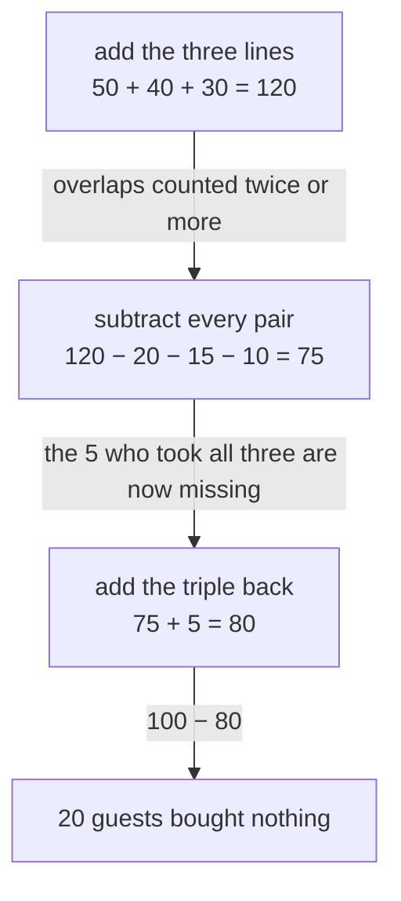

# Inclusion-exclusion for any number of sets: add, subtract the pairs, add the triples, and every element ends up counted once

[Syllabus](../../../SYLLABUS.md) → [Combinatorics and graphs](../../../SYLLABUS.md#w04) → [Inclusion-Exclusion and Pigeonhole](../../../SYLLABUS.md#w04-s04) → Inclusion-exclusion for any number of sets

---

## General Overview

A hotel closes its June books on 100 guests. The extras ledger has three lines: 50 took breakfast, 40 parking, 30 the spa. How many bought no extra?

Adding the lines gives 120 in a hotel of 100. Impossible: a guest who took breakfast and parking is written on two lines.

The overlaps are on record: 20 took breakfast and parking, 15 breakfast and spa, 10 parking and spa, 5 took all three. Subtracting the pairs gives 75 — too low, since the 5 who took everything came off once too often. Add them back: 80 bought something, 20 bought nothing.

Two sets and three were settled earlier ([Inclusion-exclusion](../../01-Foundations/07-Sets/04-inclusion-exclusion.md)); this card takes any number.

**Add the sets, subtract every pair, add every triple, flipping the sign to the last overlap: each member of at least one set then contributes exactly 1, each member of none 0.**

**What kind of fact this is:** a theorem, proved on this card in Why it works.

### The picture: three corrections, in order



Each arrow names the damage the next box repairs.

---

## The formula

Notation first. Bars count members: $\lvert A\rvert$ is the size of a set A. The cup ∪ means "in at least one", the cap ∩ "in all" ([Set operations](../../01-Foundations/07-Sets/03-set-operations.md)). Sigma is the add-up sign, and C(n, j), "n choose j", counts the ways to pick j from n.

Call the sets $A_i$, numbered 1 up to $n$: breakfast, parking, spa, so $n$ is 3. Layer j takes the sets j at a time and adds up those overlaps' sizes.

$$S_j = \sum_{1 \le i_1 < i_2 < \cdots < i_j \le n} \lvert A_{i_1} \cap A_{i_2} \cap \cdots \cap A_{i_j}\rvert$$

**Read it aloud:** count what lies in all j of the sets chosen, for every choice of j sets.

Layer 1 is 120, layer 2 45, layer 3 the lone triple, 5. Layer j holds C(n, j) counts, so the layers hold $2^n - 1$ in all.

$$\lvert A_1 \cup A_2 \cup \cdots \cup A_n\rvert = S_1 - S_2 + S_3 - \cdots + (-1)^{n+1} S_n$$

**Read it aloud:** the count in at least one set is the layers added and subtracted in turn, starting with a plus.

What lies in *none* of them is the pool of 100 minus that union: 20 guests.

| Symbol | Plain meaning | In our example | Push it up and the answer… |
| --- | --- | --- | --- |
| $A_i$ | one of the sets combined | breakfast, parking, spa | — |
| $n$ | how many sets | 3 here, 4 in the sieve below | the overlap list doubles |
| $\lvert A\rvert$ | the size of a set | breakfast holds 50 | the union grows, by less |
| $S_j$ | layer j: the j-at-a-time overlaps, added | 120, 45, 5 | odd layers lift, even lower |
| $k$ | how many sets a member sits in | all-three guest: k = 3 | more repairs, net 1 |

### When it holds

- **Finite sets.** Every layer must be a whole number; subtracting one infinite count from another settles nothing.
- **Sets, not tallies.** Nine breakfasts make one member of the breakfast set; repeated rows break layer 1 before the repairs begin.
- **Every overlap knowable.** It asks for $2^n - 1$ counts: 7 for three sets, 15 for four, doubling after. Out of reach, the sum is cut short and becomes a bound ([Stopping the sieve early](04-union-bound-and-bonferroni.md)).

---

## Why it works

### Step 0: watch one member, not the sets

A total is right when every member contributes what it should: 1 for a member of at least one set, 0 otherwise. Test one guest.

Take the guest who took breakfast and parking, not the spa. Layer 1 counts them twice, on two lines; layer 2 once, in the breakfast-and-parking overlap; layer 3 not at all: 2 − 1 = 1.

### Step 1: how often one member is counted

Write $k$ for how many sets a member belongs to; that guest's $k$ is 2. Which overlaps hold them? Only those built from their own sets — an overlap naming the spa cannot hold a guest who skipped it. So the layer-j overlaps holding a member are the ways to choose j of their own k sets: C(k, j) of them, here C(2, 1) = 2 in layer 1 and C(2, 2) = 1 in layer 2.

That is what makes n sets no harder than three: only a member's own $k$ matters.

### Step 2: the alternating sum of those counts is 1

A member in k sets therefore contributes

$$C(k, 1) - C(k, 2) + C(k, 3) - \cdots + (-1)^{k+1} C(k, k)$$

which comes to 1 for every $k$ of 1 or more. Off Pascal's triangle: 1; 2 − 1 = 1; 3 − 3 + 1 = 1; 4 − 6 + 4 − 1 = 1. The code runs it to $k$ = 8. The binomial theorem is the reason ([Alternating sums](../03-Binomial%20Coefficients%20and%20Identities/06-alternating-sums-and-binomial-inversion.md)).

<details>
<summary>Detailed proof: why the alternating sum collapses</summary>

The binomial theorem expands $(1 + x)^k$ as $C(k, 0) + C(k, 1)x + \cdots + C(k, k)x^k$. Set x to −1: the left side is $(1 - 1)^k$, which is 0 for every k of 1 or more.

$$0 = C(k, 0) - C(k, 1) + C(k, 2) - \cdots + (-1)^k C(k, k)$$

C(k, 0) is 1, one way to choose nothing. Move it across and multiply by −1: what remains is the member's contribution, 1 for any k, with no mention of n. Added over the pool, that is the theorem. Only k = 0 is excluded, $(1-1)^0$ being 1.

</details>

### Step 3: members in no set never appear

If $k$ is 0 the member lies in no set, so in no overlap, so in no layer: it contributes 0. The 20 who bought nothing never enter the sum.

### Step 4: take the union off the pool

80 from 100 leaves 20 — usually the question actually asked.

<details>
<summary>Euler's totient is this sieve on the divisors</summary>

Sieve the first 30 numbers by 2, 3 and 5: 8 escape, the 8 the code prints. That count is the totient, written with the Greek letter phi: phi(30) = 8 ([Euler's totient](../../02-Number%20theory/04-Powers%20on%20the%20Clock/03-eulers-totient.md)). Its usual form, 30 × (1 − 1/2) × (1 − 1/3) × (1 − 1/5) = 8, is one bracket per divisor; multiplying out gives the signed sum term for term.

</details>

Induction on the number of sets reaches the theorem too, but hides where the signs come from.

---

## Worked numbers, by hand

| Step | Arithmetic | Value |
| --- | --- | --- |
| layer 1, the lines | 50 + 40 + 30 | 120 |
| layer 2, the pairs | 20 + 15 + 10 | 45 |
| layer 3, the triple | 5 | 5 |
| the union | 120 − 45 + 5 | **80** |
| bought nothing | 100 − 80 | **20** |

Eighty of the hundred June guests bought an extra, twenty none.

### Four properties at once

How many of 1 to 1,000 are divisible by none of 2, 3, 5 and 7? The four share no factor, so an overlap is divisibility by their product, and each count is a division with the remainder dropped: 500 are divisible by 2, and 166 by 2 and 3 together.

| Layer | Overlaps counted | Total |
| --- | --- | --- |
| 1, the four singles | 500 + 333 + 200 + 142 | 1,175 |
| 2, the six pairs | 166 + 100 + 71 + 66 + 47 + 28 | 478 |
| 3, the four triples | 33 + 23 + 14 + 9 | 79 |
| 4, the one quadruple | 4 | 4 |
| divisible by something | 1,175 − 478 + 79 − 4 | **772** |
| divisible by none | 1,000 − 772 | **228** |

Drop the 7 and the same machine gives layers 1,033, 332 and 33, a union of 734, so 266 survivors. That 266 has a check with no sieve in it: survivors repeat every 30, 8 to a block — 33 × 8 + 2 = 266.

### What breaks if you drop a piece

| Mistake | Comes out at | What went wrong |
| --- | --- | --- |
| Add the lines and stop | 120 | No repair, and more than the hotel holds |
| Stop after the pairs | 75 | The 5 all-three guests: added 3 times, subtracted 3 |
| Subtract the triple, not add | 70 | The last sign flipped: those 5 count −1 each |

The code prints all three.

---

## Code, from first principles, and it actually runs

Nothing is imported, and every count is reached twice. The roster is built guest by guest from the eight groups the ledger makes; the union comes from the signed sum of overlaps, and again from walking the roster. The sieve runs by layers, then by testing every number.

### Python

```python
# Inclusion-exclusion for any number of sets -- the check behind the card.  Nothing
# is imported.  A hotel of 100 guests with three amenities, then the numbers 1 to
# 1000 sieved by 2, 3, 5 and by 2, 3, 5, 7.  Every count is reached twice: by the
# signed sum of overlaps, and by walking the members one at a time.
REGIONS = {("B", "P", "S"): 5, ("B", "P"): 15, ("B", "S"): 10, ("P", "S"): 5,
           ("B",): 20, ("P",): 15, ("S",): 10, (): 20}
ROSTER = [set(r) for r, n in REGIONS.items() for _ in range(n)]

def pick(items, j):                      # every j of the items, order kept
    if j == 0: return [()]
    return [(x,) + r for i, x in enumerate(items) for r in pick(items[i + 1:], j - 1)]

def overlaps(items, size):               # every j-at-a-time overlap, layer by layer
    return [[size(c) for c in pick(items, j)] for j in range(1, len(items) + 1)]

def union(ls):                           # S_1 - S_2 + S_3 - ...
    return sum((-1) ** j * sum(layer) for j, layer in enumerate(ls))

def choose(n, k):                        # Pascal's triangle, built here
    row = [1]
    for _ in range(n): row = [a + b for a, b in zip([0] + row, row + [0])]
    return row[k]

def guests_with(names):                  # guests holding every amenity named
    return sum(1 for g in ROSTER if set(names) <= g)
def prod(ds): return ds[0] * prod(ds[1:]) if ds else 1
def multiples_of_all(ds): return 1000 // prod(ds)     # 1 to 1000 divisible by all of ds
def none_of(ds, limit):                  # road two: test every number in turn
    return sum(1 for x in range(1, limit + 1) if all(x % d for d in ds))
def yn(claim): return "yes" if claim else "no"

th = overlaps(list("BPS"), guests_with)
hl = [sum(layer) for layer in th]
hotel, walk = union(th), sum(1 for g in ROSTER if g)
ones = [sum((-1) ** (j + 1) * choose(k, j) for j in range(1, k + 1)) for k in range(1, 9)]
t3, t4 = overlaps([2, 3, 5], multiples_of_all), overlaps([2, 3, 5, 7], multiples_of_all)
l3, l4 = [sum(x) for x in t3], [sum(x) for x in t4]
none3, none4 = 1000 - union(t3), 1000 - union(t4)
blocks, per, spare = 1000 // 30, none_of([2, 3, 5], 30), sum(1 for x in range(991, 1001) if all(x % d for d in (2, 3, 5)))
print(f"hotel: {len(ROSTER)} guests; singles {th[0]}, pairs {th[1]}, all three {th[2]}")
print(f"layers S1 {hl[0]}, S2 {hl[1]}, S3 {hl[2]}  ->  union {hl[0]} - {hl[1]} + {hl[2]} = {hotel}")
print(f"the same {hotel}, by walking the roster guest by guest: {yn(hotel == walk)}")
print(f"guests who took nothing: {len(ROSTER)} - {hotel} = {len(ROSTER) - hotel}")
print(f"a guest in k of the amenities is counted, for k = 1 to 8: {ones}")
print(f"Pascal's row for k = 4, the counts that alternate: {[choose(4, j) for j in range(5)]}")
print(f"mistake 1, add the three counts and stop: {hl[0]}, not {hotel}")
print(f"mistake 2, stop after the pairs: {hl[0] - hl[1]}, not {hotel}")
print(f"mistake 3, subtract the triple instead of adding: {hl[0] - hl[1] - hl[2]}, not {hotel}")
print(f"1 to 1000, none of 2, 3, 5: layers {l3}  ->  union {union(t3)}, none {none3}")
print(f"1 to 1000, none of 2, 3, 5: by testing each number {none_of([2, 3, 5], 1000)}")
print(f"1 to 1000, none of 2, 3, 5: {blocks} blocks of 30 x {per} + {spare} left over = {blocks * per + spare}")
print(f"1 to 1000, by 2, 3, 5, 7: singles {t4[0]}, pairs {t4[1]}, triples {t4[2]}, all four {t4[3]}")
print(f"1 to 1000, none of 2, 3, 5, 7: layers {l4}  ->  union {union(t4)}, none {none4}")
print(f"1 to 1000, none of 2, 3, 5, 7: by testing each number {none_of([2, 3, 5, 7], 1000)}")
assert hotel == walk and hotel == 80                       # sieve against a head count
assert len(ROSTER) - hotel == 20 and hl == [120, 45, 5]    # the layers, one at a time
assert none3 == none_of([2, 3, 5], 1000) and none3 == blocks * per + spare
assert none4 == none_of([2, 3, 5, 7], 1000) and ones == [1] * 8
print("ALL CHECKS PASS")
```

**Ran 2026-09-14 on macOS, Python 3.14.6, standard library only. All checks passed. Output, pasted from the run:**

```
hotel: 100 guests; singles [50, 40, 30], pairs [20, 15, 10], all three [5]
layers S1 120, S2 45, S3 5  ->  union 120 - 45 + 5 = 80
the same 80, by walking the roster guest by guest: yes
guests who took nothing: 100 - 80 = 20
a guest in k of the amenities is counted, for k = 1 to 8: [1, 1, 1, 1, 1, 1, 1, 1]
Pascal's row for k = 4, the counts that alternate: [1, 4, 6, 4, 1]
mistake 1, add the three counts and stop: 120, not 80
mistake 2, stop after the pairs: 75, not 80
mistake 3, subtract the triple instead of adding: 70, not 80
1 to 1000, none of 2, 3, 5: layers [1033, 332, 33]  ->  union 734, none 266
1 to 1000, none of 2, 3, 5: by testing each number 266
1 to 1000, none of 2, 3, 5: 33 blocks of 30 x 8 + 2 left over = 266
1 to 1000, by 2, 3, 5, 7: singles [500, 333, 200, 142], pairs [166, 100, 71, 66, 47, 28], triples [33, 23, 14, 9], all four [4]
1 to 1000, none of 2, 3, 5, 7: layers [1175, 478, 79, 4]  ->  union 772, none 228
1 to 1000, none of 2, 3, 5, 7: by testing each number 228
ALL CHECKS PASS
```

### Rust

Same numbers, same labels, built with `rustc --edition 2021 -O`.

```rust
// Inclusion-exclusion for any number of sets -- the same check as the Python, in Rust.
// No crates.  A hotel of 100 guests with three amenities, then the numbers 1 to 1000
// sieved by 2, 3, 5 and by 2, 3, 5, 7.  Every count is reached twice: by the signed
// sum of overlaps, and by walking the members one at a time.
const REGIONS: [(u8, i64); 8] = [(7, 5), (3, 15), (5, 10), (6, 5), (1, 20), (2, 15), (4, 10), (0, 20)];

fn roster() -> Vec<u8> {                              // one entry per guest: which amenities
    let mut out = Vec::new();
    for (mask, n) in REGIONS { for _ in 0..n { out.push(mask) } }
    out
}
fn pick(items: &[i64], j: usize) -> Vec<Vec<i64>> {   // every j of the items, order kept
    if j == 0 { return vec![Vec::new()] }
    let mut out = Vec::new();
    for (i, &x) in items.iter().enumerate() {
        for rest in pick(&items[i + 1..], j - 1) { out.push([vec![x], rest].concat()) }
    }
    out
}
fn overlaps(items: &[i64], size: &dyn Fn(&[i64]) -> i64) -> Vec<Vec<i64>> {   // layer by layer
    (1..=items.len()).map(|j| pick(items, j).iter().map(|c| size(c)).collect()).collect()
}
fn union(ls: &[Vec<i64>]) -> i64 {                    // S_1 - S_2 + S_3 - ...
    ls.iter().enumerate().map(|(j, r)| { let s: i64 = r.iter().sum(); if j % 2 == 0 { s } else { -s } }).sum()
}
fn choose(n: i64, k: i64) -> i64 {                    // Pascal's triangle, built here
    let mut row = vec![1i64];
    for _ in 0..n {
        let mut next = vec![0i64; row.len() + 1];
        for (i, &v) in row.iter().enumerate() { next[i] += v; next[i + 1] += v }
        row = next;
    }
    row[k as usize]
}
fn guests_with(bits: &[i64], all: &[u8]) -> i64 {     // guests holding every amenity named
    let mask: u8 = bits.iter().map(|&t| 1u8 << t).sum();
    all.iter().filter(|&&g| g & mask == mask).count() as i64
}
fn prod(ds: &[i64]) -> i64 { ds.iter().product() }
fn multiples_of_all(ds: &[i64]) -> i64 { 1000 / prod(ds) }   // 1 to 1000 divisible by all of ds
fn none_of(ds: &[i64], limit: i64) -> i64 {           // road two: test every number in turn
    (1..=limit).filter(|x| ds.iter().all(|d| x % d != 0)).count() as i64
}
fn yn(claim: bool) -> &'static str { if claim { "yes" } else { "no" } }
fn totals(ls: &[Vec<i64>]) -> Vec<i64> { ls.iter().map(|r| r.iter().sum()).collect() }

fn main() {
    let (all, amen) = (roster(), vec![0i64, 1, 2]);
    let th = overlaps(&amen, &|c: &[i64]| guests_with(c, &all));
    let hl = totals(&th);
    let (hotel, walk) = (union(&th), all.iter().filter(|&&m| m != 0).count() as i64);
    let ones: Vec<i64> = (1..=8).map(|k| (1..=k).map(|j| if j % 2 == 1 { choose(k, j) } else { -choose(k, j) }).sum()).collect();
    let pascal: Vec<i64> = (0..=4).map(|j| choose(4, j)).collect();
    let (t3, t4) = (overlaps(&[2, 3, 5], &multiples_of_all), overlaps(&[2, 3, 5, 7], &multiples_of_all));
    let (l3, l4) = (totals(&t3), totals(&t4));
    let (none3, none4) = (1000 - union(&t3), 1000 - union(&t4));
    let (blocks, per) = (1000 / 30, none_of(&[2, 3, 5], 30));
    let spare = (991..=1000).filter(|x: &i64| [2, 3, 5].iter().all(|d| x % d != 0)).count() as i64;
    println!("hotel: {} guests; singles {:?}, pairs {:?}, all three {:?}", all.len(), th[0], th[1], th[2]);
    println!("layers S1 {}, S2 {}, S3 {}  ->  union {} - {} + {} = {}", hl[0], hl[1], hl[2], hl[0], hl[1], hl[2], hotel);
    println!("the same {}, by walking the roster guest by guest: {}", hotel, yn(hotel == walk));
    println!("guests who took nothing: {} - {} = {}", all.len(), hotel, all.len() as i64 - hotel);
    println!("a guest in k of the amenities is counted, for k = 1 to 8: {:?}", ones);
    println!("Pascal's row for k = 4, the counts that alternate: {:?}", pascal);
    println!("mistake 1, add the three counts and stop: {}, not {}", hl[0], hotel);
    println!("mistake 2, stop after the pairs: {}, not {}", hl[0] - hl[1], hotel);
    println!("mistake 3, subtract the triple instead of adding: {}, not {}", hl[0] - hl[1] - hl[2], hotel);
    println!("1 to 1000, none of 2, 3, 5: layers {:?}  ->  union {}, none {}", l3, union(&t3), none3);
    println!("1 to 1000, none of 2, 3, 5: by testing each number {}", none_of(&[2, 3, 5], 1000));
    println!("1 to 1000, none of 2, 3, 5: {} blocks of 30 x {} + {} left over = {}", blocks, per, spare, blocks * per + spare);
    println!("1 to 1000, by 2, 3, 5, 7: singles {:?}, pairs {:?}, triples {:?}, all four {:?}", t4[0], t4[1], t4[2], t4[3]);
    println!("1 to 1000, none of 2, 3, 5, 7: layers {:?}  ->  union {}, none {}", l4, union(&t4), none4);
    println!("1 to 1000, none of 2, 3, 5, 7: by testing each number {}", none_of(&[2, 3, 5, 7], 1000));
    assert!(hotel == walk && hotel == 80);                              // sieve against a head count
    assert!(all.len() as i64 - hotel == 20 && hl == vec![120, 45, 5]);  // the layers, one at a time
    assert!(none3 == none_of(&[2, 3, 5], 1000) && none3 == blocks * per + spare);
    assert!(none4 == none_of(&[2, 3, 5, 7], 1000) && ones == vec![1i64; 8]);
    println!("ALL CHECKS PASS");
}
```

**Ran 2026-09-14 on macOS, rustc 1.98.1, no crates. All checks passed. Output, pasted from the run:**

```
hotel: 100 guests; singles [50, 40, 30], pairs [20, 15, 10], all three [5]
layers S1 120, S2 45, S3 5  ->  union 120 - 45 + 5 = 80
the same 80, by walking the roster guest by guest: yes
guests who took nothing: 100 - 80 = 20
a guest in k of the amenities is counted, for k = 1 to 8: [1, 1, 1, 1, 1, 1, 1, 1]
Pascal's row for k = 4, the counts that alternate: [1, 4, 6, 4, 1]
mistake 1, add the three counts and stop: 120, not 80
mistake 2, stop after the pairs: 75, not 80
mistake 3, subtract the triple instead of adding: 70, not 80
1 to 1000, none of 2, 3, 5: layers [1033, 332, 33]  ->  union 734, none 266
1 to 1000, none of 2, 3, 5: by testing each number 266
1 to 1000, none of 2, 3, 5: 33 blocks of 30 x 8 + 2 left over = 266
1 to 1000, by 2, 3, 5, 7: singles [500, 333, 200, 142], pairs [166, 100, 71, 66, 47, 28], triples [33, 23, 14, 9], all four [4]
1 to 1000, none of 2, 3, 5, 7: layers [1175, 478, 79, 4]  ->  union 772, none 228
1 to 1000, none of 2, 3, 5, 7: by testing each number 228
ALL CHECKS PASS
```

The two outputs match line for line.

> [!TIP]
> **Try changing**
> Guess first, then run it. The asserts are pinned to the ledger and the two sieves, so expect one to stop the program.
> - **Break the sign.** In `union`, change `(-1) ** j` to `(-1) ** (j + 1)`: every layer flips and the hotel reads −80.
> - **Stop early.** Make `union` return the first layer minus the second: 75, below the truth — a Bonferroni bound.
> - **Sieve by 2, 3, 5, 7, 11.** Add 11 to the four-divisor list: 31 overlap counts replace 15, and the roads still agree, on 207 survivors.

---

## The usual mistake

> [!warning]
> **Stopping after the pairs.** With two sets one subtraction finishes the repair, and the habit sticks. With three it does not: the hotel reads 75, not 80, because the 5 who took all three were added three times in layer 1 and subtracted three times in layer 2, netting zero.
>
> - **Adding the lines and stopping.** 120 for a hotel of 100; wrong totals are not always this visible.
> - **Flipping the last sign.** Subtracting the triple rather than adding gives 70. Odd layers are added, even layers subtracted, all the way down.
> - **Reading a pair count as "these two only".** The 20 includes the 5 who also took the spa; feed in "only" counts and the sum repairs damage never done.

---

## Where you meet it in real life

- **Audits and database counts.** "Matching at least one of these flags" is this sum; five flags means thirty-one overlaps, which is why query tools walk the rows instead.
- **Number sieves.** What survives division by a list of primes is the same sum: 266 of the first thousand dodge 2, 3 and 5. Run over every prime below a bound, it is analytic number theory's oldest tool (Sieving by inclusion-exclusion).
- **Shuffles that put nothing back in place.** Arrangements with no item in its own slot are counted by this sieve, one property per slot ([Derangements](02-derangements.md)).

> **Say it back**
> Overlapping groups cannot be added: shared members land on more than one line. The fix is a run of repairs — add the groups, subtract every pair, add every triple, flipping the sign to the last overlap. It works one member at a time: a member in k groups is counted C(k, 1) − C(k, 2) + C(k, 3) − … times, which is 1 for every k of 1 or more. At the hotel, 120 − 45 + 5 = 80.

---

## What this builds on

- [Alternating sums](../03-Binomial%20Coefficients%20and%20Identities/06-alternating-sums-and-binomial-inversion.md): the identity collapsing each member's repairs to 1.
- [Inclusion-exclusion](../../01-Foundations/07-Sets/04-inclusion-exclusion.md): the two-set and three-set rules this card generalises.
- [Set operations](../../01-Foundations/07-Sets/03-set-operations.md): union, intersection, and the size of a set.
- [Euler's totient](../../02-Number%20theory/04-Powers%20on%20the%20Clock/03-eulers-totient.md): the count the divisor sieve reproduces.

## Where this goes next

- [Derangements](02-derangements.md): the sieve's flagship count.
- [Onto functions](03-counting-surjections.md): the same layers, on onto functions.
- [Stopping the sieve early](04-union-bound-and-bonferroni.md): what a truncated sum is worth.
- Sieving by inclusion-exclusion: the sieve run over the primes, and where it stalls.
- Sum-product: counting overlaps far too many to list.

The formula is exact but doubles in length with each property added; what a partial sum is worth is the next question ([Stopping the sieve early](04-union-bound-and-bonferroni.md)).

---

## Sources

Verified 14 Sep 2026: every link below resolves to the publisher's page.

- *NIST Digital Library of Mathematical Functions*, section 26.18, "Inclusion-Exclusion". [Section page](https://dlmf.nist.gov/26.18). Both forms of the identity, for any n.
- Stanley, Richard P. *Enumerative Combinatorics, Volume 1*, 2nd ed. Cambridge University Press. [Author's full text](https://math.mit.edu/~rstan/ec/ec1.pdf). Chapter 2 sets the sieve out in general.
- van Lint, J. H., and R. M. Wilson. *A Course in Combinatorics*, 2nd ed. Cambridge University Press, 2001. [doi:10.1017/CBO9780511987045](https://doi.org/10.1017/CBO9780511987045). Proves it one element at a time, the route followed here.
- Levin, Oscar. *Discrete Mathematics: An Open Introduction*, 3rd ed. [Advanced counting](https://discrete.openmathbooks.org/dmoi3/sec_advPIE.html). Free, with the three- and four-property cases worked.
